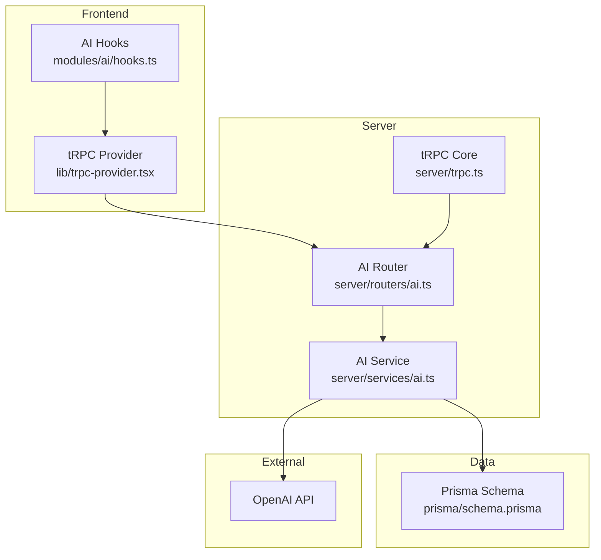
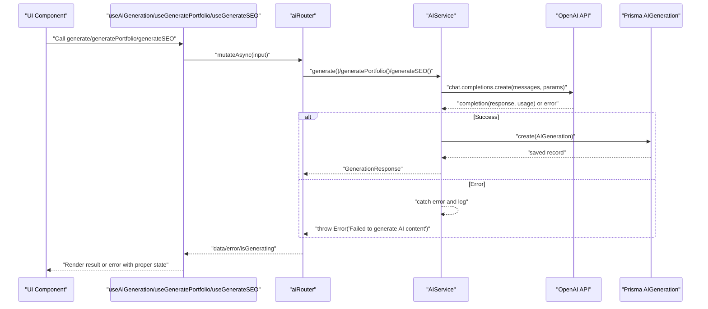
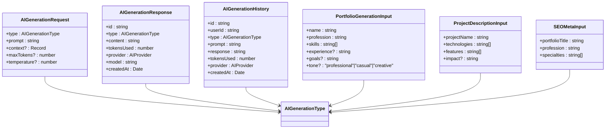
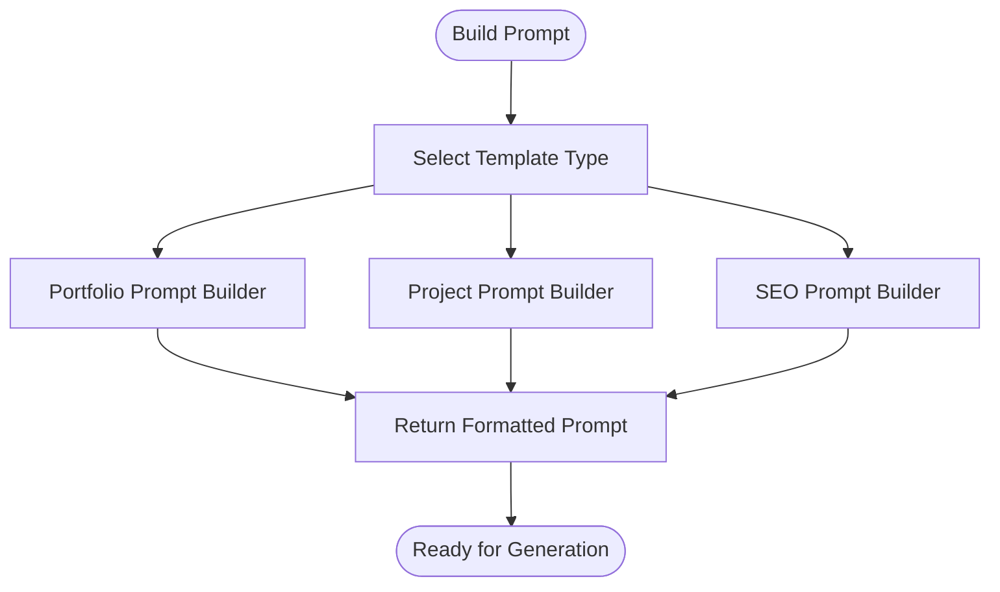
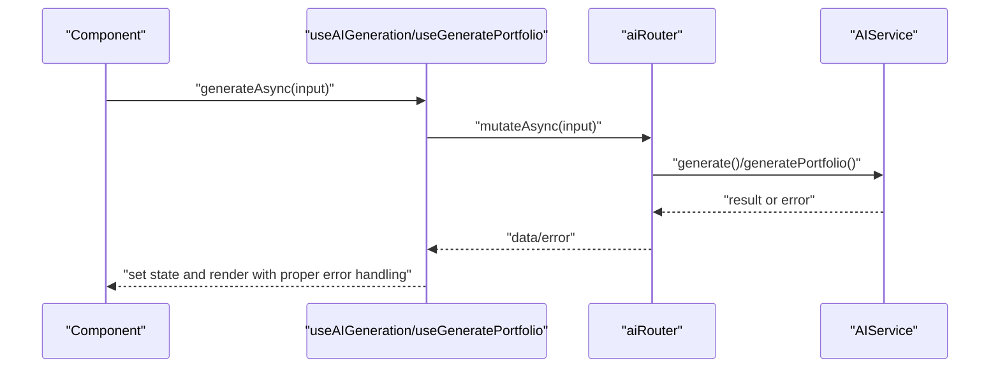
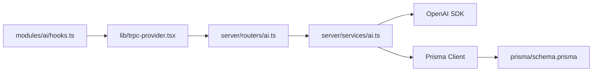

# AI Content Generation

<cite>
**Referenced Files in This Document**
- [modules/ai/index.ts](file://modules/ai/index.ts)
- [modules/ai/hooks.ts](file://modules/ai/hooks.ts)
- [modules/ai/types.ts](file://modules/ai/types.ts)
- [modules/ai/utils.ts](file://modules/ai/utils.ts)
- [modules/ai/constants.ts](file://modules/ai/constants.ts)
- [server/routers/ai.ts](file://server/routers/ai.ts)
- [server/services/ai.ts](file://server/services/ai.ts)
- [server/trpc.ts](file://server/trpc.ts)
- [lib/trpc-provider.tsx](file://lib/trpc-provider.tsx)
- [prisma/schema.prisma](file://prisma/schema.prisma)
- [README.md](file://README.md)
- [docs/IMPLEMENTATION-COMPLETE.md](file://docs/IMPLEMENTATION-COMPLETE.md)
</cite>

## Update Summary
**Changes Made**
- Enhanced AI router with improved request processing capabilities and error handling
- Added comprehensive error handling in AI service with try-catch blocks
- Improved response formatting with structured error messages
- Enhanced system prompts for better content generation quality
- Strengthened input validation and type safety across all AI procedures

## Table of Contents
1. [Introduction](#introduction)
2. [Project Structure](#project-structure)
3. [Core Components](#core-components)
4. [Architecture Overview](#architecture-overview)
5. [Detailed Component Analysis](#detailed-component-analysis)
6. [Enhanced Error Handling](#enhanced-error-handling)
7. [Dependency Analysis](#dependency-analysis)
8. [Performance Considerations](#performance-considerations)
9. [Troubleshooting Guide](#troubleshooting-guide)
10. [Conclusion](#conclusion)
11. [Appendices](#appendices)

## Introduction
This document explains Smartfolio's AI content generation capabilities. It covers how natural language prompts are processed, how portfolio content, project descriptions, and SEO metadata are generated, and how the system integrates with OpenAI. It also documents the AI provider abstraction, configuration, usage tracking, limits, and how to extend the system to support additional AI providers. Practical examples demonstrate generating content, building prompts, and managing usage.

Smartfolio currently integrates with OpenAI for content generation and tracks token usage and generation history per user. The system exposes tRPC endpoints for AI generation and provides React hooks for seamless UI integration. Recent enhancements include improved request processing capabilities and robust error handling for AI-generated content workflows.

**Section sources**
- [README.md](file://README.md#L1-L58)
- [docs/IMPLEMENTATION-COMPLETE.md](file://docs/IMPLEMENTATION-COMPLETE.md#L1-L143)

## Project Structure
The AI functionality is organized into a dedicated module with typed interfaces, utilities, and constants, backed by a tRPC router and a service that interacts with OpenAI and persists results to the database. The enhanced architecture now includes comprehensive error handling and improved request processing.



**Diagram sources**
- [modules/ai/hooks.ts](file://modules/ai/hooks.ts#L1-L76)
- [lib/trpc-provider.tsx](file://lib/trpc-provider.tsx#L1-L50)
- [server/routers/ai.ts](file://server/routers/ai.ts#L1-L105)
- [server/services/ai.ts](file://server/services/ai.ts#L1-L242)
- [server/trpc.ts](file://server/trpc.ts#L1-L61)
- [prisma/schema.prisma](file://prisma/schema.prisma#L214-L229)

**Section sources**
- [modules/ai/index.ts](file://modules/ai/index.ts#L1-L14)
- [modules/ai/hooks.ts](file://modules/ai/hooks.ts#L1-L76)
- [modules/ai/types.ts](file://modules/ai/types.ts#L1-L69)
- [modules/ai/utils.ts](file://modules/ai/utils.ts#L1-L104)
- [modules/ai/constants.ts](file://modules/ai/constants.ts#L1-L41)
- [server/routers/ai.ts](file://server/routers/ai.ts#L1-L105)
- [server/services/ai.ts](file://server/services/ai.ts#L1-L242)
- [server/trpc.ts](file://server/trpc.ts#L1-L61)
- [lib/trpc-provider.tsx](file://lib/trpc-provider.tsx#L1-L50)
- [prisma/schema.prisma](file://prisma/schema.prisma#L214-L229)

## Core Components
- AI Types: Defines providers, generation types, and request/response shapes with enhanced type safety.
- AI Utilities: Prompt builders, token estimation, formatting helpers, and improved error handling.
- AI Constants: Provider/model identifiers, limits, defaults, and prompt template keys.
- AI Hooks: React hooks wrapping tRPC mutations and queries for AI generation with better error states.
- AI Router: tRPC endpoints for generic generation, portfolio content, project descriptions, SEO metadata, history, and usage stats with enhanced validation.
- AI Service: Implements generation via OpenAI chat completions with comprehensive error handling, saves records, parses structured outputs, and computes usage statistics.
- tRPC Provider: Client-side tRPC setup with batching and serialization.
- Database: AIGeneration model stores prompts, responses, tokens used, provider, and timestamps.

**Section sources**
- [modules/ai/types.ts](file://modules/ai/types.ts#L1-L69)
- [modules/ai/utils.ts](file://modules/ai/utils.ts#L1-L104)
- [modules/ai/constants.ts](file://modules/ai/constants.ts#L1-L41)
- [modules/ai/hooks.ts](file://modules/ai/hooks.ts#L1-L76)
- [server/routers/ai.ts](file://server/routers/ai.ts#L1-L105)
- [server/services/ai.ts](file://server/services/ai.ts#L1-L242)
- [lib/trpc-provider.tsx](file://lib/trpc-provider.tsx#L1-L50)
- [prisma/schema.prisma](file://prisma/schema.prisma#L214-L229)

## Architecture Overview
The AI pipeline follows a clear separation of concerns with enhanced error handling:
- Frontend triggers generation via React hooks with proper error state management.
- tRPC routes validate inputs and delegate to the AI service with comprehensive error handling.
- The AI service calls OpenAI, handles errors gracefully, persists successful results, and returns structured data.
- Usage stats and history are queried from the database with proper error handling.



**Diagram sources**
- [modules/ai/hooks.ts](file://modules/ai/hooks.ts#L10-L75)
- [server/routers/ai.ts](file://server/routers/ai.ts#L7-L103)
- [server/services/ai.ts](file://server/services/ai.ts#L41-L87)
- [prisma/schema.prisma](file://prisma/schema.prisma#L214-L229)

## Detailed Component Analysis

### AI Types and Contracts
Defines the AI provider enumeration, generation types, and request/response interfaces with enhanced type safety. These types ensure type safety across the frontend and backend with improved error handling capabilities.



**Diagram sources**
- [modules/ai/types.ts](file://modules/ai/types.ts#L5-L68)

**Section sources**
- [modules/ai/types.ts](file://modules/ai/types.ts#L1-L69)

### AI Utilities and Prompt Builders
Utilities include token formatting, cost estimation, label mapping, prompt truncation, and builders for portfolio, project, and SEO prompts. These utilities centralize prompt engineering and cost/token accounting with enhanced error handling.



**Diagram sources**
- [modules/ai/utils.ts](file://modules/ai/utils.ts#L46-L103)

**Section sources**
- [modules/ai/utils.ts](file://modules/ai/utils.ts#L1-L104)

### AI Constants and Limits
Constants define supported providers and models, tiered usage limits, defaults for tokens and temperature, and prompt template keys. These values guide configuration and enforcement with enhanced error handling.

**Section sources**
- [modules/ai/constants.ts](file://modules/ai/constants.ts#L1-L41)

### AI React Hooks
The hooks wrap tRPC mutations and queries for AI generation, exposing loading states, errors, and results with improved error handling. They simplify integration in components with better state management.



**Diagram sources**
- [modules/ai/hooks.ts](file://modules/ai/hooks.ts#L10-L75)
- [server/routers/ai.ts](file://server/routers/ai.ts#L7-L103)
- [server/services/ai.ts](file://server/services/ai.ts#L41-L87)

**Section sources**
- [modules/ai/hooks.ts](file://modules/ai/hooks.ts#L1-L76)

### AI Router (tRPC Procedures)
The router defines protected procedures for:
- Generic generation with type and prompt
- Portfolio content generation with structured input
- Project description generation
- SEO metadata generation
- History retrieval
- Usage statistics

Protected procedures ensure authentication and pass the user ID to the service with enhanced input validation and error handling.

**Section sources**
- [server/routers/ai.ts](file://server/routers/ai.ts#L1-L105)
- [server/trpc.ts](file://server/trpc.ts#L50-L60)

### AI Service (OpenAI Integration)
The service encapsulates:
- OpenAI initialization with API key
- Chat completions with configurable model, tokens, and temperature
- Structured parsing for portfolio/headline and SEO metadata
- Persistence of generation records with comprehensive error handling
- Aggregation of usage stats by plan limits

```mermaid
classDiagram
class AIService {
-openai : OpenAI
-prisma : PrismaClient
-config : AIServiceConfig
+generate(request) Promise~GenerationResponse~
+generatePortfolio(input) Promise~{about, headline}~
+generateProjectDescription(input) Promise~{description}~
+generateSEO(input) Promise~{title, description, keywords}~
+getHistory(userId) Promise~any[]~
+getUsageStats(userId) Promise~{tokensUsed, generationsCount, tokensLimit, generationsLimit}~
-getSystemPrompt(type) string
}
class AIServiceConfig {
+openaiApiKey : string
+anthropicApiKey? : string
+defaultModel? : "gpt-4"|"gpt-3.5-turbo"|"claude-3"
}
AIService --> AIServiceConfig : "uses"
```

**Diagram sources**
- [server/services/ai.ts](file://server/services/ai.ts#L28-L242)

**Section sources**
- [server/services/ai.ts](file://server/services/ai.ts#L1-L242)

### Database Model: AIGeneration
The AIGeneration model stores:
- User association
- Type of generation
- Prompt and response texts
- Tokens used
- Provider identifier
- Timestamps

This enables auditability, history viewing, and usage analytics with proper indexing for performance.

**Section sources**
- [prisma/schema.prisma](file://prisma/schema.prisma#L214-L229)

## Enhanced Error Handling

The AI system now includes comprehensive error handling mechanisms to ensure robust operation and graceful degradation:

### Service-Level Error Handling
The AI service implements try-catch blocks around OpenAI API calls to handle network errors, invalid API keys, quota limits, and other failures. Errors are logged and re-thrown with meaningful messages.

### Router-Level Input Validation
All tRPC procedures include Zod schema validation to ensure input integrity before processing. Invalid inputs are caught early with structured error responses.

### Client-Side Error State Management
React hooks expose proper error states and loading indicators, allowing components to handle failures gracefully and provide user feedback.

### Usage Statistics Error Handling
The usage statistics calculation includes proper error handling for database queries and plan lookup failures.

**Section sources**
- [server/services/ai.ts](file://server/services/ai.ts#L83-L86)
- [server/routers/ai.ts](file://server/routers/ai.ts#L8-L31)
- [modules/ai/hooks.ts](file://modules/ai/hooks.ts#L13-L19)

## Dependency Analysis
- Frontend depends on tRPC provider and AI hooks with enhanced error handling.
- tRPC router depends on the AI service with improved validation.
- AI service depends on OpenAI SDK and Prisma client with comprehensive error handling.
- Database schema defines the AIGeneration model and relationships with proper indexing.



**Diagram sources**
- [modules/ai/hooks.ts](file://modules/ai/hooks.ts#L1-L76)
- [lib/trpc-provider.tsx](file://lib/trpc-provider.tsx#L1-L50)
- [server/routers/ai.ts](file://server/routers/ai.ts#L1-L105)
- [server/services/ai.ts](file://server/services/ai.ts#L1-L242)
- [prisma/schema.prisma](file://prisma/schema.prisma#L214-L229)

**Section sources**
- [modules/ai/hooks.ts](file://modules/ai/hooks.ts#L1-L76)
- [lib/trpc-provider.tsx](file://lib/trpc-provider.tsx#L1-L50)
- [server/routers/ai.ts](file://server/routers/ai.ts#L1-L105)
- [server/services/ai.ts](file://server/services/ai.ts#L1-L242)
- [prisma/schema.prisma](file://prisma/schema.prisma#L214-L229)

## Performance Considerations
- Token and cost estimation: Use utilities to estimate costs per 1K tokens and format counts for readability.
- Request sizing: Control maxTokens and temperature to balance quality and cost.
- Batching and caching: tRPC batching reduces network overhead; React Query caches responses briefly.
- Rate limiting: The project includes Upstash rate limiting; consider applying it to AI endpoints for additional control.
- Model selection: Prefer smaller models for cheaper, faster iterations; increase size for higher quality when needed.
- Error caching: Failed requests are cached with appropriate error states to prevent repeated failures.

## Troubleshooting Guide
Common issues and remedies:
- Authentication failures: Ensure protected procedures receive a valid session; unauthorized errors indicate missing or invalid auth context.
- OpenAI errors: Network issues, invalid API keys, or quota limits can cause failures; inspect service logs and validate environment configuration.
- Parsing failures: Structured outputs depend on prompt formatting; verify prompt builders and ensure consistent formatting.
- Usage stats discrepancies: Confirm plan mapping and monthly aggregation logic; ensure the Subscription model is correctly linked to users.
- Error handling: Check console logs for AI generation errors and verify proper error state handling in components.

**Section sources**
- [server/trpc.ts](file://server/trpc.ts#L50-L60)
- [server/services/ai.ts](file://server/services/ai.ts#L83-L86)
- [server/services/ai.ts](file://server/services/ai.ts#L190-L228)

## Conclusion
Smartfolio's AI content generation is centered around a clean tRPC API, a focused service layer, and a pragmatic prompt engineering strategy. OpenAI integration is straightforward, with robust persistence and usage tracking. Recent enhancements include comprehensive error handling, improved request processing, and better user experience. The modular design allows easy extension to additional providers and advanced features like streaming and refinement in future iterations.

## Appendices

### Practical Examples

- Generate portfolio content
  - Use the portfolio generation hook to send structured input (name, profession, skills, optional experience/goals, tone).
  - The service builds a tailored prompt and returns parsed headline and about content with enhanced error handling.

- Generate project description
  - Provide project name, technologies, features, and optional impact.
  - The service returns a concise, professional description with proper error states.

- Generate SEO metadata
  - Supply portfolio title, profession, and specialties.
  - The service returns title, meta description, and keywords with structured parsing.

- Build prompts programmatically
  - Use the prompt builders to construct standardized prompts for portfolio, project, and SEO tasks.

- Manage usage and limits
  - Retrieve usage stats to monitor tokens used and generation counts against plan limits.
  - Estimate costs based on token usage and provider rates.

**Section sources**
- [modules/ai/hooks.ts](file://modules/ai/hooks.ts#L22-L56)
- [modules/ai/utils.ts](file://modules/ai/utils.ts#L46-L103)
- [server/services/ai.ts](file://server/services/ai.ts#L89-L180)
- [server/services/ai.ts](file://server/services/ai.ts#L190-L228)

### Extending AI Capabilities

- Add a new AI provider
  - Define provider and model constants.
  - Extend the service to conditionally route requests to the new provider while preserving the same interface.
  - Update prompt templates and parsing logic as needed.

- Enable streaming
  - Introduce streaming endpoints or subscriptions to deliver incremental content chunks.
  - Update UI hooks to handle streamed responses progressively.

- Implement fallback strategies
  - Configure retries with exponential backoff.
  - Switch providers dynamically when quotas or errors occur.

- Voice input and file attachments
  - Integrate transcription services for voice input and document processing for file attachments.
  - Preprocess inputs into natural language prompts before invoking AI generation.

- Enhanced Error Handling
  - Implement comprehensive error logging and monitoring.
  - Add retry mechanisms for transient failures.
  - Provide user-friendly error messages and recovery options.