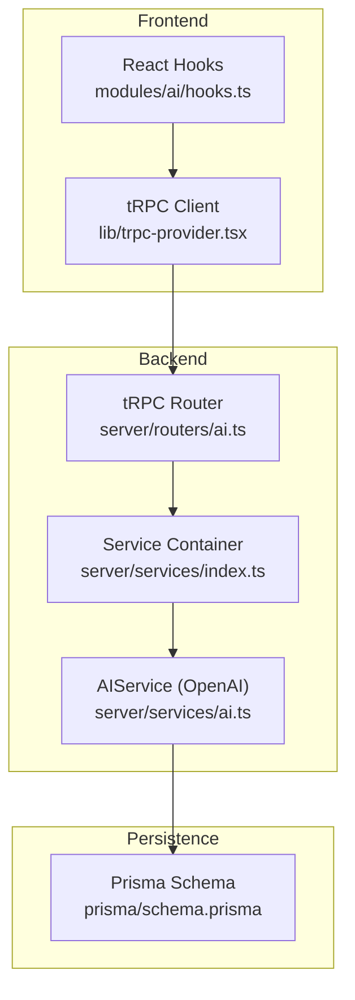
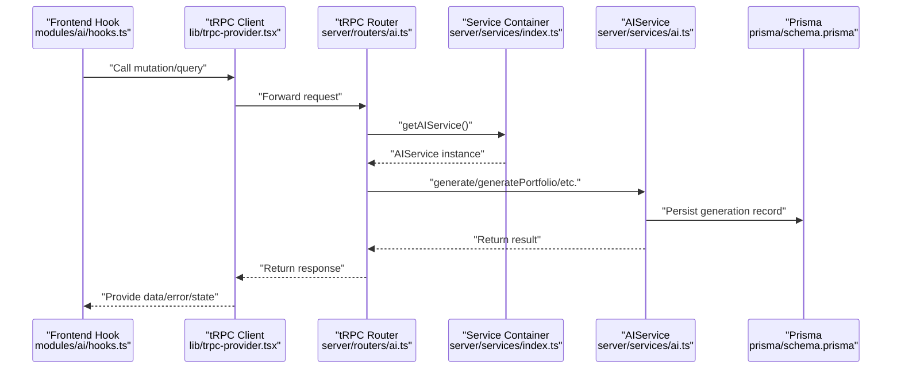
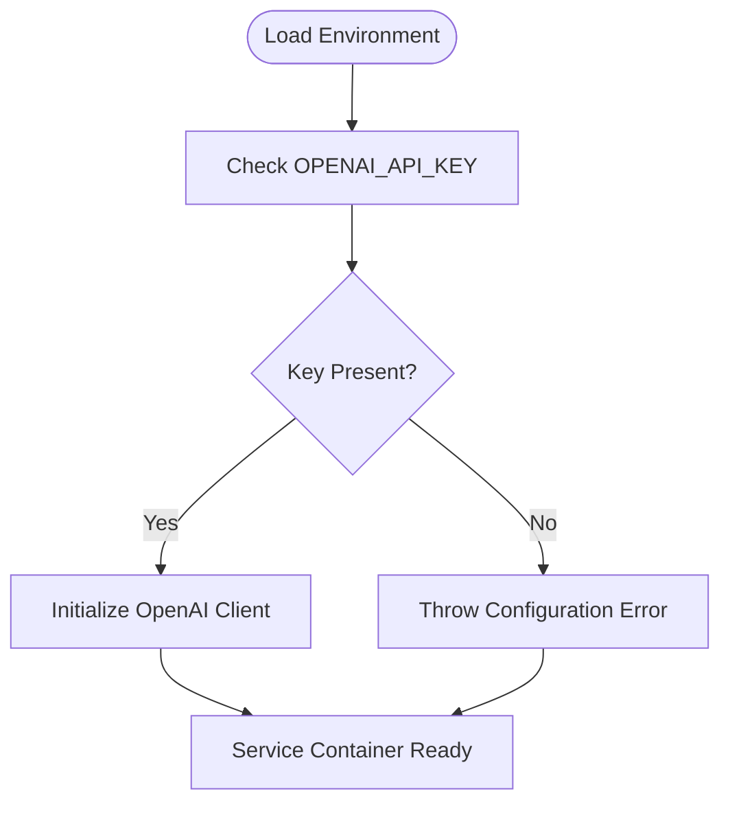
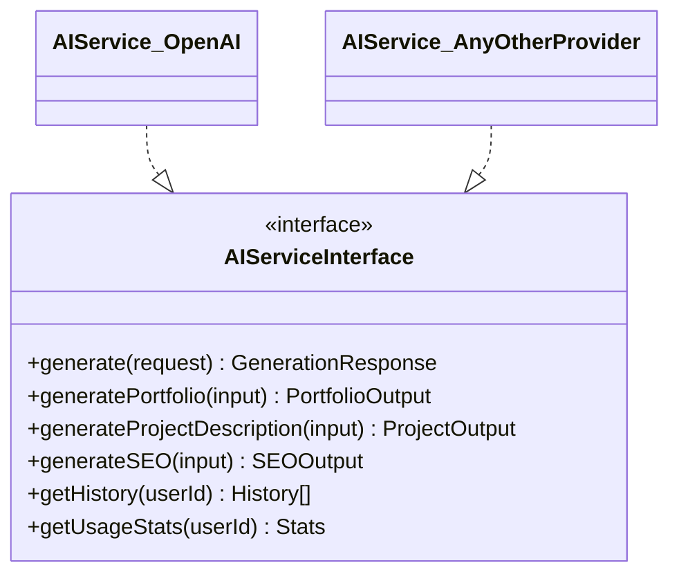
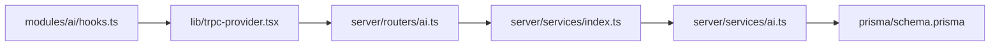

# AI Provider Abstraction

<cite>
**Referenced Files in This Document**
- [modules/ai/index.ts](file://modules/ai/index.ts)
- [modules/ai/types.ts](file://modules/ai/types.ts)
- [modules/ai/constants.ts](file://modules/ai/constants.ts)
- [modules/ai/utils.ts](file://modules/ai/utils.ts)
- [modules/ai/hooks.ts](file://modules/ai/hooks.ts)
- [server/routers/ai.ts](file://server/routers/ai.ts)
- [server/services/ai.ts](file://server/services/ai.ts)
- [server/services/index.ts](file://server/services/index.ts)
- [.env.example](file://.env.example)
- [prisma/schema.prisma](file://prisma/schema.prisma)
- [lib/trpc-provider.tsx](file://lib/trpc-provider.tsx)
</cite>

## Table of Contents
1. [Introduction](#introduction)
2. [Project Structure](#project-structure)
3. [Core Components](#core-components)
4. [Architecture Overview](#architecture-overview)
5. [Detailed Component Analysis](#detailed-component-analysis)
6. [Dependency Analysis](#dependency-analysis)
7. [Performance Considerations](#performance-considerations)
8. [Troubleshooting Guide](#troubleshooting-guide)
9. [Conclusion](#conclusion)
10. [Appendices](#appendices)

## Introduction
This document describes the AI provider abstraction layer in Smartfolio. It explains the provider interface design, the current OpenAI SDK integration, and the mechanisms for provider switching and fallbacks. It also covers configuration management, rate limiting, provider-specific optimizations, cost management, performance monitoring, and guidance for adding new AI providers while maintaining backward compatibility.

## Project Structure
The AI abstraction spans frontend hooks, backend tRPC routers, a service layer, and persistence via Prisma. The frontend exposes React hooks that call tRPC procedures, which delegate to a service container that instantiates provider-specific services. The current implementation integrates OpenAI but is designed to support additional providers through a unified interface.



**Diagram sources**
- [modules/ai/hooks.ts](file://modules/ai/hooks.ts#L1-L76)
- [lib/trpc-provider.tsx](file://lib/trpc-provider.tsx#L1-L50)
- [server/routers/ai.ts](file://server/routers/ai.ts#L1-L105)
- [server/services/index.ts](file://server/services/index.ts#L1-L118)
- [server/services/ai.ts](file://server/services/ai.ts#L1-L242)
- [prisma/schema.prisma](file://prisma/schema.prisma#L214-L229)

**Section sources**
- [modules/ai/index.ts](file://modules/ai/index.ts#L1-L14)
- [modules/ai/types.ts](file://modules/ai/types.ts#L1-L69)
- [modules/ai/constants.ts](file://modules/ai/constants.ts#L1-L41)
- [modules/ai/utils.ts](file://modules/ai/utils.ts#L1-L104)
- [modules/ai/hooks.ts](file://modules/ai/hooks.ts#L1-L76)
- [server/routers/ai.ts](file://server/routers/ai.ts#L1-L105)
- [server/services/ai.ts](file://server/services/ai.ts#L1-L242)
- [server/services/index.ts](file://server/services/index.ts#L1-L118)
- [.env.example](file://.env.example#L30-L41)
- [prisma/schema.prisma](file://prisma/schema.prisma#L214-L229)
- [lib/trpc-provider.tsx](file://lib/trpc-provider.tsx#L1-L50)

## Core Components
- Provider enumeration and generation types define the abstraction surface for AI capabilities.
- Constants encapsulate provider identifiers, model names, usage limits, defaults, and prompt templates.
- Utilities provide token formatting, cost estimation, label mapping, prompt truncation, and prompt builders for portfolio, project, and SEO use cases.
- Frontend hooks wrap tRPC mutations and queries for AI generation, history, and usage statistics.
- Backend tRPC router validates inputs and delegates to the service container’s AI service.
- AI service implements OpenAI integration, saving generation records and computing usage statistics.
- Service container manages singleton instantiation and environment-driven configuration.
- Prisma schema persists AI generation records and supports usage aggregation and plan-based limits.

**Section sources**
- [modules/ai/types.ts](file://modules/ai/types.ts#L5-L69)
- [modules/ai/constants.ts](file://modules/ai/constants.ts#L5-L41)
- [modules/ai/utils.ts](file://modules/ai/utils.ts#L7-L104)
- [modules/ai/hooks.ts](file://modules/ai/hooks.ts#L10-L76)
- [server/routers/ai.ts](file://server/routers/ai.ts#L7-L104)
- [server/services/ai.ts](file://server/services/ai.ts#L28-L242)
- [server/services/index.ts](file://server/services/index.ts#L25-L36)
- [prisma/schema.prisma](file://prisma/schema.prisma#L214-L229)

## Architecture Overview
The AI abstraction follows a layered pattern:
- Frontend: React hooks expose mutation and query functions backed by tRPC.
- Backend: tRPC router enforces input validation and delegates to the service container.
- Services: AIService encapsulates provider-specific logic and persistence.
- Persistence: Prisma models store generation history and support usage analytics.



**Diagram sources**
- [modules/ai/hooks.ts](file://modules/ai/hooks.ts#L10-L76)
- [lib/trpc-provider.tsx](file://lib/trpc-provider.tsx#L18-L49)
- [server/routers/ai.ts](file://server/routers/ai.ts#L7-L104)
- [server/services/index.ts](file://server/services/index.ts#L25-L36)
- [server/services/ai.ts](file://server/services/ai.ts#L41-L87)
- [prisma/schema.prisma](file://prisma/schema.prisma#L214-L229)

## Detailed Component Analysis

### Provider Interface Design
The abstraction defines:
- AIProvider enum for supported providers.
- AIGenerationType enum for generation categories.
- AIGenerationRequest and AIGenerationResponse for standardized request/response contracts.
- AIGenerationHistory for persisted records.
- Portfolio/Project/SEO input types for domain-specific generation.

These types enable provider switching by ensuring consistent contracts regardless of the underlying provider.

**Section sources**
- [modules/ai/types.ts](file://modules/ai/types.ts#L5-L69)

### OpenAI SDK Integration
Current implementation:
- AIService constructs an OpenAI client using the configured API key.
- The generate method sends a chat completion request with a system prompt derived from the generation type, user prompt, and optional parameters.
- Results are persisted to the AIGeneration model with provider metadata.
- Specialized generators (portfolio, project description, SEO) build structured prompts and parse responses accordingly.
- Usage statistics are computed monthly using Prisma aggregations and plan-based limits.

```mermaid
classDiagram
class AIService {
-openai : OpenAI
-prisma : PrismaClient
-config : AIServiceConfig
+constructor(config, prisma)
+generate(request) : Promise~GenerationResponse~
+generatePortfolio(input) : Promise~{about, headline}~
+generateProjectDescription(input) : Promise~{description}~
+generateSEO(input) : Promise~{title, description, keywords}~
+getHistory(userId) : Promise~any[]~
+getUsageStats(userId) : Promise~Stats~
-getSystemPrompt(type) : string
}
class AIServiceConfig {
+openaiApiKey : string
+anthropicApiKey? : string
+defaultModel? : string
}
AIService --> AIServiceConfig : "uses"
```

**Diagram sources**
- [server/services/ai.ts](file://server/services/ai.ts#L28-L242)

**Section sources**
- [server/services/ai.ts](file://server/services/ai.ts#L28-L87)
- [server/services/ai.ts](file://server/services/ai.ts#L89-L180)
- [server/services/ai.ts](file://server/services/ai.ts#L182-L242)

### Provider Switching Mechanisms
The current codebase implements OpenAI exclusively. To switch providers:
- Define a common interface for generation operations in the service layer.
- Add provider-specific adapters implementing the interface.
- Update the service container to instantiate the selected provider based on configuration.
- Ensure AIGenerationResponse includes provider/model metadata for consistent persistence and reporting.

This approach preserves the existing types and hooks while enabling runtime provider selection.

[No sources needed since this section provides conceptual guidance]

### Configuration Management
Configuration is loaded from environment variables and injected into the service container:
- OPENAI_API_KEY is required for OpenAI integration.
- Optional keys for other providers are documented in the environment example.
- The service container initializes AIService with the API key and default model.
- Rate limiting is configured via Upstash Redis when available.



**Diagram sources**
- [server/services/index.ts](file://server/services/index.ts#L25-L36)
- [.env.example](file://.env.example#L33-L34)

**Section sources**
- [server/services/index.ts](file://server/services/index.ts#L25-L36)
- [.env.example](file://.env.example#L30-L41)

### Fallback Strategies
Fallbacks can be implemented at multiple layers:
- Model fallback: If the primary model fails, retry with a secondary model from the same provider.
- Provider fallback: If the primary provider returns errors, transparently switch to a secondary provider and persist the alternate provider in the generation record.
- Retry with backoff: Apply exponential backoff for transient failures.
- Graceful degradation: Return cached or pre-generated content when provider calls fail.

These strategies preserve user experience while maintaining auditability via the AIGeneration model.

[No sources needed since this section provides conceptual guidance]

### Practical Examples

#### Provider Initialization
- Initialize the service container and retrieve AIService for AI operations.
- Ensure OPENAI_API_KEY is set in the environment.

Example reference:
- [server/services/index.ts](file://server/services/index.ts#L25-L36)

#### API Key Management
- Store provider keys in environment variables.
- Reference keys in the service container initialization.

Example reference:
- [.env.example](file://.env.example#L33-L41)
- [server/services/index.ts](file://server/services/index.ts#L28-L31)

#### Rate Limiting Implementation
- Configure Upstash Redis for sliding-window rate limiting.
- Enforce limits at the router or service layer before invoking provider APIs.

Example reference:
- [server/services/index.ts](file://server/services/index.ts#L91-L103)
- [.env.example](file://.env.example#L69-L73)

#### Cost Management
- Estimate token cost using provider-specific rates.
- Enforce usage caps per plan using Prisma aggregates and stored subscription plans.

Example reference:
- [modules/ai/utils.ts](file://modules/ai/utils.ts#L17-L26)
- [server/services/ai.ts](file://server/services/ai.ts#L190-L228)

#### Performance Monitoring
- Track tokens used and generations per month.
- Persist provider and model metadata for attribution and optimization.

Example reference:
- [server/services/ai.ts](file://server/services/ai.ts#L63-L82)
- [prisma/schema.prisma](file://prisma/schema.prisma#L214-L229)

### Integrating Additional AI Providers
To add a new provider (e.g., Anthropic or Google):
- Define a new provider enum value and update types.
- Create a provider adapter class implementing the shared generation interface.
- Extend the service container to select the adapter based on configuration.
- Update prompt templates and parsing logic to match provider outputs.
- Ensure AIGenerationResponse includes provider/model metadata for consistency.



**Diagram sources**
- [modules/ai/types.ts](file://modules/ai/types.ts#L20-L35)
- [server/services/ai.ts](file://server/services/ai.ts#L28-L87)

**Section sources**
- [modules/ai/types.ts](file://modules/ai/types.ts#L5-L35)
- [server/services/ai.ts](file://server/services/ai.ts#L28-L87)

### Maintaining Backward Compatibility
- Keep AIGenerationRequest/AIGenerationResponse stable across provider changes.
- Preserve provider/model metadata in persisted records to avoid breaking downstream analytics.
- Maintain consistent prompt templates and parsing logic per generation type.
- Version provider-specific adapters behind a single interface to isolate changes.

[No sources needed since this section provides conceptual guidance]

## Dependency Analysis
The AI subsystem exhibits low coupling and high cohesion:
- Frontend hooks depend on tRPC types and react-query.
- tRPC router depends on Zod for input validation and the service container.
- AIService depends on OpenAI SDK and Prisma for persistence.
- Service container centralizes dependency creation and configuration.



**Diagram sources**
- [modules/ai/hooks.ts](file://modules/ai/hooks.ts#L1-L76)
- [lib/trpc-provider.tsx](file://lib/trpc-provider.tsx#L1-L50)
- [server/routers/ai.ts](file://server/routers/ai.ts#L1-L105)
- [server/services/index.ts](file://server/services/index.ts#L1-L118)
- [server/services/ai.ts](file://server/services/ai.ts#L1-L242)
- [prisma/schema.prisma](file://prisma/schema.prisma#L214-L229)

**Section sources**
- [modules/ai/hooks.ts](file://modules/ai/hooks.ts#L1-L76)
- [lib/trpc-provider.tsx](file://lib/trpc-provider.tsx#L1-L50)
- [server/routers/ai.ts](file://server/routers/ai.ts#L1-L105)
- [server/services/index.ts](file://server/services/index.ts#L1-L118)
- [server/services/ai.ts](file://server/services/ai.ts#L1-L242)
- [prisma/schema.prisma](file://prisma/schema.prisma#L214-L229)

## Performance Considerations
- Token usage tracking enables cost-aware operations and budget alerts.
- Prompt truncation and token estimation help prevent oversized requests.
- Sliding window rate limiting reduces burst usage and avoids provider throttling.
- Monthly usage aggregation supports plan-based quotas and scaling decisions.

[No sources needed since this section provides general guidance]

## Troubleshooting Guide
Common issues and resolutions:
- Missing API key: Ensure OPENAI_API_KEY is set in the environment; otherwise, initialization will fail.
- Provider errors: Wrap provider calls with error handling and return user-friendly messages while logging stack traces.
- Exceeded usage limits: Enforce plan-based limits and surface informative errors to users.
- Rate limit exceeded: Implement retries with backoff and consider provider fallbacks.

**Section sources**
- [server/services/ai.ts](file://server/services/ai.ts#L83-L86)
- [server/services/ai.ts](file://server/services/ai.ts#L190-L228)
- [server/services/index.ts](file://server/services/index.ts#L91-L103)

## Conclusion
Smartfolio’s AI provider abstraction establishes a clean separation between frontend, backend, and provider-specific logic. The current OpenAI integration is robust, with strong persistence and usage tracking. Extending the abstraction to support additional providers involves defining a common interface, adding provider adapters, and preserving backward compatibility through stable contracts and metadata.

[No sources needed since this section summarizes without analyzing specific files]

## Appendices

### A. Prompt Templates and Usage Limits
- Prompt templates are defined for portfolio intro, project description, skills summary, and SEO metadata.
- Token and generation limits vary by plan and are enforced via Prisma aggregation and subscription records.

**Section sources**
- [modules/ai/constants.ts](file://modules/ai/constants.ts#L35-L41)
- [server/services/ai.ts](file://server/services/ai.ts#L190-L228)

### B. Environment Variables
- OPENAI_API_KEY is mandatory for OpenAI integration.
- Optional keys for Anthropic and Google AI are documented in the environment example.
- Upstash Redis configuration enables rate limiting.

**Section sources**
- [.env.example](file://.env.example#L33-L41)
- [.env.example](file://.env.example#L69-L73)