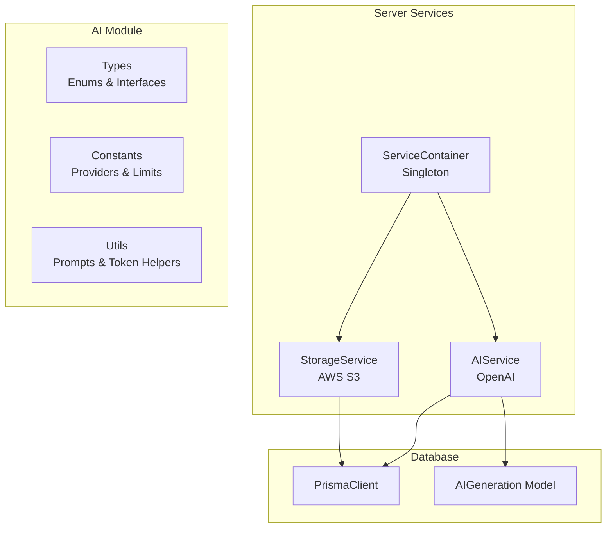
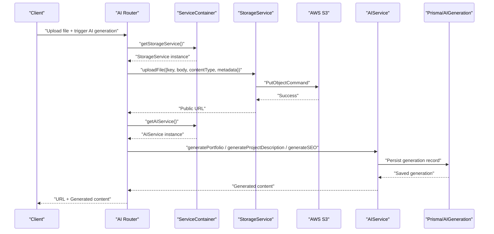
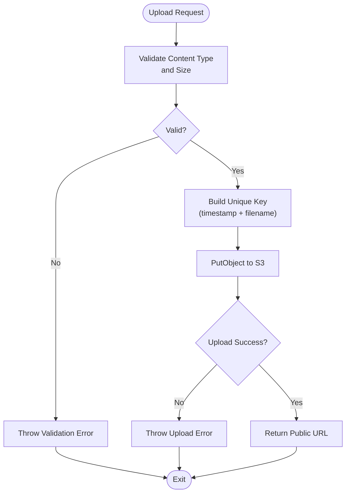
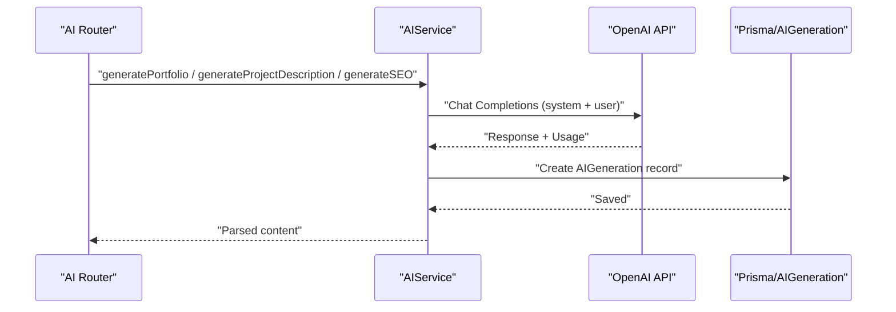
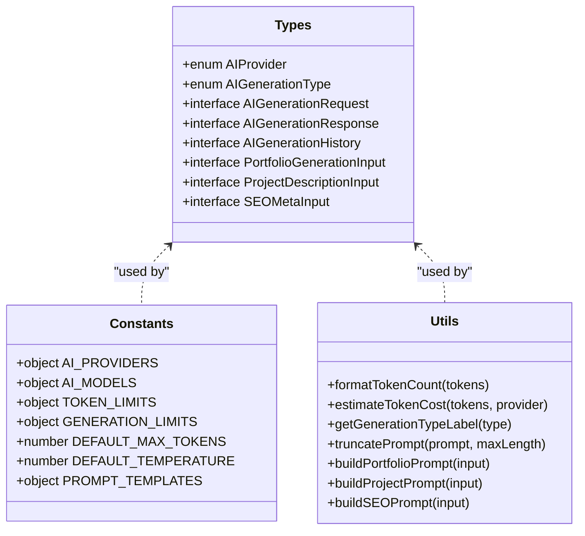
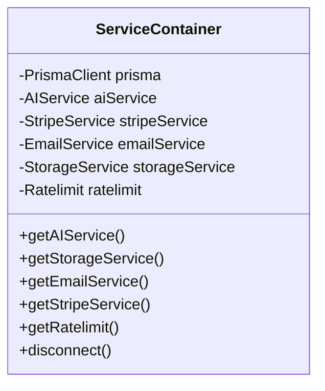
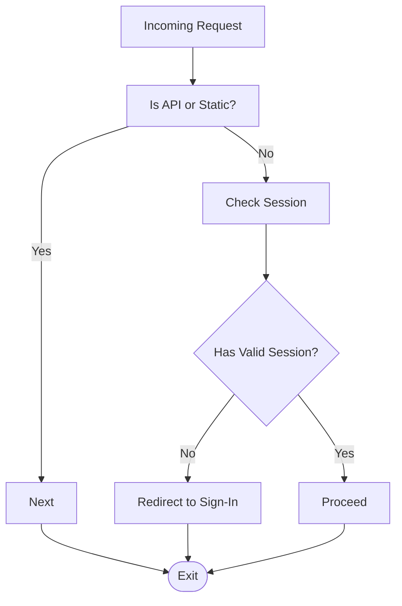
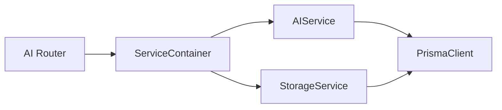

# File Attachment Processing

<cite>
**Referenced Files in This Document**
- [storage.ts](file://server/services/storage.ts)
- [ai.ts](file://server/services/ai.ts)
- [ai.ts](file://server/routers/ai.ts)
- [index.ts](file://modules/ai/index.ts)
- [types.ts](file://modules/ai/types.ts)
- [constants.ts](file://modules/ai/constants.ts)
- [utils.ts](file://modules/ai/utils.ts)
- [index.ts](file://server/services/index.ts)
- [middleware.ts](file://middleware.ts)
- [schema.prisma](file://prisma/schema.prisma)
</cite>

## Table of Contents
1. [Introduction](#introduction)
2. [Project Structure](#project-structure)
3. [Core Components](#core-components)
4. [Architecture Overview](#architecture-overview)
5. [Detailed Component Analysis](#detailed-component-analysis)
6. [Dependency Analysis](#dependency-analysis)
7. [Performance Considerations](#performance-considerations)
8. [Troubleshooting Guide](#troubleshooting-guide)
9. [Conclusion](#conclusion)
10. [Appendices](#appendices)

## Introduction
This document explains Smartfolio’s file attachment processing capabilities within the AI system. It covers the file upload workflow, supported file formats, and content extraction techniques. It also documents image analysis, document processing, and file metadata handling. Practical examples demonstrate AI-powered content generation from uploaded files, file-based content analysis, and multi-modal input processing. Guidance is provided for file size limitations, security scanning, temporary storage management, and cleanup procedures. Finally, it outlines how to extend supported file types and optimize file processing performance.

## Project Structure
Smartfolio organizes file handling around two primary services:
- StorageService: responsible for uploading, deleting, and generating signed URLs for files stored in AWS S3.
- AIService: responsible for AI-powered content generation and history tracking.

The AI module exposes types, constants, utilities, and hooks that support generation workflows and prompt engineering.

**Diagram sources**
- [storage.ts](file://server/services/storage.ts#L19-L170)
- [ai.ts](file://server/services/ai.ts#L28-L242)
- [index.ts](file://server/services/index.ts#L9-L118)
- [types.ts](file://modules/ai/types.ts#L1-L69)
- [constants.ts](file://modules/ai/constants.ts#L1-L41)
- [utils.ts](file://modules/ai/utils.ts#L1-L104)
- [schema.prisma](file://prisma/schema.prisma#L214-L229)

**Section sources**
- [storage.ts](file://server/services/storage.ts#L1-L170)
- [ai.ts](file://server/services/ai.ts#L1-L242)
- [index.ts](file://server/services/index.ts#L1-L118)
- [types.ts](file://modules/ai/types.ts#L1-L69)
- [constants.ts](file://modules/ai/constants.ts#L1-L41)
- [utils.ts](file://modules/ai/utils.ts#L1-L104)
- [schema.prisma](file://prisma/schema.prisma#L1-L230)

## Core Components
- StorageService
  - Uploads files to AWS S3 with configurable metadata.
  - Generates signed URLs for controlled access.
  - Provides helpers to validate image content types and sizes.
  - Supports avatar and portfolio image upload paths with unique keys.
- AIService
  - Integrates with OpenAI to generate portfolio content, project descriptions, and SEO metadata.
  - Persists generation requests and responses to the database with token usage tracking.
  - Exposes usage statistics and history queries.
- AI Module
  - Defines generation types, providers, and limits.
  - Provides prompt builders and token cost estimation utilities.
- ServiceContainer
  - Singleton factory for services, including storage and AI.
- Middleware
  - Manages authentication gating and public route handling; API routes bypass middleware.

**Section sources**
- [storage.ts](file://server/services/storage.ts#L19-L170)
- [ai.ts](file://server/services/ai.ts#L28-L242)
- [types.ts](file://modules/ai/types.ts#L1-L69)
- [constants.ts](file://modules/ai/constants.ts#L1-L41)
- [utils.ts](file://modules/ai/utils.ts#L1-L104)
- [index.ts](file://server/services/index.ts#L9-L118)
- [middleware.ts](file://middleware.ts#L44-L95)

## Architecture Overview
The file attachment workflow integrates with AI generation and storage:

**Diagram sources**
- [ai.ts](file://server/routers/ai.ts#L1-L105)
- [index.ts](file://server/services/index.ts#L25-L36)
- [storage.ts](file://server/services/storage.ts#L36-L54)
- [ai.ts](file://server/services/ai.ts#L41-L87)
- [schema.prisma](file://prisma/schema.prisma#L214-L229)

## Detailed Component Analysis

### StorageService: File Upload and Metadata Handling
- Upload workflow
  - Accepts buffer/body, content type, and optional metadata.
  - Sends PutObjectCommand to S3 and returns a public URL.
- Image-specific helpers
  - Validates content types against a whitelist for images.
  - Enforces maximum file size (default 5 MB).
- Key generation
  - Generates unique keys for avatars and portfolio images with timestamps and sanitized filenames.
- Signed URLs
  - Generates pre-signed URLs with expiration windows for secure access.
- Deletion
  - Deletes objects by key and extracts keys from URLs for portfolio images.

**Diagram sources**
- [storage.ts](file://server/services/storage.ts#L36-L54)
- [storage.ts](file://server/services/storage.ts#L156-L169)
- [storage.ts](file://server/services/storage.ts#L146-L154)

**Section sources**
- [storage.ts](file://server/services/storage.ts#L19-L170)

### AIService: AI-Powered Content Generation
- Generation pipeline
  - Sends chat completions to OpenAI with a system prompt tailored to the generation type.
  - Persists the prompt, response, and token usage to the database.
- Specialized generators
  - Portfolio content: headline and about section.
  - Project description: technical and business-focused description.
  - SEO metadata: title, description, and keywords.
- Usage and history
  - Retrieves generation history and computes monthly usage statistics based on subscription tiers.
- System prompts
  - Tailored system prompts for portfolio content, project descriptions, SEO metadata, and alt text.

**Diagram sources**
- [ai.ts](file://server/services/ai.ts#L41-L87)
- [ai.ts](file://server/services/ai.ts#L89-L123)
- [ai.ts](file://server/services/ai.ts#L125-L148)
- [ai.ts](file://server/services/ai.ts#L150-L180)
- [schema.prisma](file://prisma/schema.prisma#L214-L229)

**Section sources**
- [ai.ts](file://server/services/ai.ts#L28-L242)
- [ai.ts](file://server/routers/ai.ts#L1-L105)
- [schema.prisma](file://prisma/schema.prisma#L214-L229)

### AI Module: Types, Constants, and Utilities
- Types
  - Enumerations for providers and generation types.
  - Interfaces for requests, responses, and histories.
- Constants
  - Provider and model identifiers.
  - Token and generation limits per tier.
  - Default max tokens and temperature.
- Utilities
  - Prompt builders for portfolio, projects, and SEO.
  - Token count formatting and cost estimation.
  - Prompt truncation and label mapping.

**Diagram sources**
- [types.ts](file://modules/ai/types.ts#L1-L69)
- [constants.ts](file://modules/ai/constants.ts#L1-L41)
- [utils.ts](file://modules/ai/utils.ts#L1-L104)

**Section sources**
- [types.ts](file://modules/ai/types.ts#L1-L69)
- [constants.ts](file://modules/ai/constants.ts#L1-L41)
- [utils.ts](file://modules/ai/utils.ts#L1-L104)

### ServiceContainer: Dependency Injection and Access
- Lazily initializes services (AIService, StorageService, EmailService, StripeService).
- Provides a singleton access pattern for services across the application.
- Supplies rate limiting via Upstash Redis.

**Diagram sources**
- [index.ts](file://server/services/index.ts#L9-L118)

**Section sources**
- [index.ts](file://server/services/index.ts#L1-L118)

### Middleware: Authentication and Route Handling
- Public routes and authentication gating.
- API routes bypass middleware checks.
- Redirects authenticated users away from sign-in/sign-up pages.

**Diagram sources**
- [middleware.ts](file://middleware.ts#L44-L95)

**Section sources**
- [middleware.ts](file://middleware.ts#L1-L95)

## Dependency Analysis
- StorageService depends on AWS SDK for S3 and Prisma for persistence.
- AIService depends on OpenAI SDK and Prisma for generation records.
- ServiceContainer provides singletons and coordinates dependencies.
- AI router delegates to ServiceContainer to obtain services.

**Diagram sources**
- [ai.ts](file://server/routers/ai.ts#L1-L105)
- [index.ts](file://server/services/index.ts#L25-L36)
- [storage.ts](file://server/services/storage.ts#L19-L34)
- [ai.ts](file://server/services/ai.ts#L28-L39)

**Section sources**
- [ai.ts](file://server/routers/ai.ts#L1-L105)
- [index.ts](file://server/services/index.ts#L1-L118)
- [storage.ts](file://server/services/storage.ts#L1-L170)
- [ai.ts](file://server/services/ai.ts#L1-L242)

## Performance Considerations
- Token and generation limits
  - Monthly token and generation quotas are enforced per subscription tier.
  - Use token estimation utilities to budget generation costs.
- Image upload constraints
  - Enforce content-type validation and size limits to reduce unnecessary processing.
- Rate limiting
  - Sliding window rate limiting is configured via Upstash Redis to prevent abuse.
- Database indexing
  - Indexes on user ID, type, and creation time improve retrieval performance for history and usage stats.

[No sources needed since this section provides general guidance]

## Troubleshooting Guide
- Upload failures
  - Verify AWS credentials, region, and bucket configuration.
  - Check content type validation and size limits.
- AI generation errors
  - Inspect OpenAI API key and model configuration.
  - Review persisted generation records for usage insights.
- Signed URL issues
  - Confirm expiration time and bucket permissions.
- Cleanup and deletion
  - Use delete methods for S3 objects and database records when removing content.

**Section sources**
- [storage.ts](file://server/services/storage.ts#L36-L54)
- [storage.ts](file://server/services/storage.ts#L56-L68)
- [ai.ts](file://server/services/ai.ts#L83-L86)
- [schema.prisma](file://prisma/schema.prisma#L214-L229)

## Conclusion
Smartfolio’s file attachment processing integrates AWS S3-backed storage with AI-driven content generation. The system validates uploads, manages metadata, and persists generation history for auditability. By leveraging the AI module’s prompt builders and the service container’s dependency management, developers can extend supported file types, optimize performance, and maintain robust security and cleanup procedures.

[No sources needed since this section summarizes without analyzing specific files]

## Appendices

### Supported File Formats and Validation
- Images
  - Content types: JPEG, PNG, WebP, GIF.
  - Default size limit: 5 MB.
- Documents
  - Not explicitly handled in the referenced files; AI generation focuses on text-based prompts and structured outputs.

**Section sources**
- [storage.ts](file://server/services/storage.ts#L156-L169)

### Practical Examples
- AI-powered content generation from uploaded files
  - Use specialized generators to produce portfolio content, project descriptions, and SEO metadata.
- File-based content analysis
  - Store files in S3 and reference them via signed URLs; leverage AI to enrich metadata and descriptions.
- Multi-modal input processing
  - Combine image uploads with text prompts to generate alt text and descriptions.

**Section sources**
- [ai.ts](file://server/services/ai.ts#L89-L180)
- [storage.ts](file://server/services/storage.ts#L70-L82)

### Extending Supported File Types
- Add content-type checks and validation rules in StorageService.
- Introduce new upload handlers and key generation strategies for documents or other media.
- Update router inputs and service methods to accommodate new formats.

**Section sources**
- [storage.ts](file://server/services/storage.ts#L12-L17)
- [storage.ts](file://server/services/storage.ts#L146-L154)

### Security Scanning and Temporary Storage
- Scanning
  - Integrate virus scanning or malware detection at ingestion points before storing files.
- Temporary storage
  - Use short-lived signed URLs for previews and implement TTL-based cleanup policies.
- Cleanup procedures
  - Implement scheduled jobs to remove expired URLs and orphaned S3 objects.

[No sources needed since this section provides general guidance]