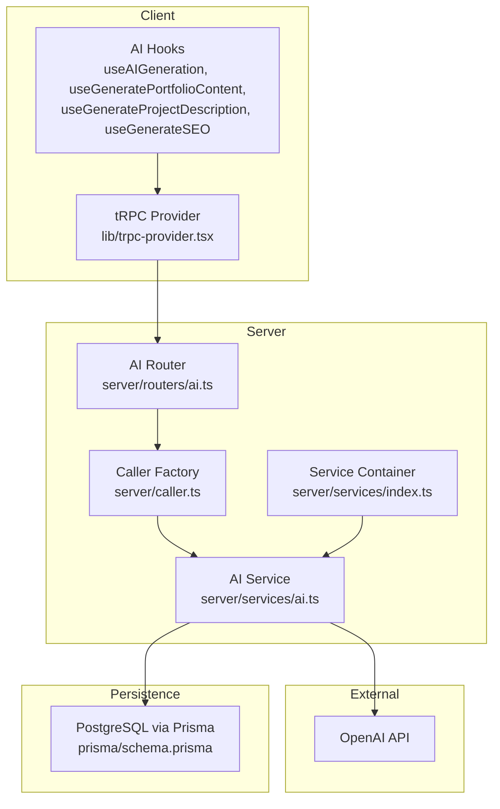
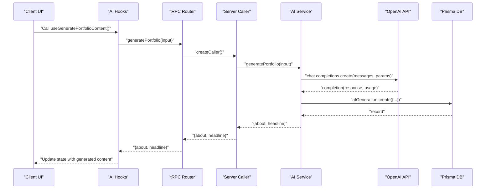
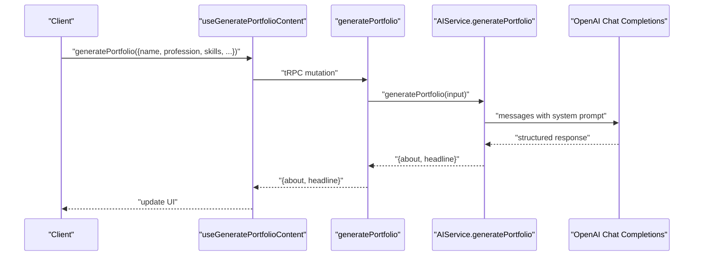
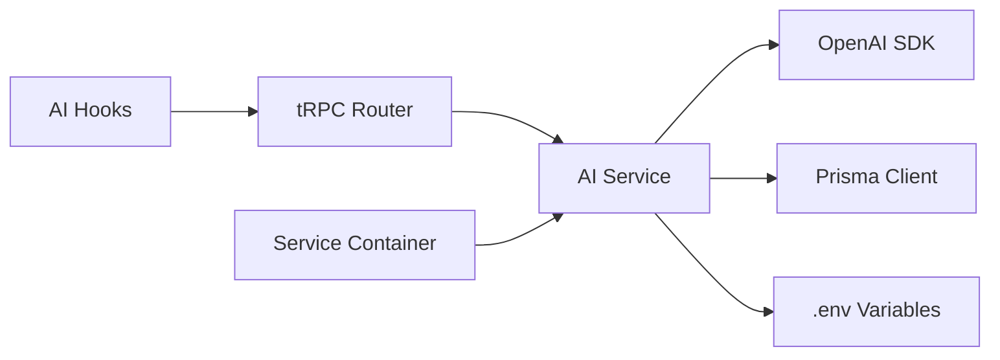

# Natural Language Processing

<cite>
**Referenced Files in This Document**
- [modules/ai/index.ts](file://modules/ai/index.ts)
- [modules/ai/types.ts](file://modules/ai/types.ts)
- [modules/ai/constants.ts](file://modules/ai/constants.ts)
- [modules/ai/utils.ts](file://modules/ai/utils.ts)
- [modules/ai/hooks.ts](file://modules/ai/hooks.ts)
- [server/routers/ai.ts](file://server/routers/ai.ts)
- [server/services/ai.ts](file://server/services/ai.ts)
- [server/services/index.ts](file://server/services/index.ts)
- [prisma/schema.prisma](file://prisma/schema.prisma)
- [.env](file://.env)
- [lib/trpc-provider.tsx](file://lib/trpc-provider.tsx)
- [server/caller.ts](file://server/caller.ts)
</cite>

## Table of Contents
1. [Introduction](#introduction)
2. [Project Structure](#project-structure)
3. [Core Components](#core-components)
4. [Architecture Overview](#architecture-overview)
5. [Detailed Component Analysis](#detailed-component-analysis)
6. [Dependency Analysis](#dependency-analysis)
7. [Performance Considerations](#performance-considerations)
8. [Troubleshooting Guide](#troubleshooting-guide)
9. [Conclusion](#conclusion)
10. [Appendices](#appendices)

## Introduction
This document explains Smartfolio’s natural language processing capabilities powered by AI. It covers text generation workflows, prompt engineering patterns, content quality controls, OpenAI API integration, model selection, parameter tuning, cost management, and practical examples for generating portfolio content from natural language. It also documents prompt templates, content parsing, rate limiting, and usage tracking.

## Project Structure
Smartfolio organizes AI functionality across client hooks, server-side tRPC routers, and a dedicated AI service. The AI service integrates with OpenAI to generate content and persists generation records in the database. The system supports multiple generation types (portfolio content, project descriptions, SEO metadata) and includes utilities for token estimation, prompt truncation, and label formatting.

**Diagram sources**
- [lib/trpc-provider.tsx](file://lib/trpc-provider.tsx#L1-L50)
- [server/routers/ai.ts](file://server/routers/ai.ts#L1-L105)
- [server/caller.ts](file://server/caller.ts#L1-L7)
- [server/services/ai.ts](file://server/services/ai.ts#L1-L242)
- [server/services/index.ts](file://server/services/index.ts#L1-L118)
- [prisma/schema.prisma](file://prisma/schema.prisma#L214-L229)

**Section sources**
- [modules/ai/index.ts](file://modules/ai/index.ts#L1-L14)
- [modules/ai/hooks.ts](file://modules/ai/hooks.ts#L1-L76)
- [server/routers/ai.ts](file://server/routers/ai.ts#L1-L105)
- [server/services/ai.ts](file://server/services/ai.ts#L1-L242)
- [server/services/index.ts](file://server/services/index.ts#L1-L118)
- [prisma/schema.prisma](file://prisma/schema.prisma#L214-L229)
- [lib/trpc-provider.tsx](file://lib/trpc-provider.tsx#L1-L50)
- [server/caller.ts](file://server/caller.ts#L1-L7)

## Core Components
- AI Types define supported providers, generation types, request/response shapes, and structured inputs for portfolio, project, and SEO generation.
- AI Constants define provider/model identifiers, token/generation limits, defaults, and prompt template keys.
- AI Utils provide prompt builders for portfolio, project, and SEO, plus token formatting, cost estimation, label mapping, and prompt truncation.
- AI Hooks expose tRPC mutations and queries for client-side generation and history retrieval.
- AI Router defines protected tRPC procedures for generic generation and specialized generators.
- AI Service encapsulates OpenAI integration, system prompts, response parsing, persistence, usage statistics, and limits.
- Service Container initializes the AI service with environment configuration and exposes it to routers.
- Prisma schema models AI generation records and integrates with user and subscription models.

**Section sources**
- [modules/ai/types.ts](file://modules/ai/types.ts#L1-L69)
- [modules/ai/constants.ts](file://modules/ai/constants.ts#L1-L41)
- [modules/ai/utils.ts](file://modules/ai/utils.ts#L1-L104)
- [modules/ai/hooks.ts](file://modules/ai/hooks.ts#L1-L76)
- [server/routers/ai.ts](file://server/routers/ai.ts#L1-L105)
- [server/services/ai.ts](file://server/services/ai.ts#L1-L242)
- [server/services/index.ts](file://server/services/index.ts#L1-L118)
- [prisma/schema.prisma](file://prisma/schema.prisma#L214-L229)

## Architecture Overview
The AI pipeline follows a clear separation of concerns:
- Client triggers generation via tRPC hooks.
- Server router validates inputs and delegates to the AI service.
- AI service builds system/user messages, calls OpenAI, parses responses, and persists records.
- Usage stats and history are computed and exposed via tRPC queries.

**Diagram sources**
- [modules/ai/hooks.ts](file://modules/ai/hooks.ts#L22-L32)
- [server/routers/ai.ts](file://server/routers/ai.ts#L33-L52)
- [server/services/ai.ts](file://server/services/ai.ts#L89-L123)
- [prisma/schema.prisma](file://prisma/schema.prisma#L214-L229)

## Detailed Component Analysis

### Prompt Engineering Patterns
- Portfolio content prompt: Builds a narrative with name, profession, skills, optional experience/goals, and tone. Requests a headline and an about section with explicit length guidance.
- Project description prompt: Highlights technologies, features, optional impact, and requests a concise, professional description.
- SEO metadata prompt: Asks for title, meta description, and keywords with character/word constraints.

These prompts are designed to reduce ambiguity and improve consistency. They include:
- Clear roles for the AI (portfolio writer, technical writer, SEO specialist).
- Structured output expectations (numbered lists).
- Constraints on length and tone.

**Section sources**
- [modules/ai/utils.ts](file://modules/ai/utils.ts#L46-L65)
- [modules/ai/utils.ts](file://modules/ai/utils.ts#L67-L82)
- [modules/ai/utils.ts](file://modules/ai/utils.ts#L84-L103)
- [server/services/ai.ts](file://server/services/ai.ts#L89-L123)
- [server/services/ai.ts](file://server/services/ai.ts#L125-L148)
- [server/services/ai.ts](file://server/services/ai.ts#L150-L180)

### Content Quality Controls
- System prompts tailor the AI’s persona per generation type to maintain quality and focus.
- Response parsing enforces structure for multi-part outputs (headline, about, title/description/keywords).
- Token limits and defaults constrain output sizes to manage cost and latency.
- Truncation utility ensures prompts remain concise when needed.

**Section sources**
- [server/services/ai.ts](file://server/services/ai.ts#L230-L241)
- [modules/ai/utils.ts](file://modules/ai/utils.ts#L41-L44)
- [modules/ai/constants.ts](file://modules/ai/constants.ts#L32-L33)

### OpenAI API Integration and Model Selection
- The AI service initializes the OpenAI SDK with the configured API key and default model.
- The router accepts a generic generation endpoint with optional maxTokens and temperature overrides.
- The service constructs chat completions with a system message and user prompt, then persists the result.

Environment configuration:
- OPENAI_API_KEY is loaded from the environment and passed to the AI service.

**Section sources**
- [server/services/ai.ts](file://server/services/ai.ts#L28-L39)
- [server/services/index.ts](file://server/services/index.ts#L25-L36)
- [server/routers/ai.ts](file://server/routers/ai.ts#L7-L31)
- [server/services/ai.ts](file://server/services/ai.ts#L41-L87)
- [.env](file://.env#L1-L17)

### Parameter Tuning
- Default maxTokens and temperature are defined centrally and used when not overridden.
- The generic generation endpoint allows overriding maxTokens; temperature is configurable in the request shape but not exposed in the current router.
- Adjusting maxTokens impacts cost and latency; lowering reduces cost but risks truncation.

**Section sources**
- [modules/ai/constants.ts](file://modules/ai/constants.ts#L32-L33)
- [modules/ai/types.ts](file://modules/ai/types.ts#L20-L26)
- [server/routers/ai.ts](file://server/routers/ai.ts#L7-L31)
- [server/services/ai.ts](file://server/services/ai.ts#L41-L57)

### Practical Examples: Portfolio Content Generation
- Use the portfolio generator hook to submit name, profession, skills, optional experience/goals, and tone.
- The service generates a headline and an about section, then parses and returns them.
- Example flow:
  - Client calls the portfolio generation hook.
  - Server composes a structured prompt and invokes OpenAI.
  - Service persists the generation record and returns parsed content.

**Diagram sources**
- [modules/ai/hooks.ts](file://modules/ai/hooks.ts#L22-L32)
- [server/routers/ai.ts](file://server/routers/ai.ts#L33-L52)
- [server/services/ai.ts](file://server/services/ai.ts#L89-L123)

**Section sources**
- [modules/ai/hooks.ts](file://modules/ai/hooks.ts#L22-L32)
- [server/routers/ai.ts](file://server/routers/ai.ts#L33-L52)
- [server/services/ai.ts](file://server/services/ai.ts#L89-L123)

### Content Refinement Techniques
- Iterative prompting: Add constraints (length, tone, audience) to refine outputs.
- Structured prompts: Numbered sections guide AI to produce structured responses.
- Post-processing: Normalize whitespace and strip prefixes to clean outputs.

**Section sources**
- [modules/ai/utils.ts](file://modules/ai/utils.ts#L46-L65)
- [modules/ai/utils.ts](file://modules/ai/utils.ts#L84-L103)
- [server/services/ai.ts](file://server/services/ai.ts#L118-L120)
- [server/services/ai.ts](file://server/services/ai.ts#L174-L177)

### Error Handling Strategies
- Centralized error logging in the AI service with a standardized error message on failure.
- tRPC mutations surface errors to the UI via hooks for user feedback.
- Consider adding retry logic, circuit breakers, and fallback content for production hardening.

**Section sources**
- [server/services/ai.ts](file://server/services/ai.ts#L83-L86)
- [modules/ai/hooks.ts](file://modules/ai/hooks.ts#L10-L20)

### Prompt Optimization
- Keep prompts concise yet descriptive.
- Use examples sparingly; prefer explicit constraints.
- Test variations with different temperatures and token limits to balance creativity and consistency.

[No sources needed since this section provides general guidance]

### Content Validation
- Validate inputs at the router level (Zod) to prevent malformed requests.
- Enforce minimum/maximum lengths for generated content.
- Sanitize and normalize outputs before saving to the database.

**Section sources**
- [server/routers/ai.ts](file://server/routers/ai.ts#L8-L21)
- [server/services/ai.ts](file://server/services/ai.ts#L118-L120)

### Response Streaming Mechanisms
- Current implementation uses synchronous chat completions.
- To support streaming, integrate OpenAI’s streaming API and forward chunks to the client via tRPC streams or Server-Sent Events.

[No sources needed since this section proposes future enhancement]

### Cost Management
- Token estimation utility approximates cost per 1K tokens by provider.
- Usage stats compute monthly totals and compare against plan limits.
- Control costs by tuning maxTokens, selecting lower-cost models, and monitoring usage.

**Section sources**
- [modules/ai/utils.ts](file://modules/ai/utils.ts#L17-L26)
- [server/services/ai.ts](file://server/services/ai.ts#L190-L228)
- [modules/ai/constants.ts](file://modules/ai/constants.ts#L20-L30)

### Customizing AI Prompts
- Extend the prompt builders in AI utils or add new templates in constants.
- Update system prompts in the AI service to reflect new personas or domains.
- Maintain backward compatibility by versioning prompt templates and deprecating old ones.

**Section sources**
- [modules/ai/utils.ts](file://modules/ai/utils.ts#L46-L103)
- [modules/ai/constants.ts](file://modules/ai/constants.ts#L35-L40)
- [server/services/ai.ts](file://server/services/ai.ts#L230-L241)

## Dependency Analysis
The AI subsystem depends on:
- tRPC for client-server communication.
- OpenAI SDK for text generation.
- Prisma for persistence of generation records and usage statistics.
- Environment variables for API keys and service configuration.

**Diagram sources**
- [modules/ai/hooks.ts](file://modules/ai/hooks.ts#L1-L76)
- [server/routers/ai.ts](file://server/routers/ai.ts#L1-L105)
- [server/services/ai.ts](file://server/services/ai.ts#L1-L242)
- [server/services/index.ts](file://server/services/index.ts#L1-L118)
- [.env](file://.env#L1-L17)

**Section sources**
- [lib/trpc-provider.tsx](file://lib/trpc-provider.tsx#L1-L50)
- [server/services/index.ts](file://server/services/index.ts#L25-L36)
- [prisma/schema.prisma](file://prisma/schema.prisma#L214-L229)

## Performance Considerations
- Tune maxTokens and temperature to balance quality and cost.
- Use smaller models for simpler tasks to reduce latency and cost.
- Cache frequently used prompts and pre-computed content where appropriate.
- Monitor token usage and set alerts near plan limits.

[No sources needed since this section provides general guidance]

## Troubleshooting Guide
- API key issues: Verify OPENAI_API_KEY is set in the environment and accessible to the service container.
- Rate limiting: The service container initializes Upstash Redis for rate limiting; ensure UPSTASH_REDIS_REST_URL and UPSTASH_REDIS_REST_TOKEN are configured if enabling rate limiting.
- Generation failures: Inspect logs for standardized error messages and retry with adjusted parameters.
- Usage discrepancies: Compare returned usage stats with database aggregates to validate limits.

**Section sources**
- [.env](file://.env#L1-L17)
- [server/services/index.ts](file://server/services/index.ts#L91-L103)
- [server/services/ai.ts](file://server/services/ai.ts#L83-L86)
- [server/services/ai.ts](file://server/services/ai.ts#L190-L228)

## Conclusion
Smartfolio’s AI system provides a robust foundation for natural language generation with structured prompts, quality controls, and usage tracking. By leveraging OpenAI, centralizing configuration, and exposing intuitive hooks, it enables developers to build powerful content generation features while maintaining cost awareness and operational reliability.

[No sources needed since this section summarizes without analyzing specific files]

## Appendices

### A. Prompt Templates Reference
- Portfolio Intro: Tailored for compelling “About” sections with tone and skill emphasis.
- Project Description: Emphasizes technologies, features, and impact.
- Skills Summary: Concise technical summaries.
- SEO Metadata: Optimized title, description, and keywords.

**Section sources**
- [modules/ai/constants.ts](file://modules/ai/constants.ts#L35-L40)
- [modules/ai/utils.ts](file://modules/ai/utils.ts#L46-L103)

### B. Usage Statistics and Limits
- Monthly token and generation counts are aggregated per user.
- Limits vary by subscription plan; stats include current usage versus limits.

**Section sources**
- [server/services/ai.ts](file://server/services/ai.ts#L190-L228)
- [prisma/schema.prisma](file://prisma/schema.prisma#L172-L191)