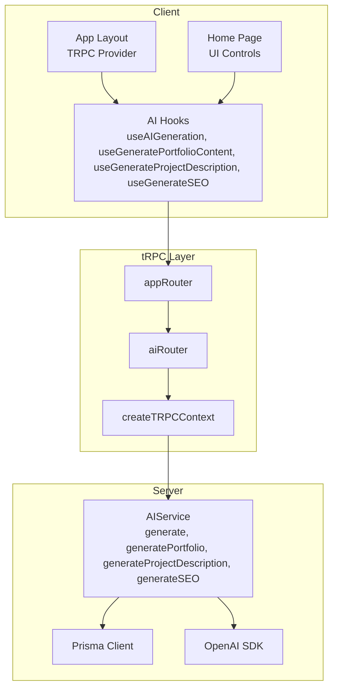
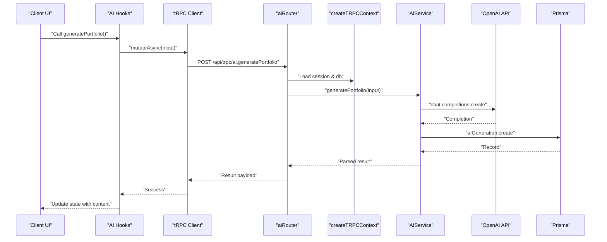
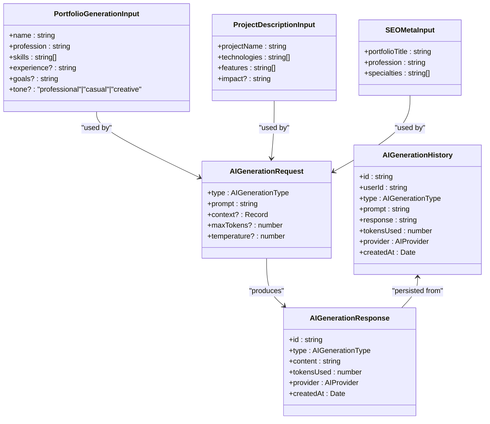
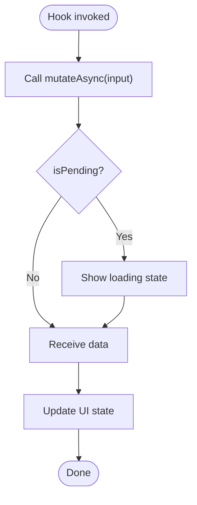
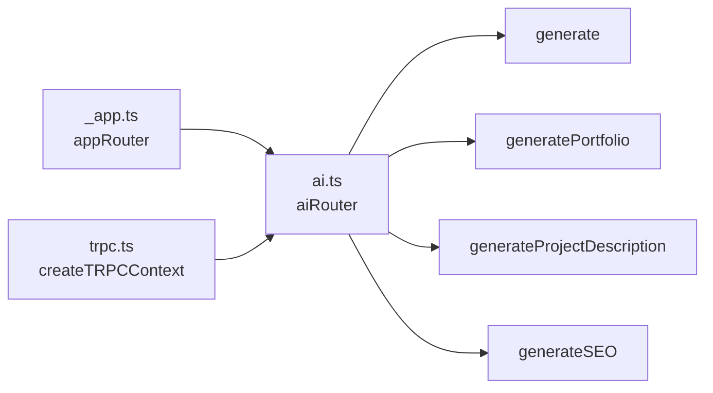
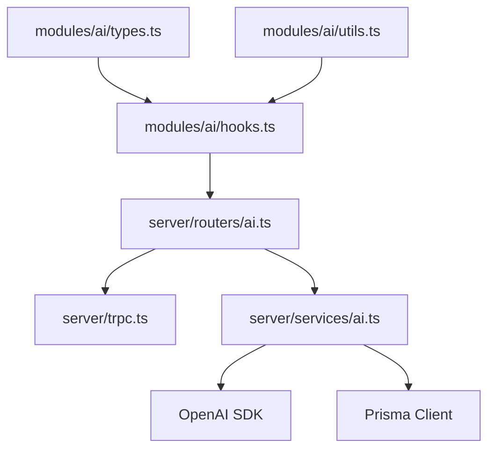

# Real-time Content Streaming

<cite>
**Referenced Files in This Document**
- [modules/ai/hooks.ts](file://modules/ai/hooks.ts)
- [modules/ai/types.ts](file://modules/ai/types.ts)
- [modules/ai/utils.ts](file://modules/ai/utils.ts)
- [server/routers/ai.ts](file://server/routers/ai.ts)
- [server/services/ai.ts](file://server/services/ai.ts)
- [server/trpc.ts](file://server/trpc.ts)
- [server/routers/_app.ts](file://server/routers/_app.ts)
- [lib/trpc-provider.tsx](file://lib/trpc-provider.tsx)
- [app/layout.tsx](file://app/layout.tsx)
- [app/page.tsx](file://app/page.tsx)
</cite>

## Table of Contents
1. [Introduction](#introduction)
2. [Project Structure](#project-structure)
3. [Core Components](#core-components)
4. [Architecture Overview](#architecture-overview)
5. [Detailed Component Analysis](#detailed-component-analysis)
6. [Dependency Analysis](#dependency-analysis)
7. [Performance Considerations](#performance-considerations)
8. [Troubleshooting Guide](#troubleshooting-guide)
9. [Conclusion](#conclusion)
10. [Appendices](#appendices)

## Introduction
This document explains Smartfolio’s AI-driven content generation capabilities and how they integrate with tRPC to support real-time-like streaming experiences in the browser. While the current implementation performs synchronous mutations and returns complete results, the architecture is designed to accommodate progressive content delivery and real-time UI updates. This guide covers the tRPC integration, client-side hook usage, backend service orchestration, and practical guidance for evolving toward streaming APIs with minimal disruption.

## Project Structure
Smartfolio organizes AI features under a dedicated module with typed contracts, hooks for React, and a backend service that integrates with OpenAI. The tRPC router exposes AI procedures, while the tRPC provider wires client-side React Query integration.



**Diagram sources**
- [app/layout.tsx](file://app/layout.tsx#L1-L36)
- [lib/trpc-provider.tsx](file://lib/trpc-provider.tsx#L1-L50)
- [modules/ai/hooks.ts](file://modules/ai/hooks.ts#L1-L76)
- [server/routers/_app.ts](file://server/routers/_app.ts#L1-L21)
- [server/routers/ai.ts](file://server/routers/ai.ts#L1-L105)
- [server/trpc.ts](file://server/trpc.ts#L1-L61)
- [server/services/ai.ts](file://server/services/ai.ts#L1-L242)

**Section sources**
- [app/layout.tsx](file://app/layout.tsx#L1-L36)
- [lib/trpc-provider.tsx](file://lib/trpc-provider.tsx#L1-L50)
- [modules/ai/hooks.ts](file://modules/ai/hooks.ts#L1-L76)
- [server/routers/_app.ts](file://server/routers/_app.ts#L1-L21)
- [server/routers/ai.ts](file://server/routers/ai.ts#L1-L105)
- [server/trpc.ts](file://server/trpc.ts#L1-L61)
- [server/services/ai.ts](file://server/services/ai.ts#L1-L242)

## Core Components
- AI Types define generation request/response shapes and enums for generation types and providers.
- AI Hooks wrap tRPC mutations for generating portfolio content, project descriptions, and SEO metadata.
- AI Service orchestrates OpenAI completions, persists results, and parses structured outputs.
- tRPC Router exposes protected procedures for AI generation and analytics.
- tRPC Provider configures React Query and batching for efficient client-server communication.

**Section sources**
- [modules/ai/types.ts](file://modules/ai/types.ts#L1-L69)
- [modules/ai/hooks.ts](file://modules/ai/hooks.ts#L1-L76)
- [server/services/ai.ts](file://server/services/ai.ts#L1-L242)
- [server/routers/ai.ts](file://server/routers/ai.ts#L1-L105)
- [lib/trpc-provider.tsx](file://lib/trpc-provider.tsx#L1-L50)

## Architecture Overview
The AI pipeline follows a clear separation of concerns:
- Client triggers generation via React hooks.
- tRPC router validates inputs and delegates to the AI service.
- AI service calls OpenAI, persists the result, and returns structured data.
- Client updates UI with the final result.



**Diagram sources**
- [modules/ai/hooks.ts](file://modules/ai/hooks.ts#L22-L32)
- [server/routers/ai.ts](file://server/routers/ai.ts#L33-L52)
- [server/trpc.ts](file://server/trpc.ts#L12-L20)
- [server/services/ai.ts](file://server/services/ai.ts#L89-L123)

## Detailed Component Analysis

### AI Types and Contracts
- Enums define supported generation types and providers.
- Interfaces standardize request/response payloads and history records.
- Utility functions support prompt building and formatting.



**Diagram sources**
- [modules/ai/types.ts](file://modules/ai/types.ts#L5-L69)

**Section sources**
- [modules/ai/types.ts](file://modules/ai/types.ts#L1-L69)

### AI Hooks: Client-side Stream Processing and UI Updates
- useAIGeneration, useGeneratePortfolioContent, useGenerateProjectDescription, useGenerateSEO wrap tRPC mutations.
- Expose mutate/mutateAsync, loading state, error, and returned data for immediate UI updates.
- To enable progressive updates, replace mutateAsync with a streaming-aware handler that processes incremental chunks and updates state incrementally.



**Diagram sources**
- [modules/ai/hooks.ts](file://modules/ai/hooks.ts#L10-L20)
- [modules/ai/hooks.ts](file://modules/ai/hooks.ts#L22-L32)
- [modules/ai/hooks.ts](file://modules/ai/hooks.ts#L34-L44)
- [modules/ai/hooks.ts](file://modules/ai/hooks.ts#L46-L56)

**Section sources**
- [modules/ai/hooks.ts](file://modules/ai/hooks.ts#L1-L76)

### tRPC Integration: Protected Procedures and Context
- aiRouter defines protected mutations for generic generation and specialized generators.
- createTRPCContext injects session and database access for authorization and persistence.
- appRouter composes feature routers including aiRouter.



**Diagram sources**
- [server/routers/_app.ts](file://server/routers/_app.ts#L1-L21)
- [server/routers/ai.ts](file://server/routers/ai.ts#L1-L105)
- [server/trpc.ts](file://server/trpc.ts#L12-L20)

**Section sources**
- [server/routers/ai.ts](file://server/routers/ai.ts#L1-L105)
- [server/trpc.ts](file://server/trpc.ts#L1-L61)
- [server/routers/_app.ts](file://server/routers/_app.ts#L1-L21)

### AI Service: Orchestration and Persistence
- AIService integrates with OpenAI chat completions and persists generation records.
- Specialized generators parse structured outputs (e.g., headline and about section).
- Usage statistics and history retrieval support analytics and audit trails.

```mermaid
classDiagram
class AIService {
+generate(request) Promise~GenerationResponse~
+generatePortfolio(input) Promise~{about, headline}~
+generateProjectDescription(input) Promise~{description}~
+generateSEO(input) Promise~{title, description, keywords}~
+getHistory(userId) Promise~any[]~
+getUsageStats(userId) Promise~stats~
}
class OpenAI {
+chat.completions.create()
}
class PrismaClient {
+aIGeneration.create()
+aIGeneration.findMany()
+aIGeneration.aggregate()
}
AIService --> OpenAI : "calls"
AIService --> PrismaClient : "persists & queries"
```

**Diagram sources**
- [server/services/ai.ts](file://server/services/ai.ts#L28-L242)

**Section sources**
- [server/services/ai.ts](file://server/services/ai.ts#L1-L242)

### Practical Examples and User Experience Patterns
- Portfolio content generation: Build a prompt from user inputs, call the portfolio generator, and split the response into headline and about sections for immediate UI rendering.
- Project description generation: Assemble a prompt with technologies and features, then render the generated description.
- SEO metadata generation: Request title, description, and keywords, then update meta fields progressively.

These flows align with the existing hooks and service methods, enabling immediate UI updates upon completion.

**Section sources**
- [modules/ai/utils.ts](file://modules/ai/utils.ts#L46-L104)
- [server/services/ai.ts](file://server/services/ai.ts#L89-L180)
- [modules/ai/hooks.ts](file://modules/ai/hooks.ts#L22-L56)

### Progress Tracking and Interruption Handling
- Current implementation returns a single result after completion. To support progress tracking:
  - Modify the tRPC procedure to accept a streaming mode flag.
  - Update the AI service to emit incremental chunks (e.g., tokens or segments).
  - On the client, process chunks and update UI progressively.
  - Provide an abort mechanism to cancel long-running operations gracefully.

[No sources needed since this section provides conceptual guidance]

### Real-time UI Updates
- Use mutateAsync to trigger generation and update state immediately upon receiving results.
- For streaming, process incremental chunks and append to a growing content buffer to simulate real-time updates.

**Section sources**
- [modules/ai/hooks.ts](file://modules/ai/hooks.ts#L10-L20)
- [modules/ai/hooks.ts](file://modules/ai/hooks.ts#L22-L56)

## Dependency Analysis
The AI feature depends on tRPC for transport, OpenAI for inference, and Prisma for persistence. Cohesion is strong within the AI module and service, while coupling is primarily through typed contracts and tRPC procedures.



**Diagram sources**
- [modules/ai/types.ts](file://modules/ai/types.ts#L1-L69)
- [modules/ai/utils.ts](file://modules/ai/utils.ts#L1-L104)
- [modules/ai/hooks.ts](file://modules/ai/hooks.ts#L1-L76)
- [server/routers/ai.ts](file://server/routers/ai.ts#L1-L105)
- [server/trpc.ts](file://server/trpc.ts#L1-L61)
- [server/services/ai.ts](file://server/services/ai.ts#L1-L242)

**Section sources**
- [modules/ai/index.ts](file://modules/ai/index.ts#L1-L14)
- [modules/ai/types.ts](file://modules/ai/types.ts#L1-L69)
- [modules/ai/utils.ts](file://modules/ai/utils.ts#L1-L104)
- [modules/ai/hooks.ts](file://modules/ai/hooks.ts#L1-L76)
- [server/routers/ai.ts](file://server/routers/ai.ts#L1-L105)
- [server/trpc.ts](file://server/trpc.ts#L1-L61)
- [server/services/ai.ts](file://server/services/ai.ts#L1-L242)

## Performance Considerations
- Token budgeting: Use maxTokens and temperature judiciously to balance quality and cost.
- Prompt engineering: Keep prompts concise and structured to reduce token usage and parsing overhead.
- Client caching: Cache recent results and leverage React Query’s caching to avoid redundant requests.
- Batch and debounce: Debounce user input before triggering generation to prevent excessive calls.
- Memory management: Clear incremental buffers after composition and avoid retaining large intermediate strings.

[No sources needed since this section provides general guidance]

## Troubleshooting Guide
- Authentication failures: Ensure the tRPC context validates sessions and throws UNAUTHORIZED when missing.
- Input validation errors: Zod errors are formatted and returned with shape details for precise debugging.
- OpenAI errors: Wrap service calls to surface actionable errors and log stack traces for diagnosis.
- Persistence issues: Verify Prisma migrations and connection configuration for AI generation records.

**Section sources**
- [server/trpc.ts](file://server/trpc.ts#L29-L38)
- [server/services/ai.ts](file://server/services/ai.ts#L83-L86)

## Conclusion
Smartfolio’s AI system is built on a robust tRPC foundation that enables secure, typed interactions between the client and server. While current flows return complete results, the architecture is primed for progressive delivery and real-time UI updates. By extending the tRPC procedures and AI service to emit incremental chunks, teams can deliver responsive, streaming-like experiences without disrupting existing integrations.

## Appendices

### How to Enable Streaming (Implementation Guidance)
- Extend the tRPC procedure to accept a streaming flag and adjust the AI service to yield incremental chunks.
- On the client, process chunks and update state progressively, showing a loading indicator until completion.
- Add cancellation support to abort long-running streams and clean up resources.

[No sources needed since this section provides conceptual guidance]