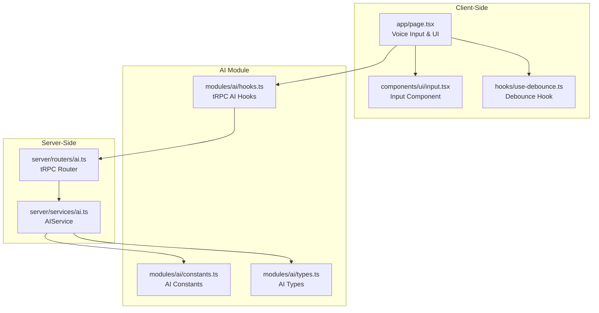
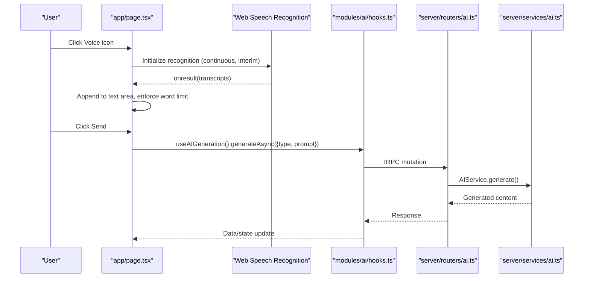
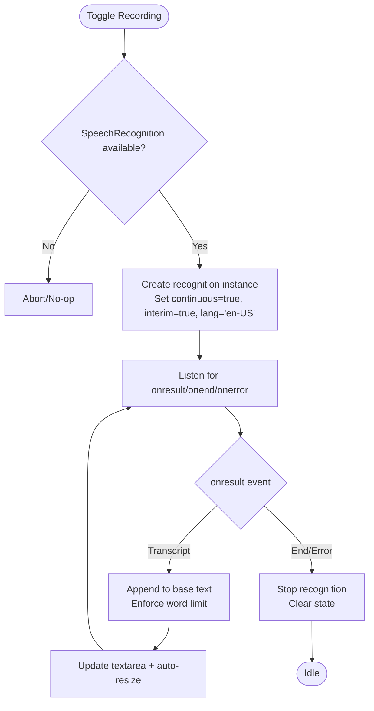
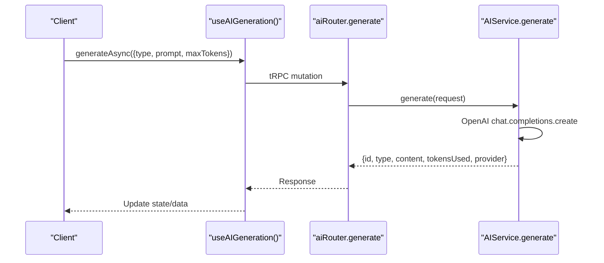
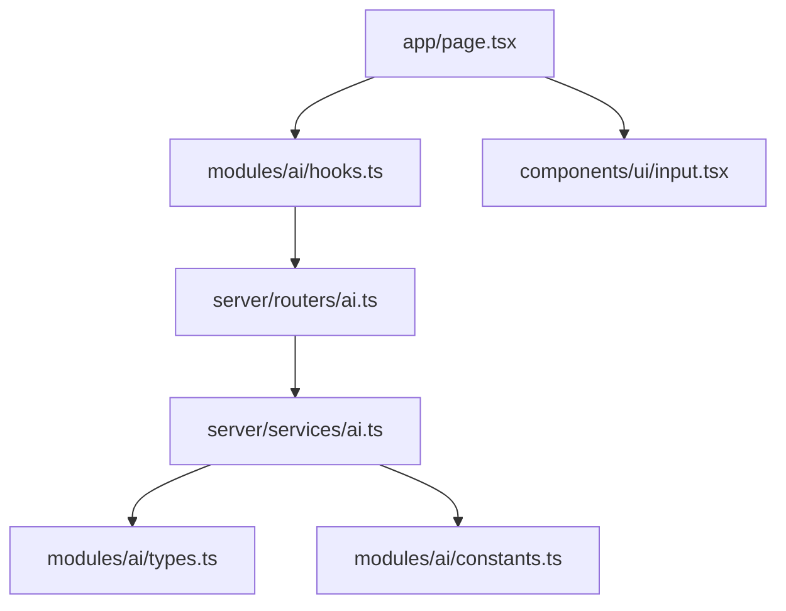

# Voice Input Integration

<cite>
**Referenced Files in This Document**
- [page.tsx](file://app/page.tsx)
- [ai.ts](file://server/services/ai.ts)
- [ai.ts](file://server/routers/ai.ts)
- [hooks.ts](file://modules/ai/hooks.ts)
- [types.ts](file://modules/ai/types.ts)
- [constants.ts](file://modules/ai/constants.ts)
- [input.tsx](file://components/ui/input.tsx)
- [use-debounce.ts](file://hooks/use-debounce.ts)
</cite>

## Table of Contents
1. [Introduction](#introduction)
2. [Project Structure](#project-structure)
3. [Core Components](#core-components)
4. [Architecture Overview](#architecture-overview)
5. [Detailed Component Analysis](#detailed-component-analysis)
6. [Dependency Analysis](#dependency-analysis)
7. [Performance Considerations](#performance-considerations)
8. [Troubleshooting Guide](#troubleshooting-guide)
9. [Conclusion](#conclusion)

## Introduction
This document provides comprehensive documentation for voice input processing in Smartfolio's AI system. It covers the speech-to-text conversion workflow, audio recording capabilities, and real-time voice processing. The documentation details microphone integration, audio format handling, transcription quality optimization, and practical examples of voice-powered content creation and voice command interpretation. It also addresses voice input permissions, browser compatibility, noise cancellation, fallback text input methods, customization of voice recognition parameters, and handling various audio formats.

## Project Structure
Smartfolio implements voice input primarily in the main application page component using the Web Speech API for speech-to-text conversion. The voice input feeds into the AI generation pipeline, which is handled server-side via tRPC and OpenAI APIs. UI components support file attachments and fallback text input methods.

**Diagram sources**
- [page.tsx](file://app/page.tsx#L59-L169)
- [input.tsx](file://components/ui/input.tsx#L11-L43)
- [use-debounce.ts](file://hooks/use-debounce.ts#L5-L19)
- [hooks.ts](file://modules/ai/hooks.ts#L10-L76)
- [constants.ts](file://modules/ai/constants.ts#L5-L41)
- [types.ts](file://modules/ai/types.ts#L5-L69)
- [ai.ts](file://server/routers/ai.ts#L5-L105)
- [ai.ts](file://server/services/ai.ts#L28-L242)

**Section sources**
- [page.tsx](file://app/page.tsx#L59-L169)
- [ai.ts](file://server/routers/ai.ts#L5-L105)
- [ai.ts](file://server/services/ai.ts#L28-L242)
- [hooks.ts](file://modules/ai/hooks.ts#L10-L76)
- [types.ts](file://modules/ai/types.ts#L5-L69)
- [constants.ts](file://modules/ai/constants.ts#L5-L41)
- [input.tsx](file://components/ui/input.tsx#L11-L43)
- [use-debounce.ts](file://hooks/use-debounce.ts#L5-L19)

## Core Components
- Voice Input Controller: Implements speech recognition using the Web Speech API, manages recording lifecycle, and updates the text area with transcribed content.
- UI Components: Provide input field, file attachment, word count, and voice recording controls.
- AI Integration: Uses tRPC hooks to send generated content requests to the server, which processes prompts via OpenAI.
- Constants and Types: Define AI providers, models, token limits, and generation templates used across the AI system.

Key implementation references:
- Voice input controller and speech recognition setup
- tRPC AI hooks for generation
- AI service configuration and generation methods
- UI input component and debounce hook

**Section sources**
- [page.tsx](file://app/page.tsx#L111-L163)
- [hooks.ts](file://modules/ai/hooks.ts#L10-L76)
- [ai.ts](file://server/services/ai.ts#L28-L87)
- [input.tsx](file://components/ui/input.tsx#L11-L43)
- [use-debounce.ts](file://hooks/use-debounce.ts#L5-L19)

## Architecture Overview
The voice input workflow begins in the client-side page component where speech recognition is initialized. Transcribed text is appended to the existing content and constrained by word limits. The resulting prompt is sent to the AI generation pipeline via tRPC, processed by the AIService, and stored in the database.

**Diagram sources**
- [page.tsx](file://app/page.tsx#L111-L163)
- [hooks.ts](file://modules/ai/hooks.ts#L10-L20)
- [ai.ts](file://server/routers/ai.ts#L7-L31)
- [ai.ts](file://server/services/ai.ts#L41-L87)

## Detailed Component Analysis

### Voice Input Controller
The voice input controller initializes and manages speech recognition using the Web Speech API. It supports continuous and interim results, sets the language to en-US, and appends transcribed text to the current content while enforcing a word limit. Recording state is tracked and cleaned up on stop or error.

Implementation highlights:
- Speech recognition initialization and configuration
- Event handling for results, end, and errors
- Word limit enforcement and text area auto-resize
- Cleanup on component unmount

**Diagram sources**
- [page.tsx](file://app/page.tsx#L111-L163)

**Section sources**
- [page.tsx](file://app/page.tsx#L111-L163)

### UI Components and Controls
The UI integrates voice input with a text area, file attachments, word count, and send actions. The input component provides consistent styling and optional labels/errors. A debounce hook can be used to optimize input handling.

Key references:
- Text area with word limit and auto-resize
- Voice icon with recording state indicator
- File attachment input and removal
- Input component with label/error/helper text

**Section sources**
- [page.tsx](file://app/page.tsx#L330-L511)
- [input.tsx](file://components/ui/input.tsx#L11-L43)
- [use-debounce.ts](file://hooks/use-debounce.ts#L5-L19)

### AI Generation Pipeline
The AI generation pipeline uses tRPC hooks to submit generation requests. The server router validates inputs and delegates to the AIService, which interacts with OpenAI to produce content. Responses are persisted and returned to the client.

**Diagram sources**
- [hooks.ts](file://modules/ai/hooks.ts#L10-L20)
- [ai.ts](file://server/routers/ai.ts#L7-L31)
- [ai.ts](file://server/services/ai.ts#L41-L87)

**Section sources**
- [hooks.ts](file://modules/ai/hooks.ts#L10-L20)
- [ai.ts](file://server/routers/ai.ts#L7-L31)
- [ai.ts](file://server/services/ai.ts#L41-L87)

### AI Constants and Types
The AI module defines providers, models, token limits, and generation templates. These constants guide AI service configuration and prompt construction.

References:
- AI providers and models
- Token and generation limits
- Prompt templates for different generation types

**Section sources**
- [constants.ts](file://modules/ai/constants.ts#L5-L41)
- [types.ts](file://modules/ai/types.ts#L5-L69)

## Dependency Analysis
The voice input feature depends on:
- Web Speech API for speech-to-text
- tRPC hooks for AI generation
- Server-side AI service for content generation
- UI components for input and feedback

**Diagram sources**
- [page.tsx](file://app/page.tsx#L59-L169)
- [hooks.ts](file://modules/ai/hooks.ts#L10-L76)
- [ai.ts](file://server/routers/ai.ts#L5-L105)
- [ai.ts](file://server/services/ai.ts#L28-L242)
- [types.ts](file://modules/ai/types.ts#L5-L69)
- [constants.ts](file://modules/ai/constants.ts#L5-L41)
- [input.tsx](file://components/ui/input.tsx#L11-L43)

**Section sources**
- [page.tsx](file://app/page.tsx#L59-L169)
- [hooks.ts](file://modules/ai/hooks.ts#L10-L76)
- [ai.ts](file://server/routers/ai.ts#L5-L105)
- [ai.ts](file://server/services/ai.ts#L28-L242)
- [types.ts](file://modules/ai/types.ts#L5-L69)
- [constants.ts](file://modules/ai/constants.ts#L5-L41)
- [input.tsx](file://components/ui/input.tsx#L11-L43)

## Performance Considerations
- Speech Recognition Overhead: Continuous and interim results can increase CPU usage. Consider disabling interim results if latency is a concern.
- Word Limit Enforcement: Truncation occurs at word boundaries to prevent excessive content. This reduces downstream processing load.
- Debouncing: While not directly applied to voice input, the debounce hook can help optimize subsequent AI generation triggers after voice input completes.
- Network Latency: AI generation requests depend on network speed and OpenAI API performance. Implement loading states and error handling for responsiveness.

[No sources needed since this section provides general guidance]

## Troubleshooting Guide
Common issues and resolutions:
- Browser Compatibility: The Web Speech API requires HTTPS and may vary by browser. Test across supported browsers and provide fallback text input instructions.
- Permissions: Users must grant microphone permissions for speech recognition. Detect permission denials and guide users to enable permissions.
- Noise and Accuracy: Poor audio quality reduces transcription accuracy. Encourage quiet environments and consider external noise cancellation solutions.
- Error Handling: On speech recognition errors, the component stops recording and clears state. Display user-friendly messages and allow retry.
- Cleanup: Ensure recognition instances are aborted on component unmount to prevent memory leaks.

Practical references:
- Speech recognition constructor and availability check
- Error and end event handling
- Component cleanup on unmount

**Section sources**
- [page.tsx](file://app/page.tsx#L51-L57)
- [page.tsx](file://app/page.tsx#L153-L158)
- [page.tsx](file://app/page.tsx#L165-L169)

## Conclusion
Smartfolio's voice input integration leverages the Web Speech API for real-time speech-to-text conversion, seamlessly feeding transcribed content into the AI generation pipeline. The system provides robust UI controls, word limit enforcement, and server-side processing via tRPC and OpenAI. For production deployments, ensure proper browser compatibility, handle permissions gracefully, and consider noise cancellation and fallback input methods to enhance user experience.