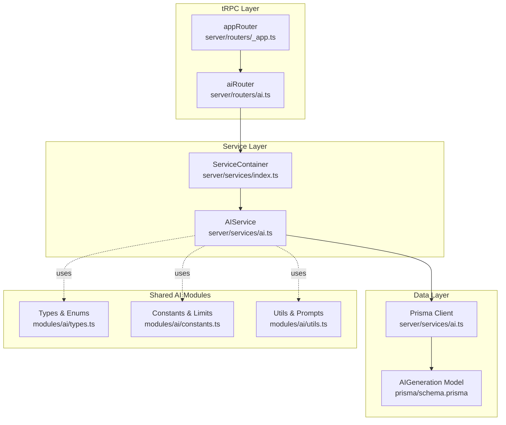
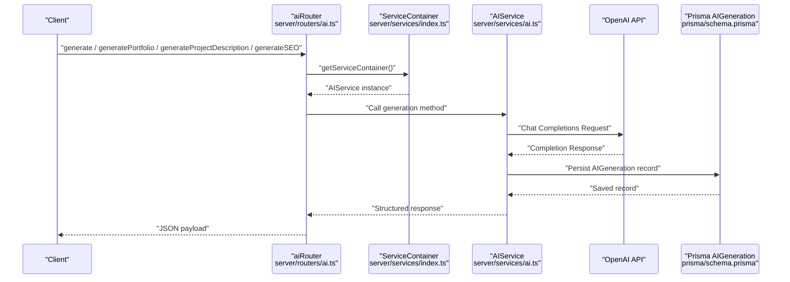
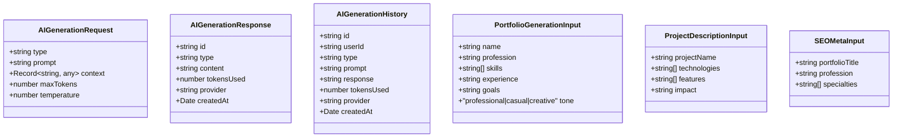
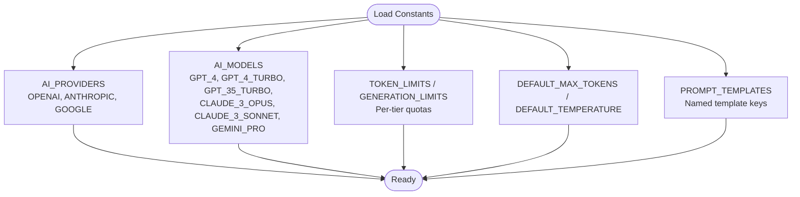
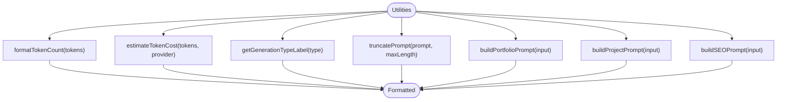
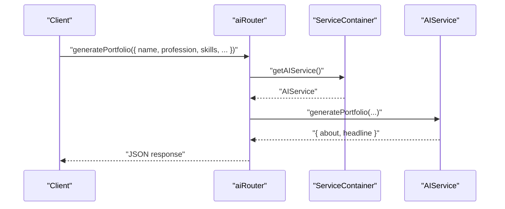
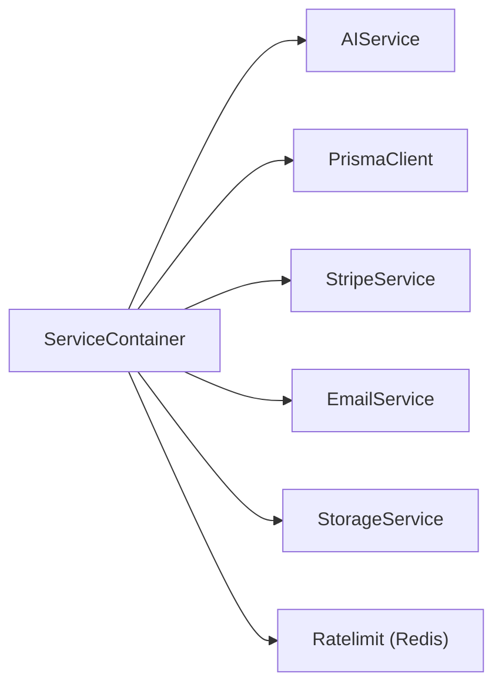
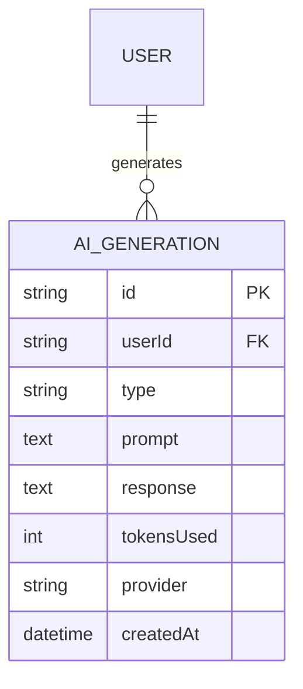
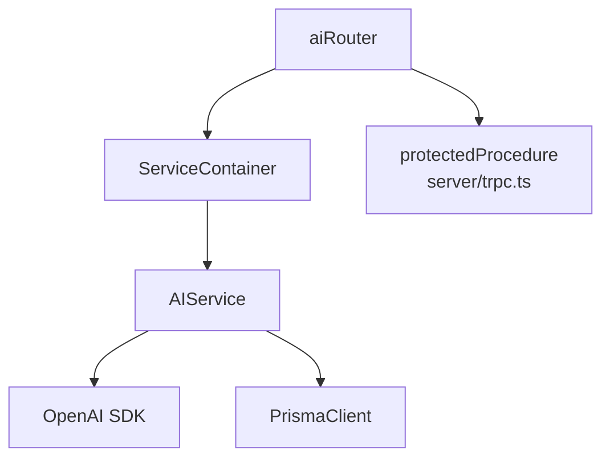

# AI Generation API

<cite>
**Referenced Files in This Document**
- [modules/ai/types.ts](file://modules/ai/types.ts)
- [modules/ai/constants.ts](file://modules/ai/constants.ts)
- [modules/ai/utils.ts](file://modules/ai/utils.ts)
- [server/routers/ai.ts](file://server/routers/ai.ts)
- [server/services/ai.ts](file://server/services/ai.ts)
- [server/services/index.ts](file://server/services/index.ts)
- [server/trpc.ts](file://server/trpc.ts)
- [server/routers/_app.ts](file://server/routers/_app.ts)
- [prisma/schema.prisma](file://prisma/schema.prisma)
</cite>

## Table of Contents
1. [Introduction](#introduction)
2. [Project Structure](#project-structure)
3. [Core Components](#core-components)
4. [Architecture Overview](#architecture-overview)
5. [Detailed Component Analysis](#detailed-component-analysis)
6. [Dependency Analysis](#dependency-analysis)
7. [Performance Considerations](#performance-considerations)
8. [Troubleshooting Guide](#troubleshooting-guide)
9. [Conclusion](#conclusion)

## Introduction
This document provides comprehensive API documentation for AI content generation endpoints powered by tRPC. It covers all AI-related procedures, including generic content generation, portfolio content creation, project description generation, SEO metadata generation, usage statistics, and generation history. It also documents input/output schemas, AI provider configurations, generation parameters, quality controls, content filtering considerations, and practical workflows for natural language processing and structured content generation.

## Project Structure
The AI generation API is implemented as part of the tRPC router ecosystem. Key components include:
- tRPC router for AI endpoints
- AI service implementation backed by OpenAI
- Service container for dependency injection and configuration
- Prisma models for storing generation history and usage metrics
- Shared AI types, constants, and utilities for prompts and cost estimation



**Diagram sources**
- [server/routers/ai.ts](file://server/routers/ai.ts#L1-L105)
- [server/routers/_app.ts](file://server/routers/_app.ts#L1-L21)
- [server/services/index.ts](file://server/services/index.ts#L1-L118)
- [server/services/ai.ts](file://server/services/ai.ts#L1-L242)
- [prisma/schema.prisma](file://prisma/schema.prisma#L214-L229)
- [modules/ai/types.ts](file://modules/ai/types.ts#L1-L69)
- [modules/ai/constants.ts](file://modules/ai/constants.ts#L1-L41)
- [modules/ai/utils.ts](file://modules/ai/utils.ts#L1-L104)

**Section sources**
- [server/routers/ai.ts](file://server/routers/ai.ts#L1-L105)
- [server/routers/_app.ts](file://server/routers/_app.ts#L1-L21)
- [server/services/index.ts](file://server/services/index.ts#L1-L118)
- [server/services/ai.ts](file://server/services/ai.ts#L1-L242)
- [prisma/schema.prisma](file://prisma/schema.prisma#L214-L229)
- [modules/ai/types.ts](file://modules/ai/types.ts#L1-L69)
- [modules/ai/constants.ts](file://modules/ai/constants.ts#L1-L41)
- [modules/ai/utils.ts](file://modules/ai/utils.ts#L1-L104)

## Core Components
- AI Provider and Generation Type enums define supported generation categories and providers.
- AIGenerationRequest/AIGenerationResponse describe the generic input and output shapes for AI generation.
- AIService encapsulates OpenAI integration, prompt construction, response parsing, persistence, and usage statistics.
- ServiceContainer manages singleton instances and external integrations (OpenAI, Redis for rate limiting).
- tRPC aiRouter exposes mutations and queries for AI generation, history, and usage.

**Section sources**
- [modules/ai/types.ts](file://modules/ai/types.ts#L5-L35)
- [modules/ai/constants.ts](file://modules/ai/constants.ts#L5-L40)
- [server/services/ai.ts](file://server/services/ai.ts#L28-L242)
- [server/services/index.ts](file://server/services/index.ts#L9-L118)
- [server/routers/ai.ts](file://server/routers/ai.ts#L5-L104)

## Architecture Overview
The AI generation API follows a layered architecture:
- Presentation: tRPC procedures in aiRouter
- Application: ServiceContainer resolves AIService
- Domain: AIService orchestrates OpenAI chat completions, prompt building, and response parsing
- Persistence: Prisma AIGeneration model stores generation records
- Shared: AI types, constants, and utilities support consistent behavior across features



**Diagram sources**
- [server/routers/ai.ts](file://server/routers/ai.ts#L7-L31)
- [server/services/index.ts](file://server/services/index.ts#L25-L36)
- [server/services/ai.ts](file://server/services/ai.ts#L41-L87)
- [prisma/schema.prisma](file://prisma/schema.prisma#L214-L229)

## Detailed Component Analysis

### AI Types and Contracts
- AIProvider: Enumerates supported providers.
- AIGenerationType: Enumerates generation categories.
- AIGenerationRequest: Generic input schema for generation.
- AIGenerationResponse: Standardized output schema for generation results.
- AIGenerationHistory: Stored record of past generations.
- Specialized Inputs: PortfolioGenerationInput, ProjectDescriptionInput, SEOMetaInput.



**Diagram sources**
- [modules/ai/types.ts](file://modules/ai/types.ts#L20-L68)

**Section sources**
- [modules/ai/types.ts](file://modules/ai/types.ts#L5-L68)

### AI Constants and Defaults
- AI_PROVIDERS and AI_MODELS: Provider and model identifiers.
- TOKEN_LIMITS and GENERATION_LIMITS: Per-plan quotas.
- DEFAULT_MAX_TOKENS and DEFAULT_TEMPERATURE: Safe defaults for generation.
- PROMPT_TEMPLATES: Named templates for common tasks.



**Diagram sources**
- [modules/ai/constants.ts](file://modules/ai/constants.ts#L5-L40)

**Section sources**
- [modules/ai/constants.ts](file://modules/ai/constants.ts#L5-L40)

### AI Utilities
- Token formatting and cost estimation helpers.
- Prompt builders for portfolio, project, and SEO tasks.
- Utility functions for label mapping and prompt truncation.



**Diagram sources**
- [modules/ai/utils.ts](file://modules/ai/utils.ts#L7-L104)

**Section sources**
- [modules/ai/utils.ts](file://modules/ai/utils.ts#L7-L104)

### tRPC AI Router Procedures
- generate: Generic mutation accepting type, prompt, and optional maxTokens.
- generatePortfolio: Mutation generating headline and about content for a portfolio.
- generateProjectDescription: Mutation generating a project description.
- generateSEO: Mutation generating SEO metadata (title, description, keywords).
- getHistory: Query returning recent generation records for a user.
- getUsageStats: Query returning monthly token usage and generation counts with plan limits.



**Diagram sources**
- [server/routers/ai.ts](file://server/routers/ai.ts#L34-L52)
- [server/services/index.ts](file://server/services/index.ts#L25-L36)
- [server/services/ai.ts](file://server/services/ai.ts#L89-L123)

**Section sources**
- [server/routers/ai.ts](file://server/routers/ai.ts#L7-L96)

### AIService Implementation
- Initialization with OpenAI API key and default model.
- generate: Sends system and user messages to OpenAI, persists the result, and returns standardized response.
- generatePortfolio: Builds a structured prompt, invokes generate, parses headline and about content.
- generateProjectDescription: Constructs a prompt for project descriptions and returns a single field.
- generateSEO: Builds an SEO prompt, invokes generate, and parses title, description, and keywords.
- getHistory: Retrieves last N generations for a user.
- getUsageStats: Aggregates tokens used and generation count for the current month, applies plan limits.
- getSystemPrompt: Maps generation types to system instructions.

```mermaid
classDiagram
class AIService {
-OpenAI openai
-PrismaClient prisma
-AIServiceConfig config
+constructor(config, prisma)
+generate(request) GenerationResponse
+generatePortfolio(input) { about, headline }
+generateProjectDescription(input) { description }
+generateSEO(input) { title, description, keywords }
+getHistory(userId) AIGeneration[]
+getUsageStats(userId) { tokensUsed, generationsCount, tokensLimit, generationsLimit }
-getSystemPrompt(type) string
}
class AIServiceConfig {
+string openaiApiKey
+string anthropicApiKey
+string defaultModel
}
class GenerationRequest {
+string type
+string prompt
+number maxTokens
+number temperature
+string userId
}
class GenerationResponse {
+string id
+string type
+string content
+number tokensUsed
+string provider
+string model
+Date createdAt
}
AIService --> AIServiceConfig : "uses"
AIService --> GenerationRequest : "accepts"
AIService --> GenerationResponse : "returns"
```

**Diagram sources**
- [server/services/ai.ts](file://server/services/ai.ts#L28-L242)

**Section sources**
- [server/services/ai.ts](file://server/services/ai.ts#L28-L242)

### Service Container and Dependencies
- ServiceContainer lazily initializes AIService with environment-configured OpenAI API key and default model.
- Provides access to Prisma, Stripe, Email, Storage, and Redis-backed rate limiting.



**Diagram sources**
- [server/services/index.ts](file://server/services/index.ts#L9-L118)

**Section sources**
- [server/services/index.ts](file://server/services/index.ts#L9-L118)

### Data Model for AI Generations
- AIGeneration model stores user ID, generation type, prompt, response, token usage, provider, and timestamps.
- Indexed for efficient querying by user, type, and creation time.



**Diagram sources**
- [prisma/schema.prisma](file://prisma/schema.prisma#L214-L229)

**Section sources**
- [prisma/schema.prisma](file://prisma/schema.prisma#L214-L229)

## Dependency Analysis
- aiRouter depends on ServiceContainer to resolve AIService.
- AIService depends on OpenAI SDK and Prisma for persistence.
- ServiceContainer centralizes configuration and avoids global state.
- tRPC protectedProcedure ensures authentication for all AI endpoints.



**Diagram sources**
- [server/routers/ai.ts](file://server/routers/ai.ts#L1-L105)
- [server/services/index.ts](file://server/services/index.ts#L25-L36)
- [server/services/ai.ts](file://server/services/ai.ts#L29-L39)
- [server/trpc.ts](file://server/trpc.ts#L50-L60)

**Section sources**
- [server/routers/ai.ts](file://server/routers/ai.ts#L1-L105)
- [server/services/index.ts](file://server/services/index.ts#L25-L36)
- [server/services/ai.ts](file://server/services/ai.ts#L29-L39)
- [server/trpc.ts](file://server/trpc.ts#L50-L60)

## Performance Considerations
- Token and generation limits: Enforce quotas per plan tier to prevent runaway costs.
- Default maxTokens and temperature: Tune for quality vs. cost balance.
- Prompt length: Use truncatePrompt to avoid excessive token usage.
- Batch history retrieval: Limit returned items to reduce payload size.
- Rate limiting: Use Redis-backed sliding window to throttle requests globally.

[No sources needed since this section provides general guidance]

## Troubleshooting Guide
- Authentication failures: protectedProcedure throws UNAUTHORIZED if session is missing.
- OpenAI errors: AIService.generate catches exceptions and surfaces a unified error message.
- Missing environment variables: Ensure OPENAI_API_KEY is set; otherwise, AIService initialization will use empty key.
- Exceeded limits: getUsageStats aggregates monthly usage; compare against plan limits to detect overages.
- Parsing errors: Response parsing assumes structured outputs; adjust prompts if parsing fails.

**Section sources**
- [server/trpc.ts](file://server/trpc.ts#L50-L60)
- [server/services/ai.ts](file://server/services/ai.ts#L83-L86)
- [server/services/index.ts](file://server/services/index.ts#L27-L33)

## Conclusion
The AI Generation API provides a robust, typed, and scalable foundation for AI-driven content creation. It supports multiple generation types, integrates with OpenAI, persists generation history, enforces usage quotas, and offers utilities for prompt engineering and cost estimation. By leveraging tRPC’s strong typing and the ServiceContainer pattern, the system remains maintainable and extensible for future enhancements such as provider switching, advanced filtering, and real-time streaming.