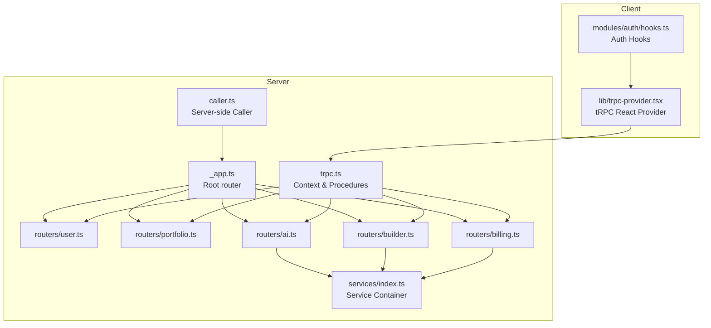
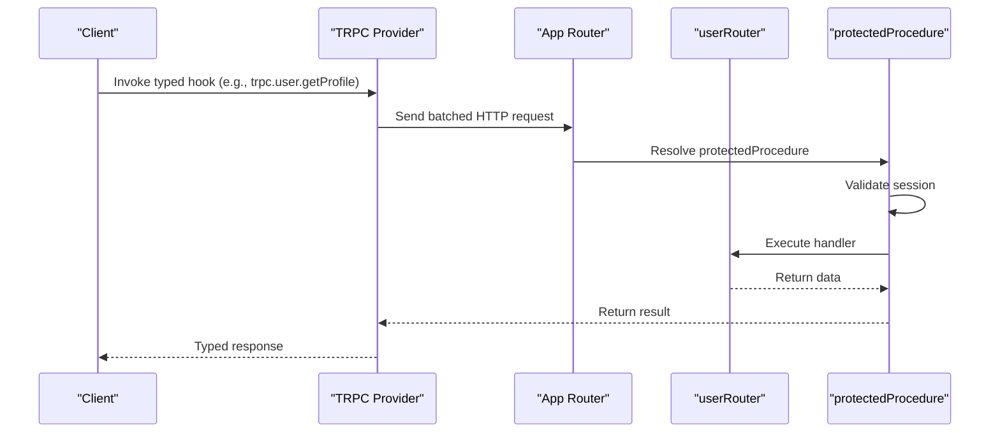
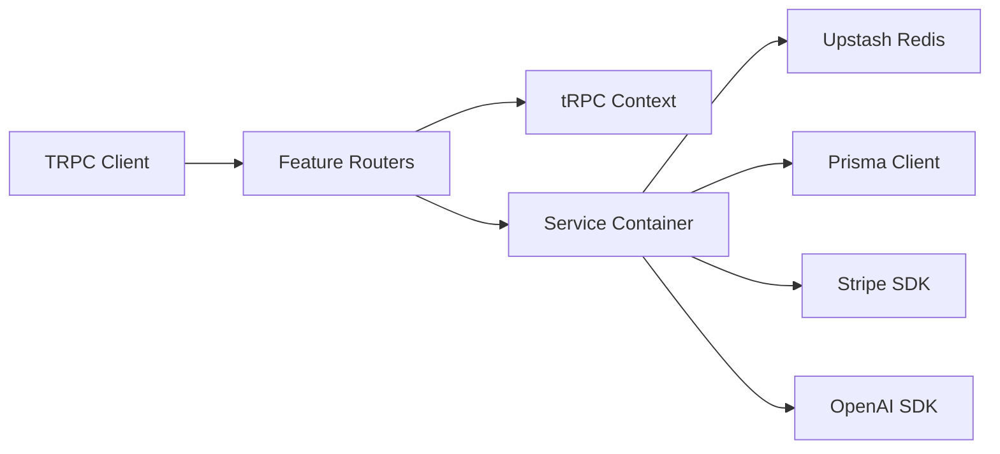

# API Reference

<cite>
**Referenced Files in This Document**
- [server/routers/_app.ts](file://server/routers/_app.ts)
- [server/trpc.ts](file://server/trpc.ts)
- [server/caller.ts](file://server/caller.ts)
- [lib/trpc-provider.tsx](file://lib/trpc-provider.tsx)
- [modules/auth/hooks.ts](file://modules/auth/hooks.ts)
- [types/api.ts](file://types/api.ts)
- [server/routers/user.ts](file://server/routers/user.ts)
- [server/routers/portfolio.ts](file://server/routers/portfolio.ts)
- [server/routers/ai.ts](file://server/routers/ai.ts)
- [server/routers/builder.ts](file://server/routers/builder.ts)
- [server/routers/billing.ts](file://server/routers/billing.ts)
- [server/services/index.ts](file://server/services/index.ts)
</cite>

## Table of Contents
1. [Introduction](#introduction)
2. [Project Structure](#project-structure)
3. [Core Components](#core-components)
4. [Architecture Overview](#architecture-overview)
5. [Detailed Component Analysis](#detailed-component-analysis)
6. [Dependency Analysis](#dependency-analysis)
7. [Performance Considerations](#performance-considerations)
8. [Troubleshooting Guide](#troubleshooting-guide)
9. [Conclusion](#conclusion)
10. [Appendices](#appendices)

## Introduction
This document describes Smartfolio’s tRPC API surface, covering all public and protected endpoints across user management, portfolio operations, AI generation, builder functionality, and billing. It explains authentication, input/output schemas, error handling, client integration, and operational guidance such as rate limiting, pagination, and versioning.

## Project Structure
Smartfolio organizes its API under a central tRPC router that composes feature-specific routers. A shared tRPC context injects authentication and database access into every procedure. The frontend integrates via a typed React Query-based client that communicates with the backend over HTTP batching.

**Diagram sources**
- [server/routers/_app.ts](file://server/routers/_app.ts#L1-L21)
- [server/trpc.ts](file://server/trpc.ts#L1-L61)
- [server/caller.ts](file://server/caller.ts#L1-L7)
- [server/services/index.ts](file://server/services/index.ts#L1-L118)
- [lib/trpc-provider.tsx](file://lib/trpc-provider.tsx#L1-L50)
- [modules/auth/hooks.ts](file://modules/auth/hooks.ts#L1-L29)
- [server/routers/user.ts](file://server/routers/user.ts#L1-L79)
- [server/routers/portfolio.ts](file://server/routers/portfolio.ts#L1-L115)
- [server/routers/ai.ts](file://server/routers/ai.ts#L1-L105)
- [server/routers/builder.ts](file://server/routers/builder.ts#L1-L156)
- [server/routers/billing.ts](file://server/routers/billing.ts#L1-L71)

**Section sources**
- [server/routers/_app.ts](file://server/routers/_app.ts#L1-L21)
- [server/trpc.ts](file://server/trpc.ts#L1-L61)
- [lib/trpc-provider.tsx](file://lib/trpc-provider.tsx#L1-L50)

## Core Components
- Root router: Composes user, portfolio, AI, builder, and billing routers.
- Context: Provides session, database, and headers to all procedures.
- Protected procedures: Enforce authentication and attach user context.
- Client provider: Exposes a typed React Query client with batching and serialization.

Key implementation references:
- Root router composition: [server/routers/_app.ts](file://server/routers/_app.ts#L12-L18)
- Context creation and error formatter: [server/trpc.ts](file://server/trpc.ts#L12-L39)
- Protected procedure guard: [server/trpc.ts](file://server/trpc.ts#L50-L60)
- Client provider setup: [lib/trpc-provider.tsx](file://lib/trpc-provider.tsx#L18-L40)

**Section sources**
- [server/routers/_app.ts](file://server/routers/_app.ts#L1-L21)
- [server/trpc.ts](file://server/trpc.ts#L1-L61)
- [lib/trpc-provider.tsx](file://lib/trpc-provider.tsx#L1-L50)

## Architecture Overview
The API uses a typed, server-side caller for SSR/Server Actions and a client-side React Query integration for the browser. Authentication is enforced centrally, and services are resolved via a container.

**Diagram sources**
- [lib/trpc-provider.tsx](file://lib/trpc-provider.tsx#L1-L50)
- [server/trpc.ts](file://server/trpc.ts#L50-L60)
- [server/routers/_app.ts](file://server/routers/_app.ts#L1-L21)
- [server/routers/user.ts](file://server/routers/user.ts#L14-L27)

## Detailed Component Analysis

### Authentication and Authorization
- Authentication is handled by the tRPC context, which reads the session from the request headers.
- Protected procedures throw UNAUTHORIZED if no session exists.
- Frontend hooks expose authentication state for gating UI and flows.

References:
- Context session extraction: [server/trpc.ts](file://server/trpc.ts#L12-L19)
- Protected procedure guard: [server/trpc.ts](file://server/trpc.ts#L50-L60)
- Client auth hooks: [modules/auth/hooks.ts](file://modules/auth/hooks.ts#L9-L28)

**Section sources**
- [server/trpc.ts](file://server/trpc.ts#L12-L60)
- [modules/auth/hooks.ts](file://modules/auth/hooks.ts#L1-L29)

### User Management
Endpoints:
- user.hello (public): Returns a greeting string.
- user.getProfile (protected): Returns current user profile.
- user.updateProfile (protected): Updates user name and/or image URL.
- user.list (protected): Lists users with pagination.

Input/Output schemas:
- user.hello: input { name?: string }, output { greeting: string }
- user.getProfile: returns user profile fields
- user.updateProfile: input { name?: string, image?: string }, returns updated user
- user.list: input { limit: number, cursor?: string }, output { users[], nextCursor?: string }

Authentication:
- Requires a valid session.

Error handling:
- Validation errors are returned with structured details.
- Unauthorized access throws UNAUTHORIZED.

Common usage patterns:
- Call user.getProfile after login to hydrate user data.
- Use user.list for admin dashboards with pagination.

References:
- Procedure definitions: [server/routers/user.ts](file://server/routers/user.ts#L6-L77)

**Section sources**
- [server/routers/user.ts](file://server/routers/user.ts#L1-L79)
- [server/trpc.ts](file://server/trpc.ts#L29-L38)

### Portfolio Operations
Endpoints:
- portfolio.list (protected): Lists current user’s portfolios.
- portfolio.getById (protected): Retrieves a single portfolio by ID.
- portfolio.create (protected): Creates a new portfolio with optional slug/theme/status.
- portfolio.update (protected): Partially updates portfolio fields and status.
- portfolio.delete (protected): Deletes a portfolio by ID.
- portfolio.publish (protected): Sets status to PUBLISHED and marks published.

Input/Output schemas:
- portfolio.list: returns { portfolios[] }
- portfolio.getById: input { id: string }, returns portfolio
- portfolio.create: input { title: string, slug?: string, description?: string, theme?: enum }, returns portfolio
- portfolio.update: input { id: string, title?: string, slug?: string, description?: string, theme?: enum, status?: enum }, returns count affected
- portfolio.delete: input { id: string }, returns { success: true }
- portfolio.publish: input { id: string }, returns count affected

Authentication:
- Requires a valid session.

Error handling:
- Validation errors include structured details.
- Unauthorized access throws UNAUTHORIZED.

Pagination and filtering:
- Not applicable for list/getById; filtering is implicit by user ownership.

References:
- Procedure definitions: [server/routers/portfolio.ts](file://server/routers/portfolio.ts#L6-L114)

**Section sources**
- [server/routers/portfolio.ts](file://server/routers/portfolio.ts#L1-L115)
- [server/trpc.ts](file://server/trpc.ts#L29-L38)

### AI Generation
Endpoints:
- ai.generate (protected): Generic generator with type and prompt.
- ai.generatePortfolio (protected): Generates portfolio content based on personalization.
- ai.generateProjectDescription (protected): Generates project descriptions.
- ai.generateSEO (protected): Generates SEO metadata.
- ai.getHistory (protected): Retrieves generation history.
- ai.getUsageStats (protected): Retrieves usage statistics.

Input/Output schemas:
- ai.generate: input { type: enum, prompt: string, maxTokens?: number }, returns generated content
- ai.generatePortfolio: input { name: string, profession: string, skills: string[], experience?: string, goals?: string, tone?: enum }, returns generated content
- ai.generateProjectDescription: input { projectName: string, technologies: string[], features: string[], impact?: string }, returns generated content
- ai.generateSEO: input { portfolioTitle: string, profession: string, specialties: string[] }, returns generated content
- ai.getHistory: returns history entries
- ai.getUsageStats: returns usage metrics

Authentication:
- Requires a valid session.

Error handling:
- Validation errors include structured details.
- Service-level errors bubble up.

References:
- Procedure definitions: [server/routers/ai.ts](file://server/routers/ai.ts#L7-L103)
- Service container: [server/services/index.ts](file://server/services/index.ts#L25-L36)

**Section sources**
- [server/routers/ai.ts](file://server/routers/ai.ts#L1-L105)
- [server/services/index.ts](file://server/services/index.ts#L1-L118)

### Builder Functionality
Endpoints:
- builder.getTemplates (protected): Lists available templates.
- builder.applyTemplate (protected): Applies a template to a portfolio by replacing its sections.
- builder.saveBlocks (protected): Saves custom blocks to a portfolio.
- builder.getBlocks (protected): Retrieves blocks for a portfolio.

Input/Output schemas:
- builder.getTemplates: returns templates[]
- builder.applyTemplate: input { portfolioId: string, templateId: string }, returns { success: true }
- builder.saveBlocks: input { portfolioId: string, blocks: array of block specs }, returns { success: true }
- builder.getBlocks: input { portfolioId: string }, returns blocks[]

Authentication:
- Requires a valid session.

Ownership checks:
- All mutations validate that the portfolio belongs to the current user.

Error handling:
- Throws descriptive errors when template or portfolio not found or access denied.

References:
- Procedure definitions: [server/routers/builder.ts](file://server/routers/builder.ts#L7-L154)

**Section sources**
- [server/routers/builder.ts](file://server/routers/builder.ts#L1-L156)

### Billing
Endpoints:
- billing.getSubscription (protected): Retrieves current subscription.
- billing.createCheckoutSession (protected): Creates a Stripe checkout session.
- billing.createPortalSession (protected): Creates a Stripe billing portal session.
- billing.cancelSubscription (protected): Cancels the subscription.
- billing.resumeSubscription (protected): Resumes the subscription.
- billing.getPaymentHistory (protected): Retrieves payment history.
- billing.getUsageStats (protected): Calculates usage statistics.

Input/Output schemas:
- billing.getSubscription: returns subscription
- billing.createCheckoutSession: input { priceId: string }, returns checkout session data
- billing.createPortalSession: returns portal session data
- billing.cancelSubscription: returns cancellation result
- billing.resumeSubscription: returns resumption result
- billing.getPaymentHistory: returns payments[]
- billing.getUsageStats: returns usage metrics

Authentication:
- Requires a valid session.

Error handling:
- Validation errors include structured details.
- Stripe service errors propagate.

References:
- Procedure definitions: [server/routers/billing.ts](file://server/routers/billing.ts#L7-L69)
- Service container: [server/services/index.ts](file://server/services/index.ts#L38-L52)

**Section sources**
- [server/routers/billing.ts](file://server/routers/billing.ts#L1-L71)
- [server/services/index.ts](file://server/services/index.ts#L1-L118)

### API Client Implementation and Type Safety
- The client is a typed React Query integration that connects to the backend via HTTP batching.
- The base URL is determined dynamically depending on environment.
- Serialization uses SuperJSON for robust data transport.

References:
- Client provider and batching: [lib/trpc-provider.tsx](file://lib/trpc-provider.tsx#L18-L40)
- Root router typing: [server/routers/_app.ts](file://server/routers/_app.ts#L20-L21)

**Section sources**
- [lib/trpc-provider.tsx](file://lib/trpc-provider.tsx#L1-L50)
- [server/routers/_app.ts](file://server/routers/_app.ts#L1-L21)

### Rate Limiting
- A global sliding-window rate limiter is configured in the service container.
- The limiter is initialized with Upstash Redis and set to a fixed window.

References:
- Rate limit configuration: [server/services/index.ts](file://server/services/index.ts#L91-L103)

**Section sources**
- [server/services/index.ts](file://server/services/index.ts#L91-L103)

### Pagination, Filtering, and Search
- User listing supports pagination via limit and cursor.
- Portfolio listing is ordered by creation date.
- No explicit filtering/search APIs are exposed in the documented routers.

References:
- User pagination: [server/routers/user.ts](file://server/routers/user.ts#L46-L77)
- Portfolio ordering: [server/routers/portfolio.ts](file://server/routers/portfolio.ts#L7-L12)

**Section sources**
- [server/routers/user.ts](file://server/routers/user.ts#L46-L77)
- [server/routers/portfolio.ts](file://server/routers/portfolio.ts#L7-L12)

### API Versioning and Deprecation
- The API uses tRPC’s type system to maintain backward compatibility at the client level.
- There is no explicit versioning header or deprecation mechanism in the current implementation.
- Recommendations:
  - Introduce a version header or path segment for major versions.
  - Add deprecation notices and grace periods for breaking changes.
  - Keep server-side migrations separate from client-side schema changes.

[No sources needed since this section provides general guidance]

## Dependency Analysis
The API depends on a shared service container for external integrations (AI, Stripe, Email, Storage) and Upstash Redis for rate limiting. The client integrates via a typed React Query client.

**Diagram sources**
- [lib/trpc-provider.tsx](file://lib/trpc-provider.tsx#L1-L50)
- [server/routers/_app.ts](file://server/routers/_app.ts#L1-L21)
- [server/trpc.ts](file://server/trpc.ts#L1-L61)
- [server/services/index.ts](file://server/services/index.ts#L1-L118)

**Section sources**
- [server/services/index.ts](file://server/services/index.ts#L1-L118)
- [lib/trpc-provider.tsx](file://lib/trpc-provider.tsx#L1-L50)

## Performance Considerations
- HTTP batching reduces round-trips for multiple queries.
- SuperJSON serialization improves payload efficiency.
- Cursor-based pagination avoids OFFSET scans for scalable lists.
- Consider caching frequently accessed immutable data (e.g., templates) at the application layer.

[No sources needed since this section provides general guidance]

## Troubleshooting Guide
Common issues and resolutions:
- UNAUTHORIZED responses: Ensure the session is present and valid in the request headers.
- Validation errors: Inspect the structured error payload for field-specific issues.
- Rate limiting: If requests are throttled, reduce frequency or upgrade tier.
- Ownership errors: Confirm that portfolio/template operations target resources owned by the authenticated user.

References:
- Error formatting: [server/trpc.ts](file://server/trpc.ts#L29-L38)
- Protected guard: [server/trpc.ts](file://server/trpc.ts#L50-L60)
- Rate limit setup: [server/services/index.ts](file://server/services/index.ts#L91-L103)

**Section sources**
- [server/trpc.ts](file://server/trpc.ts#L29-L60)
- [server/services/index.ts](file://server/services/index.ts#L91-L103)

## Conclusion
Smartfolio’s tRPC API offers a strongly typed, authenticated surface spanning user management, portfolio operations, AI generation, builder tools, and billing. The client integrates seamlessly with React Query, while the server enforces authentication and provides a flexible service container for external integrations. Adopt versioning and deprecation policies to maintain long-term stability.

[No sources needed since this section summarizes without analyzing specific files]

## Appendices

### API Call Examples (paths only)
- GET profile: [server/routers/user.ts](file://server/routers/user.ts#L15-L27)
- Update profile: [server/routers/user.ts](file://server/routers/user.ts#L30-L43)
- List users: [server/routers/user.ts](file://server/routers/user.ts#L46-L77)
- Create portfolio: [server/routers/portfolio.ts](file://server/routers/portfolio.ts#L30-L54)
- Update portfolio: [server/routers/portfolio.ts](file://server/routers/portfolio.ts#L57-L80)
- Publish portfolio: [server/routers/portfolio.ts](file://server/routers/portfolio.ts#L97-L113)
- Apply template: [server/routers/builder.ts](file://server/routers/builder.ts#L18-L68)
- Save blocks: [server/routers/builder.ts](file://server/routers/builder.ts#L71-L119)
- Get blocks: [server/routers/builder.ts](file://server/routers/builder.ts#L122-L154)
- Generate AI content: [server/routers/ai.ts](file://server/routers/ai.ts#L7-L31)
- Create checkout session: [server/routers/billing.ts](file://server/routers/billing.ts#L17-L30)
- Get usage stats: [server/routers/billing.ts](file://server/routers/billing.ts#L65-L69)

### Response Formats
- Standardized envelope types are defined for API responses and pagination.
- Validation errors include structured details for client-side handling.

References:
- API response types: [types/api.ts](file://types/api.ts#L5-L24)

**Section sources**
- [types/api.ts](file://types/api.ts#L1-L25)