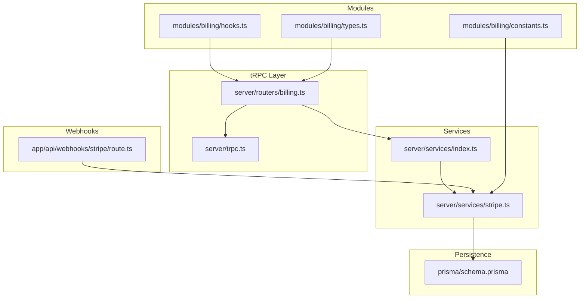
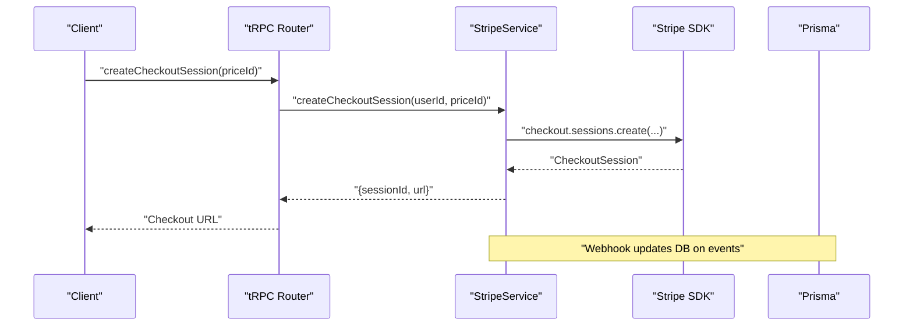
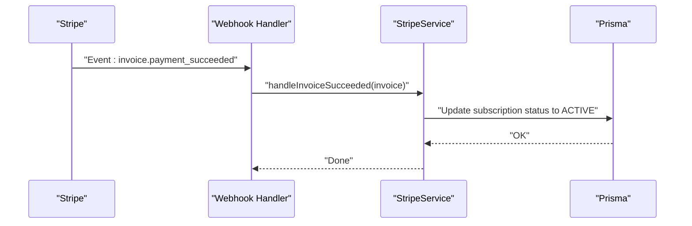
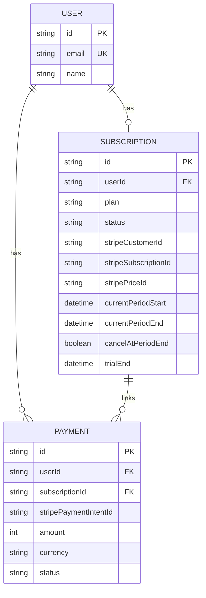
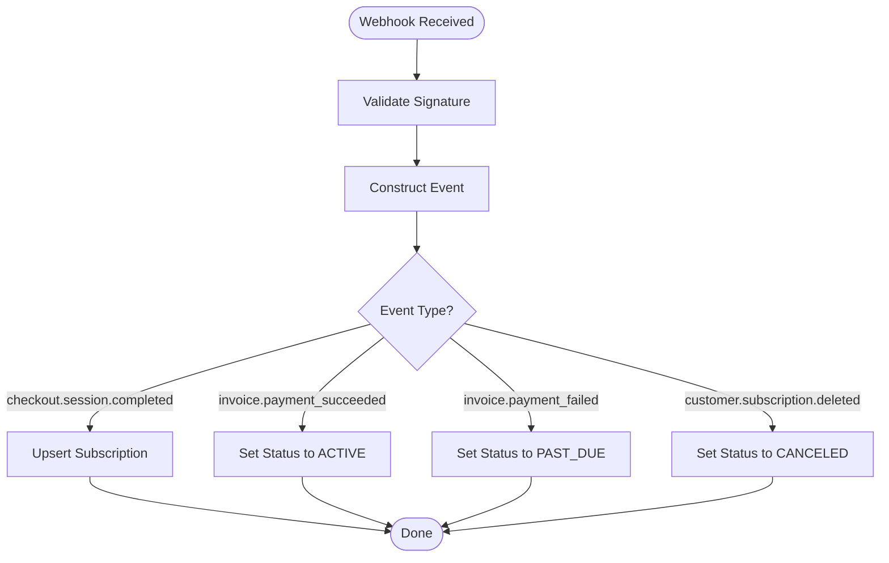
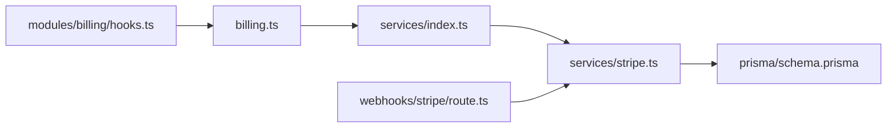

# Billing API

<cite>
**Referenced Files in This Document**
- [billing.ts](file://server/routers/billing.ts)
- [stripe.ts](file://server/services/stripe.ts)
- [index.ts](file://server/services/index.ts)
- [route.ts](file://app/api/webhooks/stripe/route.ts)
- [types.ts](file://modules/billing/types.ts)
- [constants.ts](file://modules/billing/constants.ts)
- [hooks.ts](file://modules/billing/hooks.ts)
- [trpc.ts](file://server/trpc.ts)
- [schema.prisma](file://prisma/schema.prisma)
</cite>

## Table of Contents
1. [Introduction](#introduction)
2. [Project Structure](#project-structure)
3. [Core Components](#core-components)
4. [Architecture Overview](#architecture-overview)
5. [Detailed Component Analysis](#detailed-component-analysis)
6. [Dependency Analysis](#dependency-analysis)
7. [Performance Considerations](#performance-considerations)
8. [Troubleshooting Guide](#troubleshooting-guide)
9. [Conclusion](#conclusion)
10. [Appendices](#appendices)

## Introduction
This document provides comprehensive API documentation for billing and subscription management powered by Stripe via tRPC. It covers subscription lifecycle operations, payment processing, billing portal access, usage tracking, and webhook-driven synchronization. It also documents input/output schemas, Stripe integration patterns, billing cycle management, and practical workflows such as subscription upgrades/downgrades, payment method updates, and billing history retrieval. Guidance is included for coupon/promotional pricing, billing address validation, webhook processing, subscription synchronization, and error handling.

## Project Structure
The billing system is organized around a dedicated tRPC router, a Stripe service layer, shared billing types and constants, and a webhook handler for Stripe events. Data persistence is handled by Prisma with dedicated models for subscriptions and payments.

**Diagram sources**
- [billing.ts](file://server/routers/billing.ts#L1-L71)
- [stripe.ts](file://server/services/stripe.ts#L1-L294)
- [index.ts](file://server/services/index.ts#L1-L118)
- [route.ts](file://app/api/webhooks/stripe/route.ts#L1-L38)
- [types.ts](file://modules/billing/types.ts#L1-L84)
- [constants.ts](file://modules/billing/constants.ts#L1-L81)
- [hooks.ts](file://modules/billing/hooks.ts#L1-L91)
- [trpc.ts](file://server/trpc.ts#L1-L61)
- [schema.prisma](file://prisma/schema.prisma#L172-L208)

**Section sources**
- [billing.ts](file://server/routers/billing.ts#L1-L71)
- [stripe.ts](file://server/services/stripe.ts#L1-L294)
- [index.ts](file://server/services/index.ts#L1-L118)
- [route.ts](file://app/api/webhooks/stripe/route.ts#L1-L38)
- [types.ts](file://modules/billing/types.ts#L1-L84)
- [constants.ts](file://modules/billing/constants.ts#L1-L81)
- [hooks.ts](file://modules/billing/hooks.ts#L1-L91)
- [trpc.ts](file://server/trpc.ts#L1-L61)
- [schema.prisma](file://prisma/schema.prisma#L172-L208)

## Core Components
- tRPC Billing Router: Exposes protected procedures for retrieving subscription details, creating checkout sessions, creating billing portal sessions, canceling or resuming subscriptions, fetching payment history, and computing usage statistics.
- Stripe Service: Orchestrates Stripe operations including customer creation/get-or-create, checkout session creation, billing portal session creation, subscription cancellation/resumption, usage statistics calculation, and webhook event handling.
- Service Container: Provides lazy-initialized services and injects Prisma into Stripe service.
- Webhook Handler: Validates Stripe signatures and forwards events to the Stripe service for synchronization.
- Billing Types and Constants: Define subscription plans, statuses, payment statuses, plan features, and Stripe configuration constants.
- Frontend Hooks: tRPC-based React hooks for seamless UI integration.

**Section sources**
- [billing.ts](file://server/routers/billing.ts#L5-L70)
- [stripe.ts](file://server/services/stripe.ts#L13-L294)
- [index.ts](file://server/services/index.ts#L38-L52)
- [route.ts](file://app/api/webhooks/stripe/route.ts#L6-L38)
- [types.ts](file://modules/billing/types.ts#L5-L84)
- [constants.ts](file://modules/billing/constants.ts#L7-L81)
- [hooks.ts](file://modules/billing/hooks.ts#L10-L91)

## Architecture Overview
The billing API follows a layered architecture:
- Presentation: tRPC router exposes endpoints with input validation and protected access.
- Application: Stripe service encapsulates Stripe SDK interactions and Prisma updates.
- Persistence: Prisma models maintain subscription and payment records.
- Integration: Stripe webhooks keep local state synchronized with Stripe.

**Diagram sources**
- [billing.ts](file://server/routers/billing.ts#L16-L30)
- [stripe.ts](file://server/services/stripe.ts#L24-L52)
- [route.ts](file://app/api/webhooks/stripe/route.ts#L18-L28)

## Detailed Component Analysis

### tRPC Billing Router Procedures
- getSubscription: Query the user’s current subscription record.
- createCheckoutSession: Create a Stripe checkout session for a given price ID; returns session ID and URL.
- createPortalSession: Create a Stripe Billing Portal session for managing payments and subscriptions.
- cancelSubscription: Mark a subscription to cancel at period end.
- resumeSubscription: Remove cancellation to resume billing.
- getPaymentHistory: Retrieve payment records ordered by creation time.
- getUsageStats: Compute usage metrics against plan limits.

Input/Output Schemas
- getSubscription: Returns a Subscription model.
- createCheckoutSession(input: { priceId: string }): Returns { sessionId: string, url: string }.
- createPortalSession(): Returns { url: string }.
- cancelSubscription()/resumeSubscription(): Returns { success: boolean }.
- getPaymentHistory(): Returns array of Payment models.
- getUsageStats(): Returns { portfoliosUsed, portfoliosLimit, aiGenerationsUsed, aiGenerationsLimit }.

Protected Access
- All procedures are protected and require an authenticated session.

**Section sources**
- [billing.ts](file://server/routers/billing.ts#L7-L69)
- [trpc.ts](file://server/trpc.ts#L50-L60)
- [types.ts](file://modules/billing/types.ts#L26-L52)
- [types.ts](file://modules/billing/types.ts#L80-L83)

### Stripe Service Implementation
Responsibilities
- Customer Management: Get or create Stripe customer linked to the user.
- Checkout Sessions: Create subscription-mode sessions with success/cancel URLs and metadata.
- Billing Portal: Generate portal sessions for customers to manage billing.
- Subscription Lifecycle: Cancel/resume subscriptions and persist state changes.
- Usage Stats: Count portfolios and AI generations this month and compare to plan limits.
- Webhook Handling: Process checkout completion, invoice payment success/failure, and subscription deletion.

Key Workflows
- Checkout Completion: Upsert subscription record with plan derived from price ID and set status to active.
- Invoice Events: Update subscription status to active on successful payment or past_due on failure.
- Subscription Deletion: Mark subscription as canceled.

**Diagram sources**
- [route.ts](file://app/api/webhooks/stripe/route.ts#L18-L28)
- [stripe.ts](file://server/services/stripe.ts#L120-L125)
- [stripe.ts](file://server/services/stripe.ts#L250-L264)

**Section sources**
- [stripe.ts](file://server/services/stripe.ts#L24-L52)
- [stripe.ts](file://server/services/stripe.ts#L54-L65)
- [stripe.ts](file://server/services/stripe.ts#L67-L89)
- [stripe.ts](file://server/services/stripe.ts#L91-L113)
- [stripe.ts](file://server/services/stripe.ts#L132-L170)
- [stripe.ts](file://server/services/stripe.ts#L115-L130)
- [stripe.ts](file://server/services/stripe.ts#L211-L248)
- [stripe.ts](file://server/services/stripe.ts#L250-L280)
- [stripe.ts](file://server/services/stripe.ts#L282-L293)

### Data Models and Schemas
Subscription Model
- Fields include user association, plan, status, Stripe identifiers, billing periods, cancellation flag, trial end, and timestamps.

Payment Model
- Fields include user association, optional subscription link, Stripe payment intent ID, amount (in cents), currency, status, description, and timestamps.

**Diagram sources**
- [schema.prisma](file://prisma/schema.prisma#L172-L191)
- [schema.prisma](file://prisma/schema.prisma#L193-L208)

**Section sources**
- [schema.prisma](file://prisma/schema.prisma#L172-L191)
- [schema.prisma](file://prisma/schema.prisma#L193-L208)

### Stripe Integration Patterns
- Customer Creation/Linking: On checkout or portal access, ensure a Stripe customer exists and link to the local subscription record.
- Metadata: Pass userId in checkout metadata to correlate sessions with users.
- Pricing: Use configured Stripe price IDs per plan; derive plan from price ID during checkout completion.
- Billing Portal: Redirect users to Stripe Billing Portal for payment method updates and subscription changes.
- Webhooks: Validate signatures, construct events, and update local state accordingly.

**Section sources**
- [stripe.ts](file://server/services/stripe.ts#L172-L209)
- [stripe.ts](file://server/services/stripe.ts#L31-L46)
- [constants.ts](file://modules/billing/constants.ts#L65-L69)
- [constants.ts](file://modules/billing/constants.ts#L73-L81)

### Billing Cycle Management
- Period Tracking: Store current billing period start/end and compute days until renewal.
- Status Transitions: Active, Past Due, Canceled, Trialing, Incomplete.
- Trial Management: Track trial end dates and treat trialing status as active for access.
- Usage Caps: Compare usage counts to plan limits to enforce quotas.

**Section sources**
- [types.ts](file://modules/billing/types.ts#L11-L17)
- [types.ts](file://modules/billing/types.ts#L26-L40)
- [utils.ts](file://modules/billing/utils.ts#L85-L101)
- [stripe.ts](file://server/services/stripe.ts#L132-L170)

### Practical Workflows

#### Subscription Upgrades/Downgrades
- Use createCheckoutSession with the target plan’s Stripe price ID.
- Stripe handles proration and billing immediately or at renewal depending on settings.
- Webhook ensures local subscription reflects the new plan and status.

**Section sources**
- [billing.ts](file://server/routers/billing.ts#L16-L30)
- [stripe.ts](file://server/services/stripe.ts#L24-L52)
- [stripe.ts](file://server/services/stripe.ts#L211-L248)

#### Payment Method Updates
- Use createPortalSession to redirect users to the Stripe Billing Portal.
- From there, users can update payment methods and subscription details.

**Section sources**
- [billing.ts](file://server/routers/billing.ts#L32-L37)
- [stripe.ts](file://server/services/stripe.ts#L54-L65)

#### Billing History Retrieval
- Use getPaymentHistory to fetch recent payments and statuses.

**Section sources**
- [billing.ts](file://server/routers/billing.ts#L53-L62)
- [types.ts](file://modules/billing/types.ts#L42-L52)

#### Usage Tracking and Quotas
- Use getUsageStats to compare current usage to plan limits.
- Frontend hooks expose usage data for quota displays.

**Section sources**
- [billing.ts](file://server/routers/billing.ts#L64-L69)
- [stripe.ts](file://server/services/stripe.ts#L132-L170)
- [hooks.ts](file://modules/billing/hooks.ts#L83-L90)

#### Subscription Cancellation and Resumption
- cancelSubscription sets cancelAtPeriodEnd and persists the change.
- resumeSubscription reverts cancelAtPeriodEnd to continue billing.

**Section sources**
- [billing.ts](file://server/routers/billing.ts#L39-L51)
- [stripe.ts](file://server/services/stripe.ts#L67-L89)
- [stripe.ts](file://server/services/stripe.ts#L91-L113)

### Coupon Codes and Promotions
- Stripe coupons/promo codes are supported by Stripe Checkout; pass coupon identifiers through Stripe configuration as needed.
- The system does not currently expose explicit coupon endpoints; promotions are applied at checkout via Stripe.

**Section sources**
- [stripe.ts](file://server/services/stripe.ts#L31-L46)

### Billing Address Validation
- Stripe collects billing address during checkout; the system does not enforce additional address validation beyond Stripe’s own checks.
- No explicit address model exists in the schema.

**Section sources**
- [schema.prisma](file://prisma/schema.prisma#L172-L208)

### Webhook Processing and Synchronization
- Endpoint validates Stripe signature and constructs events.
- Supported events: checkout.session.completed, invoice.payment_succeeded, invoice.payment_failed, customer.subscription.deleted.
- Local state updates: upsert subscription on checkout completion, update status on invoice events, mark canceled on subscription deletion.

**Diagram sources**
- [route.ts](file://app/api/webhooks/stripe/route.ts#L18-L38)
- [stripe.ts](file://server/services/stripe.ts#L115-L130)
- [stripe.ts](file://server/services/stripe.ts#L211-L293)

**Section sources**
- [route.ts](file://app/api/webhooks/stripe/route.ts#L6-L38)
- [stripe.ts](file://server/services/stripe.ts#L115-L130)
- [stripe.ts](file://server/services/stripe.ts#L211-L293)

## Dependency Analysis
- Router depends on the Service Container to obtain the Stripe service.
- Stripe service depends on Prisma for persistence and Stripe SDK for external operations.
- Webhook handler depends on Stripe service to process events.
- Frontend hooks depend on tRPC router procedures.

**Diagram sources**
- [billing.ts](file://server/routers/billing.ts#L1-L71)
- [index.ts](file://server/services/index.ts#L38-L52)
- [stripe.ts](file://server/services/stripe.ts#L1-L294)
- [route.ts](file://app/api/webhooks/stripe/route.ts#L1-L38)
- [hooks.ts](file://modules/billing/hooks.ts#L1-L91)
- [schema.prisma](file://prisma/schema.prisma#L172-L208)

**Section sources**
- [billing.ts](file://server/routers/billing.ts#L1-L71)
- [index.ts](file://server/services/index.ts#L38-L52)
- [stripe.ts](file://server/services/stripe.ts#L1-L294)
- [route.ts](file://app/api/webhooks/stripe/route.ts#L1-L38)
- [hooks.ts](file://modules/billing/hooks.ts#L1-L91)
- [schema.prisma](file://prisma/schema.prisma#L172-L208)

## Performance Considerations
- Minimize database writes by batching updates where possible.
- Use Stripe’s webhook-driven synchronization to avoid polling.
- Cache frequently accessed plan and usage data on the frontend to reduce API calls.
- Ensure webhook processing is idempotent to handle retries safely.

## Troubleshooting Guide
Common Issues and Resolutions
- Missing Stripe Signature: Webhook handler returns an error if the signature is absent; verify webhook secret and header forwarding.
- No Active Subscription Found: Cancelling or resuming throws if no Stripe subscription ID exists locally; ensure checkout completion has occurred.
- Payment Failure: Subscription status transitions to past due; inform users via UI and direct them to the billing portal.
- Webhook Delivery Failures: Retry logic is handled by Stripe; confirm endpoint availability and logs.

Operational Checks
- Verify Stripe webhook secret and endpoint URL in Stripe Dashboard.
- Confirm environment variables for Stripe keys and price IDs are set.
- Monitor Prisma queries for slow usage stats computations.

**Section sources**
- [route.ts](file://app/api/webhooks/stripe/route.ts#L11-L16)
- [route.ts](file://app/api/webhooks/stripe/route.ts#L31-L37)
- [stripe.ts](file://server/services/stripe.ts#L72-L74)
- [stripe.ts](file://server/services/stripe.ts#L96-L98)
- [stripe.ts](file://server/services/stripe.ts#L266-L280)

## Conclusion
The billing API integrates Stripe seamlessly with a clean tRPC surface, robust webhook-driven synchronization, and clear data models for subscriptions and payments. It supports essential workflows such as checkout, portal access, cancellation/resumption, usage tracking, and payment history retrieval. By leveraging Stripe’s native capabilities for coupons and billing address collection, the system remains maintainable while offering a comprehensive billing experience.

## Appendices

### API Reference Summary
- getSubscription: Query current subscription.
- createCheckoutSession: Create subscription checkout session.
- createPortalSession: Create billing portal session.
- cancelSubscription: Cancel at period end.
- resumeSubscription: Resume billing.
- getPaymentHistory: List payments.
- getUsageStats: Usage vs limits.

**Section sources**
- [billing.ts](file://server/routers/billing.ts#L7-L69)

### Frontend Integration Notes
- Use hooks to trigger mutations and queries for seamless UI updates.
- Invalidate queries after cancellation/resumption to refresh subscription state.

**Section sources**
- [hooks.ts](file://modules/billing/hooks.ts#L42-L72)