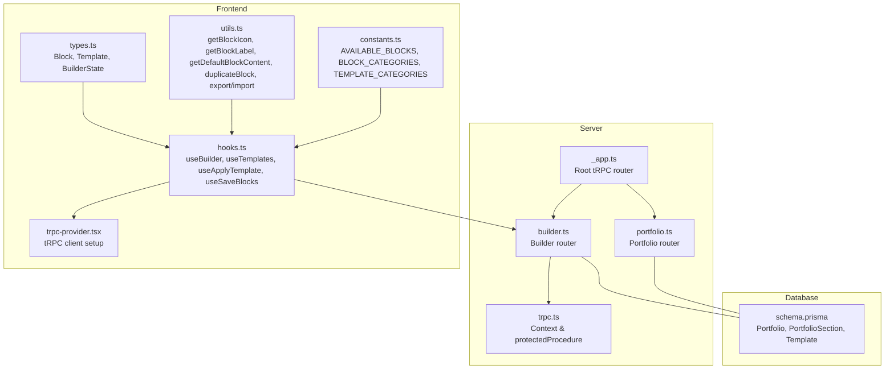
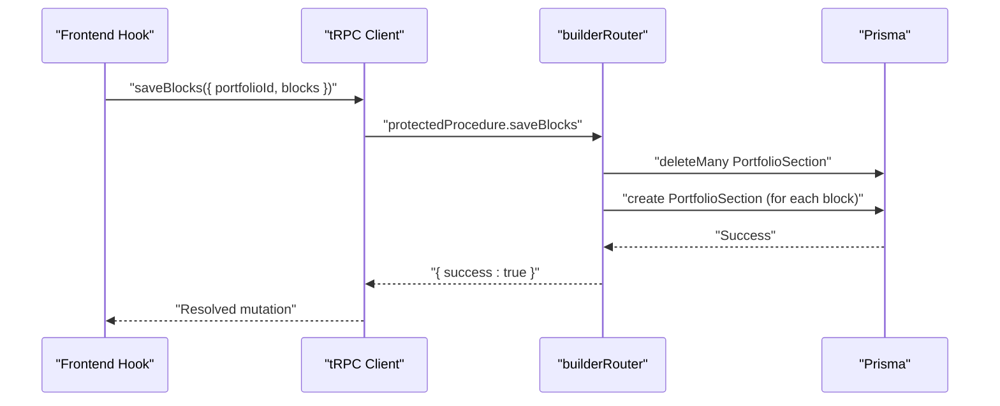
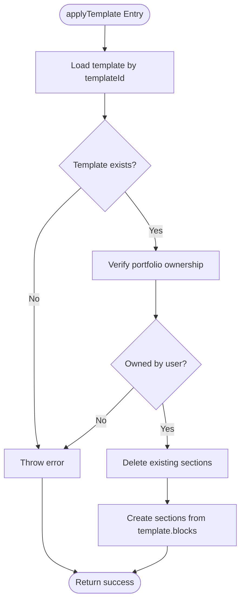
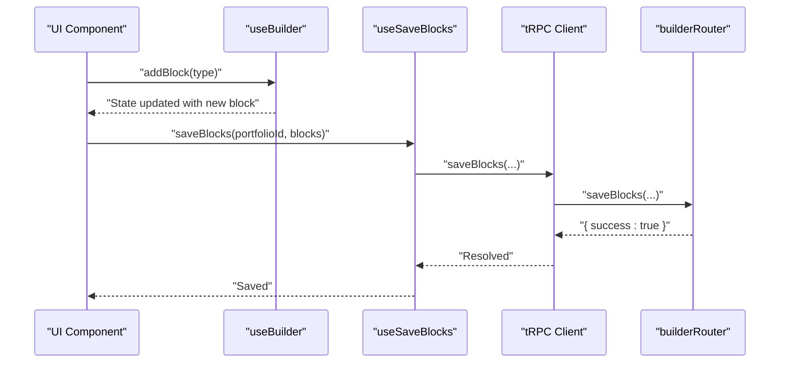
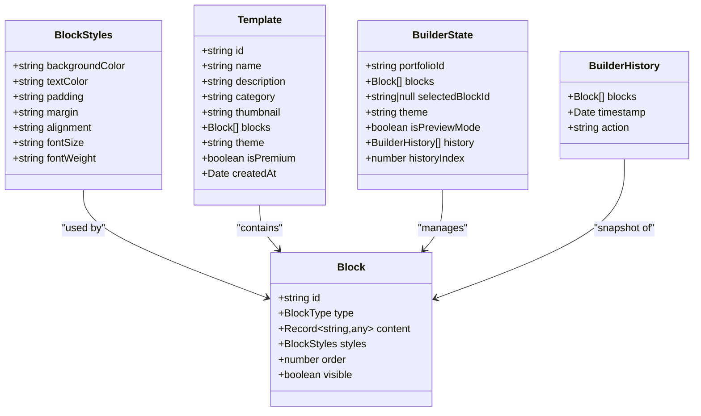
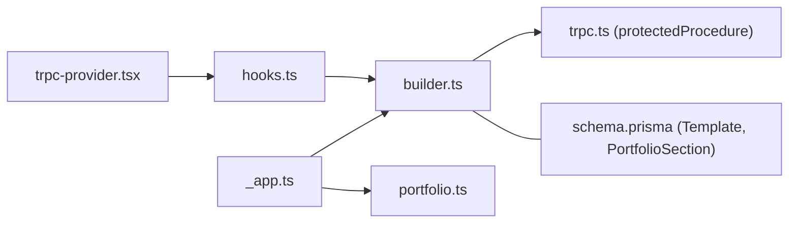

# Builder API

<cite>
**Referenced Files in This Document**
- [builder.ts](file://server/routers/builder.ts)
- [_app.ts](file://server/routers/_app.ts)
- [trpc.ts](file://server/trpc.ts)
- [trpc-provider.tsx](file://lib/trpc-provider.tsx)
- [types.ts](file://modules/builder/types.ts)
- [hooks.ts](file://modules/builder/hooks.ts)
- [utils.ts](file://modules/builder/utils.ts)
- [constants.ts](file://modules/builder/constants.ts)
- [portfolio.ts](file://server/routers/portfolio.ts)
- [types.ts](file://modules/portfolio/types.ts)
- [schema.prisma](file://prisma/schema.prisma)
</cite>

## Table of Contents
1. [Introduction](#introduction)
2. [Project Structure](#project-structure)
3. [Core Components](#core-components)
4. [Architecture Overview](#architecture-overview)
5. [Detailed Component Analysis](#detailed-component-analysis)
6. [Dependency Analysis](#dependency-analysis)
7. [Performance Considerations](#performance-considerations)
8. [Troubleshooting Guide](#troubleshooting-guide)
9. [Conclusion](#conclusion)
10. [Appendices](#appendices)

## Introduction
This document provides comprehensive API documentation for the portfolio builder endpoints. It covers drag-and-drop operations, component manipulation, layout management, and real-time preview updates. It also documents builder state management, component interaction patterns, templates, component libraries, customization options, and extension guidelines. Real-time collaboration and undo/redo functionality are addressed where applicable, along with state synchronization and practical workflows for dynamic component creation and layout reconfiguration.

## Project Structure
The builder API is exposed via tRPC under the builder router and integrates with portfolio management and Prisma data models. The frontend uses React Query hooks to interact with the backend.

**Diagram sources**
- [_app.ts](file://server/routers/_app.ts#L12-L18)
- [builder.ts](file://server/routers/builder.ts#L5-L155)
- [portfolio.ts](file://server/routers/portfolio.ts#L4-L114)
- [trpc.ts](file://server/trpc.ts#L12-L60)
- [hooks.ts](file://modules/builder/hooks.ts#L11-L116)
- [types.ts](file://modules/builder/types.ts#L5-L76)
- [utils.ts](file://modules/builder/utils.ts#L7-L118)
- [constants.ts](file://modules/builder/constants.ts#L5-L41)
- [trpc-provider.tsx](file://lib/trpc-provider.tsx#L18-L49)
- [schema.prisma](file://prisma/schema.prisma#L89-L166)

**Section sources**
- [_app.ts](file://server/routers/_app.ts#L12-L18)
- [builder.ts](file://server/routers/builder.ts#L5-L155)
- [portfolio.ts](file://server/routers/portfolio.ts#L4-L114)
- [trpc.ts](file://server/trpc.ts#L12-L60)
- [hooks.ts](file://modules/builder/hooks.ts#L11-L116)
- [types.ts](file://modules/builder/types.ts#L5-L76)
- [utils.ts](file://modules/builder/utils.ts#L7-L118)
- [constants.ts](file://modules/builder/constants.ts#L5-L41)
- [trpc-provider.tsx](file://lib/trpc-provider.tsx#L18-L49)
- [schema.prisma](file://prisma/schema.prisma#L89-L166)

## Core Components
- Builder router procedures:
  - getTemplates: Query templates for selection and application
  - applyTemplate: Apply a template to a portfolio by replacing sections
  - saveBlocks: Persist current blocks as portfolio sections
  - getBlocks: Retrieve portfolio blocks for rendering
- Frontend hooks:
  - useBuilder: Local state for blocks, selection, preview mode, and basic operations
  - useTemplates/useApplyTemplate/useSaveBlocks: tRPC integration for templates and persistence
- Data types and utilities:
  - Block, Template, BuilderState, BlockStyles, DragItem, DropResult
  - Block categories and available blocks
  - Default content generators and duplication utilities
- Context and protection:
  - protectedProcedure ensures authentication and ownership checks

**Section sources**
- [builder.ts](file://server/routers/builder.ts#L7-L154)
- [hooks.ts](file://modules/builder/hooks.ts#L11-L116)
- [types.ts](file://modules/builder/types.ts#L5-L76)
- [utils.ts](file://modules/builder/utils.ts#L45-L118)
- [constants.ts](file://modules/builder/constants.ts#L5-L41)
- [trpc.ts](file://server/trpc.ts#L50-L60)

## Architecture Overview
The builder API follows a clear separation of concerns:
- Server-side tRPC procedures handle validation, authorization, and persistence
- Frontend React hooks manage local builder state and delegate persistence to tRPC
- Prisma models store templates and portfolio sections as JSON blobs for flexibility

**Diagram sources**
- [hooks.ts](file://modules/builder/hooks.ts#L107-L116)
- [builder.ts](file://server/routers/builder.ts#L71-L119)
- [trpc-provider.tsx](file://lib/trpc-provider.tsx#L31-L39)

## Detailed Component Analysis

### Builder Router Procedures
- getTemplates
  - Purpose: Retrieve available templates ordered by creation time
  - Authentication: protectedProcedure
  - Input: None
  - Output: Array of templates
  - Notes: Templates include blocks serialized as JSON for later application
- applyTemplate
  - Purpose: Replace a portfolio’s sections with a template’s blocks
  - Authentication: protectedProcedure
  - Input: { portfolioId, templateId }
  - Validation: Ensures template exists and portfolio belongs to the current user
  - Behavior: Deletes existing sections, creates new ones from template blocks preserving order and visibility
  - Output: { success: true }
- saveBlocks
  - Purpose: Persist current builder state as portfolio sections
  - Authentication: protectedProcedure
  - Input: { portfolioId, blocks[] }
  - Validation: Ensures portfolio ownership
  - Behavior: Replaces all sections with provided blocks; transforms block content into section title/content
  - Output: { success: true }
- getBlocks
  - Purpose: Load portfolio sections into builder blocks
  - Authentication: protectedProcedure
  - Input: { portfolioId }
  - Validation: Ensures portfolio ownership
  - Behavior: Returns transformed blocks with content and styles extracted from section JSON
  - Output: blocks[] matching Block interface

**Diagram sources**
- [builder.ts](file://server/routers/builder.ts#L18-L68)

**Section sources**
- [builder.ts](file://server/routers/builder.ts#L7-L154)

### Frontend Builder Hooks and State Management
- useBuilder
  - Manages local BuilderState with blocks, selectedBlockId, theme, preview mode, and history index
  - Provides operations: addBlock, updateBlock, deleteBlock, reorderBlocks, selectBlock, togglePreview
  - Note: History is maintained locally; there is no server-side undo/redo in the current implementation
- useTemplates/useApplyTemplate/useSaveBlocks
  - Expose tRPC queries/mutations for templates and saving blocks
  - Return loading/error states and async variants for imperative usage

**Diagram sources**
- [hooks.ts](file://modules/builder/hooks.ts#L11-L84)
- [hooks.ts](file://modules/builder/hooks.ts#L107-L116)
- [builder.ts](file://server/routers/builder.ts#L71-L119)

**Section sources**
- [hooks.ts](file://modules/builder/hooks.ts#L11-L116)

### Data Types and Component Libraries
- BlockType: Enumerates supported block types (e.g., HERO, TEXT, IMAGE, GALLERY, VIDEO, SKILLS, TIMELINE, PROJECTS, TESTIMONIALS, CONTACT, CTA, SPACER)
- Block: Core builder unit with id, type, content, styles, order, visible
- BlockStyles: Visual styling attributes (colors, spacing, alignment, typography)
- Template: Includes metadata and blocks array for applying predefined layouts
- BuilderState: Tracks portfolioId, blocks, selectedBlockId, theme, preview mode, history, and historyIndex
- DragItem/DropResult: Used for drag-and-drop operations
- AVAILABLE_BLOCKS: List of available block types with categories and UI labels/icons
- BLOCK_CATEGORIES: Categories for organizing blocks (header, content, media, portfolio, social, layout)
- TEMPLATE_CATEGORIES: Categories for filtering templates (e.g., Developer, Designer, Writer, Photographer, Business)
- Default content generation and duplication utilities enable quick prototyping and cloning

**Diagram sources**
- [types.ts](file://modules/builder/types.ts#L5-L76)

**Section sources**
- [types.ts](file://modules/builder/types.ts#L5-L76)
- [constants.ts](file://modules/builder/constants.ts#L5-L41)
- [utils.ts](file://modules/builder/utils.ts#L45-L118)

### Templates and Component Library
- Templates are stored as JSON with blocks and metadata. They can be filtered by category and theme.
- Available blocks are categorized for easy discovery and drag-and-drop integration.
- Default content helpers populate initial values for each block type, enabling rapid authoring.

**Section sources**
- [builder.ts](file://server/routers/builder.ts#L7-L15)
- [constants.ts](file://modules/builder/constants.ts#L14-L27)
- [utils.ts](file://modules/builder/utils.ts#L45-L98)

### Real-Time Preview and Collaboration
- Preview mode is part of the local builder state and toggled via useBuilder.
- No WebSocket-based real-time collaboration is implemented in the current codebase.
- Auto-save interval constant is defined for periodic persistence, but the actual auto-save mechanism is not implemented in the provided files.

**Section sources**
- [hooks.ts](file://modules/builder/hooks.ts#L72-L74)
- [constants.ts](file://modules/builder/constants.ts#L40-L41)

### Undo/Redo and State Synchronization
- Local history is tracked in BuilderState.history and historyIndex.
- There is no server-side undo/redo implementation; state synchronization occurs through explicit save operations.

**Section sources**
- [types.ts](file://modules/builder/types.ts#L51-L65)
- [hooks.ts](file://modules/builder/hooks.ts#L11-L20)

### Practical Workflows

#### Dynamic Component Creation
- Add a block via useBuilder.addBlock(type, index?)
- Update content/styles via useBuilder.updateBlock(id, updates)
- Duplicate a block using utils.duplicateBlock for quick variations

**Section sources**
- [hooks.ts](file://modules/builder/hooks.ts#L22-L45)
- [utils.ts](file://modules/builder/utils.ts#L100-L106)

#### Layout Reconfiguration
- Reorder blocks via useBuilder.reorderBlocks(startIndex, endIndex)
- Toggle visibility via useBuilder.updateBlock(id, { visible })
- Adjust styles via useBuilder.updateBlock(id, { styles })

**Section sources**
- [hooks.ts](file://modules/builder/hooks.ts#L55-L66)
- [hooks.ts](file://modules/builder/hooks.ts#L38-L45)

#### Visual Editing Workflow
- Select a block via useBuilder.selectBlock(id)
- Toggle preview mode via useBuilder.togglePreview()
- Persist changes via useSaveBlocks.saveBlocks(portfolioId, blocks)

**Section sources**
- [hooks.ts](file://modules/builder/hooks.ts#L68-L74)
- [hooks.ts](file://modules/builder/hooks.ts#L107-L116)

#### Applying a Template
- Fetch templates via useTemplates.templates
- Apply a template via useApplyTemplate.applyTemplate({ portfolioId, templateId })
- Reload blocks via getBlocks to reflect applied layout

**Section sources**
- [hooks.ts](file://modules/builder/hooks.ts#L87-L105)
- [builder.ts](file://server/routers/builder.ts#L18-L68)
- [builder.ts](file://server/routers/builder.ts#L122-L154)

### API Reference

#### GET /api/trpc/builder.getTemplates
- Authentication: Required
- Description: Retrieve available templates
- Input: None
- Output: Template[]
- Example usage: useTemplates()

**Section sources**
- [builder.ts](file://server/routers/builder.ts#L7-L15)
- [hooks.ts](file://modules/builder/hooks.ts#L87-L94)

#### POST /api/trpc/builder.applyTemplate
- Authentication: Required
- Description: Apply a template to a portfolio by replacing its sections
- Input: { portfolioId: string, templateId: string }
- Output: { success: true }
- Behavior: Validates ownership, deletes existing sections, creates new ones from template blocks
- Example usage: useApplyTemplate.applyTemplate({ portfolioId, templateId })

**Section sources**
- [builder.ts](file://server/routers/builder.ts#L18-L68)
- [hooks.ts](file://modules/builder/hooks.ts#L96-L105)

#### POST /api/trpc/builder.saveBlocks
- Authentication: Required
- Description: Persist current builder blocks as portfolio sections
- Input: { portfolioId: string, blocks: Block[] }
- Output: { success: true }
- Behavior: Validates ownership, replaces all sections with provided blocks
- Example usage: useSaveBlocks.saveBlocks(portfolioId, blocks)

**Section sources**
- [builder.ts](file://server/routers/builder.ts#L71-L119)
- [hooks.ts](file://modules/builder/hooks.ts#L107-L116)

#### GET /api/trpc/builder.getBlocks
- Authentication: Required
- Description: Load portfolio sections into builder blocks
- Input: { portfolioId: string }
- Output: Block[]
- Behavior: Validates ownership, returns transformed blocks with content and styles
- Example usage: useBuilder state population

**Section sources**
- [builder.ts](file://server/routers/builder.ts#L122-L154)

## Dependency Analysis
- Router composition: appRouter aggregates builder and portfolio routers
- Protected procedures: All builder endpoints rely on protectedProcedure for authentication and ownership checks
- Data models: Templates and PortfolioSections store flexible JSON content enabling extensible block schemas
- Frontend integration: tRPC provider configures batching and serialization for efficient client-server communication

**Diagram sources**
- [_app.ts](file://server/routers/_app.ts#L12-L18)
- [builder.ts](file://server/routers/builder.ts#L5-L155)
- [portfolio.ts](file://server/routers/portfolio.ts#L4-L114)
- [trpc.ts](file://server/trpc.ts#L50-L60)
- [schema.prisma](file://prisma/schema.prisma#L152-L166)
- [hooks.ts](file://modules/builder/hooks.ts#L11-L116)
- [trpc-provider.tsx](file://lib/trpc-provider.tsx#L31-L39)

**Section sources**
- [_app.ts](file://server/routers/_app.ts#L12-L18)
- [builder.ts](file://server/routers/builder.ts#L5-L155)
- [portfolio.ts](file://server/routers/portfolio.ts#L4-L114)
- [trpc.ts](file://server/trpc.ts#L50-L60)
- [schema.prisma](file://prisma/schema.prisma#L152-L166)
- [hooks.ts](file://modules/builder/hooks.ts#L11-L116)
- [trpc-provider.tsx](file://lib/trpc-provider.tsx#L31-L39)

## Performance Considerations
- Batched tRPC requests: The tRPC client uses httpBatchLink to reduce network overhead
- Serialization: superjson transformer optimizes payload sizes for complex nested structures
- Auto-save interval: Constant defined for periodic persistence; consider debouncing UI events to avoid excessive saves
- Pagination and ordering: Queries fetch ordered sections; keep the number of blocks reasonable to prevent large payloads

[No sources needed since this section provides general guidance]

## Troubleshooting Guide
- UNAUTHORIZED errors: Ensure the user is authenticated; protectedProcedure throws when session is missing
- Template not found: Verify templateId exists before applying
- Access denied: Confirm the portfolio belongs to the current user before saving or retrieving
- Zod validation errors: The error formatter includes flattened Zod errors for precise field-level feedback

**Section sources**
- [trpc.ts](file://server/trpc.ts#L29-L38)
- [builder.ts](file://server/routers/builder.ts#L33-L44)
- [builder.ts](file://server/routers/builder.ts#L95-L97)
- [builder.ts](file://server/routers/builder.ts#L132-L134)

## Conclusion
The Builder API provides a robust foundation for portfolio composition with templates, dynamic blocks, and straightforward persistence. While local state management and preview mode are handled client-side, server-side operations ensure secure ownership checks and reliable persistence. Extensibility is achieved through the JSON-based content model and standardized block interfaces, enabling future enhancements such as real-time collaboration and server-backed undo/redo.

[No sources needed since this section summarizes without analyzing specific files]

## Appendices

### Builder Extension Patterns
- Adding a new block type:
  - Extend BlockType and AVAILABLE_BLOCKS
  - Provide getDefaultBlockContent for the new type
  - Update UI components to render the new block
- Customizing templates:
  - Store additional metadata in Template (e.g., theme, premium flag)
  - Serialize block content ensuring compatibility with existing consumers
- Integrating with portfolio lifecycle:
  - Use portfolio.create/update/publish endpoints alongside builder operations
  - Ensure consistent theme and status transitions

**Section sources**
- [types.ts](file://modules/builder/types.ts#L5-L18)
- [constants.ts](file://modules/builder/constants.ts#L14-L27)
- [utils.ts](file://modules/builder/utils.ts#L45-L98)
- [portfolio.ts](file://server/routers/portfolio.ts#L29-L114)