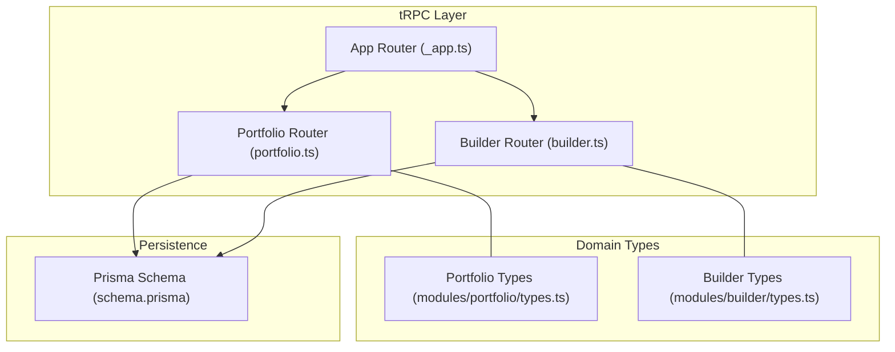
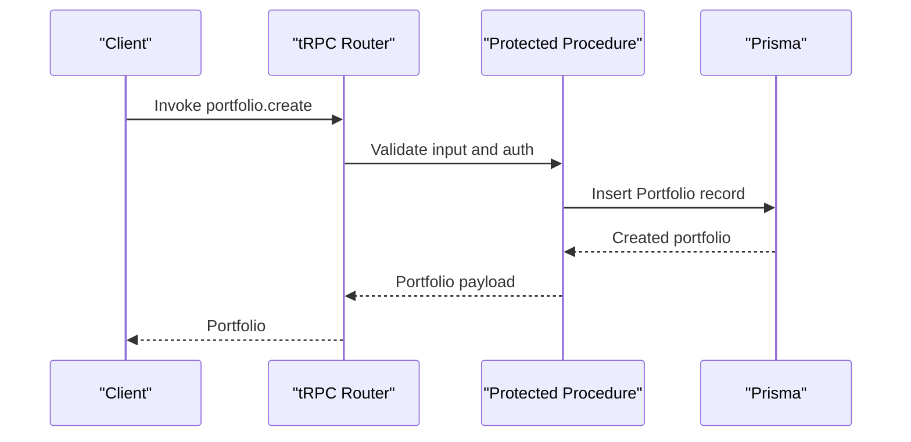
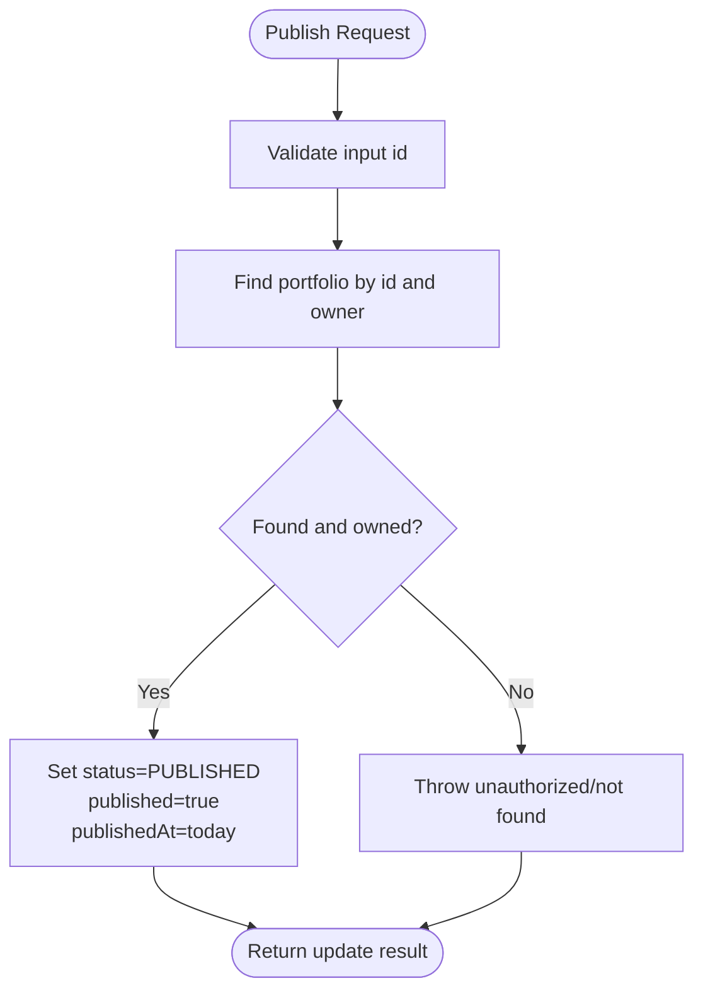
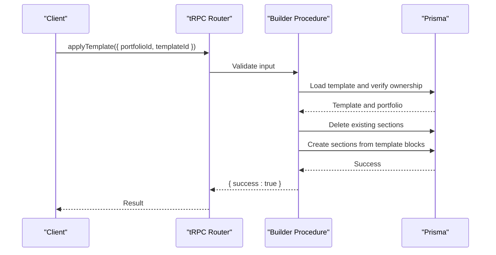
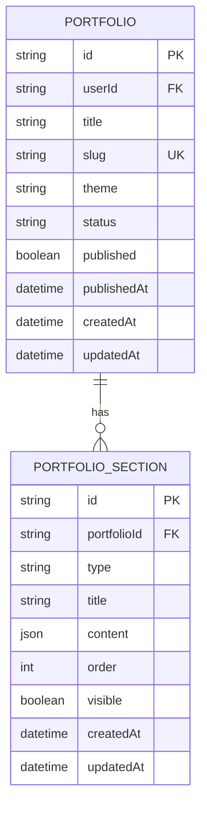
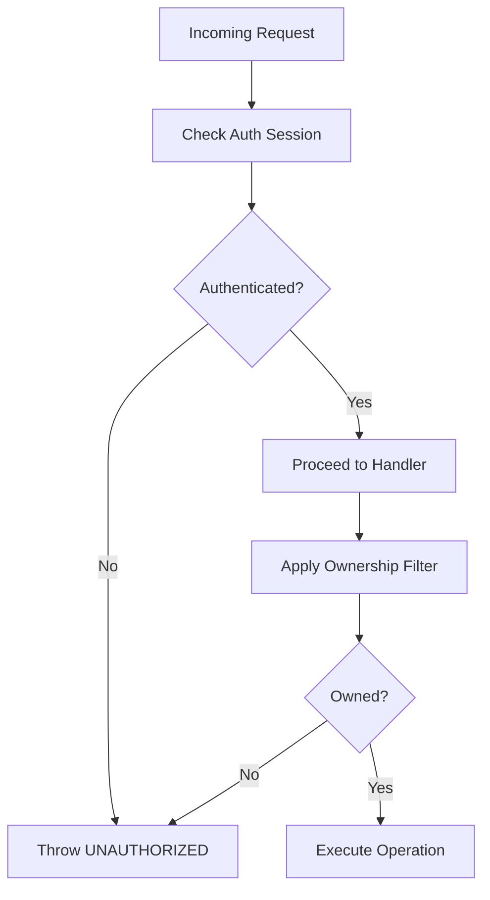
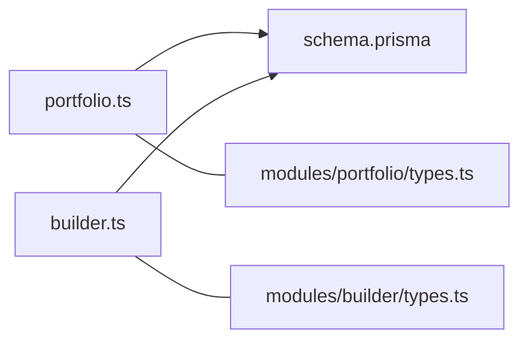

# Portfolio API

<cite>
**Referenced Files in This Document**
- [portfolio.ts](file://server/routers/portfolio.ts)
- [builder.ts](file://server/routers/builder.ts)
- [trpc.ts](file://server/trpc.ts)
- [_app.ts](file://server/routers/_app.ts)
- [types.ts](file://modules/portfolio/types.ts)
- [utils.ts](file://modules/portfolio/utils.ts)
- [constants.ts](file://modules/portfolio/constants.ts)
- [types.ts](file://modules/builder/types.ts)
- [constants.ts](file://modules/builder/constants.ts)
- [schema.prisma](file://prisma/schema.prisma)
- [hooks.ts](file://modules/portfolio/hooks.ts)
</cite>

## Table of Contents
1. [Introduction](#introduction)
2. [Project Structure](#project-structure)
3. [Core Components](#core-components)
4. [Architecture Overview](#architecture-overview)
5. [Detailed Component Analysis](#detailed-component-analysis)
6. [Dependency Analysis](#dependency-analysis)
7. [Performance Considerations](#performance-considerations)
8. [Troubleshooting Guide](#troubleshooting-guide)
9. [Conclusion](#conclusion)
10. [Appendices](#appendices)

## Introduction
This document provides comprehensive API documentation for portfolio management endpoints built with tRPC. It covers portfolio CRUD operations, publishing, and section/template management via the builder module. It also documents input/output schemas, validation rules, business logic constraints, and practical workflows such as applying templates, saving blocks, and publishing portfolios. Access control, portfolio limits, and URL generation are included for operational guidance.

## Project Structure
The portfolio API is organized under the tRPC router hierarchy:
- Root router composes feature routers including portfolio and builder.
- Portfolio router exposes list, get by ID, create, update, delete, and publish procedures.
- Builder router exposes template retrieval, template application, block saving, and block retrieval.
- Shared types and utilities define data contracts and helper functions.
- Prisma schema defines database models for portfolios, sections, analytics, and templates.

**Diagram sources**
- [_app.ts](file://server/routers/_app.ts#L12-L18)
- [portfolio.ts](file://server/routers/portfolio.ts#L4-L114)
- [builder.ts](file://server/routers/builder.ts#L5-L155)
- [types.ts](file://modules/portfolio/types.ts#L19-L72)
- [types.ts](file://modules/builder/types.ts#L20-L75)
- [schema.prisma](file://prisma/schema.prisma#L89-L166)

**Section sources**
- [_app.ts](file://server/routers/_app.ts#L12-L18)
- [portfolio.ts](file://server/routers/portfolio.ts#L4-L114)
- [builder.ts](file://server/routers/builder.ts#L5-L155)
- [types.ts](file://modules/portfolio/types.ts#L19-L72)
- [types.ts](file://modules/builder/types.ts#L20-L75)
- [schema.prisma](file://prisma/schema.prisma#L89-L166)

## Core Components
- Portfolio Router Procedures
  - list: Returns all portfolios owned by the authenticated user, ordered by creation date.
  - getById: Retrieves a single portfolio by ID if owned by the authenticated user.
  - create: Creates a new portfolio with defaults and initial status set to draft.
  - update: Partially updates portfolio metadata, theme, status, and SEO fields.
  - delete: Removes a portfolio owned by the authenticated user.
  - publish: Sets status to PUBLISHED, marks published, and records publishedAt.
- Builder Router Procedures
  - getTemplates: Lists available templates.
  - applyTemplate: Applies a template’s blocks to a portfolio after validating ownership and clearing existing sections.
  - saveBlocks: Saves a list of blocks to a portfolio after validating ownership and replacing existing sections.
  - getBlocks: Retrieves portfolio blocks ordered by position.
- Access Control
  - All portfolio and builder procedures are protected and require authentication.
  - Ownership checks ensure users can only access their own portfolios.
- Data Contracts
  - Portfolio, PortfolioSection, PortfolioAnalytics, and Template models are defined in Prisma.
  - TypeScript enums and interfaces define input/output shapes and constraints.

**Section sources**
- [portfolio.ts](file://server/routers/portfolio.ts#L6-L114)
- [builder.ts](file://server/routers/builder.ts#L7-L155)
- [trpc.ts](file://server/trpc.ts#L50-L60)
- [schema.prisma](file://prisma/schema.prisma#L89-L166)
- [types.ts](file://modules/portfolio/types.ts#L19-L72)
- [types.ts](file://modules/builder/types.ts#L20-L75)

## Architecture Overview
The portfolio API follows a layered architecture:
- Presentation: tRPC procedures exposed via Next.js API routes.
- Domain: Portfolio and builder procedures encapsulate business logic.
- Persistence: Prisma ORM maps domain operations to PostgreSQL.
- Security: Protected procedures enforce authentication and ownership checks.

**Diagram sources**
- [portfolio.ts](file://server/routers/portfolio.ts#L29-L54)
- [trpc.ts](file://server/trpc.ts#L50-L60)
- [schema.prisma](file://prisma/schema.prisma#L89-L113)

## Detailed Component Analysis

### Portfolio Management Endpoints
- list
  - Purpose: Retrieve all portfolios for the authenticated user.
  - Input: None.
  - Output: Array of portfolios with metadata.
  - Validation: None (returns all owned).
  - Business Logic: Ordered by creation date descending.
- getById
  - Purpose: Fetch a specific portfolio by ID.
  - Input: id (string).
  - Output: Portfolio object or null.
  - Validation: Zod object with id field.
  - Business Logic: Ownership enforced via where clause.
- create
  - Purpose: Create a new portfolio.
  - Input: title (required), slug (optional), description (optional), theme (optional).
  - Output: Created portfolio.
  - Validation: Zod schema enforces length and enum constraints.
  - Business Logic: Slug auto-generated if omitted; default theme MINIMAL; status DRAFT.
- update
  - Purpose: Partially update portfolio metadata and settings.
  - Input: id (required), plus optional fields: title, slug, description, theme, status, customDomain, seoTitle, seoDescription.
  - Output: Update result (affected rows).
  - Validation: Zod schema with optional fields and enum constraints.
  - Business Logic: Ownership enforced; status transitions handled by caller.
- delete
  - Purpose: Remove a portfolio.
  - Input: id (string).
  - Output: { success: true }.
  - Validation: Zod object with id field.
  - Business Logic: Ownership enforced; cascade deletes sections/analytics via Prisma relations.
- publish
  - Purpose: Publish a portfolio.
  - Input: id (string).
  - Output: Update result (marks published and sets publishedAt).
  - Validation: Zod object with id field.
  - Business Logic: Updates status to PUBLISHED and sets published flag and timestamp.

**Diagram sources**
- [portfolio.ts](file://server/routers/portfolio.ts#L96-L114)

**Section sources**
- [portfolio.ts](file://server/routers/portfolio.ts#L6-L114)
- [schema.prisma](file://prisma/schema.prisma#L89-L113)
- [types.ts](file://modules/portfolio/types.ts#L19-L35)

### Builder and Template Operations
- getTemplates
  - Purpose: List available templates.
  - Input: None.
  - Output: Array of templates.
  - Validation: None.
  - Business Logic: Ordered by creation date.
- applyTemplate
  - Purpose: Apply a template to a portfolio by replacing existing sections with template blocks.
  - Input: portfolioId (string), templateId (string).
  - Output: { success: true }.
  - Validation: Zod object with both IDs.
  - Business Logic: Validates ownership; clears existing sections; creates new sections from template blocks preserving order and visibility.
- saveBlocks
  - Purpose: Persist a list of blocks to a portfolio, replacing existing sections.
  - Input: portfolioId (string), blocks array with type, content, styles, order, visible.
  - Output: { success: true }.
  - Validation: Zod object with blocks array structure.
  - Business Logic: Validates ownership; replaces all sections with provided blocks.
- getBlocks
  - Purpose: Retrieve blocks for a portfolio ordered by position.
  - Input: portfolioId (string).
  - Output: Blocks array with computed styles and content.
  - Validation: Zod object with portfolioId.
  - Business Logic: Validates ownership; returns transformed sections.

**Diagram sources**
- [builder.ts](file://server/routers/builder.ts#L17-L68)
- [schema.prisma](file://prisma/schema.prisma#L115-L130)

**Section sources**
- [builder.ts](file://server/routers/builder.ts#L7-L155)
- [schema.prisma](file://prisma/schema.prisma#L115-L166)
- [types.ts](file://modules/builder/types.ts#L20-L49)
- [constants.ts](file://modules/builder/constants.ts#L14-L27)

### Portfolio Sections and Content Organization
- PortfolioSection model stores typed content blocks with ordering and visibility.
- Sections are persisted as JSON and mapped to block types in the builder.
- Ordering is maintained via an integer order field; retrieval supports ascending order.

**Diagram sources**
- [schema.prisma](file://prisma/schema.prisma#L89-L130)

**Section sources**
- [schema.prisma](file://prisma/schema.prisma#L115-L130)
- [types.ts](file://modules/builder/types.ts#L20-L27)

### Access Control and Authentication
- Protected procedures enforce authentication via a session check.
- Ownership checks ensure users can only operate on their own portfolios.
- Template operations additionally verify portfolio ownership before applying or saving blocks.

**Diagram sources**
- [trpc.ts](file://server/trpc.ts#L50-L60)
- [portfolio.ts](file://server/routers/portfolio.ts#L16-L27)
- [builder.ts](file://server/routers/builder.ts#L37-L44)

**Section sources**
- [trpc.ts](file://server/trpc.ts#L50-L60)
- [portfolio.ts](file://server/routers/portfolio.ts#L16-L27)
- [builder.ts](file://server/routers/builder.ts#L37-L44)

### Practical Workflows and Examples
- Creating a portfolio
  - Call create with title and optional slug/theme.
  - On success, the portfolio is created with status DRAFT.
- Publishing a portfolio
  - Call publish with portfolio id.
  - On success, status becomes PUBLISHED and publishedAt is set.
- Applying a template
  - Call applyTemplate with portfolioId and templateId.
  - Existing sections are replaced with template blocks.
- Saving custom blocks
  - Call saveBlocks with portfolioId and blocks array.
  - Existing sections are replaced with provided blocks.
- Retrieving blocks
  - Call getBlocks with portfolioId.
  - Returns blocks ordered by position.

**Section sources**
- [portfolio.ts](file://server/routers/portfolio.ts#L29-L54)
- [portfolio.ts](file://server/routers/portfolio.ts#L96-L114)
- [builder.ts](file://server/routers/builder.ts#L17-L68)
- [builder.ts](file://server/routers/builder.ts#L70-L119)
- [builder.ts](file://server/routers/builder.ts#L121-L155)

### Input/Output Schemas and Validation Rules
- Portfolio Creation (create)
  - title: required, min length 1, max length 100.
  - slug: optional, min length 3, max length 100, validated by pattern.
  - description: optional, max length 500.
  - theme: optional enum among MINIMAL, MODERN, CREATIVE, PROFESSIONAL, DARK.
- Portfolio Update (update)
  - id: required.
  - title/slug/description/theme/status/customDomain/seoTitle/seoDescription: all optional with same constraints as create.
- Portfolio Publish (publish)
  - id: required.
- Template Application (applyTemplate)
  - portfolioId: required.
  - templateId: required.
- Block Save/Get (saveBlocks/getBlocks)
  - portfolioId: required.
  - blocks: array of block objects with type, content, styles, order, visible.

**Section sources**
- [portfolio.ts](file://server/routers/portfolio.ts#L30-L67)
- [portfolio.ts](file://server/routers/portfolio.ts#L97-L98)
- [builder.ts](file://server/routers/builder.ts#L17-L24)
- [builder.ts](file://server/routers/builder.ts#L70-L86)
- [builder.ts](file://server/routers/builder.ts#L121-L124)
- [utils.ts](file://modules/portfolio/utils.ts#L42-L44)

### Business Logic Constraints
- Portfolio Status Lifecycle
  - Initial status: DRAFT.
  - Publish requires status DRAFT and non-empty title.
- Slug Generation and Validation
  - Auto-generated from title if omitted.
  - Must match allowed pattern and length range.
- Ownership Enforcement
  - All portfolio operations filter by userId.
  - Template and block operations additionally verify ownership before mutating data.
- Limits and Categories
  - Portfolio limits per tier are defined in constants.
  - Section types and template categories are enumerated.

**Section sources**
- [portfolio.ts](file://server/routers/portfolio.ts#L39-L51)
- [portfolio.ts](file://server/routers/portfolio.ts#L99-L110)
- [utils.ts](file://modules/portfolio/utils.ts#L7-L12)
- [utils.ts](file://modules/portfolio/utils.ts#L25-L27)
- [utils.ts](file://modules/portfolio/utils.ts#L42-L44)
- [constants.ts](file://modules/portfolio/constants.ts#L5-L9)
- [constants.ts](file://modules/portfolio/constants.ts#L19-L30)

### Collaboration and Sharing
- Current implementation focuses on individual ownership with no explicit sharing/collaboration endpoints.
- Publishing logic enables public visibility via generated URLs.

**Section sources**
- [portfolio.ts](file://server/routers/portfolio.ts#L96-L114)
- [utils.ts](file://modules/portfolio/utils.ts#L14-L19)

### Versioning and Migration Patterns
- No explicit versioning fields are present in the portfolio schema.
- Migration patterns can leverage template application to evolve portfolio structure over time.

**Section sources**
- [schema.prisma](file://prisma/schema.prisma#L89-L113)
- [builder.ts](file://server/routers/builder.ts#L17-L68)

## Dependency Analysis
- Router Composition
  - App router composes portfolio and builder routers.
- Procedure Dependencies
  - Portfolio procedures depend on Prisma Portfolio and PortfolioSection models.
  - Builder procedures depend on Prisma Template and PortfolioSection models.
- Type Dependencies
  - Portfolio and builder types define shared contracts for blocks and sections.

**Diagram sources**
- [portfolio.ts](file://server/routers/portfolio.ts#L4-L114)
- [builder.ts](file://server/routers/builder.ts#L5-L155)
- [schema.prisma](file://prisma/schema.prisma#L89-L166)
- [types.ts](file://modules/portfolio/types.ts#L19-L72)
- [types.ts](file://modules/builder/types.ts#L20-L75)

**Section sources**
- [_app.ts](file://server/routers/_app.ts#L12-L18)
- [portfolio.ts](file://server/routers/portfolio.ts#L4-L114)
- [builder.ts](file://server/routers/builder.ts#L5-L155)
- [schema.prisma](file://prisma/schema.prisma#L89-L166)

## Performance Considerations
- Indexes on Portfolio (userId, slug, status) and PortfolioSection (portfolioId, order) support efficient queries.
- Bulk operations like applyTemplate and saveBlocks replace entire section sets; consider throttling for large portfolios.
- Slug generation and validation occur on the server; ensure minimal client-side computation.

**Section sources**
- [schema.prisma](file://prisma/schema.prisma#L110-L130)

## Troubleshooting Guide
- Unauthorized Access
  - Symptom: UNAUTHORIZED errors on protected procedures.
  - Cause: Missing or invalid session.
  - Resolution: Ensure proper authentication before invoking procedures.
- Ownership Violation
  - Symptom: Not found or unauthorized errors when accessing portfolios/templates/blocks.
  - Cause: Attempting to modify another user’s data.
  - Resolution: Verify portfolioId belongs to the authenticated user.
- Validation Errors
  - Symptom: Zod validation failures for title/slug/theme/status.
  - Cause: Out-of-range lengths or invalid enum values.
  - Resolution: Align inputs with constraints defined in schemas.
- Slug Conflicts
  - Symptom: Duplicate slug errors during create/update.
  - Cause: Non-unique slug.
  - Resolution: Provide a unique slug or omit to auto-generate.

**Section sources**
- [trpc.ts](file://server/trpc.ts#L29-L38)
- [portfolio.ts](file://server/routers/portfolio.ts#L30-L38)
- [portfolio.ts](file://server/routers/portfolio.ts#L57-L67)
- [builder.ts](file://server/routers/builder.ts#L17-L24)
- [utils.ts](file://modules/portfolio/utils.ts#L42-L44)

## Conclusion
The portfolio API provides a secure, schema-driven interface for managing portfolios and their content. It enforces authentication and ownership, offers robust validation, and integrates with a template-based builder for flexible content organization. The documented workflows and constraints enable reliable development of portfolio creation, editing, publishing, and migration scenarios.

## Appendices
- Utility Functions
  - generateSlug: Converts title to URL-friendly slug.
  - getPortfolioUrl: Builds public URL using custom domain or default path.
  - isPublished: Checks combined published and status flags.
  - canPublish: Validates preconditions for publishing.
  - validateSlug: Regex-based slug validation.
- Frontend Hooks
  - usePortfolios, usePortfolio, useCreatePortfolio, useUpdatePortfolio, useDeletePortfolio, usePublishPortfolio integrate with tRPC queries/mutations.

**Section sources**
- [utils.ts](file://modules/portfolio/utils.ts#L7-L19)
- [utils.ts](file://modules/portfolio/utils.ts#L21-L54)
- [hooks.ts](file://modules/portfolio/hooks.ts#L10-L99)