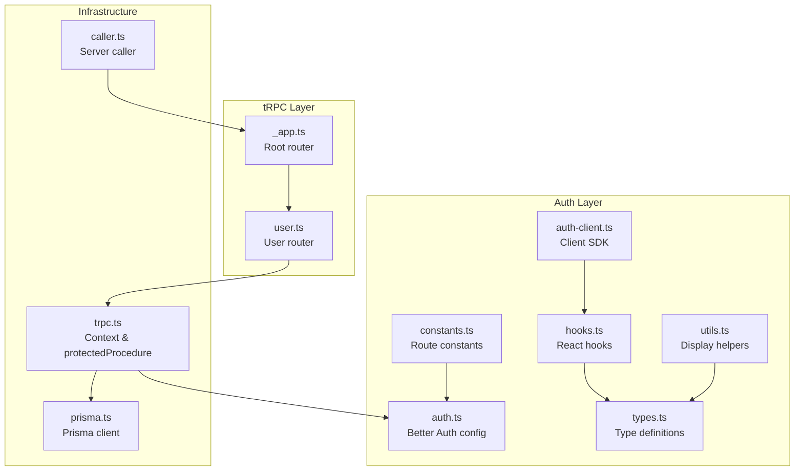
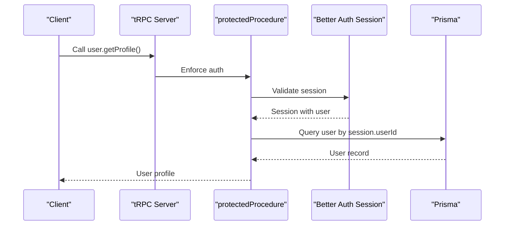
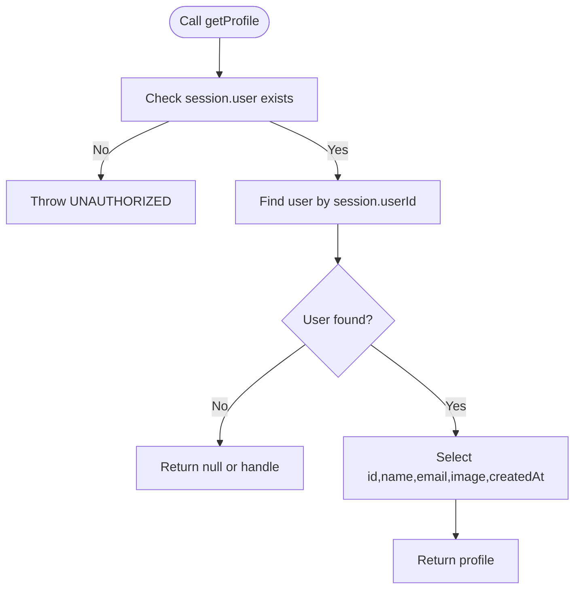
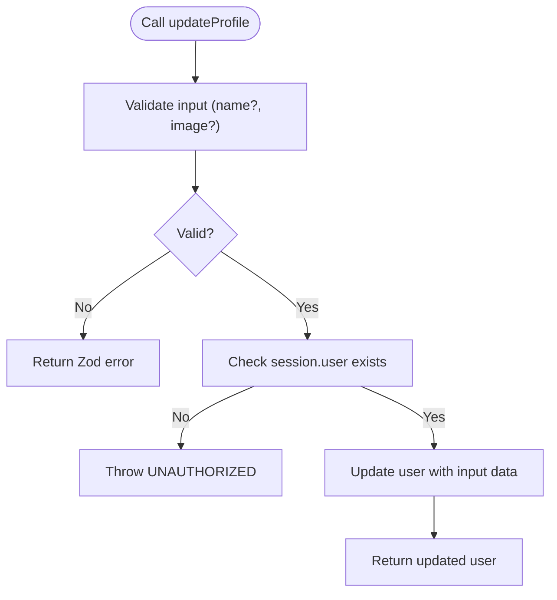
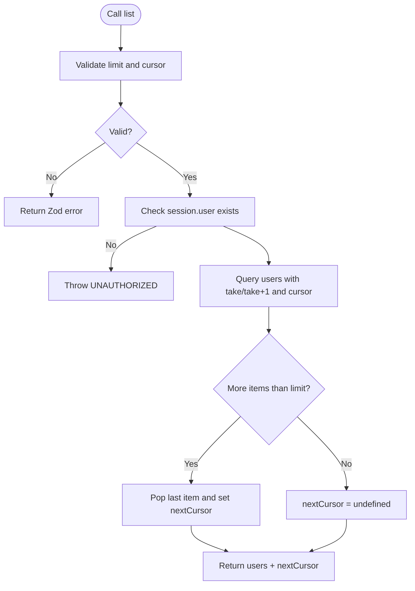
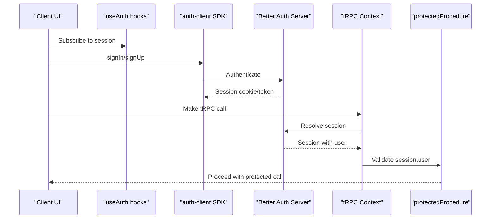
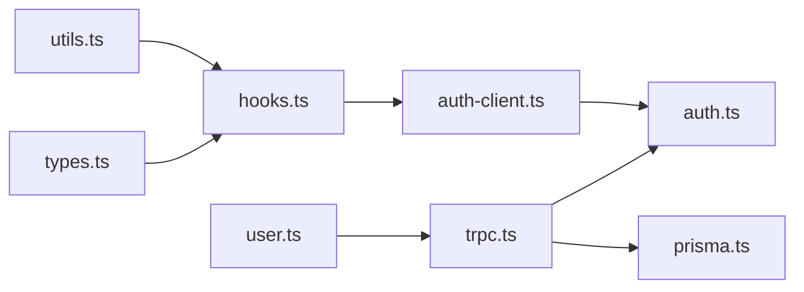

# User API

<cite>
**Referenced Files in This Document**
- [user.ts](file://server/routers/user.ts)
- [trpc.ts](file://server/trpc.ts)
- [_app.ts](file://server/routers/_app.ts)
- [auth.ts](file://lib/auth.ts)
- [auth-client.ts](file://lib/auth-client.ts)
- [hooks.ts](file://modules/auth/hooks.ts)
- [types.ts](file://modules/auth/types.ts)
- [utils.ts](file://modules/auth/utils.ts)
- [constants.ts](file://modules/auth/constants.ts)
- [prisma.ts](file://lib/prisma.ts)
- [caller.ts](file://server/caller.ts)
</cite>

## Table of Contents
1. [Introduction](#introduction)
2. [Project Structure](#project-structure)
3. [Core Components](#core-components)
4. [Architecture Overview](#architecture-overview)
5. [Detailed Component Analysis](#detailed-component-analysis)
6. [Dependency Analysis](#dependency-analysis)
7. [Performance Considerations](#performance-considerations)
8. [Troubleshooting Guide](#troubleshooting-guide)
9. [Conclusion](#conclusion)
10. [Appendices](#appendices)

## Introduction
This document provides comprehensive API documentation for user management endpoints powered by tRPC. It covers authentication workflows, session management, user CRUD operations, and integration with Better Auth. It also documents input/output schemas, authentication requirements, error handling, and practical client implementation patterns.

## Project Structure
The user API is implemented as part of the tRPC router ecosystem. The user router exposes public and protected procedures, while the tRPC initialization sets up context injection for session and database access. Better Auth handles authentication, sessions, and OAuth providers. The module-level auth exports provide client-side hooks and utilities.

**Diagram sources**
- [_app.ts](file://server/routers/_app.ts#L1-L21)
- [user.ts](file://server/routers/user.ts#L1-L79)
- [trpc.ts](file://server/trpc.ts#L1-L61)
- [auth.ts](file://lib/auth.ts#L1-L25)
- [auth-client.ts](file://lib/auth-client.ts#L1-L8)
- [hooks.ts](file://modules/auth/hooks.ts#L1-L29)
- [types.ts](file://modules/auth/types.ts#L1-L36)
- [utils.ts](file://modules/auth/utils.ts#L1-L29)
- [constants.ts](file://modules/auth/constants.ts#L1-L25)
- [prisma.ts](file://lib/prisma.ts#L1-L14)
- [caller.ts](file://server/caller.ts#L1-L7)

**Section sources**
- [_app.ts](file://server/routers/_app.ts#L1-L21)
- [user.ts](file://server/routers/user.ts#L1-L79)
- [trpc.ts](file://server/trpc.ts#L1-L61)

## Core Components
- User Router: Exposes public and protected procedures for user operations.
- tRPC Context: Injects session and database into every request.
- Protected Procedure Guard: Enforces authentication for protected routes.
- Better Auth: Provides authentication, session management, and OAuth integrations.
- Client Auth SDK: React hooks and utilities for client-side authentication.

Key capabilities:
- Public procedures (e.g., hello)
- Protected procedures (profile read/update, paginated user listing)
- Session-based authentication via Better Auth
- OAuth providers configured (Google, GitHub)

**Section sources**
- [user.ts](file://server/routers/user.ts#L1-L79)
- [trpc.ts](file://server/trpc.ts#L1-L61)
- [auth.ts](file://lib/auth.ts#L1-L25)
- [auth-client.ts](file://lib/auth-client.ts#L1-L8)

## Architecture Overview
The user API follows a layered architecture:
- Presentation: tRPC routes under the user router
- Application: tRPC context and protectedProcedure guard
- Domain: Better Auth for authentication and session management
- Persistence: Prisma client injected via tRPC context

**Diagram sources**
- [user.ts](file://server/routers/user.ts#L14-L27)
- [trpc.ts](file://server/trpc.ts#L50-L60)
- [auth.ts](file://lib/auth.ts#L1-L25)
- [prisma.ts](file://lib/prisma.ts#L1-L14)

## Detailed Component Analysis

### User Router Procedures
The user router defines the following procedures:
- Public procedure: hello
- Protected procedures:
  - getProfile: Retrieve current user’s profile
  - updateProfile: Update name and/or image
  - list: Paginated listing of users

Input/Output schemas and behavior:
- hello
  - Input: optional name string
  - Output: greeting object
  - Authentication: none
- getProfile
  - Input: none
  - Output: user profile (id, name, email, image, createdAt)
  - Authentication: required
- updateProfile
  - Input: name (optional, min length 1), image (optional, URL)
  - Output: updated user
  - Authentication: required
- list
  - Input: limit (1–100, default 10), cursor (optional)
  - Output: users array and nextCursor (optional)
  - Authentication: required

Error handling:
- Validation errors are returned with flattened Zod errors
- Missing/unauthorized session triggers UNAUTHORIZED error

Security considerations:
- All protected procedures rely on the protectedProcedure guard
- Session user ID is used to scope queries/mutations

**Section sources**
- [user.ts](file://server/routers/user.ts#L1-L79)
- [trpc.ts](file://server/trpc.ts#L29-L38)
- [trpc.ts](file://server/trpc.ts#L50-L60)

#### getProfile Flow

**Diagram sources**
- [user.ts](file://server/routers/user.ts#L14-L27)
- [trpc.ts](file://server/trpc.ts#L50-L60)

#### updateProfile Flow

**Diagram sources**
- [user.ts](file://server/routers/user.ts#L29-L43)
- [trpc.ts](file://server/trpc.ts#L29-L38)
- [trpc.ts](file://server/trpc.ts#L50-L60)

#### list Flow

**Diagram sources**
- [user.ts](file://server/routers/user.ts#L45-L77)
- [trpc.ts](file://server/trpc.ts#L29-L38)
- [trpc.ts](file://server/trpc.ts#L50-L60)

### Authentication and Session Management
- Better Auth configuration enables email/password and OAuth providers (Google, GitHub).
- tRPC context resolves the current session for every request.
- protectedProcedure enforces authentication by checking session.user presence.
- Client-side hooks expose session state and require authentication guards.

Common workflows:
- Sign in/up via Better Auth client SDK
- Access protected user procedures after obtaining a valid session
- Use client hooks to gate UI and enforce authentication

**Section sources**
- [auth.ts](file://lib/auth.ts#L1-L25)
- [auth-client.ts](file://lib/auth-client.ts#L1-L8)
- [hooks.ts](file://modules/auth/hooks.ts#L1-L29)
- [trpc.ts](file://server/trpc.ts#L12-L20)
- [trpc.ts](file://server/trpc.ts#L50-L60)

#### Authentication Sequence

**Diagram sources**
- [hooks.ts](file://modules/auth/hooks.ts#L9-L18)
- [auth-client.ts](file://lib/auth-client.ts#L1-L8)
- [auth.ts](file://lib/auth.ts#L1-L25)
- [trpc.ts](file://server/trpc.ts#L12-L20)
- [trpc.ts](file://server/trpc.ts#L50-L60)

### Role-Based Access Control and Permissions
- The current user router does not implement explicit RBAC checks.
- All protected procedures are guarded by session presence.
- Recommendation: Introduce role fields and middleware to enforce granular permissions for administrative actions.

[No sources needed since this section provides general guidance]

### Practical Examples

- Get current profile
  - Endpoint: user.getProfile
  - Authentication: required
  - Example request: call the procedure with no input
  - Example response: user profile object

- Update profile
  - Endpoint: user.updateProfile
  - Authentication: required
  - Example request: provide name and/or image
  - Example response: updated user object

- List users (paginated)
  - Endpoint: user.list
  - Authentication: required
  - Example request: limit=10, cursor=null
  - Example response: users array and nextCursor

- Client-side usage patterns
  - Use hooks to check authentication state and redirect unauthenticated users
  - Use the tRPC caller in server components/actions to call protected procedures

**Section sources**
- [user.ts](file://server/routers/user.ts#L14-L77)
- [hooks.ts](file://modules/auth/hooks.ts#L9-L28)
- [caller.ts](file://server/caller.ts#L1-L7)

### OAuth Integration
- Providers: Google and GitHub
- Configuration: client IDs/secrets and base URL are loaded from environment variables
- Client SDK: use the provided auth client to initiate OAuth flows

**Section sources**
- [auth.ts](file://lib/auth.ts#L12-L22)
- [auth-client.ts](file://lib/auth-client.ts#L1-L8)

### Email Verification and Password Reset
- Route constants define verification and password reset endpoints
- These are typically handled by Better Auth and exposed via the auth client
- Ensure environment variables for Better Auth URLs and secrets are configured

**Section sources**
- [constants.ts](file://modules/auth/constants.ts#L5-L12)
- [auth.ts](file://lib/auth.ts#L1-L25)

### Account Deletion
- The user router does not currently expose an account deletion procedure
- Consider adding a protected mutation to delete a user account with appropriate safeguards and confirmation

[No sources needed since this section provides general guidance]

## Dependency Analysis
The user API depends on:
- tRPC context for session and database access
- Better Auth for authentication and session resolution
- Prisma for data persistence

**Diagram sources**
- [user.ts](file://server/routers/user.ts#L1-L79)
- [trpc.ts](file://server/trpc.ts#L1-L61)
- [auth.ts](file://lib/auth.ts#L1-L25)
- [prisma.ts](file://lib/prisma.ts#L1-L14)
- [auth-client.ts](file://lib/auth-client.ts#L1-L8)
- [hooks.ts](file://modules/auth/hooks.ts#L1-L29)
- [types.ts](file://modules/auth/types.ts#L1-L36)
- [utils.ts](file://modules/auth/utils.ts#L1-L29)

**Section sources**
- [user.ts](file://server/routers/user.ts#L1-L79)
- [trpc.ts](file://server/trpc.ts#L1-L61)
- [auth.ts](file://lib/auth.ts#L1-L25)
- [prisma.ts](file://lib/prisma.ts#L1-L14)
- [auth-client.ts](file://lib/auth-client.ts#L1-L8)
- [hooks.ts](file://modules/auth/hooks.ts#L1-L29)
- [types.ts](file://modules/auth/types.ts#L1-L36)
- [utils.ts](file://modules/auth/utils.ts#L1-L29)

## Performance Considerations
- Use cursor-based pagination for list operations to avoid offset overhead
- Limit max page size to balance responsiveness and resource usage
- Prefer selective field retrieval in queries to minimize payload sizes
- Cache frequently accessed user metadata on the client when appropriate

[No sources needed since this section provides general guidance]

## Troubleshooting Guide
Common issues and resolutions:
- UNAUTHORIZED errors on protected procedures
  - Cause: missing or invalid session
  - Resolution: ensure user is signed in and session is present before calling protected procedures
- Zod validation errors
  - Cause: invalid input shapes
  - Resolution: verify input fields match expected schemas (e.g., name min length, image URL format)
- Session not resolving in tRPC context
  - Cause: cookies not forwarded or Better Auth URL mismatch
  - Resolution: confirm client baseURL matches server Better Auth URL and cookies are sent with requests

**Section sources**
- [trpc.ts](file://server/trpc.ts#L29-L38)
- [trpc.ts](file://server/trpc.ts#L50-L60)
- [auth-client.ts](file://lib/auth-client.ts#L3-L5)

## Conclusion
The user API provides a solid foundation for user management with tRPC and Better Auth. It supports public and protected procedures, session-based authentication, and paginated listings. Extending the API with role-based access control, password reset flows, email verification, and account deletion would complete the user lifecycle management.

[No sources needed since this section summarizes without analyzing specific files]

## Appendices

### API Reference Summary

- user.hello
  - Authentication: none
  - Input: optional name
  - Output: greeting object
  - Error: validation errors via Zod

- user.getProfile
  - Authentication: required
  - Input: none
  - Output: user profile
  - Error: UNAUTHORIZED if no session

- user.updateProfile
  - Authentication: required
  - Input: name (optional), image (optional, URL)
  - Output: updated user
  - Error: UNAUTHORIZED if no session, Zod validation errors

- user.list
  - Authentication: required
  - Input: limit (1–100), cursor (optional)
  - Output: users array, nextCursor (optional)
  - Error: UNAUTHORIZED if no session, Zod validation errors

**Section sources**
- [user.ts](file://server/routers/user.ts#L6-L77)
- [trpc.ts](file://server/trpc.ts#L29-L38)
- [trpc.ts](file://server/trpc.ts#L50-L60)

### Client Implementation Patterns
- Use client hooks to gate protected routes and render loading states
- Call tRPC procedures after ensuring a valid session
- For server-side operations, use the server caller to invoke protected procedures

**Section sources**
- [hooks.ts](file://modules/auth/hooks.ts#L9-L28)
- [caller.ts](file://server/caller.ts#L1-L7)