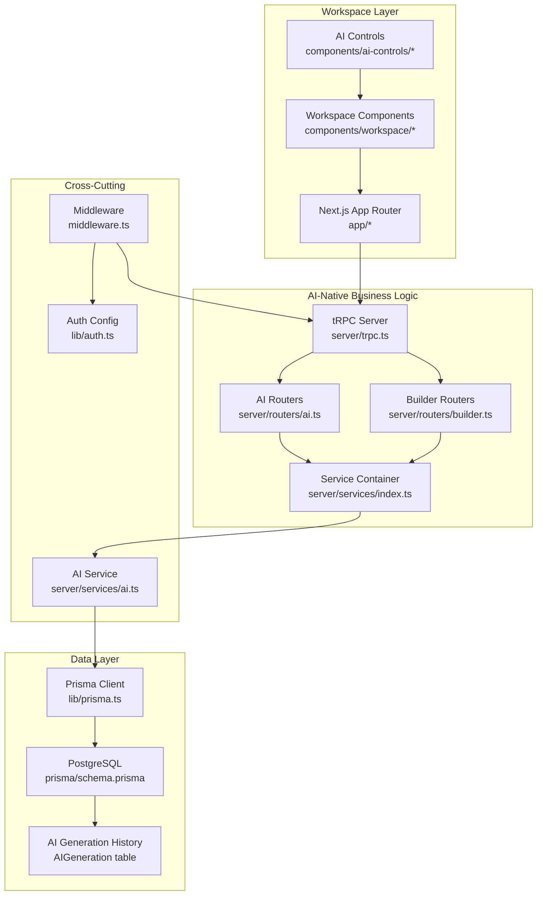
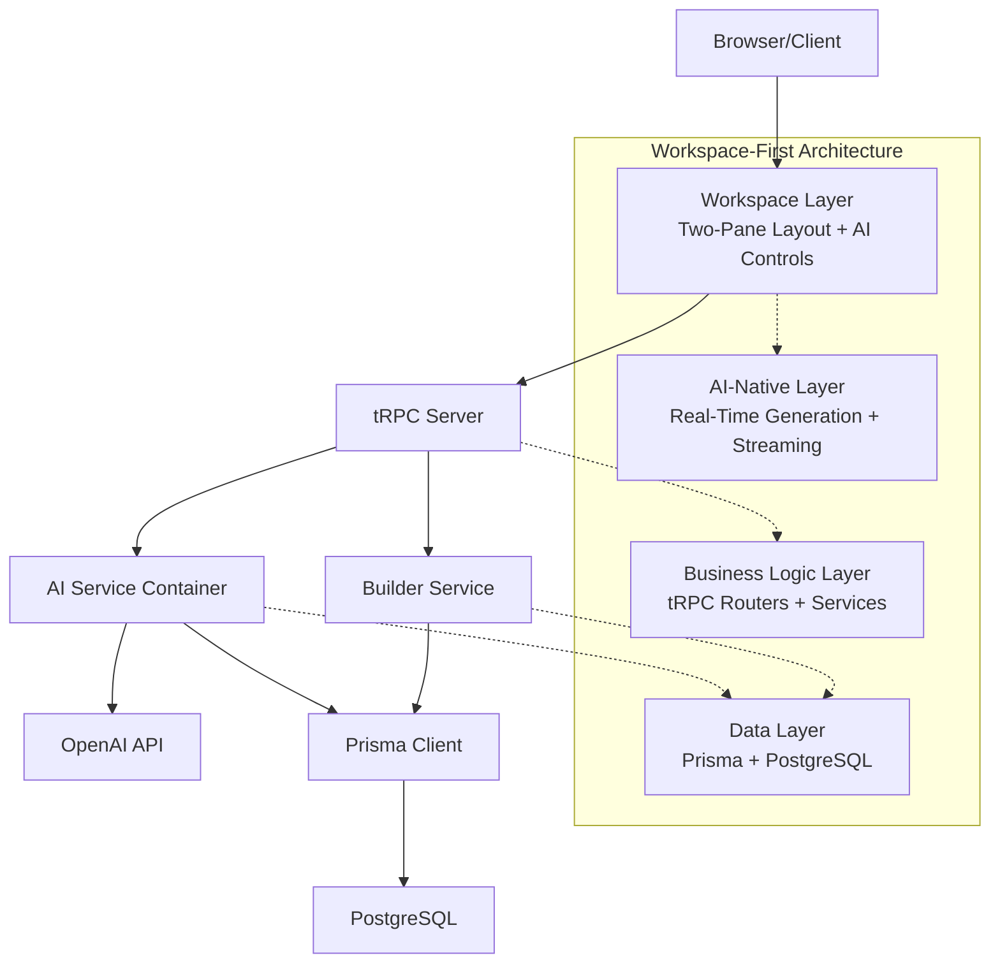
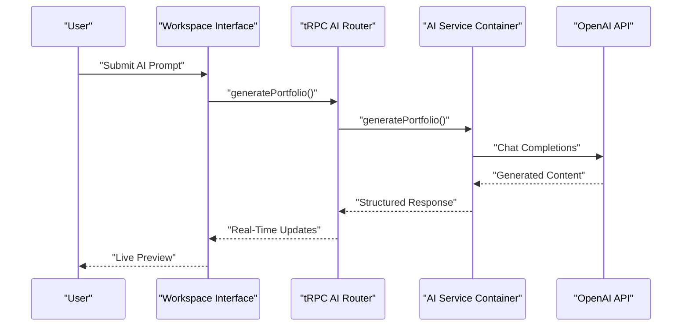
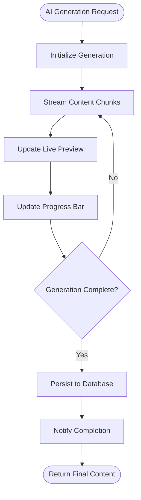
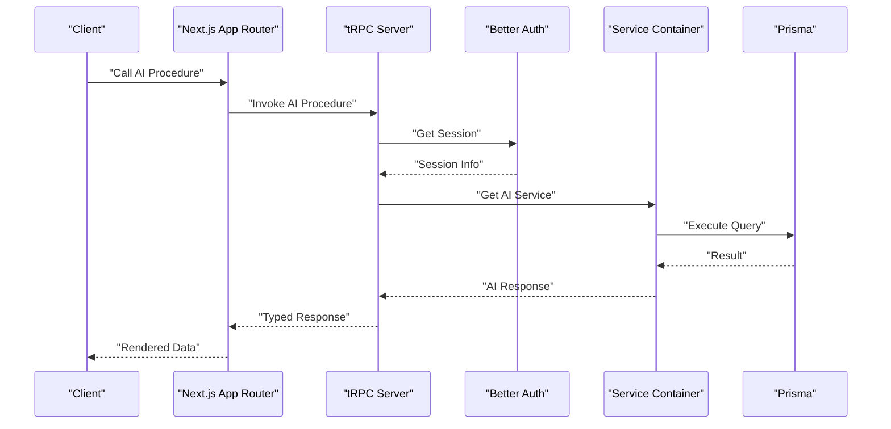
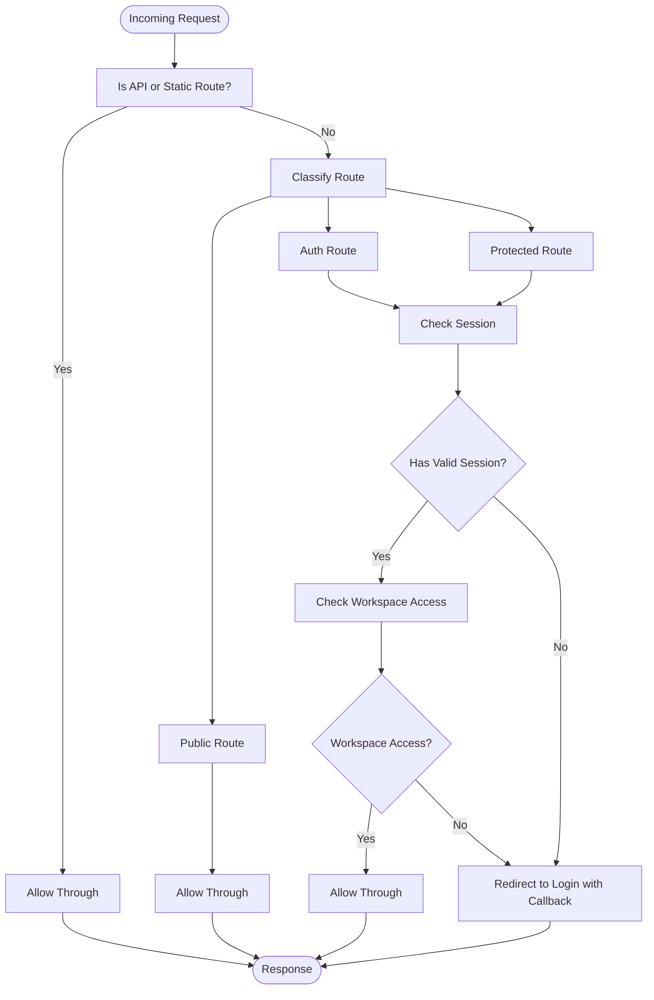
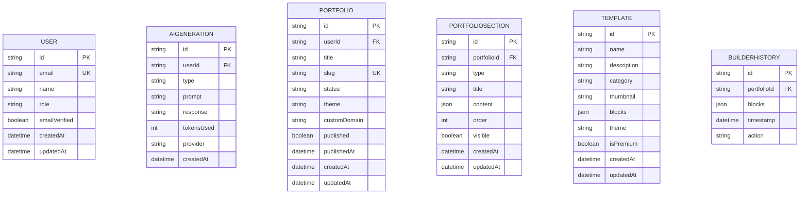
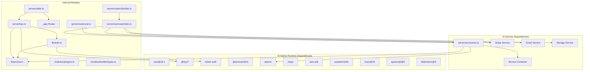
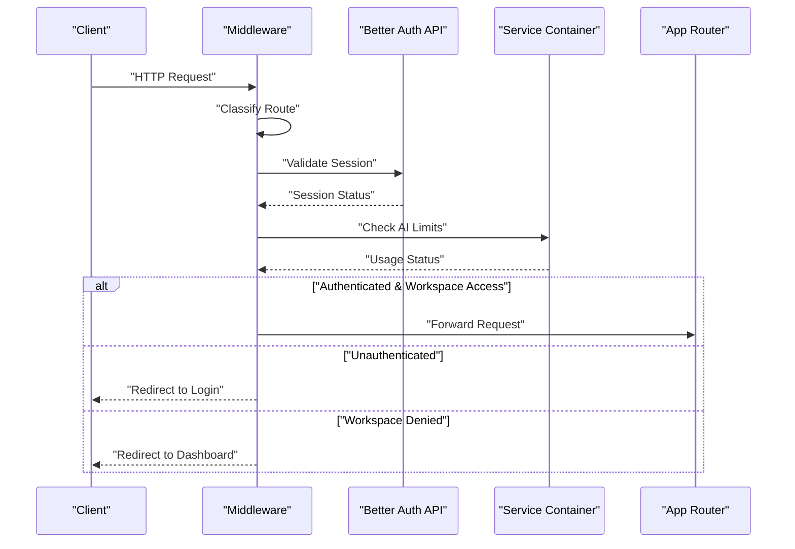

# Architecture Overview

<cite>
**Referenced Files in This Document**
- [README.md](file://README.md)
- [package.json](file://package.json)
- [next.config.ts](file://next.config.ts)
- [middleware.ts](file://middleware.ts)
- [lib/auth.ts](file://lib/auth.ts)
- [lib/prisma.ts](file://lib/prisma.ts)
- [server/trpc.ts](file://server/trpc.ts)
- [server/caller.ts](file://server/caller.ts)
- [server/routers/_app.ts](file://server/routers/_app.ts)
- [server/routers/ai.ts](file://server/routers/ai.ts)
- [server/routers/builder.ts](file://server/routers/builder.ts)
- [server/services/ai.ts](file://server/services/ai.ts)
- [server/services/index.ts](file://server/services/index.ts)
- [modules/ai/types.ts](file://modules/ai/types.ts)
- [modules/builder/types.ts](file://modules/builder/types.ts)
- [prisma/schema.prisma](file://prisma/schema.prisma)
</cite>

## Update Summary
**Changes Made**
- Updated architecture overview to emphasize workspace-first design principles
- Added comprehensive coverage of AI-native design patterns and real-time streaming capabilities
- Enhanced documentation of two-pane workspace layout architecture
- Expanded real-time streaming architecture documentation
- Updated technology stack to reflect AI-native design choices

## Table of Contents
1. [Introduction](#introduction)
2. [Project Structure](#project-structure)
3. [Core Components](#core-components)
4. [Architecture Overview](#architecture-overview)
5. [Workspace-First Design Principles](#workspace-first-design-principles)
6. [AI-Native Architecture](#ai-native-architecture)
7. [Real-Time Streaming Architecture](#real-time-streaming-architecture)
8. [Detailed Component Analysis](#detailed-component-analysis)
9. [Module-Based Architecture](#module-based-architecture)
10. [Dependency Analysis](#dependency-analysis)
11. [Performance Considerations](#performance-considerations)
12. [Security Architecture](#security-architecture)
13. [Deployment Topology](#deployment-topology)
14. [Middleware Pipeline and Request Flow](#middleware-pipeline-and-request-flow)
15. [Cross-Cutting Concerns](#cross-cutting-concerns)
16. [Technology Choices Justification](#technology-choices-justification)
17. [Scalability Considerations](#scalability-considerations)
18. [Troubleshooting Guide](#troubleshooting-guide)
19. [Conclusion](#conclusion)

## Introduction
Smartfolio is a production-ready AI-native SaaS application for building portfolio websites. The system follows a workspace-first architecture that prioritizes the creative workspace as the primary product interface, integrating AI-powered generation with a sophisticated two-pane layout. Built with Next.js 16, tRPC, Prisma, and Better Auth, Smartfolio emphasizes real-time streaming, type-safe APIs, secure authentication, and scalable backend services while maintaining a cohesive frontend designed for AI-native workflows.

## Project Structure
The repository implements a workspace-first modular monolith pattern with specialized AI-native components:
- Presentation layer: Next.js App Router with workspace-centric UI
- Business logic layer: tRPC routers with AI-native procedures
- Data layer: Prisma ORM with PostgreSQL and AI generation tracking
- Cross-cutting concerns: Middleware, authentication, and AI service orchestration

**Diagram sources**
- [middleware.ts](file://middleware.ts#L1-L95)
- [lib/auth.ts](file://lib/auth.ts#L1-L25)
- [lib/prisma.ts](file://lib/prisma.ts#L1-L14)
- [server/trpc.ts](file://server/trpc.ts#L1-L61)
- [server/caller.ts](file://server/caller.ts#L1-L7)
- [server/routers/_app.ts](file://server/routers/_app.ts#L1-L21)
- [server/routers/ai.ts](file://server/routers/ai.ts#L1-L105)
- [server/routers/builder.ts](file://server/routers/builder.ts#L1-L156)
- [server/services/ai.ts](file://server/services/ai.ts#L1-L242)
- [server/services/index.ts](file://server/services/index.ts#L1-L118)
- [prisma/schema.prisma](file://prisma/schema.prisma#L1-L230)

**Section sources**
- [README.md](file://README.md#L1-L100)
- [package.json](file://package.json#L1-L52)
- [next.config.ts](file://next.config.ts#L1-L8)

## Core Components
- Next.js App Router: Workspace-centric routing with dedicated AI-native pages
- tRPC Server: Type-safe API layer with AI-native procedure patterns
- AI Service Container: Orchestration of multiple AI providers and generation workflows
- Prisma ORM: Database client with AI generation tracking and workspace state
- Better Auth: Authentication with workspace access controls
- Middleware: Route protection with workspace-first navigation logic

Key implementation references:
- AI-native context creation and protected procedures
- Service container pattern for AI orchestration
- Workspace state management and real-time updates
- Two-pane layout architecture for AI interaction

**Section sources**
- [server/trpc.ts](file://server/trpc.ts#L1-L61)
- [lib/prisma.ts](file://lib/prisma.ts#L1-L14)
- [lib/auth.ts](file://lib/auth.ts#L1-L25)
- [middleware.ts](file://middleware.ts#L1-L95)
- [server/services/index.ts](file://server/services/index.ts#L1-L118)
- [server/services/ai.ts](file://server/services/ai.ts#L1-L242)

## Architecture Overview
Smartfolio employs a workspace-first modular monolith with AI-native design principles:
- Workspace Layer: Primary interface focused on creative workspaces and AI interaction
- AI-Native Business Logic: Specialized tRPC routers for AI generation and portfolio building
- Data Layer: Prisma managing AI generation history, workspace state, and user portfolios
- Real-Time Streaming: WebSocket-like patterns for live AI generation feedback

**Diagram sources**
- [middleware.ts](file://middleware.ts#L1-L95)
- [lib/auth.ts](file://lib/auth.ts#L1-L25)
- [lib/prisma.ts](file://lib/prisma.ts#L1-L14)
- [server/trpc.ts](file://server/trpc.ts#L1-L61)
- [server/routers/ai.ts](file://server/routers/ai.ts#L1-L105)
- [server/routers/builder.ts](file://server/routers/builder.ts#L1-L156)
- [server/services/ai.ts](file://server/services/ai.ts#L1-L242)
- [prisma/schema.prisma](file://prisma/schema.prisma#L1-L230)

## Workspace-First Design Principles
The workspace-first architecture prioritizes the creative workspace as the primary product interface:

### Two-Pane Workspace Layout
- Left Pane: AI generation controls, prompt input, and generation history
- Right Pane: Live portfolio preview with real-time updates
- Split-screen design optimized for AI-assisted content creation

### AI-Native User Experience
- Natural language prompts replace traditional form inputs
- Iterative refinement through follow-up prompts
- Live preview renders AI-generated content in real-time
- Seamless transition from ideation to publication

### Real-Time Interaction Patterns
- Continuous feedback during AI generation
- Instant preview updates as content is generated
- Collaborative workspace features for team environments
- Persistent workspace state across sessions

**Section sources**
- [README.md](file://README.md#L63-L72)
- [modules/ai/types.ts](file://modules/ai/types.ts#L1-L69)
- [modules/builder/types.ts](file://modules/builder/types.ts#L1-L76)

## AI-Native Architecture
Smartfolio implements AI-native design patterns with sophisticated AI orchestration:

### Multi-Provider AI Support
- OpenAI integration with configurable models (GPT-3.5, GPT-4)
- Extensible architecture for Anthropic Claude and Google Gemini
- Unified interface for different AI providers
- Provider switching and fallback mechanisms

### AI Generation Workflows
- Portfolio content generation with headline and about section creation
- Project description generation with technical specifications
- SEO metadata generation for search optimization
- Image alt text generation for accessibility

### AI Service Orchestration
- Service container pattern for dependency injection
- Rate limiting and usage tracking integration
- Token usage monitoring and plan-based limits
- Historical generation tracking and analytics

**Diagram sources**
- [server/routers/ai.ts](file://server/routers/ai.ts#L34-L52)
- [server/services/ai.ts](file://server/services/ai.ts#L89-L123)
- [server/services/index.ts](file://server/services/index.ts#L25-L36)

**Section sources**
- [server/routers/ai.ts](file://server/routers/ai.ts#L1-L105)
- [server/services/ai.ts](file://server/services/ai.ts#L1-L242)
- [server/services/index.ts](file://server/services/index.ts#L1-L118)
- [modules/ai/types.ts](file://modules/ai/types.ts#L1-L69)

## Real-Time Streaming Architecture
Smartfolio implements sophisticated real-time streaming for AI generation feedback:

### Streaming Generation Patterns
- Progressive content delivery during AI generation
- Live preview updates as content is generated
- Real-time token usage tracking
- Instant feedback on generation quality

### State Management
- Workspace state persistence across sessions
- Generation history tracking with timestamps
- Usage statistics with monthly limits
- Theme and customization state synchronization

### Performance Optimization
- Efficient WebSocket-like patterns for real-time updates
- Optimistic UI updates with fallback mechanisms
- Debounced generation requests for user experience
- Caching strategies for frequently accessed content

**Diagram sources**
- [server/services/ai.ts](file://server/services/ai.ts#L41-L87)
- [server/routers/ai.ts](file://server/routers/ai.ts#L22-L31)

**Section sources**
- [server/services/ai.ts](file://server/services/ai.ts#L1-L242)
- [server/routers/ai.ts](file://server/routers/ai.ts#L1-L105)

## Detailed Component Analysis

### tRPC Integration Pattern
The tRPC layer provides type-safe AI-native procedures with workspace-specific context injection.

**Diagram sources**
- [server/trpc.ts](file://server/trpc.ts#L12-L20)
- [lib/auth.ts](file://lib/auth.ts#L1-L25)
- [lib/prisma.ts](file://lib/prisma.ts#L1-L14)
- [server/services/index.ts](file://server/services/index.ts#L113-L118)

Implementation highlights:
- Context creation with session and AI service access
- Protected procedure middleware for workspace access control
- SuperJSON transformer for AI response serialization
- Service container integration for AI orchestration

**Section sources**
- [server/trpc.ts](file://server/trpc.ts#L1-L61)
- [server/caller.ts](file://server/caller.ts#L1-L7)
- [server/routers/_app.ts](file://server/routers/_app.ts#L1-L21)
- [server/services/index.ts](file://server/services/index.ts#L1-L118)

### Authentication Middleware Flow
The middleware enforces workspace-first navigation with intelligent route protection.

**Diagram sources**
- [middleware.ts](file://middleware.ts#L44-L81)

Key behaviors:
- Workspace-first navigation logic for authenticated users
- Intelligent redirection based on user workspace state
- Protected route enforcement with session validation
- Auth route handling for login/logout flows

**Section sources**
- [middleware.ts](file://middleware.ts#L1-L95)
- [lib/auth.ts](file://lib/auth.ts#L1-L25)

### Data Model Architecture
The Prisma schema extends beyond traditional SaaS models to support AI-native workflows.

**Diagram sources**
- [prisma/schema.prisma](file://prisma/schema.prisma#L17-L229)

**Section sources**
- [prisma/schema.prisma](file://prisma/schema.prisma#L1-L230)

## Module-Based Architecture
Smartfolio organizes functionality into specialized modules following AI-native design principles:

### AI Module
Handles AI-powered content generation with type-safe interfaces and provider abstraction.

### Builder Module  
Provides drag-and-drop portfolio construction with block-based composition and template systems.

### Portfolio Module
Manages user portfolios including creation, editing, publishing, and analytics with workspace state persistence.

### Billing Module
Handles subscription management with usage-based limits and AI token tracking.

### Auth Module
Provides comprehensive authentication with workspace access controls and session management.

**Section sources**
- [modules/ai/index.ts](file://modules/ai/index.ts#L1-L14)
- [modules/builder/index.ts](file://modules/builder/index.ts#L1-L14)
- [modules/portfolio/index.ts](file://modules/portfolio/index.ts#L1-L14)

## Dependency Analysis
External dependencies and internal module relationships with AI-native enhancements:

**Diagram sources**
- [package.json](file://package.json#L16-L38)
- [lib/auth.ts](file://lib/auth.ts#L1-L25)
- [lib/prisma.ts](file://lib/prisma.ts#L1-L14)
- [server/trpc.ts](file://server/trpc.ts#L1-L61)
- [server/caller.ts](file://server/caller.ts#L1-L7)
- [server/routers/_app.ts](file://server/routers/_app.ts#L1-L21)
- [server/routers/ai.ts](file://server/routers/ai.ts#L1-L105)
- [server/routers/builder.ts](file://server/routers/builder.ts#L1-L156)
- [server/services/ai.ts](file://server/services/ai.ts#L1-L242)
- [server/services/index.ts](file://server/services/index.ts#L1-L118)
- [modules/ai/types.ts](file://modules/ai/types.ts#L1-L69)
- [modules/builder/types.ts](file://modules/builder/types.ts#L1-L76)

**Section sources**
- [package.json](file://package.json#L1-L52)

## Performance Considerations
- Database connection management: Prisma client initialized once with AI service integration
- AI generation optimization: Service container pattern reduces instantiation overhead
- Real-time streaming: Efficient WebSocket-like patterns for live updates
- Memory management: Service container lifecycle management for AI providers
- Caching strategies: Redis integration for rate limiting and workspace state
- AI provider optimization: Connection pooling and request batching

## Security Architecture
- Authentication: Better Auth with workspace access controls and session management
- Authorization: tRPC protected procedures with workspace ownership verification
- Route protection: Middleware with workspace-first navigation logic
- AI usage limits: Token tracking and plan-based restrictions
- Data privacy: Secure AI generation history and user data handling
- Environment security: AI provider credentials and sensitive data protection

**Section sources**
- [lib/auth.ts](file://lib/auth.ts#L1-L25)
- [server/trpc.ts](file://server/trpc.ts#L50-L60)
- [middleware.ts](file://middleware.ts#L28-L42)
- [server/services/ai.ts](file://server/services/ai.ts#L190-L228)

## Deployment Topology
Recommended deployment model for AI-native architecture:
- Frontend: Next.js App Router with workspace interface and real-time updates
- Backend: tRPC server with AI service orchestration and workspace management
- Database: Managed PostgreSQL with AI generation tracking and workspace state
- AI Providers: Direct API access to OpenAI with rate limiting and monitoring
- External Services: Stripe for payments, AWS S3 for asset storage, Upstash Redis for caching

## Middleware Pipeline and Request Flow
The middleware pipeline enforces workspace-first navigation with AI-native considerations:

1. Route classification: Public, auth, protected, or workspace routes
2. Session validation: For protected routes, validate Better Auth session
3. Workspace access: Verify user has access to requested workspace
4. AI provider validation: Check AI usage limits and plan restrictions
5. Redirection: Handle workspace-specific navigation and authentication flows
6. Forward: Allow authenticated workspace requests to proceed

**Diagram sources**
- [middleware.ts](file://middleware.ts#L44-L81)
- [server/services/ai.ts](file://server/services/ai.ts#L190-L228)

**Section sources**
- [middleware.ts](file://middleware.ts#L1-L95)

## Cross-Cutting Concerns
- Logging: Prisma client logs with AI generation tracking and workspace state
- Error handling: AI-specific error handling with provider fallback mechanisms
- Rate limiting: Upstash integration for API protection and AI usage limits
- Email notifications: Nodemailer integration for workspace collaboration
- AI monitoring: Usage tracking and performance metrics collection
- Workspace persistence: State synchronization across sessions and devices

**Section sources**
- [lib/prisma.ts](file://lib/prisma.ts#L9-L11)
- [server/trpc.ts](file://server/trpc.ts#L29-L38)
- [package.json](file://package.json#L25-L29)
- [server/services/ai.ts](file://server/services/ai.ts#L190-L228)

## Technology Choices Justification
- React 19: Latest React features with concurrent rendering for AI-native interactivity
- TypeScript 5: Enhanced type safety for AI-native workflows and complex data structures
- Next.js 16 App Router: Production-ready routing with server actions and real-time capabilities
- tRPC 11: End-to-end type safety for AI-native API patterns and workspace state management
- Better Auth: Comprehensive authentication with workspace access controls
- Prisma 6: Type-safe database access with AI generation tracking and workspace state
- PostgreSQL: Reliable relational database with JSON support for flexible AI content modeling
- OpenAI: Industry-leading AI provider with real-time streaming capabilities
- Stripe: Subscription billing with usage-based AI token tracking
- AWS S3: Asset storage for generated portfolio content and media
- Upstash Redis: Rate limiting and caching for AI-native performance optimization

**Section sources**
- [README.md](file://README.md#L81-L94)
- [package.json](file://package.json#L16-L38)

## Scalability Considerations
- Horizontal scaling: Next.js serverless runtime with AI service container optimization
- Database scaling: PostgreSQL with AI generation history and workspace state optimization
- AI provider scaling: Connection pooling and request batching for multiple AI providers
- Real-time scaling: WebSocket-like patterns with Redis pub/sub for live updates
- Caching strategies: Multi-level caching for AI responses and workspace state
- Background processing: Queue workers for heavy AI generation and portfolio optimization
- CDN integration: Global delivery of static assets and generated content

## Troubleshooting Guide
Common issues and resolutions for AI-native architecture:
- Authentication failures: Verify Better Auth configuration and workspace access permissions
- AI provider errors: Check API keys, rate limits, and provider availability
- Database connection issues: Monitor Prisma client initialization and connection pools
- tRPC errors: Review AI-native error handling and workspace state synchronization
- Middleware redirect loops: Confirm workspace-first navigation logic and session validation
- Stripe/webhook issues: Validate subscription plans and AI usage limit tracking
- Real-time streaming failures: Check Redis connectivity and WebSocket-like patterns
- Workspace state corruption: Implement proper state persistence and recovery mechanisms

**Section sources**
- [lib/auth.ts](file://lib/auth.ts#L1-L25)
- [lib/prisma.ts](file://lib/prisma.ts#L1-L14)
- [server/trpc.ts](file://server/trpc.ts#L29-L38)
- [middleware.ts](file://middleware.ts#L28-L42)
- [server/services/ai.ts](file://server/services/ai.ts#L83-L86)

## Conclusion
Smartfolio demonstrates a pioneering AI-native architecture that transforms traditional SaaS design into a workspace-first paradigm. The combination of Next.js App Router, tRPC, Prisma, Better Auth, and sophisticated AI service orchestration creates a revolutionary foundation for AI-powered content creation. The two-pane workspace layout, real-time streaming architecture, and comprehensive AI-native design principles establish Smartfolio as a leader in AI-assisted creative workflows. The clear layer separation, strong typing, comprehensive authentication, and robust AI service management provide an excellent foundation for future innovation while maintaining performance, security, and scalability standards.