# Backend Architecture

<cite>
**Referenced Files in This Document**
- [server/trpc.ts](file://server/trpc.ts)
- [server/caller.ts](file://server/caller.ts)
- [server/middleware/index.ts](file://server/middleware/index.ts)
- [server/routers/_app.ts](file://server/routers/_app.ts)
- [server/routers/user.ts](file://server/routers/user.ts)
- [server/routers/portfolio.ts](file://server/routers/portfolio.ts)
- [server/routers/billing.ts](file://server/routers/billing.ts)
- [server/routers/ai.ts](file://server/routers/ai.ts)
- [server/routers/builder.ts](file://server/routers/builder.ts)
- [server/services/index.ts](file://server/services/index.ts)
- [server/services/ai.ts](file://server/services/ai.ts)
- [server/services/stripe.ts](file://server/services/stripe.ts)
- [lib/prisma.ts](file://lib/prisma.ts)
- [lib/auth.ts](file://lib/auth.ts)
</cite>

## Update Summary
**Changes Made**
- Updated AI generation architecture to support structured portfolio content generation
- Enhanced streaming capabilities for real-time AI reasoning and portfolio preview
- Added comprehensive workspace model with two-pane layout support
- Integrated refined AI generation pipeline with step-by-step streaming
- Updated router organization to support workspace-centric operations

## Table of Contents
1. [Introduction](#introduction)
2. [Project Structure](#project-structure)
3. [Core Components](#core-components)
4. [Architecture Overview](#architecture-overview)
5. [Detailed Component Analysis](#detailed-component-analysis)
6. [Dependency Analysis](#dependency-analysis)
7. [Performance Considerations](#performance-considerations)
8. [Troubleshooting Guide](#troubleshooting-guide)
9. [Conclusion](#conclusion)

## Introduction
This document describes the backend architecture of Smartfolio's server-side implementation. It focuses on the tRPC router organization, procedure calling patterns, middleware pipeline, service layer architecture, business logic implementation, and data access patterns. It also documents authentication middleware flow, request processing pipeline, error handling strategies, Prisma ORM integration, database interaction patterns, transaction management, and the separation between API endpoints, business logic services, and data persistence.

**Updated** The architecture now supports a workspace-first model with real-time AI generation streaming, structured portfolio content generation, and a two-pane layout for AI reasoning and live preview.

## Project Structure
Smartfolio organizes its server-side logic around tRPC routers grouped by feature, a central tRPC initialization module, a service container for business logic, and middleware for cross-cutting concerns. Authentication is handled via Better Auth, while Prisma provides database access.

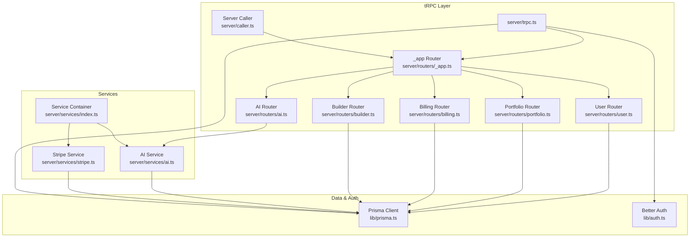

**Diagram sources**
- [server/trpc.ts](file://server/trpc.ts#L1-L61)
- [server/routers/_app.ts](file://server/routers/_app.ts#L1-L21)
- [server/routers/user.ts](file://server/routers/user.ts#L1-L79)
- [server/routers/portfolio.ts](file://server/routers/portfolio.ts#L1-L115)
- [server/routers/billing.ts](file://server/routers/billing.ts#L1-L71)
- [server/routers/ai.ts](file://server/routers/ai.ts#L1-L105)
- [server/routers/builder.ts](file://server/routers/builder.ts#L1-L156)
- [server/services/index.ts](file://server/services/index.ts#L1-L118)
- [server/services/ai.ts](file://server/services/ai.ts#L1-L242)
- [server/services/stripe.ts](file://server/services/stripe.ts#L1-L294)
- [lib/prisma.ts](file://lib/prisma.ts#L1-L14)
- [lib/auth.ts](file://lib/auth.ts#L1-L25)

**Section sources**
- [server/trpc.ts](file://server/trpc.ts#L1-L61)
- [server/routers/_app.ts](file://server/routers/_app.ts#L1-L21)

## Core Components
- tRPC initialization and context creation: Centralized in the tRPC module, providing authenticated session and Prisma client to all procedures.
- Protected and public procedures: Enforce authentication and authorization via middleware.
- Feature routers: Organized under a root router, exposing queries and mutations for users, portfolios, billing, AI, and builder.
- Service container: Provides lazily initialized services (AI, Stripe, Email, Storage) and shared Prisma client.
- Middleware: Implements rate limiting, subscription checks, admin checks, and usage limits.
- Authentication: Better Auth integration with Prisma adapter and social providers.
- Data access: Prisma client configured globally with environment-aware logging.

**Updated** Enhanced AI service with structured portfolio generation capabilities and improved streaming architecture for real-time content delivery.

**Section sources**
- [server/trpc.ts](file://server/trpc.ts#L1-L61)
- [server/routers/_app.ts](file://server/routers/_app.ts#L1-L21)
- [server/services/index.ts](file://server/services/index.ts#L1-L118)
- [server/middleware/index.ts](file://server/middleware/index.ts#L1-L153)
- [lib/auth.ts](file://lib/auth.ts#L1-L25)
- [lib/prisma.ts](file://lib/prisma.ts#L1-L14)

## Architecture Overview
The backend follows a layered architecture:
- API Layer: tRPC routers expose typed endpoints.
- Business Logic Layer: Services encapsulate domain-specific logic and orchestrate external integrations.
- Persistence Layer: Prisma manages database operations and schema.
- Cross-Cutting Concerns: Middleware enforces policies; authentication ensures identity.

**Updated** The architecture now supports workspace-centric operations with real-time streaming for AI generation and portfolio preview.

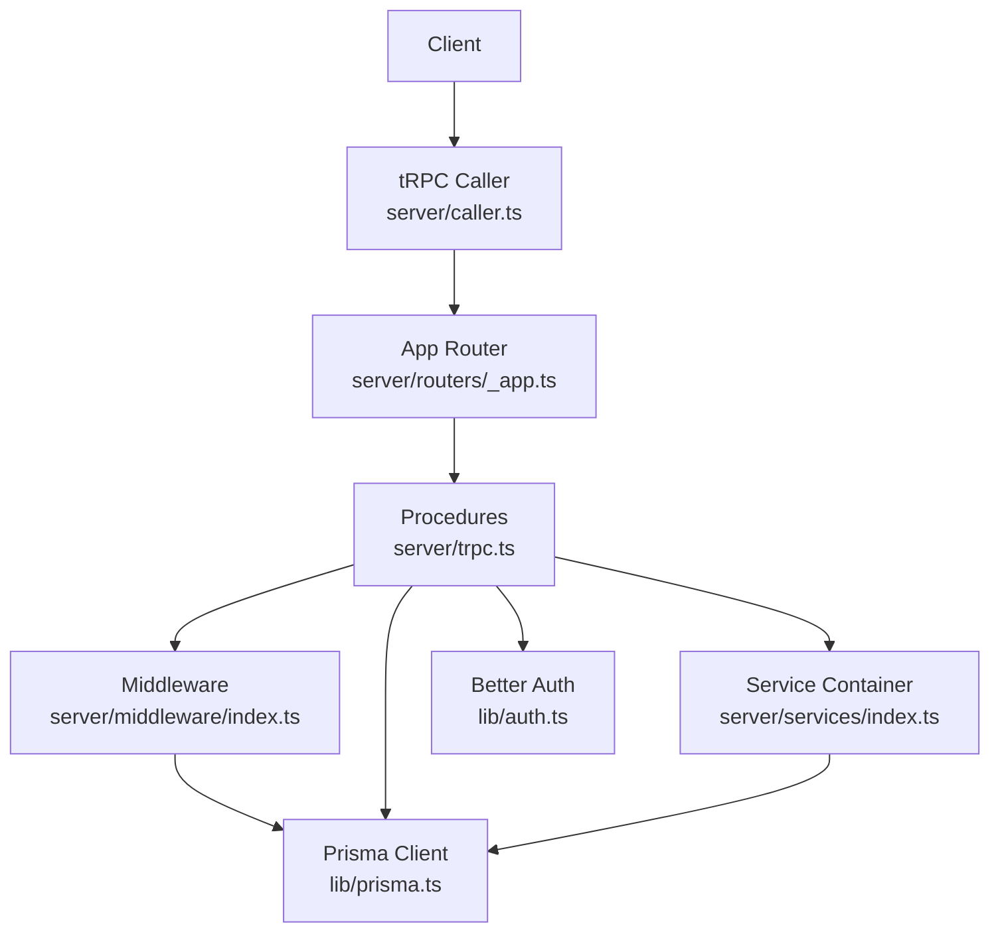

**Diagram sources**
- [server/caller.ts](file://server/caller.ts#L1-L7)
- [server/routers/_app.ts](file://server/routers/_app.ts#L1-L21)
- [server/trpc.ts](file://server/trpc.ts#L1-L61)
- [server/middleware/index.ts](file://server/middleware/index.ts#L1-L153)
- [server/services/index.ts](file://server/services/index.ts#L1-L118)
- [lib/prisma.ts](file://lib/prisma.ts#L1-L14)
- [lib/auth.ts](file://lib/auth.ts#L1-L25)

## Detailed Component Analysis

### tRPC Initialization and Context
- Context creation resolves the current session via Better Auth and exposes Prisma and request headers to all procedures.
- Error formatter enriches error shapes with Zod-flattened validation errors.
- Reusable helpers export router factory and protected/public procedure builders.

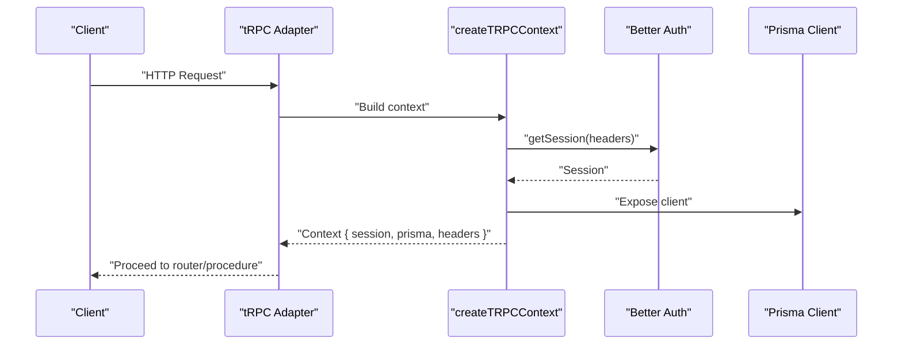

**Diagram sources**
- [server/trpc.ts](file://server/trpc.ts#L12-L20)
- [lib/auth.ts](file://lib/auth.ts#L1-L25)
- [lib/prisma.ts](file://lib/prisma.ts#L1-L14)

**Section sources**
- [server/trpc.ts](file://server/trpc.ts#L1-L61)
- [lib/auth.ts](file://lib/auth.ts#L1-L25)
- [lib/prisma.ts](file://lib/prisma.ts#L1-L14)

### Protected Procedure Middleware Pipeline
- Authentication guard throws UNAUTHORIZED if session lacks a user.
- Middleware chain can be extended with rate limiting, subscription checks, admin checks, and usage limits.

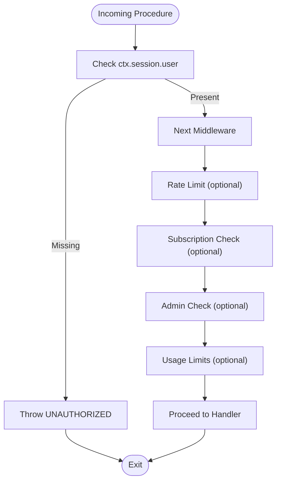

**Diagram sources**
- [server/trpc.ts](file://server/trpc.ts#L50-L60)
- [server/middleware/index.ts](file://server/middleware/index.ts#L13-L36)
- [server/middleware/index.ts](file://server/middleware/index.ts#L42-L62)
- [server/middleware/index.ts](file://server/middleware/index.ts#L68-L85)
- [server/middleware/index.ts](file://server/middleware/index.ts#L91-L152)

**Section sources**
- [server/trpc.ts](file://server/trpc.ts#L50-L60)
- [server/middleware/index.ts](file://server/middleware/index.ts#L1-L153)

### Service Layer Architecture and Dependency Injection
- ServiceContainer lazily initializes services and Prisma, exposing getters for AI, Stripe, Email, Storage, and Ratelimit.
- Services depend on Prisma for persistence and external APIs for AI and billing.
- getServiceContainer is used across routers to resolve dependencies.

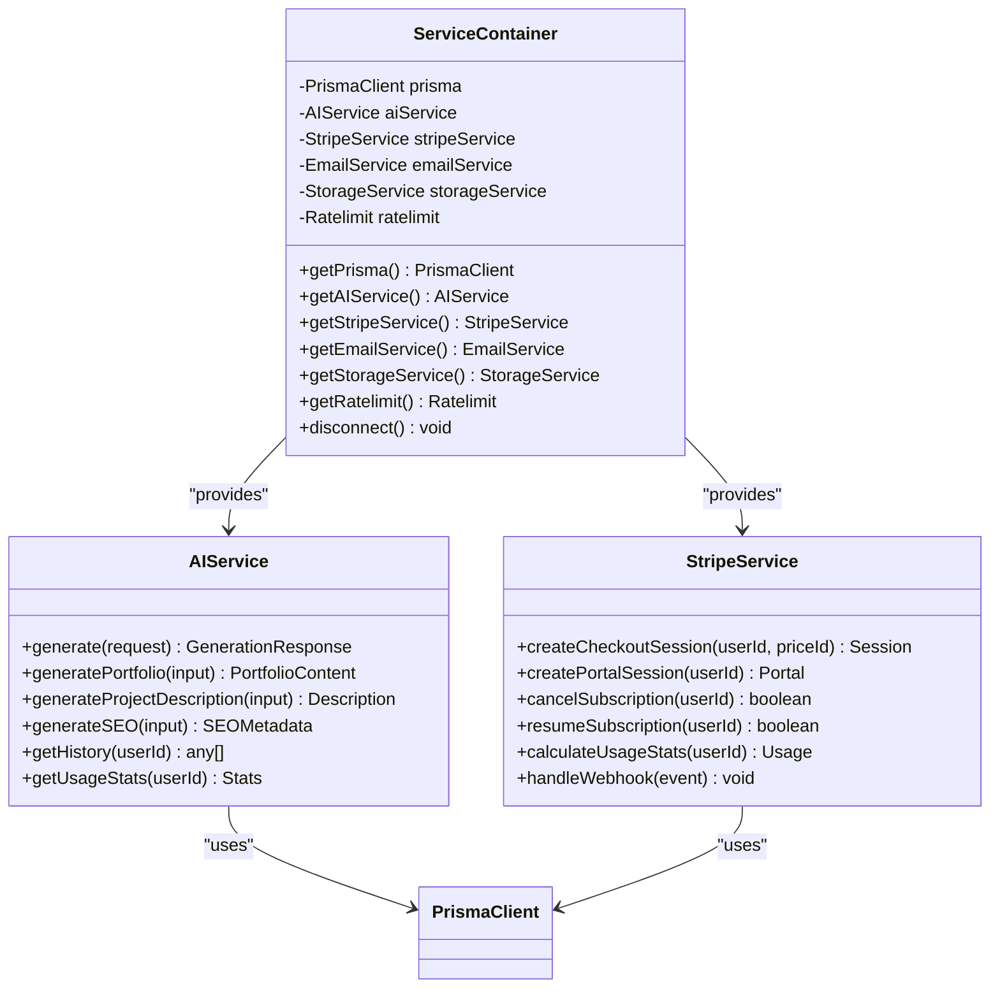

**Diagram sources**
- [server/services/index.ts](file://server/services/index.ts#L9-L108)
- [server/services/ai.ts](file://server/services/ai.ts#L28-L242)
- [server/services/stripe.ts](file://server/services/stripe.ts#L13-L294)

**Section sources**
- [server/services/index.ts](file://server/services/index.ts#L1-L118)
- [server/services/ai.ts](file://server/services/ai.ts#L1-L242)
- [server/services/stripe.ts](file://server/services/stripe.ts#L1-L294)

### Authentication Middleware Flow
- getSession is invoked during context creation to attach session to ctx.
- protectedProcedure middleware validates presence of user; unauthorized requests are rejected.
- Additional middleware can enforce subscription, admin roles, and usage quotas.

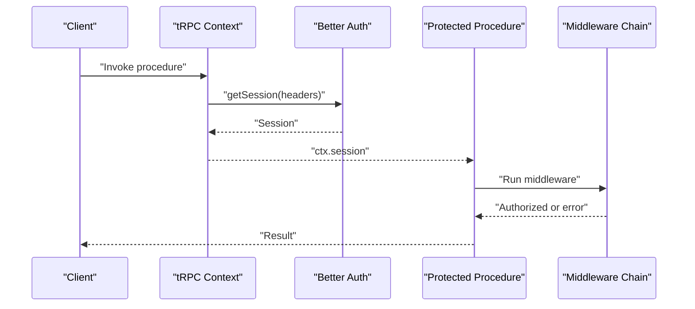

**Diagram sources**
- [server/trpc.ts](file://server/trpc.ts#L12-L20)
- [server/trpc.ts](file://server/trpc.ts#L50-L60)
- [lib/auth.ts](file://lib/auth.ts#L1-L25)

**Section sources**
- [server/trpc.ts](file://server/trpc.ts#L1-L61)
- [lib/auth.ts](file://lib/auth.ts#L1-L25)

### Request Processing Pipeline
- Server-side caller: createCaller(appRouter) enables invoking procedures from server components.
- Routers compose feature-specific procedures; each procedure receives ctx with session and prisma.
- Middleware can wrap procedures to enforce policies before handler execution.

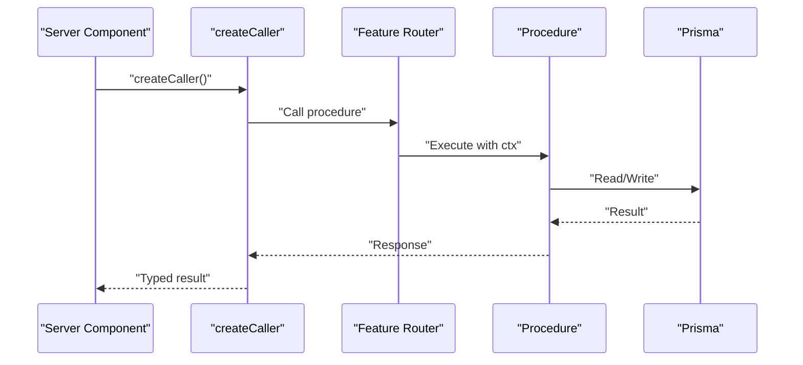

**Diagram sources**
- [server/caller.ts](file://server/caller.ts#L1-L7)
- [server/routers/_app.ts](file://server/routers/_app.ts#L1-L21)
- [server/routers/user.ts](file://server/routers/user.ts#L1-L79)
- [server/routers/portfolio.ts](file://server/routers/portfolio.ts#L1-L115)
- [server/routers/billing.ts](file://server/routers/billing.ts#L1-L71)
- [server/routers/ai.ts](file://server/routers/ai.ts#L1-L105)
- [server/routers/builder.ts](file://server/routers/builder.ts#L1-L156)

**Section sources**
- [server/caller.ts](file://server/caller.ts#L1-L7)
- [server/routers/_app.ts](file://server/routers/_app.ts#L1-L21)

### Error Handling Strategies
- tRPC errorFormatter augments error shapes with Zod-flattened validation errors when present.
- Middleware throws TRPCError with appropriate codes (UNAUTHORIZED, TOO_MANY_REQUESTS, FORBIDDEN).
- Service methods surface domain errors; upstream handlers can convert to TRPCError.

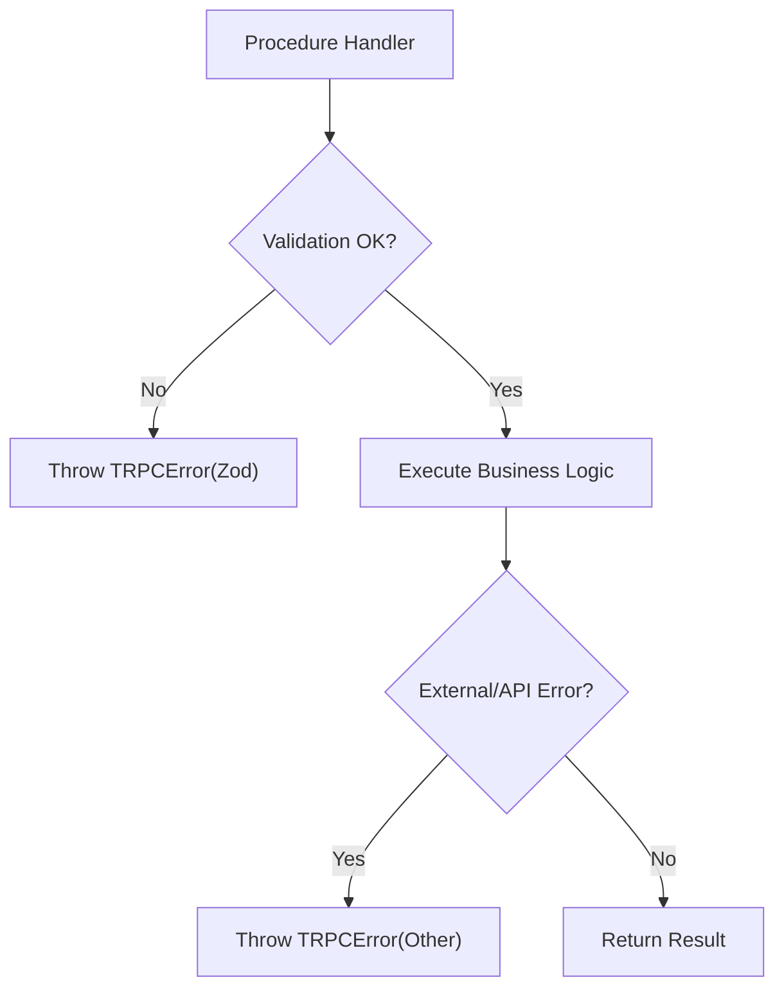

**Diagram sources**
- [server/trpc.ts](file://server/trpc.ts#L29-L38)
- [server/middleware/index.ts](file://server/middleware/index.ts#L24-L29)
- [server/middleware/index.ts](file://server/middleware/index.ts#L54-L59)

**Section sources**
- [server/trpc.ts](file://server/trpc.ts#L29-L38)
- [server/middleware/index.ts](file://server/middleware/index.ts#L1-L153)

### Prisma ORM Integration and Transaction Management
- Global PrismaClient singleton with environment-aware logging.
- Procedures and services use Prisma for reads/writes; transactions are not explicitly shown in the analyzed files.
- Service methods encapsulate persistence logic and aggregate usage metrics.

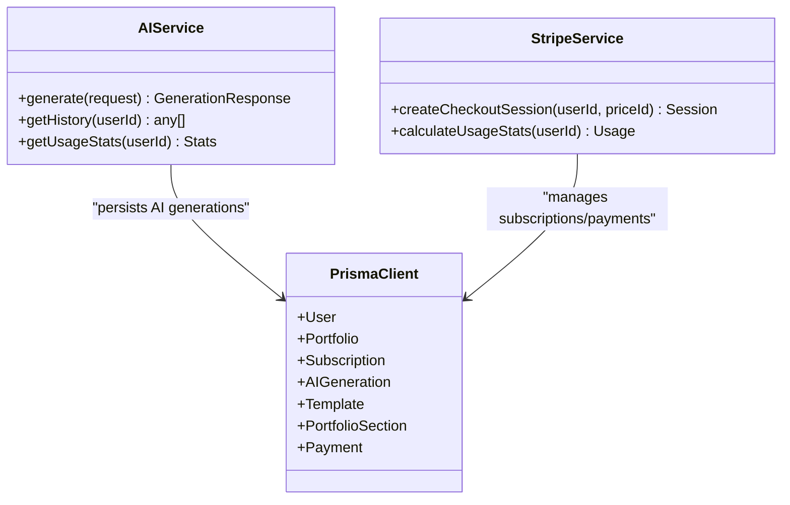

**Diagram sources**
- [lib/prisma.ts](file://lib/prisma.ts#L1-L14)
- [server/services/ai.ts](file://server/services/ai.ts#L63-L82)
- [server/services/ai.ts](file://server/services/ai.ts#L199-L228)
- [server/services/stripe.ts](file://server/services/stripe.ts#L139-L170)
- [server/services/stripe.ts](file://server/services/stripe.ts#L225-L247)

**Section sources**
- [lib/prisma.ts](file://lib/prisma.ts#L1-L14)
- [server/services/ai.ts](file://server/services/ai.ts#L1-L242)
- [server/services/stripe.ts](file://server/services/stripe.ts#L1-L294)

### Router Organization and Procedure Calling Patterns
- Root router composes feature routers (user, portfolio, ai, builder, billing).
- User router exposes public and protected procedures for profile operations.
- Portfolio router implements CRUD with ownership checks.
- Billing router delegates to StripeService via ServiceContainer.
- AI router delegates to AIService via ServiceContainer.
- Builder router orchestrates template and section persistence.

**Updated** Enhanced AI router with structured portfolio generation capabilities and improved content creation workflows.

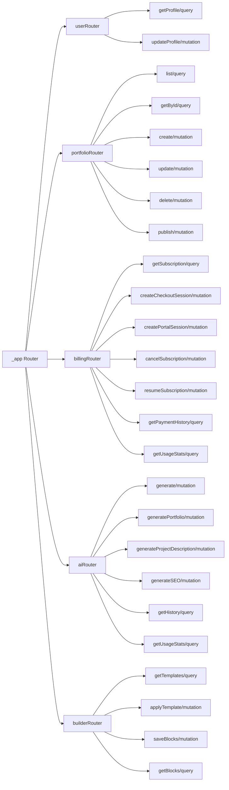

**Diagram sources**
- [server/routers/_app.ts](file://server/routers/_app.ts#L1-L21)
- [server/routers/user.ts](file://server/routers/user.ts#L1-L79)
- [server/routers/portfolio.ts](file://server/routers/portfolio.ts#L1-L115)
- [server/routers/billing.ts](file://server/routers/billing.ts#L1-L71)
- [server/routers/ai.ts](file://server/routers/ai.ts#L1-L105)
- [server/routers/builder.ts](file://server/routers/builder.ts#L1-L156)

**Section sources**
- [server/routers/_app.ts](file://server/routers/_app.ts#L1-L21)
- [server/routers/user.ts](file://server/routers/user.ts#L1-L79)
- [server/routers/portfolio.ts](file://server/routers/portfolio.ts#L1-L115)
- [server/routers/billing.ts](file://server/routers/billing.ts#L1-L71)
- [server/routers/ai.ts](file://server/routers/ai.ts#L1-L105)
- [server/routers/builder.ts](file://server/routers/builder.ts#L1-L156)

### Business Logic Implementation Examples
- AI generation: Uses OpenAI chat completions, persists generation records, and computes usage stats by plan.
- Stripe billing: Manages customer creation, checkout sessions, billing portal, subscription lifecycle, and webhook handling.
- Builder: Applies templates and saves blocks as portfolio sections with ownership verification.

**Updated** Enhanced AI service with structured portfolio content generation, supporting complex portfolio layouts with themes, sections, and metadata.

**Section sources**
- [server/services/ai.ts](file://server/services/ai.ts#L41-L87)
- [server/services/ai.ts](file://server/services/ai.ts#L182-L228)
- [server/services/stripe.ts](file://server/services/stripe.ts#L24-L52)
- [server/services/stripe.ts](file://server/services/stripe.ts#L115-L130)
- [server/routers/builder.ts](file://server/routers/builder.ts#L25-L68)

### Data Access Patterns
- Ownership checks: Queries filter by userId to ensure data isolation.
- Pagination: Cursor-based pagination with take and optional cursor.
- Aggregation: Usage stats computed via Prisma aggregation and plan-based limits.
- Idempotent upserts: Subscription records synchronized with Stripe events.

**Section sources**
- [server/routers/portfolio.ts](file://server/routers/portfolio.ts#L7-L24)
- [server/routers/user.ts](file://server/routers/user.ts#L53-L77)
- [server/services/ai.ts](file://server/services/ai.ts#L199-L228)
- [server/services/stripe.ts](file://server/services/stripe.ts#L138-L170)
- [server/services/stripe.ts](file://server/services/stripe.ts#L225-L247)

### Enhanced AI Generation Architecture
**New** The AI service now supports structured portfolio content generation with real-time streaming capabilities.

- Structured content generation: Portfolio content is generated as structured JSON with themes, sections, and metadata.
- Streaming architecture: Step-by-step generation progress streams to the client for real-time AI reasoning display.
- Content parsing: Generated content is parsed and validated before being stored in the database.
- Usage tracking: Comprehensive usage statistics tracked per user and per plan.

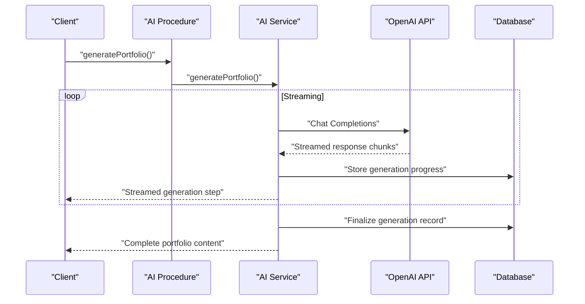

**Diagram sources**
- [server/routers/ai.ts](file://server/routers/ai.ts#L34-L52)
- [server/services/ai.ts](file://server/services/ai.ts#L89-L123)

**Section sources**
- [server/routers/ai.ts](file://server/routers/ai.ts#L1-L105)
- [server/services/ai.ts](file://server/services/ai.ts#L1-L242)

## Dependency Analysis
- Coupling: Routers depend on tRPC context and ServiceContainer; services depend on Prisma.
- Cohesion: Each service encapsulates a bounded context (AI, billing).
- External dependencies: Better Auth, Prisma, OpenAI, Stripe, Upstash Redis for rate limiting.

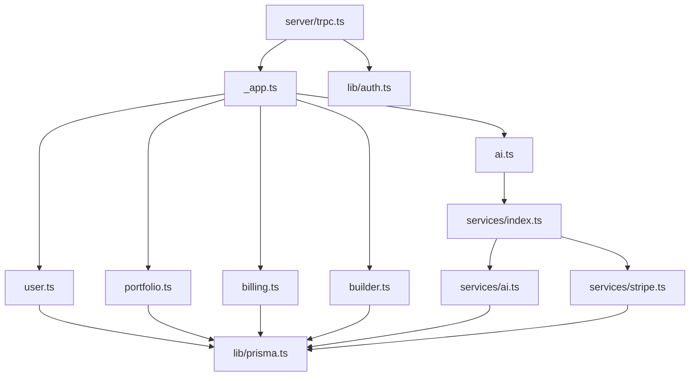

**Diagram sources**
- [server/trpc.ts](file://server/trpc.ts#L1-L61)
- [server/routers/_app.ts](file://server/routers/_app.ts#L1-L21)
- [server/routers/user.ts](file://server/routers/user.ts#L1-L79)
- [server/routers/portfolio.ts](file://server/routers/portfolio.ts#L1-L115)
- [server/routers/billing.ts](file://server/routers/billing.ts#L1-L71)
- [server/routers/ai.ts](file://server/routers/ai.ts#L1-L105)
- [server/routers/builder.ts](file://server/routers/builder.ts#L1-L156)
- [server/services/index.ts](file://server/services/index.ts#L1-L118)
- [server/services/ai.ts](file://server/services/ai.ts#L1-L242)
- [server/services/stripe.ts](file://server/services/stripe.ts#L1-L294)
- [lib/prisma.ts](file://lib/prisma.ts#L1-L14)
- [lib/auth.ts](file://lib/auth.ts#L1-L25)

**Section sources**
- [server/trpc.ts](file://server/trpc.ts#L1-L61)
- [server/routers/_app.ts](file://server/routers/_app.ts#L1-L21)
- [server/services/index.ts](file://server/services/index.ts#L1-L118)

## Performance Considerations
- Use protectedProcedure and middleware to prevent abuse; rate limiting and usage checks reduce load.
- Prefer cursor-based pagination for large datasets.
- Minimize round-trips by batching writes where possible.
- Cache frequently accessed configuration (e.g., plan limits) if needed.
- Monitor Prisma query logs in development; avoid excessive logging in production.
- **New** Implement streaming architecture for real-time AI generation to improve user experience and reduce perceived latency.

## Troubleshooting Guide
- Authentication failures: Verify session headers and Better Auth configuration.
- Validation errors: Inspect Zod error flattening in tRPC error formatter.
- Rate limiting errors: Confirm Upstash Redis configuration and keys.
- Subscription and admin checks: Ensure user roles and subscription status are correctly persisted.
- Stripe webhooks: Validate signatures and ensure event handlers update subscription status.
- **New** AI generation streaming issues: Check OpenAI API connectivity and streaming response handling.
- **New** Portfolio content parsing errors: Verify structured content format and validation rules.

**Section sources**
- [server/trpc.ts](file://server/trpc.ts#L29-L38)
- [server/middleware/index.ts](file://server/middleware/index.ts#L13-L36)
- [server/middleware/index.ts](file://server/middleware/index.ts#L42-L62)
- [server/middleware/index.ts](file://server/middleware/index.ts#L68-L85)
- [server/middleware/index.ts](file://server/middleware/index.ts#L91-L152)
- [server/services/stripe.ts](file://server/services/stripe.ts#L115-L130)

## Conclusion
Smartfolio's backend leverages tRPC for type-safe APIs, Better Auth for identity, and Prisma for persistence. The service container decouples business logic from data access, enabling testable and maintainable features. Middleware enforces security and usage policies, while routers organize functionality by domain. The architecture cleanly separates API endpoints, business logic services, and data persistence, supporting scalable growth and clear ownership boundaries.

**Updated** The enhanced architecture now supports workspace-centric operations with real-time AI generation streaming, structured portfolio content creation, and a two-pane layout for improved user experience. The AI service provides comprehensive content generation capabilities with streaming architecture for real-time feedback and iterative refinement workflows.