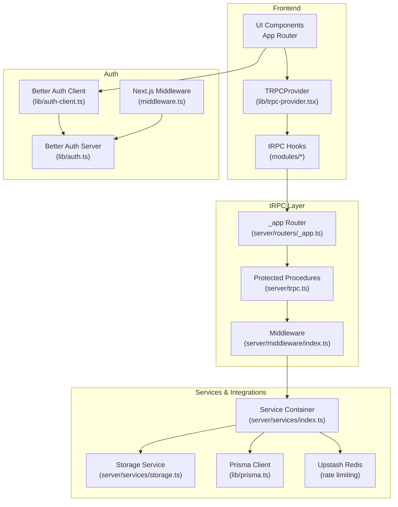
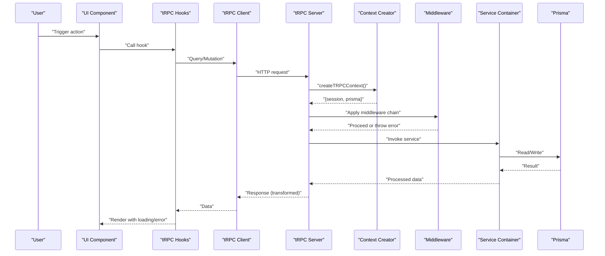
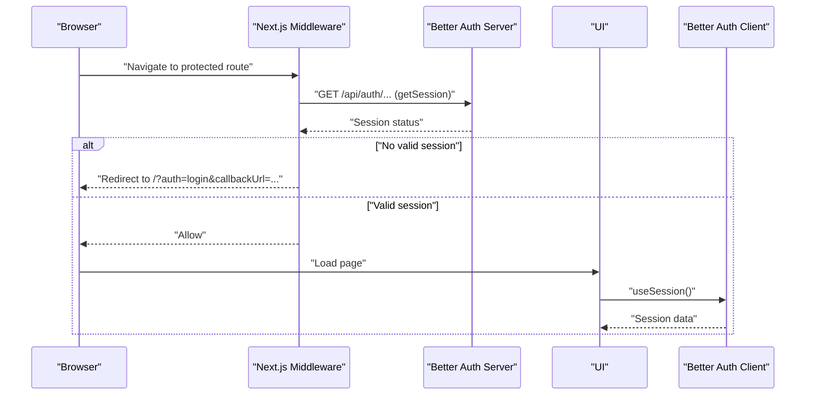
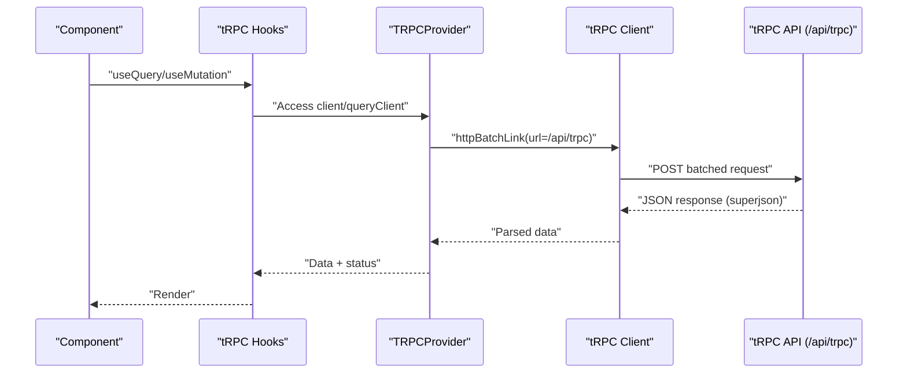
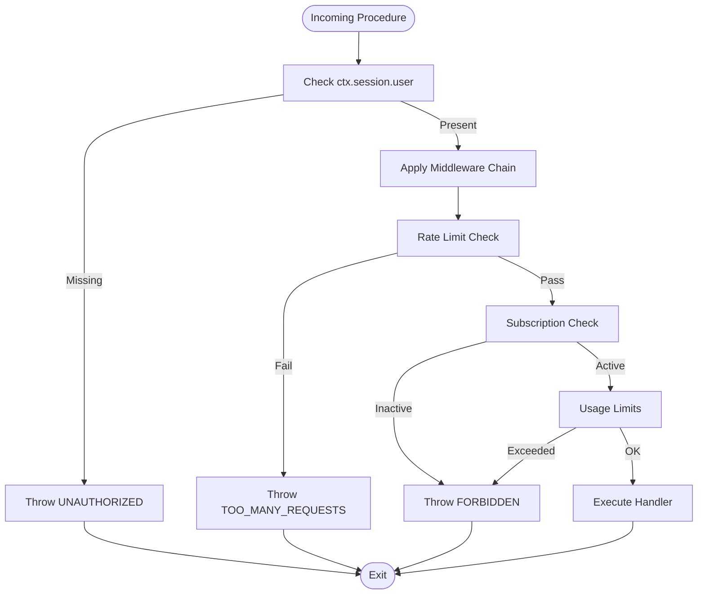
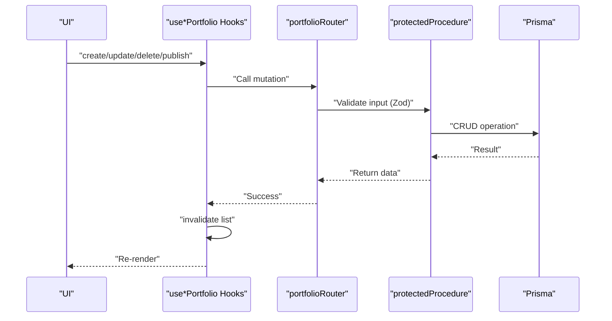
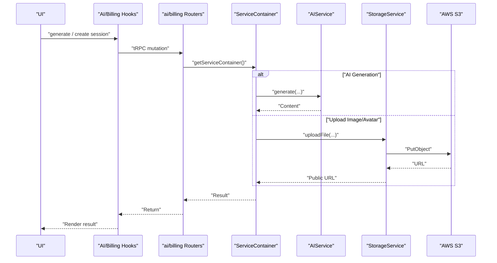
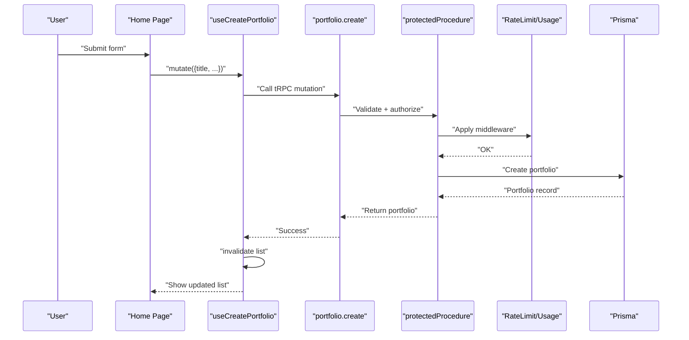
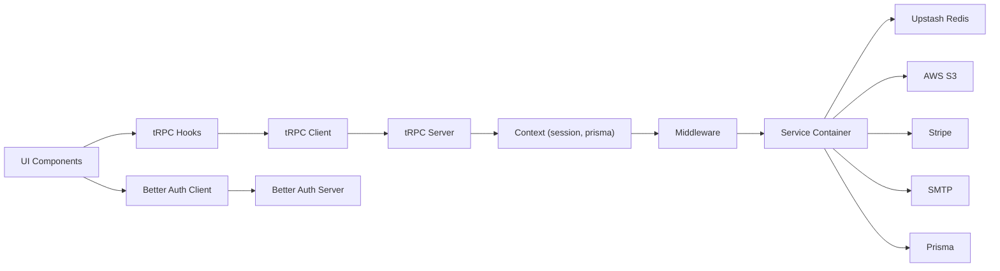

# Data Flow Architecture

<cite>
**Referenced Files in This Document**
- [server/trpc.ts](file://server/trpc.ts)
- [server/caller.ts](file://server/caller.ts)
- [lib/auth.ts](file://lib/auth.ts)
- [lib/auth-client.ts](file://lib/auth-client.ts)
- [lib/prisma.ts](file://lib/prisma.ts)
- [middleware.ts](file://middleware.ts)
- [server/middleware/index.ts](file://server/middleware/index.ts)
- [server/routers/_app.ts](file://server/routers/_app.ts)
- [server/routers/portfolio.ts](file://server/routers/portfolio.ts)
- [lib/trpc-provider.tsx](file://lib/trpc-provider.tsx)
- [modules/portfolio/hooks.ts](file://modules/portfolio/hooks.ts)
- [modules/billing/hooks.ts](file://modules/billing/hooks.ts)
- [modules/ai/hooks.ts](file://modules/ai/hooks.ts)
- [server/services/index.ts](file://server/services/index.ts)
- [server/services/storage.ts](file://server/services/storage.ts)
- [app/layout.tsx](file://app/layout.tsx)
- [app/page.tsx](file://app/page.tsx)
- [app/api/auth/[...all]/route.ts](file://app/api/auth/[...all]/route.ts)
</cite>

## Table of Contents
1. [Introduction](#introduction)
2. [Project Structure](#project-structure)
3. [Core Components](#core-components)
4. [Architecture Overview](#architecture-overview)
5. [Detailed Component Analysis](#detailed-component-analysis)
6. [Dependency Analysis](#dependency-analysis)
7. [Performance Considerations](#performance-considerations)
8. [Troubleshooting Guide](#troubleshooting-guide)
9. [Conclusion](#conclusion)

## Introduction
This document describes the complete data flow architecture of Smartfolio, from user input through UI components, tRPC procedures, business services, and database persistence. It explains the request-response lifecycle, authentication and authorization enforcement, real-time-like state updates via React Query invalidation, and asynchronous operations such as AI generation and file uploads. It also documents validation, transformation, error propagation, caching strategies, and performance optimizations.

## Project Structure
Smartfolio follows a layered architecture:
- Frontend: Next.js App Router with React Query and tRPC React bindings
- Backend: tRPC server with protected procedures, middleware, and service layer
- Authentication: Better Auth with server and client SDKs
- Persistence: Prisma ORM with PostgreSQL
- External integrations: Upstash Redis for rate limiting, AWS S3 for storage, Stripe for billing

**Diagram sources**
- [lib/trpc-provider.tsx](file://lib/trpc-provider.tsx#L1-L50)
- [server/routers/_app.ts](file://server/routers/_app.ts#L1-L21)
- [server/trpc.ts](file://server/trpc.ts#L1-L61)
- [server/middleware/index.ts](file://server/middleware/index.ts#L1-L153)
- [server/services/index.ts](file://server/services/index.ts#L1-L118)
- [server/services/storage.ts](file://server/services/storage.ts#L1-L170)
- [lib/prisma.ts](file://lib/prisma.ts#L1-L14)
- [lib/auth.ts](file://lib/auth.ts#L1-L25)
- [lib/auth-client.ts](file://lib/auth-client.ts#L1-L8)
- [middleware.ts](file://middleware.ts#L1-L95)

**Section sources**
- [lib/trpc-provider.tsx](file://lib/trpc-provider.tsx#L1-L50)
- [server/routers/_app.ts](file://server/routers/_app.ts#L1-L21)
- [server/trpc.ts](file://server/trpc.ts#L1-L61)
- [server/middleware/index.ts](file://server/middleware/index.ts#L1-L153)
- [server/services/index.ts](file://server/services/index.ts#L1-L118)
- [server/services/storage.ts](file://server/services/storage.ts#L1-L170)
- [lib/prisma.ts](file://lib/prisma.ts#L1-L14)
- [lib/auth.ts](file://lib/auth.ts#L1-L25)
- [lib/auth-client.ts](file://lib/auth-client.ts#L1-L8)
- [middleware.ts](file://middleware.ts#L1-L95)

## Core Components
- tRPC initialization and context creation: Provides authenticated session and database access to all procedures.
- Protected procedures: Enforce authentication and optional authorization checks.
- Middleware: Implements rate limiting, subscription checks, admin checks, and usage limits.
- Service container: Centralized factory for domain services (AI, Stripe, Email, Storage, Ratelimit).
- React Query + tRPC React: Client-side caching, batching, and optimistic updates.
- Better Auth: Full-stack authentication with server and client SDKs and Next.js middleware integration.

**Section sources**
- [server/trpc.ts](file://server/trpc.ts#L1-L61)
- [server/middleware/index.ts](file://server/middleware/index.ts#L1-L153)
- [server/services/index.ts](file://server/services/index.ts#L1-L118)
- [lib/trpc-provider.tsx](file://lib/trpc-provider.tsx#L1-L50)
- [lib/auth.ts](file://lib/auth.ts#L1-L25)
- [lib/auth-client.ts](file://lib/auth-client.ts#L1-L8)

## Architecture Overview
The data flow begins at the UI, which triggers tRPC queries/mutations. The tRPC server creates a context with the authenticated session and database connection, applies middleware for authorization and rate limiting, executes business logic via services, persists data via Prisma, and returns transformed results to the client. React Query manages caching and invalidation to keep the UI consistent.

**Diagram sources**
- [lib/trpc-provider.tsx](file://lib/trpc-provider.tsx#L1-L50)
- [server/trpc.ts](file://server/trpc.ts#L12-L20)
- [server/middleware/index.ts](file://server/middleware/index.ts#L13-L36)
- [server/services/index.ts](file://server/services/index.ts#L113-L118)
- [lib/prisma.ts](file://lib/prisma.ts#L1-L14)

## Detailed Component Analysis

### Authentication and Session Management
- Server-side session retrieval: tRPC context uses Better Auth API to obtain session from request headers.
- Client-side session management: Better Auth React client exposes sign-in/sign-out/useSession for UI integration.
- Next.js middleware enforces auth gating for protected routes and redirects unauthenticated users to sign-in with callbackUrl.

**Diagram sources**
- [middleware.ts](file://middleware.ts#L28-L81)
- [app/api/auth/[...all]/route.ts](file://app/api/auth/[...all]/route.ts#L1-L7)
- [lib/auth.ts](file://lib/auth.ts#L1-L25)
- [lib/auth-client.ts](file://lib/auth-client.ts#L1-L8)

**Section sources**
- [server/trpc.ts](file://server/trpc.ts#L12-L20)
- [middleware.ts](file://middleware.ts#L1-L95)
- [app/api/auth/[...all]/route.ts](file://app/api/auth/[...all]/route.ts#L1-L7)
- [lib/auth.ts](file://lib/auth.ts#L1-L25)
- [lib/auth-client.ts](file://lib/auth-client.ts#L1-L8)

### tRPC Client-Server Communication
- Client provider sets up httpBatchLink to /api/trpc with superjson transformer.
- App-wide provider wraps the app tree to enable tRPC React bindings.
- Queries are cached with a short stale time; mutations invalidate related queries.

**Diagram sources**
- [lib/trpc-provider.tsx](file://lib/trpc-provider.tsx#L18-L49)
- [app/layout.tsx](file://app/layout.tsx#L21-L35)

**Section sources**
- [lib/trpc-provider.tsx](file://lib/trpc-provider.tsx#L1-L50)
- [app/layout.tsx](file://app/layout.tsx#L1-L36)

### Protected Procedures and Authorization
- protectedProcedure ensures ctx.session.user exists; otherwise throws UNAUTHORIZED.
- Additional middleware enforce:
  - Rate limiting per user
  - Active subscription requirement
  - Admin role requirement
  - Usage quotas per plan (portfolios, AI generations/month)

**Diagram sources**
- [server/trpc.ts](file://server/trpc.ts#L50-L60)
- [server/middleware/index.ts](file://server/middleware/index.ts#L13-L36)
- [server/middleware/index.ts](file://server/middleware/index.ts#L42-L62)
- [server/middleware/index.ts](file://server/middleware/index.ts#L68-L85)
- [server/middleware/index.ts](file://server/middleware/index.ts#L91-L152)

**Section sources**
- [server/trpc.ts](file://server/trpc.ts#L50-L60)
- [server/middleware/index.ts](file://server/middleware/index.ts#L1-L153)

### Portfolio Module Data Path
- UI triggers hooks for list/get/create/update/delete/publish.
- tRPC router validates inputs with Zod and delegates to Prisma.
- Mutations invalidate related queries to keep UI in sync.

**Diagram sources**
- [modules/portfolio/hooks.ts](file://modules/portfolio/hooks.ts#L10-L99)
- [server/routers/portfolio.ts](file://server/routers/portfolio.ts#L1-L115)
- [lib/prisma.ts](file://lib/prisma.ts#L1-L14)

**Section sources**
- [modules/portfolio/hooks.ts](file://modules/portfolio/hooks.ts#L1-L99)
- [server/routers/portfolio.ts](file://server/routers/portfolio.ts#L1-L115)
- [lib/prisma.ts](file://lib/prisma.ts#L1-L14)

### Billing and AI Modules
- Billing hooks expose subscription, checkout sessions, portal sessions, cancellation/resumption, payment history, and usage stats.
- AI hooks expose generation requests and history/stats.
- Both rely on tRPC queries/mutations and React Query caching/invalidation.

**Section sources**
- [modules/billing/hooks.ts](file://modules/billing/hooks.ts#L1-L91)
- [modules/ai/hooks.ts](file://modules/ai/hooks.ts#L1-L76)

### Real-Time Updates and Asynchronous Operations
- Real-time-like behavior: React Query invalidation after mutations keeps lists fresh without WebSockets.
- Asynchronous operations:
  - AI generation: tRPC mutation invokes AI service via ServiceContainer.
  - File uploads: StorageService uploads to S3 and returns URLs; avatars update user records.

**Diagram sources**
- [server/services/index.ts](file://server/services/index.ts#L25-L36)
- [server/services/storage.ts](file://server/services/storage.ts#L36-L54)
- [modules/ai/hooks.ts](file://modules/ai/hooks.ts#L10-L20)
- [modules/billing/hooks.ts](file://modules/billing/hooks.ts#L20-L29)

**Section sources**
- [server/services/index.ts](file://server/services/index.ts#L1-L118)
- [server/services/storage.ts](file://server/services/storage.ts#L1-L170)
- [modules/ai/hooks.ts](file://modules/ai/hooks.ts#L1-L76)
- [modules/billing/hooks.ts](file://modules/billing/hooks.ts#L1-L91)

### Data Validation, Transformation, and Error Propagation
- Validation: Zod schemas on input parameters in routers.
- Transformation: superjson transformer enables serializing non-POJOs (Dates, Maps).
- Error formatting: tRPC error formatter attaches Zod flatten errors when present.
- Propagation: Middleware throws TRPCError with standardized codes (UNAUTHORIZED, FORBIDDEN, TOO_MANY_REQUESTS).

**Section sources**
- [server/routers/portfolio.ts](file://server/routers/portfolio.ts#L31-L38)
- [server/trpc.ts](file://server/trpc.ts#L27-L39)
- [server/middleware/index.ts](file://server/middleware/index.ts#L24-L29)

### Request-Response Cycle: Portfolio Creation

**Diagram sources**
- [app/page.tsx](file://app/page.tsx#L59-L683)
- [modules/portfolio/hooks.ts](file://modules/portfolio/hooks.ts#L33-L48)
- [server/routers/portfolio.ts](file://server/routers/portfolio.ts#L29-L54)
- [server/trpc.ts](file://server/trpc.ts#L50-L60)
- [server/middleware/index.ts](file://server/middleware/index.ts#L13-L36)
- [lib/prisma.ts](file://lib/prisma.ts#L1-L14)

## Dependency Analysis
- UI depends on tRPC React bindings and React Query for caching.
- tRPC server depends on Better Auth for session, Prisma for persistence, and ServiceContainer for domain services.
- ServiceContainer encapsulates external integrations (Redis, S3, Stripe, Email).
- Middleware composes multiple cross-cutting concerns (rate limiting, subscriptions, admin, usage).

**Diagram sources**
- [lib/trpc-provider.tsx](file://lib/trpc-provider.tsx#L1-L50)
- [server/trpc.ts](file://server/trpc.ts#L12-L20)
- [server/middleware/index.ts](file://server/middleware/index.ts#L1-L153)
- [server/services/index.ts](file://server/services/index.ts#L1-L118)
- [lib/auth-client.ts](file://lib/auth-client.ts#L1-L8)
- [lib/auth.ts](file://lib/auth.ts#L1-L25)
- [lib/prisma.ts](file://lib/prisma.ts#L1-L14)

**Section sources**
- [lib/trpc-provider.tsx](file://lib/trpc-provider.tsx#L1-L50)
- [server/trpc.ts](file://server/trpc.ts#L1-L61)
- [server/middleware/index.ts](file://server/middleware/index.ts#L1-L153)
- [server/services/index.ts](file://server/services/index.ts#L1-L118)
- [lib/auth-client.ts](file://lib/auth-client.ts#L1-L8)
- [lib/auth.ts](file://lib/auth.ts#L1-L25)
- [lib/prisma.ts](file://lib/prisma.ts#L1-L14)

## Performance Considerations
- Batching: tRPC httpBatchLink reduces network overhead.
- Caching: React Query defaultOptions set a small staleTime and disables refetchOnWindowFocus to avoid thrashing.
- Serialization: superjson minimizes payload size and preserves types.
- Rate limiting: Sliding window via Upstash Redis prevents abuse.
- Database logging: Prisma logs queries in development to aid profiling.

Recommendations:
- Use selective invalidation to minimize re-fetches.
- Consider background revalidation for long-lived lists.
- Monitor Redis latency for rate limiting.
- Add database indexes for frequently filtered fields (userId, status, createdAt).

**Section sources**
- [lib/trpc-provider.tsx](file://lib/trpc-provider.tsx#L19-L29)
- [server/trpc.ts](file://server/trpc.ts#L28-L29)
- [server/middleware/index.ts](file://server/middleware/index.ts#L91-L103)
- [lib/prisma.ts](file://lib/prisma.ts#L10-L11)

## Troubleshooting Guide
Common issues and where they originate:
- Authentication failures: Verify cookies and Better Auth session endpoint availability; check middleware redirection logic.
- Authorization errors: Confirm subscription status and user roles; review middleware checks.
- Rate limit exceeded: Inspect Upstash Redis configuration and sliding window settings.
- Mutation not updating UI: Ensure onSuccess invalidation of related queries; confirm React Query cache configuration.
- S3 upload failures: Validate AWS credentials, bucket permissions, and signed URL generation.

Where to look:
- Authentication: middleware.ts, app/api/auth/[...all]/route.ts, lib/auth.ts, lib/auth-client.ts
- Authorization: server/trpc.ts, server/middleware/index.ts
- Rate limiting: server/middleware/index.ts, server/services/index.ts
- React Query invalidation: modules/*/hooks.ts
- S3 operations: server/services/storage.ts

**Section sources**
- [middleware.ts](file://middleware.ts#L28-L81)
- [app/api/auth/[...all]/route.ts](file://app/api/auth/[...all]/route.ts#L1-L7)
- [lib/auth.ts](file://lib/auth.ts#L1-L25)
- [lib/auth-client.ts](file://lib/auth-client.ts#L1-L8)
- [server/trpc.ts](file://server/trpc.ts#L50-L60)
- [server/middleware/index.ts](file://server/middleware/index.ts#L13-L36)
- [modules/portfolio/hooks.ts](file://modules/portfolio/hooks.ts#L36-L40)
- [server/services/storage.ts](file://server/services/storage.ts#L36-L54)

## Conclusion
Smartfolio’s data flow is centered on tRPC for type-safe client-server communication, Better Auth for robust session management, and Prisma for database operations. Middleware enforces security and usage policies, while the Service Container abstracts external integrations. React Query provides efficient caching and optimistic updates, and superjson ensures reliable serialization. Together, these components deliver a scalable, maintainable, and user-responsive architecture.