# Frontend Architecture

<cite>
**Referenced Files in This Document**
- [app/layout.tsx](file://app/layout.tsx)
- [app/page.tsx](file://app/page.tsx)
- [lib/trpc-provider.tsx](file://lib/trpc-provider.tsx)
- [lib/auth-client.ts](file://lib/auth-client.ts)
- [components/layouts/auth-layout.tsx](file://components/layouts/auth-layout.tsx)
- [components/layouts/marketing-layout.tsx](file://components/layouts/marketing-layout.tsx)
- [components/ui/button.tsx](file://components/ui/button.tsx)
- [components/ui/input.tsx](file://components/ui/input.tsx)
- [hooks/index.ts](file://hooks/index.ts)
- [hooks/use-debounce.ts](file://hooks/use-debounce.ts)
- [hooks/use-media-query.ts](file://hooks/use-media-query.ts)
- [modules/auth/hooks.ts](file://modules/auth/hooks.ts)
- [modules/ai/hooks.ts](file://modules/ai/hooks.ts)
- [modules/ai/types.ts](file://modules/ai/types.ts)
- [modules/builder/hooks.ts](file://modules/builder/hooks.ts)
- [modules/builder/types.ts](file://modules/builder/types.ts)
- [modules/builder/utils.ts](file://modules/builder/utils.ts)
- [server/routers/_app.ts](file://server/routers/_app.ts)
- [server/routers/ai.ts](file://server/routers/ai.ts)
- [server/routers/builder.ts](file://server/routers/builder.ts)
- [server/routers/portfolio.ts](file://server/routers/portfolio.ts)
- [server/trpc.ts](file://server/trpc.ts)
- [middleware.ts](file://middleware.ts)
- [next.config.ts](file://next.config.ts)
- [package.json](file://package.json)
- [docs/ARCHITECTURE.md](file://docs/ARCHITECTURE.md)
- [docs/DIAGRAMS.md](file://docs/DIAGRAMS.md)
- [IMPLEMENTATION_SUMMARY.md](file://IMPLEMENTATION_SUMMARY.md)
- [PROJECT-SUMMARY.md](file://PROJECT-SUMMARY.md)
</cite>

## Update Summary
**Changes Made**
- Added comprehensive documentation for the new workspace-first architecture with two-pane layout
- Documented AI reasoning stream and live preview components
- Added builder module for drag-and-drop portfolio construction
- Updated component hierarchy to reflect workspace-centric design
- Enhanced tRPC integration patterns for AI generation and portfolio management
- Added detailed workflow documentation for the new user experience

## Table of Contents
1. [Introduction](#introduction)
2. [Project Structure](#project-structure)
3. [Core Components](#core-components)
4. [Architecture Overview](#architecture-overview)
5. [Detailed Component Analysis](#detailed-component-analysis)
6. [Workspace UI Architecture](#workspace-ui-architecture)
7. [AI Generation System](#ai-generation-system)
8. [Builder Module](#builder-module)
9. [Dependency Analysis](#dependency-analysis)
10. [Performance Considerations](#performance-considerations)
11. [Troubleshooting Guide](#troubleshooting-guide)
12. [Conclusion](#conclusion)

## Introduction
This document describes the frontend architecture of Smartfolio's Next.js 16 application with its workspace-first model. The architecture centers around a revolutionary two-pane layout featuring an AI reasoning stream and live preview, replacing traditional portfolio builders with AI-powered generation. The system implements a comprehensive workspace UI that serves as the single product surface, integrating authentication, AI generation, portfolio management, and publishing workflows into a cohesive user experience.

## Project Structure
Smartfolio follows a modern Next.js 16 App Router structure with a clear separation of concerns and workspace-centric organization:
- app: Root layout and pages under the App Router
- components: Reusable UI components and layout wrappers
- hooks: Shared React hooks for cross-cutting concerns
- lib: Client-side providers and utilities (tRPC, auth)
- modules: Feature-focused modules with hooks, types, and utilities
- server: tRPC routers and server-side context/middleware
- middleware: Route protection and redirection logic
- docs: Architecture and implementation documentation
- next.config.ts: Next.js configuration
- package.json: Dependencies and scripts

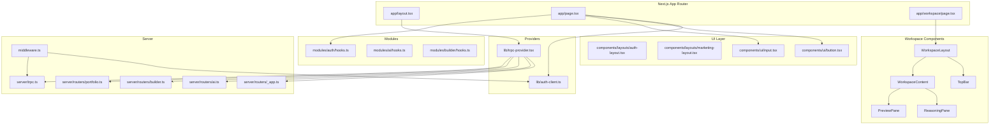

**Diagram sources**
- [app/layout.tsx](file://app/layout.tsx#L1-L36)
- [app/page.tsx](file://app/page.tsx#L1-L683)
- [lib/trpc-provider.tsx](file://lib/trpc-provider.tsx#L1-L50)
- [lib/auth-client.ts](file://lib/auth-client.ts#L1-L8)
- [components/layouts/auth-layout.tsx](file://components/layouts/auth-layout.tsx#L1-L29)
- [components/layouts/marketing-layout.tsx](file://components/layouts/marketing-layout.tsx#L1-L83)
- [components/ui/button.tsx](file://components/ui/button.tsx#L1-L65)
- [components/ui/input.tsx](file://components/ui/input.tsx#L1-L43)
- [modules/auth/hooks.ts](file://modules/auth/hooks.ts#L1-L29)
- [modules/ai/hooks.ts](file://modules/ai/hooks.ts#L1-L76)
- [modules/builder/hooks.ts](file://modules/builder/hooks.ts#L1-L117)
- [server/routers/_app.ts](file://server/routers/_app.ts#L1-L21)
- [server/routers/ai.ts](file://server/routers/ai.ts#L1-L105)
- [server/routers/builder.ts](file://server/routers/builder.ts#L1-L156)
- [server/routers/portfolio.ts](file://server/routers/portfolio.ts#L1-L115)
- [server/trpc.ts](file://server/trpc.ts#L1-L61)
- [middleware.ts](file://middleware.ts#L1-L95)

**Section sources**
- [app/layout.tsx](file://app/layout.tsx#L1-L36)
- [app/page.tsx](file://app/page.tsx#L1-L683)
- [lib/trpc-provider.tsx](file://lib/trpc-provider.tsx#L1-L50)
- [lib/auth-client.ts](file://lib/auth-client.ts#L1-L8)
- [components/layouts/auth-layout.tsx](file://components/layouts/auth-layout.tsx#L1-L29)
- [components/layouts/marketing-layout.tsx](file://components/layouts/marketing-layout.tsx#L1-L83)
- [components/ui/button.tsx](file://components/ui/button.tsx#L1-L65)
- [components/ui/input.tsx](file://components/ui/input.tsx#L1-L43)
- [modules/auth/hooks.ts](file://modules/auth/hooks.ts#L1-L29)
- [modules/ai/hooks.ts](file://modules/ai/hooks.ts#L1-L76)
- [modules/builder/hooks.ts](file://modules/builder/hooks.ts#L1-L117)
- [server/routers/_app.ts](file://server/routers/_app.ts#L1-L21)
- [server/routers/ai.ts](file://server/routers/ai.ts#L1-L105)
- [server/routers/builder.ts](file://server/routers/builder.ts#L1-L156)
- [server/routers/portfolio.ts](file://server/routers/portfolio.ts#L1-L115)
- [server/trpc.ts](file://server/trpc.ts#L1-L61)
- [middleware.ts](file://middleware.ts#L1-L95)
- [next.config.ts](file://next.config.ts#L1-L8)
- [package.json](file://package.json#L1-L52)

## Core Components
- Root Layout Provider: Wraps the entire app with tRPC and global styles.
- Home Page: Client-side marketing page with interactive features, modals, and voice input.
- Workspace Layout: Central two-pane interface with AI reasoning stream and live preview.
- tRPC Provider: Configures React Query and tRPC client with batching and serialization.
- Auth Client: Better Auth client configured for the frontend.
- Layouts: Auth and marketing layouts for consistent page scaffolding.
- UI Components: Reusable primitives (Button, Input) with variant and size options.
- Custom Hooks: Debounce, media query matching, click-outside, and local storage utilities.
- Auth Module Hooks: Session-aware hooks for authentication state and guards.
- AI Module Hooks: Comprehensive AI generation and history management.
- Builder Module Hooks: Drag-and-drop portfolio construction and template management.
- Server Routers: Centralized tRPC router composition for AI, builder, and portfolio services.
- Middleware: Route protection and redirects for authenticated/public routes.

**Section sources**
- [app/layout.tsx](file://app/layout.tsx#L1-L36)
- [app/page.tsx](file://app/page.tsx#L1-L683)
- [lib/trpc-provider.tsx](file://lib/trpc-provider.tsx#L1-L50)
- [lib/auth-client.ts](file://lib/auth-client.ts#L1-L8)
- [components/layouts/auth-layout.tsx](file://components/layouts/auth-layout.tsx#L1-L29)
- [components/layouts/marketing-layout.tsx](file://components/layouts/marketing-layout.tsx#L1-L83)
- [components/ui/button.tsx](file://components/ui/button.tsx#L1-L65)
- [components/ui/input.tsx](file://components/ui/input.tsx#L1-L43)
- [hooks/index.ts](file://hooks/index.ts#L1-L9)
- [hooks/use-debounce.ts](file://hooks/use-debounce.ts#L1-L20)
- [hooks/use-media-query.ts](file://hooks/use-media-query.ts#L1-L22)
- [modules/auth/hooks.ts](file://modules/auth/hooks.ts#L1-L29)
- [modules/ai/hooks.ts](file://modules/ai/hooks.ts#L1-L76)
- [modules/builder/hooks.ts](file://modules/builder/hooks.ts#L1-L117)
- [server/routers/_app.ts](file://server/routers/_app.ts#L1-L21)
- [server/routers/ai.ts](file://server/routers/ai.ts#L1-L105)
- [server/routers/builder.ts](file://server/routers/builder.ts#L1-L156)
- [server/trpc.ts](file://server/trpc.ts#L1-L61)
- [middleware.ts](file://middleware.ts#L1-L95)

## Architecture Overview
The frontend architecture centers around a workspace-first model that prioritizes the AI generation experience:
- App Router with a single root layout that initializes tRPC and applies global fonts/styles.
- Client-side providers for tRPC and authentication.
- Feature-based modules encapsulating domain logic and hooks for AI, builder, and auth.
- A centralized tRPC router composition on the server with specialized routers for different domains.
- Middleware-driven route protection and session validation.
- UI primitives and layout wrappers enabling consistent design and UX.
- Workspace-centric component hierarchy with two-pane layout for AI reasoning and preview.

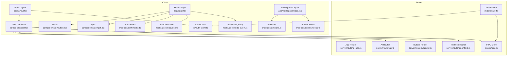

**Diagram sources**
- [app/layout.tsx](file://app/layout.tsx#L1-L36)
- [lib/trpc-provider.tsx](file://lib/trpc-provider.tsx#L1-L50)
- [lib/auth-client.ts](file://lib/auth-client.ts#L1-L8)
- [app/page.tsx](file://app/page.tsx#L1-L683)
- [app/workspace/page.tsx](file://app/workspace/page.tsx#L1-L200)
- [components/ui/button.tsx](file://components/ui/button.tsx#L1-L65)
- [components/ui/input.tsx](file://components/ui/input.tsx#L1-L43)
- [modules/auth/hooks.ts](file://modules/auth/hooks.ts#L1-L29)
- [modules/ai/hooks.ts](file://modules/ai/hooks.ts#L1-L76)
- [modules/builder/hooks.ts](file://modules/builder/hooks.ts#L1-L117)
- [hooks/use-debounce.ts](file://hooks/use-debounce.ts#L1-L20)
- [hooks/use-media-query.ts](file://hooks/use-media-query.ts#L1-L22)
- [server/routers/_app.ts](file://server/routers/_app.ts#L1-L21)
- [server/routers/ai.ts](file://server/routers/ai.ts#L1-L105)
- [server/routers/builder.ts](file://server/routers/builder.ts#L1-L156)
- [server/routers/portfolio.ts](file://server/routers/portfolio.ts#L1-L115)
- [server/trpc.ts](file://server/trpc.ts#L1-L61)
- [middleware.ts](file://middleware.ts#L1-L95)

## Detailed Component Analysis

### App Router and Root Layout
- The root layout sets metadata, loads fonts, injects global CSS, and wraps children with the tRPC provider.
- This ensures all pages inherit consistent typography and tRPC capabilities.

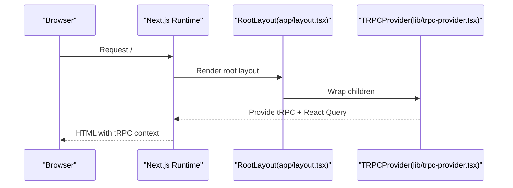

**Diagram sources**
- [app/layout.tsx](file://app/layout.tsx#L1-L36)
- [lib/trpc-provider.tsx](file://lib/trpc-provider.tsx#L1-L50)

**Section sources**
- [app/layout.tsx](file://app/layout.tsx#L1-L36)

### Home Page and Client-Side Features
- The home page is marked client-only and orchestrates:
  - State for text input, files, modal visibility, and social sign-in loading/error states.
  - Speech recognition integration with browser APIs.
  - Responsive textarea auto-resize and word counting with limits.
  - Modal lifecycle with transitions and keyboard handling.
  - Social sign-in via Better Auth client with callback URL propagation.

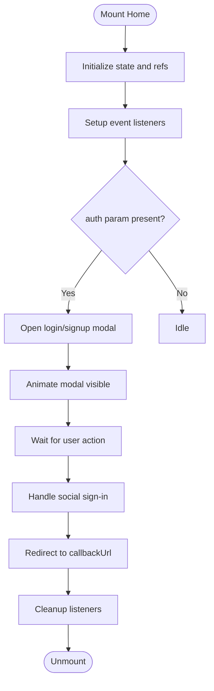

**Diagram sources**
- [app/page.tsx](file://app/page.tsx#L1-L683)
- [lib/auth-client.ts](file://lib/auth-client.ts#L1-L8)

**Section sources**
- [app/page.tsx](file://app/page.tsx#L1-L683)
- [lib/auth-client.ts](file://lib/auth-client.ts#L1-L8)

### tRPC Provider Setup and Global State Management
- The tRPC provider creates a React Query client with caching and batching, and a tRPC client configured with:
  - Base URL resolution for development/vercel environments.
  - SuperJSON transformer for efficient serialization.
  - Batch link for reduced network overhead.
- The provider exposes a typed tRPC hook for client usage.

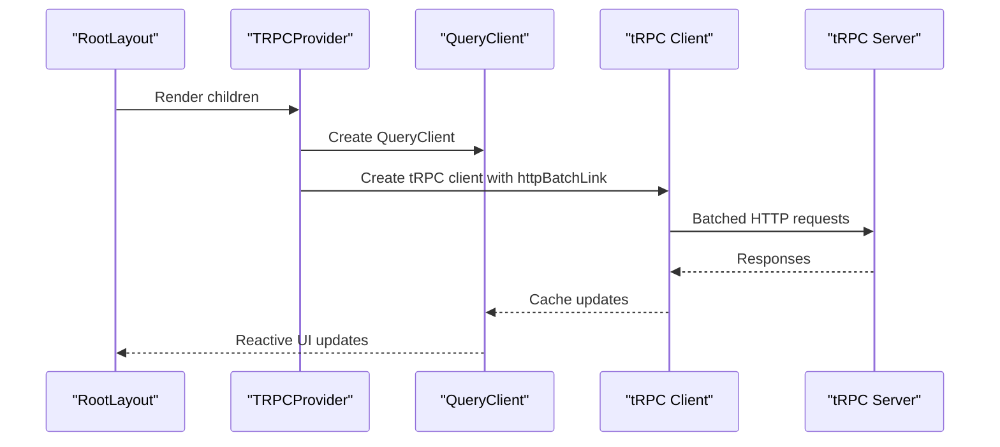

**Diagram sources**
- [lib/trpc-provider.tsx](file://lib/trpc-provider.tsx#L1-L50)
- [server/routers/_app.ts](file://server/routers/_app.ts#L1-L21)
- [server/trpc.ts](file://server/trpc.ts#L1-L61)

**Section sources**
- [lib/trpc-provider.tsx](file://lib/trpc-provider.tsx#L1-L50)
- [server/routers/_app.ts](file://server/routers/_app.ts#L1-L21)
- [server/trpc.ts](file://server/trpc.ts#L1-L61)

### Authentication Layout System
- AuthLayout provides a centered card layout with branding and footer links for authentication pages.
- It is designed for client-side usage and integrates with Better Auth for session management.

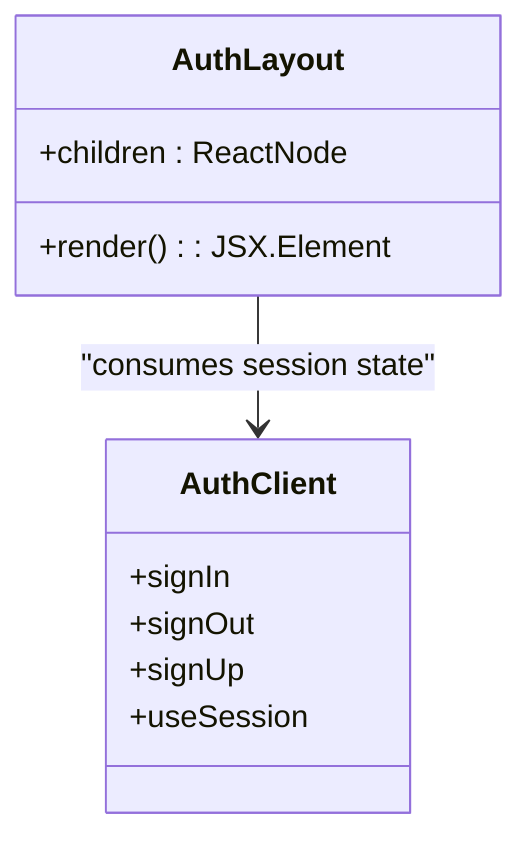

**Diagram sources**
- [components/layouts/auth-layout.tsx](file://components/layouts/auth-layout.tsx#L1-L29)
- [lib/auth-client.ts](file://lib/auth-client.ts#L1-L8)

**Section sources**
- [components/layouts/auth-layout.tsx](file://components/layouts/auth-layout.tsx#L1-L29)
- [lib/auth-client.ts](file://lib/auth-client.ts#L1-L8)

### Marketing Layout Structure
- MarketingLayout defines a header with navigation, main content area, and a multi-column footer.
- It is suitable for public marketing pages and provides consistent branding and links.

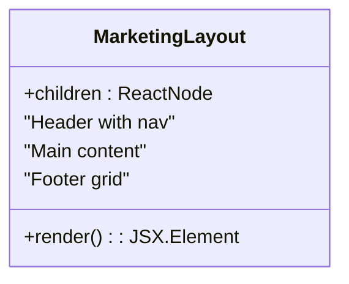

**Diagram sources**
- [components/layouts/marketing-layout.tsx](file://components/layouts/marketing-layout.tsx#L1-L83)

**Section sources**
- [components/layouts/marketing-layout.tsx](file://components/layouts/marketing-layout.tsx#L1-L83)

### UI Component Library Architecture
- Button: Variants (primary, secondary, outline, ghost, danger), sizes (sm, md, lg), loading state, and full-width option.
- Input: Label, error, helper text, and disabled states with Tailwind-based styling.

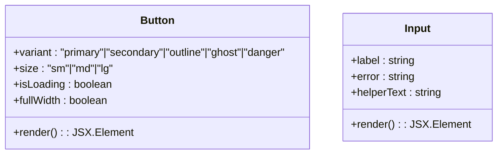

**Diagram sources**
- [components/ui/button.tsx](file://components/ui/button.tsx#L1-L65)
- [components/ui/input.tsx](file://components/ui/input.tsx#L1-L43)

**Section sources**
- [components/ui/button.tsx](file://components/ui/button.tsx#L1-L65)
- [components/ui/input.tsx](file://components/ui/input.tsx#L1-L43)

### Custom Hooks Ecosystem
- useDebounce: Returns a debounced value after a delay.
- useMediaQuery: Tracks media query matches and updates on change.
- useClickOutside: Detects clicks outside a given element.
- useLocalStorage: Persists and retrieves values from localStorage.

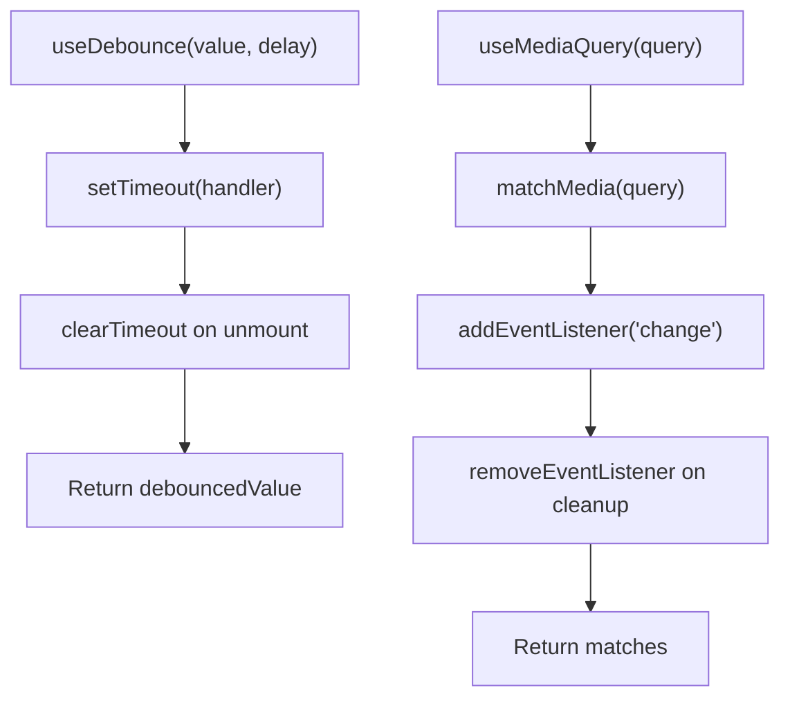

**Diagram sources**
- [hooks/use-debounce.ts](file://hooks/use-debounce.ts#L1-L20)
- [hooks/use-media-query.ts](file://hooks/use-media-query.ts#L1-L22)

**Section sources**
- [hooks/index.ts](file://hooks/index.ts#L1-L9)
- [hooks/use-debounce.ts](file://hooks/use-debounce.ts#L1-L20)
- [hooks/use-media-query.ts](file://hooks/use-media-query.ts#L1-L22)

### Reusable Component Patterns
- ForwardRef pattern for native attributes and accessibility.
- Variant and size props for consistent styling across components.
- Controlled state patterns in forms and inputs.
- Modal composition with overlay, transitions, and escape handling.

**Section sources**
- [components/ui/button.tsx](file://components/ui/button.tsx#L1-L65)
- [components/ui/input.tsx](file://components/ui/input.tsx#L1-L43)
- [app/page.tsx](file://app/page.tsx#L1-L683)

### Authentication Hooks and Guards
- useAuth: Exposes user, session, loading state, and authentication status.
- useRequireAuth: Throws when unauthenticated, enabling guard-like behavior in components.

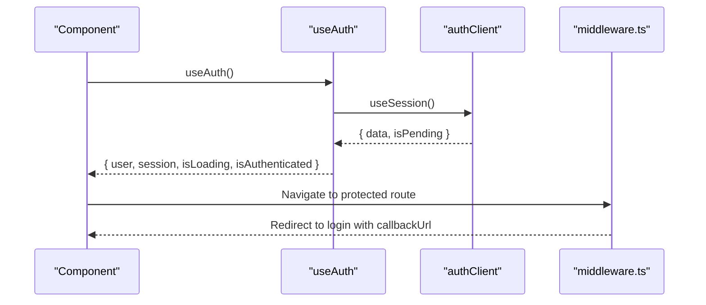

**Diagram sources**
- [modules/auth/hooks.ts](file://modules/auth/hooks.ts#L1-L29)
- [lib/auth-client.ts](file://lib/auth-client.ts#L1-L8)
- [middleware.ts](file://middleware.ts#L1-L95)

**Section sources**
- [modules/auth/hooks.ts](file://modules/auth/hooks.ts#L1-L29)
- [lib/auth-client.ts](file://lib/auth-client.ts#L1-L8)
- [middleware.ts](file://middleware.ts#L1-L95)

### Backend Integration Through tRPC
- The server composes feature routers into a central App Router.
- tRPC context provides session and database access for procedures.
- Protected procedures enforce authentication.

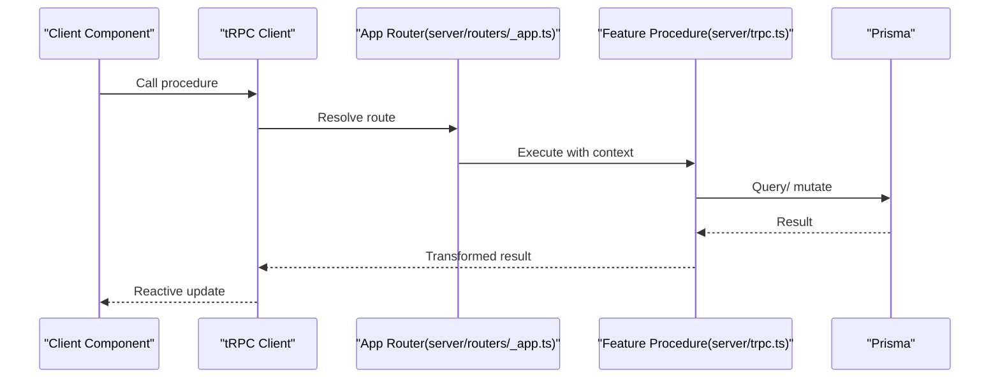

**Diagram sources**
- [server/routers/_app.ts](file://server/routers/_app.ts#L1-L21)
- [server/trpc.ts](file://server/trpc.ts#L1-L61)
- [lib/trpc-provider.tsx](file://lib/trpc-provider.tsx#L1-L50)

**Section sources**
- [server/routers/_app.ts](file://server/routers/_app.ts#L1-L21)
- [server/trpc.ts](file://server/trpc.ts#L1-L61)

## Workspace UI Architecture

### Two-Pane Layout Design
Smartfolio implements a revolutionary workspace-first model with a sophisticated two-pane layout that separates AI reasoning from live preview:

**Left Pane (35-40%): AI Reasoning Stream**
- Real-time step-by-step generation progress
- Interactive prompt input at bottom
- Generation history display
- Loading states and completion indicators

**Right Pane (60-65%): Live Preview**
- Progressive portfolio rendering
- Interactive iframe-based preview
- Viewport toggles for desktop/tablet/mobile
- Real-time updates as content streams

**Top Bar Components**
- Logo and branding
- Editable portfolio name
- Project switcher dropdown
- Publish button
- Upgrade badge
- User avatar dropdown with settings and billing

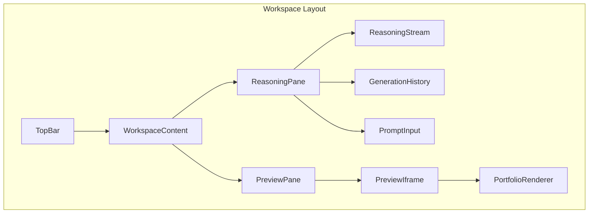

**Diagram sources**
- [docs/DIAGRAMS.md](file://docs/DIAGRAMS.md#L326-L364)

**Section sources**
- [docs/ARCHITECTURE.md](file://docs/ARCHITECTURE.md#L29-L49)
- [docs/DIAGRAMS.md](file://docs/DIAGRAMS.md#L326-L364)

### State Management and Transitions
The workspace operates through three distinct states with smooth transitions:

**Initial State**
- Centered prompt input with landing page aesthetics
- No panes visible
- Top bar shows basic controls

**Active Generation State**
- Two-pane layout activates
- Reasoning pane shows real-time progress
- Preview pane displays progressive rendering
- Prompt input becomes fixed at bottom of reasoning pane

**Post-Generation State**
- Generation history available
- Ready for refinements
- Fully interactive preview

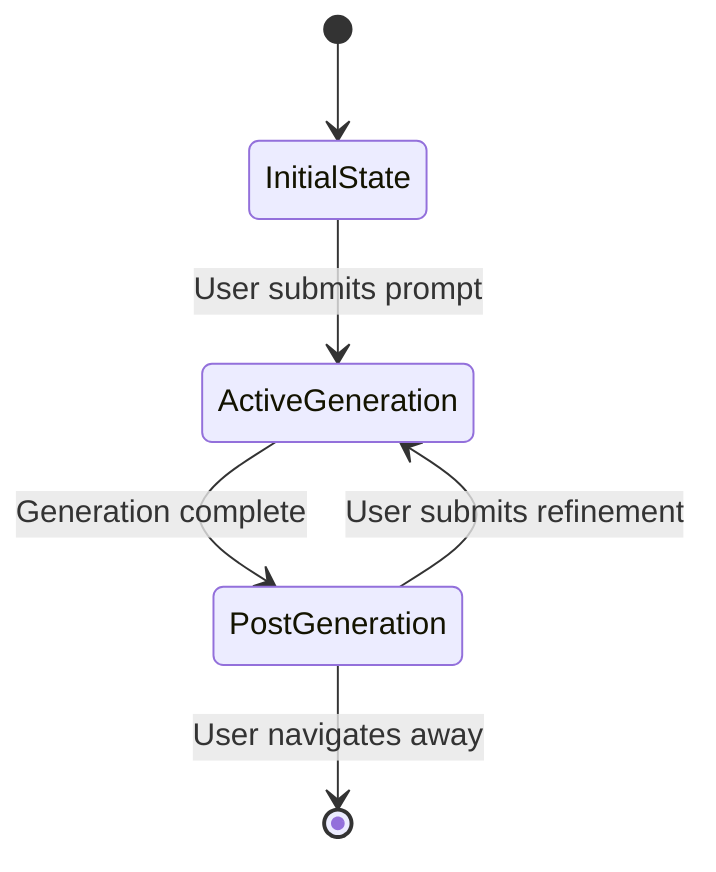

**Diagram sources**
- [docs/ARCHITECTURE.md](file://docs/ARCHITECTURE.md#L29-L49)

**Section sources**
- [docs/ARCHITECTURE.md](file://docs/ARCHITECTURE.md#L29-L49)

## AI Generation System

### AI Module Architecture
The AI system provides comprehensive generation capabilities through a well-structured module system:

**AI Generation Hooks**
- `useAIGeneration`: Generic AI generation with type safety
- `useGeneratePortfolioContent`: Structured portfolio generation
- `useGenerateProjectDescription`: Individual project content generation
- `useGenerateSEO`: SEO metadata generation
- `useAIHistory`: Access to generation history
- `useAIUsageStats`: Usage statistics and limits

**AI Types and Interfaces**
- `AIGenerationRequest`: Standardized input format
- `AIGenerationResponse`: Response structure with metadata
- `AIGenerationHistory`: Historical record format
- `PortfolioGenerationInput`: Portfolio-specific input
- `ProjectDescriptionInput`: Project-specific input
- `SEOMetaInput`: SEO-specific input

**Supported Generation Types**
- PORTFOLIO_CONTENT: Complete portfolio content
- PROJECT_DESCRIPTION: Individual project descriptions
- ABOUT_SECTION: Personal/about section content
- SKILLS_SUMMARY: Skills and expertise summaries
- SEO_META: Search engine optimization metadata
- IMAGE_ALT_TEXT: Alternative text for images

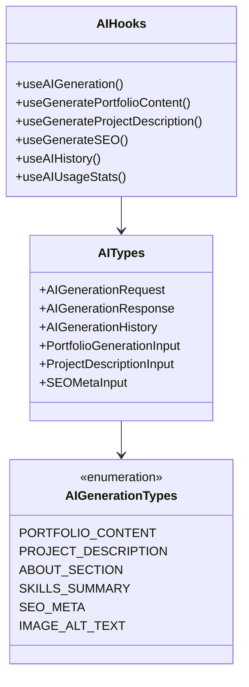

**Diagram sources**
- [modules/ai/hooks.ts](file://modules/ai/hooks.ts#L1-L76)
- [modules/ai/types.ts](file://modules/ai/types.ts#L1-L69)

**Section sources**
- [modules/ai/hooks.ts](file://modules/ai/hooks.ts#L1-L76)
- [modules/ai/types.ts](file://modules/ai/types.ts#L1-L69)
- [server/routers/ai.ts](file://server/routers/ai.ts#L1-L105)

### AI Generation Pipeline
The AI generation system implements a sophisticated pipeline with real-time streaming:

**User Flow**
1. User submits prompt in workspace
2. tRPC mutation triggers AI generation
3. Usage limits checked against subscription plan
4. Streaming connection established
5. Structured portfolio JSON streamed in real-time
6. Reasoning pane shows step-by-step progress
7. Preview pane renders content progressively
8. Generation history maintained

**Streaming Implementation**
- Real-time progress updates in reasoning pane
- Progressive content rendering in preview
- Error handling and retry mechanisms
- Token usage tracking and limits enforcement

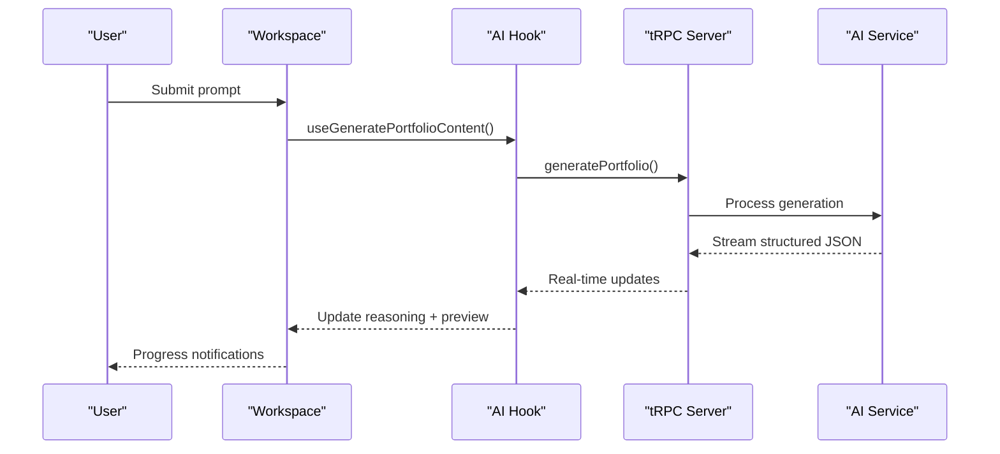

**Diagram sources**
- [docs/DIAGRAMS.md](file://docs/DIAGRAMS.md#L142-L186)
- [modules/ai/hooks.ts](file://modules/ai/hooks.ts#L22-L32)
- [server/routers/ai.ts](file://server/routers/ai.ts#L33-L52)

**Section sources**
- [docs/DIAGRAMS.md](file://docs/DIAGRAMS.md#L142-L186)
- [modules/ai/hooks.ts](file://modules/ai/hooks.ts#L1-L76)
- [server/routers/ai.ts](file://server/routers/ai.ts#L1-L105)

## Builder Module

### Drag-and-Drop Builder System
The builder module provides a comprehensive drag-and-drop interface for manual portfolio construction:

**Builder Hooks**
- `useBuilder`: Core builder state management
- `useTemplates`: Template retrieval and application
- `useApplyTemplate`: Template application functionality
- `useSaveBlocks`: Block persistence and saving

**Block System**
- Comprehensive block types: Hero, Text, Image, Gallery, Video, Skills, Timeline, Projects, Testimonials, Contact, CTA, Spacer
- Block manipulation: Add, update, delete, reorder
- Visual selection and preview modes
- History tracking for undo/redo functionality

**Template System**
- Predefined template categories and themes
- Template application with block conversion
- Premium template support
- Export/import functionality for blocks

**State Management**
- BuilderState interface with portfolio context
- Drag-and-drop item tracking
- Selection and preview mode management
- Undo/redo history with timestamps

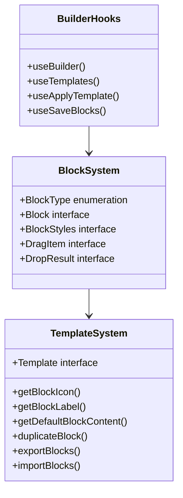

**Diagram sources**
- [modules/builder/hooks.ts](file://modules/builder/hooks.ts#L1-L117)
- [modules/builder/types.ts](file://modules/builder/types.ts#L1-L76)
- [modules/builder/utils.ts](file://modules/builder/utils.ts#L1-L119)

**Section sources**
- [modules/builder/hooks.ts](file://modules/builder/hooks.ts#L1-L117)
- [modules/builder/types.ts](file://modules/builder/types.ts#L1-L76)
- [modules/builder/utils.ts](file://modules/builder/utils.ts#L1-L119)
- [server/routers/builder.ts](file://server/routers/builder.ts#L1-L156)

### Builder Workflow
The builder module supports both AI-generated and manually constructed portfolios:

**Template-Based Construction**
1. Template selection from library
2. Automatic block conversion and placement
3. Theme application and customization
4. Manual adjustments and refinements

**Manual Construction**
1. Block addition from sidebar
2. Drag-and-drop positioning
3. Content editing and styling
4. Real-time preview updates
5. History tracking for modifications

**Integration with AI System**
- Seamless transition between AI generation and manual editing
- Template-based AI outputs for faster customization
- Hybrid approach combining AI insights with manual control

**Section sources**
- [modules/builder/hooks.ts](file://modules/builder/hooks.ts#L1-L117)
- [modules/builder/types.ts](file://modules/builder/types.ts#L1-L76)
- [modules/builder/utils.ts](file://modules/builder/utils.ts#L1-L119)
- [server/routers/builder.ts](file://server/routers/builder.ts#L1-L156)

## Dependency Analysis
Key dependencies and their roles in the workspace-first architecture:
- next: App Router runtime and SSR/SSG support.
- @trpc/react-query and @trpc/client: Type-safe client-server communication with batching and caching.
- @tanstack/react-query: Global query cache and refetch strategies.
- better-auth/react: Client SDK for authentication with session management.
- superjson: Efficient serialization/deserialization for tRPC.
- tailwind-based UI components and hooks for responsive design.
- Real-time streaming libraries for AI generation feedback.
- Advanced state management for complex workspace interactions.

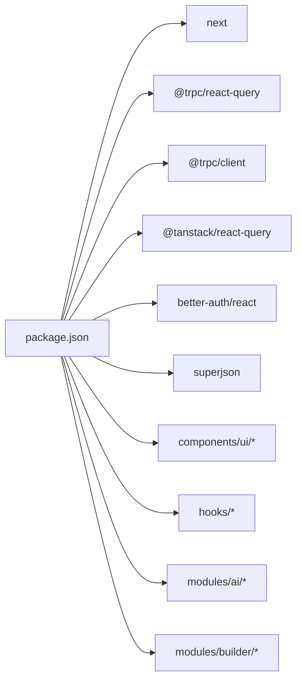

**Diagram sources**
- [package.json](file://package.json#L1-L52)

**Section sources**
- [package.json](file://package.json#L1-L52)

## Performance Considerations
- tRPC batching: Reduces round-trips via httpBatchLink.
- React Query defaults: Short stale time and controlled refetch behavior minimize redundant requests.
- Font optimization: Preloaded fonts via Next/font reduce CLS and improve LCP.
- Client-only pages: Marking pages with "use client" enables granular code splitting.
- Component-level lazy-loading: Consider dynamic imports for heavy components not immediately needed.
- Bundle size management: Prefer tree-shaken libraries, avoid unused polyfills, and leverage Next.js automatic optimizations.
- Middleware checks: Lightweight session validation avoids unnecessary server calls for public routes.
- Real-time streaming optimization: Efficient WebSocket/SSE connections for AI feedback.
- Two-pane layout performance: Optimized rendering for simultaneous reasoning and preview updates.
- AI generation caching: Strategic caching of common generation patterns and templates.

## Troubleshooting Guide
- Authentication redirects loop:
  - Verify middleware matcher and public/auth route lists.
  - Confirm Better Auth session cookie presence and API availability.
- tRPC client errors:
  - Check base URL resolution and transformer configuration.
  - Inspect server error formatter for Zod errors.
- Voice input not working:
  - Ensure browser supports SpeechRecognition and site is served over HTTPS.
  - Validate modal lifecycle and cleanup on unmount.
- Modal not closing:
  - Confirm click-outside handler and Escape key listener are attached and cleaned up.
- AI generation failures:
  - Check API key configuration and rate limits.
  - Verify streaming connection stability.
  - Monitor token usage against subscription limits.
- Workspace layout issues:
  - Ensure proper viewport sizing for two-pane layout.
  - Validate responsive breakpoints for mobile devices.
- Builder module problems:
  - Check template compatibility and block conversions.
  - Verify drag-and-drop event handlers.
  - Confirm state synchronization between AI and builder modes.

**Section sources**
- [middleware.ts](file://middleware.ts#L1-L95)
- [lib/trpc-provider.tsx](file://lib/trpc-provider.tsx#L1-L50)
- [server/trpc.ts](file://server/trpc.ts#L1-L61)
- [app/page.tsx](file://app/page.tsx#L1-L683)
- [modules/ai/hooks.ts](file://modules/ai/hooks.ts#L1-L76)
- [modules/builder/hooks.ts](file://modules/builder/hooks.ts#L1-L117)

## Conclusion
Smartfolio's frontend architecture represents a paradigm shift from traditional portfolio builders to an AI-first workspace experience. The revolutionary two-pane layout with AI reasoning stream and live preview creates an unprecedented user experience, while the workspace-first model consolidates all functionality into a single, intuitive interface. The comprehensive module system for AI generation and manual building provides flexibility for both automated and hands-on approaches to portfolio creation. With robust tRPC integration, advanced state management, and performance optimizations, the architecture supports scalable growth while maintaining exceptional user experience. The integration of authentication, billing, and publishing workflows within the workspace ensures a seamless journey from initial concept to published portfolio.