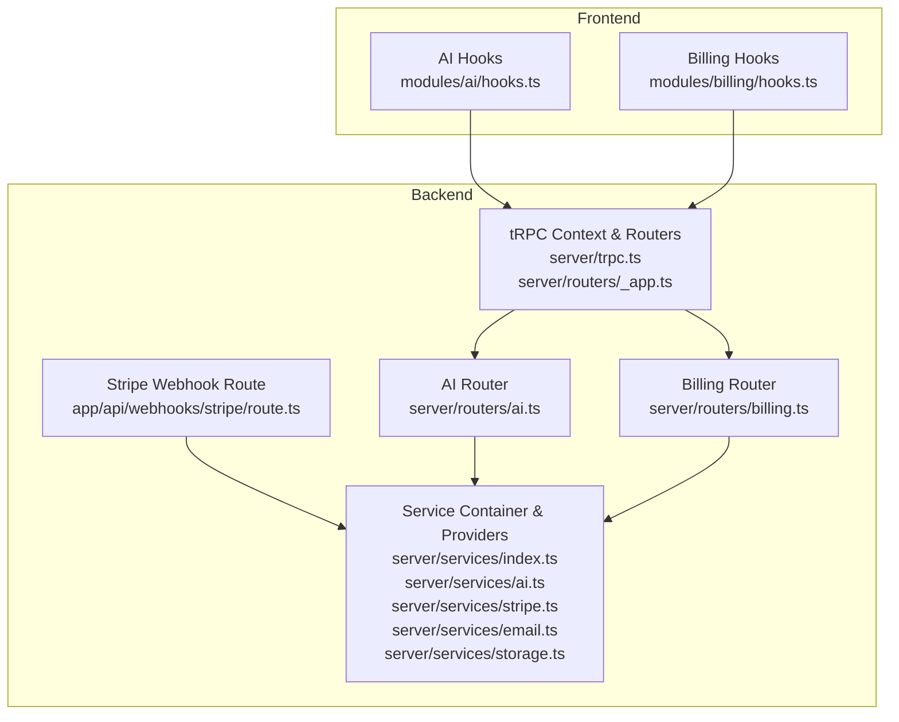
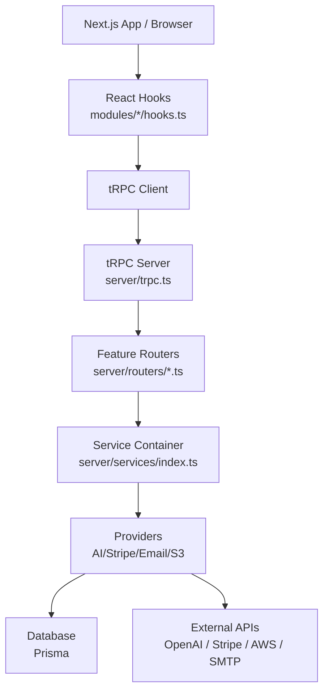
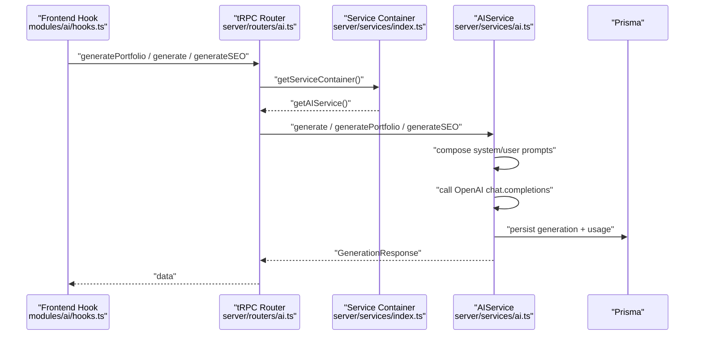
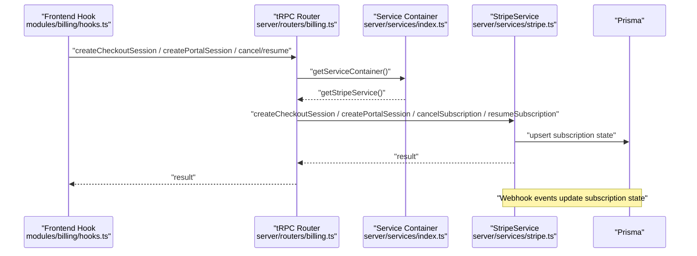
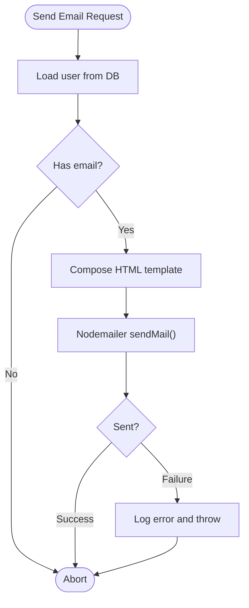
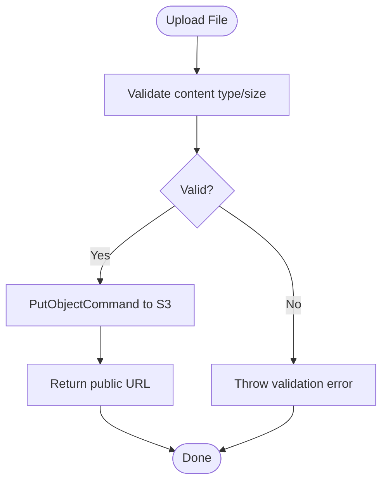
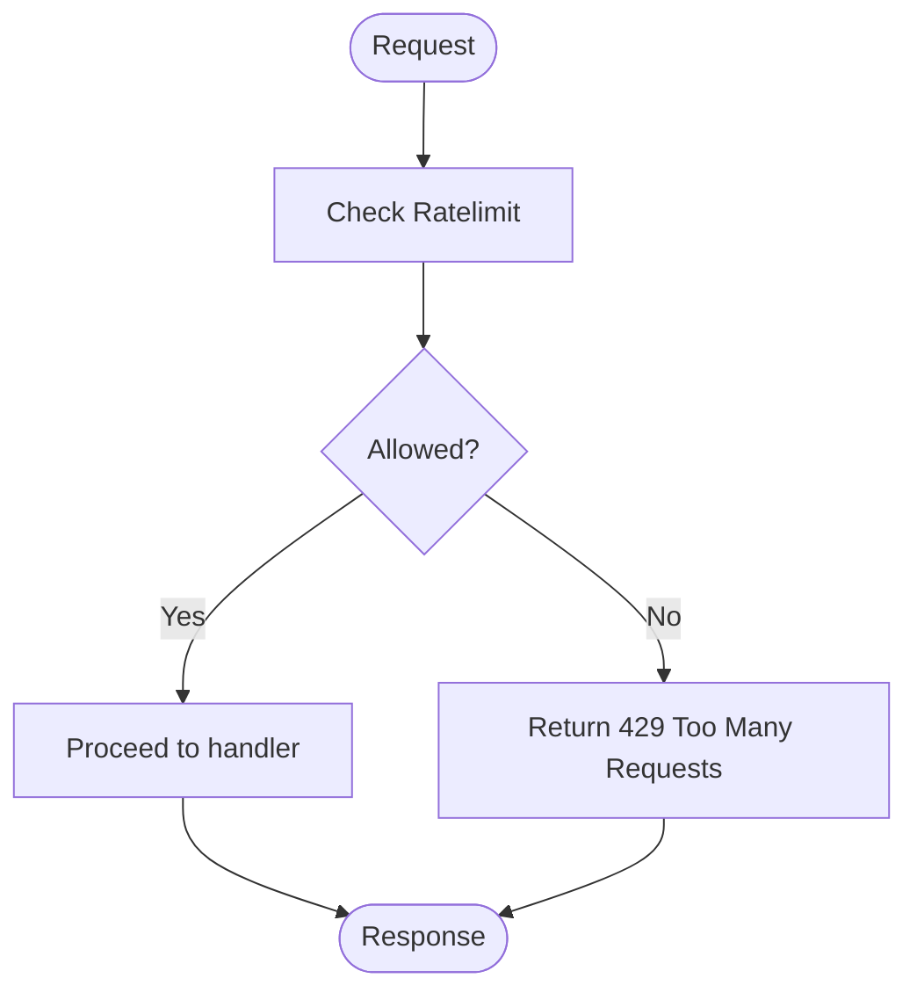
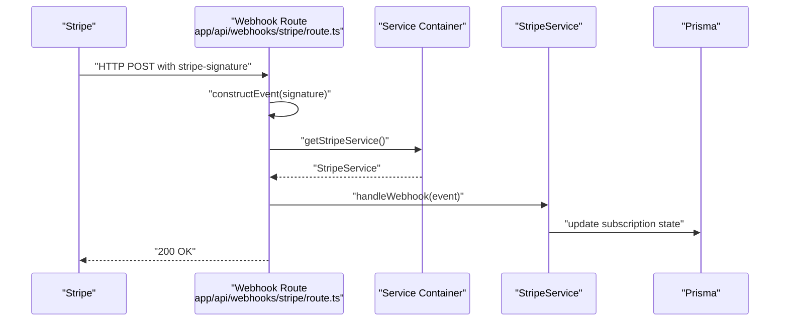
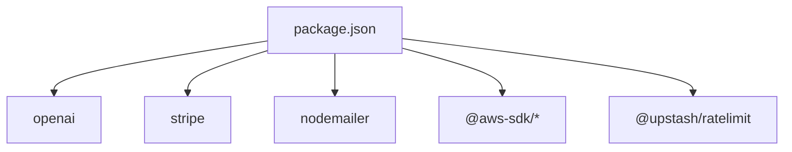

# Integration Patterns

<cite>
**Referenced Files in This Document**
- [server/services/index.ts](file://server/services/index.ts)
- [server/services/ai.ts](file://server/services/ai.ts)
- [server/services/stripe.ts](file://server/services/stripe.ts)
- [server/services/email.ts](file://server/services/email.ts)
- [server/services/storage.ts](file://server/services/storage.ts)
- [app/api/webhooks/stripe/route.ts](file://app/api/webhooks/stripe/route.ts)
- [server/routers/_app.ts](file://server/routers/_app.ts)
- [server/routers/ai.ts](file://server/routers/ai.ts)
- [server/routers/billing.ts](file://server/routers/billing.ts)
- [server/trpc.ts](file://server/trpc.ts)
- [modules/ai/hooks.ts](file://modules/ai/hooks.ts)
- [modules/billing/hooks.ts](file://modules/billing/hooks.ts)
- [modules/billing/utils.ts](file://modules/billing/utils.ts)
- [package.json](file://package.json)
</cite>

## Table of Contents
1. [Introduction](#introduction)
2. [Project Structure](#project-structure)
3. [Core Components](#core-components)
4. [Architecture Overview](#architecture-overview)
5. [Detailed Component Analysis](#detailed-component-analysis)
6. [Dependency Analysis](#dependency-analysis)
7. [Performance Considerations](#performance-considerations)
8. [Troubleshooting Guide](#troubleshooting-guide)
9. [Conclusion](#conclusion)

## Introduction
This document explains Smartfolio’s external service integration patterns. It covers the service layer architecture, provider abstractions for AI (OpenAI), payments (Stripe), email (Nodemailer), and file storage (AWS S3). It also documents the service container pattern, dependency injection, error handling, rate limiting, webhook handling, and asynchronous processing. The goal is to provide a clear understanding of how external providers are integrated, configured, and consumed consistently across the backend and frontend.

## Project Structure
Smartfolio organizes integration concerns into a dedicated service layer with explicit provider abstractions. The backend exposes capabilities through tRPC routers, while the frontend consumes typed hooks. Webhooks are handled via Next.js API routes.



**Diagram sources**
- [modules/ai/hooks.ts](file://modules/ai/hooks.ts#L1-L76)
- [modules/billing/hooks.ts](file://modules/billing/hooks.ts#L1-L91)
- [server/trpc.ts](file://server/trpc.ts#L1-L61)
- [server/routers/_app.ts](file://server/routers/_app.ts#L1-L21)
- [server/routers/ai.ts](file://server/routers/ai.ts#L1-L105)
- [server/routers/billing.ts](file://server/routers/billing.ts#L1-L71)
- [app/api/webhooks/stripe/route.ts](file://app/api/webhooks/stripe/route.ts#L1-L38)
- [server/services/index.ts](file://server/services/index.ts#L1-L118)
- [server/services/ai.ts](file://server/services/ai.ts#L1-L242)
- [server/services/stripe.ts](file://server/services/stripe.ts#L1-L294)
- [server/services/email.ts](file://server/services/email.ts#L1-L177)
- [server/services/storage.ts](file://server/services/storage.ts#L1-L170)

**Section sources**
- [server/services/index.ts](file://server/services/index.ts#L1-L118)
- [server/routers/_app.ts](file://server/routers/_app.ts#L1-L21)
- [server/routers/ai.ts](file://server/routers/ai.ts#L1-L105)
- [server/routers/billing.ts](file://server/routers/billing.ts#L1-L71)
- [app/api/webhooks/stripe/route.ts](file://app/api/webhooks/stripe/route.ts#L1-L38)
- [modules/ai/hooks.ts](file://modules/ai/hooks.ts#L1-L76)
- [modules/billing/hooks.ts](file://modules/billing/hooks.ts#L1-L91)

## Core Components
- Service Container: Centralized factory for lazily initializing providers and shared clients (Prisma, Upstash Redis for rate limiting).
- Provider Abstractions:
  - AIService: OpenAI chat completions with persistence and usage analytics.
  - StripeService: Checkout sessions, billing portal, subscription lifecycle, and webhook handling.
  - EmailService: SMTP transport via Nodemailer with templated emails.
  - StorageService: AWS S3 uploads, deletions, signed URLs, and image validation helpers.
- tRPC Integration: Protected procedures expose provider-backed features to the client.
- Frontend Hooks: Typed mutations and queries for AI and billing features.

**Section sources**
- [server/services/index.ts](file://server/services/index.ts#L9-L108)
- [server/services/ai.ts](file://server/services/ai.ts#L28-L87)
- [server/services/stripe.ts](file://server/services/stripe.ts#L13-L130)
- [server/services/email.ts](file://server/services/email.ts#L25-L106)
- [server/services/storage.ts](file://server/services/storage.ts#L19-L170)
- [server/routers/ai.ts](file://server/routers/ai.ts#L1-L105)
- [server/routers/billing.ts](file://server/routers/billing.ts#L1-L71)
- [modules/ai/hooks.ts](file://modules/ai/hooks.ts#L1-L76)
- [modules/billing/hooks.ts](file://modules/billing/hooks.ts#L1-L91)

## Architecture Overview
Smartfolio follows a layered architecture:
- Presentation Layer: Next.js App Router pages and tRPC React hooks.
- Application Layer: tRPC routers define protected procedures and orchestrate service calls.
- Domain Layer: Service classes encapsulate provider-specific logic and data persistence.
- External Integrations: OpenAI, Stripe, Nodemailer, AWS S3 behind typed interfaces.



**Diagram sources**
- [modules/ai/hooks.ts](file://modules/ai/hooks.ts#L1-L76)
- [modules/billing/hooks.ts](file://modules/billing/hooks.ts#L1-L91)
- [server/trpc.ts](file://server/trpc.ts#L1-L61)
- [server/routers/_app.ts](file://server/routers/_app.ts#L1-L21)
- [server/routers/ai.ts](file://server/routers/ai.ts#L1-L105)
- [server/routers/billing.ts](file://server/routers/billing.ts#L1-L71)
- [server/services/index.ts](file://server/services/index.ts#L1-L118)
- [server/services/ai.ts](file://server/services/ai.ts#L1-L242)
- [server/services/stripe.ts](file://server/services/stripe.ts#L1-L294)
- [server/services/email.ts](file://server/services/email.ts#L1-L177)
- [server/services/storage.ts](file://server/services/storage.ts#L1-L170)

## Detailed Component Analysis

### Service Container Pattern and Dependency Injection
The Service Container centralizes initialization and lifetime of providers. It injects Prisma and constructs provider instances with environment configuration. It also initializes Upstash Redis for rate limiting.

```mermaid
classDiagram
class ServiceContainer {
-prisma : PrismaClient
-aiService : AIService
-stripeService : StripeService
-emailService : EmailService
-storageService : StorageService
-ratelimit : Ratelimit
+getPrisma() PrismaClient
+getAIService() AIService
+getStripeService() StripeService
+getEmailService() EmailService
+getStorageService() StorageService
+getRatelimit() Ratelimit
+disconnect() Promise<void>
}
class AIService {
-openai : OpenAI
-prisma : PrismaClient
-config : AIServiceConfig
+generate(request) Promise<GenerationResponse>
+generatePortfolio(input) Promise<{about, headline}>
+generateProjectDescription(input) Promise<{description}>
+generateSEO(input) Promise<{title, description, keywords}>
+getHistory(userId) Promise<any[]>
+getUsageStats(userId) Promise<Stats>
}
class StripeService {
-stripe : Stripe
-prisma : PrismaClient
-config : StripeServiceConfig
+createCheckoutSession(userId, priceId) Promise<{sessionId, url}>
+createPortalSession(userId) Promise<{url}>
+cancelSubscription(userId) Promise<{success}>
+resumeSubscription(userId) Promise<{success}>
+calculateUsageStats(userId) Promise<Usage>
+handleWebhook(event) Promise<void>
}
class EmailService {
-transporter : Transporter
-config : EmailServiceConfig
-prisma : PrismaClient
+sendEmail(data) Promise<void>
+sendWelcomeEmail(userId) Promise<void>
+sendSubscriptionConfirmation(userId, plan) Promise<void>
+sendPasswordResetEmail(userId, token) Promise<void>
}
class StorageService {
-s3 : S3Client
-config : StorageServiceConfig
-prisma : PrismaClient
+uploadFile(options) Promise<string>
+deleteFile(key) Promise<void>
+getSignedUrl(key, expiresIn) Promise<string>
+uploadPortfolioImage(userId, portfolioId, file, type, name) Promise<string>
+uploadUserAvatar(userId, file, type) Promise<string>
+deletePortfolioImage(portfolioId, imageUrl) Promise<void>
+generateImageKey(userId, portfolioId, filename) string
+generateAvatarKey(userId) string
+isValidImageType(type) boolean
+isValidImageSize(bytes, maxSizeMB) boolean
}
ServiceContainer --> AIService : "creates"
ServiceContainer --> StripeService : "creates"
ServiceContainer --> EmailService : "creates"
ServiceContainer --> StorageService : "creates"
ServiceContainer --> PrismaClient : "provides"
ServiceContainer --> Ratelimit : "creates"
```

**Diagram sources**
- [server/services/index.ts](file://server/services/index.ts#L9-L108)
- [server/services/ai.ts](file://server/services/ai.ts#L28-L39)
- [server/services/stripe.ts](file://server/services/stripe.ts#L13-L22)
- [server/services/email.ts](file://server/services/email.ts#L25-L42)
- [server/services/storage.ts](file://server/services/storage.ts#L19-L34)

**Section sources**
- [server/services/index.ts](file://server/services/index.ts#L9-L108)

### AI Service Integration with OpenAI
- Provider: OpenAI chat completions.
- Persistence: Generated content and tokens are stored in the database.
- Usage Analytics: Monthly token usage and generation counts per plan.
- Feature Methods: Portfolio content, project descriptions, SEO metadata generation.
- Error Handling: Catches provider errors and throws standardized messages.



**Diagram sources**
- [modules/ai/hooks.ts](file://modules/ai/hooks.ts#L1-L76)
- [server/routers/ai.ts](file://server/routers/ai.ts#L1-L105)
- [server/services/index.ts](file://server/services/index.ts#L25-L36)
- [server/services/ai.ts](file://server/services/ai.ts#L41-L87)

**Section sources**
- [server/services/ai.ts](file://server/services/ai.ts#L28-L242)
- [server/routers/ai.ts](file://server/routers/ai.ts#L1-L105)

### Payment Processing Through Stripe
- Checkout Sessions: Create Stripe checkout sessions linked to a customer.
- Billing Portal: Generate customer portal sessions for managing subscriptions.
- Subscription Lifecycle: Cancel/resume subscriptions and persist state.
- Webhooks: Handle checkout completion, invoice success/failure, and subscription deletion.
- Usage Stats: Compute usage against plan limits.



**Diagram sources**
- [modules/billing/hooks.ts](file://modules/billing/hooks.ts#L1-L91)
- [server/routers/billing.ts](file://server/routers/billing.ts#L1-L71)
- [server/services/index.ts](file://server/services/index.ts#L38-L52)
- [server/services/stripe.ts](file://server/services/stripe.ts#L13-L130)

**Section sources**
- [server/services/stripe.ts](file://server/services/stripe.ts#L13-L294)
- [server/routers/billing.ts](file://server/routers/billing.ts#L1-L71)
- [app/api/webhooks/stripe/route.ts](file://app/api/webhooks/stripe/route.ts#L1-L38)

### Email Delivery via Nodemailer
- Transporter: Configured via SMTP settings.
- Templates: Welcome, subscription confirmation, and password reset emails.
- Persistence: Uses Prisma to resolve user details for personalized emails.



**Diagram sources**
- [server/services/email.ts](file://server/services/email.ts#L44-L106)

**Section sources**
- [server/services/email.ts](file://server/services/email.ts#L25-L177)

### File Storage with AWS S3
- Upload/Delete: PutObject/DeleteObject commands with metadata.
- Signed URLs: Pre-signed URLs for controlled access.
- Image Helpers: Validation for content type and size; key generation helpers.
- Avatar/Portfolio Images: Dedicated methods to upload and update user records.



**Diagram sources**
- [server/services/storage.ts](file://server/services/storage.ts#L36-L82)

**Section sources**
- [server/services/storage.ts](file://server/services/storage.ts#L19-L170)

### Rate Limiting with Upstash Redis
- Sliding window rate limiter initialized in the Service Container.
- Used to protect sensitive endpoints or high-cost operations.
- Redis configuration loaded from environment variables.



**Diagram sources**
- [server/services/index.ts](file://server/services/index.ts#L91-L103)

**Section sources**
- [server/services/index.ts](file://server/services/index.ts#L91-L103)

### Webhook Handling and Event-Driven Updates
- Stripe Webhook Endpoint: Validates signatures, constructs events, and delegates to StripeService.
- Event Types: Checkout completion, invoice success/failure, subscription deletion.
- Side Effects: Update subscription status and plan in the database.



**Diagram sources**
- [app/api/webhooks/stripe/route.ts](file://app/api/webhooks/stripe/route.ts#L6-L38)
- [server/services/stripe.ts](file://server/services/stripe.ts#L115-L130)

**Section sources**
- [app/api/webhooks/stripe/route.ts](file://app/api/webhooks/stripe/route.ts#L1-L38)
- [server/services/stripe.ts](file://server/services/stripe.ts#L115-L130)

### Asynchronous Processing Patterns
- tRPC Mutations: Frontend triggers mutations; backend executes provider calls and persists results.
- Webhooks: Asynchronous updates from external providers (Stripe) keep internal state consistent.
- Background Tasks: Not observed in the current codebase; consider queueing for heavy operations.

[No sources needed since this section provides general guidance]

## Dependency Analysis
External dependencies are declared in the project manifest. The service layer depends on provider SDKs and shared infrastructure.



**Diagram sources**
- [package.json](file://package.json#L16-L37)

**Section sources**
- [package.json](file://package.json#L16-L37)

## Performance Considerations
- Provider Latency: OpenAI, Stripe, AWS, and SMTP introduce network latency. Use caching for repeated reads and avoid redundant calls.
- Token Limits: Monitor monthly usage and throttle requests when approaching limits.
- Image Processing: Validate size and type early to prevent large uploads.
- Webhook Idempotency: Ensure database updates are idempotent to handle retries.
- Connection Pooling: Reuse provider clients; the container already lazily creates them.
- CDN and Signed URLs: Serve media via signed URLs or CDN to reduce origin load.

[No sources needed since this section provides general guidance]

## Troubleshooting Guide
- AI Generation Failures: Inspect provider errors and thrown messages; verify API keys and quotas.
- Stripe Webhooks: Validate signatures and ensure webhook secrets are set; confirm event routing.
- Email Delivery: Verify SMTP credentials and sender configuration; check recipient addresses.
- S3 Uploads: Confirm bucket permissions, region, and credentials; validate content types.
- Rate Limiting: Adjust sliding window parameters and monitor analytics.

**Section sources**
- [server/services/ai.ts](file://server/services/ai.ts#L83-L86)
- [server/services/stripe.ts](file://server/services/stripe.ts#L115-L130)
- [server/services/email.ts](file://server/services/email.ts#L53-L56)
- [server/services/storage.ts](file://server/services/storage.ts#L50-L53)
- [server/services/index.ts](file://server/services/index.ts#L91-L103)

## Conclusion
Smartfolio’s integration patterns emphasize a clean separation of concerns:
- A Service Container provides dependency injection and lazy initialization.
- Provider abstractions encapsulate external APIs behind typed interfaces.
- tRPC routers enforce authentication and orchestrate service calls.
- Webhooks enable event-driven updates from Stripe.
- Frontend hooks deliver a responsive, typed UX.

These patterns promote maintainability, testability, and scalability for external integrations.