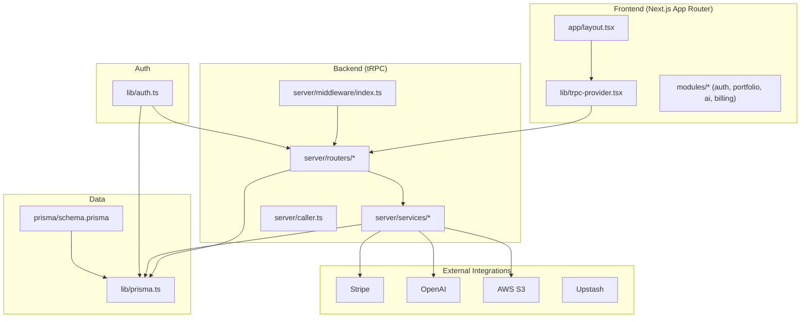
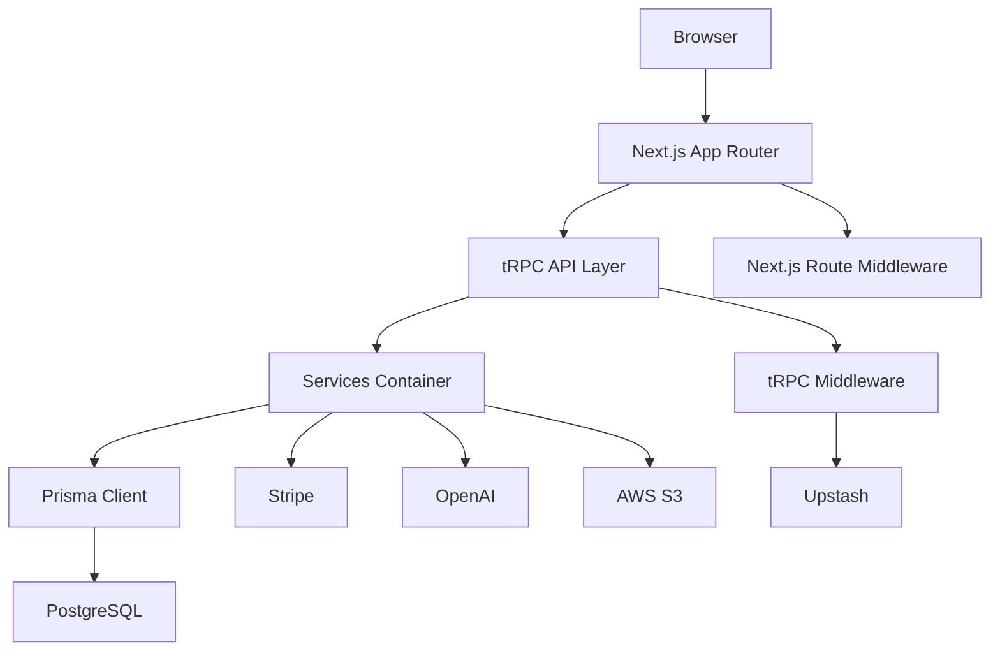
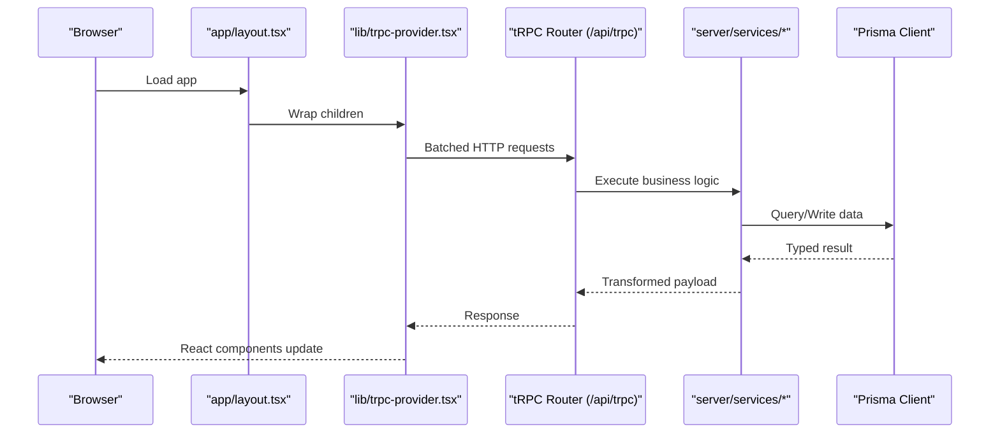
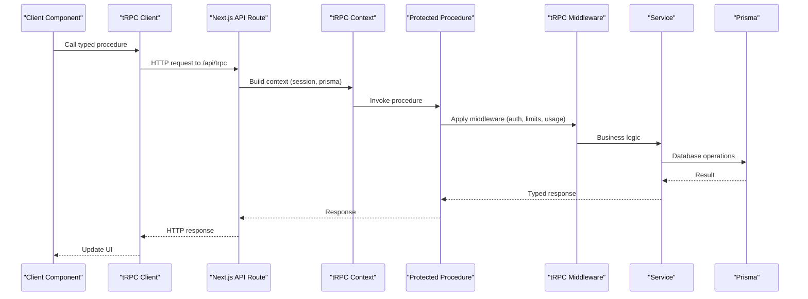
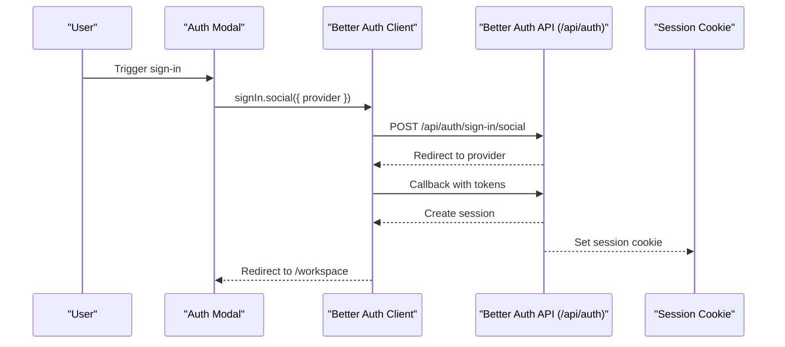
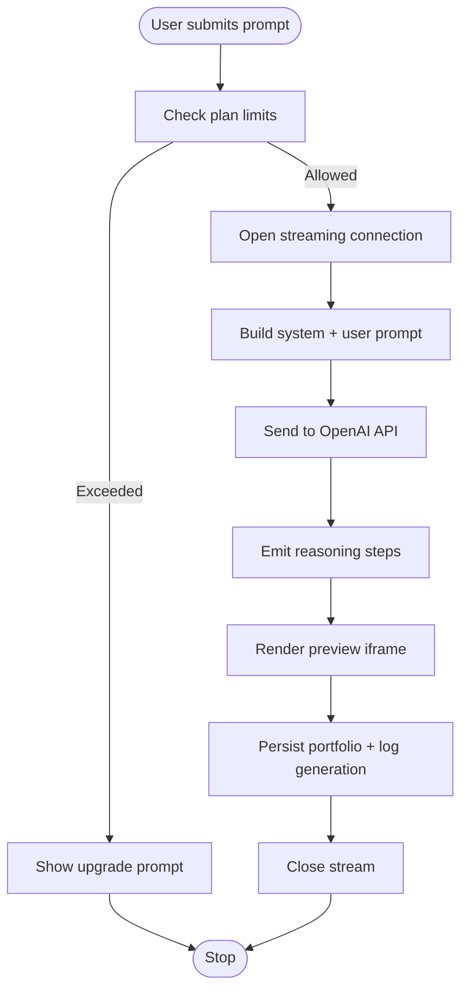
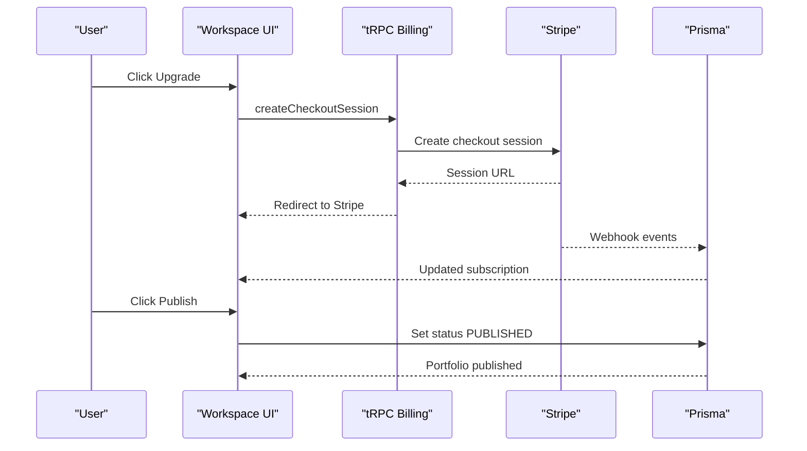
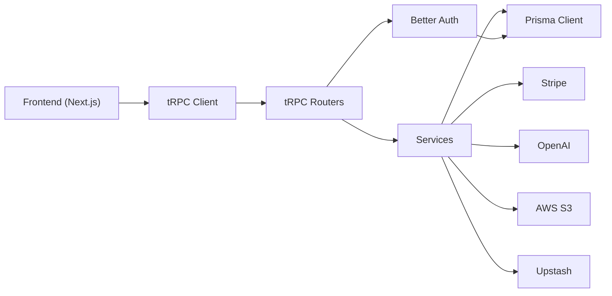
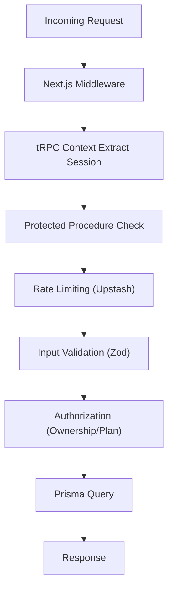

# System Design

<cite>
**Referenced Files in This Document**
- [README.md](file://README.md)
- [package.json](file://package.json)
- [next.config.ts](file://next.config.ts)
- [prisma/schema.prisma](file://prisma/schema.prisma)
- [docs/ARCHITECTURE.md](file://docs/ARCHITECTURE.md)
- [docs/DIAGRAMS.md](file://docs/DIAGRAMS.md)
- [server/trpc.ts](file://server/trpc.ts)
- [server/caller.ts](file://server/caller.ts)
- [middleware.ts](file://middleware.ts)
- [server/middleware/index.ts](file://server/middleware/index.ts)
- [lib/auth.ts](file://lib/auth.ts)
- [lib/prisma.ts](file://lib/prisma.ts)
- [lib/trpc-provider.tsx](file://lib/trpc-provider.tsx)
- [app/layout.tsx](file://app/layout.tsx)
- [modules/auth/index.ts](file://modules/auth/index.ts)
- [modules/portfolio/index.ts](file://modules/portfolio/index.ts)
- [modules/ai/index.ts](file://modules/ai/index.ts)
- [modules/billing/index.ts](file://modules/billing/index.ts)
</cite>

## Table of Contents
1. [Introduction](#introduction)
2. [Project Structure](#project-structure)
3. [Core Components](#core-components)
4. [Architecture Overview](#architecture-overview)
5. [Detailed Component Analysis](#detailed-component-analysis)
6. [Dependency Analysis](#dependency-analysis)
7. [Performance Considerations](#performance-considerations)
8. [Security Architecture](#security-architecture)
9. [Scalability and Deployment](#scalability-and-deployment)
10. [Troubleshooting Guide](#troubleshooting-guide)
11. [Conclusion](#conclusion)

## Introduction
Smartfolio is an enterprise-grade SaaS application designed to generate AI-powered portfolio websites. It follows a modular monolith architecture built on Next.js 16 with the App Router, delivering a unified codebase that scales horizontally while maintaining clear separation of concerns across frontend, backend, and database layers. The system emphasizes type-safe APIs via tRPC, secure authentication with Better Auth, real-time AI generation with streaming, subscription-based billing via Stripe, and robust operational observability.

## Project Structure
Smartfolio organizes functionality into cohesive layers and feature modules:
- Frontend (Next.js App Router):
  - Pages and layouts under app/
  - UI primitives and shared layouts under components/
  - Feature-scoped modules under modules/
- Backend:
  - tRPC routers under server/routers/
  - Business logic services under server/services/
  - Shared middleware under server/middleware/
  - Server-side caller under server/caller.ts
- Data:
  - Prisma schema under prisma/schema.prisma
  - Prisma client initialization under lib/prisma.ts
- Authentication:
  - Better Auth configuration under lib/auth.ts
- Cross-cutting:
  - tRPC provider under lib/trpc-provider.tsx
  - Application-wide middleware under middleware.ts



**Diagram sources**
- [app/layout.tsx](file://app/layout.tsx#L21-L35)
- [lib/trpc-provider.tsx](file://lib/trpc-provider.tsx#L18-L49)
- [server/routers/_app.ts](file://server/routers/_app.ts)
- [server/services/index.ts](file://server/services/index.ts)
- [server/middleware/index.ts](file://server/middleware/index.ts#L1-L153)
- [server/caller.ts](file://server/caller.ts#L1-L7)
- [lib/prisma.ts](file://lib/prisma.ts#L1-L14)
- [lib/auth.ts](file://lib/auth.ts#L1-L25)
- [prisma/schema.prisma](file://prisma/schema.prisma#L1-L230)

**Section sources**
- [README.md](file://README.md#L1-L58)
- [docs/ARCHITECTURE.md](file://docs/ARCHITECTURE.md#L15-L67)
- [docs/DIAGRAMS.md](file://docs/DIAGRAMS.md#L3-L67)

## Core Components
- Frontend Provider and Data Layer:
  - tRPC provider initializes a client with batching and SuperJSON serialization, integrates with React Query for caching and refetching, and wraps the app tree in app/layout.tsx.
- Authentication:
  - Better Auth manages email/password and OAuth with Google/GitHub, stores sessions, and integrates with Prisma adapter.
- Backend API:
  - tRPC context attaches session and Prisma client to every request; protected procedures enforce authentication; transformers enable safe serialization of complex types.
- Services:
  - Singleton service container orchestrates OpenAI, Stripe, email, and S3 integrations; middleware enforces rate limits, subscription status, admin roles, and usage quotas.
- Database:
  - Prisma 6 with PostgreSQL defines models for Users, Accounts, Sessions, Portfolios, Sections, Analytics, Templates, Subscriptions, Payments, and AI generations.

**Section sources**
- [lib/trpc-provider.tsx](file://lib/trpc-provider.tsx#L1-L50)
- [app/layout.tsx](file://app/layout.tsx#L1-L36)
- [lib/auth.ts](file://lib/auth.ts#L1-L25)
- [server/trpc.ts](file://server/trpc.ts#L1-L61)
- [server/middleware/index.ts](file://server/middleware/index.ts#L1-L153)
- [lib/prisma.ts](file://lib/prisma.ts#L1-L14)
- [prisma/schema.prisma](file://prisma/schema.prisma#L1-L230)

## Architecture Overview
Smartfolio employs a modular monolith with clear boundaries:
- Frontend boundary: Next.js App Router pages and components, with tRPC hooks for data fetching and mutations.
- Backend boundary: tRPC routers expose typed procedures; middleware enforces auth, rate limits, and usage checks; services encapsulate external integrations.
- Database boundary: Prisma client abstracts PostgreSQL operations with strongly-typed models and relations.
- External integration boundary: Stripe for billing, OpenAI for AI generation, AWS S3 for storage, Upstash for rate limiting.



**Diagram sources**
- [middleware.ts](file://middleware.ts#L1-L95)
- [server/trpc.ts](file://server/trpc.ts#L1-L61)
- [server/middleware/index.ts](file://server/middleware/index.ts#L1-L153)
- [server/services/index.ts](file://server/services/index.ts)
- [lib/prisma.ts](file://lib/prisma.ts#L1-L14)
- [prisma/schema.prisma](file://prisma/schema.prisma#L1-L230)

**Section sources**
- [docs/ARCHITECTURE.md](file://docs/ARCHITECTURE.md#L70-L111)
- [docs/DIAGRAMS.md](file://docs/DIAGRAMS.md#L3-L67)

## Detailed Component Analysis

### Frontend: App Router and Providers
- Root layout composes the tRPC provider, enabling all pages to consume typed queries and mutations.
- The provider sets up batching, caching, and serialization for efficient client-server communication.



**Diagram sources**
- [app/layout.tsx](file://app/layout.tsx#L21-L35)
- [lib/trpc-provider.tsx](file://lib/trpc-provider.tsx#L18-L49)
- [server/routers/_app.ts](file://server/routers/_app.ts)
- [lib/prisma.ts](file://lib/prisma.ts#L1-L14)

**Section sources**
- [app/layout.tsx](file://app/layout.tsx#L1-L36)
- [lib/trpc-provider.tsx](file://lib/trpc-provider.tsx#L1-L50)

### Backend: tRPC API and Middleware
- Context creation extracts Better Auth session and attaches Prisma client.
- Protected procedures enforce authentication; middleware can enforce rate limits, subscription status, admin roles, and usage quotas.
- Server-side caller enables direct invocation of tRPC procedures from server components without HTTP overhead.



**Diagram sources**
- [server/trpc.ts](file://server/trpc.ts#L12-L61)
- [server/middleware/index.ts](file://server/middleware/index.ts#L13-L152)
- [server/caller.ts](file://server/caller.ts#L1-L7)
- [lib/prisma.ts](file://lib/prisma.ts#L1-L14)

**Section sources**
- [server/trpc.ts](file://server/trpc.ts#L1-L61)
- [server/middleware/index.ts](file://server/middleware/index.ts#L1-L153)
- [server/caller.ts](file://server/caller.ts#L1-L7)

### Database: Prisma Models and Relationships
- Authentication models: User, Account, Session, Verification.
- Portfolio models: Portfolio, PortfolioSection, PortfolioAnalytics.
- Builder models: Template.
- Billing models: Subscription, Payment.
- AI models: AIGeneration.
- Relationships emphasize ownership and analytics.

```mermaid
erDiagram
USER {
string id PK
string email UK
string name
boolean emailVerified
string image
string role
datetime createdAt
datetime updatedAt
}
ACCOUNT {
string id PK
string userId FK
string providerId
string accountId
string accessToken
string refreshToken
datetime accessTokenExpiresAt
datetime refreshTokenExpiresAt
string scope
datetime createdAt
datetime updatedAt
}
SESSION {
string id PK
string token UK
string userId FK
datetime expiresAt
string ipAddress
string userAgent
datetime createdAt
datetime updatedAt
}
VERIFICATION {
string id PK
string identifier
string value
datetime expiresAt
datetime createdAt
datetime updatedAt
}
PORTFOLIO {
string id PK
string userId FK
string title
string slug UK
string description
string theme
string status
string customDomain
string seoTitle
string seoDescription
string favicon
boolean published
datetime publishedAt
datetime createdAt
datetime updatedAt
}
PORTFOLIO_SECTION {
string id PK
string portfolioId FK
string type
string title
json content
int order
boolean visible
datetime createdAt
datetime updatedAt
}
PORTFOLIO_ANALYTICS {
string id PK
string portfolioId FK
datetime date
int views
int uniqueVisitors
int avgTimeOnSite
json topPages
json referrers
}
TEMPLATE {
string id PK
string name
string description
string category
string thumbnail
json blocks
string theme
boolean isPremium
datetime createdAt
datetime updatedAt
}
SUBSCRIPTION {
string id PK
string userId UK FK
string plan
string status
string stripeCustomerId
string stripeSubscriptionId
string stripePriceId
datetime currentPeriodStart
datetime currentPeriodEnd
boolean cancelAtPeriodEnd
datetime trialEnd
datetime createdAt
datetime updatedAt
}
PAYMENT {
string id PK
string userId FK
string subscriptionId FK
string stripePaymentIntentId UK
int amount
string currency
string status
string description
datetime createdAt
}
AIGENERATION {
string id PK
string userId FK
string type
string prompt
string response
int tokensUsed
string provider
datetime createdAt
}
USER ||--o{ ACCOUNT : "has"
USER ||--o{ SESSION : "has"
USER ||--o{ PORTFOLIO : "owns"
USER ||--o{ SUBSCRIPTION : "has"
USER ||--o{ PAYMENT : "makes"
USER ||--o{ AIGENERATION : "generated"
PORTFOLIO ||--o{ PORTFOLIO_SECTION : "contains"
PORTFOLIO ||--|| PORTFOLIO_ANALYTICS : "analytics"
SUBSCRIPTION ||--o{ PAYMENT : "has"
```

**Diagram sources**
- [prisma/schema.prisma](file://prisma/schema.prisma#L17-L229)

**Section sources**
- [prisma/schema.prisma](file://prisma/schema.prisma#L1-L230)

### Authentication: Better Auth Integration
- Configures email/password and OAuth providers with Prisma adapter.
- Provides session management and CSRF protection.
- Middleware validates sessions and redirects unauthorized users.



**Diagram sources**
- [lib/auth.ts](file://lib/auth.ts#L1-L25)
- [middleware.ts](file://middleware.ts#L28-L81)

**Section sources**
- [lib/auth.ts](file://lib/auth.ts#L1-L25)
- [middleware.ts](file://middleware.ts#L1-L95)

### AI Generation Pipeline
- Streams structured portfolio JSON from OpenAI with step-by-step reasoning.
- Enforces plan-based usage limits and logs generations with token accounting.



**Diagram sources**
- [server/middleware/index.ts](file://server/middleware/index.ts#L91-L152)
- [server/services/ai.ts](file://server/services/ai.ts)
- [prisma/schema.prisma](file://prisma/schema.prisma#L214-L229)

**Section sources**
- [docs/ARCHITECTURE.md](file://docs/ARCHITECTURE.md#L161-L222)
- [docs/DIAGRAMS.md](file://docs/DIAGRAMS.md#L142-L186)

### Billing and Publishing
- Stripe integration for checkout, billing portal, and webhooks.
- Publishing pipeline generates static assets and serves standalone portfolio pages.



**Diagram sources**
- [docs/ARCHITECTURE.md](file://docs/ARCHITECTURE.md#L241-L267)
- [docs/DIAGRAMS.md](file://docs/DIAGRAMS.md#L285-L322)
- [server/services/stripe.ts](file://server/services/stripe.ts)
- [prisma/schema.prisma](file://prisma/schema.prisma#L172-L208)

**Section sources**
- [docs/ARCHITECTURE.md](file://docs/ARCHITECTURE.md#L241-L267)
- [docs/DIAGRAMS.md](file://docs/DIAGRAMS.md#L285-L322)

## Dependency Analysis
- Internal dependencies:
  - Frontend depends on tRPC provider and modules.
  - tRPC routers depend on services and Prisma.
  - Services depend on external SDKs and Prisma.
- External dependencies:
  - Next.js 16, React 19, TypeScript, Tailwind CSS, tRPC 11, Prisma 6, Better Auth 1.4, OpenAI SDK, Stripe SDK, AWS S3 SDK, Upstash, Nodemailer, SuperJSON, Zod.



**Diagram sources**
- [package.json](file://package.json#L16-L38)
- [lib/trpc-provider.tsx](file://lib/trpc-provider.tsx#L1-L50)
- [server/routers/_app.ts](file://server/routers/_app.ts)
- [server/services/index.ts](file://server/services/index.ts)
- [lib/prisma.ts](file://lib/prisma.ts#L1-L14)
- [lib/auth.ts](file://lib/auth.ts#L1-L25)

**Section sources**
- [package.json](file://package.json#L1-L52)
- [docs/ARCHITECTURE.md](file://docs/ARCHITECTURE.md#L343-L363)

## Performance Considerations
- Client-side:
  - Batching and caching via tRPC + React Query reduce network overhead.
  - SuperJSON enables efficient serialization of complex types.
- Server-side:
  - Server-side caller eliminates HTTP overhead for internal calls.
  - Middleware short-circuits unauthorized or rate-limited requests.
- Database:
  - Indexes on frequently queried fields (email, slug, status, timestamps) improve query performance.
  - Prisma client configured with appropriate logging levels per environment.
- Streaming:
  - AI generation streams progress to the client incrementally, improving perceived performance.

[No sources needed since this section provides general guidance]

## Security Architecture
- Multi-layered defense:
  - Next.js route middleware protects routes and redirects unauthenticated users.
  - tRPC context extracts session; protected procedures reject unauthorized calls.
  - Rate limiting via Upstash prevents abuse.
  - Input validation with Zod on all tRPC inputs.
  - Authorization checks enforce ownership and subscription status.
  - Stripe webhook signatures validated before processing.
  - Content sanitization for AI-generated HTML in published portfolios.



**Diagram sources**
- [middleware.ts](file://middleware.ts#L44-L81)
- [server/trpc.ts](file://server/trpc.ts#L50-L60)
- [server/middleware/index.ts](file://server/middleware/index.ts#L13-L152)
- [server/services/index.ts](file://server/services/index.ts)

**Section sources**
- [docs/ARCHITECTURE.md](file://docs/ARCHITECTURE.md#L270-L298)
- [docs/DIAGRAMS.md](file://docs/DIAGRAMS.md#L387-L438)

## Scalability and Deployment
- Horizontal scaling:
  - Next.js App Router supports server components and streaming; tRPC’s batching reduces latency.
  - Database can scale with PostgreSQL-compatible providers; Prisma supports connection pooling.
- Infrastructure:
  - Recommended PostgreSQL provider for serverless environments.
  - External services (Stripe, OpenAI, S3, Upstash) provide managed scalability.
- Deployment:
  - Vercel platform recommended for Next.js deployments with environment variables for Better Auth, Stripe, and AWS credentials.

[No sources needed since this section provides general guidance]

## Troubleshooting Guide
- Authentication issues:
  - Verify Better Auth environment variables and session cookie presence.
  - Confirm middleware redirects to sign-in when unauthenticated.
- tRPC errors:
  - Check protected procedure enforcement and context session availability.
  - Inspect Zod error formatting for invalid inputs.
- Database connectivity:
  - Ensure DATABASE_URL is set and Prisma client connects without errors.
- Rate limiting:
  - Confirm Upstash configuration and user ID-based keys.
- Billing webhooks:
  - Validate Stripe webhook signatures and event handling logic.

**Section sources**
- [middleware.ts](file://middleware.ts#L1-L95)
- [server/trpc.ts](file://server/trpc.ts#L1-L61)
- [server/middleware/index.ts](file://server/middleware/index.ts#L1-L153)
- [lib/prisma.ts](file://lib/prisma.ts#L1-L14)
- [lib/auth.ts](file://lib/auth.ts#L1-L25)

## Conclusion
Smartfolio’s modular monolith architecture balances simplicity and scalability. The combination of Next.js 16, tRPC, Prisma, Better Auth, and external integrations delivers a robust, type-safe, and secure platform for AI-powered portfolio generation. Clear separation of concerns across frontend, backend, and database layers, coupled with strong security and performance practices, positions the system for growth and reliable operations.