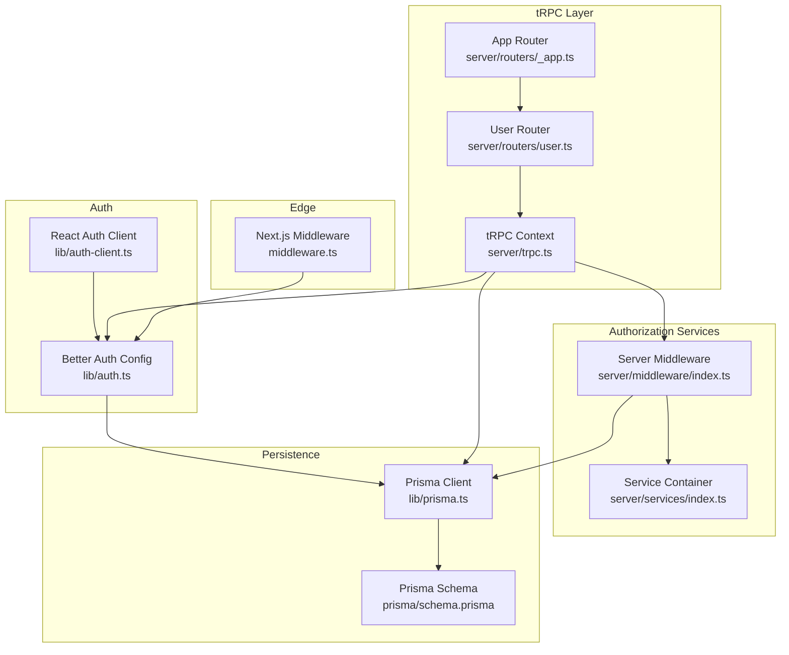
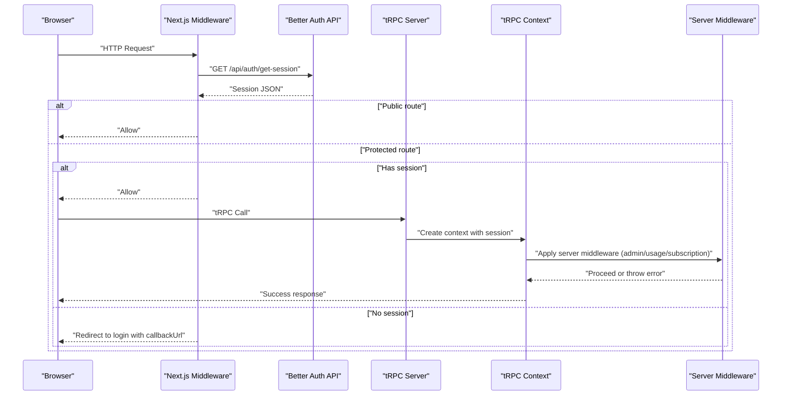
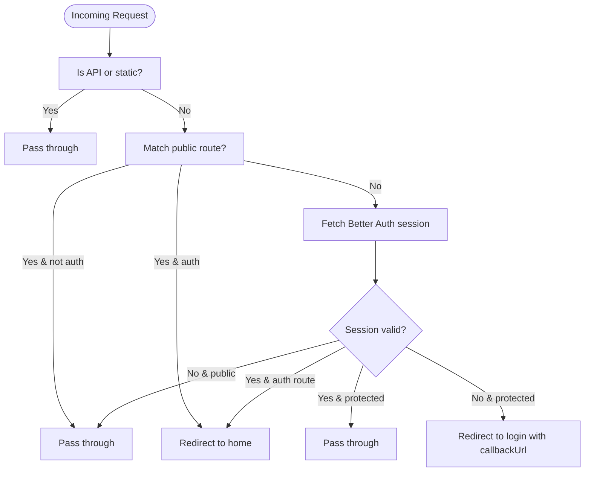
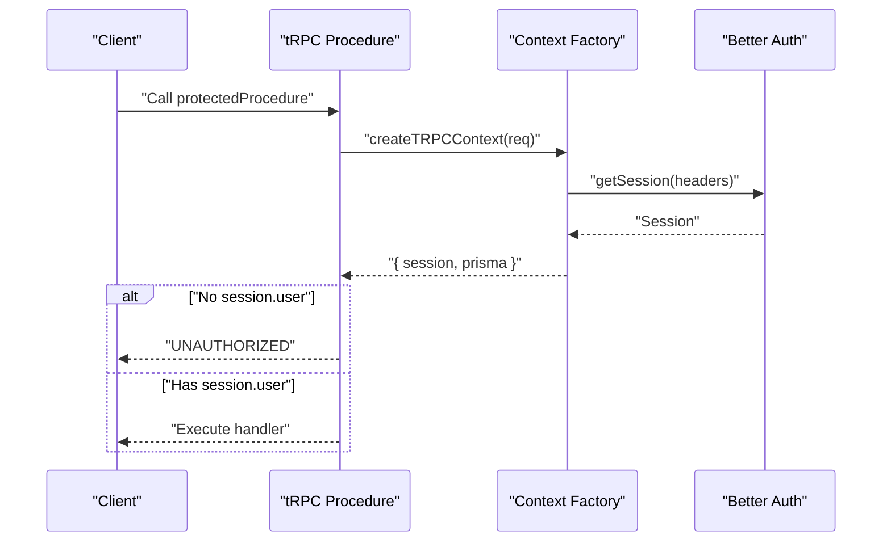
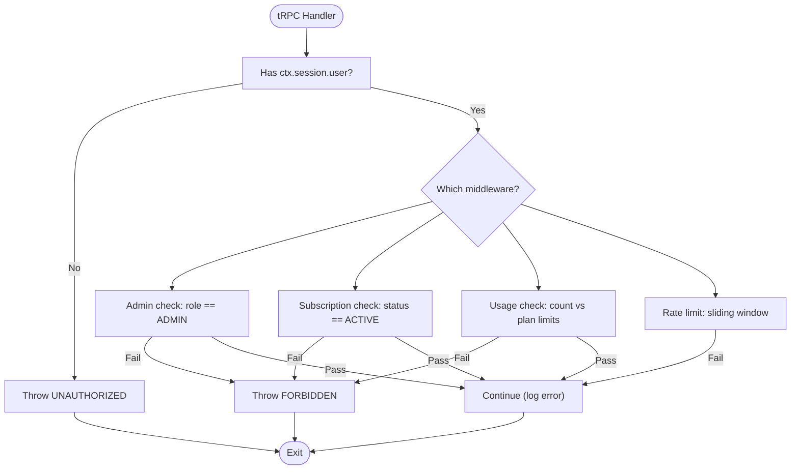
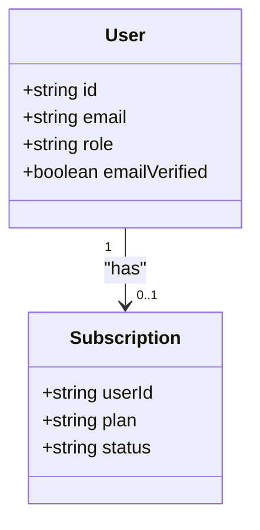
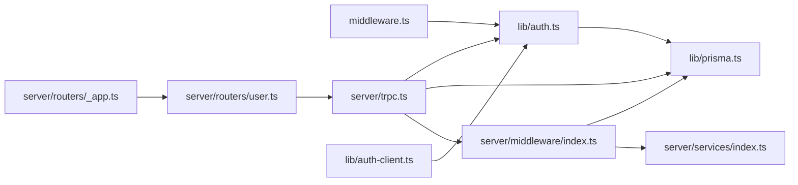

# Access Control and Authorization

<cite>
**Referenced Files in This Document**
- [middleware.ts](file://middleware.ts)
- [lib/auth.ts](file://lib/auth.ts)
- [lib/auth-client.ts](file://lib/auth-client.ts)
- [server/trpc.ts](file://server/trpc.ts)
- [server/middleware/index.ts](file://server/middleware/index.ts)
- [modules/auth/constants.ts](file://modules/auth/constants.ts)
- [modules/auth/hooks.ts](file://modules/auth/hooks.ts)
- [modules/auth/utils.ts](file://modules/auth/utils.ts)
- [server/routers/_app.ts](file://server/routers/_app.ts)
- [server/routers/user.ts](file://server/routers/user.ts)
- [server/services/index.ts](file://server/services/index.ts)
- [lib/prisma.ts](file://lib/prisma.ts)
- [prisma/schema.prisma](file://prisma/schema.prisma)
</cite>

## Table of Contents
1. [Introduction](#introduction)
2. [Project Structure](#project-structure)
3. [Core Components](#core-components)
4. [Architecture Overview](#architecture-overview)
5. [Detailed Component Analysis](#detailed-component-analysis)
6. [Dependency Analysis](#dependency-analysis)
7. [Performance Considerations](#performance-considerations)
8. [Troubleshooting Guide](#troubleshooting-guide)
9. [Conclusion](#conclusion)
10. [Appendices](#appendices)

## Introduction
This document explains the access control and authorization mechanisms in the Smartfolio application. It covers:
- Role-based access control (RBAC) using a user role field
- Route protection strategies at the Next.js middleware level
- tRPC-based authorization with protected procedures and middleware
- Resource-level permissions validated against user roles and subscriptions
- Practical patterns for decorators, conditional rendering, and permission-based navigation
- Security considerations and guidance for extending authorization rules

## Project Structure
The authorization stack spans frontend hooks, backend middleware, tRPC procedures, and database models:
- Next.js middleware enforces route-level protection and redirects
- tRPC context injects session data; protected procedures enforce authentication
- Server middleware provides additional authorization layers (admin, subscription, usage, rate limits)
- Better Auth manages authentication and session retrieval
- Prisma models define user roles and related resources

**Diagram sources**
- [middleware.ts](file://middleware.ts#L44-L81)
- [server/trpc.ts](file://server/trpc.ts#L12-L20)
- [server/routers/_app.ts](file://server/routers/_app.ts#L12-L18)
- [server/routers/user.ts](file://server/routers/user.ts#L1-L79)
- [server/middleware/index.ts](file://server/middleware/index.ts#L13-L152)
- [server/services/index.ts](file://server/services/index.ts#L9-L118)
- [lib/auth.ts](file://lib/auth.ts#L5-L24)
- [lib/auth-client.ts](file://lib/auth-client.ts#L1-L8)
- [lib/prisma.ts](file://lib/prisma.ts#L1-L14)
- [prisma/schema.prisma](file://prisma/schema.prisma#L17-L36)

**Section sources**
- [middleware.ts](file://middleware.ts#L44-L81)
- [server/trpc.ts](file://server/trpc.ts#L12-L20)
- [server/middleware/index.ts](file://server/middleware/index.ts#L13-L152)
- [lib/auth.ts](file://lib/auth.ts#L5-L24)
- [lib/auth-client.ts](file://lib/auth-client.ts#L1-L8)
- [lib/prisma.ts](file://lib/prisma.ts#L1-L14)
- [prisma/schema.prisma](file://prisma/schema.prisma#L17-L36)

## Core Components
- Next.js Middleware: Defines public/auth routes, validates sessions via Better Auth API, and redirects unauthenticated users or prevents authenticated users from accessing auth pages.
- tRPC Context and Protected Procedures: Creates context with session data and defines a protected procedure that throws UNAUTHORIZED when no session exists.
- Server Middleware: Provides reusable authorization middlewares for rate limiting, subscription checks, admin-only access, and usage limits per plan.
- Better Auth: Configures database adapter, email/password, and social providers; exposes client for React hooks.
- Prisma Schema: Declares user role and related entities (subscriptions, portfolios, AI generations).

Key implementation references:
- Route protection and session validation: [middleware.ts](file://middleware.ts#L28-L42)
- Public/auth route lists: [middleware.ts](file://middleware.ts#L5-L21)
- tRPC context and protected procedure: [server/trpc.ts](file://server/trpc.ts#L12-L20), [server/trpc.ts](file://server/trpc.ts#L50-L60)
- Server middleware patterns: [server/middleware/index.ts](file://server/middleware/index.ts#L13-L152)
- User role definition: [prisma/schema.prisma](file://prisma/schema.prisma#L23)

**Section sources**
- [middleware.ts](file://middleware.ts#L5-L21)
- [middleware.ts](file://middleware.ts#L28-L42)
- [server/trpc.ts](file://server/trpc.ts#L12-L20)
- [server/trpc.ts](file://server/trpc.ts#L50-L60)
- [server/middleware/index.ts](file://server/middleware/index.ts#L13-L152)
- [prisma/schema.prisma](file://prisma/schema.prisma#L23)

## Architecture Overview
The authorization pipeline integrates route-level and procedure-level controls:
- Edge routing: Next.js middleware intercepts requests, checks session, and redirects as needed.
- Backend orchestration: tRPC resolves context, applies protected procedures, and invokes server middleware for advanced checks.
- Persistence: Prisma reads user roles and subscription plans to enforce policy decisions.

**Diagram sources**
- [middleware.ts](file://middleware.ts#L44-L81)
- [server/trpc.ts](file://server/trpc.ts#L12-L20)
- [server/middleware/index.ts](file://server/middleware/index.ts#L68-L85)

**Section sources**
- [middleware.ts](file://middleware.ts#L44-L81)
- [server/trpc.ts](file://server/trpc.ts#L12-L20)
- [server/middleware/index.ts](file://server/middleware/index.ts#L68-L85)

## Detailed Component Analysis

### Next.js Middleware Authorization
- Public routes: No session required; served directly.
- Auth routes: Logged-in users are redirected to home; guests can access.
- Protected routes: Require a valid session; otherwise redirect to login with callbackUrl.
- Static/API routes: Skipped to avoid unnecessary overhead.

**Diagram sources**
- [middleware.ts](file://middleware.ts#L44-L81)

**Section sources**
- [middleware.ts](file://middleware.ts#L5-L21)
- [middleware.ts](file://middleware.ts#L28-L42)
- [middleware.ts](file://middleware.ts#L44-L81)

### tRPC Context and Protected Procedures
- Context creation: Retrieves Better Auth session from request headers and attaches it to the tRPC context.
- Protected procedure: Throws UNAUTHORIZED if no session user is present; otherwise proceeds with a safe context copy.

**Diagram sources**
- [server/trpc.ts](file://server/trpc.ts#L12-L20)
- [server/trpc.ts](file://server/trpc.ts#L50-L60)

**Section sources**
- [server/trpc.ts](file://server/trpc.ts#L12-L20)
- [server/trpc.ts](file://server/trpc.ts#L50-L60)

### Server Middleware: RBAC and Policy Enforcement
- Admin-only access: Validates user role equals ADMIN and throws FORBIDDEN otherwise.
- Subscription gating: Requires ACTIVE subscription; otherwise FORBIDDEN.
- Usage limits: Enforces plan-specific caps for portfolios and AI generations per month.
- Rate limiting: Sliding window via Upstash Redis; allows request on failure to minimize impact.

**Diagram sources**
- [server/middleware/index.ts](file://server/middleware/index.ts#L68-L85)
- [server/middleware/index.ts](file://server/middleware/index.ts#L42-L62)
- [server/middleware/index.ts](file://server/middleware/index.ts#L91-L152)
- [server/middleware/index.ts](file://server/middleware/index.ts#L13-L36)

**Section sources**
- [server/middleware/index.ts](file://server/middleware/index.ts#L68-L85)
- [server/middleware/index.ts](file://server/middleware/index.ts#L42-L62)
- [server/middleware/index.ts](file://server/middleware/index.ts#L91-L152)
- [server/middleware/index.ts](file://server/middleware/index.ts#L13-L36)

### Role-Based Access Control (RBAC)
- User model includes a role field with default USER; ADMIN is supported for elevated access.
- Admin middleware enforces ADMIN-only access for sensitive operations.
- Plan-based limits are enforced via subscription status and plan tiers.

**Diagram sources**
- [prisma/schema.prisma](file://prisma/schema.prisma#L17-L36)
- [prisma/schema.prisma](file://prisma/schema.prisma#L172-L191)

**Section sources**
- [prisma/schema.prisma](file://prisma/schema.prisma#L23)
- [prisma/schema.prisma](file://prisma/schema.prisma#L172-L191)
- [server/middleware/index.ts](file://server/middleware/index.ts#L75-L84)

### Protected Routes and API Endpoint Authorization
- Protected routes: Enforced by Next.js middleware; redirect unauthenticated users.
- API endpoints: Protected by tRPC protectedProcedure; unauthorized calls receive UNAUTHORIZED.
- Example: User profile queries and mutations are protected; public hello endpoint is not.

References:
- Protected route enforcement: [middleware.ts](file://middleware.ts#L69-L78)
- tRPC protected procedure: [server/trpc.ts](file://server/trpc.ts#L50-L60)
- Protected user endpoints: [server/routers/user.ts](file://server/routers/user.ts#L14-L43)

**Section sources**
- [middleware.ts](file://middleware.ts#L69-L78)
- [server/trpc.ts](file://server/trpc.ts#L50-L60)
- [server/routers/user.ts](file://server/routers/user.ts#L14-L43)

### Dynamic Permission Checks and Conditional Rendering
- Frontend session hook: Exposes user/session state for conditional UI rendering and navigation guards.
- Example patterns:
  - Conditional rendering based on isAuthenticated
  - Protected route guards using useRequireAuth
  - Permission-aware navigation items gated by user role

References:
- Session hook: [modules/auth/hooks.ts](file://modules/auth/hooks.ts#L9-L18)
- Auth requirement guard: [modules/auth/hooks.ts](file://modules/auth/hooks.ts#L20-L28)

**Section sources**
- [modules/auth/hooks.ts](file://modules/auth/hooks.ts#L9-L18)
- [modules/auth/hooks.ts](file://modules/auth/hooks.ts#L20-L28)

### Practical Examples and Patterns
- Access control decorators (patterns):
  - Protected procedure decorator: [server/trpc.ts](file://server/trpc.ts#L50-L60)
  - Admin-only decorator: [server/middleware/index.ts](file://server/middleware/index.ts#L68-L85)
  - Subscription gate: [server/middleware/index.ts](file://server/middleware/index.ts#L42-L62)
  - Usage limit decorator: [server/middleware/index.ts](file://server/middleware/index.ts#L91-L152)
  - Rate limit decorator: [server/middleware/index.ts](file://server/middleware/index.ts#L13-L36)
- Conditional rendering and navigation:
  - Hook usage: [modules/auth/hooks.ts](file://modules/auth/hooks.ts#L9-L18)
  - Auth constants for route groups: [modules/auth/constants.ts](file://modules/auth/constants.ts#L5-L24)

**Section sources**
- [server/trpc.ts](file://server/trpc.ts#L50-L60)
- [server/middleware/index.ts](file://server/middleware/index.ts#L68-L85)
- [server/middleware/index.ts](file://server/middleware/index.ts#L42-L62)
- [server/middleware/index.ts](file://server/middleware/index.ts#L91-L152)
- [server/middleware/index.ts](file://server/middleware/index.ts#L13-L36)
- [modules/auth/hooks.ts](file://modules/auth/hooks.ts#L9-L18)
- [modules/auth/constants.ts](file://modules/auth/constants.ts#L5-L24)

## Dependency Analysis
- Route protection depends on Better Auth session retrieval and route classification.
- tRPC protected procedures depend on tRPC context creation and Better Auth session.
- Server middleware depends on Prisma for user and subscription data and optionally Upstash Redis for rate limiting.
- Service container encapsulates Prisma and external services for reuse.

**Diagram sources**
- [middleware.ts](file://middleware.ts#L44-L81)
- [server/trpc.ts](file://server/trpc.ts#L12-L20)
- [server/middleware/index.ts](file://server/middleware/index.ts#L13-L152)
- [server/routers/_app.ts](file://server/routers/_app.ts#L12-L18)
- [server/routers/user.ts](file://server/routers/user.ts#L1-L79)
- [lib/auth.ts](file://lib/auth.ts#L5-L24)
- [lib/auth-client.ts](file://lib/auth-client.ts#L1-L8)
- [lib/prisma.ts](file://lib/prisma.ts#L1-L14)
- [server/services/index.ts](file://server/services/index.ts#L9-L118)

**Section sources**
- [middleware.ts](file://middleware.ts#L44-L81)
- [server/trpc.ts](file://server/trpc.ts#L12-L20)
- [server/middleware/index.ts](file://server/middleware/index.ts#L13-L152)
- [server/routers/_app.ts](file://server/routers/_app.ts#L12-L18)
- [server/routers/user.ts](file://server/routers/user.ts#L1-L79)
- [lib/auth.ts](file://lib/auth.ts#L5-L24)
- [lib/auth-client.ts](file://lib/auth-client.ts#L1-L8)
- [lib/prisma.ts](file://lib/prisma.ts#L1-L14)
- [server/services/index.ts](file://server/services/index.ts#L9-L118)

## Performance Considerations
- Minimize session checks: Next.js middleware avoids validating sessions for public routes and skips API/static routes.
- Efficient tRPC context: Session retrieval occurs once per request and is reused across procedures.
- Rate limiting resilience: On Upstash errors, requests are allowed to prevent cascading failures.
- Database load: Server middleware queries user and subscription records per request; consider caching for high-traffic endpoints.

[No sources needed since this section provides general guidance]

## Troubleshooting Guide
Common issues and resolutions:
- Unauthorized access errors: Ensure the request includes a valid Better Auth session; protected procedures throw UNAUTHORIZED when session.user is missing.
- Forbidden access errors: Verify user role for admin-only endpoints and subscription status for premium features.
- Rate limit exceeded: Confirm Upstash Redis configuration and consider adjusting sliding window parameters.
- Session mismatch: Validate cookies and Better Auth base URLs on both client and server.

**Section sources**
- [server/trpc.ts](file://server/trpc.ts#L50-L60)
- [server/middleware/index.ts](file://server/middleware/index.ts#L13-L36)
- [server/middleware/index.ts](file://server/middleware/index.ts#L42-L62)
- [server/middleware/index.ts](file://server/middleware/index.ts#L68-L85)

## Conclusion
The Smartfolio application implements a layered authorization strategy:
- Route-level protection via Next.js middleware
- Procedure-level protection via tRPC protected procedures
- Policy enforcement via server middleware (RBAC, subscriptions, usage, rate limits)
- Strong session management through Better Auth and Prisma

This design provides clear separation of concerns, predictable error handling, and extensible patterns for future authorization enhancements.

[No sources needed since this section summarizes without analyzing specific files]

## Appendices

### Appendix A: Route Classification and Constants
- Public routes: Home, pricing, about, contact
- Auth routes: Sign-in, sign-up
- Protected routes: Portfolios, billing

**Section sources**
- [middleware.ts](file://middleware.ts#L5-L21)
- [modules/auth/constants.ts](file://modules/auth/constants.ts#L5-L24)

### Appendix B: User Role and Subscription Model
- User role: USER (default), ADMIN
- Subscription plan: FREE, PRO, ENTERPRISE
- Status: ACTIVE, CANCELED, PAST_DUE, TRIALING

**Section sources**
- [prisma/schema.prisma](file://prisma/schema.prisma#L23)
- [prisma/schema.prisma](file://prisma/schema.prisma#L172-L191)