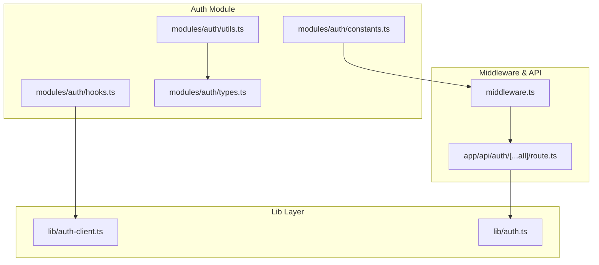
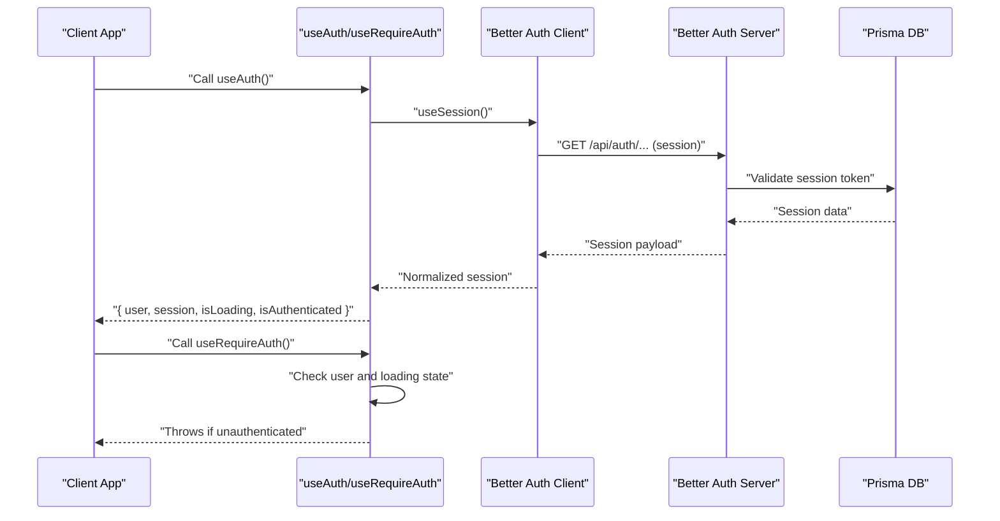
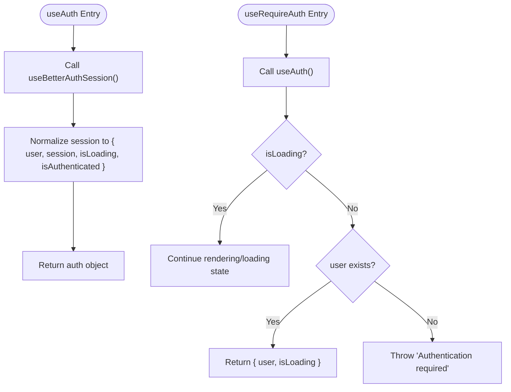
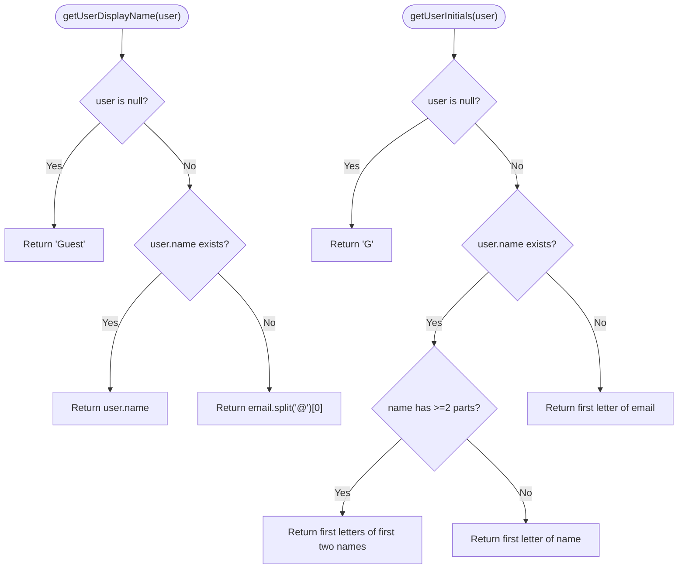
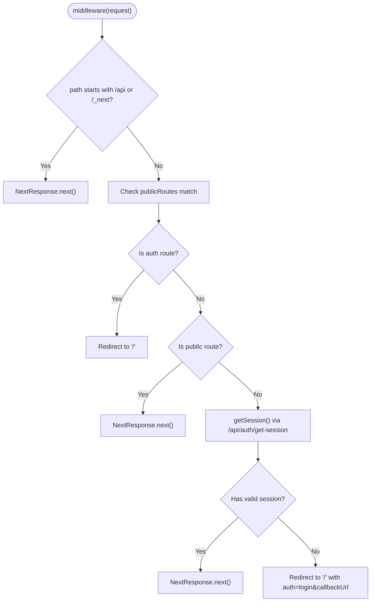
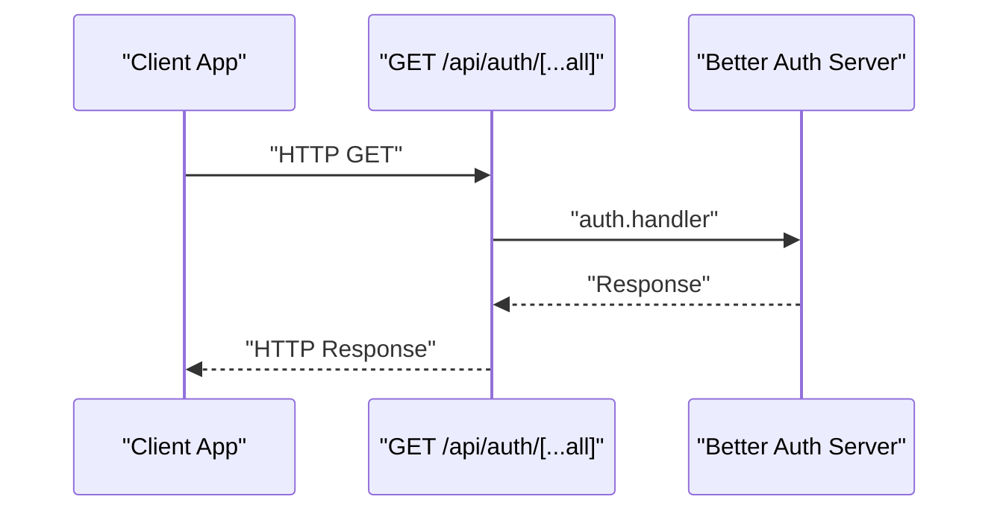
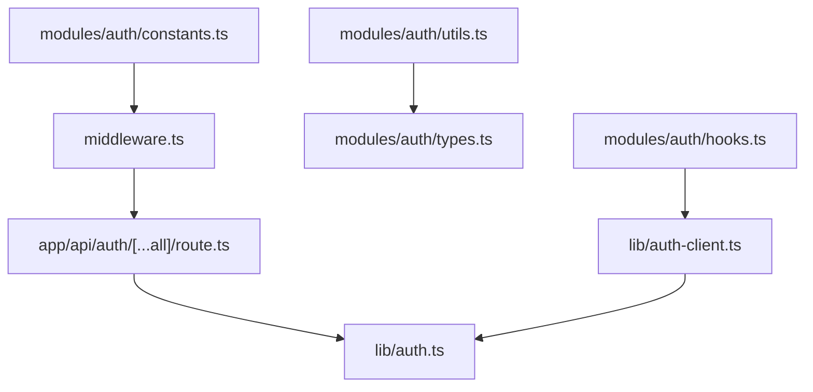

# Authentication Hooks and Utilities

<cite>
**Referenced Files in This Document**
- [modules/auth/hooks.ts](file://modules/auth/hooks.ts)
- [modules/auth/utils.ts](file://modules/auth/utils.ts)
- [modules/auth/types.ts](file://modules/auth/types.ts)
- [modules/auth/constants.ts](file://modules/auth/constants.ts)
- [lib/auth-client.ts](file://lib/auth-client.ts)
- [lib/auth.ts](file://lib/auth.ts)
- [middleware.ts](file://middleware.ts)
- [app/api/auth/[...all]/route.ts](file://app/api/auth/[...all]/route.ts)
- [components/layouts/auth-layout.tsx](file://components/layouts/auth-layout.tsx)
- [app/page.tsx](file://app/page.tsx)
</cite>

## Table of Contents
1. [Introduction](#introduction)
2. [Project Structure](#project-structure)
3. [Core Components](#core-components)
4. [Architecture Overview](#architecture-overview)
5. [Detailed Component Analysis](#detailed-component-analysis)
6. [Dependency Analysis](#dependency-analysis)
7. [Performance Considerations](#performance-considerations)
8. [Troubleshooting Guide](#troubleshooting-guide)
9. [Conclusion](#conclusion)
10. [Appendices](#appendices)

## Introduction
This document provides comprehensive documentation for the authentication-related hooks and utilities in the application. It covers the custom React hooks for authentication state, user session management, and access control, along with utility functions for token manipulation, user data transformation, and authentication helpers. Practical examples demonstrate how to use these hooks and utilities in components, and guidance is provided on performance considerations, memory management, and extending the authentication system.

## Project Structure
Authentication functionality is organized into a dedicated module with clear separation of concerns:
- Custom React hooks for authentication state and access control
- Utility functions for user display and verification helpers
- Type definitions for user, session, credentials, and response structures
- Constants for authentication and protected routes
- Client-side Better Auth integration
- Server-side Better Auth configuration and API handler
- Middleware for route-level authentication gating

**Diagram sources**
- [modules/auth/hooks.ts](file://modules/auth/hooks.ts#L1-L29)
- [modules/auth/utils.ts](file://modules/auth/utils.ts#L1-L29)
- [modules/auth/types.ts](file://modules/auth/types.ts#L1-L36)
- [modules/auth/constants.ts](file://modules/auth/constants.ts#L1-L25)
- [lib/auth-client.ts](file://lib/auth-client.ts#L1-L8)
- [lib/auth.ts](file://lib/auth.ts#L1-L25)
- [middleware.ts](file://middleware.ts#L1-L95)
- [app/api/auth/[...all]/route.ts](file://app/api/auth/[...all]/route.ts#L1-L7)

**Section sources**
- [modules/auth/hooks.ts](file://modules/auth/hooks.ts#L1-L29)
- [modules/auth/utils.ts](file://modules/auth/utils.ts#L1-L29)
- [modules/auth/types.ts](file://modules/auth/types.ts#L1-L36)
- [modules/auth/constants.ts](file://modules/auth/constants.ts#L1-L25)
- [lib/auth-client.ts](file://lib/auth-client.ts#L1-L8)
- [lib/auth.ts](file://lib/auth.ts#L1-L25)
- [middleware.ts](file://middleware.ts#L1-L95)
- [app/api/auth/[...all]/route.ts](file://app/api/auth/[...all]/route.ts#L1-L7)

## Core Components
This section documents the primary authentication hooks and utilities, including their responsibilities, parameters, return values, and usage patterns.

- useAuth
  - Purpose: Centralized hook to access current user session state and loading indicators.
  - Returns: An object containing user, session, isLoading, and isAuthenticated flags.
  - Implementation pattern: Delegates to the Better Auth client session hook and normalizes the result into a concise shape.
  - Typical usage: Wrap components that need to render conditionally based on authentication state.

- useRequireAuth
  - Purpose: Enforces authentication requirement for protected components.
  - Behavior: Throws an error if the user is not authenticated and the session is not pending.
  - Typical usage: Place at the top of protected pages or components to ensure access control.

- Authentication Utilities
  - getUserDisplayName(user): Derives a display-friendly name from a user object, defaulting to "Guest".
  - getUserInitials(user): Generates initials from the user's name or email.
  - isEmailVerified(user): Checks whether the user's email is verified.

- Types
  - User: Defines the user entity with identifiers, profile fields, timestamps, and verification status.
  - Session: Wraps the user and expiration date for session representation.
  - SignInCredentials and SignUpCredentials: Typed shapes for authentication requests.
  - AuthResponse: Standardized response envelope for authentication operations.

- Constants
  - AUTH_ROUTES: Named endpoints for authentication flows.
  - PROTECTED_ROUTES: Routes requiring authenticated access.
  - PUBLIC_ROUTES: Routes accessible without authentication.

**Section sources**
- [modules/auth/hooks.ts](file://modules/auth/hooks.ts#L1-L29)
- [modules/auth/utils.ts](file://modules/auth/utils.ts#L1-L29)
- [modules/auth/types.ts](file://modules/auth/types.ts#L1-L36)
- [modules/auth/constants.ts](file://modules/auth/constants.ts#L1-L25)

## Architecture Overview
The authentication system integrates client-side React hooks with server-side Better Auth. The client uses a Better Auth React client to manage sessions, while the server configures Better Auth with database and social providers. Middleware enforces route-level access control by validating sessions against the server.

**Diagram sources**
- [modules/auth/hooks.ts](file://modules/auth/hooks.ts#L9-L28)
- [lib/auth-client.ts](file://lib/auth-client.ts#L1-L8)
- [lib/auth.ts](file://lib/auth.ts#L1-L25)
- [middleware.ts](file://middleware.ts#L28-L42)

## Detailed Component Analysis

### Authentication Hooks
The hooks module exposes two primary hooks for managing authentication state and enforcing access control.

**Diagram sources**
- [modules/auth/hooks.ts](file://modules/auth/hooks.ts#L9-L28)

**Section sources**
- [modules/auth/hooks.ts](file://modules/auth/hooks.ts#L1-L29)

### Authentication Utilities
Utility functions provide consistent transformations and checks for user data.

**Diagram sources**
- [modules/auth/utils.ts](file://modules/auth/utils.ts#L7-L28)

**Section sources**
- [modules/auth/utils.ts](file://modules/auth/utils.ts#L1-L29)

### Route-Level Access Control
The middleware enforces authentication requirements per route, redirecting unauthenticated users to the login page with a callback URL.

**Diagram sources**
- [middleware.ts](file://middleware.ts#L44-L81)

**Section sources**
- [middleware.ts](file://middleware.ts#L1-L95)

### Client and Server Integration
The client and server communicate through Better Auth endpoints configured in the API route.

**Diagram sources**
- [app/api/auth/[...all]/route.ts](file://app/api/auth/[...all]/route.ts#L1-L7)
- [lib/auth.ts](file://lib/auth.ts#L1-L25)

**Section sources**
- [app/api/auth/[...all]/route.ts](file://app/api/auth/[...all]/route.ts#L1-L7)
- [lib/auth.ts](file://lib/auth.ts#L1-L25)

### Practical Hook Usage Examples
Below are practical usage patterns for the authentication hooks and utilities in components.

- Using useAuth in a layout or page
  - Pattern: Destructure user, session, isLoading, and isAuthenticated from useAuth().
  - Example reference: [modules/auth/hooks.ts](file://modules/auth/hooks.ts#L9-L18)

- Enforcing authentication with useRequireAuth
  - Pattern: Call useRequireAuth() at the top of protected components; handle the thrown error in an error boundary or wrapper.
  - Example reference: [modules/auth/hooks.ts](file://modules/auth/hooks.ts#L20-L28)

- Rendering user display and initials
  - Pattern: Use getUserDisplayName() and getUserInitials() to present user information consistently.
  - Example reference: [modules/auth/utils.ts](file://modules/auth/utils.ts#L7-L24)

- Social sign-in integration
  - Pattern: Use the Better Auth client to initiate social sign-in with callback URLs.
  - Example reference: [app/page.tsx](file://app/page.tsx#L215-L229)

- Auth layout composition
  - Pattern: Wrap authentication forms in a dedicated layout component for consistent styling and structure.
  - Example reference: [components/layouts/auth-layout.tsx](file://components/layouts/auth-layout.tsx#L6-L28)

**Section sources**
- [modules/auth/hooks.ts](file://modules/auth/hooks.ts#L1-L29)
- [modules/auth/utils.ts](file://modules/auth/utils.ts#L1-L29)
- [app/page.tsx](file://app/page.tsx#L215-L229)
- [components/layouts/auth-layout.tsx](file://components/layouts/auth-layout.tsx#L1-L29)

## Dependency Analysis
Authentication relies on a layered architecture connecting client hooks, server configuration, and middleware enforcement.

**Diagram sources**
- [modules/auth/hooks.ts](file://modules/auth/hooks.ts#L1-L29)
- [modules/auth/utils.ts](file://modules/auth/utils.ts#L1-L29)
- [modules/auth/types.ts](file://modules/auth/types.ts#L1-L36)
- [modules/auth/constants.ts](file://modules/auth/constants.ts#L1-L25)
- [lib/auth-client.ts](file://lib/auth-client.ts#L1-L8)
- [middleware.ts](file://middleware.ts#L1-L95)
- [app/api/auth/[...all]/route.ts](file://app/api/auth/[...all]/route.ts#L1-L7)
- [lib/auth.ts](file://lib/auth.ts#L1-L25)

**Section sources**
- [modules/auth/hooks.ts](file://modules/auth/hooks.ts#L1-L29)
- [modules/auth/utils.ts](file://modules/auth/utils.ts#L1-L29)
- [modules/auth/types.ts](file://modules/auth/types.ts#L1-L36)
- [modules/auth/constants.ts](file://modules/auth/constants.ts#L1-L25)
- [lib/auth-client.ts](file://lib/auth-client.ts#L1-L8)
- [middleware.ts](file://middleware.ts#L1-L95)
- [app/api/auth/[...all]/route.ts](file://app/api/auth/[...all]/route.ts#L1-L7)
- [lib/auth.ts](file://lib/auth.ts#L1-L25)

## Performance Considerations
- Minimize re-renders by memoizing derived values from useAuth (e.g., displayName, initials) using useMemo or similar strategies.
- Avoid unnecessary redirects by ensuring middleware conditions are efficient and only trigger session validation when required.
- Use loading states (isLoading) to defer heavy UI work until authentication state is confirmed.
- Keep authentication state normalized and shallow to reduce deep equality checks in downstream components.
- Prefer client-side caching of non-sensitive user data to reduce repeated network calls.

## Troubleshooting Guide
Common issues and resolutions:
- Authentication required errors
  - Cause: useRequireAuth throws when user is missing and loading is complete.
  - Resolution: Ensure proper session handling and guard protected components with the hook.

- Session validation failures
  - Cause: Middleware cannot validate session via the Better Auth API.
  - Resolution: Verify the API endpoint is reachable and the session cookie is present.

- Social sign-in problems
  - Cause: Provider credentials or callback URL misconfiguration.
  - Resolution: Confirm environment variables and callback URLs align with the client configuration.

- Display name or initials not rendering
  - Cause: Missing user data or unexpected null values.
  - Resolution: Use the provided utility functions which include null-safe defaults.

**Section sources**
- [modules/auth/hooks.ts](file://modules/auth/hooks.ts#L20-L28)
- [middleware.ts](file://middleware.ts#L28-L42)
- [app/page.tsx](file://app/page.tsx#L215-L229)
- [modules/auth/utils.ts](file://modules/auth/utils.ts#L7-L24)

## Conclusion
The authentication system provides a clean, modular foundation for managing user sessions, enforcing access control, and transforming user data. The custom hooks simplify common patterns, while utilities ensure consistent user experiences. The integration with Better Auth on both client and server offers scalable session management and robust route-level protection.

## Appendices
- Extending the authentication utilities
  - Add new display helpers by building on existing patterns in the utilities module.
  - Introduce additional typed credential shapes in the types module as needed.

- Creating custom authentication utilities
  - Follow the established patterns for null safety and consistent return values.
  - Export new utilities from the module index for centralized access.

- Best practices for hook usage
  - Always wrap protected components with useRequireAuth.
  - Use useAuth for conditional rendering and feature gating.
  - Leverage middleware for global access control policies.

**Section sources**
- [modules/auth/utils.ts](file://modules/auth/utils.ts#L1-L29)
- [modules/auth/index.ts](file://modules/auth/index.ts#L1-L14)