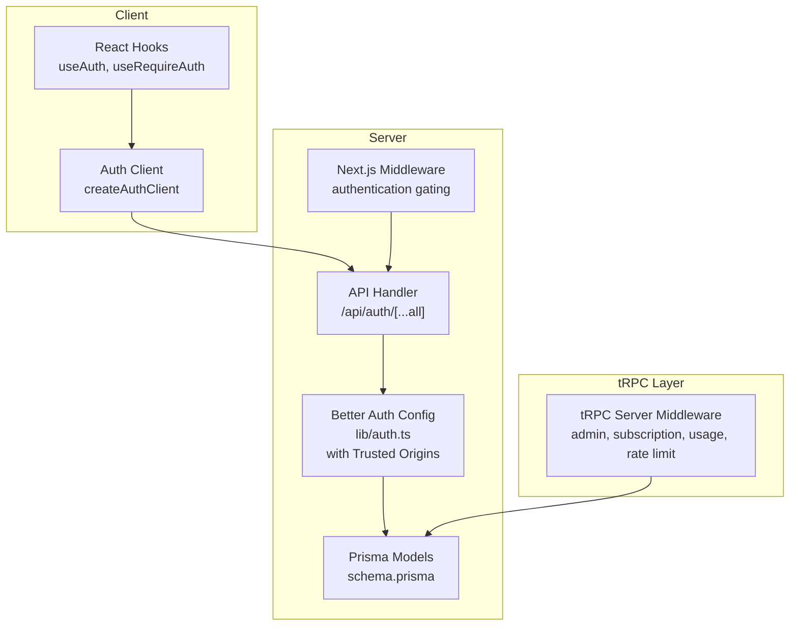
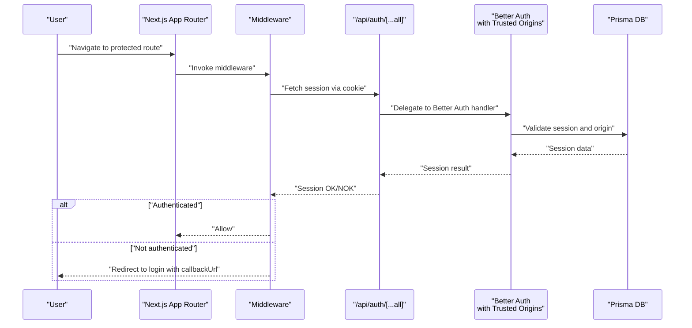
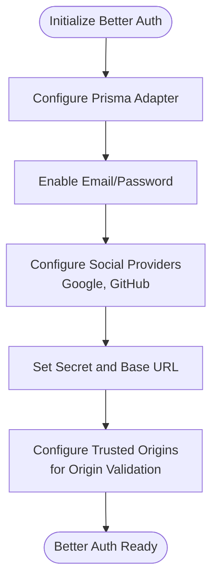
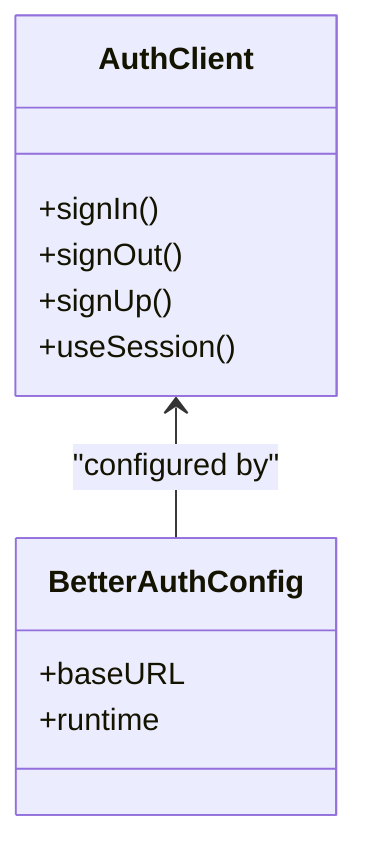
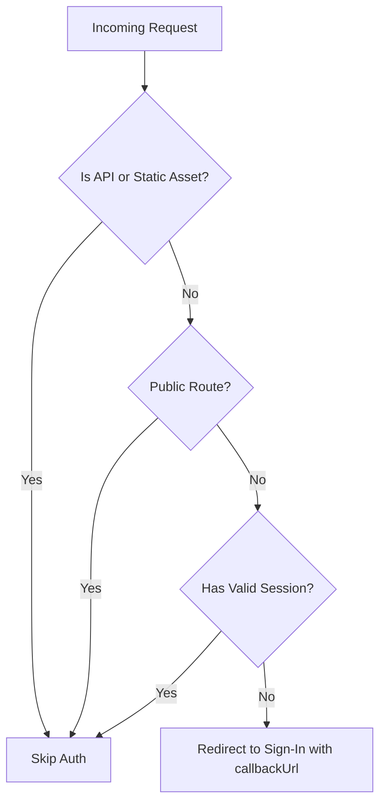
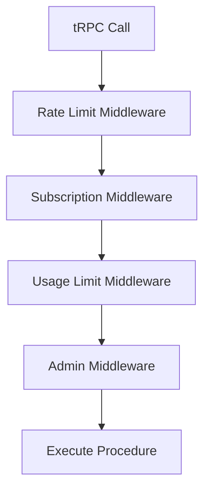
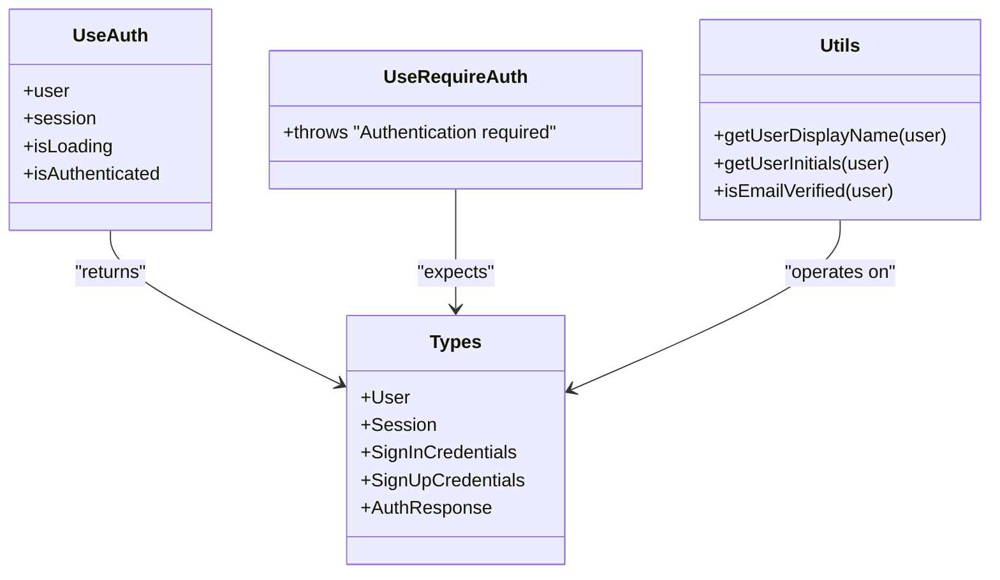
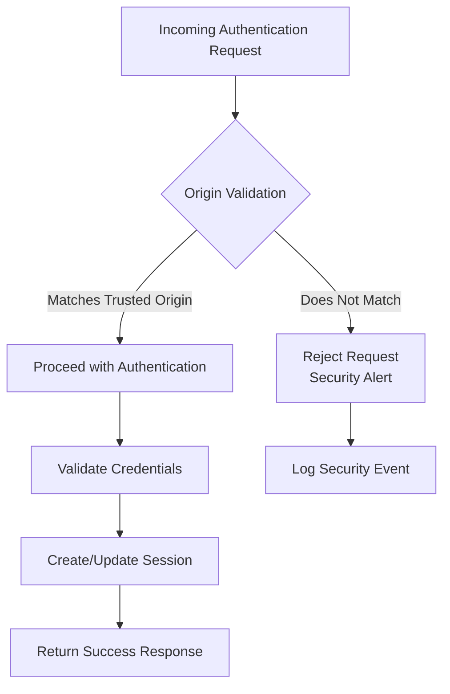
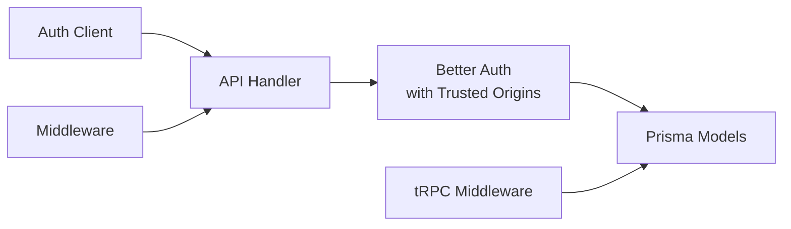

# Authentication System

<cite>
**Referenced Files in This Document**
- [lib/auth.ts](file://lib/auth.ts)
- [lib/auth-client.ts](file://lib/auth-client.ts)
- [app/api/auth/[...all]/route.ts](file://app/api/auth/[...all]/route.ts)
- [middleware.ts](file://middleware.ts)
- [modules/auth/index.ts](file://modules/auth/index.ts)
- [modules/auth/hooks.ts](file://modules/auth/hooks.ts)
- [modules/auth/utils.ts](file://modules/auth/utils.ts)
- [modules/auth/types.ts](file://modules/auth/types.ts)
- [modules/auth/constants.ts](file://modules/auth/constants.ts)
- [server/middleware/index.ts](file://server/middleware/index.ts)
- [lib/prisma.ts](file://lib/prisma.ts)
- [prisma/schema.prisma](file://prisma/schema.prisma)
- [components/layouts/auth-layout.tsx](file://components/layouts/auth-layout.tsx)
- [hooks/use-local-storage.ts](file://hooks/use-local-storage.ts)
</cite>

## Update Summary
**Changes Made**
- Enhanced security section to document trusted origin configuration
- Updated Better Auth configuration section to include trusted origins setup
- Added security best practices for origin validation
- Updated troubleshooting guide to include origin-related issues

## Table of Contents
1. [Introduction](#introduction)
2. [Project Structure](#project-structure)
3. [Core Components](#core-components)
4. [Architecture Overview](#architecture-overview)
5. [Detailed Component Analysis](#detailed-component-analysis)
6. [Security Enhancements](#security-enhancements)
7. [Dependency Analysis](#dependency-analysis)
8. [Performance Considerations](#performance-considerations)
9. [Troubleshooting Guide](#troubleshooting-guide)
10. [Conclusion](#conclusion)
11. [Appendices](#appendices)

## Introduction
This document describes the authentication system for Smartfolio, built on Better Auth. It covers integration with Better Auth, user registration and login workflows, OAuth with Google and GitHub, session management, role-based access control, middleware-based authentication flow, protected routes, and security best practices. It also documents authentication hooks, utility functions, type definitions, and practical guidance for extending the system and integrating additional providers.

**Updated** Enhanced with trusted origin configuration for improved security against cross-origin attacks and CSRF vulnerabilities.

## Project Structure
The authentication system spans client-side hooks, server-side Better Auth configuration, API handlers, middleware, and database models. Key areas:
- Better Auth configuration and client initialization with trusted origin validation
- API route handler delegating to Better Auth
- Next.js middleware enforcing authentication gating
- tRPC server middleware for role-based and feature-based access control
- Prisma models supporting Better Auth and RBAC
- React hooks and utilities for authentication state and display

**Diagram sources**
- [lib/auth.ts](file://lib/auth.ts#L1-L25)
- [lib/auth-client.ts](file://lib/auth-client.ts#L1-L8)
- [app/api/auth/[...all]/route.ts](file://app/api/auth/[...all]/route.ts#L1-L7)
- [middleware.ts](file://middleware.ts#L1-L95)
- [server/middleware/index.ts](file://server/middleware/index.ts#L1-L153)
- [prisma/schema.prisma](file://prisma/schema.prisma#L17-L83)

**Section sources**
- [lib/auth.ts](file://lib/auth.ts#L1-L25)
- [lib/auth-client.ts](file://lib/auth-client.ts#L1-L8)
- [app/api/auth/[...all]/route.ts](file://app/api/auth/[...all]/route.ts#L1-L7)
- [middleware.ts](file://middleware.ts#L1-L95)
- [server/middleware/index.ts](file://server/middleware/index.ts#L1-L153)
- [prisma/schema.prisma](file://prisma/schema.prisma#L17-L83)

## Core Components
- Better Auth configuration defines database adapter, email/password, social providers (Google, GitHub), secrets, base URL, and trusted origins for enhanced security.
- Client-side auth client initializes Better Auth for the browser with proper base URL configuration.
- API handler exposes Better Auth's HTTP handler for GET/POST requests.
- Next.js middleware enforces authentication gating for protected routes.
- tRPC server middleware adds role-based and feature-based access control.
- Prisma models support Better Auth sessions/accounts and RBAC.

**Section sources**
- [lib/auth.ts](file://lib/auth.ts#L5-L24)
- [lib/auth-client.ts](file://lib/auth-client.ts#L3-L5)
- [app/api/auth/[...all]/route.ts](file://app/api/auth/[...all]/route.ts#L5-L6)
- [middleware.ts](file://middleware.ts#L28-L42)
- [server/middleware/index.ts](file://server/middleware/index.ts#L68-L85)
- [prisma/schema.prisma](file://prisma/schema.prisma#L17-L36)

## Architecture Overview
The system integrates client-side React hooks with server-side Better Auth. Requests are routed through the API handler, validated by middleware, and enforced by tRPC middlewares. Sessions are persisted via Prisma-backed Better Auth models with enhanced origin validation for security.

**Diagram sources**
- [middleware.ts](file://middleware.ts#L44-L81)
- [app/api/auth/[...all]/route.ts](file://app/api/auth/[...all]/route.ts#L5-L6)
- [lib/auth.ts](file://lib/auth.ts#L1-L25)
- [prisma/schema.prisma](file://prisma/schema.prisma#L59-L72)

## Detailed Component Analysis

### Better Auth Configuration
- Database adapter configured with Prisma for PostgreSQL.
- Email and password sign-in enabled.
- Social providers configured for Google and GitHub using environment variables.
- Secret and base URL configured for secure operation.
- **Enhanced Security**: Trusted origins configured to validate request origins and prevent cross-origin attacks.

**Diagram sources**
- [lib/auth.ts](file://lib/auth.ts#L5-L24)

**Section sources**
- [lib/auth.ts](file://lib/auth.ts#L1-L25)
- [lib/prisma.ts](file://lib/prisma.ts#L1-L14)
- [prisma/schema.prisma](file://prisma/schema.prisma#L17-L83)

### Client-Side Auth Client
- Initializes Better Auth client with base URL.
- Exposes sign-in, sign-out, sign-up, and session hook for React.

**Diagram sources**
- [lib/auth-client.ts](file://lib/auth-client.ts#L3-L7)

**Section sources**
- [lib/auth-client.ts](file://lib/auth-client.ts#L1-L8)

### API Handler
- Delegates GET/POST requests to Better Auth handler.
- Runs in Node.js runtime for server-side session validation.

**Section sources**
- [app/api/auth/[...all]/route.ts](file://app/api/auth/[...all]/route.ts#L1-L7)

### Next.js Middleware
- Defines public and auth-only routes.
- Validates session by calling Better Auth API endpoint using the session cookie.
- Redirects unauthenticated users to sign-in with a callback URL.
- Skips API and static asset routes.

**Diagram sources**
- [middleware.ts](file://middleware.ts#L44-L81)

**Section sources**
- [middleware.ts](file://middleware.ts#L1-L95)

### tRPC Server Middleware (Role-Based Access Control)
- Admin middleware checks user role.
- Subscription middleware validates active subscription.
- Usage limit middleware enforces plan-specific quotas.
- Rate limit middleware throttles requests per user.

**Diagram sources**
- [server/middleware/index.ts](file://server/middleware/index.ts#L13-L36)
- [server/middleware/index.ts](file://server/middleware/index.ts#L42-L62)
- [server/middleware/index.ts](file://server/middleware/index.ts#L91-L152)
- [server/middleware/index.ts](file://server/middleware/index.ts#L68-L85)

**Section sources**
- [server/middleware/index.ts](file://server/middleware/index.ts#L1-L153)

### Authentication Hooks and Utilities
- useAuth: Returns user, session, loading state, and authentication status.
- useRequireAuth: Throws if not authenticated.
- Utilities: Display name, initials, and email verification helpers.
- Types: User, Session, credentials, and response types.

**Diagram sources**
- [modules/auth/hooks.ts](file://modules/auth/hooks.ts#L9-L18)
- [modules/auth/hooks.ts](file://modules/auth/hooks.ts#L20-L28)
- [modules/auth/utils.ts](file://modules/auth/utils.ts#L7-L28)
- [modules/auth/types.ts](file://modules/auth/types.ts#L5-L35)

**Section sources**
- [modules/auth/hooks.ts](file://modules/auth/hooks.ts#L1-L29)
- [modules/auth/utils.ts](file://modules/auth/utils.ts#L1-L29)
- [modules/auth/types.ts](file://modules/auth/types.ts#L1-L36)

### Authentication Layout and Local Storage Hook
- AuthLayout: Provides a consistent layout for authentication pages.
- useLocalStorage: Persists and retrieves values from localStorage with safe error handling.

**Section sources**
- [components/layouts/auth-layout.tsx](file://components/layouts/auth-layout.tsx#L1-L29)
- [hooks/use-local-storage.ts](file://hooks/use-local-storage.ts#L1-L33)

### Protected Routes and Constants
- AUTH_ROUTES, PROTECTED_ROUTES, and PUBLIC_ROUTES centralize route definitions for consistent enforcement.

**Section sources**
- [modules/auth/constants.ts](file://modules/auth/constants.ts#L1-L25)

## Security Enhancements

### Trusted Origin Configuration
The authentication system now includes enhanced security through trusted origin validation. This prevents cross-origin attacks and ensures that authentication requests originate from approved sources.

**Configuration Details:**
- **Location**: `lib/auth.ts` line 24
- **Implementation**: `trustedOrigins: [process.env.BETTER_AUTH_URL!]`
- **Purpose**: Validates that authentication requests come from the configured base URL
- **Security Benefits**: Prevents CSRF attacks, cross-site request forgery, and unauthorized origin access

**Security Architecture:**

**Diagram sources**
- [lib/auth.ts](file://lib/auth.ts#L24)

**Best Practices for Trusted Origins:**
- Set `BETTER_AUTH_URL` environment variable to your production domain
- Include all subdomains and variations in trusted origins array
- Update configuration when changing deployment domains
- Test origin validation thoroughly during deployment

**Section sources**
- [lib/auth.ts](file://lib/auth.ts#L24)

## Dependency Analysis
- Client depends on Better Auth client for session and auth actions.
- API handler depends on Better Auth configuration with trusted origin validation.
- Middleware depends on API handler for session validation.
- tRPC middlewares depend on Prisma models for roles and subscriptions.
- Prisma models define Better Auth tables and RBAC fields.

**Diagram sources**
- [lib/auth-client.ts](file://lib/auth-client.ts#L3-L7)
- [app/api/auth/[...all]/route.ts](file://app/api/auth/[...all]/route.ts#L5-L6)
- [lib/auth.ts](file://lib/auth.ts#L1-L25)
- [middleware.ts](file://middleware.ts#L28-L42)
- [server/middleware/index.ts](file://server/middleware/index.ts#L49-L84)
- [prisma/schema.prisma](file://prisma/schema.prisma#L17-L36)

**Section sources**
- [lib/auth-client.ts](file://lib/auth-client.ts#L1-L8)
- [app/api/auth/[...all]/route.ts](file://app/api/auth/[...all]/route.ts#L1-L7)
- [lib/auth.ts](file://lib/auth.ts#L1-L25)
- [middleware.ts](file://middleware.ts#L1-L95)
- [server/middleware/index.ts](file://server/middleware/index.ts#L1-L153)
- [prisma/schema.prisma](file://prisma/schema.prisma#L17-L83)

## Performance Considerations
- Middleware performs a lightweight session check via an internal API call; avoid redundant validations.
- tRPC middlewares rely on database queries; ensure indexes exist on frequently queried fields (e.g., user ID, status).
- Use rate limiting to prevent abuse and protect downstream services.
- Keep base URLs and secrets in environment variables to avoid unnecessary client-side exposure.
- **Enhanced Security**: Trusted origin validation adds minimal overhead while significantly improving security posture.

## Troubleshooting Guide
Common issues and resolutions:
- Environment variables missing: Ensure Better Auth secret, base URL, and provider credentials are set.
- Session cookie not present: Verify cookies are sent and SameSite/CORS policies are correct.
- Redirect loops: Confirm middleware matcher excludes static assets and API routes appropriately.
- Role/subscription errors: Check user role and subscription status in Prisma models.
- Rate limit errors: Inspect rate limiter service and logs.
- **Origin validation failures**: Verify `BETTER_AUTH_URL` matches the actual deployment domain and is included in trusted origins.

**Section sources**
- [lib/auth.ts](file://lib/auth.ts#L12-L23)
- [middleware.ts](file://middleware.ts#L83-L94)
- [server/middleware/index.ts](file://server/middleware/index.ts#L20-L33)
- [prisma/schema.prisma](file://prisma/schema.prisma#L23-L36)

## Conclusion
Smartfolio's authentication system leverages Better Auth for robust session management and OAuth, with Next.js middleware enforcing route-level protection and tRPC middlewares adding role-based and feature-based controls. The enhanced security with trusted origin configuration provides additional protection against cross-origin attacks while maintaining the modular design that enables easy extension with additional providers and access-control policies.

## Appendices

### Practical Examples

- Authentication state management with React hooks
  - Use the authentication hooks to derive user, session, and loading state.
  - Reference: [modules/auth/hooks.ts](file://modules/auth/hooks.ts#L9-L18)

- Token handling and session persistence
  - Client uses the auth client to manage sign-in/sign-out and session state.
  - Reference: [lib/auth-client.ts](file://lib/auth-client.ts#L3-L7)

- Protected route implementation
  - Middleware redirects unauthenticated users to sign-in with a callback URL.
  - Reference: [middleware.ts](file://middleware.ts#L73-L78)

- Role-based access control
  - Admin middleware checks user role and throws UNAUTHORIZED/FORBIDDEN accordingly.
  - Reference: [server/middleware/index.ts](file://server/middleware/index.ts#L68-L85)

- Extending authentication features
  - Add new social providers by updating Better Auth configuration.
  - Reference: [lib/auth.ts](file://lib/auth.ts#L12-L21)

- Integrating additional providers
  - Configure provider credentials in environment variables and Better Auth config.
  - Reference: [lib/auth.ts](file://lib/auth.ts#L12-L21)

- **Enhanced Security Implementation**
  - Configure trusted origins for origin validation.
  - Reference: [lib/auth.ts](file://lib/auth.ts#L24)

### Security Best Practices
- Store secrets and provider credentials in environment variables.
- Enforce HTTPS and secure cookie attributes in production.
- Regularly rotate secrets and review provider scopes.
- Monitor rate-limit violations and adjust thresholds.
- **Configure trusted origins**: Set `BETTER_AUTH_URL` to match your deployment domain.
- **Test origin validation**: Verify that authentication works correctly across all configured origins.
- **Update configurations**: Modify trusted origins when changing deployment domains or adding new subdomains.