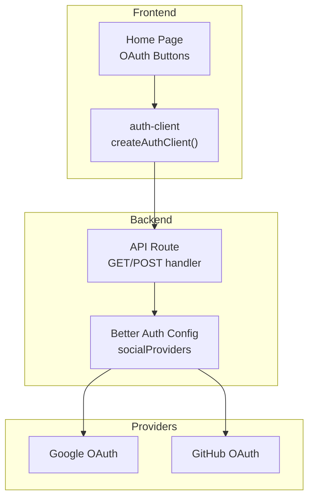
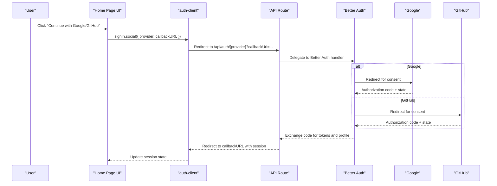
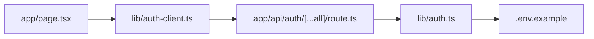

# OAuth Integration

<cite>
**Referenced Files in This Document**
- [lib/auth.ts](file://lib/auth.ts)
- [lib/auth-client.ts](file://lib/auth-client.ts)
- [app/api/auth/[...all]/route.ts](file://app/api/auth/[...all]/route.ts)
- [modules/auth/hooks.ts](file://modules/auth/hooks.ts)
- [modules/auth/types.ts](file://modules/auth/types.ts)
- [modules/auth/utils.ts](file://modules/auth/utils.ts)
- [app/page.tsx](file://app/page.tsx)
- [.env.example](file://.env.example)
</cite>

## Table of Contents
1. [Introduction](#introduction)
2. [Project Structure](#project-structure)
3. [Core Components](#core-components)
4. [Architecture Overview](#architecture-overview)
5. [Detailed Component Analysis](#detailed-component-analysis)
6. [Dependency Analysis](#dependency-analysis)
7. [Performance Considerations](#performance-considerations)
8. [Troubleshooting Guide](#troubleshooting-guide)
9. [Conclusion](#conclusion)
10. [Appendices](#appendices)

## Introduction
This document explains the OAuth integration with external providers in the project. It focuses on the Google and GitHub OAuth flows, provider configuration, callback handling, user data mapping, hooks, state management, and token exchange. It also covers provider-specific configurations, scopes, consent handling, practical examples of OAuth login buttons and redirect flows, error handling, security considerations, and guidance for adding new OAuth providers.

## Project Structure
The OAuth integration is implemented using Better Auth on the backend and the Better Auth React client on the frontend. Provider credentials are configured via environment variables, and the API routes expose Better Auth’s handler to manage OAuth callbacks. Frontend UI components trigger OAuth initiation and display feedback during the process.

**Diagram sources**
- [app/page.tsx](file://app/page.tsx#L215-L229)
- [lib/auth-client.ts](file://lib/auth-client.ts#L1-L8)
- [app/api/auth/[...all]/route.ts](file://app/api/auth/[...all]/route.ts#L1-L7)
- [lib/auth.ts](file://lib/auth.ts#L5-L24)

**Section sources**
- [lib/auth.ts](file://lib/auth.ts#L1-L25)
- [lib/auth-client.ts](file://lib/auth-client.ts#L1-L8)
- [app/api/auth/[...all]/route.ts](file://app/api/auth/[...all]/route.ts#L1-L7)
- [.env.example](file://.env.example#L13-L19)

## Core Components
- Backend configuration: Better Auth initializes PostgreSQL adapter, enables email/password, configures Google and GitHub social providers, sets the application secret, and defines base URL.
- API handler: Exposes Better Auth’s handler for GET and POST requests under the auth API route.
- Frontend client: Creates a Better Auth React client pointing to the base URL and exposes convenience functions for sign-in, sign-out, sign-up, and session retrieval.
- UI integration: Home page provides OAuth buttons that call the frontend client to initiate provider sign-in with a callback URL derived from query parameters.

Key responsibilities:
- Provider configuration and credential loading from environment variables
- OAuth callback routing and session creation
- Frontend OAuth initiation and state management
- User data mapping and session typing

**Section sources**
- [lib/auth.ts](file://lib/auth.ts#L5-L24)
- [app/api/auth/[...all]/route.ts](file://app/api/auth/[...all]/route.ts#L1-L7)
- [lib/auth-client.ts](file://lib/auth-client.ts#L1-L8)
- [app/page.tsx](file://app/page.tsx#L215-L229)

## Architecture Overview
The OAuth flow leverages Better Auth’s built-in provider support. The frontend triggers OAuth by calling the client’s social sign-in method, passing the provider and callback URL. Better Auth redirects the user to the respective provider for consent. After consent, the provider redirects back to the application’s auth API route, which delegates to Better Auth to finalize the exchange and create or update the user session.

**Diagram sources**
- [app/page.tsx](file://app/page.tsx#L215-L229)
- [lib/auth-client.ts](file://lib/auth-client.ts#L1-L8)
- [app/api/auth/[...all]/route.ts](file://app/api/auth/[...all]/route.ts#L1-L7)
- [lib/auth.ts](file://lib/auth.ts#L12-L21)

## Detailed Component Analysis

### Backend OAuth Configuration (Better Auth)
- Database adapter: PostgreSQL adapter configured via Prisma.
- Email/password: Enabled for traditional authentication.
- Social providers: Google and GitHub configured with client IDs and secrets loaded from environment variables.
- Secret and base URL: Set for secure cookie signing and cross-origin redirect handling.
- Handler exposure: API route exports Better Auth’s handler for GET and POST.

Implementation highlights:
- Provider credentials are injected from environment variables.
- Base URL determines the origin for OAuth callbacks and cookie domain/path.
- The handler manages state verification, PKCE, and token exchange.

**Section sources**
- [lib/auth.ts](file://lib/auth.ts#L5-L24)

### API Route Handler
- The auth API route imports the Better Auth instance and exposes its handler for GET and POST.
- This endpoint receives provider callbacks and performs token exchange and session creation.

Operational notes:
- Ensure the Better Auth base URL matches the deployment origin.
- The handler automatically manages state verification and redirect URIs.

**Section sources**
- [app/api/auth/[...all]/route.ts](file://app/api/auth/[...all]/route.ts#L1-L7)

### Frontend OAuth Client
- The React client is created with the base URL and exposes functions for sign-in, sign-out, sign-up, and session retrieval.
- The client coordinates with the backend handler to complete OAuth.

Integration points:
- The client reads the base URL from environment variables.
- It communicates with the auth API route to initiate and finalize OAuth.

**Section sources**
- [lib/auth-client.ts](file://lib/auth-client.ts#L1-L8)

### UI OAuth Buttons and Callback Handling
- The home page renders “Continue with Google” and “Continue with GitHub” buttons.
- On click, it calls the frontend client’s social sign-in with the selected provider and a callback URL derived from the current URL’s query parameters.
- The UI tracks loading state and displays generic errors if the sign-in fails.

Practical usage:
- Users click a button to start OAuth.
- After provider consent, the browser is redirected to the callback URL with session updates.
- The UI disables buttons while a provider sign-in is in progress.

**Section sources**
- [app/page.tsx](file://app/page.tsx#L215-L229)
- [app/page.tsx](file://app/page.tsx#L608-L662)

### Authentication Hooks and Types
- React hooks wrap the Better Auth session and expose user, session, loading state, and authentication status.
- Types define the User and Session shapes used across the application.

Usage:
- Use the hook to guard protected routes or render UI conditionally based on authentication state.
- The types ensure consistent handling of user and session data.

**Section sources**
- [modules/auth/hooks.ts](file://modules/auth/hooks.ts#L9-L18)
- [modules/auth/types.ts](file://modules/auth/types.ts#L5-L18)

### Environment Variables and Provider Setup
- Provider credentials for Google and GitHub are configured via environment variables.
- Better Auth secret and base URL are required for secure operation.
- The example environment file documents the required keys.

Setup steps:
- Add provider client IDs and secrets to environment variables.
- Configure Better Auth secret and base URL.
- Ensure the base URL matches the deployed origin.

**Section sources**
- [.env.example](file://.env.example#L9-L19)
- [lib/auth.ts](file://lib/auth.ts#L13-L20)

### OAuth Flow Details

#### Provider Configuration
- Google and GitHub are configured with client IDs and secrets.
- Better Auth manages provider-specific endpoints and redirect URIs.

Scopes and consent:
- Better Auth handles default scopes and consent prompts.
- Customize scopes by extending the provider configuration if needed.

State management and security:
- Better Auth verifies state parameters and enforces PKCE where applicable.
- Cookies are signed with the configured secret to prevent tampering.

Token exchange:
- The handler exchanges authorization codes for tokens and retrieves user profiles.
- Sessions are created or updated accordingly.

**Section sources**
- [lib/auth.ts](file://lib/auth.ts#L12-L21)
- [app/api/auth/[...all]/route.ts](file://app/api/auth/[...all]/route.ts#L5-L6)

#### Callback Handling
- The API route delegates all auth-related requests to Better Auth.
- On successful callback, Better Auth redirects back to the provided callback URL with session updates.

UI callback URL derivation:
- The frontend constructs callback URL from the current location’s query parameters.
- The UI disables buttons during sign-in to avoid concurrent requests.

**Section sources**
- [app/api/auth/[...all]/route.ts](file://app/api/auth/[...all]/route.ts#L1-L7)
- [app/page.tsx](file://app/page.tsx#L215-L229)

#### User Data Mapping
- Better Auth maps provider user data to the internal User model.
- The application’s types align with the session user shape.

Consistency:
- Ensure the User and Session types reflect the data returned by providers.
- Use the provided hooks to access normalized user information.

**Section sources**
- [modules/auth/types.ts](file://modules/auth/types.ts#L5-L18)
- [modules/auth/utils.ts](file://modules/auth/utils.ts#L7-L24)

### Adding a New OAuth Provider
Steps:
- Define the provider in the Better Auth configuration with client ID and secret.
- Ensure environment variables are set for the new provider.
- Verify the base URL and secret are correctly configured.
- Test the provider flow using the frontend OAuth buttons.

Considerations:
- Confirm the provider supports OAuth 2.0 and OpenID Connect if needed.
- Review state verification and PKCE behavior.
- Validate callback URLs and redirect URIs.

**Section sources**
- [lib/auth.ts](file://lib/auth.ts#L12-L21)
- [.env.example](file://.env.example#L13-L19)

## Dependency Analysis
The OAuth integration depends on:
- Better Auth for backend OAuth orchestration and session management
- Frontend React client for initiating OAuth and accessing session state
- API route to expose Better Auth’s handler
- Environment variables for provider credentials and application configuration

**Diagram sources**
- [app/page.tsx](file://app/page.tsx#L215-L229)
- [lib/auth-client.ts](file://lib/auth-client.ts#L1-L8)
- [app/api/auth/[...all]/route.ts](file://app/api/auth/[...all]/route.ts#L1-L7)
- [lib/auth.ts](file://lib/auth.ts#L5-L24)
- [.env.example](file://.env.example#L9-L19)

**Section sources**
- [lib/auth.ts](file://lib/auth.ts#L5-L24)
- [lib/auth-client.ts](file://lib/auth-client.ts#L1-L8)
- [app/api/auth/[...all]/route.ts](file://app/api/auth/[...all]/route.ts#L1-L7)
- [app/page.tsx](file://app/page.tsx#L215-L229)

## Performance Considerations
- Minimize unnecessary re-renders by using the provided hooks to access session state efficiently.
- Keep callback URLs concise and avoid heavy computations during redirect handling.
- Use environment variables for configuration to avoid runtime overhead.

## Troubleshooting Guide
Common issues and resolutions:
- Missing provider credentials: Ensure Google and GitHub client IDs and secrets are set in environment variables.
- Incorrect base URL: Verify BETTER_AUTH_URL matches the deployment origin to prevent redirect mismatches.
- State verification failures: Confirm cookies are enabled and the secret is set; Better Auth validates state parameters automatically.
- Redirect URI mismatch: Ensure the provider console has the correct redirect URI matching the base URL and API route.
- Frontend button disabled: The UI disables buttons during sign-in; wait for completion or check for errors.
- Generic error messages: The UI displays a generic error if sign-in fails; check browser console and network logs for provider-specific errors.

Security checks:
- Verify the Better Auth secret is strong and kept confidential.
- Ensure HTTPS is used in production to protect cookies and tokens.
- Review provider scopes and consent prompts to align with privacy requirements.

**Section sources**
- [.env.example](file://.env.example#L9-L19)
- [lib/auth.ts](file://lib/auth.ts#L22-L24)
- [app/page.tsx](file://app/page.tsx#L215-L229)

## Conclusion
The project integrates Google and GitHub OAuth using Better Auth for robust provider handling, secure state management, and seamless session creation. The frontend provides intuitive OAuth buttons, while the backend API route delegates OAuth operations to Better Auth. Following the configuration steps and security guidelines ensures reliable authentication and easy extensibility for additional providers.

## Appendices

### Practical Examples

- OAuth login buttons:
  - Render two buttons on the home page for Google and GitHub.
  - On click, call the frontend client’s social sign-in with the provider and callback URL.
  - Disable buttons during sign-in and show a loading state.

- Redirect flows:
  - The frontend constructs callback URL from the current location’s query parameters.
  - After provider consent, the browser is redirected to the callback URL with session updates.

- Error handling:
  - Catch sign-in errors and display a user-friendly message.
  - Provide retry actions and guidance for common issues.

**Section sources**
- [app/page.tsx](file://app/page.tsx#L608-L662)
- [app/page.tsx](file://app/page.tsx#L215-L229)

### Security Considerations
- Use strong secrets and rotate them periodically.
- Enforce HTTPS in production environments.
- Validate and sanitize callback URLs.
- Limit provider scopes to the minimum required for functionality.
- Monitor provider-specific limitations and adjust consent prompts accordingly.

**Section sources**
- [lib/auth.ts](file://lib/auth.ts#L22-L24)
- [lib/auth.ts](file://lib/auth.ts#L12-L21)