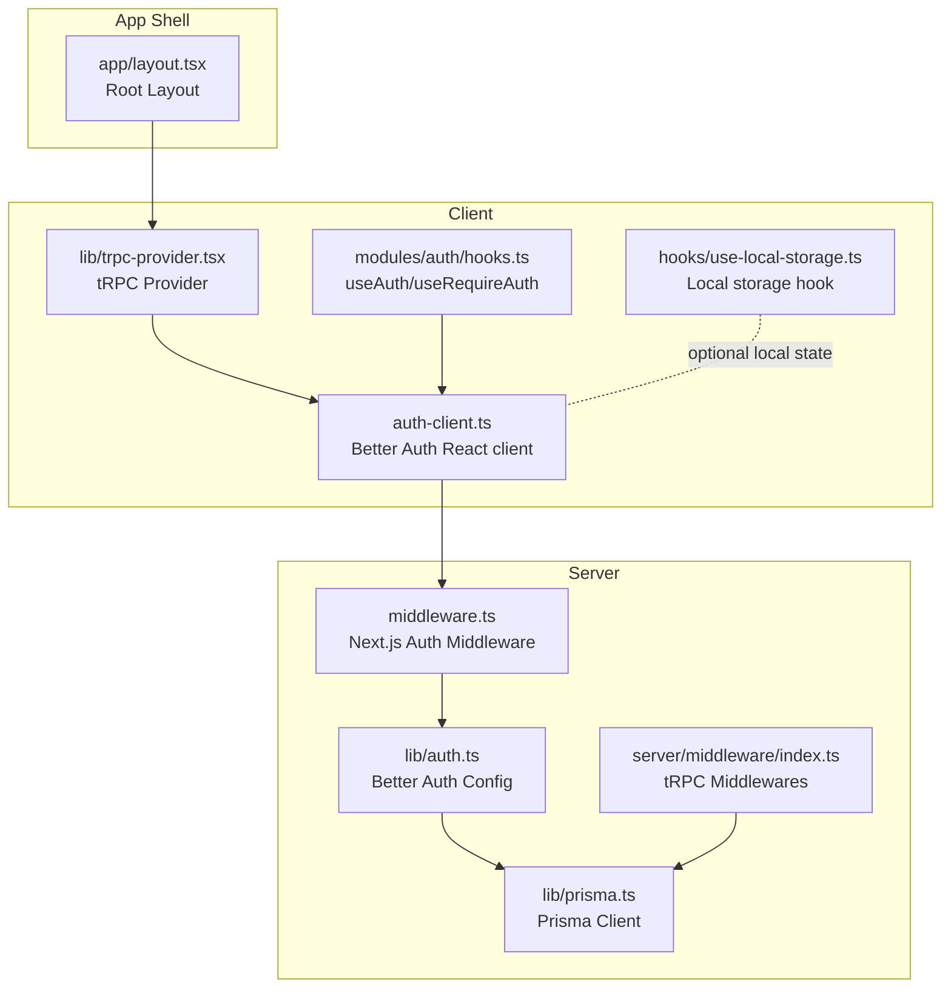
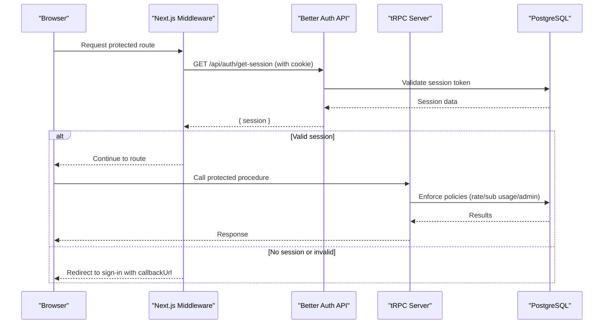
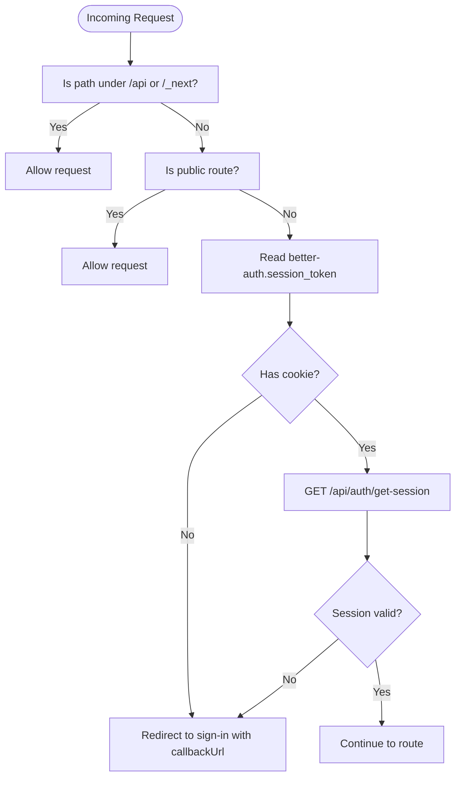
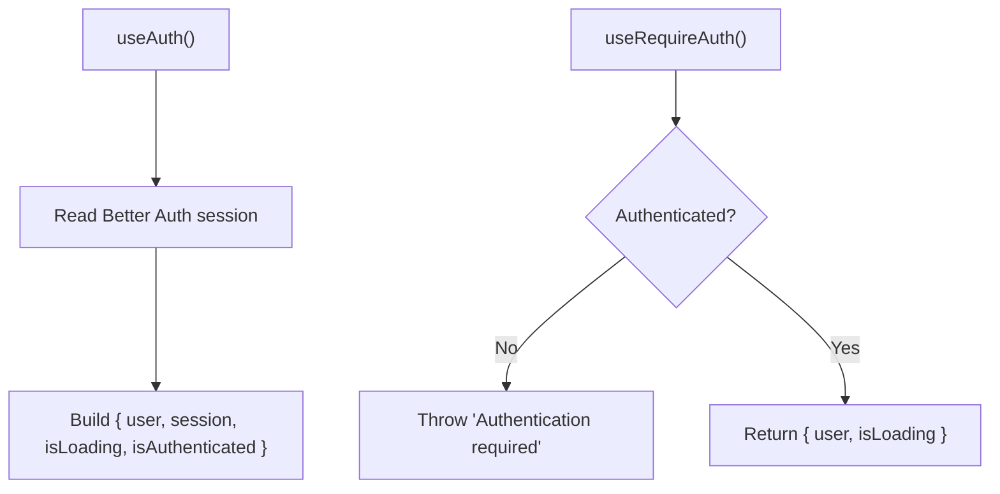
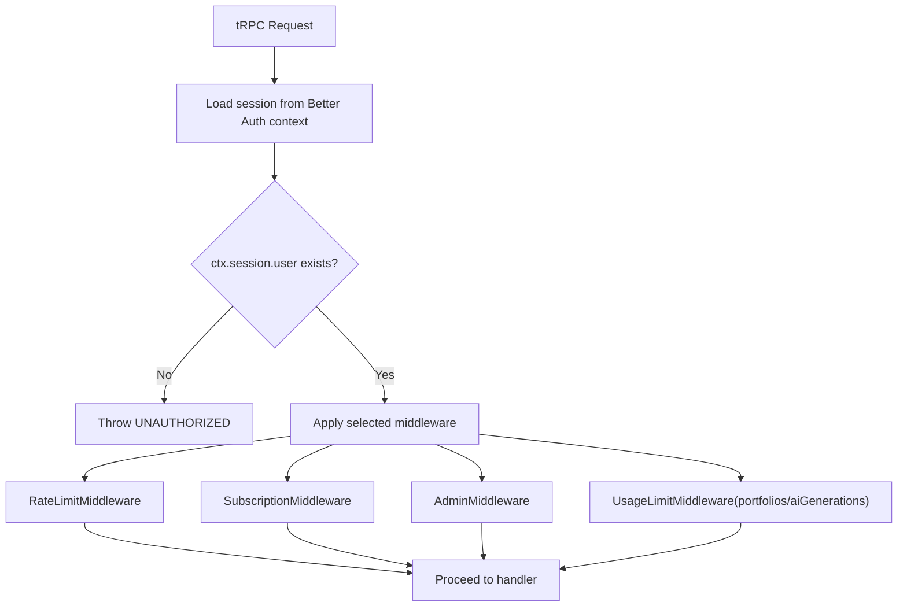
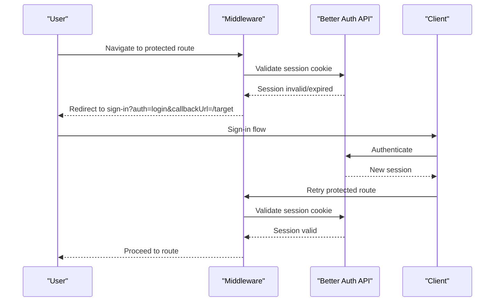
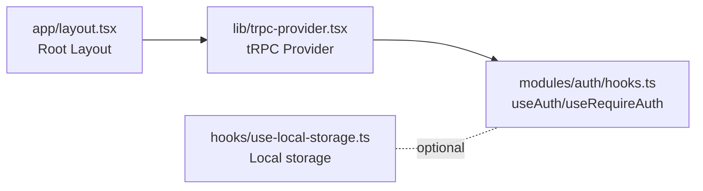
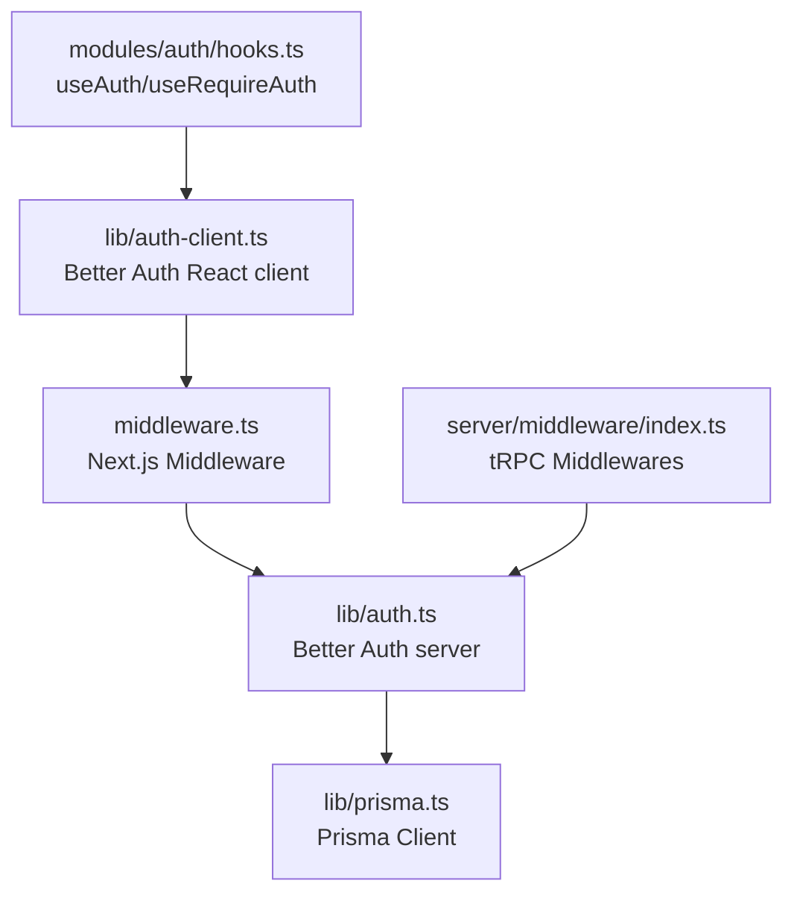

# Session Management

<cite>
**Referenced Files in This Document**
- [lib/auth.ts](file://lib/auth.ts)
- [lib/auth-client.ts](file://lib/auth-client.ts)
- [middleware.ts](file://middleware.ts)
- [server/middleware/index.ts](file://server/middleware/index.ts)
- [modules/auth/hooks.ts](file://modules/auth/hooks.ts)
- [modules/auth/types.ts](file://modules/auth/types.ts)
- [lib/prisma.ts](file://lib/prisma.ts)
- [lib/trpc-provider.tsx](file://lib/trpc-provider.tsx)
- [app/layout.tsx](file://app/layout.tsx)
- [hooks/use-local-storage.ts](file://hooks/use-local-storage.ts)
</cite>

## Table of Contents
1. [Introduction](#introduction)
2. [Project Structure](#project-structure)
3. [Core Components](#core-components)
4. [Architecture Overview](#architecture-overview)
5. [Detailed Component Analysis](#detailed-component-analysis)
6. [Dependency Analysis](#dependency-analysis)
7. [Performance Considerations](#performance-considerations)
8. [Security Considerations](#security-considerations)
9. [Troubleshooting Guide](#troubleshooting-guide)
10. [Conclusion](#conclusion)

## Introduction
This document explains the session management and persistence implementation in the project. It covers the session lifecycle, cookie handling, token refresh mechanisms, session hooks, client-side authentication state, server-side session validation, middleware-based session checks, automatic logout on token expiration, and session renewal processes. It also provides practical examples of session-aware components, protected route handling, authentication state synchronization, customization guidance, and concurrent session handling.

## Project Structure
The session management spans client and server layers:
- Client-side authentication state is provided by a Better Auth React client.
- Server-side authentication is configured via Better Auth with a PostgreSQL adapter.
- Next.js middleware validates sessions for protected routes and redirects as needed.
- tRPC middlewares enforce authorization policies using the validated session.
- Local storage utilities support client-side persistence of non-sensitive state.

**Diagram sources**
- [lib/auth-client.ts](file://lib/auth-client.ts#L1-L8)
- [modules/auth/hooks.ts](file://modules/auth/hooks.ts#L1-L29)
- [lib/trpc-provider.tsx](file://lib/trpc-provider.tsx#L1-L50)
- [hooks/use-local-storage.ts](file://hooks/use-local-storage.ts#L1-L33)
- [middleware.ts](file://middleware.ts#L1-L95)
- [server/middleware/index.ts](file://server/middleware/index.ts#L1-L153)
- [lib/auth.ts](file://lib/auth.ts#L1-L25)
- [lib/prisma.ts](file://lib/prisma.ts#L1-L14)
- [app/layout.tsx](file://app/layout.tsx#L1-L36)

**Section sources**
- [lib/auth.ts](file://lib/auth.ts#L1-L25)
- [lib/auth-client.ts](file://lib/auth-client.ts#L1-L8)
- [middleware.ts](file://middleware.ts#L1-L95)
- [server/middleware/index.ts](file://server/middleware/index.ts#L1-L153)
- [modules/auth/hooks.ts](file://modules/auth/hooks.ts#L1-L29)
- [lib/prisma.ts](file://lib/prisma.ts#L1-L14)
- [lib/trpc-provider.tsx](file://lib/trpc-provider.tsx#L1-L50)
- [app/layout.tsx](file://app/layout.tsx#L1-L36)
- [hooks/use-local-storage.ts](file://hooks/use-local-storage.ts#L1-L33)

## Core Components
- Better Auth server configuration defines database adapter, credentials and social providers, secrets, and base URL.
- Better Auth React client exposes sign-in, sign-out, sign-up, and session hooks.
- Next.js middleware performs session validation for protected routes and handles redirects.
- tRPC middlewares enforce rate limits, subscriptions, admin roles, and usage caps using the validated session.
- Client-side hooks expose authentication state and guard protected components.
- Optional local storage hook supports persisting non-sensitive client state.

**Section sources**
- [lib/auth.ts](file://lib/auth.ts#L5-L24)
- [lib/auth-client.ts](file://lib/auth-client.ts#L1-L8)
- [middleware.ts](file://middleware.ts#L28-L81)
- [server/middleware/index.ts](file://server/middleware/index.ts#L13-L152)
- [modules/auth/hooks.ts](file://modules/auth/hooks.ts#L9-L28)
- [hooks/use-local-storage.ts](file://hooks/use-local-storage.ts#L5-L32)

## Architecture Overview
The session lifecycle integrates client and server components:
- Client initializes the Better Auth React client and uses session hooks.
- Next.js middleware validates the session cookie against the Better Auth API.
- Protected routes rely on the validated session; unauthorized users are redirected.
- tRPC middlewares enforce authorization policies using the session in the tRPC context.
- On expiration or invalidation, the client loses session state; middleware redirects to sign-in.

**Diagram sources**
- [middleware.ts](file://middleware.ts#L28-L81)
- [lib/auth.ts](file://lib/auth.ts#L6-L8)
- [lib/prisma.ts](file://lib/prisma.ts#L7-L13)
- [server/middleware/index.ts](file://server/middleware/index.ts#L13-L152)

## Detailed Component Analysis

### Session Lifecycle and Cookie Handling
- Cookies: The middleware reads the session cookie and calls the Better Auth API to validate it.
- Validation endpoint: The middleware fetches the session from the Better Auth API using the incoming cookie header.
- Redirects: If the session is invalid, the middleware redirects to sign-in with a callback URL to preserve navigation intent.

**Diagram sources**
- [middleware.ts](file://middleware.ts#L44-L81)

**Section sources**
- [middleware.ts](file://middleware.ts#L28-L81)

### Token Refresh Mechanisms
- Better Auth manages token lifecycle server-side. The React client exposes session state; token refresh occurs transparently within Better Auth’s internal logic.
- The client session hook reflects the current session state. There is no explicit manual refresh call in the provided code; Better Auth handles renewal automatically.

**Section sources**
- [lib/auth-client.ts](file://lib/auth-client.ts#L1-L8)
- [modules/auth/hooks.ts](file://modules/auth/hooks.ts#L9-L18)

### Session Hooks and Client-Side Authentication State
- useAuth: Returns user, session, loading state, and authentication status derived from the Better Auth session hook.
- useRequireAuth: Throws when unauthenticated, enabling declarative guards in components.

**Diagram sources**
- [modules/auth/hooks.ts](file://modules/auth/hooks.ts#L9-L28)

**Section sources**
- [modules/auth/hooks.ts](file://modules/auth/hooks.ts#L9-L28)

### Server-Side Session Validation and tRPC Middlewares
- The tRPC context carries the validated session from the Better Auth server configuration.
- Middlewares enforce:
  - Rate limiting per user ID
  - Active subscription requirement
  - Admin role requirement
  - Plan-based usage limits (portfolios and AI generations)

**Diagram sources**
- [server/middleware/index.ts](file://server/middleware/index.ts#L13-L152)

**Section sources**
- [server/middleware/index.ts](file://server/middleware/index.ts#L13-L152)

### Protected Route Handling and Automatic Logout on Expiration
- Protected routes: The middleware validates the session and redirects unauthenticated users to sign-in with a callback URL.
- Automatic logout: If the session becomes invalid (e.g., token expired), the middleware blocks access and redirects to sign-in. The client session state becomes empty.

**Diagram sources**
- [middleware.ts](file://middleware.ts#L63-L81)

**Section sources**
- [middleware.ts](file://middleware.ts#L44-L81)

### Session-Aware Components and Authentication State Synchronization
- Components can use useAuth to derive user, loading, and authentication status.
- The tRPC provider wraps the app, ensuring tRPC calls can leverage the Better Auth session in the server context.
- Optional local storage can persist non-sensitive UI state; however, sensitive session data remains in cookies and server-managed tokens.

**Diagram sources**
- [modules/auth/hooks.ts](file://modules/auth/hooks.ts#L9-L28)
- [lib/trpc-provider.tsx](file://lib/trpc-provider.tsx#L18-L49)
- [app/layout.tsx](file://app/layout.tsx#L21-L35)
- [hooks/use-local-storage.ts](file://hooks/use-local-storage.ts#L5-L32)

**Section sources**
- [modules/auth/hooks.ts](file://modules/auth/hooks.ts#L9-L28)
- [lib/trpc-provider.tsx](file://lib/trpc-provider.tsx#L18-L49)
- [app/layout.tsx](file://app/layout.tsx#L21-L35)
- [hooks/use-local-storage.ts](file://hooks/use-local-storage.ts#L5-L32)

### Practical Examples
- Protected route handling: Use the middleware’s logic to gate routes and redirect unauthenticated users to sign-in with a callback URL.
- tRPC protected procedures: Apply tRPC middlewares to enforce rate limits, subscription status, admin roles, and usage caps.
- Session-aware components: Wrap pages/components with useRequireAuth to block rendering until authenticated, or use useAuth to conditionally render UI.

**Section sources**
- [middleware.ts](file://middleware.ts#L44-L81)
- [server/middleware/index.ts](file://server/middleware/index.ts#L13-L152)
- [modules/auth/hooks.ts](file://modules/auth/hooks.ts#L20-L28)

## Dependency Analysis
- Better Auth server depends on Prisma for session persistence and user data.
- Next.js middleware depends on Better Auth API for session validation.
- tRPC middlewares depend on the Better Auth-provided session in the tRPC context and Prisma for policy enforcement.
- Client-side hooks depend on the Better Auth React client initialized with the base URL.

**Diagram sources**
- [lib/auth.ts](file://lib/auth.ts#L5-L24)
- [lib/prisma.ts](file://lib/prisma.ts#L7-L13)
- [middleware.ts](file://middleware.ts#L28-L81)
- [server/middleware/index.ts](file://server/middleware/index.ts#L13-L152)
- [lib/auth-client.ts](file://lib/auth-client.ts#L1-L8)
- [modules/auth/hooks.ts](file://modules/auth/hooks.ts#L9-L18)

**Section sources**
- [lib/auth.ts](file://lib/auth.ts#L5-L24)
- [lib/prisma.ts](file://lib/prisma.ts#L7-L13)
- [middleware.ts](file://middleware.ts#L28-L81)
- [server/middleware/index.ts](file://server/middleware/index.ts#L13-L152)
- [lib/auth-client.ts](file://lib/auth-client.ts#L1-L8)
- [modules/auth/hooks.ts](file://modules/auth/hooks.ts#L9-L18)

## Performance Considerations
- Middleware session validation: The middleware calls the Better Auth API only for routes that require authentication, minimizing unnecessary checks.
- tRPC middlewares: Policy checks are lightweight; ensure database indexes exist for user ID lookups to keep rate limiting and subscription checks fast.
- Client caching: The tRPC provider sets a small stale time and disables refetch on window focus to reduce redundant network calls.

**Section sources**
- [middleware.ts](file://middleware.ts#L44-L81)
- [server/middleware/index.ts](file://server/middleware/index.ts#L13-L152)
- [lib/trpc-provider.tsx](file://lib/trpc-provider.tsx#L19-L29)

## Security Considerations
- Cookie handling: The middleware reads the session cookie and validates it server-side via the Better Auth API. Ensure secure, same-site, and host-only cookie policies at deployment.
- CSRF protection: Better Auth provides CSRF protection out of the box; ensure the frontend and backend share the same origin and secure cookie settings.
- Session hijacking prevention: Leverage secure cookie attributes, short session lifetimes, and server-side session invalidation on logout.
- Token refresh: Rely on Better Auth’s built-in refresh logic; avoid storing tokens client-side beyond what the React client provides.
- Concurrent sessions: Better Auth supports multiple sessions; configure session policies (e.g., single active session) according to your threat model.

[No sources needed since this section provides general guidance]

## Troubleshooting Guide
- Session not recognized:
  - Verify the session cookie is present and not expired.
  - Confirm the Better Auth API responds successfully to the session validation request.
- Redirect loops to sign-in:
  - Check that public routes are correctly whitelisted and not mistakenly treated as protected.
  - Ensure callbackUrl is preserved when redirecting to sign-in.
- tRPC errors:
  - UNAUTHORIZED: No session in tRPC context; ensure the route passes through the middleware and Better Auth context.
  - FORBIDDEN: Subscription inactive, insufficient permissions, or usage limits exceeded; adjust plan or permissions accordingly.
- Client authentication state not updating:
  - Ensure the Better Auth React client is initialized with the correct base URL.
  - Confirm that the app is wrapped with the tRPC provider so session state propagates to tRPC calls.

**Section sources**
- [middleware.ts](file://middleware.ts#L44-L81)
- [server/middleware/index.ts](file://server/middleware/index.ts#L42-L85)
- [lib/auth-client.ts](file://lib/auth-client.ts#L3-L5)
- [lib/trpc-provider.tsx](file://lib/trpc-provider.tsx#L18-L49)

## Conclusion
The session management implementation leverages Better Auth for robust server-side session handling, secure cookie-based authentication, and seamless client integration via React hooks. Next.js middleware enforces session validation for protected routes, while tRPC middlewares apply fine-grained authorization policies. Together, these components provide a secure, scalable foundation for session lifecycle management, with clear extension points for customization and advanced security controls.