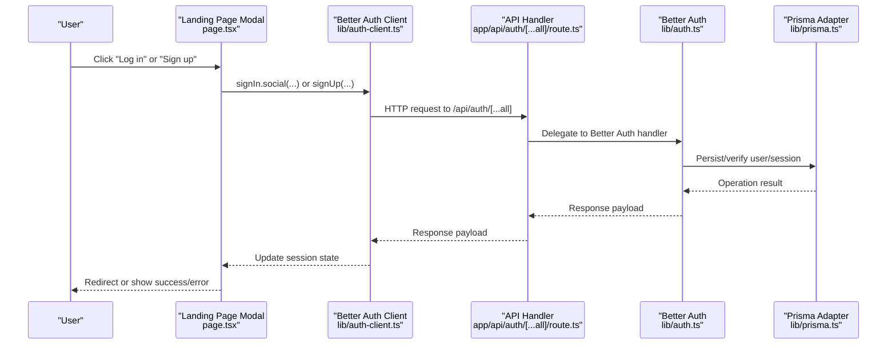
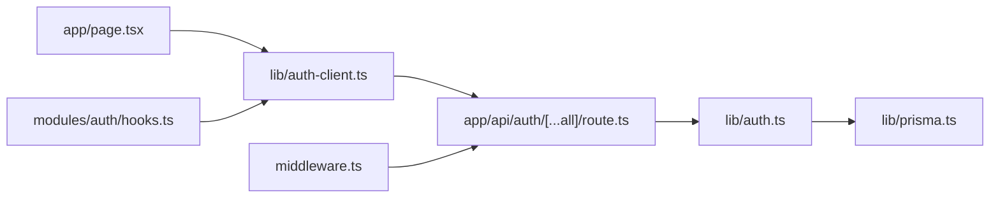
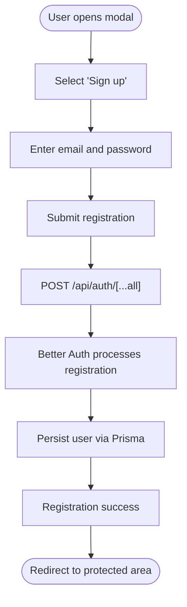
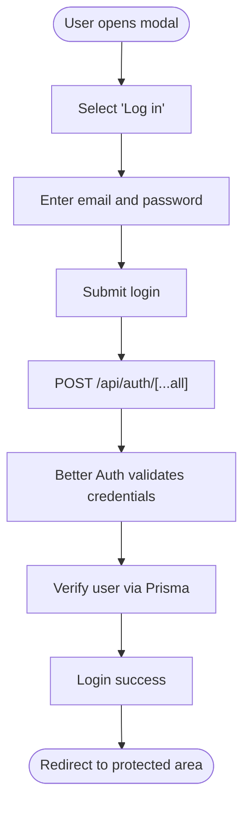
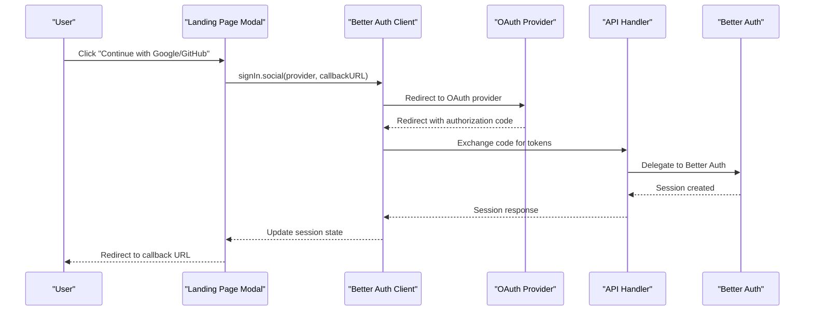

# User Registration and Login

<cite>
**Referenced Files in This Document**
- [auth.ts](file://lib/auth.ts)
- [auth-client.ts](file://lib/auth-client.ts)
- [prisma.ts](file://lib/prisma.ts)
- [route.ts](file://app/api/auth/[...all]/route.ts)
- [middleware.ts](file://middleware.ts)
- [page.tsx](file://app/page.tsx)
- [auth-layout.tsx](file://components/layouts/auth-layout.tsx)
- [hooks.ts](file://modules/auth/hooks.ts)
- [types.ts](file://modules/auth/types.ts)
- [constants.ts](file://modules/auth/constants.ts)
- [utils.ts](file://modules/auth/utils.ts)
</cite>

## Table of Contents
1. [Introduction](#introduction)
2. [Project Structure](#project-structure)
3. [Core Components](#core-components)
4. [Architecture Overview](#architecture-overview)
5. [Detailed Component Analysis](#detailed-component-analysis)
6. [Dependency Analysis](#dependency-analysis)
7. [Performance Considerations](#performance-considerations)
8. [Troubleshooting Guide](#troubleshooting-guide)
9. [Conclusion](#conclusion)
10. [Appendices](#appendices)

## Introduction
This document explains the user registration and login functionality implemented in the project. It covers the complete authentication workflow, including email/password registration, login processes, password validation, and account verification. It also documents the implementation of user registration hooks, form handling, validation logic, login state management, session creation, and user profile initialization. Practical examples of registration forms, login components, and error handling patterns are included, along with security considerations for password storage, validation rules, and account security measures. Guidance is provided on customizing registration flows and handling edge cases.

## Project Structure
Authentication in this project is built on Better Auth with a Prisma adapter. The system integrates:
- A server-side Better Auth configuration that enables email/password and social providers.
- A client-side Better Auth React client for session management and UI interactions.
- Middleware enforcing authentication gating for protected routes.
- An API route handler that exposes Better Auth’s handlers.
- A landing page modal that triggers OAuth-based sign-in and provides a link to sign-up.

```mermaid
graph TB
subgraph "Client"
UI["Landing Page Modal<br/>page.tsx"]
Hooks["Auth Hooks<br/>modules/auth/hooks.ts"]
Client["Better Auth Client<br/>lib/auth-client.ts"]
end
subgraph "Server"
API["API Route Handler<br/>app/api/auth/[...all]/route.ts"]
Auth["Better Auth Config<br/>lib/auth.ts"]
DB["Prisma Client<br/>lib/prisma.ts"]
end
subgraph "Middleware"
MW["Next.js Middleware<br/>middleware.ts"]
end
UI --> Client
Hooks --> Client
Client --> API
API --> Auth
Auth --> DB
MW --> API
```

**Diagram sources**
- [page.tsx](file://app/page.tsx#L515-L679)
- [auth-client.ts](file://lib/auth-client.ts#L1-L8)
- [hooks.ts](file://modules/auth/hooks.ts#L1-L29)
- [route.ts](file://app/api/auth/[...all]/route.ts#L1-L7)
- [auth.ts](file://lib/auth.ts#L1-L25)
- [prisma.ts](file://lib/prisma.ts#L1-L14)
- [middleware.ts](file://middleware.ts#L1-L95)

**Section sources**
- [auth.ts](file://lib/auth.ts#L1-L25)
- [auth-client.ts](file://lib/auth-client.ts#L1-L8)
- [route.ts](file://app/api/auth/[...all]/route.ts#L1-L7)
- [middleware.ts](file://middleware.ts#L1-L95)
- [page.tsx](file://app/page.tsx#L515-L679)

## Core Components
- Better Auth server configuration enabling email/password and social providers, with Prisma adapter and environment-driven secrets and URLs.
- Client-side Better Auth React client exposing sign-in, sign-out, sign-up, and session hooks.
- Middleware that enforces authentication gating for protected routes and redirects unauthenticated users to the login modal.
- API route handler that forwards requests to Better Auth handlers.
- Landing page modal that triggers OAuth-based sign-in and displays terms/privacy links.

Key responsibilities:
- Email/password registration and login via Better Auth.
- Social sign-in with Google and GitHub.
- Session creation and persistence.
- Protected route enforcement.
- User display helpers and verification checks.

**Section sources**
- [auth.ts](file://lib/auth.ts#L5-L24)
- [auth-client.ts](file://lib/auth-client.ts#L1-L8)
- [route.ts](file://app/api/auth/[...all]/route.ts#L1-L7)
- [middleware.ts](file://middleware.ts#L4-L81)
- [page.tsx](file://app/page.tsx#L515-L679)

## Architecture Overview
The authentication architecture follows a client-server split:
- Client: React components and hooks manage UI and session state.
- Server: Better Auth handles authentication logic, sessions, and database operations via Prisma.
- Middleware: Enforces route-level access control and redirects.



**Diagram sources**
- [page.tsx](file://app/page.tsx#L215-L229)
- [auth-client.ts](file://lib/auth-client.ts#L1-L8)
- [route.ts](file://app/api/auth/[...all]/route.ts#L1-L7)
- [auth.ts](file://lib/auth.ts#L1-L25)
- [prisma.ts](file://lib/prisma.ts#L1-L14)

## Detailed Component Analysis

### Better Auth Server Configuration
- Enables email/password authentication.
- Configures Google and GitHub as social providers using environment variables.
- Uses Prisma adapter with PostgreSQL provider.
- Sets secret, base URL, and database adapter.

Security and operational notes:
- Secrets and URLs are environment-driven.
- Prisma adapter manages user and session persistence.

**Section sources**
- [auth.ts](file://lib/auth.ts#L5-L24)
- [prisma.ts](file://lib/prisma.ts#L1-L14)

### API Route Handler
- Exposes Better Auth handlers for GET and POST.
- Runs in Node.js runtime.
- Delegates all authentication operations to Better Auth.

**Section sources**
- [route.ts](file://app/api/auth/[...all]/route.ts#L1-L7)

### Client-Side Authentication Client
- Creates a Better Auth React client pointing to the configured base URL.
- Exposes sign-in, sign-out, sign-up, and session hooks.

Integration pattern:
- Use the client to trigger OAuth flows and manage session state in components.

**Section sources**
- [auth-client.ts](file://lib/auth-client.ts#L1-L8)

### Authentication Hooks
- Provides a hook to access current session state and user data.
- Provides a hook to enforce authentication requirements in components.

Usage patterns:
- Wrap protected components with the require-auth hook to block unauthenticated access.
- Use the auth hook to conditionally render UI based on authentication state.

**Section sources**
- [hooks.ts](file://modules/auth/hooks.ts#L9-L28)

### Landing Page Modal and OAuth Sign-In
- Presents a modal with “Log in” and “Sign up” actions.
- Supports OAuth via Google and GitHub.
- Displays terms and privacy links.
- Triggers Better Auth social sign-in with a callback URL.

Error handling:
- Displays generic errors for OAuth failures and prevents concurrent requests.

**Section sources**
- [page.tsx](file://app/page.tsx#L515-L679)

### Middleware-Based Access Control
- Defines public, auth, and protected routes.
- Validates sessions by calling the Better Auth session endpoint.
- Redirects unauthenticated users to the login modal with a callback URL.
- Redirects authenticated users away from auth routes.

Behavior highlights:
- Skips API and static routes.
- Uses a dedicated session check endpoint for accurate auth state.

**Section sources**
- [middleware.ts](file://middleware.ts#L4-L81)

### Authentication Types and Constants
- Defines User, Session, SignInCredentials, SignUpCredentials, and AuthResponse types.
- Declares route constants for sign-in, sign-up, sign-out, verify-email, forgot-password, reset-password, protected routes, and public routes.

These types and constants standardize the shape of authentication data and route definitions across the application.

**Section sources**
- [types.ts](file://modules/auth/types.ts#L5-L36)
- [constants.ts](file://modules/auth/constants.ts#L5-L24)

### User Utility Functions
- Computes display name from user profile or email.
- Extracts initials for user avatars.
- Checks email verification status.

These utilities support consistent user presentation and verification checks.

**Section sources**
- [utils.ts](file://modules/auth/utils.ts#L7-L28)

### Authentication Layout
- Provides a reusable layout for auth pages with branding and footer links.

**Section sources**
- [auth-layout.tsx](file://components/layouts/auth-layout.tsx#L6-L28)

## Dependency Analysis
The authentication system exhibits clear separation of concerns:
- Client depends on the Better Auth React client.
- API route handler depends on Better Auth.
- Better Auth depends on Prisma adapter and the database.
- Middleware depends on the API route handler to validate sessions.



**Diagram sources**
- [auth-client.ts](file://lib/auth-client.ts#L1-L8)
- [route.ts](file://app/api/auth/[...all]/route.ts#L1-L7)
- [auth.ts](file://lib/auth.ts#L1-L25)
- [prisma.ts](file://lib/prisma.ts#L1-L14)
- [middleware.ts](file://middleware.ts#L28-L42)
- [page.tsx](file://app/page.tsx#L515-L679)
- [hooks.ts](file://modules/auth/hooks.ts#L7-L10)

**Section sources**
- [auth-client.ts](file://lib/auth-client.ts#L1-L8)
- [route.ts](file://app/api/auth/[...all]/route.ts#L1-L7)
- [auth.ts](file://lib/auth.ts#L1-L25)
- [prisma.ts](file://lib/prisma.ts#L1-L14)
- [middleware.ts](file://middleware.ts#L28-L42)
- [page.tsx](file://app/page.tsx#L515-L679)
- [hooks.ts](file://modules/auth/hooks.ts#L7-L10)

## Performance Considerations
- Session validation in middleware is lightweight, using a single API call to fetch session state.
- OAuth flows are client-initiated and offload heavy lifting to Better Auth on the server.
- Prisma logging is reduced in production to minimize overhead.
- Consider caching session state on the client to reduce repeated fetches during navigation.

## Troubleshooting Guide
Common issues and resolutions:
- Missing environment variables for Better Auth or social providers cause configuration failures. Ensure all required environment variables are present.
- OAuth failures display a generic error message; verify provider credentials and callback URLs.
- Protected routes redirect unauthenticated users to the login modal with a callback URL; confirm middleware matcher and route definitions.
- Session validation relies on a dedicated endpoint; ensure the API route handler is reachable and the Better Auth base URL is correctly configured.

Operational checks:
- Verify that the API route handler is mounted and accessible.
- Confirm that the Prisma client connects to the database.
- Ensure cookies are accepted and not blocked by browser policies.

**Section sources**
- [auth.ts](file://lib/auth.ts#L12-L24)
- [page.tsx](file://app/page.tsx#L609-L612)
- [middleware.ts](file://middleware.ts#L65-L78)
- [route.ts](file://app/api/auth/[...all]/route.ts#L1-L7)
- [prisma.ts](file://lib/prisma.ts#L9-L11)

## Conclusion
The authentication system leverages Better Auth with a Prisma adapter to provide robust email/password and social sign-in capabilities. Client-side hooks and a middleware-based access control model deliver a secure and user-friendly experience. The modular design allows for straightforward customization of registration flows, error handling, and route protection.

## Appendices

### Registration and Login Workflows

#### Email/Password Registration Flow


**Diagram sources**
- [page.tsx](file://app/page.tsx#L515-L679)
- [route.ts](file://app/api/auth/[...all]/route.ts#L1-L7)
- [auth.ts](file://lib/auth.ts#L9-L11)
- [prisma.ts](file://lib/prisma.ts#L1-L14)

#### Email/Password Login Flow


**Diagram sources**
- [page.tsx](file://app/page.tsx#L515-L679)
- [route.ts](file://app/api/auth/[...all]/route.ts#L1-L7)
- [auth.ts](file://lib/auth.ts#L9-L11)
- [prisma.ts](file://lib/prisma.ts#L1-L14)

#### Social Sign-In Flow


**Diagram sources**
- [page.tsx](file://app/page.tsx#L215-L229)
- [auth-client.ts](file://lib/auth-client.ts#L1-L8)
- [route.ts](file://app/api/auth/[...all]/route.ts#L1-L7)
- [auth.ts](file://lib/auth.ts#L12-L21)

### Password Validation and Security
- Password validation is handled by Better Auth; ensure environment variables for minimum length and complexity are configured appropriately.
- Passwords are securely hashed and stored via the Prisma adapter.
- Session tokens are managed server-side and transmitted via secure cookies.

Best practices:
- Enforce strong password policies in Better Auth configuration.
- Use HTTPS in production to protect cookies.
- Implement rate limiting for authentication endpoints.

**Section sources**
- [auth.ts](file://lib/auth.ts#L9-L11)
- [prisma.ts](file://lib/prisma.ts#L1-L14)

### Account Verification
- Email verification status is represented in the user model and utility functions.
- Implement a verification flow by linking to the verification route constant and updating user records accordingly.

**Section sources**
- [types.ts](file://modules/auth/types.ts#L10-L10)
- [utils.ts](file://modules/auth/utils.ts#L26-L28)
- [constants.ts](file://modules/auth/constants.ts#L9-L9)

### Customizing Registration Flows
- Add custom fields to the sign-up credentials type and pass them through Better Auth hooks.
- Extend the landing page modal to collect additional information during sign-up.
- Customize middleware to enforce additional checks after successful registration.

**Section sources**
- [types.ts](file://modules/auth/types.ts#L25-L29)
- [page.tsx](file://app/page.tsx#L515-L679)
- [middleware.ts](file://middleware.ts#L65-L78)

### Edge Cases and Error Handling Patterns
- OAuth failures: Display a user-friendly error and prevent concurrent requests.
- Missing session cookies: Middleware redirects to the login modal with a callback URL.
- Protected routes: Authenticated users are redirected away from auth routes.

**Section sources**
- [page.tsx](file://app/page.tsx#L609-L612)
- [middleware.ts](file://middleware.ts#L65-L78)