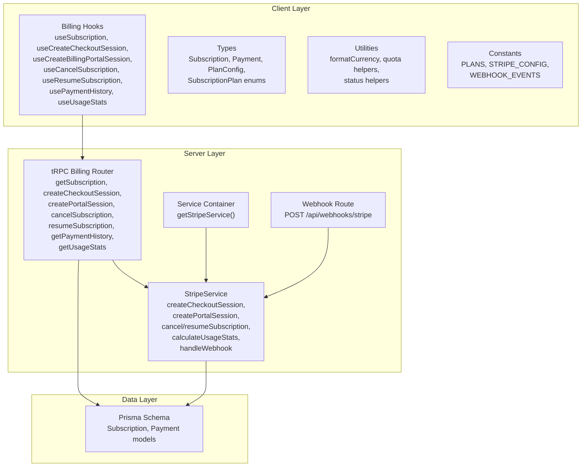
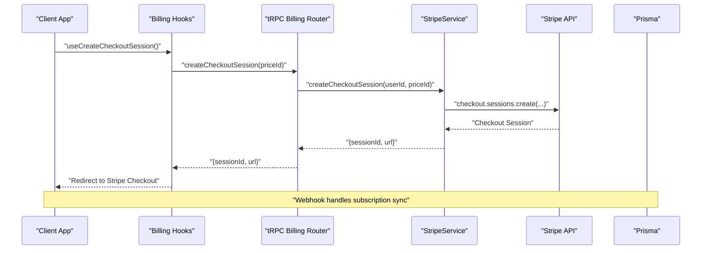
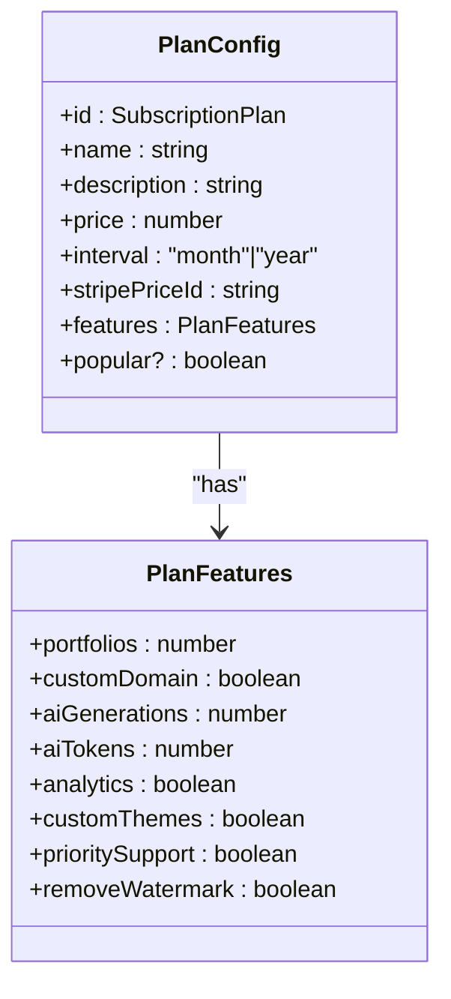
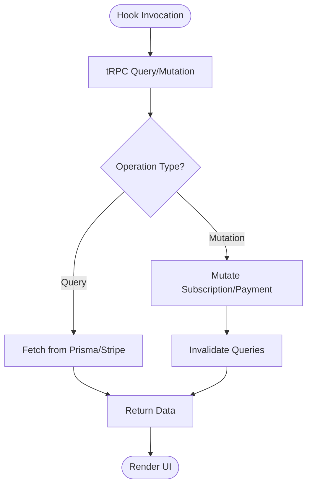
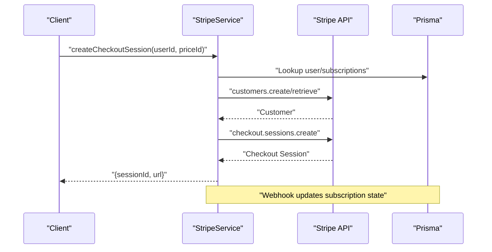
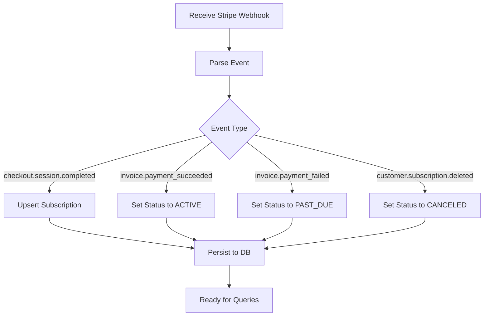
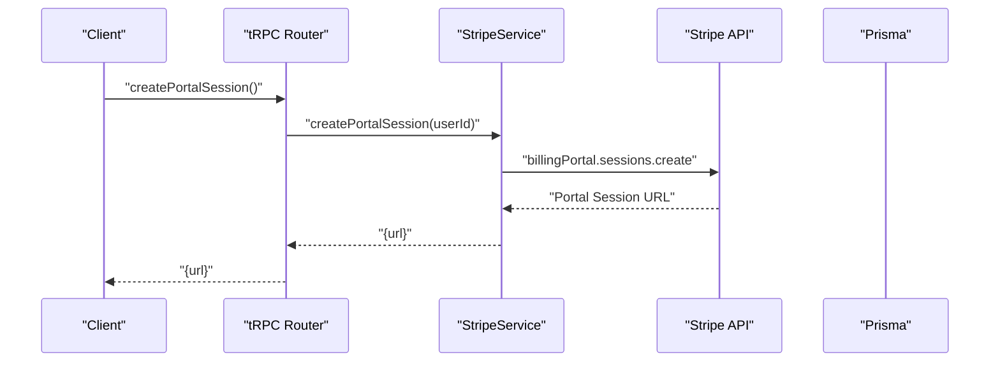
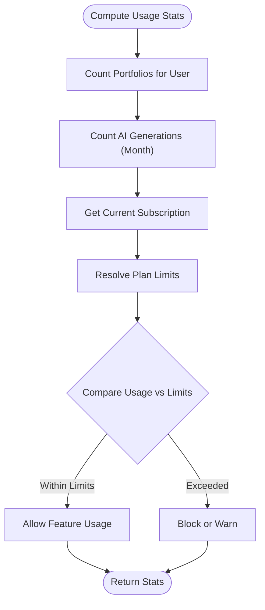
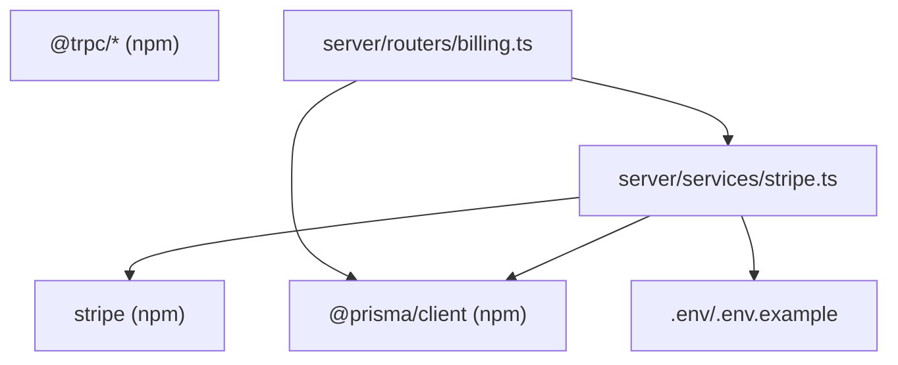

# Billing and Subscription System

<cite>
**Referenced Files in This Document**
- [modules/billing/index.ts](file://modules/billing/index.ts)
- [modules/billing/hooks.ts](file://modules/billing/hooks.ts)
- [modules/billing/types.ts](file://modules/billing/types.ts)
- [modules/billing/utils.ts](file://modules/billing/utils.ts)
- [modules/billing/constants.ts](file://modules/billing/constants.ts)
- [server/routers/billing.ts](file://server/routers/billing.ts)
- [server/services/stripe.ts](file://server/services/stripe.ts)
- [server/services/index.ts](file://server/services/index.ts)
- [app/api/webhooks/stripe/route.ts](file://app/api/webhooks/stripe/route.ts)
- [prisma/schema.prisma](file://prisma/schema.prisma)
- [package.json](file://package.json)
- [.env.example](file://.env.example)
</cite>

## Table of Contents
1. [Introduction](#introduction)
2. [Project Structure](#project-structure)
3. [Core Components](#core-components)
4. [Architecture Overview](#architecture-overview)
5. [Detailed Component Analysis](#detailed-component-analysis)
6. [Dependency Analysis](#dependency-analysis)
7. [Performance Considerations](#performance-considerations)
8. [Troubleshooting Guide](#troubleshooting-guide)
9. [Conclusion](#conclusion)
10. [Appendices](#appendices)

## Introduction
This document provides comprehensive billing and subscription system documentation for Smartfolio. It covers Stripe integration, subscription plans, payment processing workflows, usage-based billing, webhook handling, subscription lifecycle management, payment failure recovery, tax and currency handling, international payment support, and guidance for customizing and extending billing features.

## Project Structure
Smartfolio organizes billing functionality across client hooks, server-side tRPC routers, Stripe service integration, and Prisma data models. The system integrates Stripe Checkout for subscription creation, Stripe Billing Portal for customer management, and webhooks for real-time synchronization of subscription and payment events.



**Diagram sources**
- [modules/billing/hooks.ts](file://modules/billing/hooks.ts#L10-L90)
- [modules/billing/types.ts](file://modules/billing/types.ts#L26-L83)
- [modules/billing/utils.ts](file://modules/billing/utils.ts#L8-L101)
- [modules/billing/constants.ts](file://modules/billing/constants.ts#L7-L80)
- [server/routers/billing.ts](file://server/routers/billing.ts#L5-L70)
- [server/services/index.ts](file://server/services/index.ts#L38-L52)
- [server/services/stripe.ts](file://server/services/stripe.ts#L13-L294)
- [app/api/webhooks/stripe/route.ts](file://app/api/webhooks/stripe/route.ts#L6-L37)
- [prisma/schema.prisma](file://prisma/schema.prisma#L172-L208)

**Section sources**
- [modules/billing/index.ts](file://modules/billing/index.ts#L10-L14)
- [modules/billing/hooks.ts](file://modules/billing/hooks.ts#L10-L90)
- [modules/billing/types.ts](file://modules/billing/types.ts#L26-L83)
- [modules/billing/utils.ts](file://modules/billing/utils.ts#L8-L101)
- [modules/billing/constants.ts](file://modules/billing/constants.ts#L7-L80)
- [server/routers/billing.ts](file://server/routers/billing.ts#L5-L70)
- [server/services/stripe.ts](file://server/services/stripe.ts#L13-L294)
- [server/services/index.ts](file://server/services/index.ts#L38-L52)
- [app/api/webhooks/stripe/route.ts](file://app/api/webhooks/stripe/route.ts#L6-L37)
- [prisma/schema.prisma](file://prisma/schema.prisma#L172-L208)

## Core Components
- Billing module exports hooks, types, utilities, and constants for client-side consumption.
- tRPC router exposes protected procedures for subscription queries and mutations, delegating Stripe operations to the Stripe service.
- Stripe service encapsulates Stripe SDK interactions, customer management, subscription lifecycle, usage statistics calculation, and webhook handling.
- Prisma models define Subscription and Payment entities with appropriate relations and indexes.

**Section sources**
- [modules/billing/index.ts](file://modules/billing/index.ts#L10-L14)
- [server/routers/billing.ts](file://server/routers/billing.ts#L7-L69)
- [server/services/stripe.ts](file://server/services/stripe.ts#L24-L113)
- [prisma/schema.prisma](file://prisma/schema.prisma#L172-L208)

## Architecture Overview
The billing system follows a layered architecture:
- Client layer: React hooks for fetching subscription state, creating checkout sessions, accessing billing portal, canceling/resuming subscriptions, retrieving payment history, and computing usage statistics.
- Server layer: tRPC router procedures that validate requests and delegate to the Stripe service.
- Service layer: Stripe service implementing Stripe SDK operations, customer synchronization, subscription updates, usage calculations, and webhook dispatching.
- Data layer: Prisma models persisting subscription and payment records.



**Diagram sources**
- [modules/billing/hooks.ts](file://modules/billing/hooks.ts#L20-L29)
- [server/routers/billing.ts](file://server/routers/billing.ts#L16-L30)
- [server/services/stripe.ts](file://server/services/stripe.ts#L24-L52)
- [app/api/webhooks/stripe/route.ts](file://app/api/webhooks/stripe/route.ts#L6-L37)

## Detailed Component Analysis

### Subscription Plans and Pricing Tiers
Smartfolio defines three subscription plans with distinct feature sets and Stripe price identifiers. Pricing is stored in cents for precision and currency formatting is handled via utilities.

- Free plan: Limited quotas for portfolios and AI generations; suitable for onboarding.
- Pro plan: Monthly billing with higher quotas and premium features.
- Enterprise plan: Monthly billing with enterprise-grade quotas and features.



**Diagram sources**
- [modules/billing/types.ts](file://modules/billing/types.ts#L54-L74)
- [modules/billing/types.ts](file://modules/billing/types.ts#L54-L63)
- [modules/billing/constants.ts](file://modules/billing/constants.ts#L7-L63)

**Section sources**
- [modules/billing/constants.ts](file://modules/billing/constants.ts#L7-L63)
- [modules/billing/types.ts](file://modules/billing/types.ts#L54-L74)

### Client-Side Billing Hooks
The client-side hooks provide a declarative interface to manage billing operations:
- useSubscription: Fetches current subscription state.
- useCreateCheckoutSession: Creates Stripe Checkout sessions for plan selection.
- useCreateBillingPortalSession: Generates Stripe Billing Portal sessions for customer self-service.
- useCancelSubscription/useResumeSubscription: Toggle cancellation at period end.
- usePaymentHistory: Retrieves historical payments.
- useUsageStats: Computes usage against plan limits.



**Diagram sources**
- [modules/billing/hooks.ts](file://modules/billing/hooks.ts#L10-L90)

**Section sources**
- [modules/billing/hooks.ts](file://modules/billing/hooks.ts#L10-L90)

### Stripe Integration and Customer Management
The Stripe service manages customer creation/retrieval, checkout sessions, billing portal sessions, subscription cancellation/resumption, and usage statistics.

- Customer management: Ensures a Stripe customer exists per user and synchronizes IDs in the database.
- Checkout sessions: Creates subscription-mode sessions with success/cancel URLs and metadata.
- Billing portal: Generates customer-facing portal sessions for payment method and subscription management.
- Subscription lifecycle: Updates cancel_at_period_end flags and persists state changes.
- Usage statistics: Counts portfolios and AI generations for the current month and compares against plan limits.



**Diagram sources**
- [server/services/stripe.ts](file://server/services/stripe.ts#L24-L52)
- [server/services/stripe.ts](file://server/services/stripe.ts#L172-L209)

**Section sources**
- [server/services/stripe.ts](file://server/services/stripe.ts#L24-L113)
- [server/services/stripe.ts](file://server/services/stripe.ts#L172-L209)

### Webhook Handling and Subscription Lifecycle
Webhooks keep the local database synchronized with Stripe events:
- checkout.session.completed: Upserts subscription with plan, Stripe identifiers, and billing periods.
- invoice.payment_succeeded: Promotes incomplete/past-due subscriptions to active.
- invoice.payment_failed: Marks subscriptions as past due.
- customer.subscription.deleted: Marks subscriptions as canceled.



**Diagram sources**
- [app/api/webhooks/stripe/route.ts](file://app/api/webhooks/stripe/route.ts#L6-L37)
- [server/services/stripe.ts](file://server/services/stripe.ts#L115-L130)
- [server/services/stripe.ts](file://server/services/stripe.ts#L211-L293)
- [modules/billing/constants.ts](file://modules/billing/constants.ts#L73-L80)

**Section sources**
- [app/api/webhooks/stripe/route.ts](file://app/api/webhooks/stripe/route.ts#L6-L37)
- [server/services/stripe.ts](file://server/services/stripe.ts#L115-L130)
- [server/services/stripe.ts](file://server/services/stripe.ts#L211-L293)
- [modules/billing/constants.ts](file://modules/billing/constants.ts#L73-L80)

### Payment Processing Workflows
- Checkout session creation: Redirects users to Stripe-hosted checkout for payment collection.
- Billing portal sessions: Allows customers to manage payment methods and subscriptions.
- Payment history: Lists all payments associated with a user, including amounts and statuses.



**Diagram sources**
- [server/routers/billing.ts](file://server/routers/billing.ts#L32-L37)
- [server/services/stripe.ts](file://server/services/stripe.ts#L54-L65)

**Section sources**
- [server/routers/billing.ts](file://server/routers/billing.ts#L32-L37)
- [server/services/stripe.ts](file://server/services/stripe.ts#L54-L65)

### Usage-Based Billing and Quota Management
Usage statistics are computed monthly for portfolios and AI generations, compared against plan limits to enforce quotas.



**Diagram sources**
- [server/services/stripe.ts](file://server/services/stripe.ts#L132-L170)
- [modules/billing/utils.ts](file://modules/billing/utils.ts#L40-L54)

**Section sources**
- [server/services/stripe.ts](file://server/services/stripe.ts#L132-L170)
- [modules/billing/utils.ts](file://modules/billing/utils.ts#L40-L54)

### Data Models and Relationships
Prisma models define the subscription and payment domains with foreign keys and indexes for efficient querying.

```mermaid
erDiagram
USER {
string id PK
string email UK
string name
string role
datetime createdAt
datetime updatedAt
}
SUBSCRIPTION {
string id PK
string userId UK FK
string plan
string status
string stripeCustomerId
string stripeSubscriptionId
string stripePriceId
datetime currentPeriodStart
datetime currentPeriodEnd
boolean cancelAtPeriodEnd
datetime trialEnd
datetime createdAt
datetime updatedAt
}
PAYMENT {
string id PK
string userId FK
string subscriptionId FK
string stripePaymentIntentId
int amount
string currency
string status
string description
datetime createdAt
}
USER ||--o| SUBSCRIPTION : "has one"
USER ||--o| PAYMENT : "has many"
SUBSCRIPTION ||--o| PAYMENT : "optional relation"
```

**Diagram sources**
- [prisma/schema.prisma](file://prisma/schema.prisma#L17-L36)
- [prisma/schema.prisma](file://prisma/schema.prisma#L172-L191)
- [prisma/schema.prisma](file://prisma/schema.prisma#L193-L208)

**Section sources**
- [prisma/schema.prisma](file://prisma/schema.prisma#L17-L36)
- [prisma/schema.prisma](file://prisma/schema.prisma#L172-L191)
- [prisma/schema.prisma](file://prisma/schema.prisma#L193-L208)

## Dependency Analysis
The billing system relies on Stripe SDK, Prisma ORM, and tRPC for remote procedure calls. Environment variables configure Stripe keys and price IDs.



**Diagram sources**
- [package.json](file://package.json#L34-L34)
- [package.json](file://package.json#L19-L19)
- [package.json](file://package.json#L24-L24)
- [server/services/stripe.ts](file://server/services/stripe.ts#L1-L22)
- [server/routers/billing.ts](file://server/routers/billing.ts#L1-L4)
- [.env.example](file://.env.example#L24-L28)

**Section sources**
- [package.json](file://package.json#L16-L37)
- [server/services/stripe.ts](file://server/services/stripe.ts#L1-L22)
- [server/routers/billing.ts](file://server/routers/billing.ts#L1-L4)
- [.env.example](file://.env.example#L24-L28)

## Performance Considerations
- Minimize database writes by batching Stripe webhook updates and using upserts where appropriate.
- Cache frequently accessed plan features and limits to reduce repeated computations.
- Use Prisma indexes on subscription status and user ID for fast lookups during billing operations.
- Offload heavy usage computations to scheduled jobs if needed to avoid blocking request handlers.

## Troubleshooting Guide
Common issues and resolutions:
- Missing Stripe signature in webhook handler: Ensure webhook secret is configured and signature header is present.
- No active subscription found when canceling/resuming: Verify that the user has an active Stripe subscription ID stored.
- Currency formatting inconsistencies: Use the provided currency formatter utility to ensure consistent display.
- Payment failure states: Webhooks set subscription status to past due; ensure clients reflect this state and offer resubscription options.

**Section sources**
- [app/api/webhooks/stripe/route.ts](file://app/api/webhooks/stripe/route.ts#L11-L16)
- [server/services/stripe.ts](file://server/services/stripe.ts#L67-L89)
- [modules/billing/utils.ts](file://modules/billing/utils.ts#L8-L13)
- [server/services/stripe.ts](file://server/services/stripe.ts#L266-L280)

## Conclusion
Smartfolio’s billing system integrates Stripe Checkout, Billing Portal, and webhooks to provide a robust subscription and payment infrastructure. The modular design separates concerns across client hooks, tRPC routers, and service classes, while Prisma ensures reliable persistence. The system supports plan-based quotas, usage statistics, and lifecycle management with clear pathways for customization and extension.

## Appendices

### Practical Examples
- Pricing tiers: Configure monthly prices for Pro and Enterprise plans using Stripe price IDs.
- Billing cycles: Use Stripe billing periods to compute renewal dates and grace periods.
- Revenue tracking: Aggregate payments by status and currency to monitor financial metrics.

### Customization and Extension Guidance
- Add new plans: Extend the plan configuration array and update feature flags accordingly.
- International support: Configure Stripe multi-currency and localization settings; adjust currency formatting utilities.
- Tax handling: Enable Stripe tax settings and synchronize tax rates via webhooks.
- Usage-based billing: Expand usage statistics to include additional metrics and enforce stricter quotas.