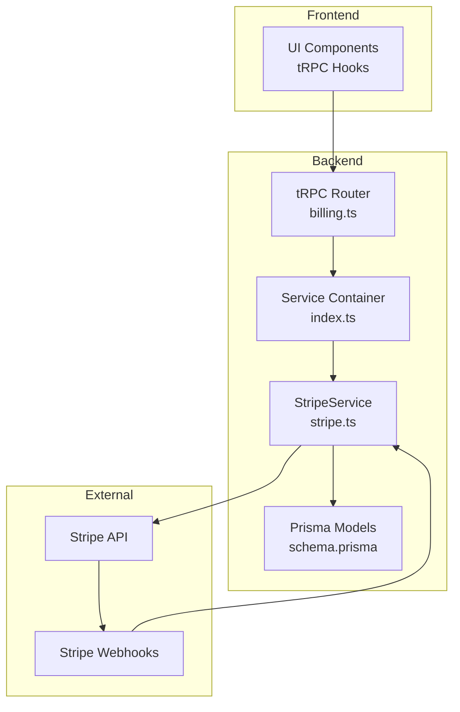
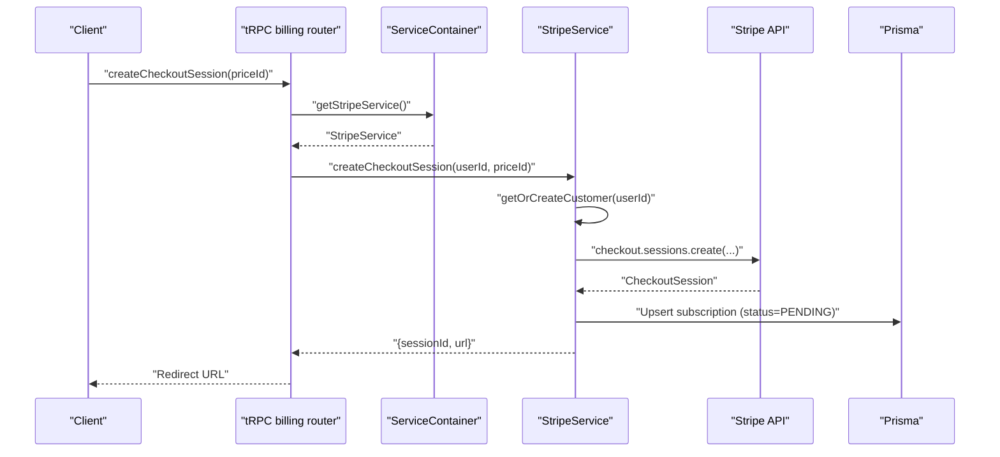
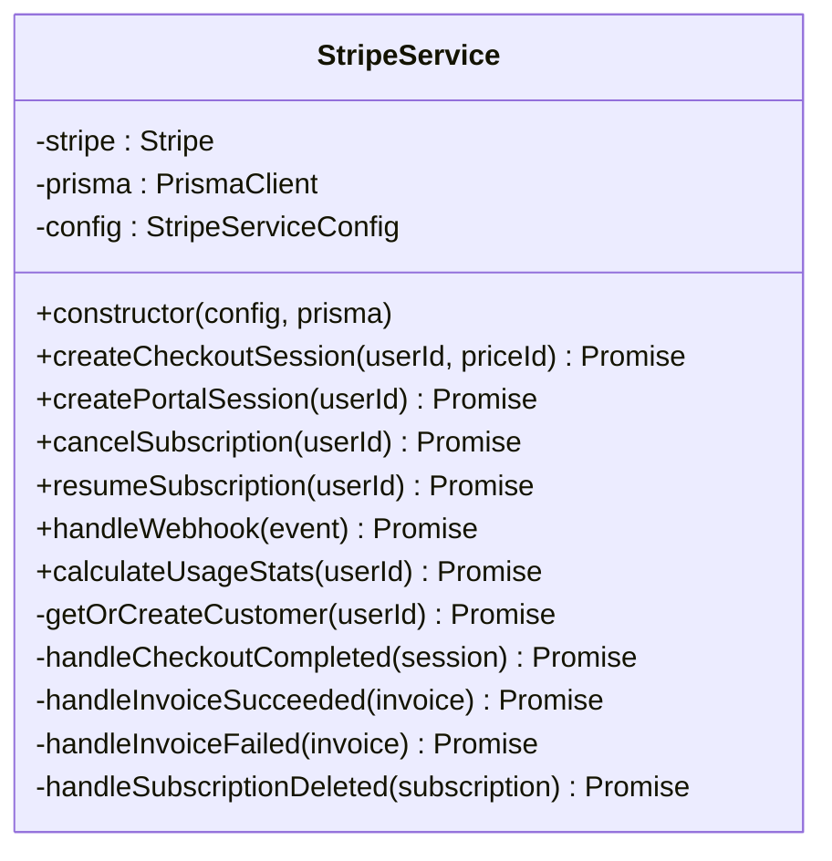
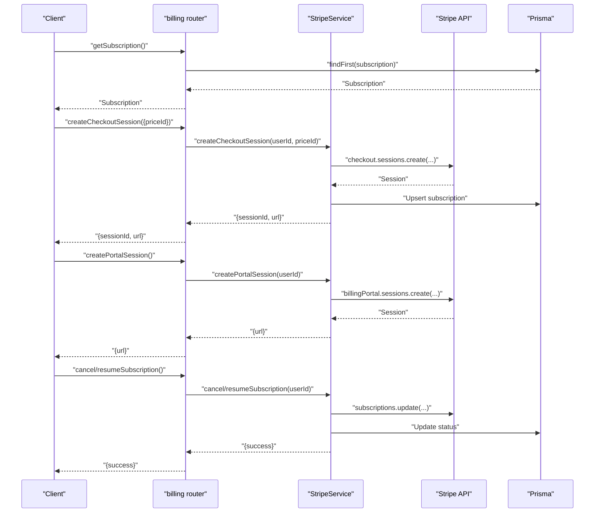
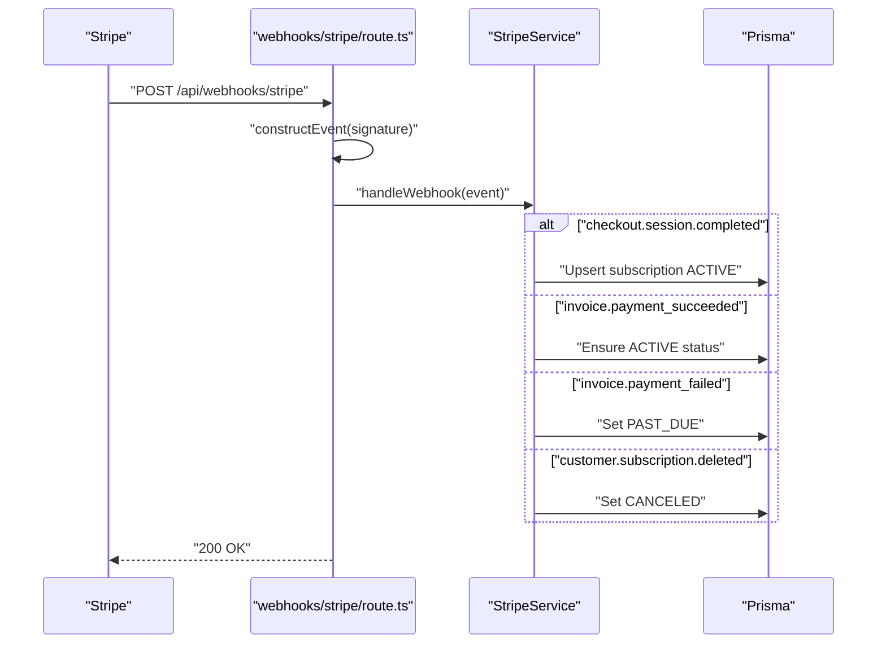
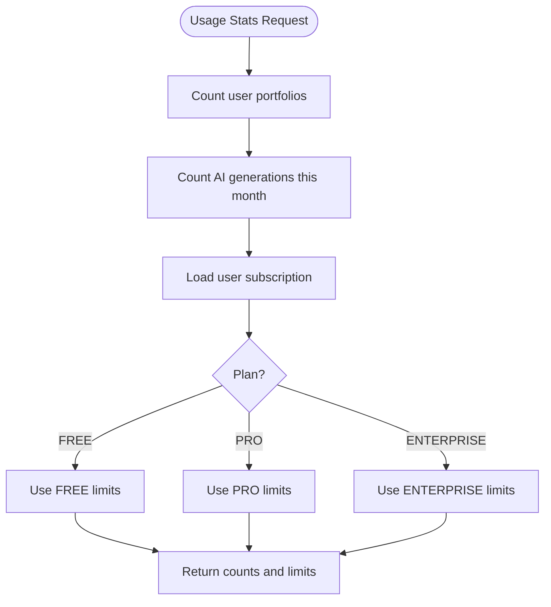
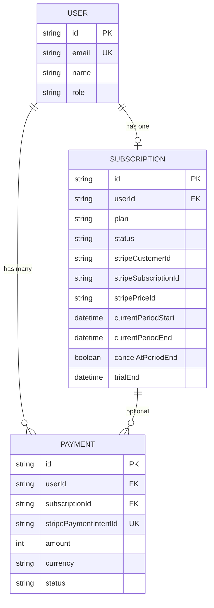
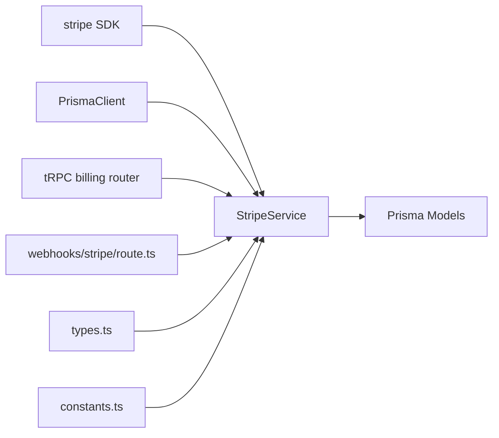

# Payment Processing

<cite>
**Referenced Files in This Document**
- [stripe.ts](file://server/services/stripe.ts)
- [route.ts](file://app/api/webhooks/stripe/route.ts)
- [billing.ts](file://server/routers/billing.ts)
- [hooks.ts](file://modules/billing/hooks.ts)
- [types.ts](file://modules/billing/types.ts)
- [constants.ts](file://modules/billing/constants.ts)
- [utils.ts](file://modules/billing/utils.ts)
- [schema.prisma](file://prisma/schema.prisma)
- [index.ts](file://server/services/index.ts)
- [package.json](file://package.json)
</cite>

## Table of Contents
1. [Introduction](#introduction)
2. [Project Structure](#project-structure)
3. [Core Components](#core-components)
4. [Architecture Overview](#architecture-overview)
5. [Detailed Component Analysis](#detailed-component-analysis)
6. [Dependency Analysis](#dependency-analysis)
7. [Performance Considerations](#performance-considerations)
8. [Troubleshooting Guide](#troubleshooting-guide)
9. [Conclusion](#conclusion)
10. [Appendices](#appendices)

## Introduction
This document explains the payment processing implementation in the project, focusing on subscription-based payments via Stripe. It covers the payment flow from initiation to completion, transaction handling, and payment verification. It also documents accepted payment methods, currency handling, tax integration points, failure scenarios and retry strategies, recovery mechanisms, and PCI compliance considerations. Practical examples demonstrate creating payment intents, confirming payments, and handling refunds. Guidance is included for international support, multi-currency handling, regional preferences, and implementing custom payment processors.

## Project Structure
The payment system is implemented using Stripe for payment orchestration and tRPC for backend APIs. Webhooks are handled by a dedicated Next.js API route. Billing domain modules define types, constants, and utilities. Prisma models persist billing data.

**Diagram sources**
- [billing.ts](file://server/routers/billing.ts#L1-L71)
- [index.ts](file://server/services/index.ts#L38-L52)
- [stripe.ts](file://server/services/stripe.ts#L13-L22)
- [schema.prisma](file://prisma/schema.prisma#L172-L208)

**Section sources**
- [billing.ts](file://server/routers/billing.ts#L1-L71)
- [index.ts](file://server/services/index.ts#L1-L118)
- [stripe.ts](file://server/services/stripe.ts#L1-L294)
- [schema.prisma](file://prisma/schema.prisma#L172-L208)

## Core Components
- StripeService: Orchestrates Stripe interactions, manages customers, subscriptions, portal sessions, and webhook handling.
- tRPC Router (billing): Exposes protected procedures for creating checkout sessions, managing subscriptions, retrieving payment history, and usage statistics.
- Webhook Handler: Validates and processes Stripe webhooks to synchronize subscription states.
- Billing Domain Modules: Define types, constants, and utilities for plans, statuses, formatting, quotas, and labels.
- Prisma Models: Persist subscriptions and payments with Stripe identifiers and statuses.

Key responsibilities:
- Payment initiation: Create Stripe Checkout sessions for subscriptions.
- Customer lifecycle: Create or retrieve Stripe customers linked to user records.
- Subscription lifecycle: Create, cancel, and resume subscriptions; track status transitions.
- Webhook synchronization: Update local state based on Stripe events.
- Usage enforcement: Compute usage against plan limits.

**Section sources**
- [stripe.ts](file://server/services/stripe.ts#L13-L294)
- [billing.ts](file://server/routers/billing.ts#L1-L71)
- [route.ts](file://app/api/webhooks/stripe/route.ts#L1-L38)
- [types.ts](file://modules/billing/types.ts#L1-L84)
- [constants.ts](file://modules/billing/constants.ts#L1-L81)
- [utils.ts](file://modules/billing/utils.ts#L1-L102)
- [schema.prisma](file://prisma/schema.prisma#L172-L208)

## Architecture Overview
The payment flow integrates frontend, tRPC, StripeService, Stripe API, and Prisma. Webhooks keep local state synchronized with Stripe.

**Diagram sources**
- [billing.ts](file://server/routers/billing.ts#L16-L30)
- [index.ts](file://server/services/index.ts#L38-L52)
- [stripe.ts](file://server/services/stripe.ts#L24-L52)
- [schema.prisma](file://prisma/schema.prisma#L172-L191)

## Detailed Component Analysis

### StripeService
StripeService encapsulates all Stripe interactions:
- Customer management: Creates or retrieves Stripe customers and links them to user records.
- Checkout sessions: Initiates subscription purchases with card as the only payment method.
- Billing portal: Generates customer portal sessions for self-service management.
- Subscription lifecycle: Cancels or resumes subscriptions and updates local status.
- Webhook handling: Processes checkout completion, invoice success/failure, and subscription deletion to maintain consistency.

**Diagram sources**
- [stripe.ts](file://server/services/stripe.ts#L13-L294)

**Section sources**
- [stripe.ts](file://server/services/stripe.ts#L13-L294)

### tRPC Billing Router
The billing router exposes protected procedures for:
- Retrieving subscription details
- Creating checkout sessions
- Creating billing portal sessions
- Canceling and resuming subscriptions
- Fetching payment history and usage statistics

**Diagram sources**
- [billing.ts](file://server/routers/billing.ts#L1-L71)
- [stripe.ts](file://server/services/stripe.ts#L24-L113)
- [schema.prisma](file://prisma/schema.prisma#L172-L191)

**Section sources**
- [billing.ts](file://server/routers/billing.ts#L1-L71)

### Stripe Webhook Handler
The webhook handler validates signatures, constructs events, and delegates to StripeService for state synchronization.

**Diagram sources**
- [route.ts](file://app/api/webhooks/stripe/route.ts#L1-L38)
- [stripe.ts](file://server/services/stripe.ts#L115-L130)
- [stripe.ts](file://server/services/stripe.ts#L211-L293)
- [schema.prisma](file://prisma/schema.prisma#L172-L191)

**Section sources**
- [route.ts](file://app/api/webhooks/stripe/route.ts#L1-L38)
- [stripe.ts](file://server/services/stripe.ts#L115-L130)
- [stripe.ts](file://server/services/stripe.ts#L211-L293)

### Billing Domain Modules
- Types: Define enums for plans, statuses, and payment statuses, plus interfaces for subscriptions and payments.
- Constants: Define plan configurations, Stripe publishable keys, success/cancel URLs, trial period, and webhook event constants.
- Utils: Provide currency formatting, quota calculations, status labels/colors, and trial status helpers.

**Diagram sources**
- [stripe.ts](file://server/services/stripe.ts#L132-L170)
- [utils.ts](file://modules/billing/utils.ts#L40-L54)
- [constants.ts](file://modules/billing/constants.ts#L7-L63)

**Section sources**
- [types.ts](file://modules/billing/types.ts#L1-L84)
- [constants.ts](file://modules/billing/constants.ts#L1-L81)
- [utils.ts](file://modules/billing/utils.ts#L1-L102)
- [stripe.ts](file://server/services/stripe.ts#L132-L170)

### Prisma Models for Payments and Subscriptions
Prisma models capture Stripe identifiers, amounts, currencies, statuses, and timestamps. They link users to subscriptions and payments.

**Diagram sources**
- [schema.prisma](file://prisma/schema.prisma#L172-L208)

**Section sources**
- [schema.prisma](file://prisma/schema.prisma#L172-L208)

## Dependency Analysis
- StripeService depends on Stripe SDK and PrismaClient.
- tRPC billing router depends on ServiceContainer to obtain StripeService.
- Webhook route depends on Stripe SDK to construct events and delegates to StripeService.
- Billing domain modules depend on constants and types for plan definitions and status labels.
- Prisma models define relations between users, subscriptions, and payments.

**Diagram sources**
- [package.json](file://package.json#L34)
- [index.ts](file://server/services/index.ts#L38-L52)
- [stripe.ts](file://server/services/stripe.ts#L1-L22)
- [billing.ts](file://server/routers/billing.ts#L1-L71)
- [route.ts](file://app/api/webhooks/stripe/route.ts#L1-L38)
- [types.ts](file://modules/billing/types.ts#L1-L84)
- [constants.ts](file://modules/billing/constants.ts#L1-L81)

**Section sources**
- [package.json](file://package.json#L16-L37)
- [index.ts](file://server/services/index.ts#L1-L118)
- [stripe.ts](file://server/services/stripe.ts#L1-L22)
- [billing.ts](file://server/routers/billing.ts#L1-L71)
- [route.ts](file://app/api/webhooks/stripe/route.ts#L1-L38)
- [types.ts](file://modules/billing/types.ts#L1-L84)
- [constants.ts](file://modules/billing/constants.ts#L1-L81)

## Performance Considerations
- Minimize external calls: Cache Stripe customer retrieval and reuse identifiers.
- Batch operations: Combine subscription updates with database writes to reduce round-trips.
- Idempotency: Ensure webhook handlers are idempotent to avoid duplicate state changes.
- Rate limiting: Apply rate limits around sensitive operations like subscription changes.
- Currency handling: Store amounts in minor units (cents) to avoid floating-point errors.

## Troubleshooting Guide
Common issues and resolutions:
- Missing Stripe signature in webhook: The handler returns a 400 error when the signature header is absent. Verify webhook endpoint configuration and secret.
- No active subscription found during cancellation/resumption: The service throws an error if no Stripe subscription ID exists. Ensure prior successful checkout and webhook processing.
- Invoice payment failed: Local status transitions to PAST_DUE; confirm billing portal URL for retries.
- Checkout completion not reflected: Verify webhook delivery and event construction; ensure the correct webhook secret is configured.

Operational checks:
- Confirm environment variables for Stripe keys and price IDs are set.
- Validate webhook endpoint URL and signing secret in the Stripe dashboard.
- Inspect Prisma logs for subscription upserts after checkout completion.

**Section sources**
- [route.ts](file://app/api/webhooks/stripe/route.ts#L11-L16)
- [route.ts](file://app/api/webhooks/stripe/route.ts#L32-L36)
- [stripe.ts](file://server/services/stripe.ts#L67-L74)
- [stripe.ts](file://server/services/stripe.ts#L91-L98)
- [stripe.ts](file://server/services/stripe.ts#L266-L280)

## Conclusion
The payment system leverages Stripe for robust subscription management and tRPC for clean API boundaries. Webhooks keep local state consistent, while Prisma models persist Stripe identifiers and statuses. The design supports subscription lifecycle operations, usage-based enforcement, and webhook-driven reconciliation. For production, ensure proper PCI compliance, secure key management, and comprehensive monitoring of webhook delivery and payment events.

## Appendices

### Payment Method Acceptance and Currency Handling
- Accepted payment methods: Card payments via Stripe Checkout sessions.
- Currency: Stored in minor units (cents) with a default currency field; configure Stripe price IDs accordingly.
- Multi-currency: Stripe supports multiple currencies; configure price IDs per currency and ensure checkout sessions specify appropriate currency.

**Section sources**
- [stripe.ts](file://server/services/stripe.ts#L31-L46)
- [schema.prisma](file://prisma/schema.prisma#L198-L199)
- [constants.ts](file://modules/billing/constants.ts#L30-L51)

### Tax Calculation Integration
- Stripe tax support: Integrate Stripe Tax by enabling tax calculation in Stripe Dashboard and passing tax behavior parameters during checkout session creation.
- Local tracking: Extend the Payment model to include tax amounts and rates if needed for reporting.

**Section sources**
- [stripe.ts](file://server/services/stripe.ts#L31-L46)
- [schema.prisma](file://prisma/schema.prisma#L193-L208)

### Refund Processing
- Stripe refunds: Initiate refunds via the Stripe Dashboard or API; ensure refunds are processed against the originating payment intent.
- Status updates: Webhooks currently handle payment success/failure; extend to handle refund events to update Payment status to REFUNDED.

**Section sources**
- [types.ts](file://modules/billing/types.ts#L19-L24)
- [schema.prisma](file://prisma/schema.prisma#L193-L208)

### PCI Compliance and Secure Storage
- PCI DPA: Use Stripe-hosted payment surfaces (Checkout) to avoid card data handling.
- Tokenization: Stripe handles PCI-compliant card collection; do not store raw PAN or CVV.
- Secrets management: Store Stripe API keys and webhook secrets in environment variables; restrict access.

**Section sources**
- [route.ts](file://app/api/webhooks/stripe/route.ts#L20-L26)
- [index.ts](file://server/services/index.ts#L40-L49)

### International Support and Regional Preferences
- Country availability: Configure Stripe billing countries and regional pricing in Stripe Dashboard.
- Localization: Use Stripe’s localization features for checkout sessions; present localized pricing and terms.
- Currency conversion: Configure Stripe multi-currency pricing; ensure clients select appropriate currency during checkout.

**Section sources**
- [constants.ts](file://modules/billing/constants.ts#L30-L51)
- [stripe.ts](file://server/services/stripe.ts#L31-L46)

### Implementing Custom Payment Processors
- Adapter pattern: Add a new service similar to StripeService with the same interface for createCheckoutSession, createPortalSession, cancel/resumeSubscription, and handleWebhook.
- tRPC integration: Register the new service in ServiceContainer and expose equivalent procedures in the billing router.
- Webhook handling: Implement event mapping to the new processor’s event types and update local state consistently.

**Section sources**
- [index.ts](file://server/services/index.ts#L38-L52)
- [billing.ts](file://server/routers/billing.ts#L1-L71)
- [stripe.ts](file://server/services/stripe.ts#L115-L130)

### Practical Examples

- Create a checkout session:
  - Call the tRPC mutation to create a checkout session with a Stripe price ID.
  - Redirect the client to the returned URL for payment collection.
  - On completion, Stripe webhooks update subscription status.

- Confirm a payment:
  - Stripe confirms payment automatically; webhooks update local status to ACTIVE or PAST_DUE.
  - Use tRPC queries to fetch subscription and payment history.

- Handle a refund:
  - Initiate refund in Stripe; extend webhook handling to update Payment status to REFUNDED.
  - Invalidate tRPC caches to refresh UI state.

**Section sources**
- [billing.ts](file://server/routers/billing.ts#L16-L30)
- [route.ts](file://app/api/webhooks/stripe/route.ts#L18-L30)
- [stripe.ts](file://server/services/stripe.ts#L211-L293)
- [hooks.ts](file://modules/billing/hooks.ts#L10-L90)