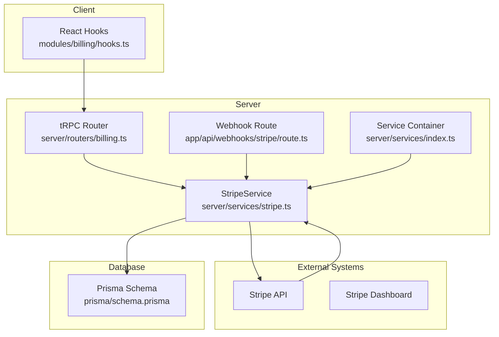
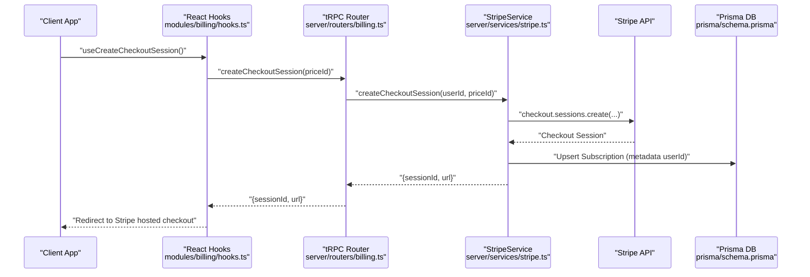
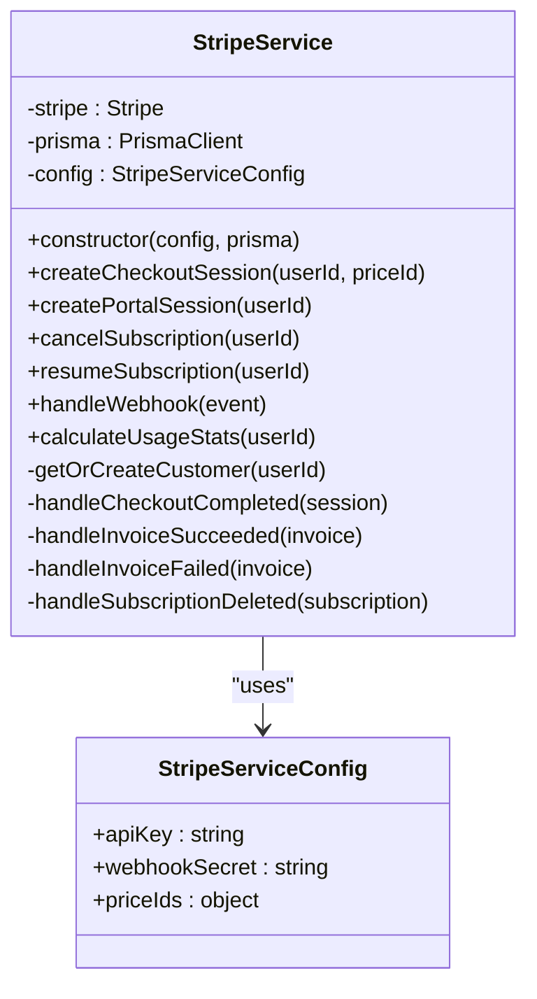
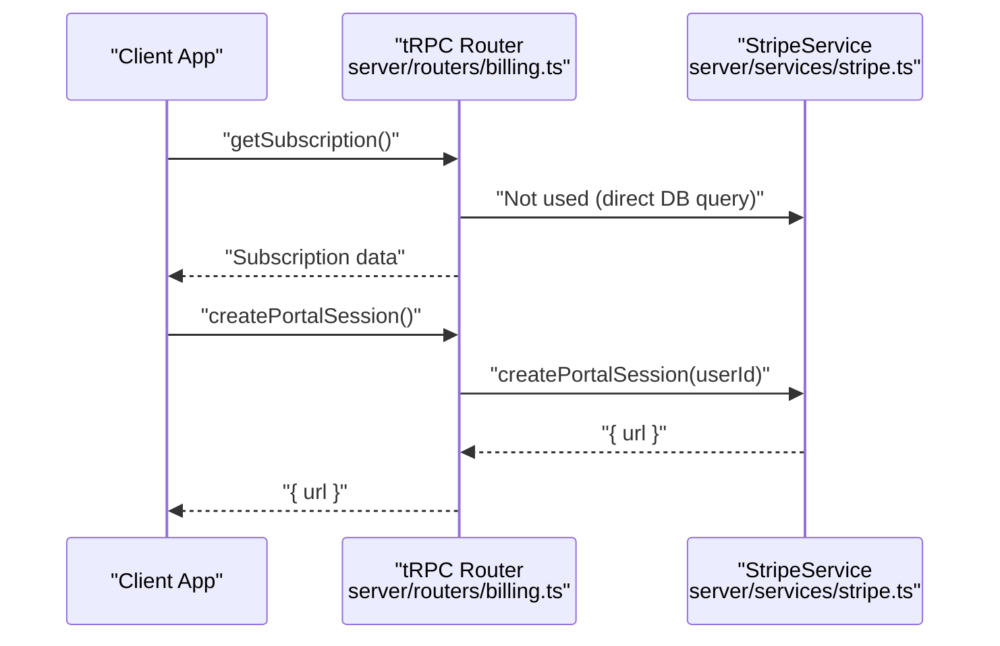
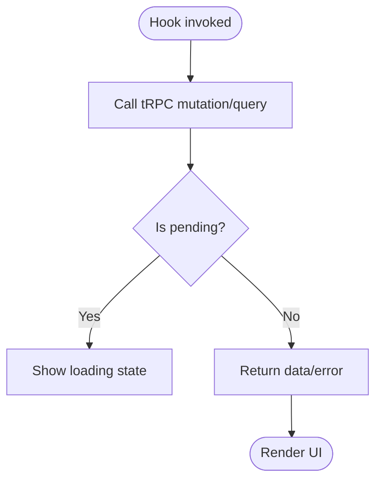
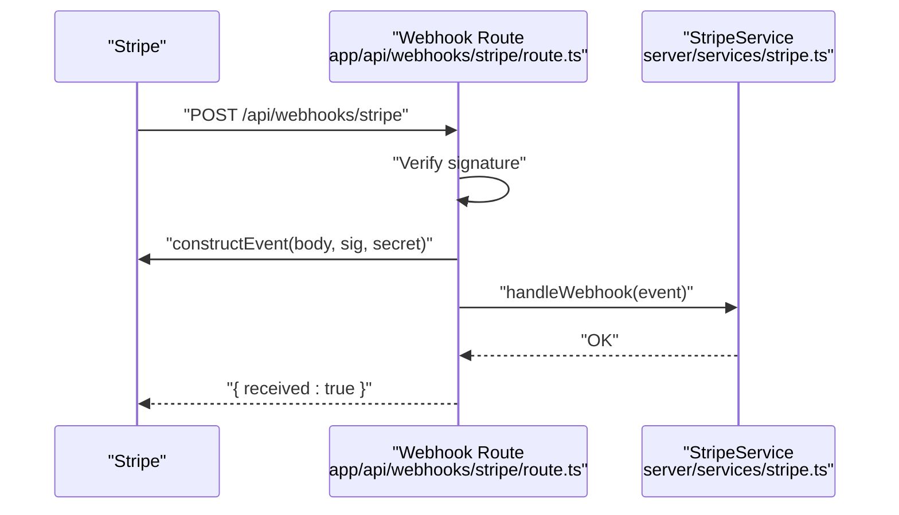
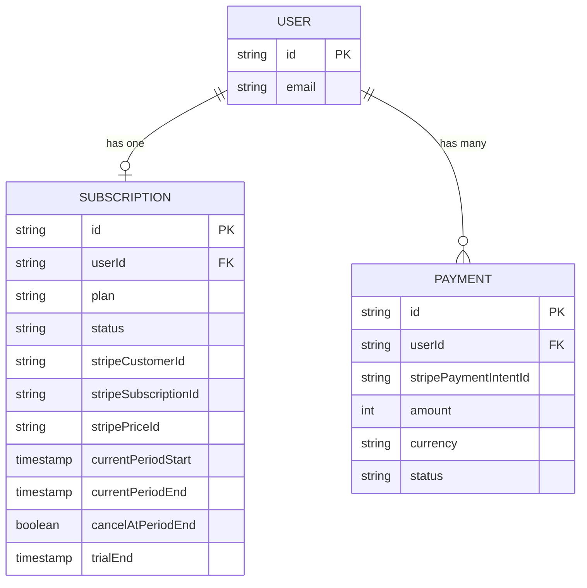
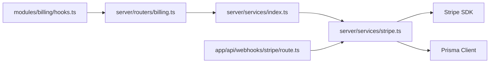

# Stripe Integration

<cite>
**Referenced Files in This Document**
- [stripe.ts](file://server/services/stripe.ts)
- [route.ts](file://app/api/webhooks/stripe/route.ts)
- [billing.ts](file://server/routers/billing.ts)
- [hooks.ts](file://modules/billing/hooks.ts)
- [utils.ts](file://modules/billing/utils.ts)
- [types.ts](file://modules/billing/types.ts)
- [constants.ts](file://modules/billing/constants.ts)
- [index.ts](file://server/services/index.ts)
- [.env.example](file://.env.example)
- [schema.prisma](file://prisma/schema.prisma)
</cite>

## Table of Contents
1. [Introduction](#introduction)
2. [Project Structure](#project-structure)
3. [Core Components](#core-components)
4. [Architecture Overview](#architecture-overview)
5. [Detailed Component Analysis](#detailed-component-analysis)
6. [Dependency Analysis](#dependency-analysis)
7. [Performance Considerations](#performance-considerations)
8. [Troubleshooting Guide](#troubleshooting-guide)
9. [Conclusion](#conclusion)
10. [Appendices](#appendices)

## Introduction
This document explains Smartfolio’s Stripe integration for billing. It covers Stripe SDK configuration, API key management, client/server-side integration patterns, Stripe customer and subscription lifecycle, checkout and billing portal sessions, payment confirmation flows, error handling, retry strategies, fallbacks, Stripe dashboard configuration, webhook endpoint setup, testing with Stripe CLI, and environment-specific configuration and production deployment considerations.

## Project Structure
Smartfolio organizes Stripe integration across three layers:
- Server services encapsulate Stripe SDK usage and database synchronization.
- tRPC routers expose protected billing operations to the client.
- Client hooks wrap tRPC calls for React components.

**Diagram sources**
- [hooks.ts](file://modules/billing/hooks.ts#L1-L91)
- [billing.ts](file://server/routers/billing.ts#L1-L71)
- [stripe.ts](file://server/services/stripe.ts#L1-L294)
- [route.ts](file://app/api/webhooks/stripe/route.ts#L1-L38)
- [index.ts](file://server/services/index.ts#L1-L118)
- [schema.prisma](file://prisma/schema.prisma#L172-L208)

**Section sources**
- [hooks.ts](file://modules/billing/hooks.ts#L1-L91)
- [billing.ts](file://server/routers/billing.ts#L1-L71)
- [stripe.ts](file://server/services/stripe.ts#L1-L294)
- [route.ts](file://app/api/webhooks/stripe/route.ts#L1-L38)
- [index.ts](file://server/services/index.ts#L1-L118)
- [schema.prisma](file://prisma/schema.prisma#L172-L208)

## Core Components
- StripeService: Centralized Stripe SDK wrapper managing checkout sessions, billing portal sessions, subscription CRUD, usage calculation, and webhook handling.
- tRPC billing router: Exposes protected procedures for client consumption.
- Client hooks: React hooks wrapping tRPC mutations and queries for billing actions.
- Webhook route: Receives and validates Stripe webhook events, delegates to StripeService.
- Service container: Provides lazily initialized StripeService with environment-configured keys and price IDs.
- Prisma models: Subscription and Payment records synchronized with Stripe.

Key responsibilities:
- Customer creation and retrieval, linking Stripe customer IDs to user subscriptions.
- Checkout session creation with metadata and success/cancel URLs.
- Billing portal session creation for customer-managed subscriptions.
- Subscription lifecycle updates via webhook handlers for checkout completion, invoice payments, failures, and cancellations.
- Usage statistics calculation for quotas.

**Section sources**
- [stripe.ts](file://server/services/stripe.ts#L1-L294)
- [billing.ts](file://server/routers/billing.ts#L1-L71)
- [hooks.ts](file://modules/billing/hooks.ts#L1-L91)
- [route.ts](file://app/api/webhooks/stripe/route.ts#L1-L38)
- [index.ts](file://server/services/index.ts#L38-L52)
- [schema.prisma](file://prisma/schema.prisma#L172-L208)

## Architecture Overview
The integration follows a clean separation of concerns:
- Client triggers billing actions via React hooks.
- tRPC router enforces authentication and delegates to StripeService.
- StripeService interacts with Stripe and synchronizes state to Prisma.
- Stripe sends webhook events to the server webhook route, which invokes StripeService to reconcile state.

**Diagram sources**
- [hooks.ts](file://modules/billing/hooks.ts#L20-L29)
- [billing.ts](file://server/routers/billing.ts#L16-L30)
- [stripe.ts](file://server/services/stripe.ts#L24-L52)
- [schema.prisma](file://prisma/schema.prisma#L172-L191)

## Detailed Component Analysis

### StripeService
Responsibilities:
- Initialize Stripe SDK with secret key.
- Create checkout sessions with customer linkage, mode subscription, and metadata.
- Create billing portal sessions for customer self-service.
- Cancel/resume subscriptions at period end.
- Handle webhook events to synchronize subscription status and plan.
- Calculate usage statistics for quotas.

Implementation highlights:
- Customer management: Retrieve existing Stripe customer from DB if present; otherwise create customer and persist Stripe IDs.
- Checkout session: Uses metadata to carry userId for post-checkout reconciliation.
- Webhook handling: Supports checkout.session.completed, invoice.payment_succeeded, invoice.payment_failed, customer.subscription.deleted.

**Diagram sources**
- [stripe.ts](file://server/services/stripe.ts#L13-L294)

**Section sources**
- [stripe.ts](file://server/services/stripe.ts#L13-L294)

### tRPC Billing Router
Endpoints:
- getSubscription: Fetch current subscription for authenticated user.
- createCheckoutSession: Create Stripe checkout session and return session URL.
- createPortalSession: Create Stripe Billing Portal session URL.
- cancelSubscription: Mark subscription to cancel at period end.
- resumeSubscription: Revert cancellation at period end.
- getPaymentHistory: List payments for the user.
- getUsageStats: Compute usage vs limits.

**Diagram sources**
- [billing.ts](file://server/routers/billing.ts#L6-L70)
- [stripe.ts](file://server/services/stripe.ts#L54-L65)

**Section sources**
- [billing.ts](file://server/routers/billing.ts#L1-L71)

### Client Hooks
- useSubscription: Load current subscription.
- useCreateCheckoutSession: Trigger checkout session creation.
- useCreateBillingPortalSession: Trigger billing portal session creation.
- useCancelSubscription/useResumeSubscription: Mutate subscription cancellation state.
- usePaymentHistory/useUsageStats: Load payment and usage data.

**Diagram sources**
- [hooks.ts](file://modules/billing/hooks.ts#L10-L91)

**Section sources**
- [hooks.ts](file://modules/billing/hooks.ts#L1-L91)

### Webhook Endpoint
- Validates Stripe signature from headers.
- Constructs Stripe event using secret and raw body.
- Delegates to StripeService.handleWebhook to reconcile state.

**Diagram sources**
- [route.ts](file://app/api/webhooks/stripe/route.ts#L6-L38)
- [stripe.ts](file://server/services/stripe.ts#L115-L130)

**Section sources**
- [route.ts](file://app/api/webhooks/stripe/route.ts#L1-L38)
- [stripe.ts](file://server/services/stripe.ts#L115-L130)

### Data Models and Quotas
Prisma models:
- Subscription: Tracks plan, status, Stripe identifiers, billing periods, and cancellation flag.
- Payment: Records payment intents, amounts, currencies, and statuses.

Quota calculation:
- Portfolios count per user.
- AI generations count per month.
- Limits mapped by plan (FREE, PRO, ENTERPRISE).

**Diagram sources**
- [schema.prisma](file://prisma/schema.prisma#L172-L208)

**Section sources**
- [schema.prisma](file://prisma/schema.prisma#L172-L208)
- [stripe.ts](file://server/services/stripe.ts#L132-L170)

## Dependency Analysis
- StripeService depends on Stripe SDK and PrismaClient.
- tRPC billing router depends on ServiceContainer for StripeService.
- Client hooks depend on tRPC client.
- Webhook route depends on Stripe SDK and ServiceContainer.

**Diagram sources**
- [hooks.ts](file://modules/billing/hooks.ts#L1-L91)
- [billing.ts](file://server/routers/billing.ts#L1-L71)
- [index.ts](file://server/services/index.ts#L38-L52)
- [stripe.ts](file://server/services/stripe.ts#L1-L22)
- [route.ts](file://app/api/webhooks/stripe/route.ts#L1-L38)

**Section sources**
- [hooks.ts](file://modules/billing/hooks.ts#L1-L91)
- [billing.ts](file://server/routers/billing.ts#L1-L71)
- [index.ts](file://server/services/index.ts#L38-L52)
- [stripe.ts](file://server/services/stripe.ts#L1-L22)
- [route.ts](file://app/api/webhooks/stripe/route.ts#L1-L38)

## Performance Considerations
- Lazy initialization: StripeService is created once via ServiceContainer to avoid repeated SDK initialization overhead.
- Minimal round trips: tRPC router directly calls StripeService; no redundant network hops.
- Database indexing: Subscription and Payment models include indexes on frequently queried fields (userId, status).
- Webhook idempotency: StripeService handles events idempotently by checking existing DB state before updating.

[No sources needed since this section provides general guidance]

## Troubleshooting Guide
Common issues and strategies:
- Missing Stripe signature in webhook: The webhook route returns a 400 error when signature is absent. Verify webhook endpoint configuration in Stripe Dashboard and ensure the correct webhook secret is set in environment variables.
- Invalid webhook secret or mismatched event construction: Ensure the webhook secret matches the one configured in Stripe Dashboard.
- No active subscription found during cancel/resume: The service throws an error if no Stripe subscription ID exists; ensure checkout completion has occurred and DB is synced.
- Currency formatting: Amounts are stored in cents; formatting utilities convert to display currency.
- Retry and fallback:
  - Webhooks: Stripe retries failed deliveries; monitor the Stripe Dashboard webhook logs and resend failed events if needed.
  - Idempotency: Handlers check existing DB state to avoid duplicate updates.
  - Graceful degradation: Client hooks surface errors; display user-friendly messages and allow retry.

**Section sources**
- [route.ts](file://app/api/webhooks/stripe/route.ts#L11-L16)
- [route.ts](file://app/api/webhooks/stripe/route.ts#L31-L37)
- [stripe.ts](file://server/services/stripe.ts#L67-L74)
- [stripe.ts](file://server/services/stripe.ts#L91-L98)
- [utils.ts](file://modules/billing/utils.ts#L8-L13)

## Conclusion
Smartfolio’s Stripe integration cleanly separates client, server, and external concerns. The StripeService centralizes Stripe SDK usage and ensures strong consistency with Prisma by reconciling webhook events. The tRPC router exposes safe, authenticated operations, while client hooks provide ergonomic React integration. With proper environment configuration, webhook setup, and monitoring, the system supports reliable subscription management and payment confirmation flows.

[No sources needed since this section summarizes without analyzing specific files]

## Appendices

### Environment Variables
Required variables for Stripe integration:
- NEXT_PUBLIC_STRIPE_PUBLISHABLE_KEY
- STRIPE_SECRET_KEY
- STRIPE_WEBHOOK_SECRET
- NEXT_PUBLIC_STRIPE_PRO_PRICE_ID
- NEXT_PUBLIC_STRIPE_ENTERPRISE_PRICE_ID
- NEXT_PUBLIC_APP_URL

**Section sources**
- [.env.example](file://.env.example#L24-L28)
- [.env.example](file://.env.example#L45-L46)

### Stripe Dashboard Configuration
- Webhook endpoint: Configure the endpoint URL to match your deployed backend’s /api/webhooks/stripe.
- Webhook secret: Set STRIPE_WEBHOOK_SECRET in environment variables and ensure it matches the dashboard configuration.
- Price IDs: Set product prices for PRO and ENTERPRISE plans and configure the corresponding environment variables.

**Section sources**
- [route.ts](file://app/api/webhooks/stripe/route.ts#L22-L26)
- [constants.ts](file://modules/billing/constants.ts#L32-L51)

### Testing with Stripe CLI
- Forward events to your local /api/webhooks/stripe endpoint.
- Use the Stripe CLI to test checkout sessions and simulate invoice payments.
- Monitor webhook logs in the Stripe Dashboard for successful delivery and event reconstruction.

[No sources needed since this section provides general guidance]

### Production Deployment Considerations
- Secure secrets: Store STRIPE_SECRET_KEY, STRIPE_WEBHOOK_SECRET, and price IDs in environment variables.
- HTTPS: Ensure the webhook endpoint is served over HTTPS.
- Idempotency: Rely on Stripe’s idempotent event delivery; StripeService handlers are designed to tolerate duplicates.
- Monitoring: Track webhook failures, subscription status transitions, and payment outcomes in your infrastructure.

[No sources needed since this section provides general guidance]