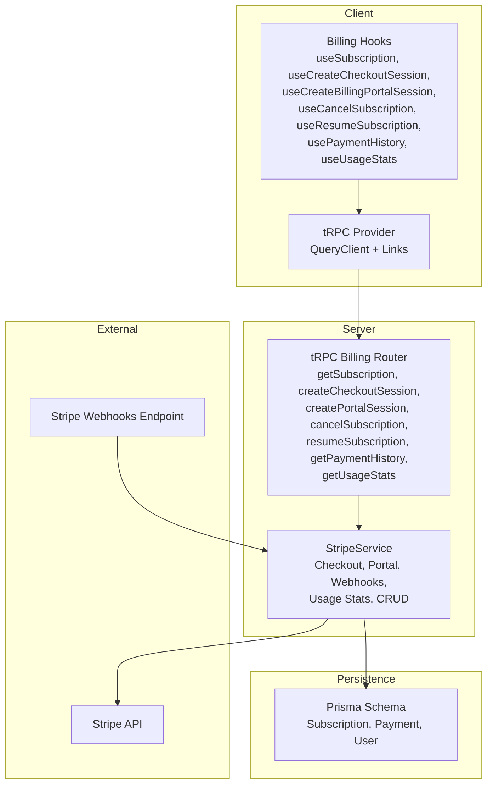
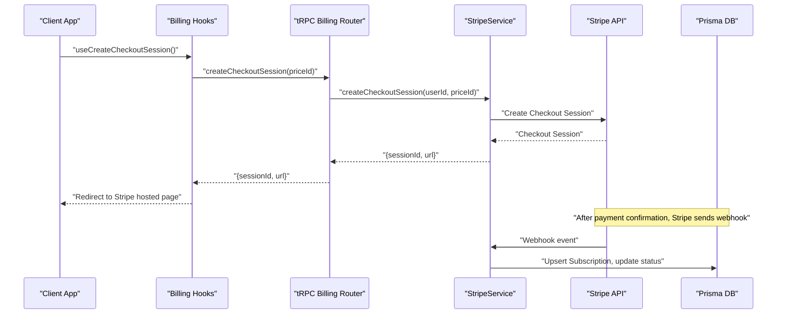
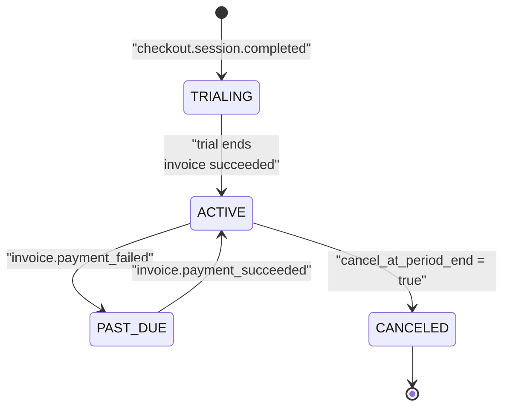
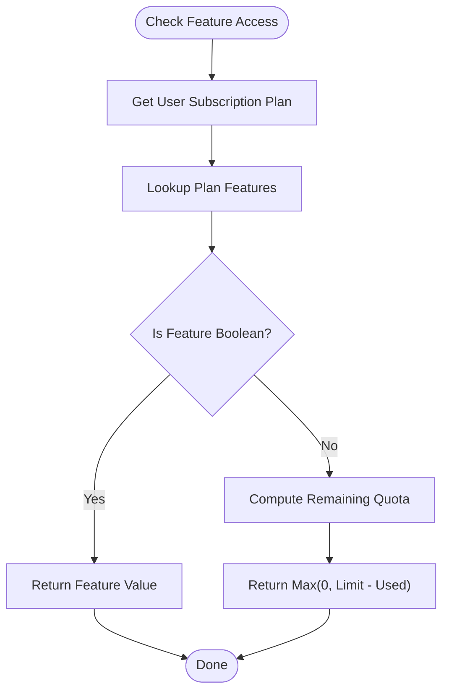
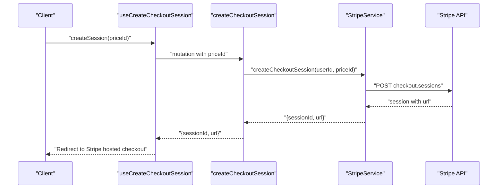
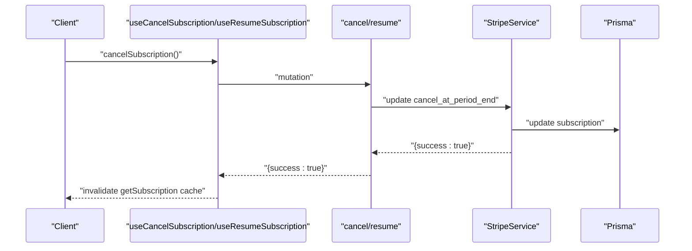
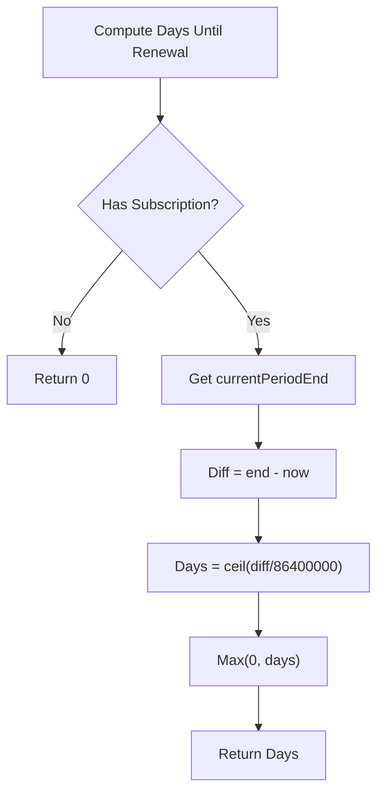
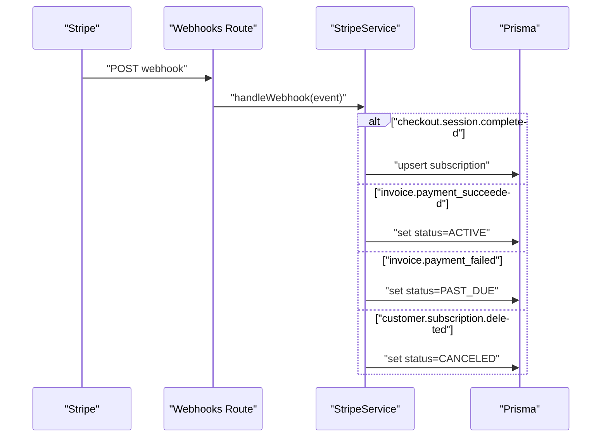
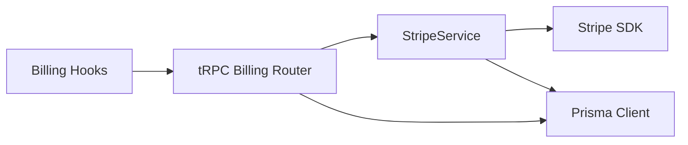
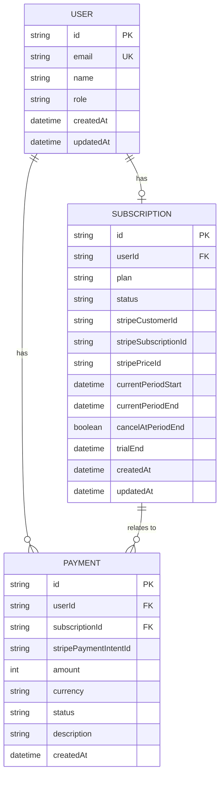

# Subscription Management

<cite>
**Referenced Files in This Document**
- [modules/billing/index.ts](file://modules/billing/index.ts)
- [modules/billing/hooks.ts](file://modules/billing/hooks.ts)
- [modules/billing/types.ts](file://modules/billing/types.ts)
- [modules/billing/constants.ts](file://modules/billing/constants.ts)
- [modules/billing/utils.ts](file://modules/billing/utils.ts)
- [server/routers/billing.ts](file://server/routers/billing.ts)
- [server/services/stripe.ts](file://server/services/stripe.ts)
- [app/api/webhooks/stripe/route.ts](file://app/api/webhooks/stripe/route.ts)
- [prisma/schema.prisma](file://prisma/schema.prisma)
- [lib/trpc-provider.tsx](file://lib/trpc-provider.tsx)
</cite>

## Table of Contents
1. [Introduction](#introduction)
2. [Project Structure](#project-structure)
3. [Core Components](#core-components)
4. [Architecture Overview](#architecture-overview)
5. [Detailed Component Analysis](#detailed-component-analysis)
6. [Dependency Analysis](#dependency-analysis)
7. [Performance Considerations](#performance-considerations)
8. [Troubleshooting Guide](#troubleshooting-guide)
9. [Conclusion](#conclusion)
10. [Appendices](#appendices)

## Introduction
This document explains the subscription management system used by the application. It covers the subscription lifecycle, tier configuration, state transitions, creation and cancellation flows, renewal handling, status tracking, grace periods, expiration logic, feature gating, access control, analytics, and usage-based billing. It also provides guidance for implementing custom workflows and resolving subscription conflicts.

## Project Structure
The subscription management spans client hooks, server tRPC routers, Stripe service integration, and Prisma data models. The billing module exposes typed APIs and utilities for frontend consumption, while the backend orchestrates Stripe interactions and updates persistent state.

**Diagram sources**
- [modules/billing/hooks.ts](file://modules/billing/hooks.ts#L1-L91)
- [lib/trpc-provider.tsx](file://lib/trpc-provider.tsx#L1-L50)
- [server/routers/billing.ts](file://server/routers/billing.ts#L1-L71)
- [server/services/stripe.ts](file://server/services/stripe.ts#L1-L294)
- [app/api/webhooks/stripe/route.ts](file://app/api/webhooks/stripe/route.ts#L1-L38)
- [prisma/schema.prisma](file://prisma/schema.prisma#L172-L208)

**Section sources**
- [modules/billing/index.ts](file://modules/billing/index.ts#L1-L14)
- [modules/billing/hooks.ts](file://modules/billing/hooks.ts#L1-L91)
- [lib/trpc-provider.tsx](file://lib/trpc-provider.tsx#L1-L50)
- [server/routers/billing.ts](file://server/routers/billing.ts#L1-L71)
- [server/services/stripe.ts](file://server/services/stripe.ts#L1-L294)
- [app/api/webhooks/stripe/route.ts](file://app/api/webhooks/stripe/route.ts#L1-L38)
- [prisma/schema.prisma](file://prisma/schema.prisma#L172-L208)

## Core Components
- Billing module exports: types, constants, hooks, utilities, and re-exports the module index.
- Types define subscription plans, statuses, payment statuses, and data models.
- Constants define pricing tiers, Stripe configuration, trial period, and webhook event keys.
- Hooks encapsulate client-side tRPC calls for subscription state, checkout, portal, cancellation, resumption, payment history, and usage stats.
- Utilities provide formatting, plan feature lookup, quota calculation, status labeling, and renewal timing helpers.
- tRPC router exposes protected procedures for fetching subscription, creating checkout sessions, creating billing portal sessions, canceling/resuming subscriptions, retrieving payment history, and computing usage stats.
- Stripe service handles Stripe interactions, including customer creation, checkout sessions, portal sessions, subscription cancellation/resume, webhook handling, and usage statistics.
- Prisma schema defines Subscription and Payment models and their relations to User.

**Section sources**
- [modules/billing/index.ts](file://modules/billing/index.ts#L1-L14)
- [modules/billing/types.ts](file://modules/billing/types.ts#L1-L84)
- [modules/billing/constants.ts](file://modules/billing/constants.ts#L1-L81)
- [modules/billing/hooks.ts](file://modules/billing/hooks.ts#L1-L91)
- [modules/billing/utils.ts](file://modules/billing/utils.ts#L1-L102)
- [server/routers/billing.ts](file://server/routers/billing.ts#L1-L71)
- [server/services/stripe.ts](file://server/services/stripe.ts#L1-L294)
- [prisma/schema.prisma](file://prisma/schema.prisma#L172-L208)

## Architecture Overview
The system integrates Stripe for recurring billing and webhooks for asynchronous state synchronization. The frontend consumes typed hooks to manage subscriptions, while the backend validates requests, interacts with Stripe, and persists state.

**Diagram sources**
- [modules/billing/hooks.ts](file://modules/billing/hooks.ts#L20-L29)
- [server/routers/billing.ts](file://server/routers/billing.ts#L16-L30)
- [server/services/stripe.ts](file://server/services/stripe.ts#L24-L52)
- [app/api/webhooks/stripe/route.ts](file://app/api/webhooks/stripe/route.ts#L6-L38)
- [prisma/schema.prisma](file://prisma/schema.prisma#L172-L191)

## Detailed Component Analysis

### Subscription Lifecycle and State Transitions
- Subscription statuses include ACTIVE, CANCELED, PAST_DUE, TRIALING, and INCOMPLETE.
- Status transitions are driven by Stripe events and manual actions:
  - ACTIVE: initial state after successful checkout.
  - PAST_DUE: invoice payment failed; remains active until canceled or payment succeeds.
  - CANCELED: cancel_at_period_end set to true via cancellation; finalizes at period end.
  - TRIALING: trial period active; tracked via trialEnd.
  - INCOMPLETE: checkout not finalized.
- Grace period and expiration:
  - Trial period is configured via constants.
  - Renewal countdown is computed using currentPeriodEnd.
  - Expiration occurs when trial ends and no renewal is processed.

**Diagram sources**
- [modules/billing/utils.ts](file://modules/billing/utils.ts#L96-L101)
- [modules/billing/utils.ts](file://modules/billing/utils.ts#L85-L94)
- [server/services/stripe.ts](file://server/services/stripe.ts#L115-L130)
- [server/services/stripe.ts](file://server/services/stripe.ts#L250-L280)
- [server/services/stripe.ts](file://server/services/stripe.ts#L282-L293)

**Section sources**
- [modules/billing/types.ts](file://modules/billing/types.ts#L11-L17)
- [modules/billing/constants.ts](file://modules/billing/constants.ts#L71-L71)
- [modules/billing/utils.ts](file://modules/billing/utils.ts#L96-L101)
- [modules/billing/utils.ts](file://modules/billing/utils.ts#L85-L94)
- [server/services/stripe.ts](file://server/services/stripe.ts#L115-L130)
- [server/services/stripe.ts](file://server/services/stripe.ts#L250-L280)
- [server/services/stripe.ts](file://server/services/stripe.ts#L282-L293)

### Tier Configuration and Feature Gating
- Plans define id, name, description, price, interval, Stripe price id, and features.
- Features include quotas and toggles (e.g., portfolios, custom domain, AI generations/tokens, analytics, themes, support, watermark removal).
- Access checks compare user’s current plan against required feature keys and compute remaining quota.

**Diagram sources**
- [modules/billing/utils.ts](file://modules/billing/utils.ts#L29-L54)
- [modules/billing/constants.ts](file://modules/billing/constants.ts#L7-L63)

**Section sources**
- [modules/billing/constants.ts](file://modules/billing/constants.ts#L7-L63)
- [modules/billing/utils.ts](file://modules/billing/utils.ts#L29-L54)

### Subscription Creation and Checkout
- Frontend triggers a checkout session creation via a hook.
- The tRPC router delegates to StripeService, which ensures a Stripe customer exists and creates a subscription-mode checkout session.
- On success, Stripe redirects back to the app with a session id; the webhook handler persists the subscription.

**Diagram sources**
- [modules/billing/hooks.ts](file://modules/billing/hooks.ts#L20-L29)
- [server/routers/billing.ts](file://server/routers/billing.ts#L16-L30)
- [server/services/stripe.ts](file://server/services/stripe.ts#L24-L52)

**Section sources**
- [modules/billing/hooks.ts](file://modules/billing/hooks.ts#L20-L29)
- [server/routers/billing.ts](file://server/routers/billing.ts#L16-L30)
- [server/services/stripe.ts](file://server/services/stripe.ts#L24-L52)

### Cancellation and Resumption
- Cancellation sets cancel_at_period_end to true on both Stripe and local records.
- Resumption clears cancel_at_period_end to keep the subscription active through the next cycle.
- Both operations invalidate cached subscription state to reflect immediate UI updates.

**Diagram sources**
- [modules/billing/hooks.ts](file://modules/billing/hooks.ts#L42-L72)
- [server/routers/billing.ts](file://server/routers/billing.ts#L39-L51)
- [server/services/stripe.ts](file://server/services/stripe.ts#L67-L113)
- [prisma/schema.prisma](file://prisma/schema.prisma#L172-L191)

**Section sources**
- [modules/billing/hooks.ts](file://modules/billing/hooks.ts#L42-L72)
- [server/routers/billing.ts](file://server/routers/billing.ts#L39-L51)
- [server/services/stripe.ts](file://server/services/stripe.ts#L67-L113)
- [prisma/schema.prisma](file://prisma/schema.prisma#L172-L191)

### Renewal Handling and Expiration Logic
- Renewal countdown is computed from currentPeriodEnd.
- Expiration occurs when trialEnd passes without renewal.
- Stripe webhooks update status to ACTIVE after successful invoices and to PAST_DUE after failures.

**Diagram sources**
- [modules/billing/utils.ts](file://modules/billing/utils.ts#L85-L94)

**Section sources**
- [modules/billing/utils.ts](file://modules/billing/utils.ts#L85-L94)
- [server/services/stripe.ts](file://server/services/stripe.ts#L250-L280)
- [server/services/stripe.ts](file://server/services/stripe.ts#L282-L293)

### Status Tracking, Labels, and Colors
- Status labels and colors are derived from status enums for UI rendering.
- Active and trialing states indicate good standing; past due requires action; canceled indicates termination.

**Section sources**
- [modules/billing/utils.ts](file://modules/billing/utils.ts#L73-L83)
- [modules/billing/utils.ts](file://modules/billing/utils.ts#L56-L71)

### Payment History and Usage Analytics
- Payment history is retrieved per-user and ordered by creation time.
- Usage stats compute counts for portfolios and AI generations this month, and map them against plan limits.

**Section sources**
- [server/routers/billing.ts](file://server/routers/billing.ts#L53-L69)
- [server/services/stripe.ts](file://server/services/stripe.ts#L132-L170)
- [prisma/schema.prisma](file://prisma/schema.prisma#L193-L208)

### Webhook Integration and Conflict Resolution
- Webhooks handle checkout completion, invoice success/failure, and subscription deletion.
- The webhook endpoint validates signatures and delegates to StripeService, which updates local state consistently.
- Conflicts are resolved by upserting subscription records and normalizing status transitions.

**Diagram sources**
- [app/api/webhooks/stripe/route.ts](file://app/api/webhooks/stripe/route.ts#L6-L38)
- [server/services/stripe.ts](file://server/services/stripe.ts#L115-L130)
- [server/services/stripe.ts](file://server/services/stripe.ts#L211-L248)
- [server/services/stripe.ts](file://server/services/stripe.ts#L250-L280)
- [server/services/stripe.ts](file://server/services/stripe.ts#L282-L293)

**Section sources**
- [app/api/webhooks/stripe/route.ts](file://app/api/webhooks/stripe/route.ts#L6-L38)
- [server/services/stripe.ts](file://server/services/stripe.ts#L115-L130)
- [server/services/stripe.ts](file://server/services/stripe.ts#L211-L248)
- [server/services/stripe.ts](file://server/services/stripe.ts#L250-L280)
- [server/services/stripe.ts](file://server/services/stripe.ts#L282-L293)

### Practical Examples and Patterns
- Using hooks:
  - Fetch subscription: [useSubscription](file://modules/billing/hooks.ts#L10-L18)
  - Create checkout session: [useCreateCheckoutSession](file://modules/billing/hooks.ts#L20-L29)
  - Create billing portal session: [useCreateBillingPortalSession](file://modules/billing/hooks.ts#L31-L40)
  - Cancel subscription: [useCancelSubscription](file://modules/billing/hooks.ts#L42-L56)
  - Resume subscription: [useResumeSubscription](file://modules/billing/hooks.ts#L58-L72)
  - Payment history: [usePaymentHistory](file://modules/billing/hooks.ts#L74-L81)
  - Usage stats: [useUsageStats](file://modules/billing/hooks.ts#L83-L90)
- State management patterns:
  - Invalidate queries after mutations to refresh cached data.
  - Use status helpers to render UI affordances (active, past due, canceled).
- User-facing controls:
  - Redirect to Stripe-hosted checkout and portal pages via returned URLs.
  - Display remaining quota and limits using usage stats and plan features.

**Section sources**
- [modules/billing/hooks.ts](file://modules/billing/hooks.ts#L10-L90)
- [modules/billing/utils.ts](file://modules/billing/utils.ts#L15-L54)
- [server/routers/billing.ts](file://server/routers/billing.ts#L16-L69)

## Dependency Analysis
- Client depends on tRPC provider and billing hooks.
- tRPC router depends on StripeService and Prisma.
- StripeService depends on Stripe SDK and Prisma.
- Prisma schema defines Subscription and Payment models and their relations.

**Diagram sources**
- [lib/trpc-provider.tsx](file://lib/trpc-provider.tsx#L1-L50)
- [modules/billing/hooks.ts](file://modules/billing/hooks.ts#L1-L91)
- [server/routers/billing.ts](file://server/routers/billing.ts#L1-L71)
- [server/services/stripe.ts](file://server/services/stripe.ts#L1-L23)
- [prisma/schema.prisma](file://prisma/schema.prisma#L172-L208)

**Section sources**
- [lib/trpc-provider.tsx](file://lib/trpc-provider.tsx#L1-L50)
- [modules/billing/hooks.ts](file://modules/billing/hooks.ts#L1-L91)
- [server/routers/billing.ts](file://server/routers/billing.ts#L1-L71)
- [server/services/stripe.ts](file://server/services/stripe.ts#L1-L23)
- [prisma/schema.prisma](file://prisma/schema.prisma#L172-L208)

## Performance Considerations
- Use short stale times for subscription queries to balance freshness and performance.
- Debounce or batch UI updates after mutations to avoid excessive refetches.
- Cache formatted currency and status labels on the client to reduce repeated computations.
- Offload heavy analytics (usage stats) to server-side queries to minimize client work.

[No sources needed since this section provides general guidance]

## Troubleshooting Guide
- Missing Stripe signature in webhook:
  - Verify webhook secret and header presence; ensure endpoint URL matches Stripe dashboard configuration.
- No active subscription found during cancellation/resume:
  - Confirm user has a valid stripeSubscriptionId stored in the Subscription record.
- Invoice succeeded but status remains inactive:
  - Check webhook handling for invoice.success events and ensure upsert logic updates status.
- Past due state not clearing:
  - Confirm subsequent successful invoices trigger status updates to ACTIVE.
- Usage stats mismatch:
  - Validate monthly boundaries and plan limits mapping in usage computation.

**Section sources**
- [app/api/webhooks/stripe/route.ts](file://app/api/webhooks/stripe/route.ts#L11-L16)
- [server/services/stripe.ts](file://server/services/stripe.ts#L67-L89)
- [server/services/stripe.ts](file://server/services/stripe.ts#L91-L113)
- [server/services/stripe.ts](file://server/services/stripe.ts#L250-L264)
- [server/services/stripe.ts](file://server/services/stripe.ts#L266-L280)
- [server/services/stripe.ts](file://server/services/stripe.ts#L132-L170)

## Conclusion
The subscription system combines Stripe’s robust billing infrastructure with a clean tRPC-backed backend and typed client hooks. It supports full lifecycle management, clear state transitions, plan-based feature gating, usage analytics, and reliable webhook-driven reconciliation. The modular design enables straightforward customization for advanced workflows and conflict resolution.

[No sources needed since this section summarizes without analyzing specific files]

## Appendices

### Data Model Overview

**Diagram sources**
- [prisma/schema.prisma](file://prisma/schema.prisma#L17-L36)
- [prisma/schema.prisma](file://prisma/schema.prisma#L172-L191)
- [prisma/schema.prisma](file://prisma/schema.prisma#L193-L208)

### API Surface Summary
- Queries:
  - getSubscription: fetch current subscription for user
  - getPaymentHistory: list payments for user
  - getUsageStats: compute usage vs limits
- Mutations:
  - createCheckoutSession: create Stripe checkout session
  - createPortalSession: create Stripe Billing Portal session
  - cancelSubscription: set cancel_at_period_end
  - resumeSubscription: clear cancel_at_period_end

**Section sources**
- [server/routers/billing.ts](file://server/routers/billing.ts#L7-L69)