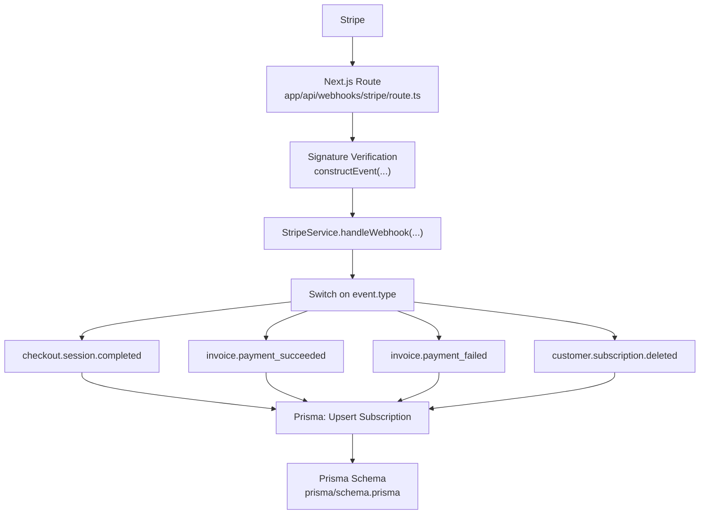
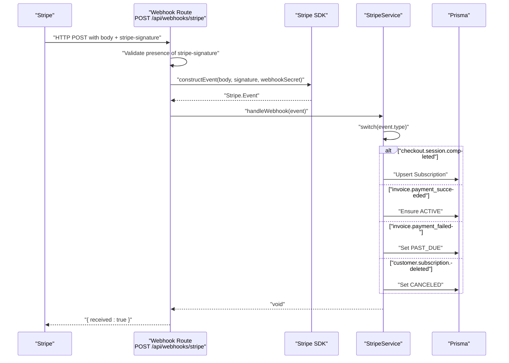
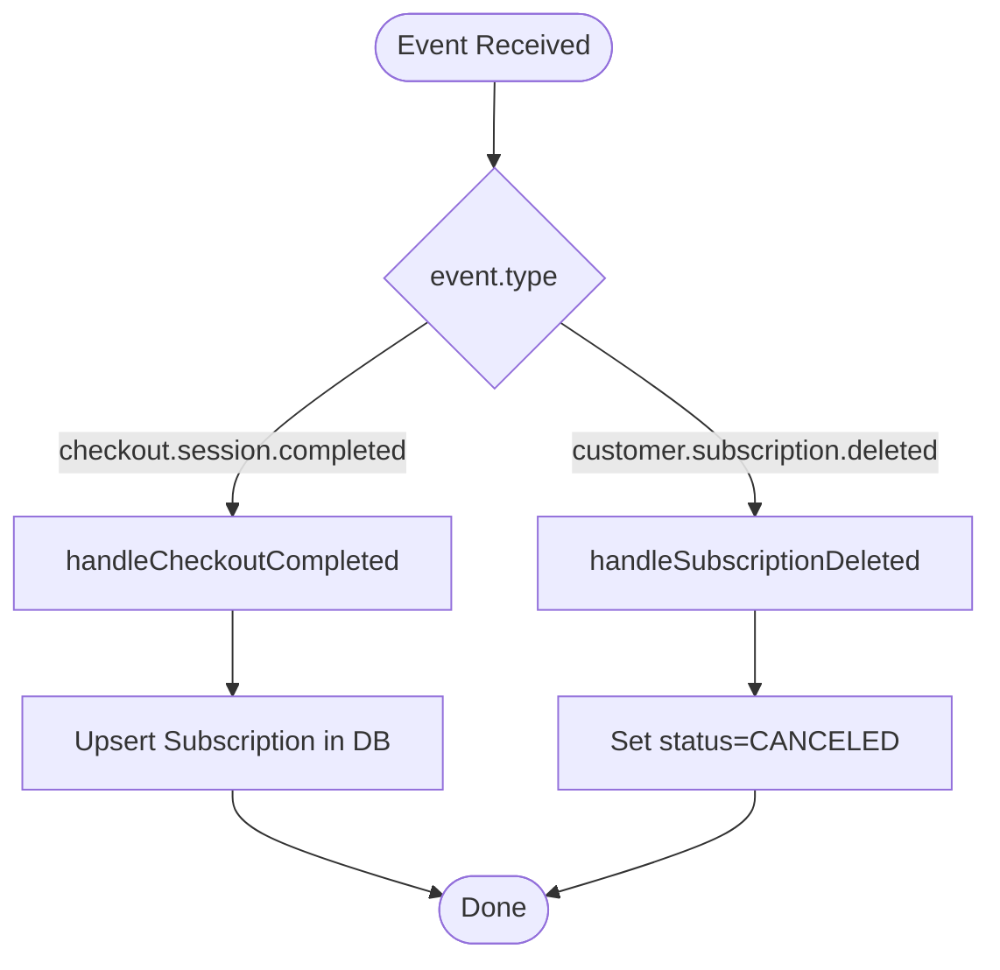
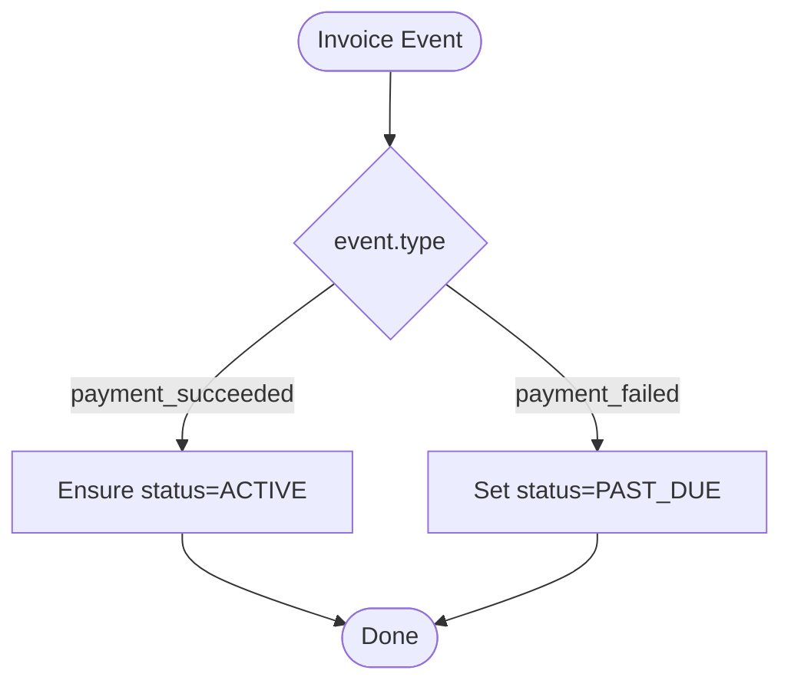
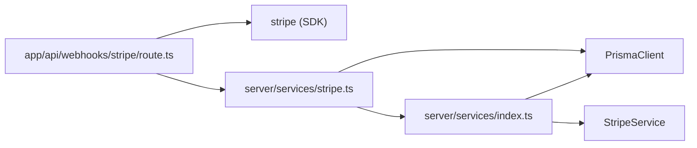

# Webhook Handling

<cite>
**Referenced Files in This Document**
- [route.ts](file://app/api/webhooks/stripe/route.ts)
- [stripe.ts](file://server/services/stripe.ts)
- [index.ts](file://server/services/index.ts)
- [billing.ts](file://server/routers/billing.ts)
- [constants.ts](file://modules/billing/constants.ts)
- [types.ts](file://modules/billing/types.ts)
- [utils.ts](file://modules/billing/utils.ts)
- [.env.example](file://.env.example)
- [schema.prisma](file://prisma/schema.prisma)
- [middleware.ts](file://middleware.ts)
</cite>

## Table of Contents
1. [Introduction](#introduction)
2. [Project Structure](#project-structure)
3. [Core Components](#core-components)
4. [Architecture Overview](#architecture-overview)
5. [Detailed Component Analysis](#detailed-component-analysis)
6. [Dependency Analysis](#dependency-analysis)
7. [Performance Considerations](#performance-considerations)
8. [Troubleshooting Guide](#troubleshooting-guide)
9. [Conclusion](#conclusion)
10. [Appendices](#appendices)

## Introduction
This document explains how the application handles Stripe webhooks to keep billing synchronized in real time. It covers endpoint configuration, signature verification, event payload parsing, subscription lifecycle updates, payment success/failure notifications, and invoice generation events. It also provides guidance on deduplication, error handling, retries, dead letter queues, monitoring, security, rate limiting, scaling, debugging, testing, and health checks.

## Project Structure
The webhook pipeline is implemented as a Next.js route handler that validates Stripe signatures and delegates event processing to a service layer. The service layer persists state changes to the database and coordinates with Stripe APIs.

**Diagram sources**
- [route.ts](file://app/api/webhooks/stripe/route.ts#L6-L38)
- [stripe.ts](file://server/services/stripe.ts#L115-L130)
- [schema.prisma](file://prisma/schema.prisma#L172-L208)

**Section sources**
- [route.ts](file://app/api/webhooks/stripe/route.ts#L1-L38)
- [stripe.ts](file://server/services/stripe.ts#L115-L130)
- [schema.prisma](file://prisma/schema.prisma#L172-L208)

## Core Components
- Webhook route handler: Receives raw body and Stripe signature, verifies signature, constructs Stripe.Event, and invokes the Stripe service.
- Stripe service: Centralizes Stripe integration and event handling logic.
- Service container: Provides shared instances (Stripe, Prisma) and optional rate limiting.
- Billing module: Defines billing types, constants, and utilities used across the system.
- Database schema: Stores subscriptions and payments with Stripe identifiers for reconciliation.

Key responsibilities:
- Signature verification using the webhook secret.
- Event routing to dedicated handlers.
- Idempotent updates to subscription and payment records.
- Graceful error handling and logging.

**Section sources**
- [route.ts](file://app/api/webhooks/stripe/route.ts#L6-L38)
- [stripe.ts](file://server/services/stripe.ts#L115-L130)
- [index.ts](file://server/services/index.ts#L38-L52)
- [constants.ts](file://modules/billing/constants.ts#L73-L80)
- [types.ts](file://modules/billing/types.ts#L26-L40)
- [schema.prisma](file://prisma/schema.prisma#L172-L208)

## Architecture Overview
The webhook flow is a request-response handled by a single Next.js route. It performs strict signature verification and dispatches to a service method that switches on event.type to apply domain-specific logic.

**Diagram sources**
- [route.ts](file://app/api/webhooks/stripe/route.ts#L6-L38)
- [stripe.ts](file://server/services/stripe.ts#L115-L130)
- [stripe.ts](file://server/services/stripe.ts#L211-L248)
- [stripe.ts](file://server/services/stripe.ts#L250-L280)
- [stripe.ts](file://server/services/stripe.ts#L282-L293)

## Detailed Component Analysis

### Webhook Endpoint Configuration
- Path: /api/webhooks/stripe
- Method: POST
- Required headers: stripe-signature
- Body: Raw JSON payload from Stripe
- Environment variables:
  - STRIPE_WEBHOOK_SECRET: Used to verify signatures
  - STRIPE_SECRET_KEY: Used to construct Stripe.Event (and for future API calls if needed)
  - NEXT_PUBLIC_STRIPE_PUBLISHABLE_KEY: Frontend key for Stripe.js
  - NEXT_PUBLIC_APP_URL: Base URL for constructing success/cancel URLs

Operational notes:
- The route reads the raw body and headers to verify the signature.
- On success, it returns a 200 with { received: true }.
- On failure, it logs the error and returns 400 with the error message.

Security considerations:
- The endpoint must be publicly accessible but only by Stripe.
- Use a reverse proxy or platform-specific restrictions to limit exposure.
- Ensure the webhook secret is rotated periodically and kept out of client-side code.

**Section sources**
- [route.ts](file://app/api/webhooks/stripe/route.ts#L6-L38)
- [.env.example](file://.env.example#L22-L28)

### Signature Verification
- The route extracts the stripe-signature header and throws a 400 error if missing.
- It constructs a Stripe.Event using the raw body, signature, and webhook secret.
- If verification fails, the Stripe SDK raises an error caught by the route, which logs and responds with 400.

Best practices:
- Always verify the signature before trusting the payload.
- Log errors for debugging while avoiding sensitive data in logs.
- Keep the webhook secret secure and rotate it regularly.

**Section sources**
- [route.ts](file://app/api/webhooks/stripe/route.ts#L11-L16)
- [route.ts](file://app/api/webhooks/stripe/route.ts#L22-L26)
- [route.ts](file://app/api/webhooks/stripe/route.ts#L31-L37)

### Event Payload Parsing and Routing
- The Stripe service receives a Stripe.Event and routes to a handler based on event.type.
- Supported events:
  - checkout.session.completed
  - invoice.payment_succeeded
  - invoice.payment_failed
  - customer.subscription.deleted

Routing logic:
- A switch statement inspects event.type and calls the appropriate private handler.

Idempotency:
- Handlers rely on Stripe identifiers (e.g., subscription id) to upsert or update records safely.

**Section sources**
- [stripe.ts](file://server/services/stripe.ts#L115-L130)

### Subscription Lifecycle Handling
- checkout.session.completed: Determines plan from price ID and upserts subscription with Stripe identifiers and period dates.
- customer.subscription.deleted: Marks the subscription as CANCELED in the database.

**Diagram sources**
- [stripe.ts](file://server/services/stripe.ts#L115-L130)
- [stripe.ts](file://server/services/stripe.ts#L211-L248)
- [stripe.ts](file://server/services/stripe.ts#L282-L293)

**Section sources**
- [stripe.ts](file://server/services/stripe.ts#L211-L248)
- [stripe.ts](file://server/services/stripe.ts#L282-L293)

### Payment Success/Failure Notifications
- invoice.payment_succeeded: Ensures the subscription is ACTIVE (idempotent).
- invoice.payment_failed: Sets the subscription status to PAST_DUE.

**Diagram sources**
- [stripe.ts](file://server/services/stripe.ts#L115-L130)
- [stripe.ts](file://server/services/stripe.ts#L250-L264)
- [stripe.ts](file://server/services/stripe.ts#L266-L280)

**Section sources**
- [stripe.ts](file://server/services/stripe.ts#L250-L264)
- [stripe.ts](file://server/services/stripe.ts#L266-L280)

### Invoice Generation Events
- The current implementation does not process invoice.created or invoice.finalized events.
- Recommendation: Add handlers for invoice.created/invoice.finalized to pre-populate payment records and send receipt emails.

**Section sources**
- [stripe.ts](file://server/services/stripe.ts#L115-L130)
- [constants.ts](file://modules/billing/constants.ts#L73-L80)

### Practical Examples of Webhook Processing Functions
- Route handler: Validates signature and delegates to service.
- Stripe service: Switch-based dispatcher with dedicated handlers per event.
- Service container: Provides StripeService and PrismaClient.

Reference paths:
- [route.ts](file://app/api/webhooks/stripe/route.ts#L6-L38)
- [stripe.ts](file://server/services/stripe.ts#L115-L130)
- [index.ts](file://server/services/index.ts#L38-L52)

**Section sources**
- [route.ts](file://app/api/webhooks/stripe/route.ts#L6-L38)
- [stripe.ts](file://server/services/stripe.ts#L115-L130)
- [index.ts](file://server/services/index.ts#L38-L52)

### Event Deduplication Strategies
- Use Stripe’s event idempotency keys and store processed event ids to prevent reprocessing.
- Prefer database upserts keyed by Stripe identifiers (e.g., subscription id) to avoid duplicates.
- Consider a small in-memory cache of recent event ids during cold starts.

[No sources needed since this section provides general guidance]

### Error Handling Strategies
- Signature verification failures: Return 400 with error message.
- Stripe SDK verification errors: Catch and log, return 400.
- Business logic errors: Throw and propagate; ensure logs capture event.type and ids.

Recommendations:
- Centralize error logging with structured context (event id, type, Stripe ids).
- Avoid exposing internal stack traces to clients.

**Section sources**
- [route.ts](file://app/api/webhooks/stripe/route.ts#L31-L37)

### Webhook Retry Mechanisms and Dead Letter Queues
- Stripe retries failed deliveries with exponential backoff; configure retry endpoints and monitor retry logs.
- Implement a dead letter queue (DLQ) to isolate malformed or consistently failing events for manual inspection.
- Store DLQ events with metadata (timestamp, error, attempts) and a reprocessing job.

[No sources needed since this section provides general guidance]

### Monitoring Approaches
- Track webhook delivery latency and failure rates.
- Monitor Stripe event counts by type and error codes.
- Alert on sustained failure rates or missing critical events (e.g., invoice.payment_succeeded).

[No sources needed since this section provides general guidance]

### Security Considerations
- Restrict webhook endpoint access to Stripe IPs or platform-level allowances.
- Rotate webhook secrets and invalidate old ones after deployment.
- Never log raw webhook bodies; redact sensitive fields.
- Validate event contents against expected shapes and Stripe identifiers.

**Section sources**
- [route.ts](file://app/api/webhooks/stripe/route.ts#L11-L16)
- [.env.example](file://.env.example#L22-L28)

### Rate Limiting and Scaling
- Use Upstash Redis-based rate limiting for protecting internal endpoints if needed.
- Scale horizontally; ensure stateless route handlers and shared database access.
- Consider asynchronous processing for heavy workloads (e.g., sending emails) while keeping idempotent database updates synchronous.

**Section sources**
- [index.ts](file://server/services/index.ts#L91-L103)

### Debugging Webhook Issues
- Enable verbose logging for webhook requests and errors.
- Use Stripe CLI to replay events locally and inspect payloads.
- Verify webhook secret alignment between Stripe Dashboard and environment.
- Confirm endpoint URL matches Stripe webhook configuration.

**Section sources**
- [route.ts](file://app/api/webhooks/stripe/route.ts#L32-L32)

### Testing Webhook Flows
- Use Stripe CLI to test locally: listen for events and forward to your local endpoint.
- Mock Stripe.Event construction and test handlers in isolation.
- Validate database state transitions for each event type.

[No sources needed since this section provides general guidance]

### Webhook Health Checks
- Expose a simple GET health endpoint for infrastructure monitoring.
- Verify database connectivity and Stripe SDK initialization.
- Surface last successful event timestamp and error counters.

[No sources needed since this section provides general guidance]

## Dependency Analysis
The webhook flow depends on:
- Next.js route for receiving HTTP requests
- Stripe SDK for signature verification and event construction
- StripeService for event routing and business logic
- Prisma for durable state updates
- ServiceContainer for dependency injection

**Diagram sources**
- [route.ts](file://app/api/webhooks/stripe/route.ts#L1-L4)
- [stripe.ts](file://server/services/stripe.ts#L1-L22)
- [index.ts](file://server/services/index.ts#L38-L52)

**Section sources**
- [route.ts](file://app/api/webhooks/stripe/route.ts#L1-L4)
- [stripe.ts](file://server/services/stripe.ts#L1-L22)
- [index.ts](file://server/services/index.ts#L38-L52)

## Performance Considerations
- Keep webhook handlers synchronous and fast; offload heavy tasks to background jobs.
- Use database upserts to minimize write conflicts.
- Avoid external calls inside webhook handlers unless necessary.
- Monitor latency and scale horizontally as traffic increases.

[No sources needed since this section provides general guidance]

## Troubleshooting Guide
Common issues and resolutions:
- Missing stripe-signature header: Ensure platform forwards the header.
- Signature verification failure: Confirm webhook secret and endpoint URL match Stripe configuration.
- Database update anomalies: Verify Stripe ids and use upsert logic.
- No invoice succeeded events: Confirm billing router and Stripe billing portal configuration.

**Section sources**
- [route.ts](file://app/api/webhooks/stripe/route.ts#L11-L16)
- [route.ts](file://app/api/webhooks/stripe/route.ts#L22-L26)
- [stripe.ts](file://server/services/stripe.ts#L250-L264)

## Conclusion
The webhook implementation provides a robust foundation for real-time billing updates by verifying signatures, routing events, and updating subscription and payment states. Extending support for invoice creation/finalization, adding idempotency, and implementing retries/DLQ will further harden the system for production.

## Appendices

### Supported Webhook Events and Their Handling
- checkout.session.completed: Upserts subscription with plan and period dates.
- invoice.payment_succeeded: Ensures ACTIVE status.
- invoice.payment_failed: Sets PAST_DUE status.
- customer.subscription.deleted: Sets CANCELED status.

**Section sources**
- [constants.ts](file://modules/billing/constants.ts#L73-L80)
- [stripe.ts](file://server/services/stripe.ts#L115-L130)
- [stripe.ts](file://server/services/stripe.ts#L211-L248)
- [stripe.ts](file://server/services/stripe.ts#L250-L280)
- [stripe.ts](file://server/services/stripe.ts#L282-L293)

### Database Schema for Billing Entities
- Subscription: Tracks plan, status, Stripe identifiers, billing periods, and cancellation flag.
- Payment: Tracks Stripe payment intent id, amount, currency, and status.

**Section sources**
- [schema.prisma](file://prisma/schema.prisma#L172-L191)
- [schema.prisma](file://prisma/schema.prisma#L193-L208)

### Environment Variables for Webhooks
- STRIPE_WEBHOOK_SECRET: Secret used to verify webhook signatures.
- STRIPE_SECRET_KEY: Secret key for Stripe SDK initialization.
- NEXT_PUBLIC_STRIPE_PUBLISHABLE_KEY: Public key for Stripe.js.
- NEXT_PUBLIC_APP_URL: Base URL for success/cancel callbacks.

**Section sources**
- [.env.example](file://.env.example#L22-L28)