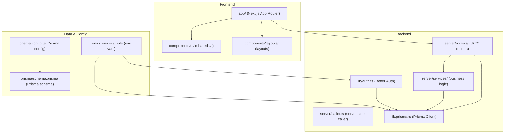
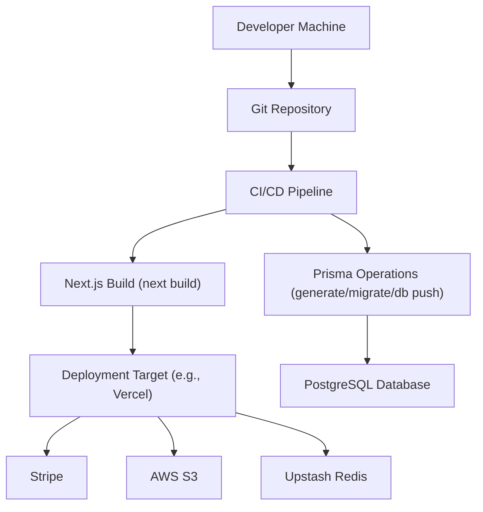
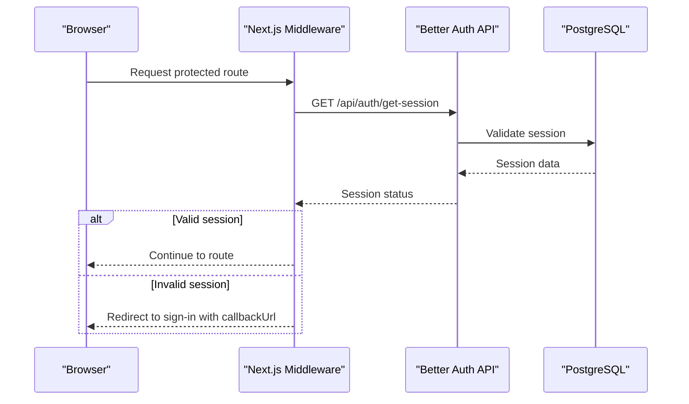
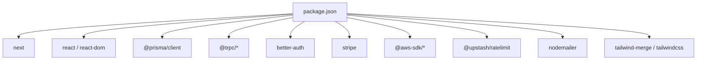

# Build and Deployment

<cite>
**Referenced Files in This Document**
- [next.config.ts](file://next.config.ts)
- [package.json](file://package.json)
- [SETUP.md](file://SETUP.md)
- [README.md](file://README.md)
- [docs/ARCHITECTURE.md](file://docs/ARCHITECTURE.md)
- [.env.example](file://.env.example)
- [middleware.ts](file://middleware.ts)
- [lib/prisma.ts](file://lib/prisma.ts)
- [lib/auth.ts](file://lib/auth.ts)
- [prisma/schema.prisma](file://prisma/schema.prisma)
- [prisma.config.ts](file://prisma.config.ts)
</cite>

## Table of Contents
1. [Introduction](#introduction)
2. [Project Structure](#project-structure)
3. [Core Components](#core-components)
4. [Architecture Overview](#architecture-overview)
5. [Detailed Component Analysis](#detailed-component-analysis)
6. [Dependency Analysis](#dependency-analysis)
7. [Performance Considerations](#performance-considerations)
8. [Troubleshooting Guide](#troubleshooting-guide)
9. [Conclusion](#conclusion)
10. [Appendices](#appendices)

## Introduction
This document provides comprehensive build and deployment guidance for Smartfolio. It covers Next.js build configuration, environment variable management, optimization strategies, deployment preparation, CI/CD pipeline setup, production optimization, Prisma migration and database deployment, rollback procedures, performance monitoring, error tracking, maintenance, scaling, multiple environments, and blue-green deployments.

## Project Structure
Smartfolio follows a modern Next.js 16 App Router architecture with a clear separation of concerns:
- Frontend: Next.js App Router under app/, shared UI components under components/ui and layout wrappers under components/layouts
- Backend: tRPC routers under server/routers, services under server/services, and a central caller under server/caller.ts
- Authentication: Better Auth configuration under lib/auth.ts with Prisma adapter
- Database: Prisma schema under prisma/schema.prisma and Prisma config under prisma.config.ts
- Environment: .env and .env.example for secrets and configuration
- Middleware: Next.js middleware.ts for route protection and auth redirects

**Diagram sources**
- [SETUP.md](file://SETUP.md#L37-L85)
- [lib/auth.ts](file://lib/auth.ts#L1-L25)
- [lib/prisma.ts](file://lib/prisma.ts#L1-L14)
- [prisma/schema.prisma](file://prisma/schema.prisma#L1-L230)
- [prisma.config.ts](file://prisma.config.ts#L1-L16)

**Section sources**
- [SETUP.md](file://SETUP.md#L37-L85)
- [docs/ARCHITECTURE.md](file://docs/ARCHITECTURE.md#L1-L363)

## Core Components
- Next.js build configuration: next.config.ts is currently minimal and suitable for default Next.js behavior. Production builds leverage Next.js’s optimized output and static generation where applicable.
- Environment variables: Managed via .env and .env.example. Critical variables include database URL, Better Auth secrets and base URL, Stripe keys, AI provider keys, AWS credentials, Upstash Redis, and application URLs.
- Prisma configuration: Prisma schema defines models for authentication, portfolios, billing, AI generations, and analytics. prisma.config.ts sets schema path, migration location, seed command, and datasource URL.
- Authentication: Better Auth integrates with Prisma adapter and supports OAuth providers and email/password.
- Middleware: Next.js middleware enforces route protection and redirects unauthenticated users to sign-in while allowing public routes and skipping API/static assets.

**Section sources**
- [next.config.ts](file://next.config.ts#L1-L8)
- [.env.example](file://.env.example#L1-L84)
- [prisma/schema.prisma](file://prisma/schema.prisma#L1-L230)
- [prisma.config.ts](file://prisma.config.ts#L1-L16)
- [lib/auth.ts](file://lib/auth.ts#L1-L25)
- [middleware.ts](file://middleware.ts#L1-L95)

## Architecture Overview
The build and deployment pipeline centers around Next.js production builds, Prisma database operations, and secure environment configuration. The architecture supports:
- Type-safe API layer via tRPC
- Secure authentication with Better Auth and Prisma
- Stripe billing and AWS S3 storage
- Upstash Redis for rate limiting
- Middleware-based route protection

**Diagram sources**
- [package.json](file://package.json#L5-L14)
- [prisma/schema.prisma](file://prisma/schema.prisma#L8-L11)
- [lib/auth.ts](file://lib/auth.ts#L1-L25)
- [lib/prisma.ts](file://lib/prisma.ts#L1-L14)

## Detailed Component Analysis

### Next.js Build Configuration
- Build scripts: Development, production build, and production start are defined in package.json. These align with standard Next.js workflows.
- next.config.ts: Minimal configuration allows Next.js defaults. For production optimization, consider adding output tracing, static export where applicable, and asset optimization policies.
- Environment exposure: Only variables prefixed with NEXT_PUBLIC_ are exposed to the browser. Ensure sensitive secrets remain server-only.

Recommended additions to next.config.ts for production:
- Output tracing for smaller server bundles
- Static export for public pages
- Image optimization and font optimization settings
- Experimental flags if needed for advanced features

**Section sources**
- [package.json](file://package.json#L5-L14)
- [next.config.ts](file://next.config.ts#L1-L8)
- [README.md](file://README.md#L53-L57)

### Environment Variable Management
- Required variables include database URL, Better Auth secret/base URL, Stripe keys, AI provider keys, AWS credentials, Upstash Redis, and application URLs.
- Copy .env.example to .env and populate values. Never commit .env to version control.
- Use separate environment files for local, staging, and production with CI/CD secrets management.

Key variables and their roles:
- DATABASE_URL: PostgreSQL connection string for Prisma
- BETTER_AUTH_SECRET and BETTER_AUTH_URL: Better Auth configuration
- Stripe keys: Secret key, webhook secret, and price IDs
- AI provider keys: OPENAI_API_KEY
- AWS credentials: Access key, secret key, bucket, and region
- Upstash Redis: Rate limiting
- NEXT_PUBLIC_APP_URL: Public-facing application URL

**Section sources**
- [.env.example](file://.env.example#L1-L84)
- [SETUP.md](file://SETUP.md#L97-L144)

### Prisma Migration Strategy and Database Deployment
- Schema definition: prisma/schema.prisma defines models, relations, and indexes for the entire domain.
- Prisma config: prisma.config.ts sets schema path, migration directory, seed command, and datasource URL.
- Migration commands: Use Prisma CLI scripts defined in package.json for generating clients, pushing schema, creating migrations, and seeding.

Recommended migration workflow:
- Local development: npx prisma generate, npx prisma db push
- Staging: npx prisma migrate dev (or prisma migrate deploy in CI)
- Production: npx prisma migrate deploy (non-interactive)

Seed strategy:
- Seed script configured in prisma.config.ts to run during migration setup.

Rollback procedures:
- Use prisma migrate resolve with mark-applied or mark-rolled-back depending on desired outcome.
- Maintain safe-to-rollback migrations and test rollback in staging before production.

**Section sources**
- [prisma/schema.prisma](file://prisma/schema.prisma#L1-L230)
- [prisma.config.ts](file://prisma.config.ts#L1-L16)
- [package.json](file://package.json#L10-L14)
- [SETUP.md](file://SETUP.md#L145-L150)

### Authentication and Middleware
- Better Auth integration: lib/auth.ts configures the auth server with Prisma adapter, enabling email/password and OAuth providers. It reads client IDs/secrets and base URL from environment variables.
- Prisma client logging: lib/prisma.ts sets logging levels based on NODE_ENV, aiding debugging in development.
- Next.js middleware: middleware.ts protects routes by checking session state and redirecting unauthorized users to sign-in while allowing public routes and skipping API/static assets.

**Diagram sources**
- [middleware.ts](file://middleware.ts#L28-L81)
- [lib/auth.ts](file://lib/auth.ts#L1-L25)
- [lib/prisma.ts](file://lib/prisma.ts#L1-L14)

**Section sources**
- [lib/auth.ts](file://lib/auth.ts#L1-L25)
- [lib/prisma.ts](file://lib/prisma.ts#L1-L14)
- [middleware.ts](file://middleware.ts#L1-L95)

### CI/CD Pipeline Setup
Recommended pipeline stages:
- Install dependencies
- Lint and type-check
- Environment setup (.env for CI)
- Prisma generate and migrations (staging/production)
- Next.js build
- Tests (if applicable)
- Deploy artifacts to target platform

Example pipeline steps (conceptual):
- Install: npm ci
- Lint: npm run lint
- Prisma: npx prisma generate, npx prisma migrate deploy
- Build: npm run build
- Deploy: next start or platform-specific deployment (e.g., Vercel)

Secrets management:
- Store environment variables as CI/CD secrets
- Use separate secrets per environment (local, staging, production)

**Section sources**
- [package.json](file://package.json#L5-L14)
- [SETUP.md](file://SETUP.md#L199-L210)

### Production Optimization Techniques
- Build output: Use next build for optimized production bundles and static generation where applicable.
- Asset optimization: Enable image optimization and font optimization in next.config.ts.
- Logging: Keep Prisma client logs minimal in production; rely on structured logs and monitoring.
- Middleware: Ensure middleware matcher excludes static assets and API routes to reduce overhead.
- Database: Use a managed PostgreSQL service (e.g., Neon) for improved reliability and performance.
- CDN and caching: Leverage platform CDN for static assets and implement appropriate cache headers.

**Section sources**
- [next.config.ts](file://next.config.ts#L1-L8)
- [lib/prisma.ts](file://lib/prisma.ts#L10-L11)
- [middleware.ts](file://middleware.ts#L83-L94)

### Deployment Preparation
- Prepare environment files for each target environment (local, staging, production) with appropriate secrets.
- Validate Prisma schema and migrations locally before deploying.
- Confirm Next.js build completes successfully and static export is configured if needed.
- Verify middleware matcher and route protection behavior in a staging environment.

**Section sources**
- [.env.example](file://.env.example#L1-L84)
- [SETUP.md](file://SETUP.md#L145-L150)
- [middleware.ts](file://middleware.ts#L83-L94)

### Blue-Green Deployments
Approach:
- Maintain two identical environments (green and blue)
- Serve traffic to one environment (e.g., green)
- Perform deployment to the inactive environment (blue)
- Validate health and monitor metrics
- Switch traffic to blue and keep green as rollback target

Implementation tips:
- Use platform routing rules or load balancer to switch traffic
- Keep database migrations backward-compatible or use zero-downtime strategies
- Monitor error rates, latency, and availability during switchover

[No sources needed since this section provides general guidance]

### Scaling Deployment
- Horizontal scaling: Increase replicas behind a load balancer
- Database scaling: Use read replicas and connection pooling
- CDN and caching: Offload static assets and cache API responses
- Rate limiting: Use Upstash Redis to prevent abuse and protect downstream systems
- Observability: Implement structured logging, metrics, and distributed tracing

**Section sources**
- [docs/ARCHITECTURE.md](file://docs/ARCHITECTURE.md#L270-L282)

### Managing Multiple Environments
- Separate repositories or branches per environment
- Environment-specific configuration files and CI/CD secrets
- Automated promotion from staging to production
- Consistent naming for databases and services across environments

**Section sources**
- [.env.example](file://.env.example#L1-L84)
- [SETUP.md](file://SETUP.md#L97-L144)

## Dependency Analysis
Smartfolio’s build and runtime dependencies are defined in package.json. Key categories:
- Next.js and React ecosystem
- Prisma ORM and PostgreSQL client
- tRPC for type-safe APIs
- Better Auth for authentication
- Stripe for billing
- AWS SDK for S3
- Upstash for rate limiting
- Nodemailer for email
- Tailwind CSS 4 and related tooling

**Diagram sources**
- [package.json](file://package.json#L16-L38)

**Section sources**
- [package.json](file://package.json#L1-L52)

## Performance Considerations
- Build performance: Use incremental builds, cache node_modules, and parallelize CI jobs
- Runtime performance: Optimize database queries, enable Prisma client caching, and minimize unnecessary re-renders
- Network performance: Use CDN, compress assets, and implement efficient image loading
- Monitoring: Track key metrics (response time, error rate, throughput) and set up alerts

[No sources needed since this section provides general guidance]

## Troubleshooting Guide
Common issues and resolutions:
- Database connectivity: Verify DATABASE_URL and network access; confirm Prisma client initialization
- Authentication failures: Check BETTER_AUTH_SECRET, BETTER_AUTH_URL, and provider credentials
- Stripe webhooks: Validate webhook signatures and ensure endpoints are reachable
- AWS S3 uploads: Confirm credentials, bucket permissions, and region configuration
- Middleware redirects loops: Review middleware matcher and protected/public routes
- Prisma migrations: Ensure migrations are applied before starting the server; use prisma migrate deploy in CI

**Section sources**
- [lib/prisma.ts](file://lib/prisma.ts#L1-L14)
- [lib/auth.ts](file://lib/auth.ts#L1-L25)
- [middleware.ts](file://middleware.ts#L1-L95)
- [prisma/schema.prisma](file://prisma/schema.prisma#L8-L11)

## Conclusion
Smartfolio’s build and deployment pipeline leverages Next.js, Prisma, Better Auth, Stripe, and AWS S3 with a focus on type safety, security, and scalability. By following the outlined practices—environment management, migration strategies, CI/CD setup, production optimization, monitoring, and blue-green deployments—you can achieve reliable, repeatable, and scalable deployments across environments.

[No sources needed since this section summarizes without analyzing specific files]

## Appendices

### Practical Examples
- Build process: npm run build followed by next start
- Environment configuration: cp .env.example .env and populate required variables
- Deployment automation: Use CI/CD to run Prisma migrations and Next.js build before deploying

**Section sources**
- [package.json](file://package.json#L5-L14)
- [SETUP.md](file://SETUP.md#L97-L150)