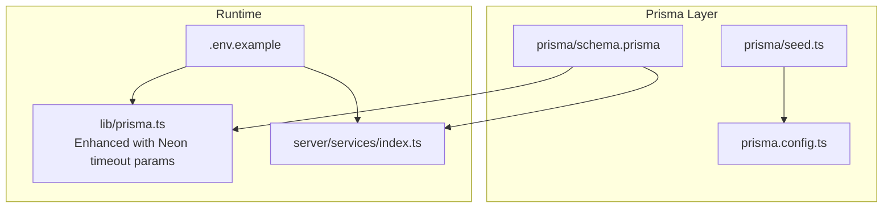
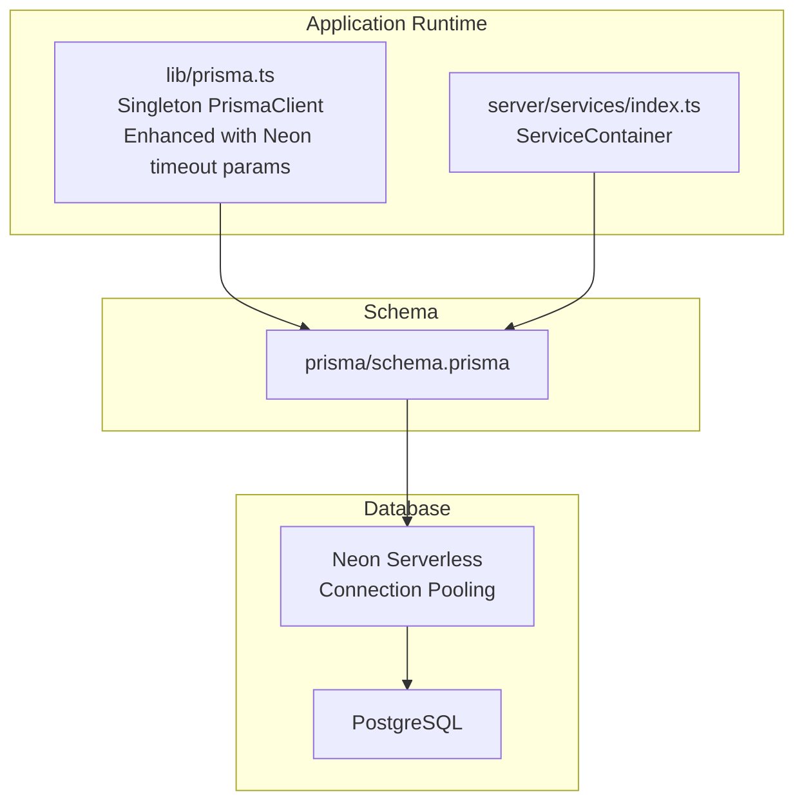
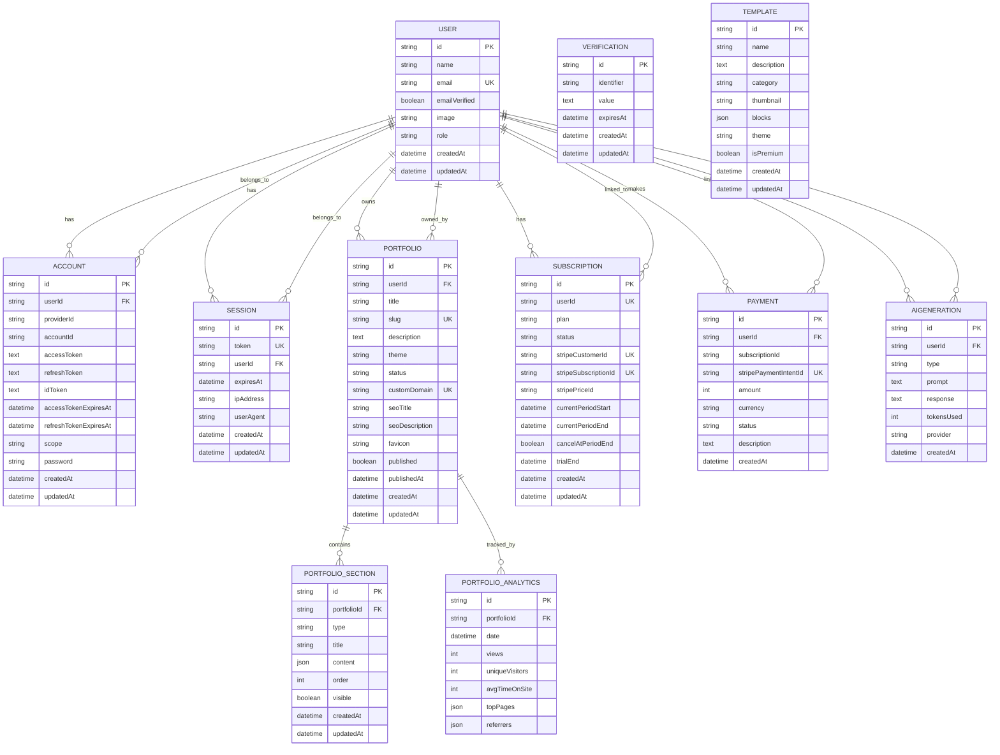
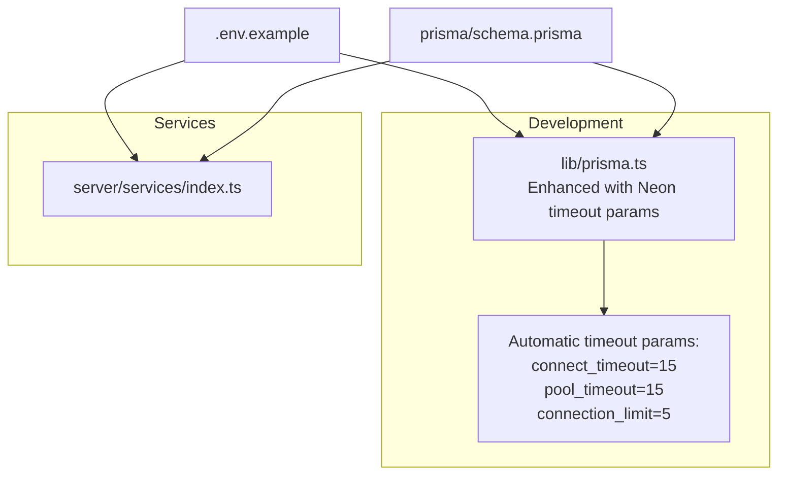

# Database Schema and Models

<cite>
**Referenced Files in This Document**
- [prisma/schema.prisma](file://prisma/schema.prisma)
- [prisma/seed.ts](file://prisma/seed.ts)
- [prisma.config.ts](file://prisma.config.ts)
- [.env.example](file://.env.example)
- [lib/prisma.ts](file://lib/prisma.ts)
- [server/services/index.ts](file://server/services/index.ts)
</cite>

## Update Summary
**Changes Made**
- Enhanced database connectivity section with connection timeout parameters for Neon serverless PostgreSQL
- Updated database initialization and environment configuration to include connection pooling parameters
- Added troubleshooting guidance for Neon-specific connection issues
- Updated performance considerations to address serverless database connection patterns

## Table of Contents
1. [Introduction](#introduction)
2. [Project Structure](#project-structure)
3. [Core Components](#core-components)
4. [Architecture Overview](#architecture-overview)
5. [Detailed Component Analysis](#detailed-component-analysis)
6. [Dependency Analysis](#dependency-analysis)
7. [Performance Considerations](#performance-considerations)
8. [Troubleshooting Guide](#troubleshooting-guide)
9. [Conclusion](#conclusion)
10. [Appendices](#appendices)

## Introduction
This document provides comprehensive database schema documentation for Smartfolio. It explains the Prisma schema design, entity relationships, indexes, and constraints. It also covers data seeding, migration strategy, initialization, and operational guidance for extending the schema and implementing new data models. Practical examples of queries, relationship handling, and performance optimization are included, along with validation rules, business logic enforcement, and integrity measures.

**Updated** Enhanced with connection timeout parameters specifically designed for Neon serverless PostgreSQL connections to improve reliability in serverless environments.

## Project Structure
Smartfolio's database layer is defined via Prisma with a single schema file and a seed script. Environment variables configure the database URL and other integrations. A dedicated Prisma client singleton is used in development, while a separate service container instantiates its own client for backend services. The connection now includes timeout parameters optimized for Neon serverless PostgreSQL.

**Diagram sources**
- [prisma/schema.prisma](file://prisma/schema.prisma#L1-L230)
- [prisma/seed.ts](file://prisma/seed.ts#L1-L330)
- [prisma.config.ts](file://prisma.config.ts#L1-L16)
- [.env.example](file://.env.example#L1-L84)
- [lib/prisma.ts](file://lib/prisma.ts#L1-L24)
- [server/services/index.ts](file://server/services/index.ts#L1-L118)

**Section sources**
- [prisma/schema.prisma](file://prisma/schema.prisma#L1-L230)
- [prisma/seed.ts](file://prisma/seed.ts#L1-L330)
- [prisma.config.ts](file://prisma.config.ts#L1-L16)
- [.env.example](file://.env.example#L1-L84)
- [lib/prisma.ts](file://lib/prisma.ts#L1-L24)
- [server/services/index.ts](file://server/services/index.ts#L1-L118)

## Core Components
This section documents the database schema entities, their attributes, relationships, indexes, and constraints.

- Authentication Models (Better Auth)
  - User
    - Fields: id, name, email (unique), emailVerified, image, role, timestamps
    - Relations: accounts, sessions, portfolios, subscription, payments, aiGenerations
    - Indexes: email
  - Account
    - Fields: id, userId, providerId, accountId, tokens (nullable), timestamps
    - Relation: user (foreign key with cascade delete)
    - Uniqueness: providerId + accountId
    - Indexes: userId
  - Session
    - Fields: id, token (unique), userId, expiresAt, ipAddress, userAgent, timestamps
    - Relation: user (foreign key with cascade delete)
    - Indexes: userId
  - Verification
    - Fields: id, identifier, value, expiresAt, timestamps
    - Indexes: identifier

- Portfolio Models
  - Portfolio
    - Fields: id, userId, title, slug (unique), description (text), theme, status, customDomain (unique), seo fields, favicon, published, publishedAt, timestamps
    - Relation: user (foreign key with cascade delete)
    - Relations: sections, analytics
    - Indexes: userId, slug, status
  - PortfolioSection
    - Fields: id, portfolioId, type, title, content (JSON), order, visible, timestamps
    - Relation: portfolio (foreign key with cascade delete)
    - Indexes: portfolioId, order
  - PortfolioAnalytics
    - Fields: id, portfolioId, date, views, uniqueVisitors, avgTimeOnSite, topPages (JSON), referrers (JSON)
    - Relation: portfolio (foreign key with cascade delete)
    - Indexes: portfolioId, date

- Builder & Templates
  - Template
    - Fields: id, name, description (text), category, thumbnail, blocks (JSON), theme, isPremium, timestamps
    - Indexes: category, isPremium

- Billing & Subscriptions
  - Subscription
    - Fields: id, userId (unique), plan, status, stripe identifiers (unique), period dates, cancellation flag, trial end, timestamps
    - Relation: user (foreign key with cascade delete)
    - Indexes: userId, status
  - Payment
    - Fields: id, userId, subscriptionId, stripePaymentIntentId (unique), amount (cents), currency, status, description (text), timestamps
    - Relation: user (foreign key with cascade delete)
    - Indexes: userId, status

- AI Generation
  - AIGeneration
    - Fields: id, userId, type, prompt (text), response (text), tokensUsed, provider, timestamps
    - Relation: user (foreign key with cascade delete)
    - Indexes: userId, type, createdAt

Constraints and defaults observed:
- All primary keys are cuid()-generated strings.
- Timestamps use createdAt/default(now()) and updatedAt/@updatedAt.
- Enum-like statuses use string enums with defaults (e.g., role, theme, status, provider).
- Unique constraints on email, slug, customDomain, stripe identifiers, and composite providerId+accountId.
- Cascade deletes on user-dependent relations.

**Section sources**
- [prisma/schema.prisma](file://prisma/schema.prisma#L17-L36)
- [prisma/schema.prisma](file://prisma/schema.prisma#L38-L57)
- [prisma/schema.prisma](file://prisma/schema.prisma#L59-L72)
- [prisma/schema.prisma](file://prisma/schema.prisma#L74-L83)
- [prisma/schema.prisma](file://prisma/schema.prisma#L89-L113)
- [prisma/schema.prisma](file://prisma/schema.prisma#L115-L130)
- [prisma/schema.prisma](file://prisma/schema.prisma#L132-L146)
- [prisma/schema.prisma](file://prisma/schema.prisma#L152-L166)
- [prisma/schema.prisma](file://prisma/schema.prisma#L172-L191)
- [prisma/schema.prisma](file://prisma/schema.prisma#L193-L208)
- [prisma/schema.prisma](file://prisma/schema.prisma#L214-L229)

## Architecture Overview
The database architecture centers around a central Prisma schema with explicit relations and indexes. The Prisma client is instantiated in two contexts:
- Development runtime: a singleton client configured with environment-specific logging and enhanced Neon connection parameters.
- Backend services: a service container creates its own Prisma client instance and injects it into domain services.

**Updated** The development client now automatically appends connection timeout parameters to the DATABASE_URL for improved resilience with Neon serverless PostgreSQL.

**Diagram sources**
- [lib/prisma.ts](file://lib/prisma.ts#L1-L24)
- [server/services/index.ts](file://server/services/index.ts#L1-L118)
- [prisma/schema.prisma](file://prisma/schema.prisma#L1-L230)

**Section sources**
- [lib/prisma.ts](file://lib/prisma.ts#L1-L24)
- [server/services/index.ts](file://server/services/index.ts#L1-L118)
- [prisma/schema.prisma](file://prisma/schema.prisma#L1-L230)

## Detailed Component Analysis

### Entity Relationship Diagram
The following ER diagram maps the schema entities and their relationships as defined in the Prisma schema.

**Diagram sources**
- [prisma/schema.prisma](file://prisma/schema.prisma#L17-L36)
- [prisma/schema.prisma](file://prisma/schema.prisma#L38-L57)
- [prisma/schema.prisma](file://prisma/schema.prisma#L59-L72)
- [prisma/schema.prisma](file://prisma/schema.prisma#L74-L83)
- [prisma/schema.prisma](file://prisma/schema.prisma#L89-L113)
- [prisma/schema.prisma](file://prisma/schema.prisma#L115-L130)
- [prisma/schema.prisma](file://prisma/schema.prisma#L132-L146)
- [prisma/schema.prisma](file://prisma/schema.prisma#L152-L166)
- [prisma/schema.prisma](file://prisma/schema.prisma#L172-L191)
- [prisma/schema.prisma](file://prisma/schema.prisma#L193-L208)
- [prisma/schema.prisma](file://prisma/schema.prisma#L214-L229)

### Data Migration Strategy
- Prisma Migrations: The Prisma configuration defines migration storage under prisma/migrations and seeds via tsx.
- Seed Management: The seed script creates starter templates if they do not exist, ensuring consistent baseline data across environments.
- Initialization: The Prisma client reads DATABASE_URL from environment variables. In development, the singleton client logs queries, errors, and warnings, and automatically appends Neon connection timeout parameters.

**Updated** The development client now automatically enhances the DATABASE_URL with connection timeout parameters for improved Neon serverless PostgreSQL resilience.

Operational guidance:
- To initialize or reset the database, run Prisma migrations and seed commands as configured.
- For production, ensure DATABASE_URL points to the managed PostgreSQL instance and apply migrations through CI/CD.
- When using Neon serverless, the automatic timeout parameters help prevent connection drops during cold starts.

**Section sources**
- [prisma.config.ts](file://prisma.config.ts#L1-L16)
- [prisma/seed.ts](file://prisma/seed.ts#L1-L330)
- [lib/prisma.ts](file://lib/prisma.ts#L1-L24)
- [.env.example](file://.env.example#L1-L84)

### Database Initialization and Environment Configuration
- Database Provider: PostgreSQL configured via datasource db with provider set to postgresql.
- Connection URL: Provided by DATABASE_URL environment variable.
- Development Logging: The singleton client enables verbose logging in development mode.
- **Neon Connection Parameters**: Automatically appended to DATABASE_URL for serverless resilience.

**Updated** Enhanced with automatic connection timeout parameters for Neon serverless PostgreSQL.

Environment variables of interest:
- DATABASE_URL: Postgres connection string with automatic timeout parameters for Neon
- BETTER_AUTH_SECRET, BETTER_AUTH_URL: Authentication configuration
- Stripe keys: NEXT_PUBLIC_STRIPE_PUBLISHABLE_KEY, STRIPE_SECRET_KEY, STRIPE_WEBHOOK_SECRET, and price IDs
- AI providers: OPENAI_API_KEY and optional Anthropic/Google AI keys
- Application URLs and environment mode

**Section sources**
- [prisma/schema.prisma](file://prisma/schema.prisma#L8-L11)
- [lib/prisma.ts](file://lib/prisma.ts#L7-L14)
- [.env.example](file://.env.example#L1-L84)

### Prisma Client Usage and Connection Management
- Singleton Client (Development): A global-scoped singleton ensures a single Prisma client instance during development with environment-aware logging and automatic Neon timeout parameters.
- Service Container (Backend): A service container constructs its own Prisma client and passes it to domain services (AI, Stripe, Email, Storage), enabling centralized resource lifecycle management and dependency injection.

**Updated** The development client now automatically appends connection timeout parameters to improve serverless database connectivity.

Best practices:
- Prefer the singleton in Next.js app routes for simplicity with automatic Neon resilience.
- Use the service container pattern for server-side services requiring strict lifecycle control.
- Monitor connection pool usage in serverless environments.

**Section sources**
- [lib/prisma.ts](file://lib/prisma.ts#L1-L24)
- [server/services/index.ts](file://server/services/index.ts#L1-L118)

### Practical Queries and Relationship Handling
Common query patterns supported by the schema and indexes:
- Fetch user with related data:
  - List portfolios by userId
  - Load sessions/accounts by userId
  - Get subscription/payment history by userId
- Portfolio queries:
  - Find portfolio by slug or customDomain
  - List sections by portfolioId and order
  - Aggregate analytics by portfolioId and date
- Template queries:
  - Filter by category and isPremium
- AI generation:
  - List generations by userId and type

Index utilization:
- email on User
- providerId+accountId on Account
- userId on Account, Session, Portfolio, Payment, AIGeneration
- slug and status on Portfolio
- portfolioId and date on PortfolioAnalytics
- category and isPremium on Template
- status on Subscription, Payment

These indexes optimize typical read paths and join conditions.

**Section sources**
- [prisma/schema.prisma](file://prisma/schema.prisma#L35-L36)
- [prisma/schema.prisma](file://prisma/schema.prisma#L55-L57)
- [prisma/schema.prisma](file://prisma/schema.prisma#L69-L72)
- [prisma/schema.prisma](file://prisma/schema.prisma#L110-L113)
- [prisma/schema.prisma](file://prisma/schema.prisma#L144-L146)
- [prisma/schema.prisma](file://prisma/schema.prisma#L164-L166)
- [prisma/schema.prisma](file://prisma/schema.prisma#L206-L208)
- [prisma/schema.prisma](file://prisma/schema.prisma#L226-L229)

### Data Validation Rules and Integrity Measures
- Unique constraints:
  - User.email, Portfolio.slug, Portfolio.customDomain, Subscription.userId/stripe identifiers, Payment.stripePaymentIntentId, Account.providerId+accountId
- Defaults:
  - Role, theme, status, currency, provider, timestamps
- Cascade deletes:
  - On user-dependent relations enforce referential integrity and prevent orphaned records
- JSON fields:
  - PortfolioSection.content, PortfolioAnalytics.topPages/referrers, Template.blocks enable flexible content modeling while maintaining relational integrity

**Section sources**
- [prisma/schema.prisma](file://prisma/schema.prisma#L20-L20)
- [prisma/schema.prisma](file://prisma/schema.prisma#L93-L93)
- [prisma/schema.prisma](file://prisma/schema.prisma#L97-L97)
- [prisma/schema.prisma](file://prisma/schema.prisma#L174-L174)
- [prisma/schema.prisma](file://prisma/schema.prisma#L177-L179)
- [prisma/schema.prisma](file://prisma/schema.prisma#L197-L197)
- [prisma/schema.prisma](file://prisma/schema.prisma#L55-L55)
- [prisma/schema.prisma](file://prisma/schema.prisma#L120-L120)
- [prisma/schema.prisma](file://prisma/schema.prisma#L139-L140)
- [prisma/schema.prisma](file://prisma/schema.prisma#L158-L158)
- [prisma/schema.prisma](file://prisma/schema.prisma#L217-L217)

### Extending the Schema and Implementing New Models
Guidance for adding new entities:
- Define the model in prisma/schema.prisma with appropriate fields, relations, and indexes.
- Add foreign keys and relations to maintain referential integrity.
- Consider unique constraints for identifiers (e.g., slugs, external IDs).
- Add indexes for frequently queried columns (userId, status, date).
- Keep defaults aligned with business semantics (enums, booleans, timestamps).
- Run migrations and seed as needed.

Example extension steps:
- Create a new model with cuid() id and timestamps.
- Add relation fields and @relation directives.
- Apply @@index directives for performance.
- Update seed logic if baseline data is required.

**Section sources**
- [prisma/schema.prisma](file://prisma/schema.prisma#L1-L230)
- [prisma.config.ts](file://prisma.config.ts#L1-L16)
- [prisma/seed.ts](file://prisma/seed.ts#L1-L330)

## Dependency Analysis
The following diagram shows how the Prisma client is consumed across the application, including the enhanced Neon connection parameters.

**Diagram sources**
- [.env.example](file://.env.example#L1-L84)
- [prisma/schema.prisma](file://prisma/schema.prisma#L1-L230)
- [lib/prisma.ts](file://lib/prisma.ts#L1-L24)
- [server/services/index.ts](file://server/services/index.ts#L1-L118)

**Section sources**
- [.env.example](file://.env.example#L1-L84)
- [prisma/schema.prisma](file://prisma/schema.prisma#L1-L230)
- [lib/prisma.ts](file://lib/prisma.ts#L1-L24)
- [server/services/index.ts](file://server/services/index.ts#L1-L118)

## Performance Considerations
- Indexes: Leverage existing indexes on userId, slug, status, portfolioId, date to speed up joins and filters.
- Queries: Use selective projections and pagination for lists (portfolios, sections, analytics).
- JSON fields: Store flexible content in JSON fields but avoid heavy processing in the database; denormalize only when necessary.
- Cascades: Cascade deletes simplify cleanup but can trigger cascading writes; monitor during bulk operations.
- Logging: In development, enable query logging to identify slow queries; disable in production.
- **Serverless Optimization**: The automatic timeout parameters help prevent connection drops in serverless environments like Neon, improving reliability during cold starts and low-traffic periods.

**Updated** Added serverless optimization considerations for Neon connections.

[No sources needed since this section provides general guidance]

## Troubleshooting Guide
Common issues and resolutions:
- Connection failures:
  - Verify DATABASE_URL correctness and network access.
  - Confirm environment loading in development vs. production.
  - **Neon-specific**: Check if automatic timeout parameters are being applied correctly.
- Migration errors:
  - Re-run migrations after fixing schema inconsistencies.
  - Ensure seed command executes successfully.
- Client lifecycle:
  - In services, explicitly disconnect the Prisma client to free resources.
- Authentication:
  - Ensure BETTER_AUTH_SECRET and BETTER_AUTH_URL are set for auth flows.
- **Serverless Connectivity Issues**:
  - Verify that the automatic timeout parameters (connect_timeout=15, pool_timeout=15, connection_limit=5) are appended to your DATABASE_URL.
  - Monitor connection pool exhaustion in high-concurrency scenarios.
  - Consider adjusting connection_limit based on your Neon plan limits.

**Updated** Added specific guidance for Neon serverless connection issues.

**Section sources**
- [.env.example](file://.env.example#L1-L84)
- [lib/prisma.ts](file://lib/prisma.ts#L7-L14)
- [server/services/index.ts](file://server/services/index.ts#L105-L107)

## Conclusion
Smartfolio's database schema emphasizes strong referential integrity, clear indexing for common queries, and flexible JSON fields for dynamic content. The Prisma configuration and seed script provide a reproducible initialization path, while the dual client usage patterns support both frontend convenience and backend service control. The enhanced connection timeout parameters specifically improve reliability for Neon serverless PostgreSQL deployments. Following the extension guidance and performance recommendations will help maintain a scalable and robust data layer.

**Updated** Enhanced conclusion to reflect the improved database connectivity for serverless environments.

[No sources needed since this section summarizes without analyzing specific files]

## Appendices

### Appendix A: Environment Variables Reference
- Database: DATABASE_URL (automatically enhanced with timeout parameters for Neon)
- Authentication: BETTER_AUTH_SECRET, BETTER_AUTH_URL
- Billing: NEXT_PUBLIC_STRIPE_PUBLISHABLE_KEY, STRIPE_SECRET_KEY, STRIPE_WEBHOOK_SECRET, Stripe price IDs
- AI Providers: OPENAI_API_KEY, optional Anthropic/Google keys
- Application: NEXT_PUBLIC_APP_URL, NODE_ENV
- Optional integrations: SMTP, AWS S3, Redis rate limiting

**Section sources**
- [.env.example](file://.env.example#L1-L84)

### Appendix B: Neon Connection Timeout Parameters
The development Prisma client automatically appends the following parameters to DATABASE_URL for Neon serverless PostgreSQL:
- `connect_timeout=15`: Connection establishment timeout in seconds
- `pool_timeout=15`: Connection pool acquisition timeout in seconds  
- `connection_limit=5`: Maximum concurrent connections

These parameters help prevent connection drops during serverless cold starts and improve overall reliability.

**Section sources**
- [lib/prisma.ts](file://lib/prisma.ts#L7-L14)