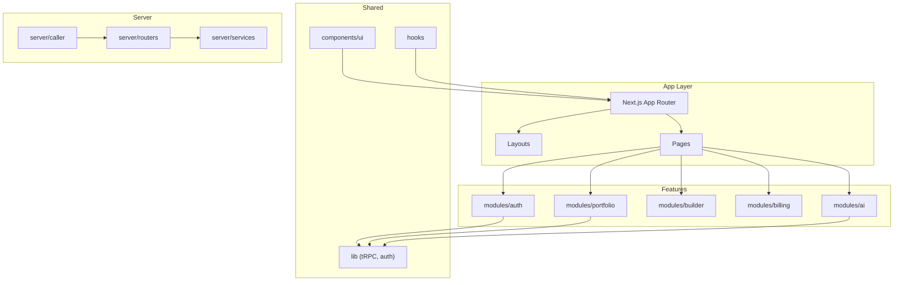
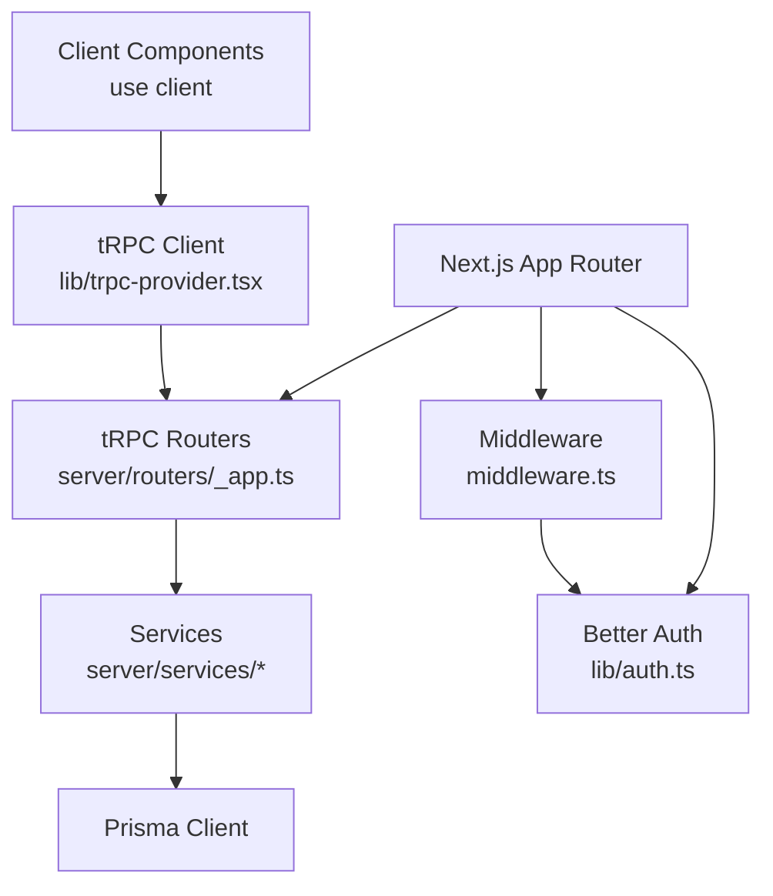
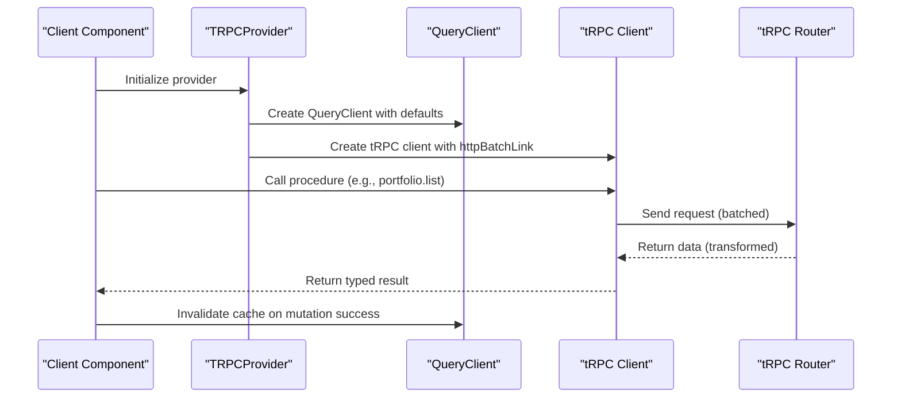
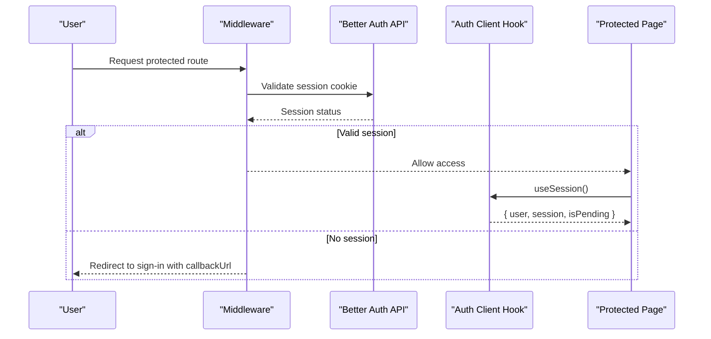
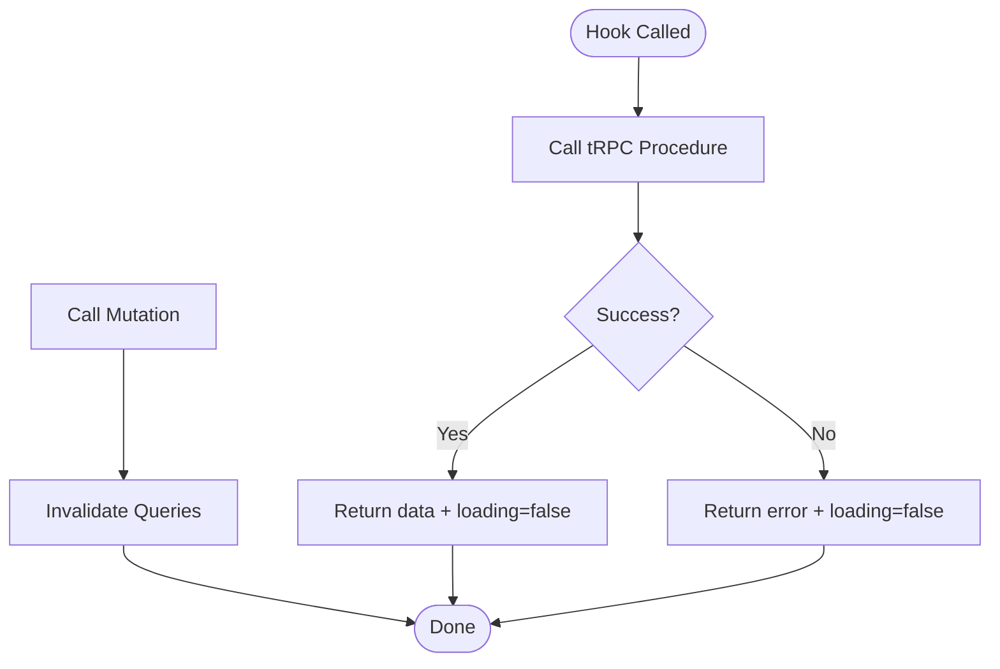
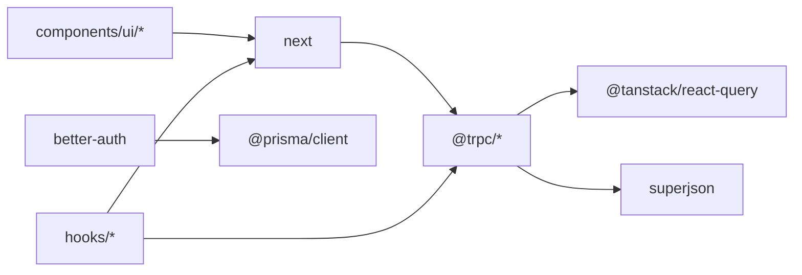

# Developer Guidelines

<cite>
**Referenced Files in This Document**
- [README.md](file://README.md)
- [package.json](file://package.json)
- [tsconfig.json](file://tsconfig.json)
- [eslint.config.mjs](file://eslint.config.mjs)
- [next.config.ts](file://next.config.ts)
- [middleware.ts](file://middleware.ts)
- [lib/trpc-provider.tsx](file://lib/trpc-provider.tsx)
- [lib/auth.ts](file://lib/auth.ts)
- [modules/auth/hooks.ts](file://modules/auth/hooks.ts)
- [modules/portfolio/hooks.ts](file://modules/portfolio/hooks.ts)
- [hooks/index.ts](file://hooks/index.ts)
- [hooks/use-debounce.ts](file://hooks/use-debounce.ts)
- [components/ui/button.tsx](file://components/ui/button.tsx)
- [server/routers/_app.ts](file://server/routers/_app.ts)
- [server/caller.ts](file://server/caller.ts)
</cite>

## Table of Contents
1. [Introduction](#introduction)
2. [Project Structure](#project-structure)
3. [Core Components](#core-components)
4. [Architecture Overview](#architecture-overview)
5. [Detailed Component Analysis](#detailed-component-analysis)
6. [Dependency Analysis](#dependency-analysis)
7. [Performance Considerations](#performance-considerations)
8. [Troubleshooting Guide](#troubleshooting-guide)
9. [Development Workflow and Standards](#development-workflow-and-standards)
10. [Testing Strategy](#testing-strategy)
11. [Code Review and Branch Management](#code-review-and-branch-management)
12. [Extending Features and Maintaining Quality](#extending-features-and-maintaining-quality)
13. [Conclusion](#conclusion)

## Introduction
This document provides comprehensive developer guidelines for Smartfolio, a production-ready SaaS application for building AI-powered portfolio websites. It covers code standards, development workflow, contribution best practices, configuration (TypeScript, ESLint), component and hook patterns, testing, debugging, performance optimization, and maintenance processes.

## Project Structure
Smartfolio follows a modular, feature-based structure with clear separation of concerns:
- app: Next.js App Router pages and API routes
- components: Reusable UI primitives and layout components
- hooks: Shared and feature-specific React hooks
- lib: Client-side providers and shared libraries (tRPC, auth)
- modules: Feature domains (auth, portfolio, builder, billing, ai)
- server: tRPC routers, services, and server-side callers
- prisma: Database schema and seeding
- docs: Architectural and implementation documentation

**Section sources**
- [README.md](file://README.md#L1-L58)
- [package.json](file://package.json#L1-L52)

## Core Components
This section documents the foundational building blocks developers will use most often.

- tRPC Provider and Client
  - Centralized tRPC setup with batching, SuperJSON transformer, and React Query integration
  - Base URL resolution for local and deployed environments
  - Query defaults configured for minimal re-fetching and fast cache invalidation

- Authentication
  - Better Auth configuration with Prisma adapter and OAuth providers
  - Client-side session hook and protected route enforcement via middleware

- UI Components
  - Button component with variants, sizes, loading states, and responsive full-width support

- Feature Hooks
  - Portfolio hooks demonstrate CRUD patterns with tRPC mutations and cache invalidation
  - Shared hooks include debounce, local storage, media query, and click outside

**Section sources**
- [lib/trpc-provider.tsx](file://lib/trpc-provider.tsx#L1-L50)
- [lib/auth.ts](file://lib/auth.ts#L1-L25)
- [components/ui/button.tsx](file://components/ui/button.tsx#L1-L65)
- [modules/portfolio/hooks.ts](file://modules/portfolio/hooks.ts#L1-L99)
- [hooks/index.ts](file://hooks/index.ts#L1-L9)

## Architecture Overview
Smartfolio uses a layered architecture:
- Frontend: Next.js App Router with client components and server-side rendering
- API: tRPC routers expose typed procedures to the client
- Services: Business logic encapsulated in server-side services
- Persistence: Prisma ORM with PostgreSQL
- Authentication: Better Auth with session validation and OAuth

**Diagram sources**
- [lib/trpc-provider.tsx](file://lib/trpc-provider.tsx#L1-L50)
- [middleware.ts](file://middleware.ts#L1-L95)
- [server/routers/_app.ts](file://server/routers/_app.ts#L1-L21)
- [lib/auth.ts](file://lib/auth.ts#L1-L25)

**Section sources**
- [middleware.ts](file://middleware.ts#L1-L95)
- [server/routers/_app.ts](file://server/routers/_app.ts#L1-L21)
- [lib/auth.ts](file://lib/auth.ts#L1-L25)

## Detailed Component Analysis

### tRPC Provider and Client
Key characteristics:
- Uses @tanstack/react-query for caching and optimistic updates
- Batching link for reduced network overhead
- SuperJSON transformer for complex data serialization
- Environment-aware base URL resolution
- Query defaults tuned for fast UX and minimal stale data

**Diagram sources**
- [lib/trpc-provider.tsx](file://lib/trpc-provider.tsx#L1-L50)
- [server/routers/_app.ts](file://server/routers/_app.ts#L1-L21)

**Section sources**
- [lib/trpc-provider.tsx](file://lib/trpc-provider.tsx#L1-L50)
- [server/routers/_app.ts](file://server/routers/_app.ts#L1-L21)

### Authentication Flow
Smartfolio enforces authentication via middleware and exposes a client-side session hook.

**Diagram sources**
- [middleware.ts](file://middleware.ts#L1-L95)
- [lib/auth.ts](file://lib/auth.ts#L1-L25)
- [modules/auth/hooks.ts](file://modules/auth/hooks.ts#L1-L29)

**Section sources**
- [middleware.ts](file://middleware.ts#L1-L95)
- [lib/auth.ts](file://lib/auth.ts#L1-L25)
- [modules/auth/hooks.ts](file://modules/auth/hooks.ts#L1-L29)

### Portfolio Hooks Pattern
Feature hooks encapsulate tRPC usage, loading states, errors, and cache invalidation.

**Diagram sources**
- [modules/portfolio/hooks.ts](file://modules/portfolio/hooks.ts#L1-L99)

**Section sources**
- [modules/portfolio/hooks.ts](file://modules/portfolio/hooks.ts#L1-L99)

### Shared Hooks
- Debounce: Throttle rapid updates for search or filters
- Local Storage: Persist small UI preferences
- Media Query: Responsive behavior detection
- Click Outside: Close dropdowns/modals cleanly

**Section sources**
- [hooks/index.ts](file://hooks/index.ts#L1-L9)
- [hooks/use-debounce.ts](file://hooks/use-debounce.ts#L1-L20)

### UI Component Patterns
- Button component demonstrates variant and size composition, loading indicators, and disabled states
- Forward ref pattern ensures accessibility and imperative control
- Consistent spacing and focus rings for UX and accessibility

**Section sources**
- [components/ui/button.tsx](file://components/ui/button.tsx#L1-L65)

## Dependency Analysis
Smartfolio’s dependency graph emphasizes typed APIs, efficient networking, and robust auth.

**Diagram sources**
- [package.json](file://package.json#L16-L38)
- [lib/trpc-provider.tsx](file://lib/trpc-provider.tsx#L1-L50)
- [lib/auth.ts](file://lib/auth.ts#L1-L25)

**Section sources**
- [package.json](file://package.json#L16-L38)

## Performance Considerations
- tRPC batching reduces round trips; keep queries grouped per screen
- React Query defaults minimize unnecessary refetches; invalidate selectively after mutations
- Debounce inputs for search/filters to avoid excessive requests
- Prefer server-side rendering for SEO; use client directives only where needed
- Optimize images and fonts via Next.js built-ins
- Use middleware to short-circuit unauthenticated requests early

[No sources needed since this section provides general guidance]

## Troubleshooting Guide
Common areas to inspect:
- Authentication: Verify cookies and session endpoint responses; confirm environment variables for Better Auth
- tRPC: Check base URL resolution and transformer compatibility; ensure router exports are correct
- Middleware: Confirm matcher exclusions and route lists align with intended behavior
- Prisma: Validate schema and migrations; ensure database connectivity

**Section sources**
- [middleware.ts](file://middleware.ts#L1-L95)
- [lib/trpc-provider.tsx](file://lib/trpc-provider.tsx#L1-L50)
- [lib/auth.ts](file://lib/auth.ts#L1-L25)

## Development Workflow and Standards

### TypeScript Configuration
- Strict mode enabled for safer code
- Bundler module resolution for Next.js App Router
- JSX with react-jsx and incremental builds
- Path aliases (@/*) for concise imports

**Section sources**
- [tsconfig.json](file://tsconfig.json#L1-L35)

### ESLint and Formatting
- Next.js core-web-vitals and TypeScript configs applied
- Ignores customized to include generated types and build artifacts
- Run linting via the project script

**Section sources**
- [eslint.config.mjs](file://eslint.config.mjs#L1-L19)
- [package.json](file://package.json#L9-L9)

### Code Style and Patterns
- Prefer feature-based modules under modules/*
- Keep UI components self-contained with props and forwardRef
- Encapsulate tRPC usage in dedicated hooks with consistent return shapes
- Use zod for runtime validation where appropriate
- Maintain environment variables via .env and .env.example

**Section sources**
- [components/ui/button.tsx](file://components/ui/button.tsx#L1-L65)
- [modules/portfolio/hooks.ts](file://modules/portfolio/hooks.ts#L1-L99)
- [package.json](file://package.json#L1-L52)

## Testing Strategy
Recommended approach:
- Unit tests for pure functions and hooks using React Query’s test utilities
- Integration tests for tRPC procedures against a test database
- E2E tests for critical flows (authentication, portfolio creation, publishing)
- Snapshot tests for UI components to prevent regressions

[No sources needed since this section provides general guidance]

## Code Review and Branch Management
- Branch naming: feature/short-description, fix/issue, chore/task
- Commit messages: present tense, concise, scoped (e.g., feat(auth): add Google OAuth)
- Pull requests: small, focused changes; include screenshots for UI changes
- Review checklist: correctness, performance, accessibility, security, tests, documentation

[No sources needed since this section provides general guidance]

## Extending Features and Maintaining Quality
- Adding a new feature module:
  - Create a new folder under modules/<feature> with index.ts, hooks.ts, types.ts, constants.ts, utils.ts
  - Add a router under server/routers/<feature>.ts and register it in server/routers/_app.ts
  - Expose a client hook in modules/<feature>/hooks.ts using tRPC and React Query
- Adding UI components:
  - Place in components/ui with index.ts re-export
  - Follow the Button component pattern for variants, sizes, and loading states
- Ensuring quality:
  - Run lint and type checks before committing
  - Keep mutations minimal and invalidate caches after writes
  - Add environment variables to .env.example

**Section sources**
- [server/routers/_app.ts](file://server/routers/_app.ts#L1-L21)
- [components/ui/button.tsx](file://components/ui/button.tsx#L1-L65)

## Conclusion
These guidelines establish a consistent, scalable foundation for developing Smartfolio. By adhering to the patterns outlined—typed APIs with tRPC, centralized auth, modular features, and disciplined workflow—you can deliver reliable, maintainable enhancements while preserving performance and user experience.