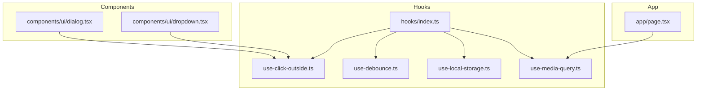
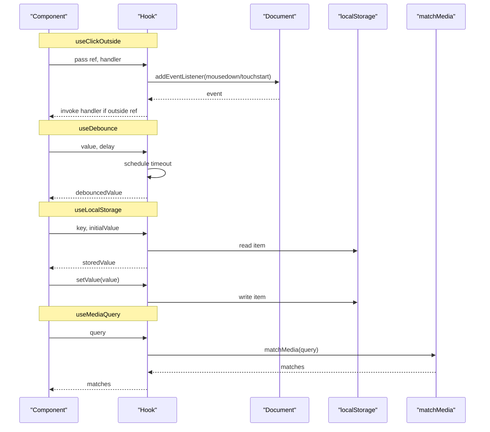
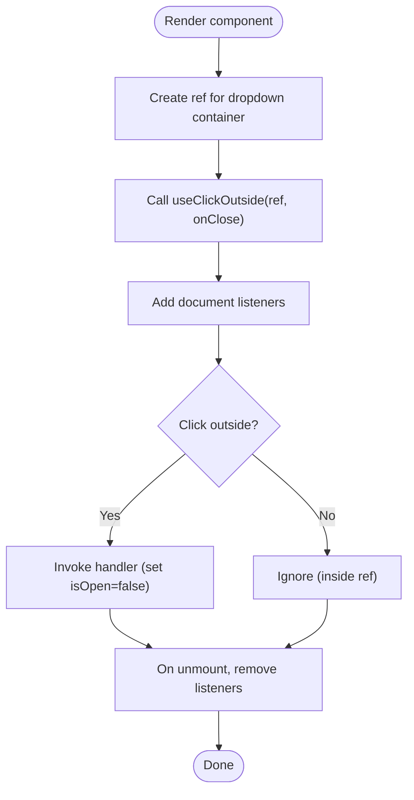
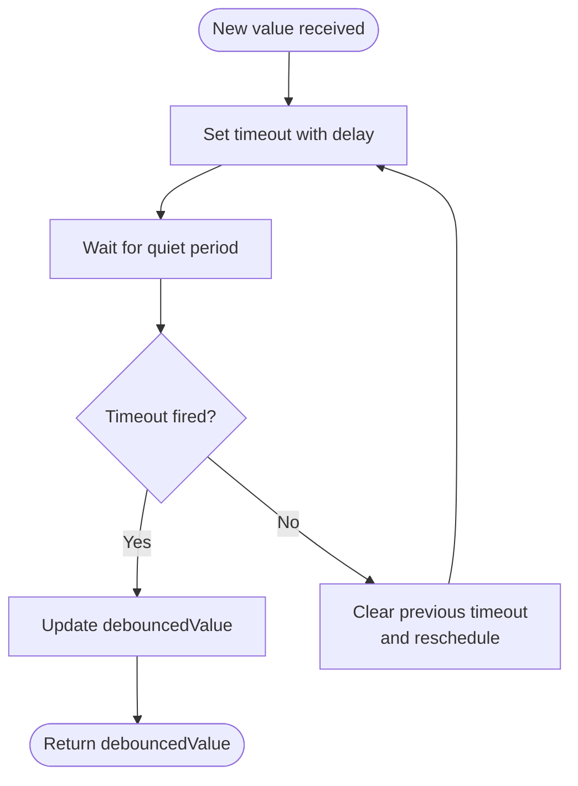
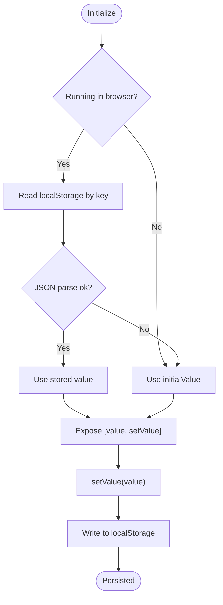
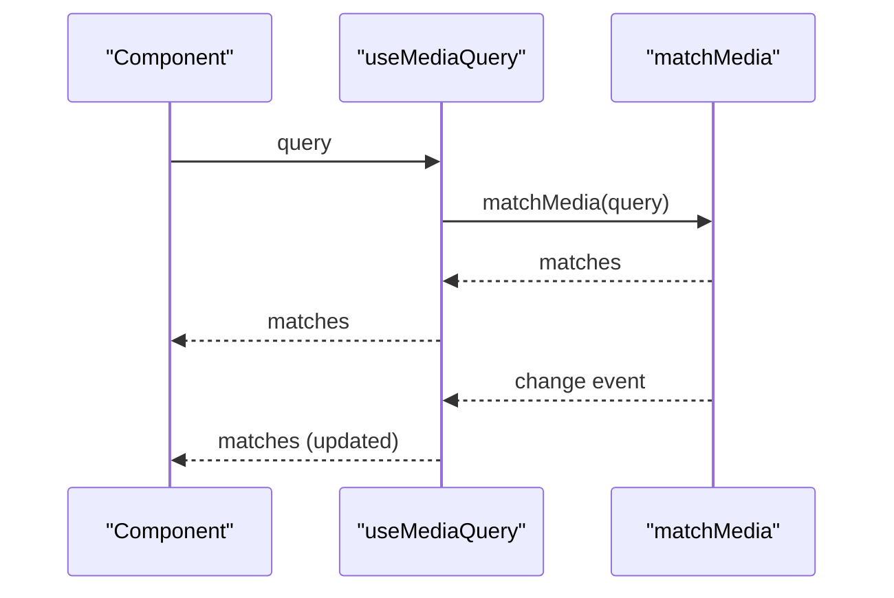
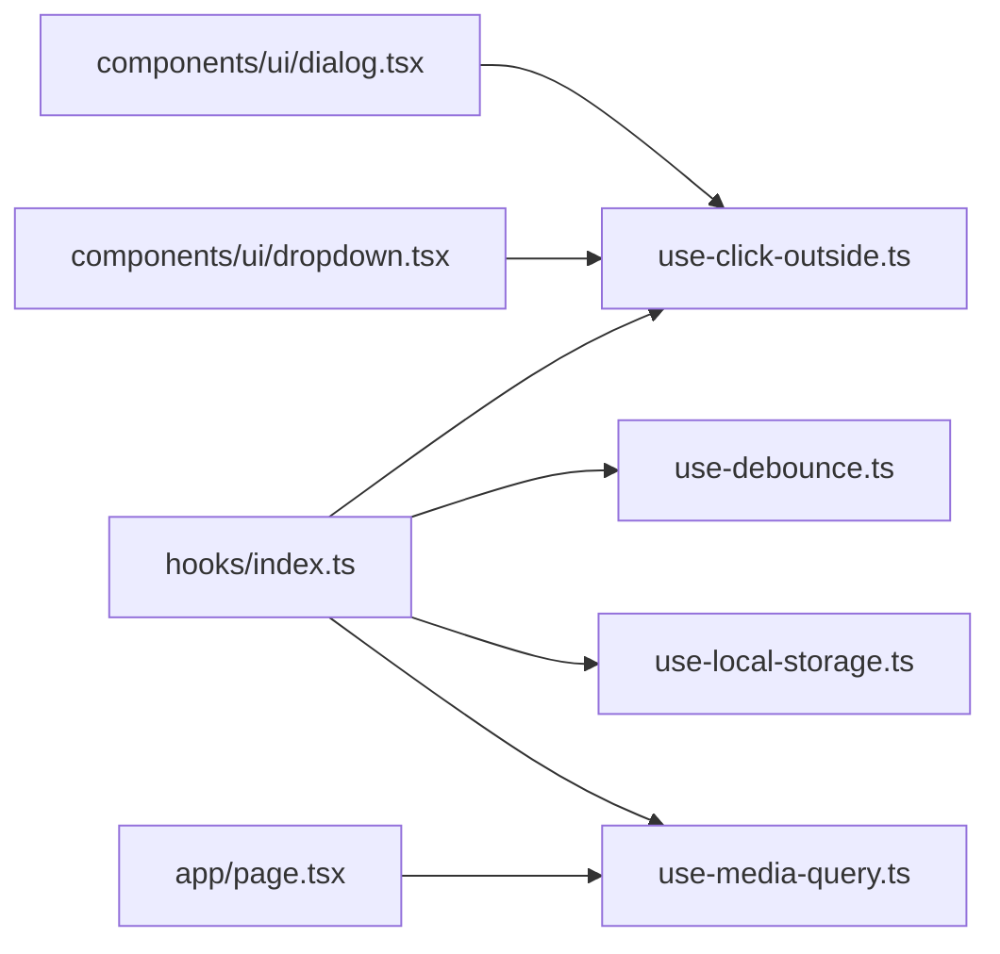

# Custom Hooks

<cite>
**Referenced Files in This Document**
- [hooks/index.ts](file://hooks/index.ts)
- [use-click-outside.ts](file://hooks/use-click-outside.ts)
- [use-debounce.ts](file://hooks/use-debounce.ts)
- [use-local-storage.ts](file://hooks/use-local-storage.ts)
- [use-media-query.ts](file://hooks/use-media-query.ts)
- [dialog.tsx](file://components/ui/dialog.tsx)
- [dropdown.tsx](file://components/ui/dropdown.tsx)
- [page.tsx](file://app/page.tsx)
</cite>

## Table of Contents
1. [Introduction](#introduction)
2. [Project Structure](#project-structure)
3. [Core Components](#core-components)
4. [Architecture Overview](#architecture-overview)
5. [Detailed Component Analysis](#detailed-component-analysis)
6. [Dependency Analysis](#dependency-analysis)
7. [Performance Considerations](#performance-considerations)
8. [Troubleshooting Guide](#troubleshooting-guide)
9. [Conclusion](#conclusion)
10. [Appendices](#appendices)

## Introduction
This document provides comprehensive documentation for Smartfolio’s custom React hooks library located under the hooks directory. It covers four shared hooks: useClickOutside, useDebounce, useLocalStorage, and useMediaQuery. For each hook, we explain the problem it solves, parameters, return values, usage patterns, and best practices. We also include practical examples, integration guidance, performance implications, and testing/debugging strategies. Finally, we provide guidelines for creating and maintaining custom hooks consistently across the codebase.

## Project Structure
The hooks are exported via a central index file and consumed by UI components and pages. The following diagram shows the relationship between the hooks, UI components, and the main application page.

**Diagram sources**
- [hooks/index.ts](file://hooks/index.ts#L1-L9)
- [use-click-outside.ts](file://hooks/use-click-outside.ts#L1-L26)
- [use-debounce.ts](file://hooks/use-debounce.ts#L1-L20)
- [use-local-storage.ts](file://hooks/use-local-storage.ts#L1-L33)
- [use-media-query.ts](file://hooks/use-media-query.ts#L1-L22)
- [dialog.tsx](file://components/ui/dialog.tsx#L1-L68)
- [dropdown.tsx](file://components/ui/dropdown.tsx#L1-L81)
- [page.tsx](file://app/page.tsx#L1-L683)

**Section sources**
- [hooks/index.ts](file://hooks/index.ts#L1-L9)

## Core Components
This section documents each hook in detail, including purpose, parameters, return values, and usage patterns.

### useClickOutside
- Problem solved: Detect clicks outside a given DOM element to enable behaviors such as closing modals, dropdowns, or popovers.
- Parameters:
  - ref: A RefObject pointing to the target DOM element.
  - handler: A callback invoked when a click occurs outside the element.
- Return value: None (hook performs side effects).
- Dependencies: React’s useEffect and RefObject.
- Side effects and cleanup: Adds mousedown and touchstart listeners to document; removes them on unmount.
- Typical usage pattern:
  - Create a ref for the container element.
  - Call useClickOutside(ref, handler) to close the container when clicking outside.
- Best practices:
  - Ensure the ref is stable and points to a mounted DOM node.
  - Keep handler memoized to prevent unnecessary re-renders.
  - Avoid memory leaks by relying on the built-in cleanup.
- Real-world integration:
  - Used in dropdown components to close the menu when clicking away.
  - Can be used in dialogs or modals to support click-outside-to-close behavior.

**Section sources**
- [use-click-outside.ts](file://hooks/use-click-outside.ts#L1-L26)
- [dropdown.tsx](file://components/ui/dropdown.tsx#L1-L81)

### useDebounce
- Problem solved: Delay updates to derived state or side effects until after a quiet period, reducing expensive operations during rapid input.
- Parameters:
  - value: The value to debounce.
  - delay: Debounce timeout in milliseconds (default 500).
- Return value: The debounced value.
- Dependencies: React’s useEffect and useState.
- Side effects and cleanup: Schedules a timeout; clears it on re-run to cancel previous pending updates.
- Typical usage pattern:
  - Wrap rapidly changing inputs (e.g., search queries) with useDebounce to throttle API calls or filtering.
- Best practices:
  - Choose delay based on UX needs; shorter delays feel snappier, longer delays reduce load.
  - Memoize the value to avoid triggering timeouts unnecessarily.
  - Consider combining with useCallback for handler functions.
- Real-world integration:
  - Ideal for search input throttling and live filtering.

**Section sources**
- [use-debounce.ts](file://hooks/use-debounce.ts#L1-L20)

### useLocalStorage
- Problem solved: Persist and synchronize state with browser localStorage while managing hydration differences between server and client.
- Parameters:
  - key: Storage key string.
  - initialValue: Initial value used on first render in SSR-safe manner.
- Return value: A tuple [storedValue, setValue].
  - storedValue: Current value from localStorage or initial value.
  - setValue: Function to update both state and localStorage atomically.
- Dependencies: React’s useState and useEffect.
- Side effects and cleanup: Reads/writes to localStorage; handles JSON parsing errors gracefully.
- Typical usage pattern:
  - Store user preferences, theme selection, or form state across sessions.
- Best practices:
  - Wrap JSON serialization in try/catch to guard against malformed data.
  - Avoid storing large payloads; prefer small configuration-like values.
  - Consider using a reducer pattern for complex state objects.
- Real-world integration:
  - Useful for persisting UI toggles, language preferences, or dark mode settings.

**Section sources**
- [use-local-storage.ts](file://hooks/use-local-storage.ts#L1-L33)

### useMediaQuery
- Problem solved: React to responsive breakpoints and device characteristics without manual media query management.
- Parameters:
  - query: A CSS media query string (e.g., "(max-width: 768px)").
- Return value: Boolean indicating whether the query currently matches.
- Dependencies: React’s useState and useEffect.
- Side effects and cleanup: Creates a MediaQueryList and listens to change events; removes listener on unmount.
- Typical usage pattern:
  - Switch UI modes (e.g., mobile vs desktop), adjust layout, or toggle components based on viewport.
- Best practices:
  - Keep queries simple and reuse constants for consistency.
  - Avoid frequent re-renders by caching the result and using it conditionally.
- Real-world integration:
  - Used in the main page to adapt behavior based on screen size.

**Section sources**
- [use-media-query.ts](file://hooks/use-media-query.ts#L1-L22)
- [page.tsx](file://app/page.tsx#L1-L683)

## Architecture Overview
The hooks are designed as reusable primitives that encapsulate cross-cutting concerns (DOM events, timing, persistence, responsive detection). They are exported centrally and consumed by UI components and pages. The following diagram illustrates the flow of data and side effects for each hook.

**Diagram sources**
- [use-click-outside.ts](file://hooks/use-click-outside.ts#L1-L26)
- [use-debounce.ts](file://hooks/use-debounce.ts#L1-L20)
- [use-local-storage.ts](file://hooks/use-local-storage.ts#L1-L33)
- [use-media-query.ts](file://hooks/use-media-query.ts#L1-L22)

## Detailed Component Analysis

### useClickOutside Analysis
- Implementation highlights:
  - Uses two event types (mousedown, touchstart) to cover mouse and touch interactions.
  - Checks containment to avoid triggering when clicking inside the ref.
  - Cleans up listeners on unmount.
- Composition patterns:
  - Often composed with stateful components (e.g., dropdowns, dialogs) to manage visibility.
- Practical example scenario:
  - A dropdown menu should close when the user clicks anywhere else on the page.

**Diagram sources**
- [use-click-outside.ts](file://hooks/use-click-outside.ts#L1-L26)
- [dropdown.tsx](file://components/ui/dropdown.tsx#L1-L81)

**Section sources**
- [use-click-outside.ts](file://hooks/use-click-outside.ts#L1-L26)
- [dropdown.tsx](file://components/ui/dropdown.tsx#L11-L29)

### useDebounce Analysis
- Implementation highlights:
  - Stores debounced value in local state.
  - Clears previous timeout on each change to coalesce updates.
- Composition patterns:
  - Frequently paired with controlled inputs and async operations (e.g., search).
- Practical example scenario:
  - Debounce search input to reduce API calls.

**Diagram sources**
- [use-debounce.ts](file://hooks/use-debounce.ts#L1-L20)

**Section sources**
- [use-debounce.ts](file://hooks/use-debounce.ts#L1-L20)

### useLocalStorage Analysis
- Implementation highlights:
  - SSR-safe initialization using an initializer function.
  - JSON serialization with error handling.
  - Returns setter that persists to localStorage.
- Composition patterns:
  - Pair with useState for simple preferences or flags.
- Practical example scenario:
  - Persist theme preference or language choice.

**Diagram sources**
- [use-local-storage.ts](file://hooks/use-local-storage.ts#L1-L33)

**Section sources**
- [use-local-storage.ts](file://hooks/use-local-storage.ts#L1-L33)

### useMediaQuery Analysis
- Implementation highlights:
  - Creates a MediaQueryList and listens to change events.
  - Updates state when the match changes.
- Composition patterns:
  - Use to drive responsive UI decisions (e.g., show mobile navigation).
- Practical example scenario:
  - Adjust layout or component visibility based on breakpoint.

**Diagram sources**
- [use-media-query.ts](file://hooks/use-media-query.ts#L1-L22)
- [page.tsx](file://app/page.tsx#L1-L683)

**Section sources**
- [use-media-query.ts](file://hooks/use-media-query.ts#L1-L22)
- [page.tsx](file://app/page.tsx#L1-L683)

## Dependency Analysis
- Central exports: The index file aggregates and re-exports the hooks for convenient imports across the app.
- Component coupling:
  - useClickOutside couples UI containers (dialogs, dropdowns) to document-level event handling.
  - useDebounce decouples rapid input changes from heavy operations.
  - useLocalStorage decouples UI state from persistence.
  - useMediaQuery decouples UI from viewport conditions.
- Cohesion:
  - Each hook encapsulates a single responsibility, promoting high cohesion and low coupling.

**Diagram sources**
- [hooks/index.ts](file://hooks/index.ts#L1-L9)
- [use-click-outside.ts](file://hooks/use-click-outside.ts#L1-L26)
- [use-debounce.ts](file://hooks/use-debounce.ts#L1-L20)
- [use-local-storage.ts](file://hooks/use-local-storage.ts#L1-L33)
- [use-media-query.ts](file://hooks/use-media-query.ts#L1-L22)
- [dialog.tsx](file://components/ui/dialog.tsx#L1-L68)
- [dropdown.tsx](file://components/ui/dropdown.tsx#L1-L81)
- [page.tsx](file://app/page.tsx#L1-L683)

**Section sources**
- [hooks/index.ts](file://hooks/index.ts#L1-L9)

## Performance Considerations
- useClickOutside
  - Add/remove two event listeners per hook instance; keep handlers memoized to avoid extra mounts.
  - Prefer capturing events at the nearest container to minimize propagation.
- useDebounce
  - Tune delay to balance responsiveness and performance; very short delays may still cause frequent updates.
  - Clear timeouts promptly to avoid stale updates.
- useLocalStorage
  - Avoid serializing large objects; split into multiple keys if needed.
  - Consider batching writes if multiple updates occur in quick succession.
- useMediaQuery
  - Reuse query strings and constants to avoid redundant MediaQueryList instances.
  - Debounce heavy computations triggered by media changes if necessary.

## Troubleshooting Guide
- useClickOutside does not fire:
  - Ensure the ref is attached to a mounted DOM node and not null.
  - Verify the handler is memoized to prevent re-registration.
- useDebounce returns old value:
  - Confirm the delay is sufficient and that the timeout is not being cleared prematurely.
- useLocalStorage not updating:
  - Check for JSON parse errors; ensure values are serializable.
  - Confirm the code runs in a browser environment (not during SSR).
- useMediaQuery always false or not updating:
  - Validate the media query string syntax.
  - Ensure the component remains mounted so the listener stays active.

## Conclusion
Smartfolio’s custom hooks provide robust, reusable primitives for common UI and state management tasks. By encapsulating side effects, persistence, and responsive behavior, they improve code quality, testability, and maintainability. Adopt the best practices outlined here to maximize reliability and performance, and follow the guidelines below when extending the library.

## Appendices

### Testing Strategies
- useClickOutside
  - Mock document.addEventListener/removeEventListener.
  - Simulate clicks inside/outside the ref and assert handler invocation.
- useDebounce
  - Advance timers to verify delayed updates.
  - Test rapid updates coalescing into a single final value.
- useLocalStorage
  - Mock localStorage and window; test read/write and error paths.
- useMediaQuery
  - Mock window.matchMedia and dispatch change events.

### Debugging Techniques
- Add logging around event registration and cleanup.
- Use React DevTools Profiler to detect excessive re-renders.
- For localStorage, inspect browser storage to confirm persistence.

### Creating New Custom Hooks
- Single responsibility: Encapsulate one concern per hook.
- SSR safety: Guard environment-specific APIs (e.g., window, document).
- Cleanup: Always remove listeners and clear timers in teardown.
- Memoization: Memoize callbacks and dependencies to prevent unnecessary work.
- Export centrally: Add new hooks to the index file for consistent imports.
- Document: Include parameter types, return values, and usage examples in comments.