# Frontend Components

<cite>
**Referenced Files in This Document**
- [components/ui/index.ts](file://components/ui/index.ts)
- [components/ui/button.tsx](file://components/ui/button.tsx)
- [components/ui/input.tsx](file://components/ui/input.tsx)
- [components/ui/card.tsx](file://components/ui/card.tsx)
- [components/ui/dialog.tsx](file://components/ui/dialog.tsx)
- [components/ui/dropdown.tsx](file://components/ui/dropdown.tsx)
- [components/layouts/index.ts](file://components/layouts/index.ts)
- [components/layouts/auth-layout.tsx](file://components/layouts/auth-layout.tsx)
- [components/layouts/marketing-layout.tsx](file://components/layouts/marketing-layout.tsx)
- [components/workspace/PromptInput.tsx](file://components/workspace/PromptInput.tsx)
- [hooks/index.ts](file://hooks/index.ts)
- [hooks/use-debounce.ts](file://hooks/use-debounce.ts)
- [hooks/use-local-storage.ts](file://hooks/use-local-storage.ts)
- [hooks/use-media-query.ts](file://hooks/use-media-query.ts)
- [hooks/use-click-outside.ts](file://hooks/use-click-outside.ts)
- [lib/trpc-provider.tsx](file://lib/trpc-provider.tsx)
- [modules/auth/hooks.ts](file://modules/auth/hooks.ts)
- [modules/portfolio/hooks.ts](file://modules/portfolio/hooks.ts)
- [app/globals.css](file://app/globals.css)
- [app/workspace/page.tsx](file://app/workspace/page.tsx)
</cite>

## Table of Contents
1. [Introduction](#introduction)
2. [Project Structure](#project-structure)
3. [Core Components](#core-components)
4. [Architecture Overview](#architecture-overview)
5. [Detailed Component Analysis](#detailed-component-analysis)
6. [Dependency Analysis](#dependency-analysis)
7. [Performance Considerations](#performance-considerations)
8. [Troubleshooting Guide](#troubleshooting-guide)
9. [Conclusion](#conclusion)
10. [Appendices](#appendices)

## Introduction
This document describes Smartfolio's frontend component library and shared utilities. It covers reusable UI components (buttons, inputs, cards, dialogs, dropdowns), layout components (authentication and marketing), a new advanced PromptInput component for AI-powered portfolio creation, and custom React hooks for debouncing, local storage, media queries, and click-outside detection. It also explains how components integrate with tRPC hooks for data fetching and mutations, the Tailwind CSS styling architecture, responsive design patterns, accessibility considerations, state management, and performance optimization strategies. Guidance is included for extending the component library while maintaining design consistency.

## Project Structure
Smartfolio organizes its frontend components and utilities into focused modules:
- components/ui: Base UI primitives and composite components
- components/layouts: Page-level layout wrappers
- components/workspace: Advanced workspace-specific components including PromptInput
- hooks: Reusable React hooks for common behaviors
- lib: Application-wide providers (tRPC, QueryClient)
- modules: Feature-specific hooks that consume tRPC APIs
- app/globals.css: Tailwind configuration and theme tokens

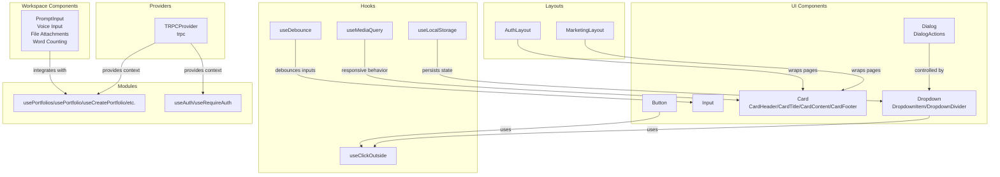

**Diagram sources**
- [components/ui/button.tsx](file://components/ui/button.tsx#L1-L65)
- [components/ui/input.tsx](file://components/ui/input.tsx#L1-L43)
- [components/ui/card.tsx](file://components/ui/card.tsx#L1-L70)
- [components/ui/dialog.tsx](file://components/ui/dialog.tsx#L1-L68)
- [components/ui/dropdown.tsx](file://components/ui/dropdown.tsx#L1-L81)
- [components/workspace/PromptInput.tsx](file://components/workspace/PromptInput.tsx#L1-L426)
- [components/layouts/auth-layout.tsx](file://components/layouts/auth-layout.tsx#L1-L29)
- [components/layouts/marketing-layout.tsx](file://components/layouts/marketing-layout.tsx#L1-L83)
- [hooks/use-debounce.ts](file://hooks/use-debounce.ts#L1-L20)
- [hooks/use-local-storage.ts](file://hooks/use-local-storage.ts#L1-L33)
- [hooks/use-media-query.ts](file://hooks/use-media-query.ts#L1-L22)
- [hooks/use-click-outside.ts](file://hooks/use-click-outside.ts#L1-L26)
- [lib/trpc-provider.tsx](file://lib/trpc-provider.tsx#L1-L50)
- [modules/portfolio/hooks.ts](file://modules/portfolio/hooks.ts#L1-L99)
- [modules/auth/hooks.ts](file://modules/auth/hooks.ts#L1-L29)

**Section sources**
- [components/ui/index.ts](file://components/ui/index.ts#L1-L12)
- [components/layouts/index.ts](file://components/layouts/index.ts#L1-L7)
- [hooks/index.ts](file://hooks/index.ts#L1-L9)

## Core Components
This section documents the base UI components exported from the UI module, the new PromptInput component, and their props, styling options, and usage patterns.

### Base UI Components
- Button
  - Purpose: Primary action element with variants, sizes, loading state, and full-width option.
  - Props:
    - variant: primary | secondary | outline | ghost | danger
    - size: sm | md | lg
    - isLoading: boolean
    - fullWidth: boolean
    - Inherits standard button attributes (e.g., disabled, onClick)
  - Styling: Base styles plus variant and size classes; disabled state combined with loading state.
  - Accessibility: Uses focus ring classes; ensure appropriate contrast per variant.
  - Usage pattern: Wrap with DialogActions for modal actions; compose with icons for compound buttons.

- Input
  - Purpose: Text input with optional label, error, and helper text.
  - Props:
    - label: string
    - error: string
    - helperText: string
    - Inherits standard input attributes (e.g., type, value, onChange)
  - Styling: Focus ring and border states adapt to error and disabled conditions.
  - Accessibility: Label associates with input via native label element; error text is announced by assistive tech.

- Card
  - Purpose: Container with header/title/content/footer segments and configurable variant/padding.
  - Props:
    - variant: default | outlined | elevated
    - padding: none | sm | md | lg
  - Subcomponents:
    - CardHeader: top spacing wrapper
    - CardTitle: heading element with consistent typography
    - CardContent: flexible content area
    - CardFooter: bottom spacing wrapper
  - Styling: Variant classes control background, borders, and shadows; padding scales linearly.

- Dialog
  - Purpose: Modal overlay with optional title and description; controlled via open/onClose.
  - Props:
    - open: boolean
    - onClose: () => void
    - title: string
    - description: string
    - children: ReactNode
    - size: sm | md | lg | xl
  - Subcomponents:
    - DialogActions: right-aligned action container
  - Behavior: Renders nothing when closed; backdrop click triggers close; size classes control max-width.

- Dropdown
  - Purpose: Click-triggered popover menu with alignment and item variants.
  - Props:
    - trigger: ReactNode (rendered as toggle)
    - children: ReactNode (menu items)
    - align: left | right
  - Subcomponents:
    - DropdownItem: button-like item with default/danger variants
    - DropdownDivider: visual separator
  - Behavior: Tracks open state; click outside closes; supports keyboard-friendly activation via trigger.

### PromptInput Component
**New** A sophisticated input component designed for AI-powered portfolio creation with advanced features.

- Purpose: Advanced text input with voice transcription, file attachments, word counting, and auto-resizing capabilities.
- Key Features:
  - Real-time speech recognition with continuous and interim results
  - File attachment support with preview and removal
  - Intelligent word counting with automatic truncation
  - Auto-resizing textarea with scroll height limiting
  - Configurable visibility of voice and attachment controls
  - Keyboard shortcuts (Enter to submit, Shift+Enter for new line)

- Props:
  - onSubmit: (text: string, files: File[]) => void - Callback fired when submitting content
  - placeholder?: string - Input placeholder text (default: "Describe the portfolio you want to create...")
  - maxLength?: number - Maximum word limit (default: 500)
  - showVoice?: boolean - Show/hide voice input button (default: true)
  - showAttachments?: boolean - Show/hide file attachment button (default: true)
  - disabled?: boolean - Disable the entire component
  - initialValue?: string - Pre-populate the input field

- Advanced Functionality:
  - Word counting with real-time validation
  - Speech recognition using Web Speech API with fallback support
  - File handling with multiple attachment support
  - Auto-resizing textarea with scroll height constraints
  - Visual feedback for recording state with animated indicators

- Styling and Theming:
  - Dark theme optimized with purple accent colors
  - Responsive design with mobile-first approach
  - Animated feedback for recording state
  - Hover and focus states with accessible contrast ratios
  - File attachment chips with remove functionality

- Accessibility Features:
  - Proper ARIA labels for all interactive elements
  - Keyboard navigation support
  - Screen reader friendly voice recording status
  - Focus management for modal-like behavior
  - Color contrast compliant with WCAG guidelines

- Integration Patterns:
  - Designed for AI generation workflows
  - Supports both text and voice input modes
  - File attachment integration for portfolio assets
  - Real-time validation and user feedback

Practical examples and composition patterns:
- Compose Button with DialogActions inside Dialog to handle confirm/cancel flows.
- Wrap Input with Card for form sections; pair label/error/helperText for clear UX.
- Use CardHeader/CardTitle/CardContent/CardFooter to structure content consistently.
- Use DropdownItem with variant="danger" for destructive actions; separate with DropdownDivider.
- Integrate PromptInput in workspace pages for AI-powered content creation.
- Use file attachments for portfolio assets like images, documents, or design files.
- Implement voice input for hands-free portfolio creation workflows.

**Section sources**
- [components/ui/button.tsx](file://components/ui/button.tsx#L5-L65)
- [components/ui/input.tsx](file://components/ui/input.tsx#L5-L43)
- [components/ui/card.tsx](file://components/ui/card.tsx#L5-L70)
- [components/ui/dialog.tsx](file://components/ui/dialog.tsx#L5-L68)
- [components/ui/dropdown.tsx](file://components/ui/dropdown.tsx#L5-L81)
- [components/workspace/PromptInput.tsx](file://components/workspace/PromptInput.tsx#L68-L426)

## Architecture Overview
Smartfolio's UI architecture centers on:
- Base UI components built with Tailwind utility classes for consistency and responsiveness.
- Layout components that wrap pages and enforce brand-safe containers and navigation.
- Advanced workspace components like PromptInput for specialized AI workflows.
- Custom hooks encapsulating cross-cutting concerns (debounce, storage, media queries, click-outside).
- tRPC provider enabling strongly-typed remote data fetching and mutations across modules.

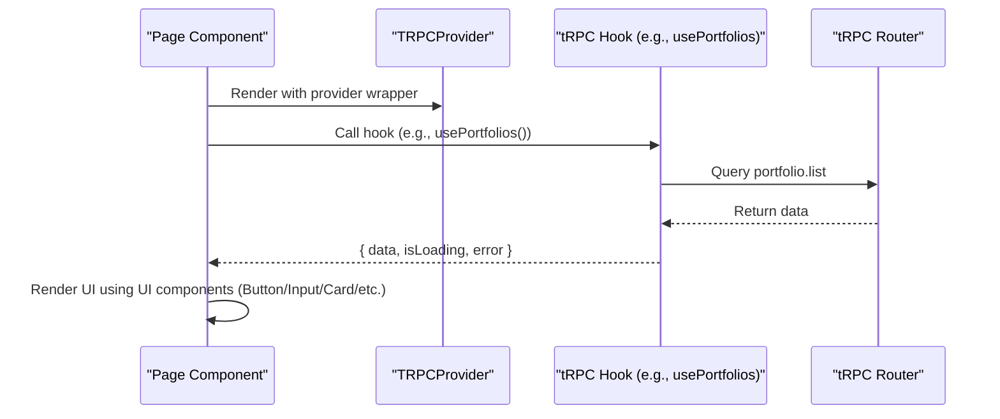

**Diagram sources**
- [lib/trpc-provider.tsx](file://lib/trpc-provider.tsx#L18-L50)
- [modules/portfolio/hooks.ts](file://modules/portfolio/hooks.ts#L10-L18)

**Section sources**
- [lib/trpc-provider.tsx](file://lib/trpc-provider.tsx#L1-L50)
- [modules/portfolio/hooks.ts](file://modules/portfolio/hooks.ts#L1-L99)

## Detailed Component Analysis

### Button Component
- Implementation highlights:
  - Accepts variant, size, isLoading, fullWidth, and forwards rest to button.
  - Applies base focus ring and transitions; disables pointer when loading.
  - Renders spinner during loading state.
- Accessibility:
  - Focus ring classes improve keyboard navigation visibility.
  - Disabled state prevents interaction when isLoading is true.
- Composition:
  - Pair with DialogActions for modal controls.
  - Combine with icons for icon-button patterns.

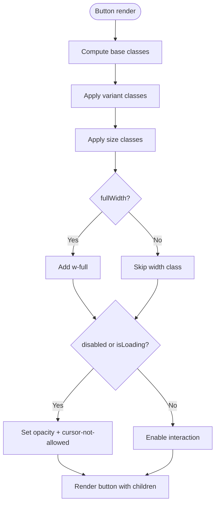

**Diagram sources**
- [components/ui/button.tsx](file://components/ui/button.tsx#L26-L51)

**Section sources**
- [components/ui/button.tsx](file://components/ui/button.tsx#L1-L65)

### Input Component
- Implementation highlights:
  - Optional label renders before the input.
  - Error state updates border and helper text color.
  - Helper text appears when no error is present.
  - Disabled state applies neutral background and cursor.
- Accessibility:
  - Native label association ensures screen reader compatibility.
  - Focus ring improves keyboard focus visibility.

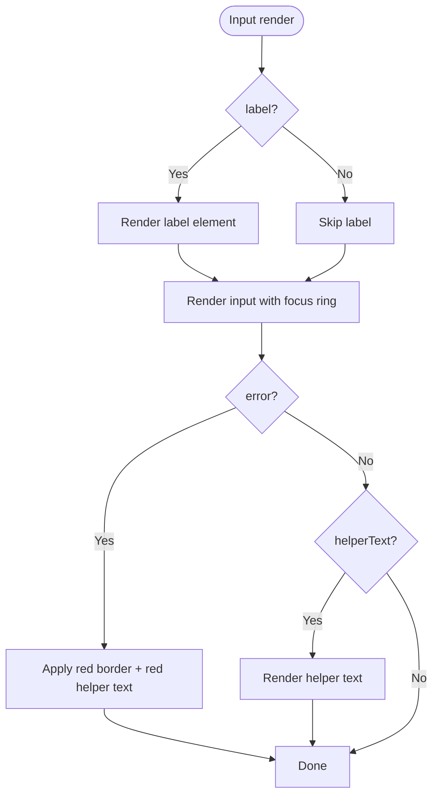

**Diagram sources**
- [components/ui/input.tsx](file://components/ui/input.tsx#L14-L38)

**Section sources**
- [components/ui/input.tsx](file://components/ui/input.tsx#L1-L43)

### Card Component Family
- Implementation highlights:
  - Variants control background, borders, and shadows.
  - Padding scales map to consistent spacing units.
  - Subcomponents provide semantic structure and consistent margins.
- Composition:
  - Use CardHeader/CardTitle for headings; CardContent for body; CardFooter for actions.

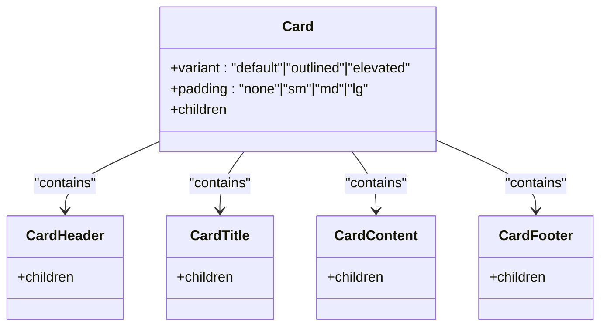

**Diagram sources**
- [components/ui/card.tsx](file://components/ui/card.tsx#L10-L70)

**Section sources**
- [components/ui/card.tsx](file://components/ui/card.tsx#L1-L70)

### Dialog Component Family
- Implementation highlights:
  - Controlled via open/onClose; renders nothing when closed.
  - Size variants control max-width; backdrop click closes.
  - DialogActions provides consistent action alignment.
- Accessibility:
  - Ensure focus trapping and aria-labelledby/describedby when adding dynamic content.

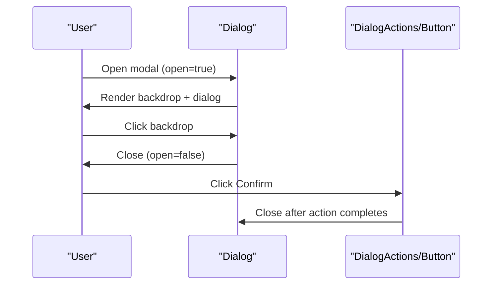

**Diagram sources**
- [components/ui/dialog.tsx](file://components/ui/dialog.tsx#L14-L59)

**Section sources**
- [components/ui/dialog.tsx](file://components/ui/dialog.tsx#L1-L68)

### Dropdown Component Family
- Implementation highlights:
  - Toggle opens/closes; click outside closes via useClickOutside.
  - Alignment supports left/right positioning.
  - Item variants support default and danger actions.
- Accessibility:
  - Trigger should be keyboard focusable; consider arrow-key navigation for item lists.

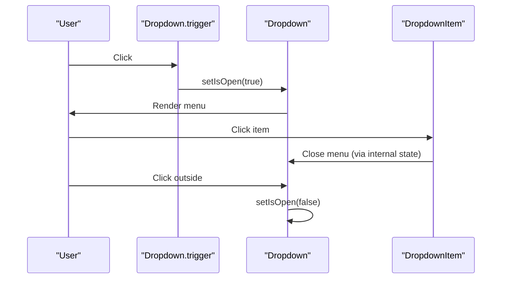

**Diagram sources**
- [components/ui/dropdown.tsx](file://components/ui/dropdown.tsx#L11-L51)
- [hooks/use-click-outside.ts](file://hooks/use-click-outside.ts#L5-L26)

**Section sources**
- [components/ui/dropdown.tsx](file://components/ui/dropdown.tsx#L1-L81)
- [hooks/use-click-outside.ts](file://hooks/use-click-outside.ts#L1-L26)

### PromptInput Component
**New** A comprehensive input component for AI-powered content creation with advanced features.

- Implementation highlights:
  - Real-time speech recognition using Web Speech API with browser fallback support
  - Intelligent word counting with automatic truncation to prevent exceeding limits
  - Auto-resizing textarea with scroll height constraints (min 120px, max 400px)
  - File attachment handling with preview chips and removal functionality
  - Visual feedback for recording state with animated ping indicators
  - Configurable visibility of voice and attachment controls
  - Keyboard shortcuts (Enter to submit, Shift+Enter for new line)

- Advanced Features:
  - Speech Recognition: Uses SpeechRecognition API with fallback to webkitSpeechRecognition
  - Word Limit Management: Truncates text at word boundaries to maintain clean sentences
  - Auto-resize Logic: Dynamically adjusts textarea height based on content
  - File Handling: Supports multiple file attachments with proper cleanup
  - State Management: Maintains separate state for text, files, and recording status

- Accessibility:
  - Proper ARIA labels for all interactive elements (record, attach, send)
  - Keyboard navigation support for all controls
  - Visual feedback for recording state with color changes
  - Focus management for modal-like behavior
  - Screen reader friendly status updates

- Styling Architecture:
  - Dark theme with purple accent colors (#7c3aed)
  - Responsive design with mobile-first approach
  - Animated feedback for recording state (ping animation)
  - Hover and focus states with accessible contrast ratios
  - File attachment chips with remove functionality

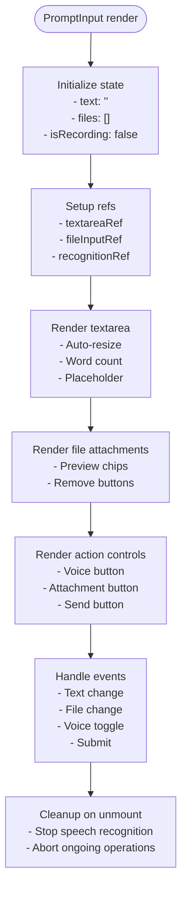

**Diagram sources**
- [components/workspace/PromptInput.tsx](file://components/workspace/PromptInput.tsx#L78-L426)

**Section sources**
- [components/workspace/PromptInput.tsx](file://components/workspace/PromptInput.tsx#L1-L426)

### Layout Components
- AuthLayout
  - Purpose: Centered authentication container with branding and footer links.
  - Usage: Wrap sign-in/sign-up pages; place forms inside.
- MarketingLayout
  - Purpose: Full-page marketing shell with header navigation and footer grid.
  - Usage: Landing pages, pricing, about, and help pages.

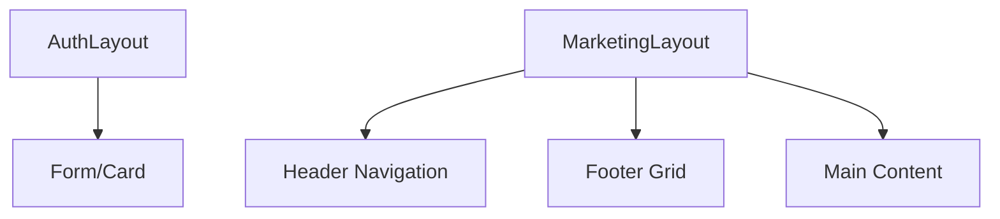

**Diagram sources**
- [components/layouts/auth-layout.tsx](file://components/layouts/auth-layout.tsx#L6-L28)
- [components/layouts/marketing-layout.tsx](file://components/layouts/marketing-layout.tsx#L6-L82)

**Section sources**
- [components/layouts/auth-layout.tsx](file://components/layouts/auth-layout.tsx#L1-L29)
- [components/layouts/marketing-layout.tsx](file://components/layouts/marketing-layout.tsx#L1-L83)

### Custom Hooks
- useDebounce
  - Purpose: Debounce fast-changing values (e.g., search input).
  - Returns: debounced value and cleanup on unmount.
- useLocalStorage
  - Purpose: Persist and retrieve typed values in localStorage with safe SSR handling.
  - Returns: getter/setter tuple.
- useMediaQuery
  - Purpose: Reactive media query matching for responsive behavior.
  - Returns: boolean match state.
- useClickOutside
  - Purpose: Detect clicks outside a given element ref.
  - Returns: none; invokes handler when outside click occurs.

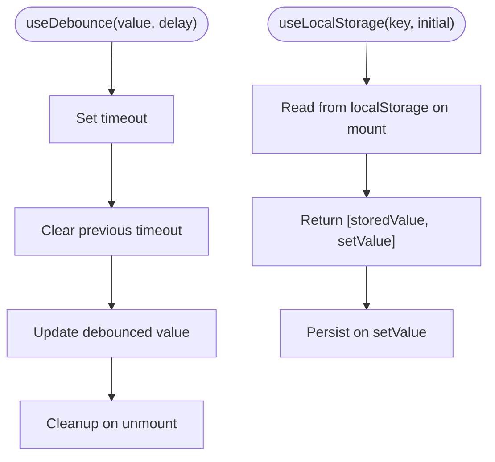

**Diagram sources**
- [hooks/use-debounce.ts](file://hooks/use-debounce.ts#L5-L19)
- [hooks/use-local-storage.ts](file://hooks/use-local-storage.ts#L5-L32)

**Section sources**
- [hooks/index.ts](file://hooks/index.ts#L1-L9)
- [hooks/use-debounce.ts](file://hooks/use-debounce.ts#L1-L20)
- [hooks/use-local-storage.ts](file://hooks/use-local-storage.ts#L1-L33)
- [hooks/use-media-query.ts](file://hooks/use-media-query.ts#L1-L22)
- [hooks/use-click-outside.ts](file://hooks/use-click-outside.ts#L1-L26)

## Dependency Analysis
Component dependencies and integration points:
- UI components depend on Tailwind utility classes and React forwardRef for ref forwarding.
- Dropdown relies on useClickOutside for closing behavior.
- Dialog is a controlled component; it does not manage its own state internally.
- Layout components are presentation-only and wrap page content.
- PromptInput depends on Web Speech API for voice functionality and uses advanced state management.
- tRPC provider exposes trpc context; module hooks consume tRPC procedures and return typed results.

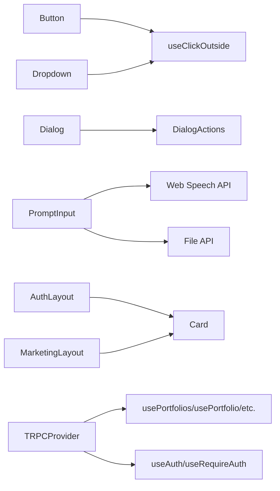

**Diagram sources**
- [components/ui/button.tsx](file://components/ui/button.tsx#L1-L65)
- [components/ui/dropdown.tsx](file://components/ui/dropdown.tsx#L1-L81)
- [components/ui/dialog.tsx](file://components/ui/dialog.tsx#L1-L68)
- [components/workspace/PromptInput.tsx](file://components/workspace/PromptInput.tsx#L1-L426)
- [components/layouts/auth-layout.tsx](file://components/layouts/auth-layout.tsx#L1-L29)
- [components/layouts/marketing-layout.tsx](file://components/layouts/marketing-layout.tsx#L1-L83)
- [lib/trpc-provider.tsx](file://lib/trpc-provider.tsx#L1-L50)
- [modules/portfolio/hooks.ts](file://modules/portfolio/hooks.ts#L1-L99)
- [modules/auth/hooks.ts](file://modules/auth/hooks.ts#L1-L29)

**Section sources**
- [components/ui/index.ts](file://components/ui/index.ts#L1-L12)
- [components/layouts/index.ts](file://components/layouts/index.ts#L1-L7)
- [hooks/index.ts](file://hooks/index.ts#L1-L9)

## Performance Considerations
- Prefer variant and size props over ad-hoc class overrides to minimize Tailwind class churn.
- Use useDebounce for search/filter inputs to reduce unnecessary tRPC calls.
- Keep Dialog closed when not needed; conditionally render to avoid mounting heavy content.
- Use useMediaQuery sparingly; cache results at the component level to avoid frequent reflows.
- Avoid deep nesting in Card; prefer flat composition for fewer DOM nodes.
- Use lazy loading for images and offscreen content within modals.
- **New** PromptInput optimizations:
  - Uses requestAnimationFrame for smooth auto-resizing operations
  - Implements efficient word counting with optimized regex patterns
  - Speech recognition automatically cleans up on component unmount
  - File handling uses efficient array operations for attachment management
  - Debounced text updates prevent excessive re-renders during typing

## Troubleshooting Guide
Common issues and resolutions:
- Dialog not closing on backdrop click
  - Ensure open prop is controlled and onClose updates parent state.
  - Verify backdrop click handler is attached and not blocked by child elements.
- Dropdown menu does not close on outside click
  - Confirm useClickOutside receives a valid ref and handler is registered.
  - Check for event propagation preventing handler from firing.
- Input error state not visible
  - Provide error prop and ensure helper text color is applied.
  - Confirm focus ring classes are not overridden by global CSS.
- Button remains disabled after loading completes
  - isLoading should be toggled off; disabled prop is merged with isLoading.
- tRPC queries not updating
  - Invalidate related queries after mutations (e.g., portfolio.list invalidation).
  - Verify TRPCProvider wraps the application root.
- **New** PromptInput issues:
  - Voice input not working: Check browser support for SpeechRecognition API; verify microphone permissions.
  - Word count not updating: Ensure maxLength prop is properly passed and text changes trigger re-render.
  - File attachments not appearing: Verify file input accepts multiple files and handleFileChange is triggered.
  - Auto-resize not working: Check textarea ref is properly assigned and requestAnimationFrame is supported.
  - Recording state not showing: Verify isRecording state updates and animation classes are applied.

**Section sources**
- [components/ui/dialog.tsx](file://components/ui/dialog.tsx#L14-L59)
- [components/ui/dropdown.tsx](file://components/ui/dropdown.tsx#L11-L51)
- [hooks/use-click-outside.ts](file://hooks/use-click-outside.ts#L5-L26)
- [components/ui/input.tsx](file://components/ui/input.tsx#L12-L39)
- [components/ui/button.tsx](file://components/ui/button.tsx#L26-L51)
- [components/workspace/PromptInput.tsx](file://components/workspace/PromptInput.tsx#L148-L204)
- [modules/portfolio/hooks.ts](file://modules/portfolio/hooks.ts#L33-L48)

## Conclusion
Smartfolio's component library emphasizes consistency, composability, and accessibility through shared UI primitives, layout wrappers, advanced workspace components like PromptInput, and utility hooks. The new PromptInput component enhances the AI-powered portfolio creation workflow with sophisticated features including voice input, file attachments, and intelligent word counting. By leveraging tRPC hooks for data management and Tailwind utility classes for styling, developers can build responsive, maintainable interfaces. Following the patterns documented here ensures predictable behavior, efficient rendering, and a cohesive user experience across the application.

## Appendices

### Tailwind CSS Styling Architecture
- Theme tokens: CSS variables define background and foreground colors; dark mode media query adjusts values.
- Font families: Sans and mono fonts configured via CSS variables.
- Utility-first classes: Components apply consistent spacing, typography, and color classes.

**Section sources**
- [app/globals.css](file://app/globals.css#L1-L27)

### Integration with tRPC Hooks
- TRPCProvider sets up QueryClient and tRPC client with batching and serialization.
- Module hooks encapsulate CRUD operations; mutations invalidate queries to keep UI in sync.
- Authentication hooks expose user/session state and guards.

**Section sources**
- [lib/trpc-provider.tsx](file://lib/trpc-provider.tsx#L18-L50)
- [modules/portfolio/hooks.ts](file://modules/portfolio/hooks.ts#L10-L99)
- [modules/auth/hooks.ts](file://modules/auth/hooks.ts#L9-L29)

### PromptInput Integration Examples
**New** Practical integration patterns for the PromptInput component in workspace contexts.

- Basic Integration:
  ```typescript
  <PromptInput
    onSubmit={(text, files) => console.log({ text, files })}
    placeholder="Describe your portfolio..."
    maxLength={500}
  />
  ```

- Advanced Integration with Workspace:
  ```typescript
  const handlePromptSubmit = useCallback((text: string, files: File[]) => {
    // TODO: Wire to AI generation pipeline
    console.log("Generate portfolio:", text, files);
  }, []);

  <PromptInput
    onSubmit={handlePromptSubmit}
    placeholder="Create a sleek dark portfolio for a React developer..."
    maxLength={500}
    showVoice
    showAttachments
    initialValue={pendingPrompt}
  />
  ```

**Section sources**
- [app/workspace/page.tsx](file://app/workspace/page.tsx#L77-L84)
- [components/workspace/PromptInput.tsx](file://components/workspace/PromptInput.tsx#L78-L86)