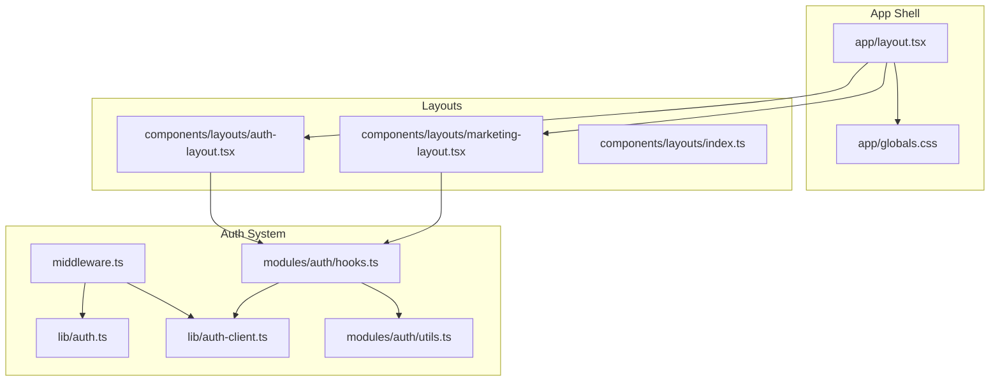
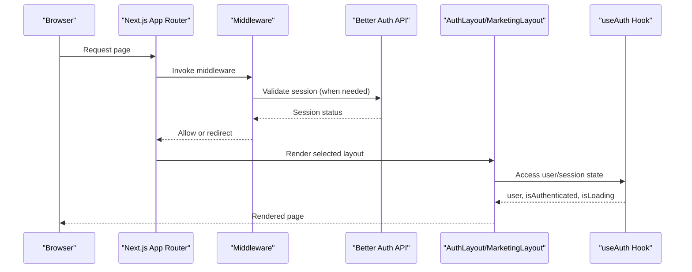
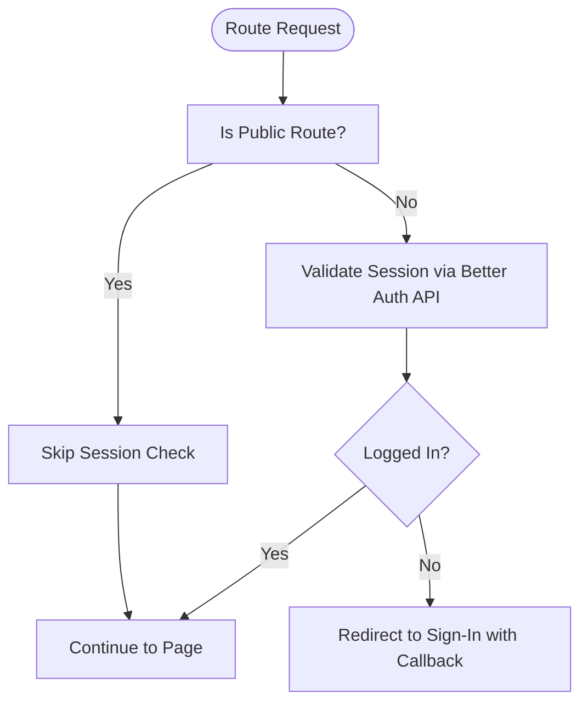
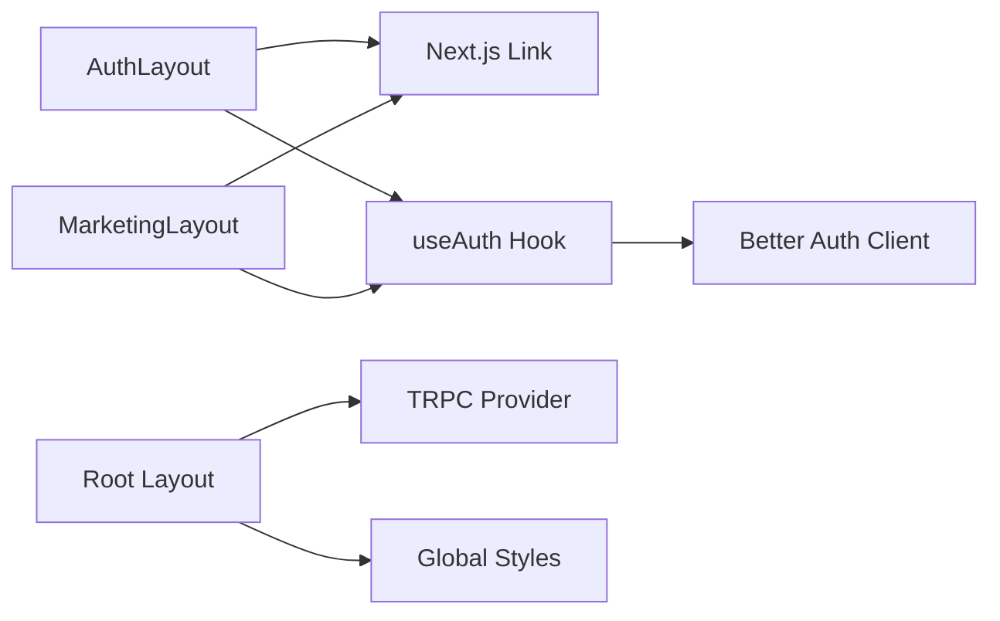

# Layout Components

<cite>
**Referenced Files in This Document**
- [auth-layout.tsx](file://components/layouts/auth-layout.tsx)
- [marketing-layout.tsx](file://components/layouts/marketing-layout.tsx)
- [index.ts](file://components/layouts/index.ts)
- [layout.tsx](file://app/layout.tsx)
- [globals.css](file://app/globals.css)
- [middleware.ts](file://middleware.ts)
- [auth.ts](file://lib/auth.ts)
- [auth-client.ts](file://lib/auth-client.ts)
- [hooks.ts](file://modules/auth/hooks.ts)
- [utils.ts](file://modules/auth/utils.ts)
- [use-media-query.ts](file://hooks/use-media-query.ts)
</cite>

## Table of Contents
1. [Introduction](#introduction)
2. [Project Structure](#project-structure)
3. [Core Components](#core-components)
4. [Architecture Overview](#architecture-overview)
5. [Detailed Component Analysis](#detailed-component-analysis)
6. [Dependency Analysis](#dependency-analysis)
7. [Performance Considerations](#performance-considerations)
8. [Troubleshooting Guide](#troubleshooting-guide)
9. [Conclusion](#conclusion)
10. [Appendices](#appendices)

## Introduction
This document explains Smartfolio’s layout components system with a focus on AuthLayout and MarketingLayout. It covers their purpose, props, usage scenarios, structure, navigation patterns, and content organization. It also documents how these layouts integrate with Next.js App Router, how they behave under different user contexts (authenticated vs. unauthenticated), responsive design and accessibility characteristics, SSR considerations, SEO implications, and performance trade-offs. Finally, it provides guidelines for creating custom layouts while maintaining a consistent user experience.

## Project Structure
Smartfolio organizes layout components under a dedicated module and exposes them via a barrel index. The root application layout composes providers and global styles, while middleware enforces authentication gating across routes. Authentication state is managed by Better Auth with a React client hook and utilities for user display and verification.

**Diagram sources**
- [layout.tsx](file://app/layout.tsx#L1-L36)
- [globals.css](file://app/globals.css#L1-L27)
- [auth-layout.tsx](file://components/layouts/auth-layout.tsx#L1-L29)
- [marketing-layout.tsx](file://components/layouts/marketing-layout.tsx#L1-L83)
- [index.ts](file://components/layouts/index.ts#L1-L7)
- [middleware.ts](file://middleware.ts#L1-L95)
- [auth.ts](file://lib/auth.ts#L1-L25)
- [auth-client.ts](file://lib/auth-client.ts#L1-L8)
- [hooks.ts](file://modules/auth/hooks.ts#L1-L29)
- [utils.ts](file://modules/auth/utils.ts#L1-L29)

**Section sources**
- [layout.tsx](file://app/layout.tsx#L1-L36)
- [globals.css](file://app/globals.css#L1-L27)
- [auth-layout.tsx](file://components/layouts/auth-layout.tsx#L1-L29)
- [marketing-layout.tsx](file://components/layouts/marketing-layout.tsx#L1-L83)
- [index.ts](file://components/layouts/index.ts#L1-L7)
- [middleware.ts](file://middleware.ts#L1-L95)
- [auth.ts](file://lib/auth.ts#L1-L25)
- [auth-client.ts](file://lib/auth-client.ts#L1-L8)
- [hooks.ts](file://modules/auth/hooks.ts#L1-L29)
- [utils.ts](file://modules/auth/utils.ts#L1-L29)

## Core Components
- AuthLayout: A minimal, centered card-style layout optimized for authentication flows. It centers content vertically, applies subtle branding, and includes legal links at the bottom. Props: children (ReactNode). Typical usage: sign-in, sign-up, forgot-password, reset-password, verify-email.
- MarketingLayout: A full-page marketing shell with a sticky-like header, prominent navigation, a main content area, and a multi-column footer. Props: children (ReactNode). Typical usage: landing, pricing, about, blog, help, and similar public pages.

Both layouts are client components and rely on Next.js Link for navigation. They are exported via a barrel index for convenient imports.

**Section sources**
- [auth-layout.tsx](file://components/layouts/auth-layout.tsx#L1-L29)
- [marketing-layout.tsx](file://components/layouts/marketing-layout.tsx#L1-L83)
- [index.ts](file://components/layouts/index.ts#L1-L7)

## Architecture Overview
The layout system integrates with Next.js App Router and Better Auth middleware. Middleware determines whether a route requires authentication and redirects accordingly. Authenticated state is exposed to client components via a React hook backed by a Better Auth client. The root layout composes providers and global styles, ensuring consistent typography and theme variables.

**Diagram sources**
- [middleware.ts](file://middleware.ts#L44-L81)
- [auth-client.ts](file://lib/auth-client.ts#L1-L8)
- [hooks.ts](file://modules/auth/hooks.ts#L9-L18)
- [auth-layout.tsx](file://components/layouts/auth-layout.tsx#L1-L29)
- [marketing-layout.tsx](file://components/layouts/marketing-layout.tsx#L1-L83)

## Detailed Component Analysis

### AuthLayout
Purpose
- Provides a clean, centered card for authentication forms.
- Ensures consistent branding and legal links placement.

Props
- children: ReactNode — the form or content to render inside the card.

Structure and Navigation Patterns
- Header area with logo/brand link.
- Centralized content area inside a white card with shadow.
- Legal links section at the bottom.

Content Organization
- Children are rendered inside a bordered card container.
- Minimal spacing and responsive padding for small screens.

Responsive Design and Accessibility
- Uses responsive utilities for centering and padding on small screens.
- Links are keyboard accessible via Next.js Link.
- No explicit ARIA roles are declared in the component; consider adding role="navigation" to the header container and appropriate landmarks if needed.

SSR and SEO Considerations
- Client component; SSR renders the shell only.
- SEO: relies on metadata configured at the page level; ensure individual pages set page-specific metadata.

Performance Implications
- Lightweight component with minimal DOM nodes.
- No heavy computations; rendering cost is negligible.

Usage Scenarios
- Sign-in, sign-up, forgot-password, reset-password, verify-email.

Integration with Next.js App Router
- Imported and used by pages that require authentication context.
- Works seamlessly with middleware-driven redirects.

**Section sources**
- [auth-layout.tsx](file://components/layouts/auth-layout.tsx#L6-L28)

### MarketingLayout
Purpose
- Serves as the primary shell for marketing and informational pages.
- Provides consistent header navigation, main content area, and comprehensive footer.

Props
- children: ReactNode — the page content.

Structure and Navigation Patterns
- Header with brand link and navigation links (Pricing, About, Sign In, Get Started).
- Main content area for page body.
- Multi-column footer with grouped links and copyright notice.

Content Organization
- Grid-based footer with four columns for Product, Company, Resources, and Legal.
- Responsive container and spacing via Tailwind utilities.

Responsive Design and Accessibility
- Mobile-first classes and responsive breakpoints are applied via Tailwind.
- Links are keyboard accessible via Next.js Link.
- Consider adding landmark roles (e.g., role="banner", role="main", role="contentinfo") for improved screen reader support.

SSR and SEO Considerations
- Client component; SSR renders the shell.
- SEO benefits from consistent header/footer structure and internal linking.

Performance Implications
- Slightly heavier than AuthLayout due to footer grid and navigation.
- Footer grid is static; rendering cost is moderate.

Usage Scenarios
- Landing, pricing, about, blog, help, contact, and similar public pages.

Integration with Next.js App Router
- Used by public pages; works with middleware to avoid unnecessary session checks for public routes.

**Section sources**
- [marketing-layout.tsx](file://components/layouts/marketing-layout.tsx#L6-L82)

### Layout Composition Patterns
- Both layouts accept a single children prop and render it within a structured shell.
- MarketingLayout additionally defines a header and footer region, enabling consistent branding and navigation across pages.
- AuthLayout focuses on a single-column card layout for focused authentication tasks.

Header/Footer Configurations
- MarketingLayout includes a top navigation bar and a multi-column footer with grouped links.
- AuthLayout includes a small brand link in the header area and legal links in the footer area.

Content Area Management
- MarketingLayout uses a main element for the page content.
- AuthLayout wraps children in a card container for emphasis and focus.

**Section sources**
- [marketing-layout.tsx](file://components/layouts/marketing-layout.tsx#L9-L37)
- [auth-layout.tsx](file://components/layouts/auth-layout.tsx#L8-L19)

### Integration with Next.js App Router and User Context
- Root layout composes providers and global styles, ensuring consistent fonts and theme variables.
- Middleware enforces authentication gating for protected routes and redirects authenticated users away from sign-in/sign-up when applicable.
- Client-side authentication state is exposed via a hook backed by Better Auth’s React client.

**Diagram sources**
- [middleware.ts](file://middleware.ts#L44-L81)
- [auth-client.ts](file://lib/auth-client.ts#L1-L8)
- [hooks.ts](file://modules/auth/hooks.ts#L9-L18)

**Section sources**
- [layout.tsx](file://app/layout.tsx#L21-L35)
- [middleware.ts](file://middleware.ts#L4-L81)
- [auth-client.ts](file://lib/auth-client.ts#L1-L8)
- [hooks.ts](file://modules/auth/hooks.ts#L9-L18)

### Responsive Design and Mobile-First Approach
- Both layouts use responsive utilities for centering, padding, and width constraints.
- MarketingLayout’s header and footer adapt via container utilities and grid classes.
- AuthLayout ensures vertical centering and appropriate spacing on small screens.
- A shared media query hook is available for advanced responsive logic if needed.

Accessibility Notes
- Links are navigable via keyboard.
- Consider adding semantic roles and landmarks for improved screen reader support.

**Section sources**
- [marketing-layout.tsx](file://components/layouts/marketing-layout.tsx#L8-L37)
- [auth-layout.tsx](file://components/layouts/auth-layout.tsx#L8-L25)
- [use-media-query.ts](file://hooks/use-media-query.ts#L1-L22)

### SSR Considerations, SEO, and Performance
- Both layouts are client components. On initial render, Next.js renders the HTML shell; interactivity is hydrated on the client.
- SEO: configure page-level metadata per route; the root layout sets site-wide metadata.
- Performance: AuthLayout is lightweight; MarketingLayout adds a footer grid but remains efficient. Prefer lazy loading for heavy assets and leverage Next.js image optimization for images.

**Section sources**
- [layout.tsx](file://app/layout.tsx#L16-L19)
- [auth-layout.tsx](file://components/layouts/auth-layout.tsx#L1-L29)
- [marketing-layout.tsx](file://components/layouts/marketing-layout.tsx#L1-L83)

## Dependency Analysis
The layout components depend on:
- Next.js Link for navigation.
- Client-side authentication hooks for user context.
- Better Auth client for session state.
- Global styles for typography and theme variables.

**Diagram sources**
- [auth-layout.tsx](file://components/layouts/auth-layout.tsx#L3-L4)
- [marketing-layout.tsx](file://components/layouts/marketing-layout.tsx#L3-L4)
- [hooks.ts](file://modules/auth/hooks.ts#L7-L10)
- [auth-client.ts](file://lib/auth-client.ts#L1-L8)
- [layout.tsx](file://app/layout.tsx#L3-L31)
- [globals.css](file://app/globals.css#L1-L27)

**Section sources**
- [auth-layout.tsx](file://components/layouts/auth-layout.tsx#L3-L4)
- [marketing-layout.tsx](file://components/layouts/marketing-layout.tsx#L3-L4)
- [hooks.ts](file://modules/auth/hooks.ts#L7-L10)
- [auth-client.ts](file://lib/auth-client.ts#L1-L8)
- [layout.tsx](file://app/layout.tsx#L3-L31)
- [globals.css](file://app/globals.css#L1-L27)

## Performance Considerations
- Keep layout components minimal and avoid heavy computations.
- Prefer static navigation and pre-rendered content where possible.
- Use Next.js image optimization and defer non-critical resources.
- Monitor hydration costs; AuthLayout is already lightweight, suitable for frequent re-renders during auth transitions.

## Troubleshooting Guide
Common issues and resolutions:
- Unexpected redirects to sign-in: Verify middleware route lists and callbackUrl handling. Ensure public routes are correctly whitelisted.
- Auth state not updating: Confirm the Better Auth client baseURL and that the useAuth hook is used within a provider context.
- Styling inconsistencies: Check global CSS variables and Tailwind configuration. Ensure fonts are loaded and theme variables are applied.

**Section sources**
- [middleware.ts](file://middleware.ts#L4-L81)
- [auth-client.ts](file://lib/auth-client.ts#L3-L5)
- [hooks.ts](file://modules/auth/hooks.ts#L9-L18)
- [globals.css](file://app/globals.css#L8-L26)

## Conclusion
Smartfolio’s layout components provide a clear separation between authentication-focused and marketing-focused shells. Together with middleware-driven authentication gating and client-side session management, they enable a consistent, responsive, and accessible user experience across pages. By following the composition patterns and guidelines outlined here, teams can extend the system with new layouts while preserving UX coherence.

## Appendices

### Creating Custom Layouts
Guidelines:
- Use a single children prop for content injection.
- Apply responsive utilities for mobile-first layouts.
- Keep layout components lightweight; offload heavy logic to pages or modules.
- Integrate with the existing authentication hooks for user-aware layouts.
- Maintain consistent navigation and footer patterns for marketing-like pages.

**Section sources**
- [auth-layout.tsx](file://components/layouts/auth-layout.tsx#L6-L28)
- [marketing-layout.tsx](file://components/layouts/marketing-layout.tsx#L6-L82)
- [hooks.ts](file://modules/auth/hooks.ts#L9-L18)