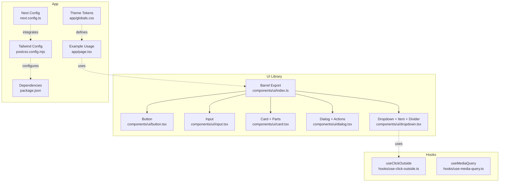
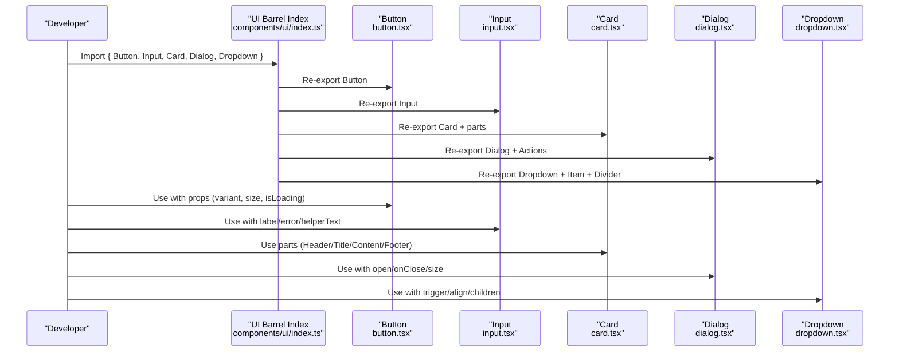
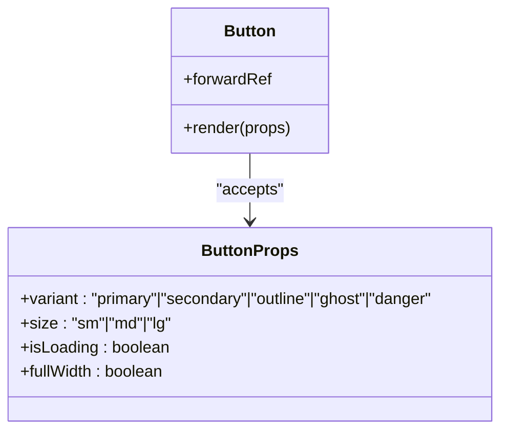
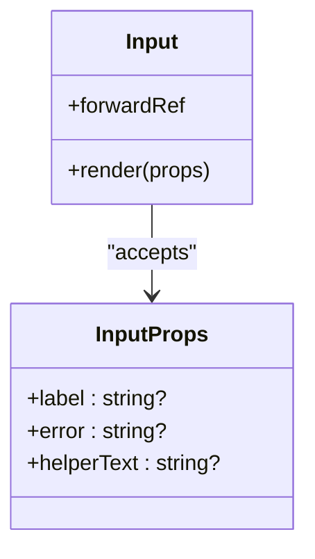
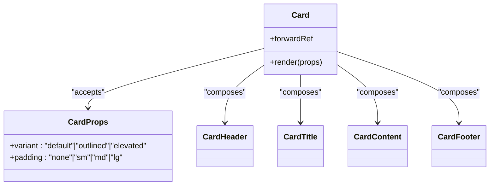
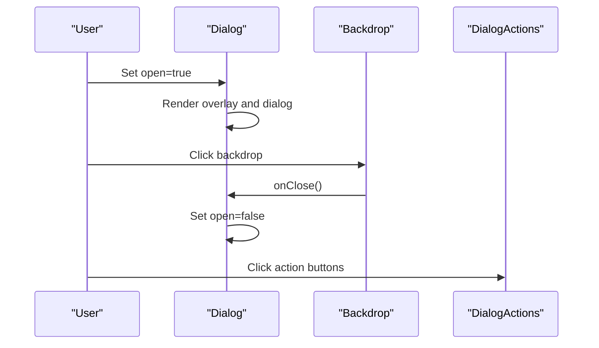
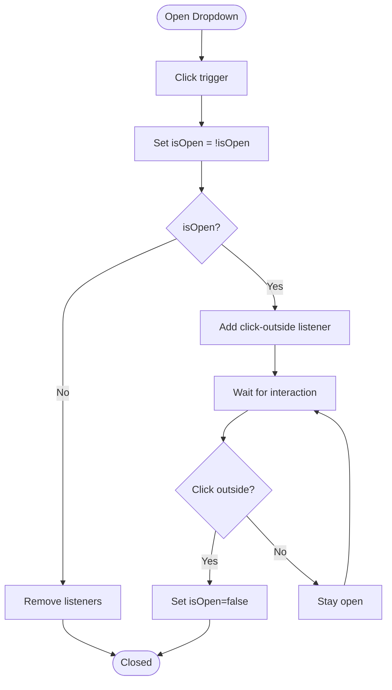
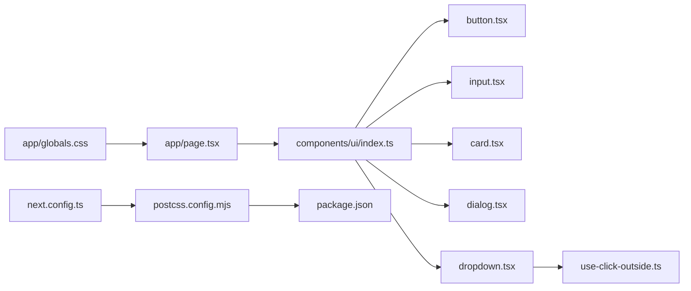

# UI Components

<cite>
**Referenced Files in This Document**
- [button.tsx](file://components/ui/button.tsx)
- [input.tsx](file://components/ui/input.tsx)
- [card.tsx](file://components/ui/card.tsx)
- [dialog.tsx](file://components/ui/dialog.tsx)
- [dropdown.tsx](file://components/ui/dropdown.tsx)
- [index.ts](file://components/ui/index.ts)
- [use-click-outside.ts](file://hooks/use-click-outside.ts)
- [use-media-query.ts](file://hooks/use-media-query.ts)
- [globals.css](file://app/globals.css)
- [page.tsx](file://app/page.tsx)
- [package.json](file://package.json)
- [postcss.config.mjs](file://postcss.config.mjs)
- [next.config.ts](file://next.config.ts)
</cite>

## Table of Contents
1. [Introduction](#introduction)
2. [Project Structure](#project-structure)
3. [Core Components](#core-components)
4. [Architecture Overview](#architecture-overview)
5. [Detailed Component Analysis](#detailed-component-analysis)
6. [Dependency Analysis](#dependency-analysis)
7. [Performance Considerations](#performance-considerations)
8. [Troubleshooting Guide](#troubleshooting-guide)
9. [Conclusion](#conclusion)
10. [Appendices](#appendices)

## Introduction
This document describes Smartfolio’s shared UI component library and how to use, customize, and extend the Button, Card, Dialog, Dropdown, and Input components. It explains props, styling via Tailwind CSS, responsive behavior, accessibility, composition patterns, integration with forms and state, performance, browser compatibility, and design system consistency. It also provides guidelines for extending components and maintaining design tokens.

## Project Structure
Smartfolio organizes UI components under components/ui and re-exports them via a single barrel index. The design system relies on Tailwind CSS v4 configured via PostCSS and a global CSS file that defines theme tokens and dark mode support.

**Diagram sources**
- [button.tsx](file://components/ui/button.tsx#L1-L65)
- [input.tsx](file://components/ui/input.tsx#L1-L43)
- [card.tsx](file://components/ui/card.tsx#L1-L70)
- [dialog.tsx](file://components/ui/dialog.tsx#L1-L68)
- [dropdown.tsx](file://components/ui/dropdown.tsx#L1-L81)
- [index.ts](file://components/ui/index.ts#L1-L12)
- [use-click-outside.ts](file://hooks/use-click-outside.ts#L1-L26)
- [use-media-query.ts](file://hooks/use-media-query.ts#L1-L22)
- [page.tsx](file://app/page.tsx#L1-L683)
- [globals.css](file://app/globals.css#L1-L27)
- [postcss.config.mjs](file://postcss.config.mjs#L1-L8)
- [next.config.ts](file://next.config.ts#L1-L8)
- [package.json](file://package.json#L1-L52)

**Section sources**
- [index.ts](file://components/ui/index.ts#L1-L12)
- [globals.css](file://app/globals.css#L1-L27)
- [postcss.config.mjs](file://postcss.config.mjs#L1-L8)
- [next.config.ts](file://next.config.ts#L1-L8)
- [package.json](file://package.json#L1-L52)

## Core Components
This section documents each component’s props, styling, events, customization, and usage patterns.

### Button
- Purpose: Primary action with multiple variants, sizes, loading state, and full-width option.
- Props:
  - variant: primary | secondary | outline | ghost | danger
  - size: sm | md | lg
  - isLoading: boolean
  - fullWidth: boolean
  - Inherits standard button attributes (e.g., disabled, onClick)
- Styling:
  - Base: inline-flex, items/justify center, rounded-lg, transitions, focus ring with offset
  - Variants: color background, text color, hover, and focus ring per variant
  - Sizes: horizontal padding, vertical padding, and text size
  - fullWidth: w-full
  - Disabled/loading: opacity and pointer-events
- Accessibility:
  - Inherits native button semantics; focus-visible ring via focus ring utilities
- Composition:
  - Combine with icons by placing SVG inside children
- Example usage:
  - Primary with loading state and full width
  - Secondary with custom className overrides
  - Danger variant for destructive actions
  - Outline/ghost for low-emphasis actions

**Section sources**
- [button.tsx](file://components/ui/button.tsx#L5-L10)
- [button.tsx](file://components/ui/button.tsx#L26-L43)
- [button.tsx](file://components/ui/button.tsx#L45-L62)

### Input
- Purpose: Styled text input with optional label, helper text, and error state.
- Props:
  - label: string
  - error: string
  - helperText: string
  - Inherits standard input attributes (e.g., type, value, onChange, disabled)
- Styling:
  - Full-width wrapper
  - Label: block, text, medium weight, spacing below
  - Input: border, rounded, focus ring, conditional border/error/bg based on state
  - Helper/error text: color and spacing
- Accessibility:
  - Label associated with input via htmlFor (when used with form controls)
- Composition:
  - Use with FormField wrappers to group label, input, and messages
- Example usage:
  - Required field with error messaging
  - Disabled input with hint text
  - Password input with type attribute

**Section sources**
- [input.tsx](file://components/ui/input.tsx#L5-L9)
- [input.tsx](file://components/ui/input.tsx#L12-L40)

### Card
- Purpose: Container with header/title/content/footer parts and multiple variants/paddings.
- Props:
  - variant: default | outlined | elevated
  - padding: none | sm | md | lg
  - Inherits standard div attributes
- Parts:
  - CardHeader: top spacing
  - CardTitle: typography and color
  - CardContent: child container
  - CardFooter: bottom spacing
- Styling:
  - Variant: background, borders/shadow
  - Padding: p-*, spacing around content
- Accessibility:
  - No explicit ARIA roles; ensure semantic headings inside CardTitle when appropriate
- Composition:
  - Use parts to structure content consistently
- Example usage:
  - Default card with header/title/content/footer
  - Elevated card for highlighted content
  - Outlined card for emphasis without background

**Section sources**
- [card.tsx](file://components/ui/card.tsx#L5-L8)
- [card.tsx](file://components/ui/card.tsx#L10-L35)
- [card.tsx](file://components/ui/card.tsx#L39-L70)

### Dialog
- Purpose: Modal overlay with optional header and configurable size.
- Props:
  - open: boolean
  - onClose: () => void
  - title: string?
  - description: string?
  - children: ReactNode
  - size: sm | md | lg | xl
- Parts:
  - DialogActions: right-aligned action container
- Behavior:
  - Renders nothing when closed
  - Backdrop click triggers onClose
  - Header renders conditionally when title or description present
- Styling:
  - Fixed positioning, centering, backdrop, white background, rounded corners, shadow
  - Size classes control max-width
- Accessibility:
  - Role and modal semantics implied by overlay pattern; ensure focus trapping in parent if needed
- Composition:
  - Wrap actions in DialogActions
  - Use size to constrain content width
- Example usage:
  - Confirmation dialog with two actions
  - Large content dialog with scrollable body

**Section sources**
- [dialog.tsx](file://components/ui/dialog.tsx#L5-L12)
- [dialog.tsx](file://components/ui/dialog.tsx#L14-L59)
- [dialog.tsx](file://components/ui/dialog.tsx#L61-L67)

### Dropdown
- Purpose: Toggleable menu triggered by a custom trigger element.
- Props:
  - trigger: ReactNode (rendered as clickable area)
  - children: ReactNode (menu items)
  - align: left | right (horizontal alignment of menu)
- Items:
  - DropdownItem: button-like item with onClick and variant (default | danger)
  - DropdownDivider: visual separator
- Behavior:
  - Controlled via internal isOpen state
  - Click outside closes the menu
- Hooks:
  - Uses a custom hook to detect clicks outside the dropdown
- Styling:
  - Absolute positioned menu with shadow and border
  - Align via right/left offsets
  - Item styles for hover and text colors
- Accessibility:
  - Trigger should have aria-haspopup and aria-expanded if integrating with ARIA roles
- Composition:
  - Place DropdownItem children inside Dropdown
  - Use DropdownDivider to separate groups
- Example usage:
  - User menu aligned to the right
  - Danger action item for destructive operations

**Section sources**
- [dropdown.tsx](file://components/ui/dropdown.tsx#L5-L9)
- [dropdown.tsx](file://components/ui/dropdown.tsx#L11-L51)
- [dropdown.tsx](file://components/ui/dropdown.tsx#L53-L76)
- [dropdown.tsx](file://components/ui/dropdown.tsx#L78-L81)
- [use-click-outside.ts](file://hooks/use-click-outside.ts#L5-L25)

## Architecture Overview
The UI components are thin wrappers around native HTML elements with Tailwind classes. They expose a clean TypeScript interface and rely on a shared design system defined in the global CSS and PostCSS configuration. Consumers import from the barrel index to keep imports consistent.

**Diagram sources**
- [index.ts](file://components/ui/index.ts#L7-L11)
- [button.tsx](file://components/ui/button.tsx#L12-L62)
- [input.tsx](file://components/ui/input.tsx#L11-L42)
- [card.tsx](file://components/ui/card.tsx#L10-L70)
- [dialog.tsx](file://components/ui/dialog.tsx#L14-L67)
- [dropdown.tsx](file://components/ui/dropdown.tsx#L11-L81)

## Detailed Component Analysis

### Button Analysis
- Props and defaults:
  - variant: primary
  - size: md
  - isLoading: false
  - fullWidth: false
- Styling matrix:
  - Variants define background/text/focus ring colors
  - Sizes define padding and text scale
- Events:
  - Inherits onClick/disabled from button
  - isLoading disables the button and shows spinner
- Accessibility:
  - Focus ring via focus utilities
- Customization:
  - Pass className to merge additional Tailwind classes
  - Use size/variant to match design tokens

**Diagram sources**
- [button.tsx](file://components/ui/button.tsx#L5-L10)
- [button.tsx](file://components/ui/button.tsx#L12-L62)

**Section sources**
- [button.tsx](file://components/ui/button.tsx#L5-L10)
- [button.tsx](file://components/ui/button.tsx#L26-L43)
- [button.tsx](file://components/ui/button.tsx#L45-L62)

### Input Analysis
- Props and defaults:
  - label: optional
  - error: optional
  - helperText: optional
- Styling:
  - Conditional border and focus ring based on error state
  - Disabled state applies subtle background and pointer style
- Accessibility:
  - Label text rendered for readability and screen readers
- Customization:
  - className merges additional classes
  - Use type attribute for specialized inputs (email, password)

**Diagram sources**
- [input.tsx](file://components/ui/input.tsx#L5-L9)
- [input.tsx](file://components/ui/input.tsx#L11-L42)

**Section sources**
- [input.tsx](file://components/ui/input.tsx#L5-L9)
- [input.tsx](file://components/ui/input.tsx#L12-L40)

### Card Analysis
- Props and defaults:
  - variant: default
  - padding: md
- Parts:
  - CardHeader/CardTitle/CardContent/CardFooter with spacing and typography
- Styling:
  - Variant toggles background/border/shadow
  - Padding scales per token
- Accessibility:
  - Use semantic headings inside CardTitle for hierarchy

**Diagram sources**
- [card.tsx](file://components/ui/card.tsx#L5-L8)
- [card.tsx](file://components/ui/card.tsx#L10-L35)
- [card.tsx](file://components/ui/card.tsx#L39-L70)

**Section sources**
- [card.tsx](file://components/ui/card.tsx#L5-L8)
- [card.tsx](file://components/ui/card.tsx#L10-L35)
- [card.tsx](file://components/ui/card.tsx#L39-L70)

### Dialog Analysis
- Props and defaults:
  - open: boolean
  - onClose: () => void
  - title/description: optional
  - size: md
- Parts:
  - DialogActions: right-aligned row
- Behavior:
  - No render when closed
  - Backdrop click invokes onClose
- Accessibility:
  - Consider adding role="dialog" and aria-modal on the dialog container if needed

**Diagram sources**
- [dialog.tsx](file://components/ui/dialog.tsx#L14-L59)
- [dialog.tsx](file://components/ui/dialog.tsx#L61-L67)

**Section sources**
- [dialog.tsx](file://components/ui/dialog.tsx#L5-L12)
- [dialog.tsx](file://components/ui/dialog.tsx#L14-L59)
- [dialog.tsx](file://components/ui/dialog.tsx#L61-L67)

### Dropdown Analysis
- Props and defaults:
  - trigger: ReactNode
  - children: ReactNode
  - align: left
- Items:
  - DropdownItem: onClick, variant (default | danger)
  - DropdownDivider: separator
- Behavior:
  - Internal isOpen state
  - Click outside closes menu
- Hook:
  - useClickOutside detects clicks outside the dropdown

**Diagram sources**
- [dropdown.tsx](file://components/ui/dropdown.tsx#L11-L29)
- [use-click-outside.ts](file://hooks/use-click-outside.ts#L5-L25)

**Section sources**
- [dropdown.tsx](file://components/ui/dropdown.tsx#L5-L9)
- [dropdown.tsx](file://components/ui/dropdown.tsx#L11-L51)
- [dropdown.tsx](file://components/ui/dropdown.tsx#L53-L81)
- [use-click-outside.ts](file://hooks/use-click-outside.ts#L5-L25)

## Dependency Analysis
- Component exports:
  - components/ui/index.ts re-exports Button, Input, Card (and its parts), Dialog, and Dropdown
- Global design system:
  - app/globals.css defines CSS variables for background/foreground and dark mode
  - postcss.config.mjs enables Tailwind CSS v4 plugin
  - next.config.ts integrates PostCSS pipeline
  - package.json includes Tailwind CSS v4 and related utilities
- Hooks:
  - useClickOutside supports Dropdown click-outside behavior
  - useMediaQuery supports responsive logic elsewhere in the app

**Diagram sources**
- [index.ts](file://components/ui/index.ts#L7-L11)
- [button.tsx](file://components/ui/button.tsx#L12-L62)
- [input.tsx](file://components/ui/input.tsx#L11-L42)
- [card.tsx](file://components/ui/card.tsx#L10-L70)
- [dialog.tsx](file://components/ui/dialog.tsx#L14-L67)
- [dropdown.tsx](file://components/ui/dropdown.tsx#L11-L81)
- [use-click-outside.ts](file://hooks/use-click-outside.ts#L5-L25)
- [page.tsx](file://app/page.tsx#L1-L683)
- [globals.css](file://app/globals.css#L1-L27)
- [postcss.config.mjs](file://postcss.config.mjs#L1-L8)
- [next.config.ts](file://next.config.ts#L1-L8)
- [package.json](file://package.json#L1-L52)

**Section sources**
- [index.ts](file://components/ui/index.ts#L7-L11)
- [globals.css](file://app/globals.css#L1-L27)
- [postcss.config.mjs](file://postcss.config.mjs#L1-L8)
- [next.config.ts](file://next.config.ts#L1-L8)
- [package.json](file://package.json#L1-L52)

## Performance Considerations
- Prefer forwardRef for components that render native elements to avoid unnecessary re-renders.
- Keep className merging minimal; avoid dynamic class generation in tight loops.
- Use isLoading on Button to prevent repeated submissions without rendering heavy spinners.
- For Dialog/Dropdown, ensure controlled open/close to avoid mounting heavy content unnecessarily.
- Leverage Tailwind’s JIT and purge modes (configured via Tailwind v4) to minimize CSS footprint.

## Troubleshooting Guide
- Button disabled state:
  - isLoading sets disabled and reduces opacity; ensure not to override pointer-events unintentionally.
- Input error state:
  - error prop switches border and focus ring color; confirm that helperText does not overwrite error messaging.
- Dialog not closing:
  - Ensure onClose is passed and invoked on backdrop click; verify open prop updates.
- Dropdown not closing:
  - Confirm click-outside listener is attached when isOpen is true; ensure cleanup on unmount.
- Accessibility:
  - Provide aria-labels for icon-only buttons and ensure labels associate with inputs.
  - For dialogs, consider adding role and aria-modal attributes for assistive technologies.

**Section sources**
- [button.tsx](file://components/ui/button.tsx#L45-L62)
- [input.tsx](file://components/ui/input.tsx#L12-L40)
- [dialog.tsx](file://components/ui/dialog.tsx#L14-L59)
- [dropdown.tsx](file://components/ui/dropdown.tsx#L11-L29)
- [use-click-outside.ts](file://hooks/use-click-outside.ts#L5-L25)

## Conclusion
Smartfolio’s UI components provide a consistent, accessible, and extensible foundation for building forms, modals, menus, and content containers. By leveraging Tailwind utilities, a shared design system, and small, focused components, teams can maintain design tokens and improve development velocity. Extend components thoughtfully, document customizations, and keep accessibility and responsiveness front of mind.

## Appendices

### Practical Usage Examples (paths)
- Button
  - Primary with loading and full width: [button.tsx](file://components/ui/button.tsx#L45-L62)
  - Danger variant for destructive actions: [button.tsx](file://components/ui/button.tsx#L28-L34)
- Input
  - With label and error: [input.tsx](file://components/ui/input.tsx#L12-L40)
  - Disabled with helper text: [input.tsx](file://components/ui/input.tsx#L20-L37)
- Card
  - Default with parts: [card.tsx](file://components/ui/card.tsx#L10-L35)
  - Elevated variant: [card.tsx](file://components/ui/card.tsx#L12-L16)
- Dialog
  - With actions: [dialog.tsx](file://components/ui/dialog.tsx#L61-L67)
  - Large size: [dialog.tsx](file://components/ui/dialog.tsx#L17-L22)
- Dropdown
  - Right-aligned menu: [dropdown.tsx](file://components/ui/dropdown.tsx#L38-L42)
  - Danger item: [dropdown.tsx](file://components/ui/dropdown.tsx#L60-L63)

### Tailwind CSS and Theme Tokens
- Tailwind v4 is enabled via PostCSS plugin; ensure Tailwind directives are processed.
- Global CSS defines CSS variables for background/foreground and dark mode support.
- Use className to compose additional Tailwind utilities while preserving component defaults.

**Section sources**
- [postcss.config.mjs](file://postcss.config.mjs#L1-L8)
- [globals.css](file://app/globals.css#L1-L27)
- [package.json](file://package.json#L1-L52)