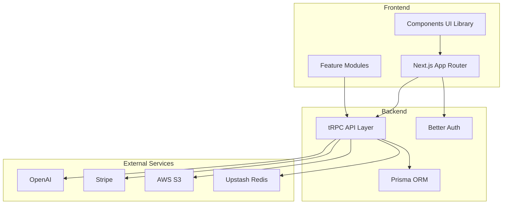
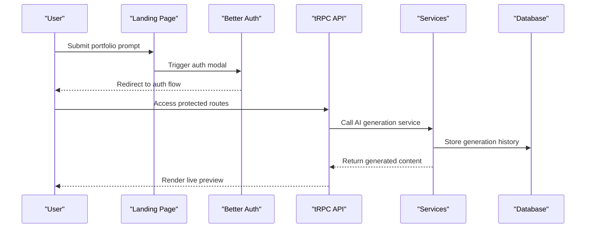
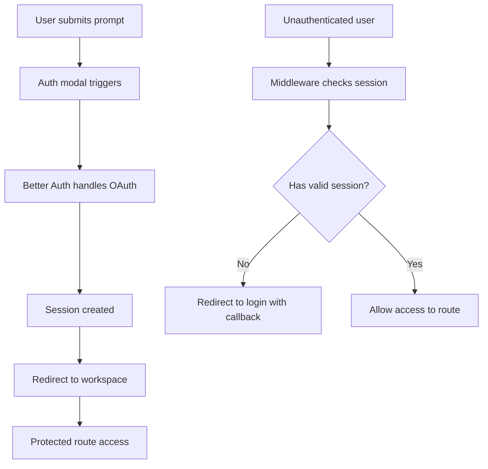
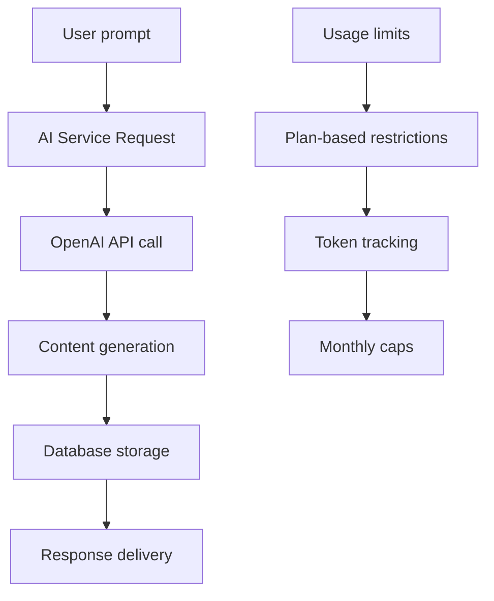
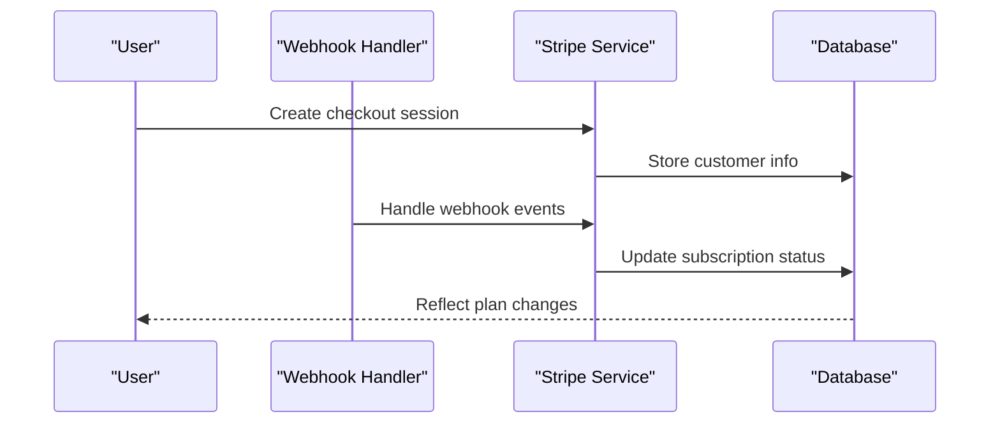
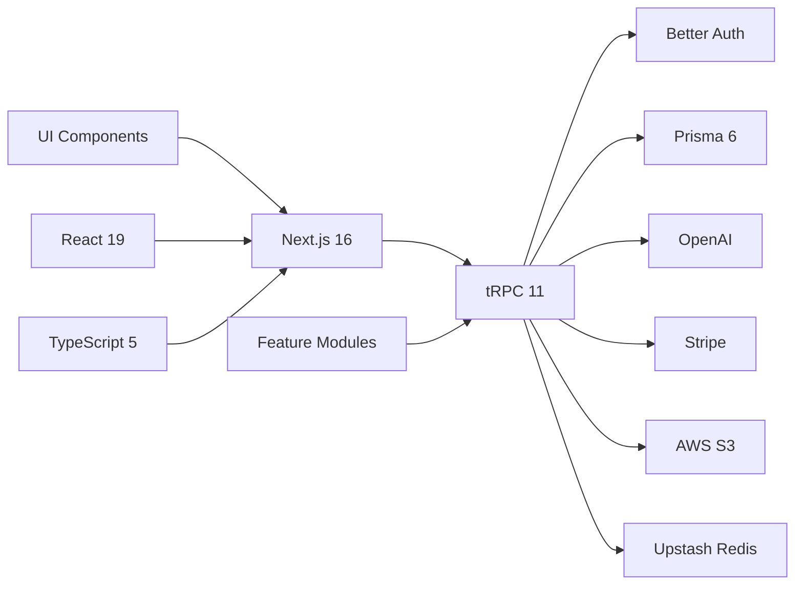

# Implementation Summary

<cite>
**Referenced Files in This Document**
- [README.md](file://README.md)
- [IMPLEMENTATION_SUMMARY.md](file://IMPLEMENTATION_SUMMARY.md)
- [PROJECT-SUMMARY.md](file://PROJECT-SUMMARY.md)
- [package.json](file://package.json)
- [next.config.ts](file://next.config.ts)
- [middleware.ts](file://middleware.ts)
- [server/trpc.ts](file://server/trpc.ts)
- [server/caller.ts](file://server/caller.ts)
- [lib/prisma.ts](file://lib/prisma.ts)
- [lib/auth.ts](file://lib/auth.ts)
- [lib/auth-client.ts](file://lib/auth-client.ts)
- [prisma/schema.prisma](file://prisma/schema.prisma)
- [server/services/ai.ts](file://server/services/ai.ts)
- [server/services/stripe.ts](file://server/services/stripe.ts)
- [server/services/storage.ts](file://server/services/storage.ts)
- [modules/ai/index.ts](file://modules/ai/index.ts)
- [modules/portfolio/index.ts](file://modules/portfolio/index.ts)
- [modules/billing/index.ts](file://modules/billing/index.ts)
</cite>

## Table of Contents
1. [Introduction](#introduction)
2. [Project Structure](#project-structure)
3. [Core Components](#core-components)
4. [Architecture Overview](#architecture-overview)
5. [Detailed Component Analysis](#detailed-component-analysis)
6. [Dependency Analysis](#dependency-analysis)
7. [Performance Considerations](#performance-considerations)
8. [Troubleshooting Guide](#troubleshooting-guide)
9. [Conclusion](#conclusion)

## Introduction
Smartfolio is an AI-native portfolio generator that transforms natural language descriptions into complete developer portfolios. The platform follows a streamlined workflow: users describe their ideal portfolio in plain language, the system generates content using AI, and users can iteratively refine the results before publishing. This implementation summary focuses on the current operational infrastructure, upcoming workspace re-architecture, and the technology stack that enables this AI-first approach.

## Project Structure
The project is organized around a modern Next.js 16 architecture with a clear separation of concerns:
- Frontend: Next.js App Router with TypeScript and Tailwind CSS
- Backend: tRPC API layer with Better Auth for authentication and Prisma for database operations
- Services: AI generation (OpenAI), billing (Stripe), storage (AWS S3), and email (Nodemailer)
- Modules: Feature-specific hooks and utilities organized by domain (auth, portfolio, AI, builder, billing)

**Diagram sources**
- [next.config.ts](file://next.config.ts#L1-L8)
- [server/trpc.ts](file://server/trpc.ts#L1-L61)
- [lib/auth.ts](file://lib/auth.ts#L1-L25)
- [lib/prisma.ts](file://lib/prisma.ts#L1-L14)

**Section sources**
- [README.md](file://README.md#L1-L100)
- [PROJECT-SUMMARY.md](file://PROJECT-SUMMARY.md#L1-L168)

## Core Components
The system is built around several core components that work together to deliver the AI-native portfolio experience:

### Authentication System (Better Auth)
The authentication layer provides secure user management with multiple provider support:
- Google and GitHub OAuth integration
- Email/password authentication
- Session management with Prisma adapter
- Client-side hooks for seamless integration

### tRPC Backend Layer
The type-safe API layer connects the frontend to backend services:
- Protected and public procedures
- Centralized context creation with authentication and database access
- Server-side caller for React Server Components
- Comprehensive error handling with Zod validation

### Database Schema (Prisma + PostgreSQL)
The data model supports the complete portfolio lifecycle:
- User profiles with role-based permissions
- Portfolio management with sections and analytics
- Subscription and billing tracking
- AI generation history and usage metrics

### AI Generation Service
Current capabilities include targeted content generation:
- Portfolio content creation (headlines, about sections)
- Project description generation
- SEO metadata optimization
- Usage tracking with plan-based limits

**Section sources**
- [lib/auth.ts](file://lib/auth.ts#L1-L25)
- [lib/auth-client.ts](file://lib/auth-client.ts#L1-L8)
- [server/trpc.ts](file://server/trpc.ts#L1-L61)
- [lib/prisma.ts](file://lib/prisma.ts#L1-L14)
- [prisma/schema.prisma](file://prisma/schema.prisma#L1-L230)
- [server/services/ai.ts](file://server/services/ai.ts#L1-L242)

## Architecture Overview
The system follows a modular architecture designed for scalability and maintainability:

**Diagram sources**
- [middleware.ts](file://middleware.ts#L1-L95)
- [server/trpc.ts](file://server/trpc.ts#L1-L61)
- [server/services/ai.ts](file://server/services/ai.ts#L1-L242)

The architecture emphasizes:
- Minimal routes with workspace as the primary interface
- Real-time AI generation with streaming capabilities
- Modular service design for easy maintenance
- Comprehensive rate limiting and usage tracking

## Detailed Component Analysis

### Authentication Flow
The authentication system provides seamless user onboarding:

**Diagram sources**
- [middleware.ts](file://middleware.ts#L1-L95)
- [lib/auth.ts](file://lib/auth.ts#L1-L25)

### AI Generation Pipeline
The current AI service operates in snippet mode, generating specific content pieces:

**Diagram sources**
- [server/services/ai.ts](file://server/services/ai.ts#L1-L242)
- [prisma/schema.prisma](file://prisma/schema.prisma#L214-L229)

### Billing and Subscription Management
The Stripe integration handles complete subscription lifecycle:

**Diagram sources**
- [server/services/stripe.ts](file://server/services/stripe.ts#L1-L294)
- [prisma/schema.prisma](file://prisma/schema.prisma#L172-L208)

### Storage Management
AWS S3 integration provides scalable file handling:
- Portfolio images with automatic cleanup
- User avatar management
- Signed URL generation for secure access
- Type and size validation for uploads

**Section sources**
- [server/services/storage.ts](file://server/services/storage.ts#L1-L170)
- [server/services/stripe.ts](file://server/services/stripe.ts#L1-L294)

## Dependency Analysis
The project maintains clean dependency relationships:

**Diagram sources**
- [package.json](file://package.json#L1-L52)

Key dependency characteristics:
- Loose coupling between modules and services
- Clear separation of frontend and backend concerns
- External service integrations managed through dedicated classes
- Comprehensive type safety across the entire stack

**Section sources**
- [package.json](file://package.json#L1-L52)

## Performance Considerations
The system is designed with performance and scalability in mind:

### Rate Limiting Strategy
- Upstash Redis integration for distributed rate limiting
- Configurable limits per endpoint and user
- Automatic enforcement at the middleware level

### Database Optimization
- Proper indexing on frequently queried fields
- Relationship optimization with cascade deletes
- Connection pooling for production environments

### Caching Opportunities
- Redis for session storage and temporary data
- CDN-ready asset URLs for static content
- Potential for portfolio rendering cache

## Troubleshooting Guide
Common issues and their solutions:

### Authentication Problems
- Verify Better Auth environment variables are properly configured
- Check session cookie handling in development vs production
- Ensure callback URLs match configured domains

### Database Connectivity
- Confirm DATABASE_URL format and accessibility
- Verify Prisma client initialization in development
- Check for connection pool exhaustion under load

### AI Service Issues
- Validate OpenAI API key and model availability
- Monitor token limits per plan tier
- Check for rate limiting from external APIs

### Payment Processing
- Verify Stripe webhook secrets and endpoints
- Ensure proper subscription state synchronization
- Test webhook handling for various event types

**Section sources**
- [lib/auth.ts](file://lib/auth.ts#L1-L25)
- [lib/prisma.ts](file://lib/prisma.ts#L1-L14)
- [server/services/ai.ts](file://server/services/ai.ts#L1-L242)
- [server/services/stripe.ts](file://server/services/stripe.ts#L1-L294)

## Conclusion
Smartfolio represents a modern approach to portfolio generation, combining AI-powered content creation with a streamlined user experience. The current implementation provides a solid foundation with working authentication, database management, AI generation, billing, and storage systems. The upcoming workspace re-architecture will transform this into a true AI-native environment with real-time collaboration, iterative refinement, and visual editing capabilities.

The modular architecture ensures maintainability while the comprehensive service layer provides flexibility for future enhancements. With proper monitoring, testing, and gradual rollout of new features, Smartfolio is positioned to become a leading tool in the AI-powered portfolio space.