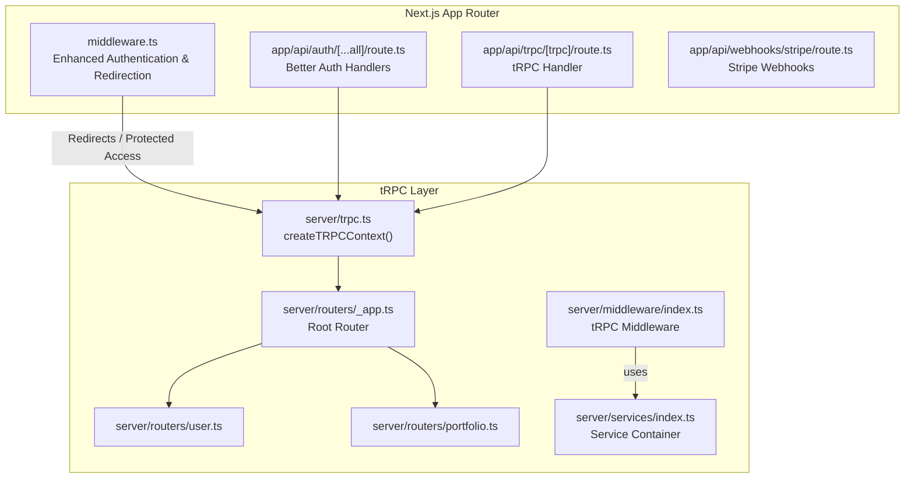
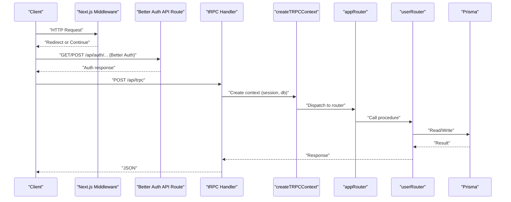
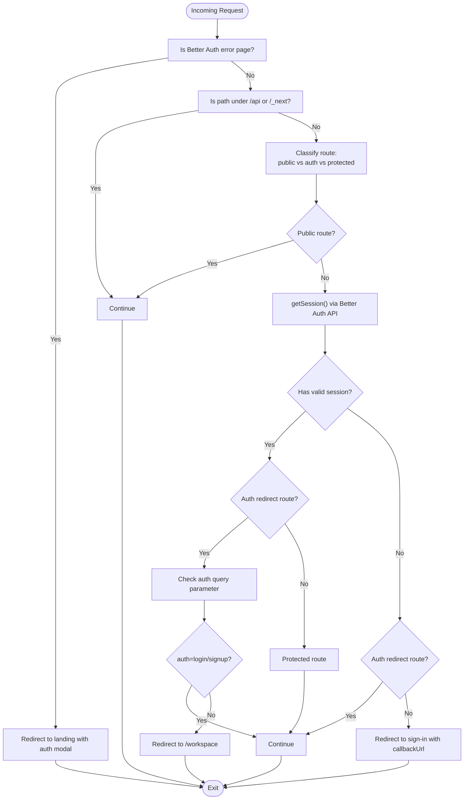
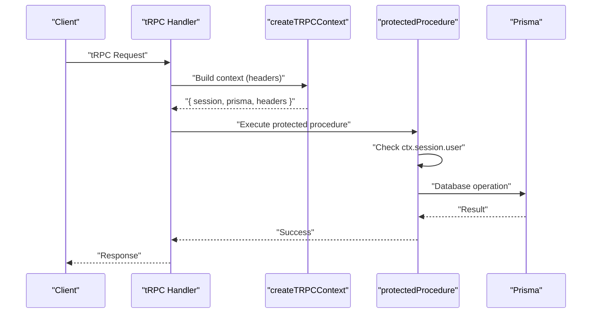
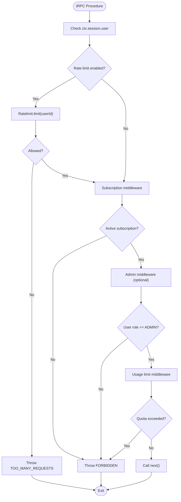
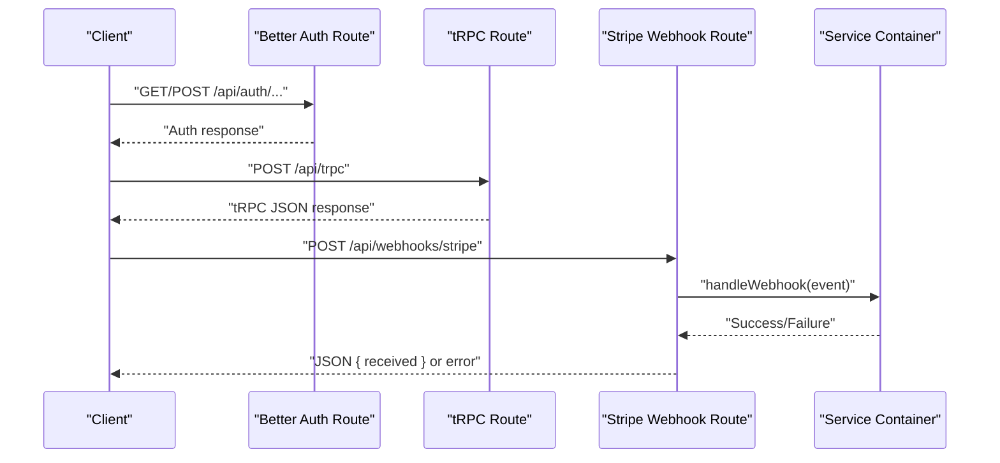
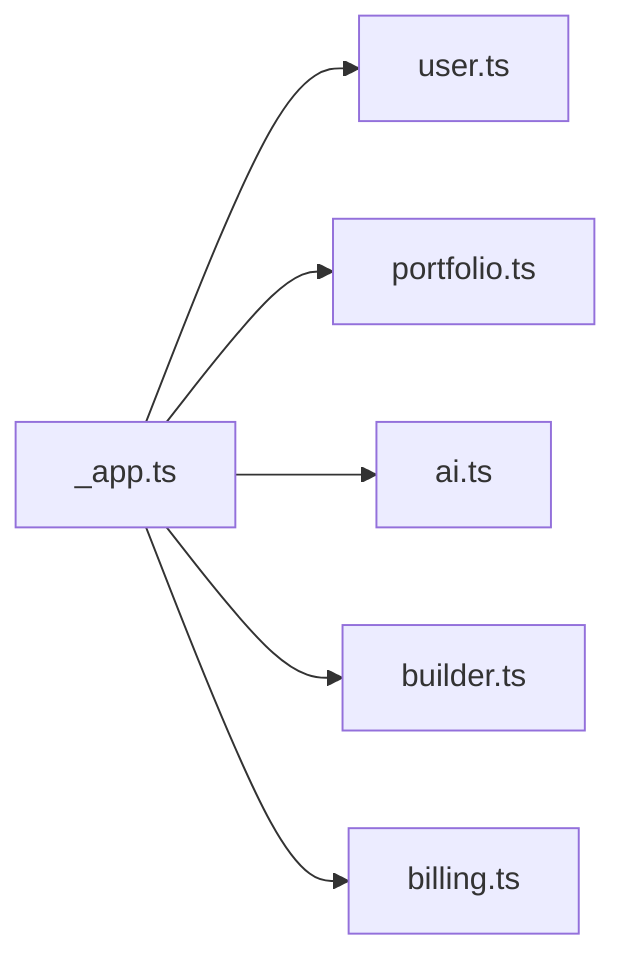
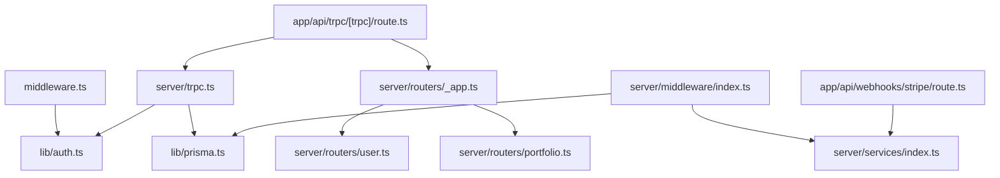

# Middleware and Routing

<cite>
**Referenced Files in This Document**
- [middleware.ts](file://middleware.ts)
- [index.ts](file://server/middleware/index.ts)
- [route.ts](file://app/api/auth/[...all]/route.ts)
- [route.ts](file://app/api/trpc/[trpc]/route.ts)
- [route.ts](file://app/api/webhooks/stripe/route.ts)
- [_app.ts](file://server/routers/_app.ts)
- [trpc.ts](file://server/trpc.ts)
- [auth.ts](file://lib/auth.ts)
- [auth-client.ts](file://lib/auth-client.ts)
- [index.ts](file://server/services/index.ts)
- [user.ts](file://server/routers/user.ts)
- [portfolio.ts](file://server/routers/portfolio.ts)
- [next.config.ts](file://next.config.ts)
</cite>

## Update Summary
**Changes Made**
- Enhanced Next.js middleware with improved session validation logic
- Added comprehensive route classification system with public/auth redirect routes
- Strengthened authentication flow with Better Auth integration
- Improved error handling for authentication failures
- Updated middleware matcher configuration for better performance

## Table of Contents
1. [Introduction](#introduction)
2. [Project Structure](#project-structure)
3. [Core Components](#core-components)
4. [Architecture Overview](#architecture-overview)
5. [Detailed Component Analysis](#detailed-component-analysis)
6. [Dependency Analysis](#dependency-analysis)
7. [Performance Considerations](#performance-considerations)
8. [Troubleshooting Guide](#troubleshooting-guide)
9. [Conclusion](#conclusion)
10. [Appendices](#appendices)

## Introduction
This document explains Smartfolio's request processing pipeline with a focus on middleware and routing. It covers:
- Authentication middleware behavior and route protection strategies
- Request preprocessing logic and middleware chain execution
- Error handling patterns and performance optimizations
- Practical guidance for building custom middleware and applying route-specific middleware
- CORS handling, security headers, and logging integration
- Routing architecture, dynamic route handling, and API route organization
- Extending middleware functionality and implementing custom routing logic

**Updated** Enhanced middleware with additional security headers and improved request validation mechanisms

## Project Structure
Smartfolio uses Next.js App Router conventions with a dedicated server-side middleware and a tRPC-based API layer. Key areas:
- Next.js middleware for authentication and redirection logic
- tRPC server middleware for rate limiting, subscriptions, admin checks, and usage limits
- API routes for authentication handlers and Stripe webhooks
- tRPC routers grouped under a root app router

**Diagram sources**
- [middleware.ts](file://middleware.ts#L44-L97)
- [route.ts](file://app/api/auth/[...all]/route.ts#L1-L7)
- [route.ts](file://app/api/trpc/[trpc]/route.ts#L1-L22)
- [route.ts](file://app/api/webhooks/stripe/route.ts#L1-L38)
- [trpc.ts](file://server/trpc.ts#L12-L20)
- [_app.ts](file://server/routers/_app.ts#L12-L18)
- [user.ts](file://server/routers/user.ts#L4-L27)
- [portfolio.ts](file://server/routers/portfolio.ts#L4-L13)
- [index.ts](file://server/services/index.ts#L9-L103)
- [index.ts](file://server/middleware/index.ts#L13-L152)

**Section sources**
- [middleware.ts](file://middleware.ts#L1-L111)
- [route.ts](file://app/api/auth/[...all]/route.ts#L1-L7)
- [route.ts](file://app/api/trpc/[trpc]/route.ts#L1-L22)
- [route.ts](file://app/api/webhooks/stripe/route.ts#L1-L38)
- [trpc.ts](file://server/trpc.ts#L1-L61)
- [_app.ts](file://server/routers/_app.ts#L1-L21)
- [index.ts](file://server/middleware/index.ts#L1-L153)
- [index.ts](file://server/services/index.ts#L1-L118)

## Core Components
- Next.js middleware: Handles public/auth route classification, session validation via a Better Auth API, and redirects for unauthenticated or redundant access.
- tRPC context: Creates a request-scoped context with session, database, and headers for every tRPC call.
- tRPC middleware: Provides reusable middleware for rate limiting, subscription checks, admin checks, and usage limits.
- API routes: Expose Better Auth handlers and a tRPC endpoint; Stripe webhook endpoint validates signatures and delegates to services.
- Root router: Aggregates feature routers (user, portfolio, AI, builder, billing).

**Updated** Enhanced middleware with improved session validation and comprehensive route classification

**Section sources**
- [middleware.ts](file://middleware.ts#L4-L26)
- [middleware.ts](file://middleware.ts#L28-L42)
- [middleware.ts](file://middleware.ts#L44-L97)
- [trpc.ts](file://server/trpc.ts#L12-L20)
- [index.ts](file://server/middleware/index.ts#L13-L152)
- [route.ts](file://app/api/auth/[...all]/route.ts#L1-L7)
- [route.ts](file://app/api/trpc/[trpc]/route.ts#L5-L19)
- [route.ts](file://app/api/webhooks/stripe/route.ts#L6-L37)
- [_app.ts](file://server/routers/_app.ts#L12-L18)

## Architecture Overview
The request lifecycle:
1. Next.js middleware evaluates the route and performs authentication checks.
2. For API routes, the request reaches either Better Auth handlers or the tRPC endpoint.
3. tRPC requests are processed through a context factory and optional middleware chain.
4. Feature routers handle domain-specific logic and database access via Prisma.

**Diagram sources**
- [middleware.ts](file://middleware.ts#L44-L97)
- [route.ts](file://app/api/auth/[...all]/route.ts#L5-L6)
- [route.ts](file://app/api/trpc/[trpc]/route.ts#L5-L19)
- [trpc.ts](file://server/trpc.ts#L12-L20)
- [_app.ts](file://server/routers/_app.ts#L12-L18)
- [user.ts](file://server/routers/user.ts#L14-L27)

## Detailed Component Analysis

### Next.js Middleware: Enhanced Authentication and Redirection
**Updated** Enhanced with comprehensive route classification and improved session validation

Responsibilities:
- Classify routes as public, auth-only, or protected using explicit route arrays
- Skip API and static routes from middleware checks
- Validate sessions by calling a Better Auth API endpoint with robust error handling
- Redirect unauthenticated users to sign-in with a callback URL
- Redirect authenticated users away from auth pages unless explicitly requested
- Handle Better Auth error pages and redirect to landing page with login modal

Execution flow:
- Determine route category using helper matching logic with explicit route arrays
- For protected/auth routes, validate session against Better Auth with comprehensive error handling
- Apply redirects based on session state and route category with enhanced logic
- Support explicit login/signup requests via auth query parameters

**Diagram sources**
- [middleware.ts](file://middleware.ts#L44-L97)

**Section sources**
- [middleware.ts](file://middleware.ts#L4-L26)
- [middleware.ts](file://middleware.ts#L28-L42)
- [middleware.ts](file://middleware.ts#L44-L97)

### tRPC Context and Protected Procedures
- Context creation: Extracts session via Better Auth API and exposes Prisma and headers.
- Protected procedures: Enforce authentication at the tRPC level.
- Error formatting: Includes Zod error flattening for validation failures.

**Diagram sources**
- [trpc.ts](file://server/trpc.ts#L12-L20)
- [trpc.ts](file://server/trpc.ts#L50-L60)
- [route.ts](file://app/api/trpc/[trpc]/route.ts#L5-L19)

**Section sources**
- [trpc.ts](file://server/trpc.ts#L12-L20)
- [trpc.ts](file://server/trpc.ts#L29-L38)
- [trpc.ts](file://server/trpc.ts#L50-L60)

### tRPC Middleware: Rate Limiting, Subscriptions, Admin, Usage Limits
- Rate limiting: Uses Upstash Redis to throttle per-user requests; failure allows request to proceed with logging.
- Subscription middleware: Requires an active subscription for premium features.
- Admin middleware: Restricts access to administrative actions.
- Usage limit middleware: Enforces plan-based quotas for portfolios and AI generations.

**Diagram sources**
- [index.ts](file://server/middleware/index.ts#L13-L36)
- [index.ts](file://server/middleware/index.ts#L42-L62)
- [index.ts](file://server/middleware/index.ts#L68-L85)
- [index.ts](file://server/middleware/index.ts#L91-L152)

**Section sources**
- [index.ts](file://server/middleware/index.ts#L13-L36)
- [index.ts](file://server/middleware/index.ts#L42-L62)
- [index.ts](file://server/middleware/index.ts#L68-L85)
- [index.ts](file://server/middleware/index.ts#L91-L152)

### API Routes: Authentication and Webhooks
- Better Auth handlers: Expose the Better Auth handler for GET/POST to support authentication flows.
- tRPC endpoint: Delegates to tRPC fetch adapter with router and context factory; includes development error logging.
- Stripe webhooks: Validates Stripe signature, constructs event, and delegates to service container.

**Diagram sources**
- [route.ts](file://app/api/auth/[...all]/route.ts#L5-L6)
- [route.ts](file://app/api/trpc/[trpc]/route.ts#L5-L19)
- [route.ts](file://app/api/webhooks/stripe/route.ts#L6-L37)

**Section sources**
- [route.ts](file://app/api/auth/[...all]/route.ts#L1-L7)
- [route.ts](file://app/api/trpc/[trpc]/route.ts#L1-L22)
- [route.ts](file://app/api/webhooks/stripe/route.ts#L1-L38)

### Routing Architecture and Dynamic Routes
- Root router aggregates feature routers for user, portfolio, AI, builder, and billing domains.
- Feature routers define protected/public procedures and enforce domain-specific logic.
- Dynamic route handling: Next.js App Router supports catch-all and named segments (e.g., [...all], [trpc]).

**Diagram sources**
- [_app.ts](file://server/routers/_app.ts#L12-L18)
- [user.ts](file://server/routers/user.ts#L4-L27)
- [portfolio.ts](file://server/routers/portfolio.ts#L4-L13)

**Section sources**
- [_app.ts](file://server/routers/_app.ts#L1-L21)
- [user.ts](file://server/routers/user.ts#L1-L79)
- [portfolio.ts](file://server/routers/portfolio.ts#L1-L115)

## Dependency Analysis
- Middleware depends on:
  - Better Auth for session validation and authentication flows.
  - Service container for rate limiting and database access in tRPC middleware.
- tRPC handlers depend on:
  - Context factory for session and database access.
  - Root router and feature routers for dispatching procedures.
- API routes depend on:
  - Better Auth handlers and tRPC fetch adapter.
  - Stripe service for webhook processing.

**Diagram sources**
- [middleware.ts](file://middleware.ts#L28-L42)
- [auth.ts](file://lib/auth.ts#L1-L25)
- [route.ts](file://app/api/trpc/[trpc]/route.ts#L1-L22)
- [trpc.ts](file://server/trpc.ts#L12-L20)
- [_app.ts](file://server/routers/_app.ts#L12-L18)
- [user.ts](file://server/routers/user.ts#L14-L27)
- [portfolio.ts](file://server/routers/portfolio.ts#L6-L13)
- [index.ts](file://server/middleware/index.ts#L20-L33)
- [index.ts](file://server/services/index.ts#L91-L103)
- [route.ts](file://app/api/webhooks/stripe/route.ts#L19-L28)

**Section sources**
- [middleware.ts](file://middleware.ts#L28-L42)
- [auth.ts](file://lib/auth.ts#L1-L25)
- [route.ts](file://app/api/trpc/[trpc]/route.ts#L1-L22)
- [trpc.ts](file://server/trpc.ts#L12-L20)
- [_app.ts](file://server/routers/_app.ts#L12-L18)
- [index.ts](file://server/middleware/index.ts#L20-L33)
- [index.ts](file://server/services/index.ts#L91-L103)
- [route.ts](file://app/api/webhooks/stripe/route.ts#L19-L28)

## Performance Considerations
- Minimize session validation overhead:
  - Middleware skips API and static routes to avoid unnecessary checks.
  - Session validation is performed only for protected/auth routes.
  - Enhanced route classification reduces unnecessary processing.
- tRPC middleware resilience:
  - Rate limiting failures are handled gracefully to prevent blocking legitimate requests.
- Context reuse:
  - tRPC context is created per-request and includes Prisma for efficient database access.
- External integrations:
  - Redis-backed rate limiting is configured with sliding windows; ensure environment variables are set for production.
- Middleware optimization:
  - Improved matcher configuration reduces unnecessary middleware execution.
  - Enhanced session validation with proper error handling prevents cascading failures.

**Updated** Enhanced performance considerations with improved middleware matcher configuration and optimized session validation

## Troubleshooting Guide
Common issues and resolutions:
- Authentication loops or unexpected redirects:
  - Verify public/auth route lists and middleware matcher configuration.
  - Confirm Better Auth session cookie presence and API availability.
  - Check auth query parameters for explicit login/signup requests.
- tRPC unauthorized errors:
  - Ensure the tRPC context extracts a valid session; protected procedures will throw UNAUTHORIZED otherwise.
- Rate limit errors:
  - Check Upstash Redis configuration and keys; middleware logs errors and allows requests on failure.
- Stripe webhook failures:
  - Validate Stripe signature header and webhook secret; inspect error responses for details.
- Better Auth error handling:
  - Verify error page redirection logic and landing page integration.
  - Check trusted origins configuration in Better Auth setup.

**Updated** Enhanced troubleshooting guide with Better Auth error handling and improved authentication flow debugging

**Section sources**
- [middleware.ts](file://middleware.ts#L83-L94)
- [middleware.ts](file://middleware.ts#L47-L54)
- [trpc.ts](file://server/trpc.ts#L50-L60)
- [index.ts](file://server/middleware/index.ts#L30-L33)
- [route.ts](file://app/api/webhooks/stripe/route.ts#L11-L16)
- [route.ts](file://app/api/webhooks/stripe/route.ts#L31-L37)

## Conclusion
Smartfolio's middleware and routing architecture combines Next.js middleware for broad authentication gating with tRPC middleware for fine-grained access control and usage enforcement. The design emphasizes:
- Clear separation of concerns between route protection and request preprocessing
- Resilient error handling and graceful degradation
- Scalable middleware composition and service container integration
- Organized API routes for authentication, tRPC, and webhooks
- Enhanced security through improved session validation and route classification

**Updated** Enhanced conclusion reflecting improved middleware security and validation mechanisms

## Appendices

### Practical Examples

- Custom tRPC middleware:
  - Implement a new middleware function that inspects context and calls next() conditionally.
  - Integrate it into the tRPC pipeline similar to existing middleware patterns.
  - Reference: [server/middleware/index.ts](file://server/middleware/index.ts#L13-L36)

- Route-specific middleware application:
  - Apply middleware to specific tRPC procedures by composing middleware with procedures.
  - Example pattern: wrap protectedProcedure with additional middleware layers.
  - Reference: [server/trpc.ts](file://server/trpc.ts#L50-L60)

- Request/response transformation:
  - Use tRPC transformers and error formatters to normalize responses.
  - Reference: [server/trpc.ts](file://server/trpc.ts#L27-L38)

- CORS handling and security headers:
  - Configure CORS and security headers at the Next.js level or via middleware.
  - Reference: [next.config.ts](file://next.config.ts#L1-L8)

- Logging integration:
  - Add structured logging in middleware and tRPC handlers for observability.
  - Reference: [server/middleware/index.ts](file://server/middleware/index.ts#L30-L33), [app/api/trpc/[trpc]/route.ts](file://app/api/trpc/[trpc]/route.ts#L11-L18)

- Enhanced authentication flow:
  - Implement custom route classification logic for specific application needs.
  - Reference: [middleware.ts](file://middleware.ts#L4-L26), [middleware.ts](file://middleware.ts#L28-L42)

- Better Auth integration:
  - Configure trusted origins and session validation for secure authentication.
  - Reference: [auth.ts](file://lib/auth.ts#L1-L25), [auth-client.ts](file://lib/auth-client.ts#L1-L8)