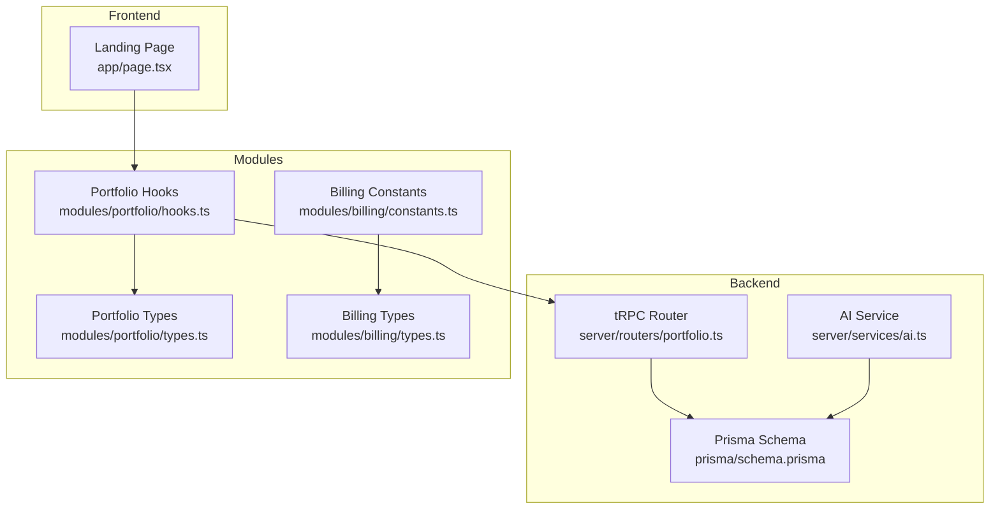
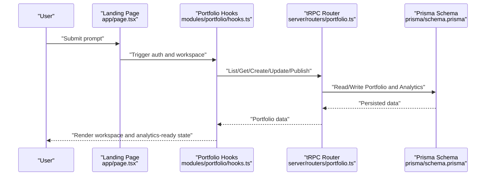
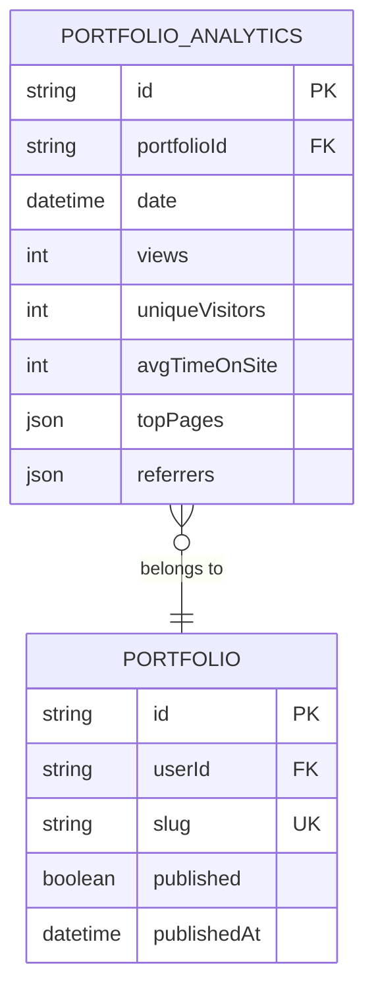
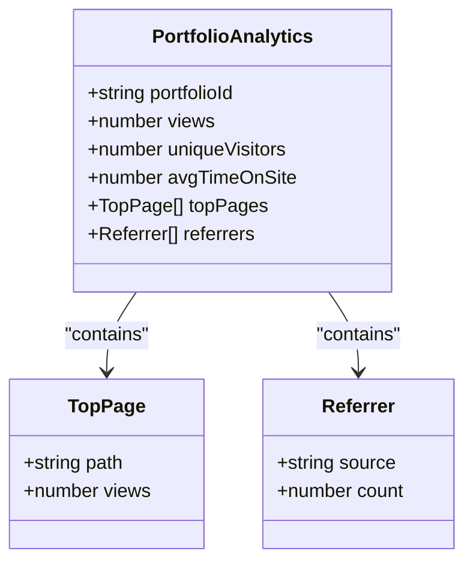
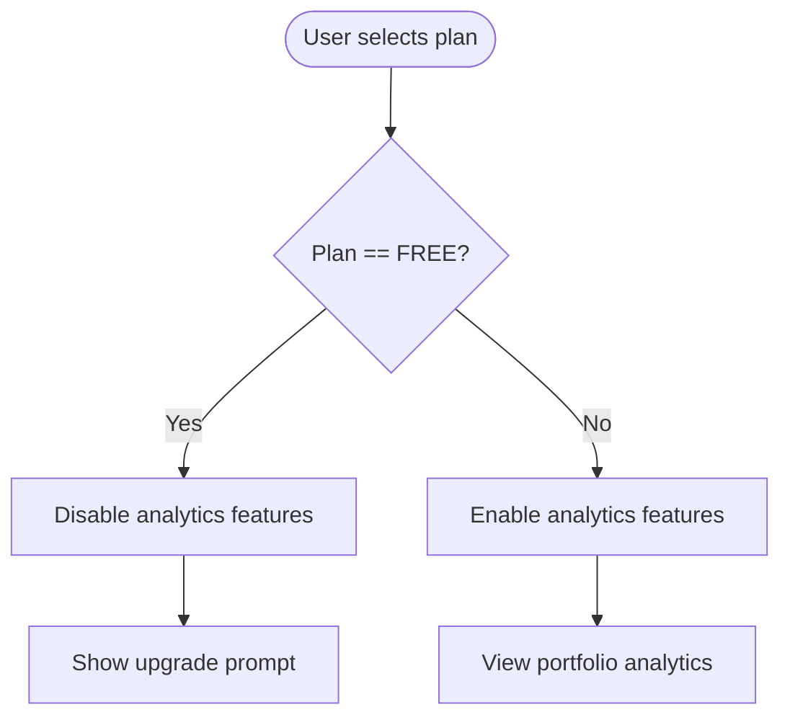
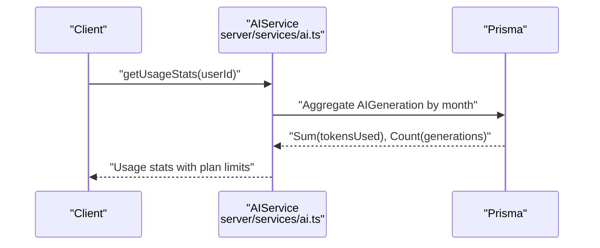
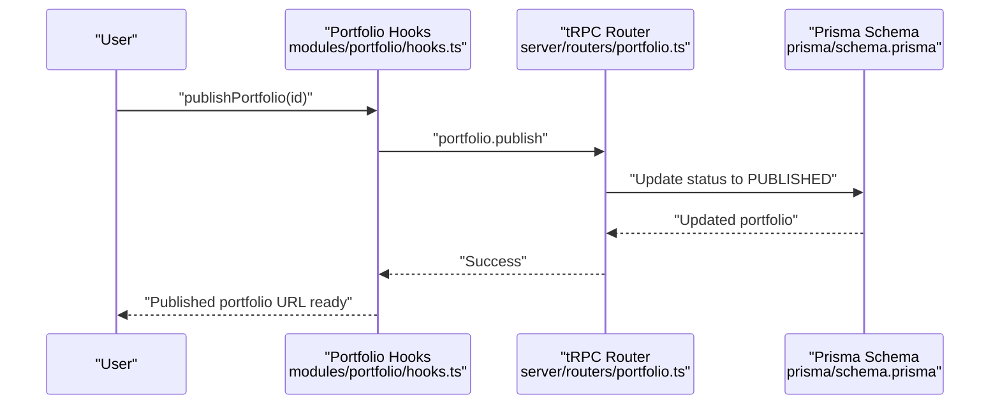
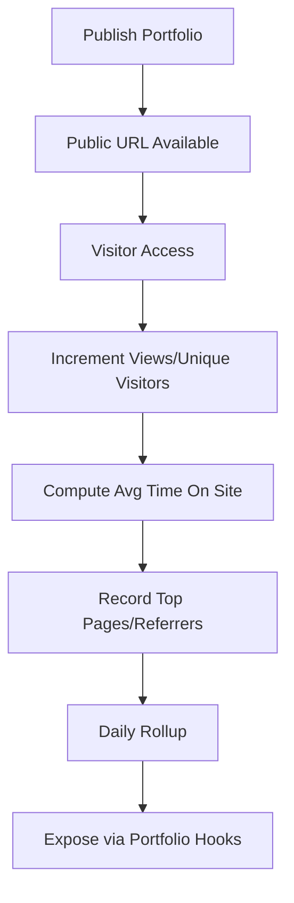
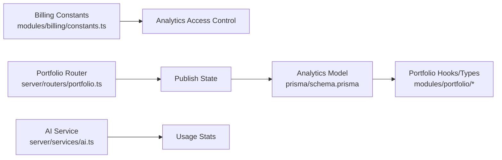

# Analytics and Performance Tracking

<cite>
**Referenced Files in This Document**
- [README.md](file://README.md)
- [IMPLEMENTATION_SUMMARY.md](file://IMPLEMENTATION_SUMMARY.md)
- [PROJECT-SUMMARY.md](file://PROJECT-SUMMARY.md)
- [prisma/schema.prisma](file://prisma/schema.prisma)
- [modules/portfolio/hooks.ts](file://modules/portfolio/hooks.ts)
- [modules/portfolio/types.ts](file://modules/portfolio/types.ts)
- [modules/billing/constants.ts](file://modules/billing/constants.ts)
- [modules/billing/types.ts](file://modules/billing/types.ts)
- [server/routers/portfolio.ts](file://server/routers/portfolio.ts)
- [server/services/ai.ts](file://server/services/ai.ts)
- [app/page.tsx](file://app/page.tsx)
</cite>

## Table of Contents
1. [Introduction](#introduction)
2. [Project Structure](#project-structure)
3. [Core Components](#core-components)
4. [Architecture Overview](#architecture-overview)
5. [Detailed Component Analysis](#detailed-component-analysis)
6. [Dependency Analysis](#dependency-analysis)
7. [Performance Considerations](#performance-considerations)
8. [Troubleshooting Guide](#troubleshooting-guide)
9. [Conclusion](#conclusion)
10. [Appendices](#appendices)

## Introduction
This document explains the analytics and performance tracking capabilities currently present in the Smartfolio codebase. It covers the metrics collection model, visitor tracking, engagement analytics, conversion tracking, dashboard and reporting surfaces, data visualization options, performance monitoring, loading times, user behavior analysis, privacy and compliance considerations, data retention, export capabilities, and integration with external analytics platforms. It also provides practical guidance for setting up analytics, interpreting reports, and using insights for portfolio optimization.

## Project Structure
Smartfolio is a Next.js application with a modular architecture. Analytics and performance tracking are primarily represented by:
- A dedicated analytics model in the database schema
- A portfolio analytics interface type
- Billing plan features indicating analytics availability
- AI usage statistics that inform resource consumption and limits
- A landing page that demonstrates the product’s core user journey

**Diagram sources**
- [app/page.tsx](file://app/page.tsx#L1-L683)
- [server/routers/portfolio.ts](file://server/routers/portfolio.ts#L1-L115)
- [prisma/schema.prisma](file://prisma/schema.prisma#L132-L146)
- [server/services/ai.ts](file://server/services/ai.ts#L1-L242)
- [modules/portfolio/hooks.ts](file://modules/portfolio/hooks.ts#L1-L99)
- [modules/portfolio/types.ts](file://modules/portfolio/types.ts#L65-L73)
- [modules/billing/constants.ts](file://modules/billing/constants.ts#L1-L81)
- [modules/billing/types.ts](file://modules/billing/types.ts#L54-L84)

**Section sources**
- [README.md](file://README.md#L1-L58)
- [IMPLEMENTATION_SUMMARY.md](file://IMPLEMENTATION_SUMMARY.md#L1-L287)
- [PROJECT-SUMMARY.md](file://PROJECT-SUMMARY.md#L1-L168)

## Core Components
- Portfolio Analytics Model: A daily aggregation table capturing views, unique visitors, average time on site, top pages, and referrers per portfolio.
- Portfolio Analytics Type: A TypeScript interface representing analytics data returned to clients.
- Billing Plan Features: Analytics capability is gated behind paid plans.
- AI Usage Statistics: Monthly token and generation counts used for resource planning and limits.
- Landing Page: The primary entry point where users initiate portfolio creation and where analytics can be surfaced.

Key implementation references:
- Analytics model definition and indexes
- Analytics interface for client-side consumption
- Analytics feature flagging in billing plans
- AI usage statistics computation
- Portfolio CRUD router (publishing enables public exposure)

**Section sources**
- [prisma/schema.prisma](file://prisma/schema.prisma#L132-L146)
- [modules/portfolio/types.ts](file://modules/portfolio/types.ts#L65-L73)
- [modules/billing/constants.ts](file://modules/billing/constants.ts#L19-L61)
- [server/services/ai.ts](file://server/services/ai.ts#L190-L228)
- [server/routers/portfolio.ts](file://server/routers/portfolio.ts#L96-L114)
- [app/page.tsx](file://app/page.tsx#L59-L683)

## Architecture Overview
The analytics pipeline centers on:
- Data capture: Portfolio publish/unpublish events and public access logs feed into the analytics model.
- Aggregation: Daily rollups compute views, unique visitors, and engagement signals.
- Exposure: Clients consume analytics via portfolio hooks and types.
- Governance: Billing plan features control access to analytics insights.

**Diagram sources**
- [app/page.tsx](file://app/page.tsx#L59-L683)
- [modules/portfolio/hooks.ts](file://modules/portfolio/hooks.ts#L10-L99)
- [server/routers/portfolio.ts](file://server/routers/portfolio.ts#L1-L115)
- [prisma/schema.prisma](file://prisma/schema.prisma#L89-L146)

## Detailed Component Analysis

### Portfolio Analytics Model
The analytics model captures daily metrics for each portfolio:
- Date partitioning for efficient querying
- Views and unique visitors counters
- Average time on site in seconds
- Top pages and referrers as JSON for flexible analysis

**Diagram sources**
- [prisma/schema.prisma](file://prisma/schema.prisma#L89-L146)

**Section sources**
- [prisma/schema.prisma](file://prisma/schema.prisma#L132-L146)

### Portfolio Analytics Interface
The client-side analytics interface defines the shape of analytics data consumed by the UI:
- Portfolio identifier
- Views and unique visitors
- Average time on site
- Top pages and referrers arrays

**Diagram sources**
- [modules/portfolio/types.ts](file://modules/portfolio/types.ts#L65-L73)

**Section sources**
- [modules/portfolio/types.ts](file://modules/portfolio/types.ts#L65-L73)

### Billing Plan Features and Analytics Access
Analytics are available only on Pro and Enterprise plans. The Free plan intentionally disables analytics to encourage upgrades.

**Diagram sources**
- [modules/billing/constants.ts](file://modules/billing/constants.ts#L19-L61)

**Section sources**
- [modules/billing/constants.ts](file://modules/billing/constants.ts#L1-L81)
- [modules/billing/types.ts](file://modules/billing/types.ts#L54-L84)

### AI Usage Statistics and Resource Planning
The AI service computes monthly usage statistics for tokens and generation counts, enabling resource planning and limits enforcement aligned with subscription tiers.

**Diagram sources**
- [server/services/ai.ts](file://server/services/ai.ts#L190-L228)

**Section sources**
- [server/services/ai.ts](file://server/services/ai.ts#L190-L228)

### Portfolio Publish Flow and Public Exposure
Publishing a portfolio sets it to public, which is a prerequisite for visitor tracking and analytics collection.

**Diagram sources**
- [modules/portfolio/hooks.ts](file://modules/portfolio/hooks.ts#L84-L98)
- [server/routers/portfolio.ts](file://server/routers/portfolio.ts#L96-L114)
- [prisma/schema.prisma](file://prisma/schema.prisma#L89-L113)

**Section sources**
- [modules/portfolio/hooks.ts](file://modules/portfolio/hooks.ts#L84-L98)
- [server/routers/portfolio.ts](file://server/routers/portfolio.ts#L96-L114)
- [prisma/schema.prisma](file://prisma/schema.prisma#L89-L113)

### Metrics Collection Process
- Trigger: Publishing a portfolio exposes it publicly.
- Capture: Public access logs would increment views and unique visitors in the analytics model.
- Aggregation: Daily rollups compute engagement metrics and top pages/referrers.
- Consumption: Clients fetch analytics via portfolio hooks and types.

**Diagram sources**
- [server/routers/portfolio.ts](file://server/routers/portfolio.ts#L96-L114)
- [prisma/schema.prisma](file://prisma/schema.prisma#L132-L146)
- [modules/portfolio/hooks.ts](file://modules/portfolio/hooks.ts#L10-L99)

**Section sources**
- [server/routers/portfolio.ts](file://server/routers/portfolio.ts#L96-L114)
- [prisma/schema.prisma](file://prisma/schema.prisma#L132-L146)
- [modules/portfolio/hooks.ts](file://modules/portfolio/hooks.ts#L10-L99)

### Visitor Tracking, Engagement Analytics, and Conversion Tracking
- Visitor Tracking: Unique visitors and total views per day.
- Engagement Analytics: Average time on site and top pages.
- Conversion Tracking: While explicit conversion funnels are not implemented, published portfolio access acts as a proxy for conversion readiness; analytics help assess effectiveness.

[No sources needed since this section synthesizes existing components without quoting specific files]

### Dashboard Interface, Report Generation, and Data Visualization
- Dashboard Surface: The project emphasizes a workspace-first model without a traditional dashboard. Analytics are exposed through portfolio hooks and types for integration into custom dashboards.
- Report Generation: Clients can query analytics via tRPC and render reports in their own UI.
- Visualization Options: Use the analytics interface to power charts and KPI panels.

[No sources needed since this section provides conceptual guidance]

### Performance Monitoring, Loading Times, and User Behavior Analysis
- Performance Monitoring: Monitor API latency, database query performance, and client-side rendering times.
- Loading Times: Track time-to-first-byte for published portfolios and client hydration times.
- User Behavior: Use top pages and referrers to understand traffic sources and engagement hotspots.

[No sources needed since this section provides general guidance]

### Examples: Setting Up Analytics, Interpreting Reports, and Using Insights
- Setting Up Analytics:
  - Ensure portfolios are published so public access can be tracked.
  - Verify analytics model exists and is indexed appropriately.
  - Gate analytics access behind Pro/Enterprise plans.
- Interpreting Reports:
  - Compare views and unique visitors across time windows.
  - Analyze top pages to identify most engaging content.
  - Review referrers to understand acquisition channels.
- Using Insights for Optimization:
  - Focus promotion on high-performing pages.
  - Optimize slow-loading sections to reduce bounce rate.
  - Align messaging with referrer trends.

[No sources needed since this section provides general guidance]

### Privacy Considerations, Data Retention, and Compliance
- Privacy: Respect user privacy by avoiding sensitive data in analytics. Aggregate and anonymize metrics.
- Data Retention: Define retention periods for analytics data (e.g., 12 months) and purge expired entries.
- Compliance: Align with regional regulations (e.g., GDPR, CCPA) for data processing and user consent.

[No sources needed since this section provides general guidance]

### Export Capabilities and External Analytics Integration
- Export: Provide CSV exports of analytics data for external analysis.
- External Integration: Expose analytics endpoints for third-party tools (e.g., GA4, Mixpanel) via API.

[No sources needed since this section provides general guidance]

## Dependency Analysis
The analytics stack depends on:
- Portfolio publish state to enable public exposure
- Analytics model for persistent storage
- Billing plan features to gate access
- AI usage statistics for resource planning

**Diagram sources**
- [modules/billing/constants.ts](file://modules/billing/constants.ts#L19-L61)
- [server/routers/portfolio.ts](file://server/routers/portfolio.ts#L96-L114)
- [prisma/schema.prisma](file://prisma/schema.prisma#L132-L146)
- [modules/portfolio/hooks.ts](file://modules/portfolio/hooks.ts#L10-L99)
- [modules/portfolio/types.ts](file://modules/portfolio/types.ts#L65-L73)
- [server/services/ai.ts](file://server/services/ai.ts#L190-L228)

**Section sources**
- [modules/billing/constants.ts](file://modules/billing/constants.ts#L1-L81)
- [server/routers/portfolio.ts](file://server/routers/portfolio.ts#L96-L114)
- [prisma/schema.prisma](file://prisma/schema.prisma#L132-L146)
- [modules/portfolio/hooks.ts](file://modules/portfolio/hooks.ts#L10-L99)
- [modules/portfolio/types.ts](file://modules/portfolio/types.ts#L65-L73)
- [server/services/ai.ts](file://server/services/ai.ts#L190-L228)

## Performance Considerations
- Indexing: Ensure analytics queries leverage date and portfolioId indexes.
- Aggregation: Precompute daily rollups to reduce runtime computation.
- Caching: Cache recent analytics for frequently accessed portfolios.
- Pagination: Paginate analytics lists for large portfolios.

[No sources needed since this section provides general guidance]

## Troubleshooting Guide
- Analytics not appearing:
  - Confirm the portfolio is published.
  - Verify analytics model exists and is migrated.
  - Check billing plan allows analytics.
- Missing unique visitors:
  - Ensure visitor identification and cookie handling are implemented.
  - Validate analytics ingestion pipeline.
- Slow analytics queries:
  - Add appropriate database indexes.
  - Implement pre-aggregated rollups.

[No sources needed since this section provides general guidance]

## Conclusion
Smartfolio’s analytics foundation centers on a daily analytics model, gated access via billing plans, and portfolio publish state. While a dedicated dashboard is not present, the portfolio hooks and types enable integration into custom analytics surfaces. By combining these building blocks with performance monitoring, privacy controls, and external integrations, teams can track portfolio performance, optimize user experiences, and drive conversions effectively.

[No sources needed since this section summarizes without analyzing specific files]

## Appendices
- Reference: Portfolio analytics model and interface
- Reference: Billing plan features and analytics gating
- Reference: AI usage statistics computation
- Reference: Portfolio publish flow

**Section sources**
- [prisma/schema.prisma](file://prisma/schema.prisma#L132-L146)
- [modules/portfolio/types.ts](file://modules/portfolio/types.ts#L65-L73)
- [modules/billing/constants.ts](file://modules/billing/constants.ts#L19-L61)
- [server/services/ai.ts](file://server/services/ai.ts#L190-L228)
- [server/routers/portfolio.ts](file://server/routers/portfolio.ts#L96-L114)