# Portfolio Creation and Editing Workflow

<cite>
**Referenced Files in This Document**
- [modules/portfolio/index.ts](file://modules/portfolio/index.ts)
- [modules/portfolio/types.ts](file://modules/portfolio/types.ts)
- [modules/portfolio/hooks.ts](file://modules/portfolio/hooks.ts)
- [modules/portfolio/utils.ts](file://modules/portfolio/utils.ts)
- [modules/portfolio/constants.ts](file://modules/portfolio/constants.ts)
- [server/routers/portfolio.ts](file://server/routers/portfolio.ts)
- [prisma/schema.prisma](file://prisma/schema.prisma)
- [modules/builder/index.ts](file://modules/builder/index.ts)
- [modules/builder/types.ts](file://modules/builder/types.ts)
- [modules/builder/hooks.ts](file://modules/builder/hooks.ts)
- [server/routers/builder.ts](file://server/routers/builder.ts)
- [modules/ai/index.ts](file://modules/ai/index.ts)
- [modules/ai/types.ts](file://modules/ai/types.ts)
- [server/routers/ai.ts](file://server/routers/ai.ts)
- [lib/trpc-provider.tsx](file://lib/trpc-provider.tsx)
- [lib/auth.ts](file://lib/auth.ts)
- [app/page.tsx](file://app/page.tsx)
</cite>

## Table of Contents
1. [Introduction](#introduction)
2. [Project Structure](#project-structure)
3. [Core Components](#core-components)
4. [Architecture Overview](#architecture-overview)
5. [Detailed Component Analysis](#detailed-component-analysis)
6. [Dependency Analysis](#dependency-analysis)
7. [Performance Considerations](#performance-considerations)
8. [Troubleshooting Guide](#troubleshooting-guide)
9. [Conclusion](#conclusion)

## Introduction
This document explains the portfolio creation and editing workflow in SmartFolio. It covers how users create new portfolios, choose themes and templates, customize content, preview changes, manage drafts, and publish. It also documents metadata management, branding options, content organization, CRUD operations, validation, error handling, user permissions, collaboration features, versioning, autosave, and recovery mechanisms.

## Project Structure
SmartFolio organizes portfolio functionality into modular TypeScript packages and tRPC routers backed by Prisma ORM. The key areas are:
- Portfolio domain: types, hooks, utilities, and constants
- Builder domain: drag-and-drop blocks, templates, and persistence
- AI domain: content generation for portfolios and sections
- Backend: tRPC routers for portfolio, builder, and AI operations
- Frontend: tRPC provider, authentication, and UI surfaces

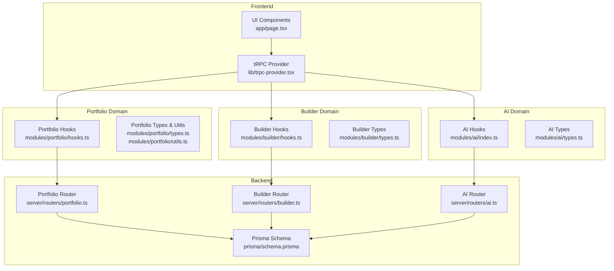

**Diagram sources**
- [lib/trpc-provider.tsx](file://lib/trpc-provider.tsx#L1-L50)
- [modules/portfolio/hooks.ts](file://modules/portfolio/hooks.ts#L1-L99)
- [modules/builder/hooks.ts](file://modules/builder/hooks.ts#L1-L117)
- [modules/ai/index.ts](file://modules/ai/index.ts#L1-L14)
- [server/routers/portfolio.ts](file://server/routers/portfolio.ts#L1-L115)
- [server/routers/builder.ts](file://server/routers/builder.ts#L1-L156)
- [server/routers/ai.ts](file://server/routers/ai.ts#L1-L105)
- [prisma/schema.prisma](file://prisma/schema.prisma#L89-L146)

**Section sources**
- [lib/trpc-provider.tsx](file://lib/trpc-provider.tsx#L1-L50)
- [modules/portfolio/index.ts](file://modules/portfolio/index.ts#L1-L14)
- [modules/builder/index.ts](file://modules/builder/index.ts#L1-L14)
- [modules/ai/index.ts](file://modules/ai/index.ts#L1-L14)

## Core Components
- Portfolio types define the data model for portfolios, sections, and statuses.
- Portfolio hooks encapsulate tRPC queries/mutations for CRUD and publishing.
- Portfolio utilities provide URL generation, validation, and status helpers.
- Builder hooks manage the in-browser block editor state and template/application.
- AI hooks enable AI-driven content generation for portfolios and sections.
- tRPC routers implement protected procedures for portfolio, builder, and AI operations.
- Prisma schema defines the relational model for portfolios, sections, analytics, templates, and users.

Key capabilities:
- Create, list, get, update, delete, and publish portfolios
- Manage sections as blocks with ordering and visibility
- Apply templates to populate sections
- Save custom blocks to persist content
- Generate AI-assisted content and metadata
- Enforce per-user ownership and access control

**Section sources**
- [modules/portfolio/types.ts](file://modules/portfolio/types.ts#L1-L73)
- [modules/portfolio/hooks.ts](file://modules/portfolio/hooks.ts#L1-L99)
- [modules/portfolio/utils.ts](file://modules/portfolio/utils.ts#L1-L55)
- [modules/builder/types.ts](file://modules/builder/types.ts#L1-L76)
- [modules/builder/hooks.ts](file://modules/builder/hooks.ts#L1-L117)
- [modules/ai/types.ts](file://modules/ai/types.ts#L1-L69)
- [server/routers/portfolio.ts](file://server/routers/portfolio.ts#L1-L115)
- [server/routers/builder.ts](file://server/routers/builder.ts#L1-L156)
- [server/routers/ai.ts](file://server/routers/ai.ts#L1-L105)
- [prisma/schema.prisma](file://prisma/schema.prisma#L89-L146)

## Architecture Overview
The workflow spans frontend hooks, tRPC routers, and Prisma models. Authentication is handled by Better Auth, and tRPC ensures type-safe client-server communication.

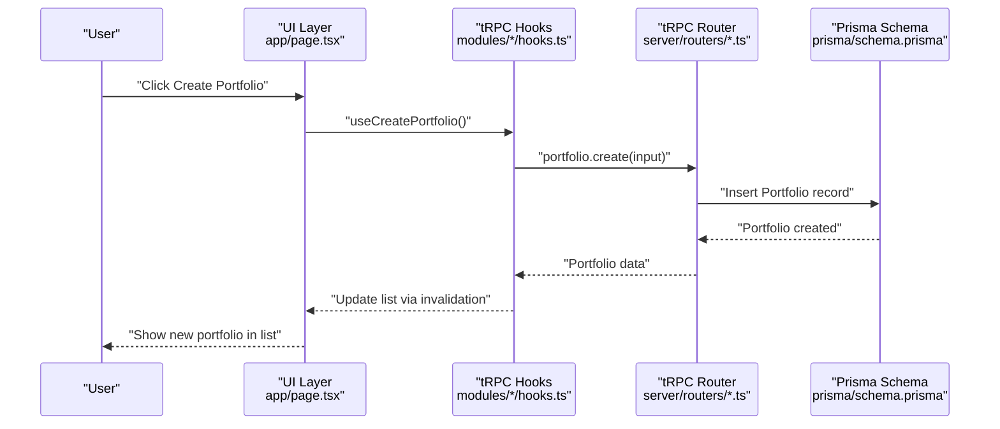

**Diagram sources**
- [modules/portfolio/hooks.ts](file://modules/portfolio/hooks.ts#L33-L48)
- [server/routers/portfolio.ts](file://server/routers/portfolio.ts#L29-L54)
- [prisma/schema.prisma](file://prisma/schema.prisma#L89-L113)

## Detailed Component Analysis

### Portfolio CRUD Operations
- Create: Validates title length and optional slug/theme; defaults to DRAFT status.
- List: Returns user-scoped portfolios ordered by creation time.
- Get by ID: Enforces ownership before returning a portfolio.
- Update: Allows partial updates to metadata, theme, and status.
- Delete: Removes a user’s portfolio.
- Publish: Sets status to PUBLISHED and marks published flag with timestamp.

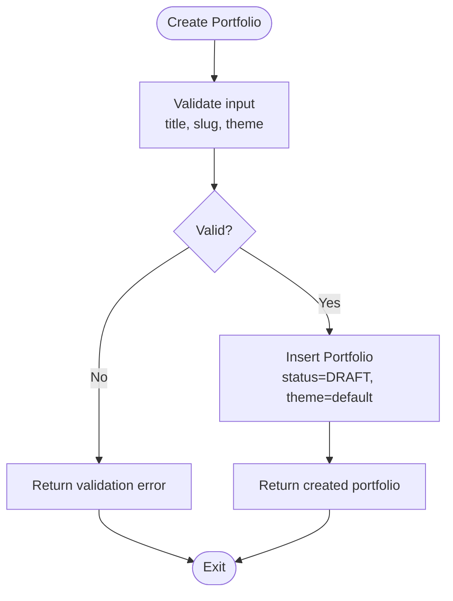

**Diagram sources**
- [server/routers/portfolio.ts](file://server/routers/portfolio.ts#L29-L54)
- [modules/portfolio/constants.ts](file://modules/portfolio/constants.ts#L5-L36)

**Section sources**
- [server/routers/portfolio.ts](file://server/routers/portfolio.ts#L6-L114)
- [modules/portfolio/hooks.ts](file://modules/portfolio/hooks.ts#L10-L48)
- [modules/portfolio/utils.ts](file://modules/portfolio/utils.ts#L21-L27)

### Template Selection and Application
- Templates are stored with blocks and applied to a portfolio by transforming template blocks into portfolio sections.
- Ownership is verified before applying templates or saving blocks.

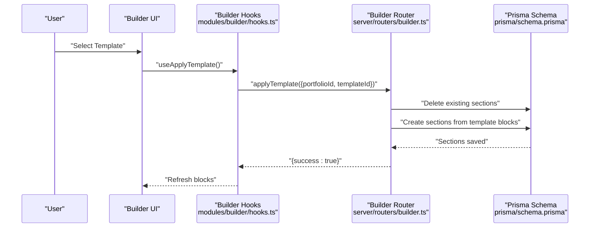

**Diagram sources**
- [modules/builder/hooks.ts](file://modules/builder/hooks.ts#L96-L105)
- [server/routers/builder.ts](file://server/routers/builder.ts#L17-L68)
- [prisma/schema.prisma](file://prisma/schema.prisma#L115-L130)

**Section sources**
- [server/routers/builder.ts](file://server/routers/builder.ts#L7-L155)
- [modules/builder/hooks.ts](file://modules/builder/hooks.ts#L87-L105)
- [modules/builder/types.ts](file://modules/builder/types.ts#L39-L49)

### Content Organization and Blocks
- Sections represent blocks within a portfolio and are persisted as JSON content with ordering and visibility.
- The builder manages block state locally and syncs with the backend via save operations.

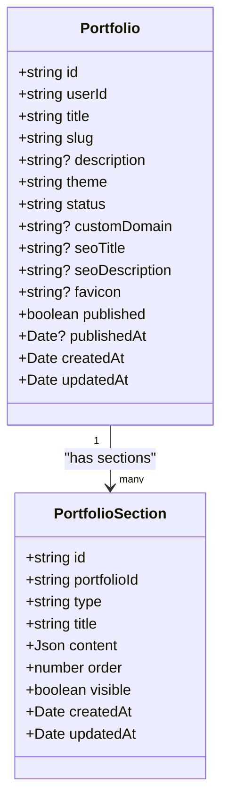

**Diagram sources**
- [prisma/schema.prisma](file://prisma/schema.prisma#L89-L130)

**Section sources**
- [modules/builder/types.ts](file://modules/builder/types.ts#L20-L27)
- [modules/builder/hooks.ts](file://modules/builder/hooks.ts#L11-L85)
- [server/routers/builder.ts](file://server/routers/builder.ts#L70-L155)

### Real-time Preview and Autosave
- The builder maintains a local state with a preview mode toggle and supports block reordering and updates.
- Autosave is achieved by persisting blocks to the backend after each change, ensuring recovery from browser refresh or session interruptions.

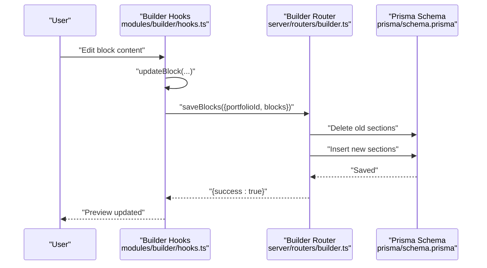

**Diagram sources**
- [modules/builder/hooks.ts](file://modules/builder/hooks.ts#L107-L117)
- [server/routers/builder.ts](file://server/routers/builder.ts#L70-L119)
- [prisma/schema.prisma](file://prisma/schema.prisma#L115-L130)

**Section sources**
- [modules/builder/hooks.ts](file://modules/builder/hooks.ts#L11-L85)
- [server/routers/builder.ts](file://server/routers/builder.ts#L70-L155)

### Metadata Management and Branding
- Portfolio metadata includes title, slug, description, theme, SEO fields, favicon, and custom domain.
- Utilities provide slug generation, validation, and URL construction for portfolio pages.
- Themes are enumerated and mapped to display-friendly values.

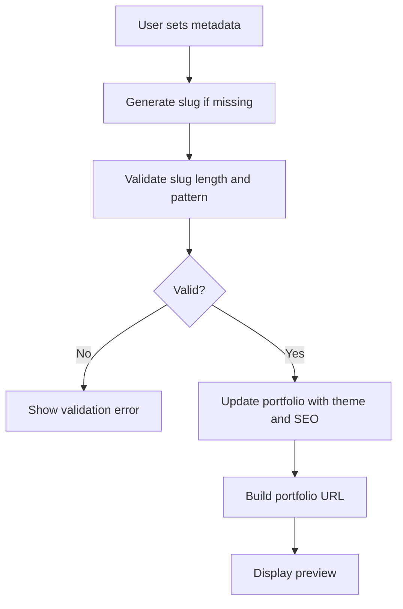

**Diagram sources**
- [modules/portfolio/utils.ts](file://modules/portfolio/utils.ts#L7-L19)
- [modules/portfolio/utils.ts](file://modules/portfolio/utils.ts#L42-L44)
- [modules/portfolio/constants.ts](file://modules/portfolio/constants.ts#L11-L17)
- [server/routers/portfolio.ts](file://server/routers/portfolio.ts#L29-L54)

**Section sources**
- [modules/portfolio/types.ts](file://modules/portfolio/types.ts#L19-L63)
- [modules/portfolio/utils.ts](file://modules/portfolio/utils.ts#L14-L27)
- [modules/portfolio/constants.ts](file://modules/portfolio/constants.ts#L11-L36)

### Publishing Workflow
- Publishing requires the portfolio to be in DRAFT status and have a non-empty title.
- On publish, status becomes PUBLISHED, published flag is set, and publishedAt timestamp is recorded.

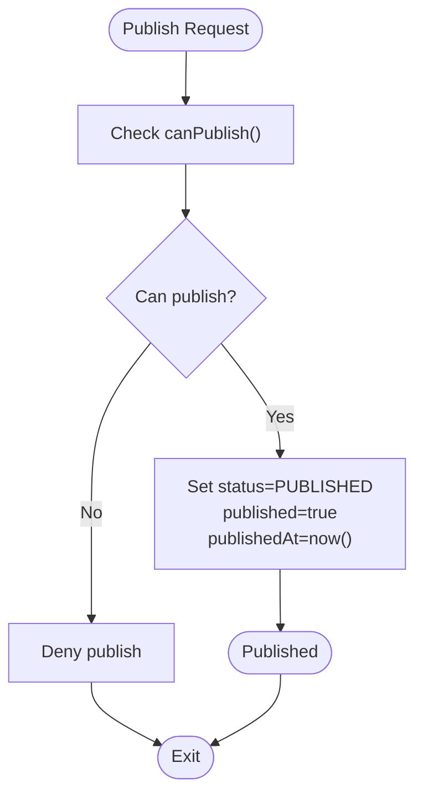

**Diagram sources**
- [modules/portfolio/utils.ts](file://modules/portfolio/utils.ts#L25-L27)
- [server/routers/portfolio.ts](file://server/routers/portfolio.ts#L96-L113)

**Section sources**
- [modules/portfolio/utils.ts](file://modules/portfolio/utils.ts#L21-L27)
- [server/routers/portfolio.ts](file://server/routers/portfolio.ts#L96-L113)

### Collaboration and Permissions
- All portfolio operations are protected and scoped to the authenticated user’s ID.
- Ownership verification occurs in both list/get and mutation endpoints to prevent cross-user access.

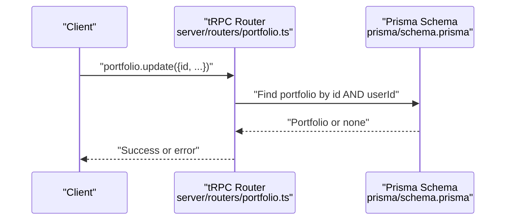

**Diagram sources**
- [server/routers/portfolio.ts](file://server/routers/portfolio.ts#L56-L80)
- [prisma/schema.prisma](file://prisma/schema.prisma#L89-L113)

**Section sources**
- [server/routers/portfolio.ts](file://server/routers/portfolio.ts#L6-L13)
- [server/routers/portfolio.ts](file://server/routers/portfolio.ts#L15-L27)
- [server/routers/portfolio.ts](file://server/routers/portfolio.ts#L56-L80)

### Versioning, Autosave, and Recovery
- Versioning: The schema includes a dedicated analytics model; versioning is not explicitly modeled in the current schema.
- Autosave: Saving blocks persists sections immediately, enabling recovery after reloads.
- Recovery: Users can re-open a portfolio and continue editing; sections are fetched on load.

**Section sources**
- [server/routers/builder.ts](file://server/routers/builder.ts#L121-L155)
- [prisma/schema.prisma](file://prisma/schema.prisma#L132-L146)

### Form Validation and Error Handling
- Frontend validation: Slug pattern and length checks; title length limits; word count for content prompts.
- Backend validation: Zod schemas enforce input constraints and enum values.
- Error propagation: tRPC mutations surface errors to hooks; UI displays feedback.

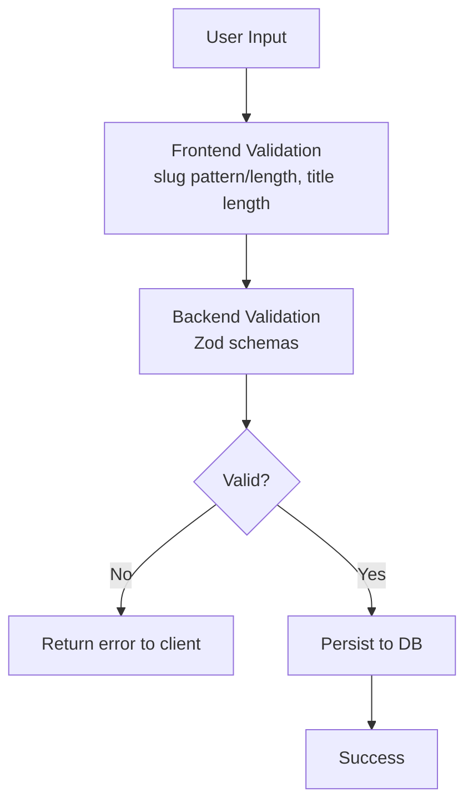

**Diagram sources**
- [modules/portfolio/utils.ts](file://modules/portfolio/utils.ts#L42-L44)
- [modules/portfolio/constants.ts](file://modules/portfolio/constants.ts#L32-L36)
- [server/routers/portfolio.ts](file://server/routers/portfolio.ts#L30-L38)
- [app/page.tsx](file://app/page.tsx#L8-L30)

**Section sources**
- [modules/portfolio/utils.ts](file://modules/portfolio/utils.ts#L42-L44)
- [modules/portfolio/constants.ts](file://modules/portfolio/constants.ts#L32-L36)
- [server/routers/portfolio.ts](file://server/routers/portfolio.ts#L30-L38)
- [app/page.tsx](file://app/page.tsx#L8-L30)

## Dependency Analysis
- Portfolio hooks depend on tRPC provider and portfolio router.
- Builder hooks depend on builder router and Prisma schema for sections.
- AI hooks depend on AI router and Prisma schema for generation history.
- Authentication integrates with Better Auth and Prisma user model.

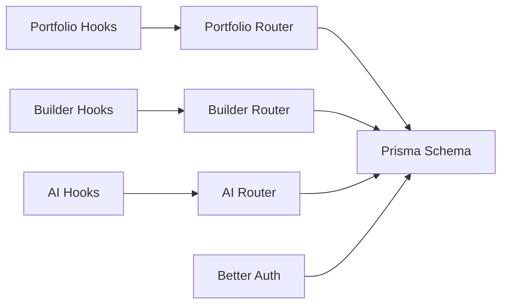

**Diagram sources**
- [modules/portfolio/hooks.ts](file://modules/portfolio/hooks.ts#L7-L8)
- [modules/builder/hooks.ts](file://modules/builder/hooks.ts#L7-L9)
- [modules/ai/index.ts](file://modules/ai/index.ts#L10-L13)
- [server/routers/portfolio.ts](file://server/routers/portfolio.ts#L1-L4)
- [server/routers/builder.ts](file://server/routers/builder.ts#L1-L4)
- [server/routers/ai.ts](file://server/routers/ai.ts#L1-L4)
- [lib/auth.ts](file://lib/auth.ts#L1-L25)
- [prisma/schema.prisma](file://prisma/schema.prisma#L17-L36)

**Section sources**
- [lib/trpc-provider.tsx](file://lib/trpc-provider.tsx#L1-L50)
- [lib/auth.ts](file://lib/auth.ts#L1-L25)
- [prisma/schema.prisma](file://prisma/schema.prisma#L17-L36)

## Performance Considerations
- tRPC batching reduces network overhead.
- Query caching with short staleness improves responsiveness.
- Template application and block saves operate in bulk to minimize round-trips.
- Consider pagination for large portfolio lists and analytics.

[No sources needed since this section provides general guidance]

## Troubleshooting Guide
Common issues and resolutions:
- Access Denied: Ensure the portfolio belongs to the authenticated user before updating or deleting.
- Slug Validation: Confirm slug matches allowed pattern and length range.
- Publishing Constraints: Verify portfolio is in DRAFT status and has a non-empty title.
- Template Application: Confirm template exists and portfolio ownership before applying.
- AI Generation: Check prompt validity and provider availability.

**Section sources**
- [server/routers/portfolio.ts](file://server/routers/portfolio.ts#L15-L27)
- [server/routers/portfolio.ts](file://server/routers/portfolio.ts#L82-L94)
- [modules/portfolio/utils.ts](file://modules/portfolio/utils.ts#L42-L44)
- [modules/portfolio/utils.ts](file://modules/portfolio/utils.ts#L25-L27)
- [server/routers/builder.ts](file://server/routers/builder.ts#L17-L68)
- [server/routers/ai.ts](file://server/routers/ai.ts#L7-L31)

## Conclusion
SmartFolio provides a robust, type-safe workflow for creating and editing portfolios. The combination of tRPC, Prisma, and modular domains enables clear separation of concerns, strong validation, and scalable operations. Users benefit from templates, real-time previews, autosave, and publishing controls, while strict ownership checks ensure data integrity.