# Portfolio Management System

<cite>
**Referenced Files in This Document**
- [modules/portfolio/index.ts](file://modules/portfolio/index.ts)
- [modules/portfolio/types.ts](file://modules/portfolio/types.ts)
- [modules/portfolio/hooks.ts](file://modules/portfolio/hooks.ts)
- [modules/portfolio/utils.ts](file://modules/portfolio/utils.ts)
- [modules/portfolio/constants.ts](file://modules/portfolio/constants.ts)
- [server/routers/portfolio.ts](file://server/routers/portfolio.ts)
- [prisma/schema.prisma](file://prisma/schema.prisma)
- [modules/builder/index.ts](file://modules/builder/index.ts)
- [modules/builder/types.ts](file://modules/builder/types.ts)
- [modules/builder/hooks.ts](file://modules/builder/hooks.ts)
- [modules/builder/utils.ts](file://modules/builder/utils.ts)
- [modules/builder/constants.ts](file://modules/builder/constants.ts)
- [server/routers/builder.ts](file://server/routers/builder.ts)
- [app/workspace/page.tsx](file://app/workspace/page.tsx)
- [components/workspace/PromptInput.tsx](file://components/workspace/PromptInput.tsx)
- [modules/ai/index.ts](file://modules/ai/index.ts)
- [modules/ai/hooks.ts](file://modules/ai/hooks.ts)
- [modules/ai/types.ts](file://modules/ai/types.ts)
- [modules/ai/utils.ts](file://modules/ai/utils.ts)
- [modules/ai/constants.ts](file://modules/ai/constants.ts)
- [server/routers/ai.ts](file://server/routers/ai.ts)
- [server/services/ai.ts](file://server/services/ai.ts)
</cite>

## Update Summary
**Changes Made**
- Added comprehensive workspace system with AI-powered portfolio generation
- Introduced new workspace page with interactive prompt interface
- Implemented PromptInput component with voice recognition and file attachment support
- Enhanced portfolio creation workflow with AI assistance
- Added AI module with generation capabilities for portfolio content
- Integrated AI service layer with OpenAI integration
- Added AI generation history and usage tracking

## Table of Contents
1. [Introduction](#introduction)
2. [Project Structure](#project-structure)
3. [Core Components](#core-components)
4. [Architecture Overview](#architecture-overview)
5. [Detailed Component Analysis](#detailed-component-analysis)
6. [Workspace System](#workspace-system)
7. [AI-Powered Portfolio Generation](#ai-powered-portfolio-generation)
8. [Dependency Analysis](#dependency-analysis)
9. [Performance Considerations](#performance-considerations)
10. [Troubleshooting Guide](#troubleshooting-guide)
11. [Conclusion](#conclusion)
12. [Appendices](#appendices)

## Introduction
Smartfolio is a modern portfolio management system built with Next.js and tRPC. It enables users to create, customize, publish, and manage personal portfolios with a powerful drag-and-drop builder, section-based content organization, and template system. The system supports custom domains, analytics, and lifecycle management from draft to published state.

**Updated** The system now features a comprehensive workspace system with AI-powered portfolio generation, allowing users to create sophisticated portfolios through natural language prompts with voice input and file attachments.

## Project Structure
The portfolio management system is organized into modular packages under the modules directory, with dedicated server-side routers and Prisma database models. The builder module provides the drag-and-drop interface and template system, while the portfolio module handles CRUD operations, publishing, and analytics. The new workspace system introduces AI-powered generation capabilities.

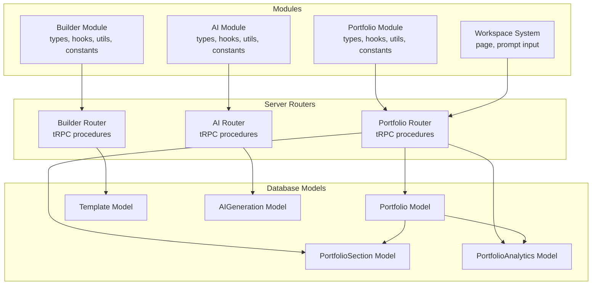
```mermaid
graph TB
subgraph "Modules"
Portfolio["Portfolio Module<br/>types, hooks, utils, constants"]
Builder["Builder Module<br/>types, hooks, utils, constants"]
AI["AI Module<br/>types, hooks, utils, constants"]
Workspace["Workspace System<br/>page, prompt input"]
end
subgraph "Server Routers"
PortfolioRouter["Portfolio Router<br/>tRPC procedures"]
BuilderRouter["Builder Router<br/>tRPC procedures"]
AIRouter["AI Router<br/>tRPC procedures"]
end
subgraph "Database Models"
PortfolioModel["Portfolio Model"]
SectionModel["PortfolioSection Model"]
AnalyticsModel["PortfolioAnalytics Model"]
TemplateModel["Template Model"]
AIGenerationModel["AIGeneration Model"]
end
Portfolio --> PortfolioRouter
Builder --> BuilderRouter
AI --> AIRouter
Workspace --> PortfolioRouter
PortfolioRouter --> PortfolioModel
PortfolioRouter --> SectionModel
PortfolioRouter --> AnalyticsModel
BuilderRouter --> TemplateModel
AIRouter --> AIGenerationModel
PortfolioModel --> SectionModel
PortfolioModel --> AnalyticsModel
```

**Diagram sources**
- [modules/portfolio/index.ts](file://modules/portfolio/index.ts#L1-L14)
- [modules/builder/index.ts](file://modules/builder/index.ts#L1-L14)
- [modules/ai/index.ts](file://modules/ai/index.ts#L1-L14)
- [server/routers/portfolio.ts](file://server/routers/portfolio.ts#L1-L115)
- [server/routers/builder.ts](file://server/routers/builder.ts#L1-L156)
- [server/routers/ai.ts](file://server/routers/ai.ts#L1-L105)
- [prisma/schema.prisma](file://prisma/schema.prisma#L89-L146)

**Section sources**
- [modules/portfolio/index.ts](file://modules/portfolio/index.ts#L1-L14)
- [modules/builder/index.ts](file://modules/builder/index.ts#L1-L14)
- [modules/ai/index.ts](file://modules/ai/index.ts#L1-L14)

## Core Components
The portfolio management system consists of several interconnected components that work together to provide a seamless user experience.

### Portfolio Data Model
The portfolio system uses a relational model with clear separation between portfolio metadata, content sections, and analytics data.

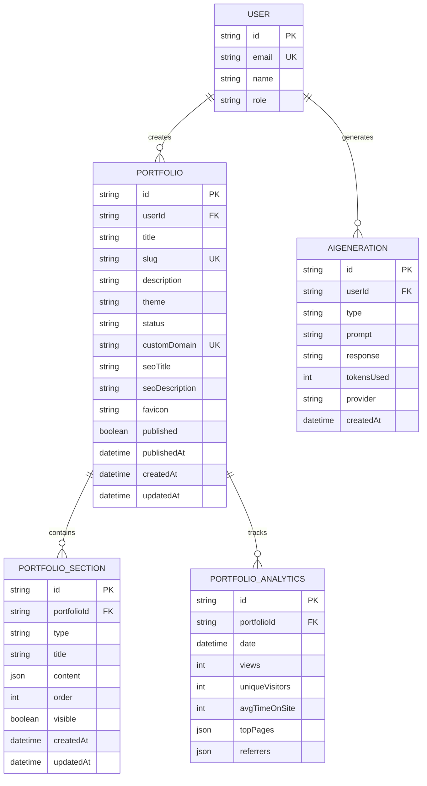
```mermaid
erDiagram
USER {
string id PK
string email UK
string name
string role
}
PORTFOLIO {
string id PK
string userId FK
string title
string slug UK
string description
string theme
string status
string customDomain UK
string seoTitle
string seoDescription
string favicon
boolean published
datetime publishedAt
datetime createdAt
datetime updatedAt
}
PORTFOLIO_SECTION {
string id PK
string portfolioId FK
string type
string title
json content
int order
boolean visible
datetime createdAt
datetime updatedAt
}
PORTFOLIO_ANALYTICS {
string id PK
string portfolioId FK
datetime date
int views
int uniqueVisitors
int avgTimeOnSite
json topPages
json referrers
}
AIGENERATION {
string id PK
string userId FK
string type
string prompt
string response
int tokensUsed
string provider
datetime createdAt
}
USER ||--o{ PORTFOLIO : creates
PORTFOLIO ||--o{ PORTFOLIO_SECTION : contains
PORTFOLIO ||--o{ PORTFOLIO_ANALYTICS : tracks
USER ||--o{ AIGENERATION : generates
```

**Diagram sources**
- [prisma/schema.prisma](file://prisma/schema.prisma#L89-L146)
- [prisma/schema.prisma](file://prisma/schema.prisma#L1-L230)

### Builder System Architecture
The builder module provides a flexible drag-and-drop interface with block-based content composition and template support.

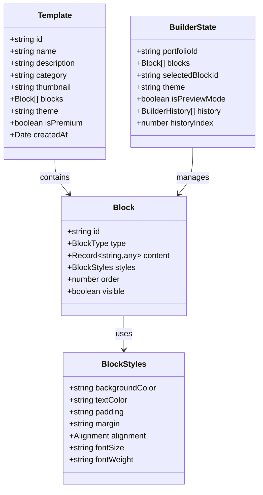
```mermaid
classDiagram
class Block {
+string id
+BlockType type
+Record~string,any~ content
+BlockStyles styles
+number order
+boolean visible
}
class BlockStyles {
+string backgroundColor
+string textColor
+string padding
+string margin
+Alignment alignment
+string fontSize
+string fontWeight
}
class Template {
+string id
+string name
+string description
+string category
+string thumbnail
+Block[] blocks
+string theme
+boolean isPremium
+Date createdAt
}
class BuilderState {
+string portfolioId
+Block[] blocks
+string selectedBlockId
+string theme
+boolean isPreviewMode
+BuilderHistory[] history
+number historyIndex
}
Block --> BlockStyles : uses
Template --> Block : contains
BuilderState --> Block : manages
```

**Diagram sources**
- [modules/builder/types.ts](file://modules/builder/types.ts#L20-L76)

**Section sources**
- [modules/portfolio/types.ts](file://modules/portfolio/types.ts#L19-L45)
- [modules/builder/types.ts](file://modules/builder/types.ts#L20-L76)
- [prisma/schema.prisma](file://prisma/schema.prisma#L115-L146)

## Architecture Overview
The system follows a layered architecture with clear separation between presentation, business logic, and data persistence.

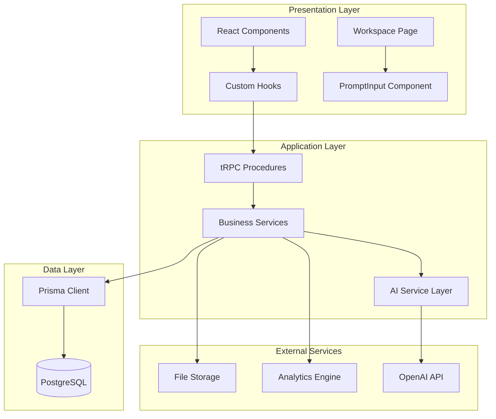
```mermaid
graph TB
subgraph "Presentation Layer"
UI["React Components"]
Hooks["Custom Hooks"]
Workspace["Workspace Page"]
PromptInput["PromptInput Component"]
end
subgraph "Application Layer"
TRPC["tRPC Procedures"]
Services["Business Services"]
AIService["AI Service Layer"]
end
subgraph "Data Layer"
Prisma["Prisma Client"]
Database[(PostgreSQL)]
end
subgraph "External Services"
Storage["File Storage"]
Analytics["Analytics Engine"]
OpenAI["OpenAI API"]
end
UI --> Hooks
Workspace --> PromptInput
Hooks --> TRPC
TRPC --> Services
Services --> AIService
Services --> Prisma
Prisma --> Database
Services --> Storage
Services --> Analytics
AIService --> OpenAI
```

**Diagram sources**
- [server/routers/portfolio.ts](file://server/routers/portfolio.ts#L1-L115)
- [server/routers/builder.ts](file://server/routers/builder.ts#L1-L156)
- [server/routers/ai.ts](file://server/routers/ai.ts#L1-L105)
- [server/services/ai.ts](file://server/services/ai.ts#L1-L242)
- [prisma/schema.prisma](file://prisma/schema.prisma#L1-L230)

## Detailed Component Analysis

### Portfolio Lifecycle Management
The portfolio lifecycle spans from creation to publishing and includes draft, published, and archived states.

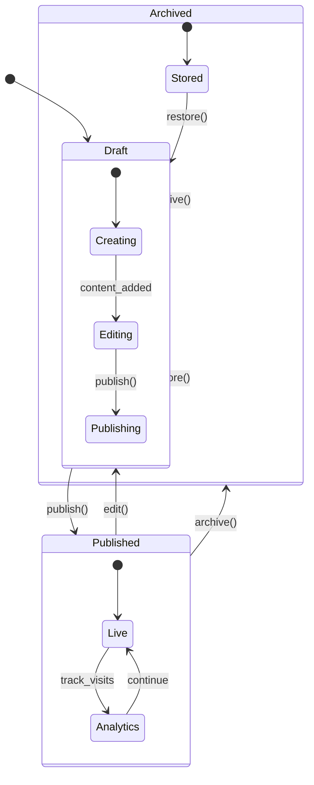
```mermaid
stateDiagram-v2
[*] --> Draft
Draft --> Published : publish()
Draft --> Archived : archive()
Published --> Draft : edit()
Published --> Archived : archive()
Archived --> Draft : restore()
state Draft {
[*] --> Creating
Creating --> Editing : content_added
Editing --> Publishing : publish()
}
state Published {
[*] --> Live
Live --> Analytics : track_visits
Analytics --> Live : continue
}
state Archived {
[*] --> Stored
Stored --> Draft : restore()
}
```

**Diagram sources**
- [modules/portfolio/types.ts](file://modules/portfolio/types.ts#L5-L9)
- [modules/portfolio/utils.ts](file://modules/portfolio/utils.ts#L21-L27)

#### Portfolio Creation Workflow
The portfolio creation process involves input validation, slug generation, and initial state setup.

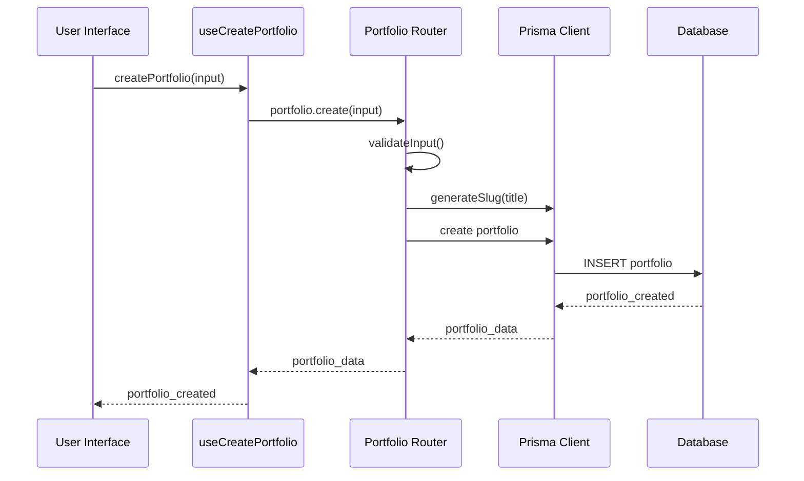
```mermaid
sequenceDiagram
participant User as User Interface
participant Hook as useCreatePortfolio
participant TRPC as Portfolio Router
participant Prisma as Prisma Client
participant DB as Database
User->>Hook : createPortfolio(input)
Hook->>TRPC : portfolio.create(input)
TRPC->>TRPC : validateInput()
TRPC->>Prisma : generateSlug(title)
TRPC->>Prisma : create portfolio
Prisma->>DB : INSERT portfolio
DB-->>Prisma : portfolio_created
Prisma-->>TRPC : portfolio_data
TRPC-->>Hook : portfolio_data
Hook-->>User : portfolio_created
```

**Diagram sources**
- [modules/portfolio/hooks.ts](file://modules/portfolio/hooks.ts#L33-L48)
- [server/routers/portfolio.ts](file://server/routers/portfolio.ts#L29-L54)

#### Publishing Process
The publishing workflow ensures portfolios meet requirements before going live.

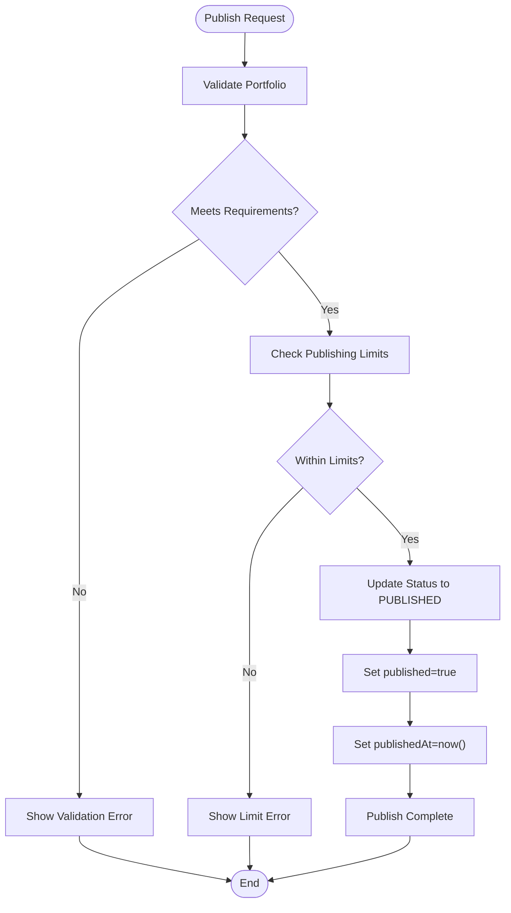
```mermaid
flowchart TD
Start([Publish Request]) --> Validate["Validate Portfolio"]
Validate --> Requirements{"Meets Requirements?"}
Requirements --> |No| ShowError["Show Validation Error"]
Requirements --> |Yes| CheckLimits["Check Publishing Limits"]
CheckLimits --> LimitsOK{"Within Limits?"}
LimitsOK --> |No| ShowLimitError["Show Limit Error"]
LimitsOK --> |Yes| UpdateStatus["Update Status to PUBLISHED"]
UpdateStatus --> SetPublished["Set published=true"]
SetPublished --> SetTimestamp["Set publishedAt=now()"]
SetTimestamp --> Success["Publish Complete"]
ShowError --> End([End])
ShowLimitError --> End
Success --> End
```

**Diagram sources**
- [modules/portfolio/utils.ts](file://modules/portfolio/utils.ts#L25-L27)
- [server/routers/portfolio.ts](file://server/routers/portfolio.ts#L96-L113)

**Section sources**
- [modules/portfolio/hooks.ts](file://modules/portfolio/hooks.ts#L33-L98)
- [modules/portfolio/utils.ts](file://modules/portfolio/utils.ts#L21-L54)
- [server/routers/portfolio.ts](file://server/routers/portfolio.ts#L29-L113)

### Section-Based Content Organization
The system organizes portfolio content into modular sections that can be individually managed and styled.

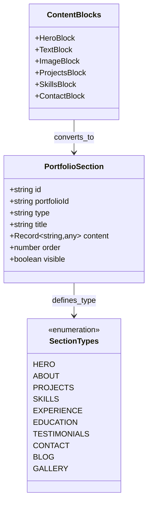
```mermaid
classDiagram
class PortfolioSection {
+string id
+string portfolioId
+string type
+string title
+Record~string,any~ content
+number order
+boolean visible
}
class SectionTypes {
<<enumeration>>
HERO
ABOUT
PROJECTS
SKILLS
EXPERIENCE
EDUCATION
TESTIMONIALS
CONTACT
BLOG
GALLERY
}
class ContentBlocks {
+HeroBlock
+TextBlock
+ImageBlock
+ProjectsBlock
+SkillsBlock
+ContactBlock
}
PortfolioSection --> SectionTypes : defines_type
ContentBlocks --> PortfolioSection : converts_to
```

**Diagram sources**
- [modules/portfolio/types.ts](file://modules/portfolio/types.ts#L37-L45)
- [modules/portfolio/constants.ts](file://modules/portfolio/constants.ts#L19-L30)

#### Section Management Operations
The builder module provides comprehensive operations for managing portfolio sections.

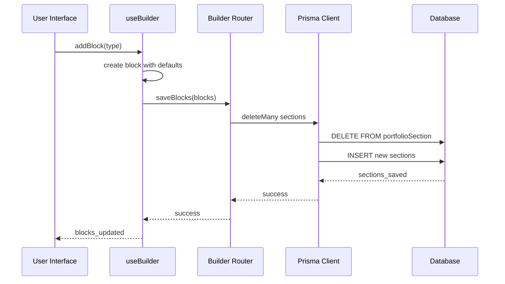
```mermaid
sequenceDiagram
participant User as User Interface
participant Builder as useBuilder
participant TRPC as Builder Router
participant Prisma as Prisma Client
participant DB as Database
User->>Builder : addBlock(type)
Builder->>Builder : create block with defaults
Builder->>TRPC : saveBlocks(blocks)
TRPC->>Prisma : deleteMany sections
Prisma->>DB : DELETE FROM portfolioSection
Prisma->>DB : INSERT new sections
DB-->>Prisma : sections_saved
Prisma-->>TRPC : success
TRPC-->>Builder : success
Builder-->>User : blocks_updated
```

**Diagram sources**
- [modules/builder/hooks.ts](file://modules/builder/hooks.ts#L11-L85)
- [server/routers/builder.ts](file://server/routers/builder.ts#L70-L119)

**Section sources**
- [modules/builder/hooks.ts](file://modules/builder/hooks.ts#L11-L117)
- [modules/builder/utils.ts](file://modules/builder/utils.ts#L45-L118)
- [server/routers/builder.ts](file://server/routers/builder.ts#L70-L155)

### Template System Implementation
The template system enables rapid portfolio creation through predefined layouts and content blocks.

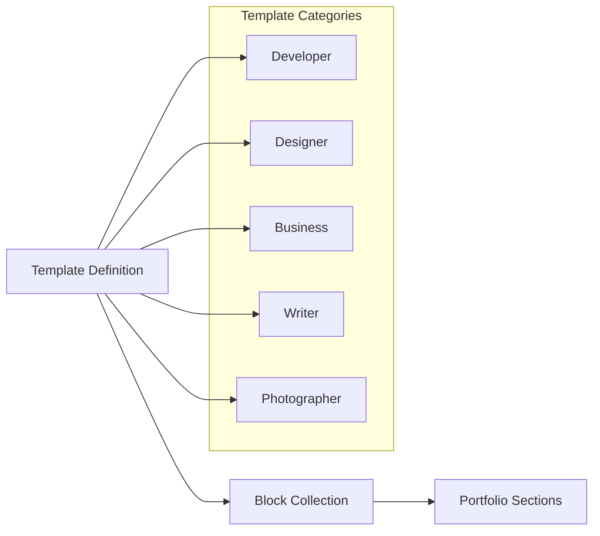
```mermaid
flowchart LR
Template["Template Definition"] --> Blocks["Block Collection"]
Blocks --> Portfolio["Portfolio Sections"]
subgraph "Template Categories"
Dev["Developer"]
Design["Designer"]
Business["Business"]
Writer["Writer"]
Photo["Photographer"]
end
Template --> Dev
Template --> Design
Template --> Business
Template --> Writer
Template --> Photo
```

**Diagram sources**
- [modules/builder/constants.ts](file://modules/builder/constants.ts#L29-L36)
- [prisma/schema.prisma](file://prisma/schema.prisma#L152-L166)

#### Template Application Process
The template application process transforms template blocks into portfolio sections.

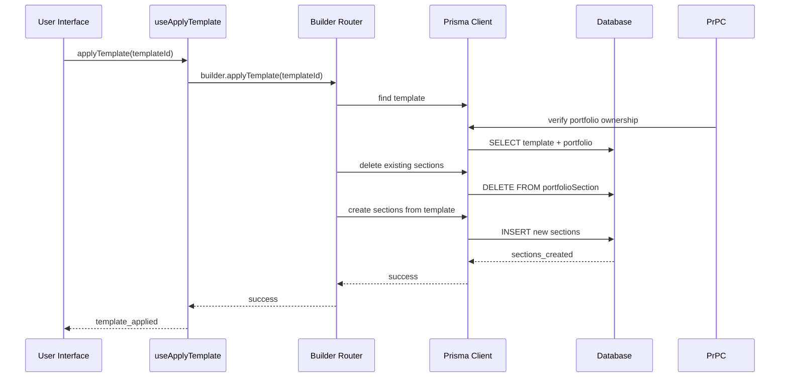
```mermaid
sequenceDiagram
participant User as User Interface
participant Hook as useApplyTemplate
participant TRPC as Builder Router
participant Prisma as Prisma Client
participant DB as Database
User->>Hook : applyTemplate(templateId)
Hook->>TRPC : builder.applyTemplate(templateId)
TRPC->>Prisma : find template
PrPC->>Prisma : verify portfolio ownership
Prisma->>DB : SELECT template + portfolio
TRPC->>Prisma : delete existing sections
Prisma->>DB : DELETE FROM portfolioSection
TRPC->>Prisma : create sections from template
Prisma->>DB : INSERT new sections
DB-->>Prisma : sections_created
Prisma-->>TRPC : success
TRPC-->>Hook : success
Hook-->>User : template_applied
```

**Diagram sources**
- [modules/builder/hooks.ts](file://modules/builder/hooks.ts#L96-L105)
- [server/routers/builder.ts](file://server/routers/builder.ts#L17-L68)

**Section sources**
- [modules/builder/constants.ts](file://modules/builder/constants.ts#L5-L41)
- [modules/builder/utils.ts](file://modules/builder/utils.ts#L7-L118)
- [server/routers/builder.ts](file://server/routers/builder.ts#L17-L155)

### Permission Model and User Relationships
The system implements a clear permission model ensuring users can only access their own portfolios.

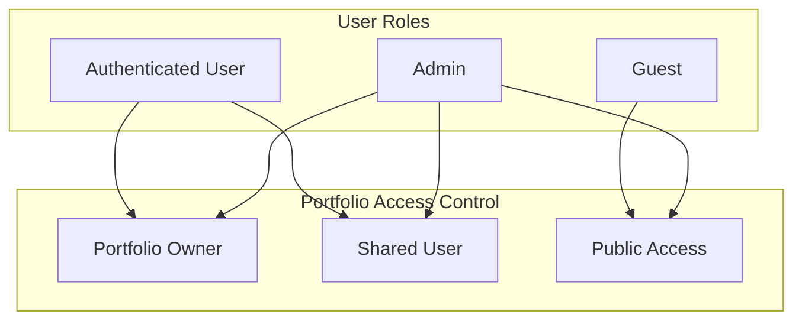
```mermaid
graph TB
subgraph "User Roles"
Guest["Guest"]
User["Authenticated User"]
Admin["Admin"]
end
subgraph "Portfolio Access Control"
Owner["Portfolio Owner"]
SharedUser["Shared User"]
Public["Public Access"]
end
User --> Owner
User --> SharedUser
Guest --> Public
Admin --> Owner
Admin --> SharedUser
Admin --> Public
```

**Diagram sources**
- [prisma/schema.prisma](file://prisma/schema.prisma#L17-L36)
- [server/routers/portfolio.ts](file://server/routers/portfolio.ts#L6-L27)

**Section sources**
- [prisma/schema.prisma](file://prisma/schema.prisma#L17-L36)
- [server/routers/portfolio.ts](file://server/routers/portfolio.ts#L6-L27)

### Analytics and Performance Tracking
The system tracks portfolio performance with comprehensive analytics data collection.

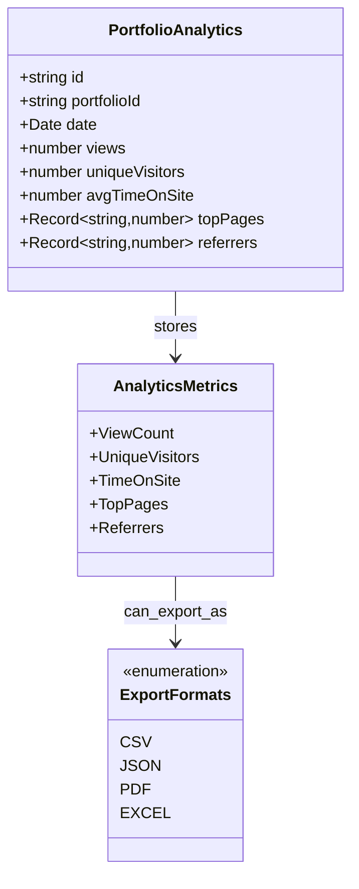
```mermaid
classDiagram
class PortfolioAnalytics {
+string id
+string portfolioId
+Date date
+number views
+number uniqueVisitors
+number avgTimeOnSite
+Record~string,number~ topPages
+Record~string,number~ referrers
}
class AnalyticsMetrics {
+ViewCount
+UniqueVisitors
+TimeOnSite
+TopPages
+Referrers
}
class ExportFormats {
<<enumeration>>
CSV
JSON
PDF
EXCEL
}
PortfolioAnalytics --> AnalyticsMetrics : stores
AnalyticsMetrics --> ExportFormats : can_export_as
```

**Diagram sources**
- [modules/portfolio/types.ts](file://modules/portfolio/types.ts#L65-L72)
- [prisma/schema.prisma](file://prisma/schema.prisma#L132-L146)

**Section sources**
- [modules/portfolio/types.ts](file://modules/portfolio/types.ts#L65-L72)
- [modules/portfolio/utils.ts](file://modules/portfolio/utils.ts#L46-L54)

## Workspace System

**Updated** The workspace system provides an integrated environment for creating and managing portfolios with AI assistance.

### Workspace Page Architecture
The workspace page serves as the central hub for portfolio creation, featuring a modern dark theme with gradient accents and responsive design.

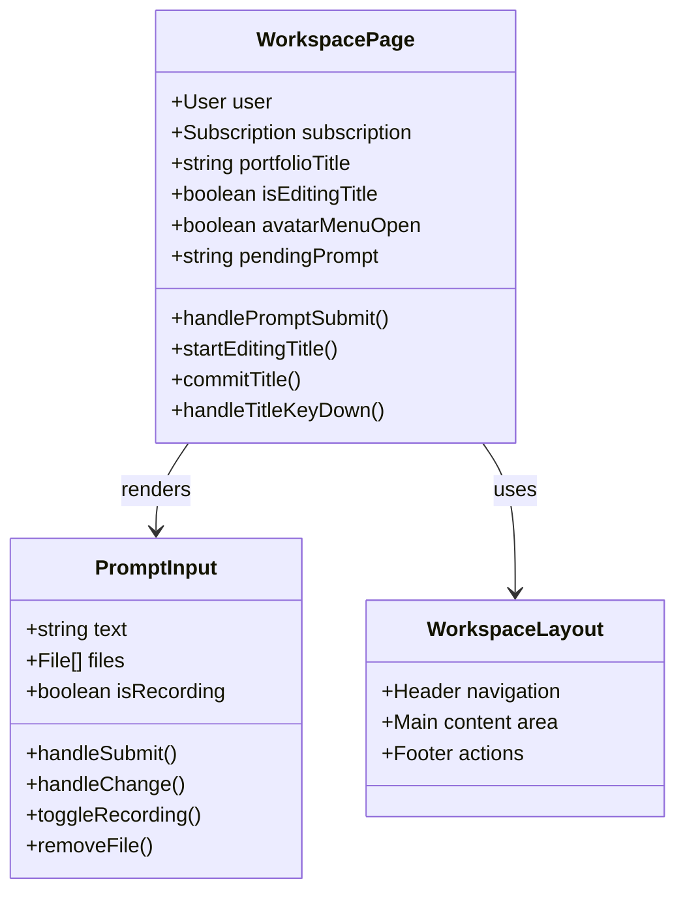
```mermaid
classDiagram
class WorkspacePage {
+User user
+Subscription subscription
+string portfolioTitle
+boolean isEditingTitle
+boolean avatarMenuOpen
+string pendingPrompt
+handlePromptSubmit()
+startEditingTitle()
+commitTitle()
+handleTitleKeyDown()
}
class PromptInput {
+string text
+File[] files
+boolean isRecording
+handleSubmit()
+handleChange()
+toggleRecording()
+removeFile()
}
class WorkspaceLayout {
+Header navigation
+Main content area
+Footer actions
}
WorkspacePage --> PromptInput : renders
WorkspacePage --> WorkspaceLayout : uses
```

**Diagram sources**
- [app/workspace/page.tsx](file://app/workspace/page.tsx#L10-L333)
- [components/workspace/PromptInput.tsx](file://components/workspace/PromptInput.tsx#L78-L426)

#### Prompt Input Component Features
The PromptInput component provides a comprehensive interface for AI-powered portfolio generation with multiple input methods.

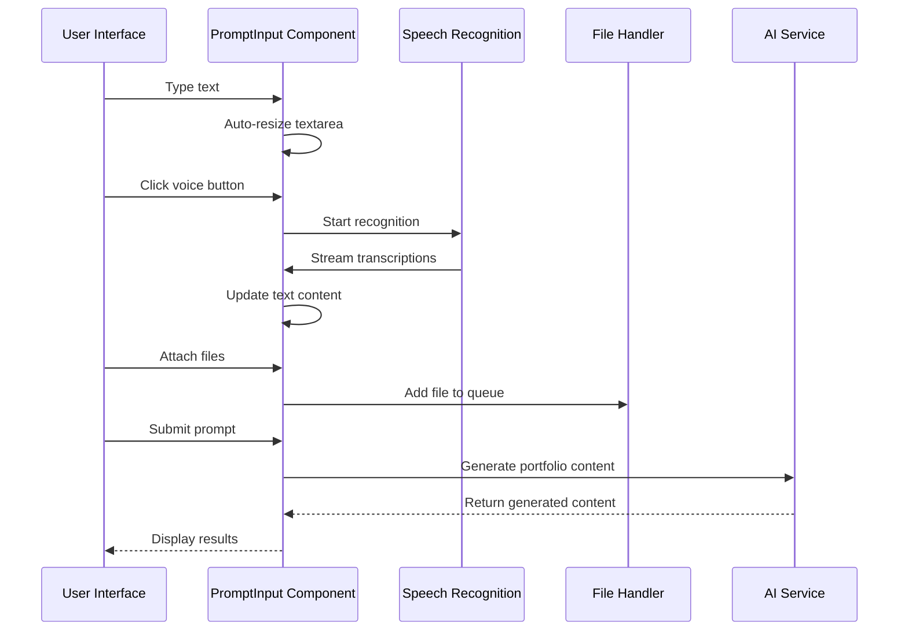
```mermaid
sequenceDiagram
participant User as User Interface
participant PromptInput as PromptInput Component
participant SpeechRec as Speech Recognition
participant FileHandler as File Handler
participant AIEngine as AI Service
User->>PromptInput : Type text
PromptInput->>PromptInput : Auto-resize textarea
User->>PromptInput : Click voice button
PromptInput->>SpeechRec : Start recognition
SpeechRec->>PromptInput : Stream transcriptions
PromptInput->>PromptInput : Update text content
User->>PromptInput : Attach files
PromptInput->>FileHandler : Add file to queue
User->>PromptInput : Submit prompt
PromptInput->>AIEngine : Generate portfolio content
AIEngine-->>PromptInput : Return generated content
PromptInput-->>User : Display results
```

**Diagram sources**
- [components/workspace/PromptInput.tsx](file://components/workspace/PromptInput.tsx#L148-L225)
- [app/workspace/page.tsx](file://app/workspace/page.tsx#L77-L84)

**Section sources**
- [app/workspace/page.tsx](file://app/workspace/page.tsx#L10-L333)
- [components/workspace/PromptInput.tsx](file://components/workspace/PromptInput.tsx#L78-L426)

### Workspace Navigation and Controls
The workspace features a comprehensive navigation system with user profile management, subscription status display, and portfolio controls.

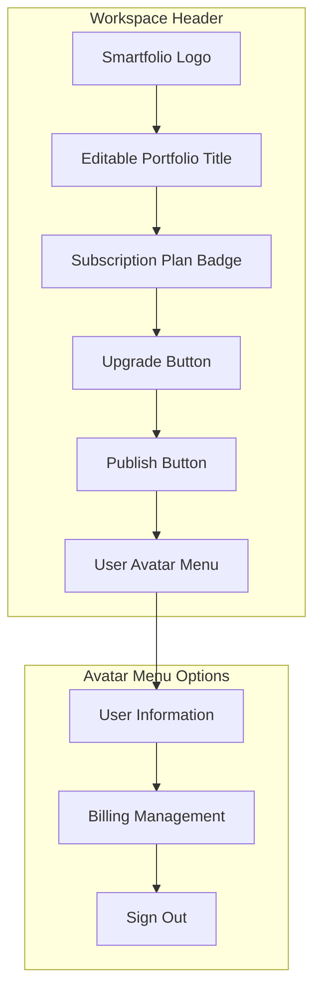
```mermaid
graph TB
subgraph "Workspace Header"
Logo["Smartfolio Logo"]
Title["Editable Portfolio Title"]
Plan["Subscription Plan Badge"]
Upgrade["Upgrade Button"]
Publish["Publish Button"]
Avatar["User Avatar Menu"]
end
subgraph "Avatar Menu Options"
UserInfo["User Information"]
Billing["Billing Management"]
SignOut["Sign Out"]
end
Logo --> Title
Title --> Plan
Plan --> Upgrade
Upgrade --> Publish
Publish --> Avatar
Avatar --> UserInfo
UserInfo --> Billing
Billing --> SignOut
```

**Diagram sources**
- [app/workspace/page.tsx](file://app/workspace/page.tsx#L101-L277)

**Section sources**
- [app/workspace/page.tsx](file://app/workspace/page.tsx#L101-L277)

## AI-Powered Portfolio Generation

**Updated** The AI module provides comprehensive content generation capabilities for portfolio creation, including portfolio content, project descriptions, and SEO optimization.

### AI Service Architecture
The AI service layer integrates with external AI providers to generate high-quality portfolio content automatically.

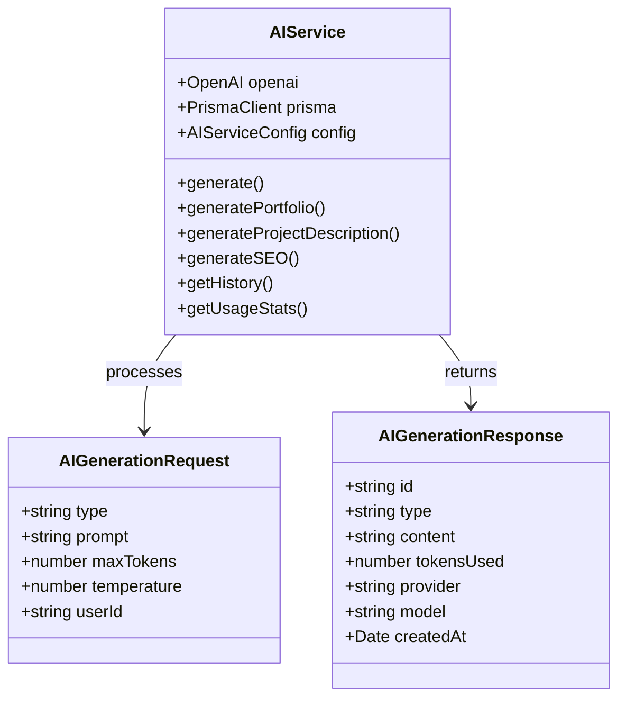
```mermaid
classDiagram
class AIService {
+OpenAI openai
+PrismaClient prisma
+AIServiceConfig config
+generate()
+generatePortfolio()
+generateProjectDescription()
+generateSEO()
+getHistory()
+getUsageStats()
}
class AIGenerationRequest {
+string type
+string prompt
+number maxTokens
+number temperature
+string userId
}
class AIGenerationResponse {
+string id
+string type
+string content
+number tokensUsed
+string provider
+string model
+Date createdAt
}
AIService --> AIGenerationRequest : processes
AIService --> AIGenerationResponse : returns
```

**Diagram sources**
- [server/services/ai.ts](file://server/services/ai.ts#L28-L242)
- [modules/ai/types.ts](file://modules/ai/types.ts#L20-L35)

#### AI Generation Types and Capabilities
The AI system supports multiple generation types with specialized prompts and formatting.

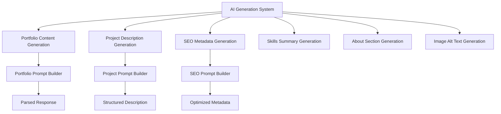
```mermaid
flowchart TD
AIGeneration["AI Generation System"] --> PortfolioContent["Portfolio Content Generation"]
AIGeneration --> ProjectDescription["Project Description Generation"]
AIGeneration --> SEO["SEO Metadata Generation"]
AIGeneration --> SkillsSummary["Skills Summary Generation"]
AIGeneration --> AboutSection["About Section Generation"]
AIGeneration --> ImageAltText["Image Alt Text Generation"]
PortfolioContent --> PortfolioPrompt["Portfolio Prompt Builder"]
ProjectDescription --> ProjectPrompt["Project Prompt Builder"]
SEO --> SEOPrompt["SEO Prompt Builder"]
PortfolioPrompt --> PortfolioResponse["Parsed Response"]
ProjectPrompt --> ProjectResponse["Structured Description"]
SEOPrompt --> SEOResponse["Optimized Metadata"]
```

**Diagram sources**
- [modules/ai/types.ts](file://modules/ai/types.ts#L11-L18)
- [modules/ai/utils.ts](file://modules/ai/utils.ts#L46-L103)

#### AI Usage and Token Management
The system tracks AI usage with tier-based limits and provides cost estimation capabilities.

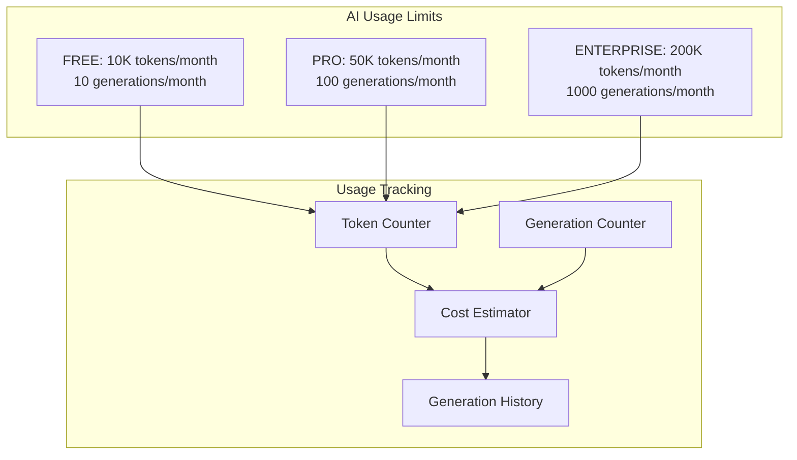
```mermaid
graph TB
subgraph "AI Usage Limits"
FreeTier["FREE: 10K tokens/month<br/>10 generations/month"]
ProTier["PRO: 50K tokens/month<br/>100 generations/month"]
EnterpriseTier["ENTERPRISE: 200K tokens/month<br/>1000 generations/month"]
end
subgraph "Usage Tracking"
TokenCounter["Token Counter"]
GenerationCounter["Generation Counter"]
CostEstimator["Cost Estimator"]
History["Generation History"]
end
FreeTier --> TokenCounter
ProTier --> TokenCounter
EnterpriseTier --> TokenCounter
TokenCounter --> CostEstimator
GenerationCounter --> CostEstimator
CostEstimator --> History
```

**Diagram sources**
- [modules/ai/constants.ts](file://modules/ai/constants.ts#L20-L30)
- [modules/ai/utils.ts](file://modules/ai/utils.ts#L17-L26)

**Section sources**
- [modules/ai/hooks.ts](file://modules/ai/hooks.ts#L10-L76)
- [modules/ai/types.ts](file://modules/ai/types.ts#L1-L69)
- [modules/ai/utils.ts](file://modules/ai/utils.ts#L1-L104)
- [modules/ai/constants.ts](file://modules/ai/constants.ts#L1-L41)
- [server/routers/ai.ts](file://server/routers/ai.ts#L1-L105)
- [server/services/ai.ts](file://server/services/ai.ts#L1-L242)

### AI Integration with Workspace System
The workspace system seamlessly integrates AI generation capabilities into the portfolio creation workflow.

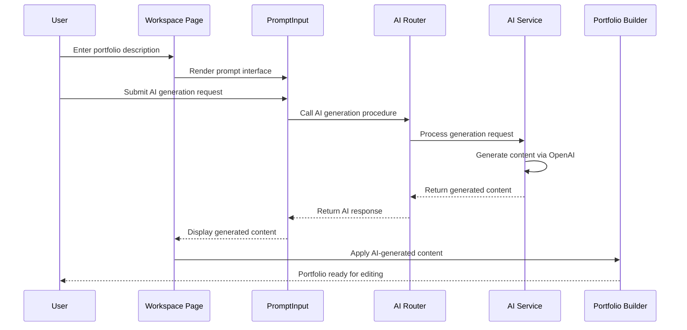
```mermaid
sequenceDiagram
participant User as User
participant Workspace as Workspace Page
participant PromptInput as PromptInput
participant AIRouter as AI Router
participant AIService as AI Service
participant PortfolioBuilder as Portfolio Builder
User->>Workspace : Enter portfolio description
Workspace->>PromptInput : Render prompt interface
User->>PromptInput : Submit AI generation request
PromptInput->>AIRouter : Call AI generation procedure
AIRouter->>AIService : Process generation request
AIService->>AIService : Generate content via OpenAI
AIService-->>AIRouter : Return generated content
AIRouter-->>PromptInput : Return AI response
PromptInput-->>Workspace : Display generated content
Workspace->>PortfolioBuilder : Apply AI-generated content
PortfolioBuilder-->>User : Portfolio ready for editing
```

**Diagram sources**
- [app/workspace/page.tsx](file://app/workspace/page.tsx#L77-L84)
- [server/routers/ai.ts](file://server/routers/ai.ts#L22-L52)
- [server/services/ai.ts](file://server/services/ai.ts#L89-L123)

**Section sources**
- [app/workspace/page.tsx](file://app/workspace/page.tsx#L77-L84)
- [server/routers/ai.ts](file://server/routers/ai.ts#L22-L52)
- [server/services/ai.ts](file://server/services/ai.ts#L89-L123)

## Dependency Analysis
The portfolio system exhibits strong modularity with clear dependency boundaries and minimal coupling between components.

```mermaid
graph TB
subgraph "Portfolio Module Dependencies"
PortfolioTypes["types.ts"]
PortfolioHooks["hooks.ts"]
PortfolioUtils["utils.ts"]
PortfolioConstants["constants.ts"]
end
subgraph "Builder Module Dependencies"
BuilderTypes["types.ts"]
BuilderHooks["hooks.ts"]
BuilderUtils["utils.ts"]
BuilderConstants["constants.ts"]
end
subgraph "AI Module Dependencies"
AITypes["types.ts"]
AIHooks["hooks.ts"]
AIUtils["utils.ts"]
AIConstants["constants.ts"]
end
subgraph "Workspace Dependencies"
WorkspacePage["workspace/page.tsx"]
PromptInput["PromptInput.tsx"]
end
subgraph "Server Dependencies"
PortfolioRouter["server/routers/portfolio.ts"]
BuilderRouter["server/routers/builder.ts"]
AIRouter["server/routers/ai.ts"]
PrismaSchema["prisma/schema.prisma"]
AIService["server/services/ai.ts"]
end
PortfolioHooks --> PortfolioRouter
BuilderHooks --> BuilderRouter
AIHooks --> AIRouter
WorkspacePage --> PortfolioRouter
PromptInput --> AIRouter
PortfolioRouter --> PrismaSchema
BuilderRouter --> PrismaSchema
AIRouter --> AIService
PortfolioUtils --> PortfolioTypes
BuilderUtils --> BuilderTypes
AIUtils --> AITypes
```

**Diagram sources**
- [modules/portfolio/index.ts](file://modules/portfolio/index.ts#L10-L14)
- [modules/builder/index.ts](file://modules/builder/index.ts#L10-L14)
- [modules/ai/index.ts](file://modules/ai/index.ts#L10-L14)
- [app/workspace/page.tsx](file://app/workspace/page.tsx#L1-L333)
- [components/workspace/PromptInput.tsx](file://components/workspace/PromptInput.tsx#L1-L426)
- [server/routers/portfolio.ts](file://server/routers/portfolio.ts#L1-L115)
- [server/routers/builder.ts](file://server/routers/builder.ts#L1-L156)
- [server/routers/ai.ts](file://server/routers/ai.ts#L1-L105)
- [server/services/ai.ts](file://server/services/ai.ts#L1-L242)
- [prisma/schema.prisma](file://prisma/schema.prisma#L1-L230)

**Section sources**
- [modules/portfolio/index.ts](file://modules/portfolio/index.ts#L10-L14)
- [modules/builder/index.ts](file://modules/builder/index.ts#L10-L14)
- [modules/ai/index.ts](file://modules/ai/index.ts#L10-L14)

## Performance Considerations
The portfolio system is designed with several performance optimizations:

- **Database Indexing**: Strategic indexing on frequently queried fields (userId, slug, status)
- **Query Optimization**: Efficient queries with proper filtering and ordering
- **Caching Strategy**: Automatic query invalidation after mutations
- **Lazy Loading**: Conditional loading of portfolio data
- **Export Optimization**: Efficient JSON serialization for block exports
- **AI Token Management**: Rate limiting and usage tracking for AI generation
- **Speech Recognition Optimization**: Proper cleanup and resource management for voice input

**Updated** The AI system includes token limit enforcement and cost estimation to prevent excessive usage and provide transparent pricing information.

## Troubleshooting Guide
Common issues and their solutions:

### Portfolio Creation Issues
- **Slug Validation Errors**: Ensure slug meets length requirements (3-100 characters)
- **Title Length Exceeded**: Portfolio titles are limited to 100 characters
- **Permission Denied**: Verify user authentication and ownership verification

### Publishing Problems
- **Validation Failures**: Check portfolio has title and meets minimum requirements
- **Domain Conflicts**: Verify custom domain uniqueness if set
- **Rate Limiting**: Respect automatic save intervals (30 seconds)

### Builder Functionality
- **Block Limit Reached**: Maximum 50 blocks per portfolio
- **Template Application**: Ensure template exists and portfolio belongs to user
- **Drag-and-Drop Issues**: Verify browser compatibility and JavaScript enabled

### AI Generation Issues
- **API Key Configuration**: Ensure OpenAI API key is properly configured
- **Token Limits Exceeded**: Monitor usage against subscription tier limits
- **Generation Failures**: Check network connectivity and retry failed requests
- **Voice Recognition Not Working**: Verify browser support for SpeechRecognition API

**Updated** AI-related troubleshooting includes checking API configuration, monitoring usage limits, and verifying external service connectivity.

**Section sources**
- [modules/portfolio/utils.ts](file://modules/portfolio/utils.ts#L42-L44)
- [modules/builder/constants.ts](file://modules/builder/constants.ts#L38-L40)
- [modules/builder/hooks.ts](file://modules/builder/hooks.ts#L96-L105)
- [server/services/ai.ts](file://server/services/ai.ts#L83-L86)

## Conclusion
Smartfolio provides a comprehensive portfolio management solution with robust architecture, flexible content modeling, and powerful customization capabilities. The modular design enables easy extension and maintenance, while the tRPC integration ensures type-safe communication between frontend and backend. The system's focus on user experience, performance, and scalability makes it suitable for both individual creators and professional use cases.

**Updated** The addition of the workspace system with AI-powered portfolio generation significantly enhances the platform's capabilities, enabling users to create sophisticated portfolios through natural language prompts with voice input and file attachments. The AI integration provides intelligent content generation while maintaining user control over the final output.

## Appendices

### Practical Examples

#### Portfolio CRUD Operations
- **Create**: Use `useCreatePortfolio()` hook with title, optional slug, and theme
- **Read**: Use `usePortfolios()` for list or `usePortfolio(id)` for single portfolio
- **Update**: Use `useUpdatePortfolio()` with partial updates
- **Delete**: Use `useDeletePortfolio()` with portfolio ID

#### Section Management
- **Add Block**: Call `addBlock(BlockType)` with desired section type
- **Reorder**: Use `reorderBlocks(startIndex, endIndex)`
- **Update Content**: Call `updateBlock(blockId, updates)`
- **Delete Section**: Use `deleteBlock(blockId)`

#### Content Editing Workflows
- **Template Application**: Use `applyTemplate(templateId)` to transform blocks
- **Auto-save**: Automatic saving every 30 seconds during editing
- **Export/Import**: Use `exportBlocks()` and `importBlocks()` for backup

#### AI-Powered Portfolio Creation
- **Natural Language Input**: Use PromptInput component to describe portfolio requirements
- **Voice Generation**: Enable speech recognition for hands-free content creation
- **File Attachments**: Upload supporting documents for AI to reference
- **Content Review**: Review and refine AI-generated content before publishing

**Updated** AI generation workflows include prompt engineering best practices, content refinement techniques, and integration with the traditional builder interface.

### Extending the System

#### Adding New Section Types
1. Extend `SECTION_TYPES` enumeration in constants
2. Add default content in `getDefaultBlockContent()`
3. Update builder availability in `AVAILABLE_BLOCKS`
4. Add validation rules in server-side input schemas

#### Custom Domain Support
- Configure DNS records for custom domains
- Update portfolio with customDomain field
- Implement SSL certificate management
- Set up reverse proxy routing

#### Analytics Enhancement
- Extend `PortfolioAnalytics` interface for new metrics
- Add export formats in analytics utilities
- Implement real-time tracking capabilities
- Add dashboard visualization components

#### AI System Extensions
- **New Generation Types**: Add new AI generation types in AIGenerationType enum
- **Provider Integration**: Extend AIService to support additional AI providers
- **Prompt Templates**: Add new prompt templates for specialized content generation
- **Usage Analytics**: Enhance usage tracking with detailed generation metrics

**Updated** AI system extensions include new generation types, provider integrations, and enhanced analytics capabilities.

**Section sources**
- [modules/portfolio/constants.ts](file://modules/portfolio/constants.ts#L19-L36)
- [modules/builder/utils.ts](file://modules/builder/utils.ts#L45-L98)
- [modules/builder/constants.ts](file://modules/builder/constants.ts#L14-L27)
- [modules/ai/types.ts](file://modules/ai/types.ts#L11-L18)
- [modules/ai/constants.ts](file://modules/ai/constants.ts#L5-L41)