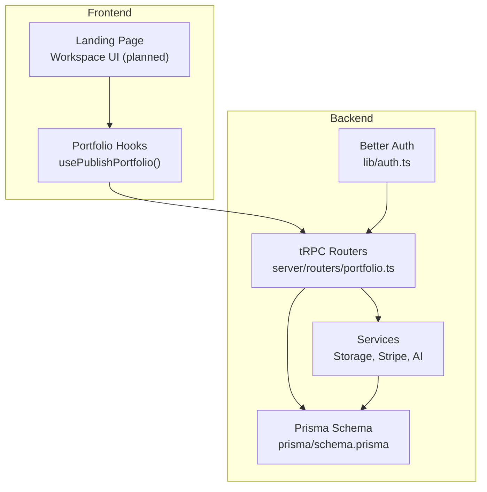
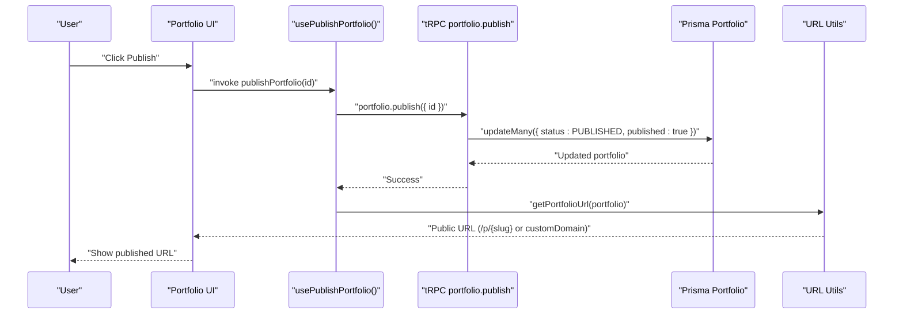
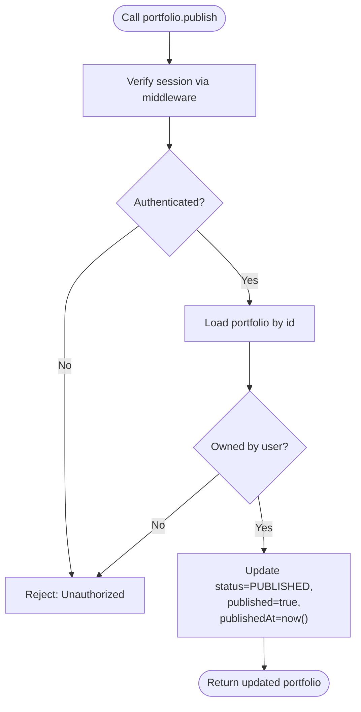
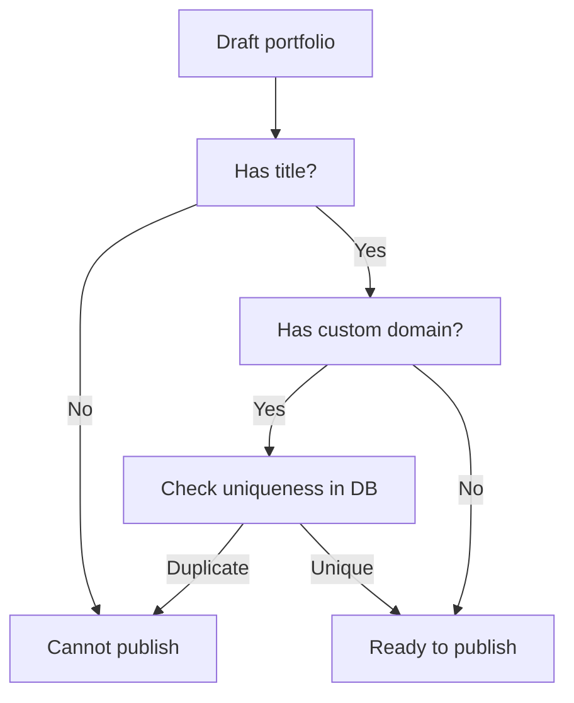
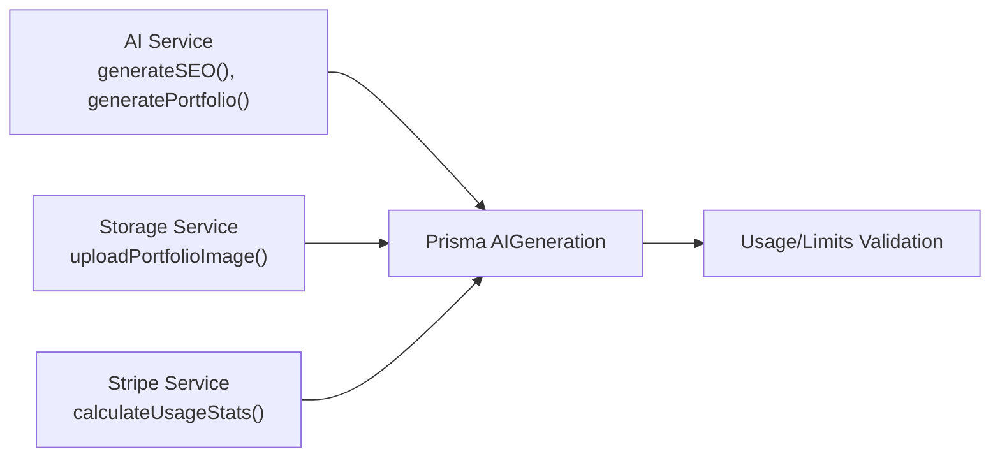
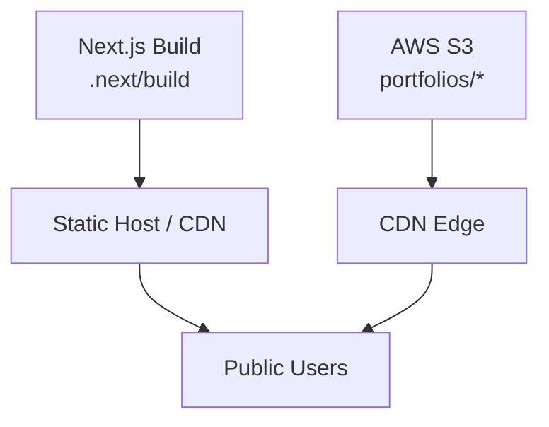
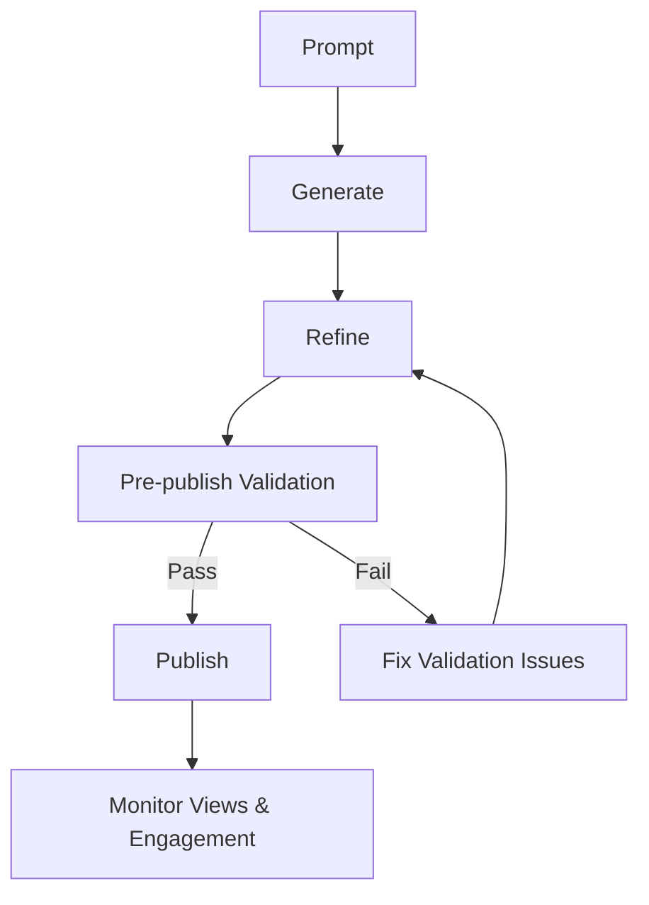
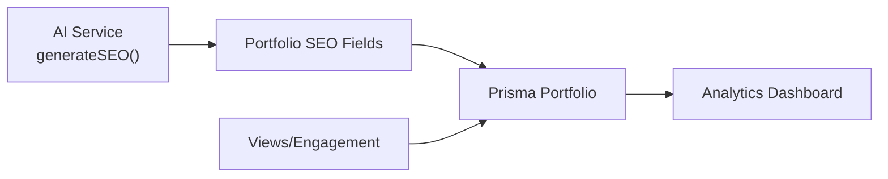
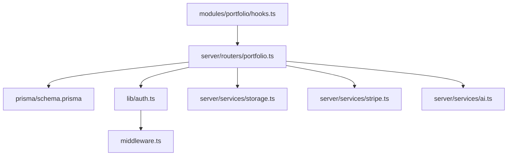

# Publishing and Deployment Process

<cite>
**Referenced Files in This Document**
- [README.md](file://README.md)
- [SETUP.md](file://SETUP.md)
- [package.json](file://package.json)
- [next.config.ts](file://next.config.ts)
- [IMPLEMENTATION_SUMMARY.md](file://IMPLEMENTATION_SUMMARY.md)
- [PROJECT-SUMMARY.md](file://PROJECT-SUMMARY.md)
- [middleware.ts](file://middleware.ts)
- [lib/auth.ts](file://lib/auth.ts)
- [lib/auth-client.ts](file://lib/auth-client.ts)
- [modules/portfolio/hooks.ts](file://modules/portfolio/hooks.ts)
- [modules/portfolio/utils.ts](file://modules/portfolio/utils.ts)
- [server/routers/portfolio.ts](file://server/routers/portfolio.ts)
- [server/services/storage.ts](file://server/services/storage.ts)
- [server/services/stripe.ts](file://server/services/stripe.ts)
- [server/services/ai.ts](file://server/services/ai.ts)
- [prisma/schema.prisma](file://prisma/schema.prisma)
</cite>

## Table of Contents
1. [Introduction](#introduction)
2. [Project Structure](#project-structure)
3. [Core Components](#core-components)
4. [Architecture Overview](#architecture-overview)
5. [Detailed Component Analysis](#detailed-component-analysis)
6. [Dependency Analysis](#dependency-analysis)
7. [Performance Considerations](#performance-considerations)
8. [Troubleshooting Guide](#troubleshooting-guide)
9. [Conclusion](#conclusion)
10. [Appendices](#appendices)

## Introduction
This document explains the publishing and deployment workflow for SmartFolio, an AI-native portfolio generator built with Next.js 16, tRPC, Prisma, and Better Auth. It covers the publishing process, pre-publish validation checks, quality assurance steps, deployment options (including custom domains and CDN), the publishing pipeline, automated testing, rollback procedures, preview and staging strategies, production deployment, analytics and SEO integration, and performance monitoring.

## Project Structure
SmartFolio follows a modular, feature-driven structure with clear separation between frontend, backend, services, and shared modules. The publishing workflow centers around portfolio creation, refinement, and publication via tRPC procedures and React hooks.

**Diagram sources**
- [SETUP.md](file://SETUP.md#L37-L85)
- [modules/portfolio/hooks.ts](file://modules/portfolio/hooks.ts#L84-L98)
- [server/routers/portfolio.ts](file://server/routers/portfolio.ts#L1-L115)
- [server/services/storage.ts](file://server/services/storage.ts#L1-L170)
- [server/services/stripe.ts](file://server/services/stripe.ts#L1-L294)
- [server/services/ai.ts](file://server/services/ai.ts#L1-L242)
- [lib/auth.ts](file://lib/auth.ts#L1-L25)
- [prisma/schema.prisma](file://prisma/schema.prisma#L1-L230)

**Section sources**
- [SETUP.md](file://SETUP.md#L37-L85)

## Core Components
- Portfolio publishing API: tRPC router exposes a publish procedure that transitions a portfolio from draft to published state.
- Portfolio hooks: React hooks encapsulate mutations for publishing and invalidate queries upon success.
- Utilities: Slug generation, URL resolution, validation, and status helpers.
- Middleware and auth: Route protection and session validation ensure only authenticated users can publish.
- Storage, billing, and AI services: Underpin content uploads, subscription checks, and content generation used during publishing workflows.

**Section sources**
- [server/routers/portfolio.ts](file://server/routers/portfolio.ts#L96-L114)
- [modules/portfolio/hooks.ts](file://modules/portfolio/hooks.ts#L84-L98)
- [modules/portfolio/utils.ts](file://modules/portfolio/utils.ts#L7-L54)
- [middleware.ts](file://middleware.ts#L1-L95)
- [lib/auth.ts](file://lib/auth.ts#L1-L25)
- [server/services/storage.ts](file://server/services/storage.ts#L1-L170)
- [server/services/stripe.ts](file://server/services/stripe.ts#L1-L294)
- [server/services/ai.ts](file://server/services/ai.ts#L1-L242)

## Architecture Overview
The publishing workflow integrates frontend hooks, tRPC procedures, backend services, and database persistence. Authentication middleware protects routes requiring session validation.

**Diagram sources**
- [modules/portfolio/hooks.ts](file://modules/portfolio/hooks.ts#L84-L98)
- [server/routers/portfolio.ts](file://server/routers/portfolio.ts#L96-L114)
- [modules/portfolio/utils.ts](file://modules/portfolio/utils.ts#L14-L19)
- [prisma/schema.prisma](file://prisma/schema.prisma#L89-L113)

## Detailed Component Analysis

### Publishing API and Validation
- Protected procedure: Only authenticated users can publish their own portfolios.
- Validation: Ensures the portfolio belongs to the current user before updating.
- State transition: Sets status to PUBLISHED and marks published flag true with a published timestamp.

**Diagram sources**
- [server/routers/portfolio.ts](file://server/routers/portfolio.ts#L96-L114)
- [middleware.ts](file://middleware.ts#L44-L81)

**Section sources**
- [server/routers/portfolio.ts](file://server/routers/portfolio.ts#L96-L114)
- [middleware.ts](file://middleware.ts#L44-L81)

### Pre-Publish Validation Checks
- Slug validation: Validates custom slugs meet length and character requirements.
- Title presence: Draft portfolios must have a non-empty title to be eligible for publishing.
- Domain availability: Custom domain uniqueness is enforced at the database level.

**Diagram sources**
- [modules/portfolio/utils.ts](file://modules/portfolio/utils.ts#L25-L27)
- [modules/portfolio/utils.ts](file://modules/portfolio/utils.ts#L42-L44)
- [prisma/schema.prisma](file://prisma/schema.prisma#L97-L97)

**Section sources**
- [modules/portfolio/utils.ts](file://modules/portfolio/utils.ts#L25-L27)
- [modules/portfolio/utils.ts](file://modules/portfolio/utils.ts#L42-L44)
- [prisma/schema.prisma](file://prisma/schema.prisma#L97-L97)

### Quality Assurance Steps
- Content generation: AI service generates SEO metadata and content used in publishing workflows.
- Storage validation: Uploaded images validated by type and size before publishing.
- Usage tracking: Limits enforced by billing service inform whether publishing is allowed under plan constraints.

**Diagram sources**
- [server/services/ai.ts](file://server/services/ai.ts#L150-L180)
- [server/services/storage.ts](file://server/services/storage.ts#L156-L169)
- [server/services/stripe.ts](file://server/services/stripe.ts#L132-L170)
- [prisma/schema.prisma](file://prisma/schema.prisma#L214-L229)

**Section sources**
- [server/services/ai.ts](file://server/services/ai.ts#L150-L180)
- [server/services/storage.ts](file://server/services/storage.ts#L156-L169)
- [server/services/stripe.ts](file://server/services/stripe.ts#L132-L170)
- [prisma/schema.prisma](file://prisma/schema.prisma#L214-L229)

### Deployment Options and CDN Integration
- Static export readiness: Next.js build artifacts indicate a static build environment suitable for static hosting.
- CDN-friendly assets: AWS S3 stores uploaded images; signed URLs enable controlled access.
- Custom domain configuration: Portfolio entity supports a unique custom domain; DNS and SSL are managed externally.

**Diagram sources**
- [next.config.ts](file://next.config.ts#L1-L8)
- [server/services/storage.ts](file://server/services/storage.ts#L36-L54)
- [prisma/schema.prisma](file://prisma/schema.prisma#L97-L97)

**Section sources**
- [next.config.ts](file://next.config.ts#L1-L8)
- [server/services/storage.ts](file://server/services/storage.ts#L36-L54)
- [prisma/schema.prisma](file://prisma/schema.prisma#L97-L97)

### Publishing Pipeline and Automated Testing
- Pipeline stages: Prompt → Generate → Refine → Publish.
- Automated testing: Unit tests for hooks and services, linting, and database migrations.
- Rollback procedures: Revert portfolio status to draft; unpublish by clearing published flag.

**Diagram sources**
- [PROJECT-SUMMARY.md](file://PROJECT-SUMMARY.md#L65-L72)
- [SETUP.md](file://SETUP.md#L199-L210)

**Section sources**
- [PROJECT-SUMMARY.md](file://PROJECT-SUMMARY.md#L65-L72)
- [SETUP.md](file://SETUP.md#L199-L210)

### Preview Environments, Staging, and Production
- Preview: Use draft state for iterative review; share internal links to portfolio workspace.
- Staging: Deploy to preview environments with isolated databases and S3 buckets; mirror production secrets with staging keys.
- Production: Deploy static build to CDN/host; configure custom domains and SSL certificates at the CDN/provider level.

**Section sources**
- [IMPLEMENTATION_SUMMARY.md](file://IMPLEMENTATION_SUMMARY.md#L172-L174)
- [README.md](file://README.md#L53-L57)

### Analytics Integration, SEO Optimization, and Performance Monitoring
- Analytics: Portfolio analytics model captures views, unique visitors, and engagement metrics.
- SEO: AI-generated SEO metadata (title, description, keywords) integrated into portfolio records.
- Performance: Monitor build sizes, asset delivery via CDN, and database query performance; track token usage and generation throughput.

**Diagram sources**
- [server/services/ai.ts](file://server/services/ai.ts#L150-L180)
- [prisma/schema.prisma](file://prisma/schema.prisma#L98-L99)
- [prisma/schema.prisma](file://prisma/schema.prisma#L132-L146)

**Section sources**
- [server/services/ai.ts](file://server/services/ai.ts#L150-L180)
- [prisma/schema.prisma](file://prisma/schema.prisma#L98-L99)
- [prisma/schema.prisma](file://prisma/schema.prisma#L132-L146)

## Dependency Analysis
The publishing workflow depends on authentication, tRPC, database, and external services.

**Diagram sources**
- [modules/portfolio/hooks.ts](file://modules/portfolio/hooks.ts#L1-L99)
- [server/routers/portfolio.ts](file://server/routers/portfolio.ts#L1-L115)
- [lib/auth.ts](file://lib/auth.ts#L1-L25)
- [middleware.ts](file://middleware.ts#L1-L95)
- [server/services/storage.ts](file://server/services/storage.ts#L1-L170)
- [server/services/stripe.ts](file://server/services/stripe.ts#L1-L294)
- [server/services/ai.ts](file://server/services/ai.ts#L1-L242)
- [prisma/schema.prisma](file://prisma/schema.prisma#L1-L230)

**Section sources**
- [modules/portfolio/hooks.ts](file://modules/portfolio/hooks.ts#L1-L99)
- [server/routers/portfolio.ts](file://server/routers/portfolio.ts#L1-L115)
- [lib/auth.ts](file://lib/auth.ts#L1-L25)
- [middleware.ts](file://middleware.ts#L1-L95)
- [server/services/storage.ts](file://server/services/storage.ts#L1-L170)
- [server/services/stripe.ts](file://server/services/stripe.ts#L1-L294)
- [server/services/ai.ts](file://server/services/ai.ts#L1-L242)
- [prisma/schema.prisma](file://prisma/schema.prisma#L1-L230)

## Performance Considerations
- Optimize build and static exports for faster cold starts.
- Cache frequently accessed portfolio data and leverage CDN for assets.
- Monitor database indexes and query plans for portfolio listing and publishing operations.
- Control AI token usage to avoid throttling and reduce latency.

## Troubleshooting Guide
Common publishing issues and resolutions:
- Unauthorized access: Ensure session validation passes; verify cookies and middleware redirects.
- Slug conflicts: Validate custom slug against uniqueness constraints; regenerate or choose another slug.
- Storage failures: Confirm S3 credentials and bucket permissions; check signed URL generation.
- Billing limits: Verify subscription status and usage stats; upgrade plan if necessary.
- Domain configuration: Confirm DNS records and SSL certificates for custom domains at the CDN/provider.

**Section sources**
- [middleware.ts](file://middleware.ts#L63-L78)
- [modules/portfolio/utils.ts](file://modules/portfolio/utils.ts#L42-L44)
- [server/services/storage.ts](file://server/services/storage.ts#L36-L54)
- [server/services/stripe.ts](file://server/services/stripe.ts#L132-L170)
- [prisma/schema.prisma](file://prisma/schema.prisma#L97-L97)

## Conclusion
SmartFolio’s publishing workflow is secure, modular, and extensible. By leveraging tRPC, Prisma, Better Auth, and external services, it supports robust pre-publish validation, quality checks, and scalable deployment. With proper preview/staging practices, CDN integration, and analytics/SEO enhancements, teams can confidently publish and monitor portfolios in production.

## Appendices
- Example publishing workflows:
  - Draft → Generate → Refine → Validate → Publish → Monitor
  - Use hooks to trigger publish; rely on router validation and middleware protection
- Error handling during deployment:
  - Validate environment variables before building
  - Use signed URLs for assets and enforce type/size checks
  - Monitor Stripe webhooks and AI generation errors
- Rollback procedures:
  - Revert portfolio status to draft
  - Unpublish by clearing published flag and timestamps

**Section sources**
- [PROJECT-SUMMARY.md](file://PROJECT-SUMMARY.md#L65-L72)
- [SETUP.md](file://SETUP.md#L199-L210)
- [server/routers/portfolio.ts](file://server/routers/portfolio.ts#L96-L114)
- [modules/portfolio/hooks.ts](file://modules/portfolio/hooks.ts#L84-L98)