# Section-Based Content Management

<cite>
**Referenced Files in This Document**
- [modules/builder/index.ts](file://modules/builder/index.ts)
- [modules/builder/types.ts](file://modules/builder/types.ts)
- [modules/builder/constants.ts](file://modules/builder/constants.ts)
- [modules/builder/hooks.ts](file://modules/builder/hooks.ts)
- [modules/builder/utils.ts](file://modules/builder/utils.ts)
- [server/routers/builder.ts](file://server/routers/builder.ts)
- [server/services/index.ts](file://server/services/index.ts)
- [prisma/schema.prisma](file://prisma/schema.prisma)
- [modules/portfolio/types.ts](file://modules/portfolio/types.ts)
- [modules/portfolio/hooks.ts](file://modules/portfolio/hooks.ts)
- [docs/IMPLEMENTATION-COMPLETE.md](file://docs/IMPLEMENTATION-COMPLETE.md)
</cite>

## Table of Contents
1. [Introduction](#introduction)
2. [Project Structure](#project-structure)
3. [Core Components](#core-components)
4. [Architecture Overview](#architecture-overview)
5. [Detailed Component Analysis](#detailed-component-analysis)
6. [Dependency Analysis](#dependency-analysis)
7. [Performance Considerations](#performance-considerations)
8. [Troubleshooting Guide](#troubleshooting-guide)
9. [Conclusion](#conclusion)
10. [Appendices](#appendices)

## Introduction
This document describes the section-based content management system used to build interactive portfolios. It covers the available section types, their properties and configuration, drag-and-drop reordering, hierarchical organization, templates and duplication, validation and persistence, and how permissions and visibility are enforced. The system is implemented with a frontend builder module and a backend tRPC router backed by Prisma models.

## Project Structure
The section management spans three layers:
- Frontend builder module: defines types, constants, hooks, and utilities for building and managing sections.
- Backend tRPC router: exposes queries and mutations to fetch, save, and apply templates for portfolio sections.
- Data layer: Prisma models define the persisted structure for portfolios, sections, and templates.

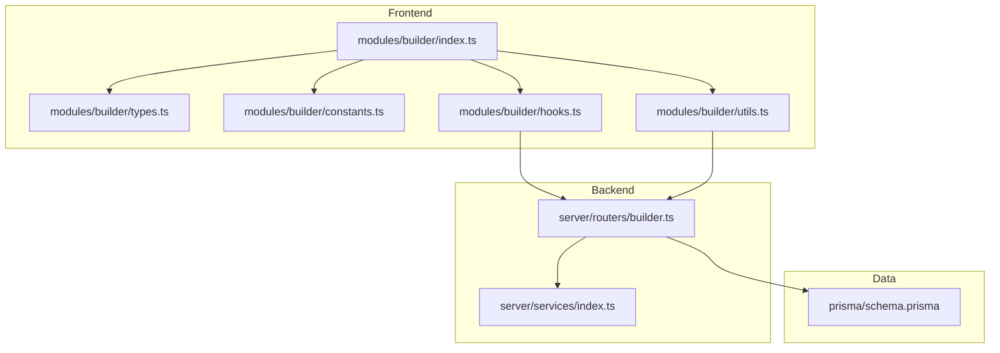

**Diagram sources**
- [modules/builder/index.ts](file://modules/builder/index.ts#L1-L14)
- [modules/builder/types.ts](file://modules/builder/types.ts#L1-L76)
- [modules/builder/constants.ts](file://modules/builder/constants.ts#L1-L41)
- [modules/builder/hooks.ts](file://modules/builder/hooks.ts#L1-L117)
- [modules/builder/utils.ts](file://modules/builder/utils.ts#L1-L119)
- [server/routers/builder.ts](file://server/routers/builder.ts#L1-L156)
- [server/services/index.ts](file://server/services/index.ts#L1-L118)
- [prisma/schema.prisma](file://prisma/schema.prisma#L115-L166)

**Section sources**
- [modules/builder/index.ts](file://modules/builder/index.ts#L1-L14)
- [modules/builder/types.ts](file://modules/builder/types.ts#L1-L76)
- [modules/builder/constants.ts](file://modules/builder/constants.ts#L1-L41)
- [modules/builder/hooks.ts](file://modules/builder/hooks.ts#L1-L117)
- [modules/builder/utils.ts](file://modules/builder/utils.ts#L1-L119)
- [server/routers/builder.ts](file://server/routers/builder.ts#L1-L156)
- [server/services/index.ts](file://server/services/index.ts#L1-L118)
- [prisma/schema.prisma](file://prisma/schema.prisma#L115-L166)

## Core Components
- Section types and categories: The builder defines a set of section types (for example, Hero, Text, Image, Gallery, Video, Skills, Timeline, Projects, Testimonials, Contact, CTA, Spacer) grouped into categories (Header, Content, Media, Portfolio, Social, Layout).
- Section model: Each section has an identifier, type, content payload, styles, ordering position, and visibility flag.
- Templates: Templates encapsulate predefined collections of sections with metadata (name, description, category, thumbnail, theme, premium flag).
- Builder state: Tracks portfolio ID, current sections, selection, theme, preview mode, and history.
- Hooks: Provide actions to add/update/delete/reorder/select/toggle preview, and to fetch/save templates and blocks.
- Utilities: Icon and label mapping, default content per type, duplication, import/export helpers.

**Section sources**
- [modules/builder/types.ts](file://modules/builder/types.ts#L5-L76)
- [modules/builder/constants.ts](file://modules/builder/constants.ts#L5-L41)
- [modules/builder/hooks.ts](file://modules/builder/hooks.ts#L11-L85)
- [modules/builder/utils.ts](file://modules/builder/utils.ts#L45-L119)

## Architecture Overview
The system uses a client-state-first builder with tRPC-backed persistence. The frontend manages a local builder state and syncs with the backend via tRPC procedures.

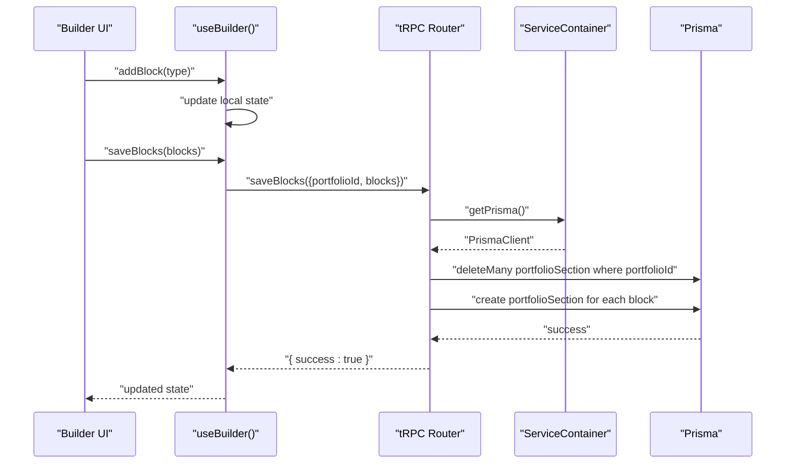

**Diagram sources**
- [modules/builder/hooks.ts](file://modules/builder/hooks.ts#L11-L85)
- [server/routers/builder.ts](file://server/routers/builder.ts#L71-L119)
- [server/services/index.ts](file://server/services/index.ts#L21-L23)
- [prisma/schema.prisma](file://prisma/schema.prisma#L115-L130)

## Detailed Component Analysis

### Section Types and Categories
- Types: HERO, TEXT, IMAGE, GALLERY, VIDEO, SKILLS, TIMELINE, PROJECTS, TESTIMONIALS, CONTACT, CTA, SPACER.
- Categories: Header, Content, Media, Portfolio, Social, Layout.
- Each type supports a default content shape and a human-friendly label/icon for the builder UI.

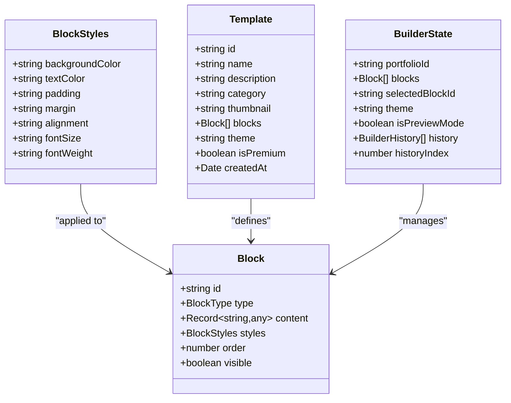

**Diagram sources**
- [modules/builder/types.ts](file://modules/builder/types.ts#L20-L76)

**Section sources**
- [modules/builder/types.ts](file://modules/builder/types.ts#L5-L76)
- [modules/builder/constants.ts](file://modules/builder/constants.ts#L14-L27)
- [modules/builder/utils.ts](file://modules/builder/utils.ts#L26-L98)

### Drag-and-Drop and Reordering
- The builder maintains a local array of blocks and supports reordering by moving items within the array and recalculating indices.
- The state tracks the selected block for editing and toggles preview mode.

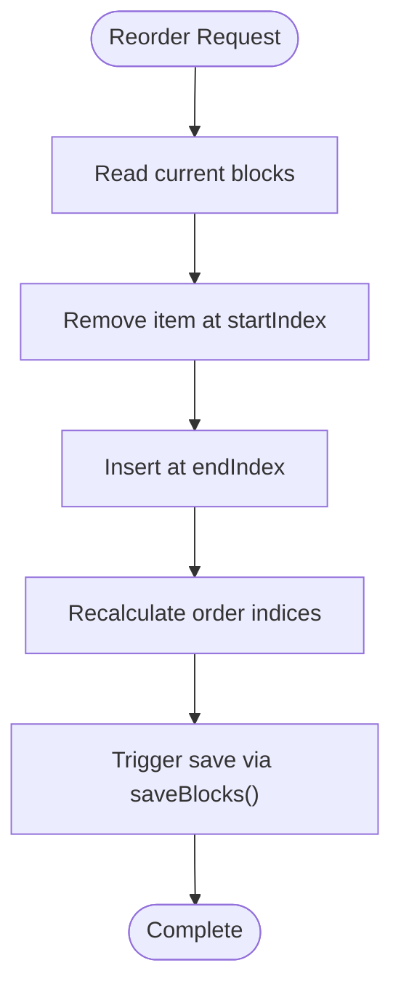

**Diagram sources**
- [modules/builder/hooks.ts](file://modules/builder/hooks.ts#L55-L66)
- [modules/builder/hooks.ts](file://modules/builder/hooks.ts#L11-L85)

**Section sources**
- [modules/builder/hooks.ts](file://modules/builder/hooks.ts#L55-L66)
- [modules/builder/hooks.ts](file://modules/builder/hooks.ts#L11-L85)

### Templates and Applying Predefined Layouts
- Templates are stored as JSON with an array of blocks. The backend exposes a procedure to apply a template to a portfolio after validating ownership.
- Applying a template deletes existing sections and recreates them from the template’s block list.

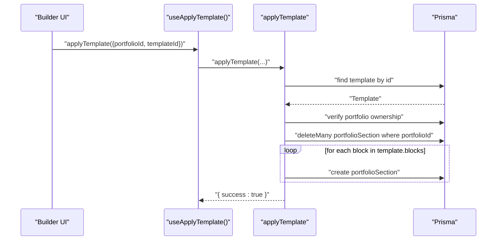

**Diagram sources**
- [server/routers/builder.ts](file://server/routers/builder.ts#L18-L68)
- [prisma/schema.prisma](file://prisma/schema.prisma#L115-L130)

**Section sources**
- [server/routers/builder.ts](file://server/routers/builder.ts#L18-L68)
- [modules/builder/hooks.ts](file://modules/builder/hooks.ts#L96-L105)

### Persistence and Validation
- Saving blocks replaces all existing sections for a portfolio with the submitted blocks.
- Ownership checks ensure only the portfolio owner can modify sections.
- Blocks are persisted with type, title derived from content, content payload, order, and visibility.

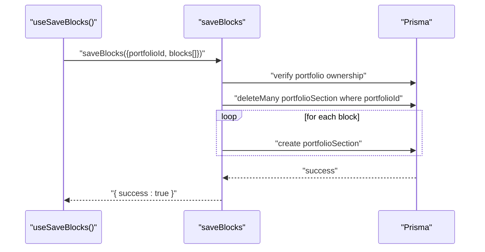

**Diagram sources**
- [server/routers/builder.ts](file://server/routers/builder.ts#L71-L119)
- [prisma/schema.prisma](file://prisma/schema.prisma#L115-L130)

**Section sources**
- [server/routers/builder.ts](file://server/routers/builder.ts#L71-L119)

### Permissions and Visibility
- Ownership enforcement: All tRPC procedures validate that the requesting user owns the target portfolio before proceeding.
- Visibility flag: Each section includes a visibility property that controls whether it renders in the portfolio.

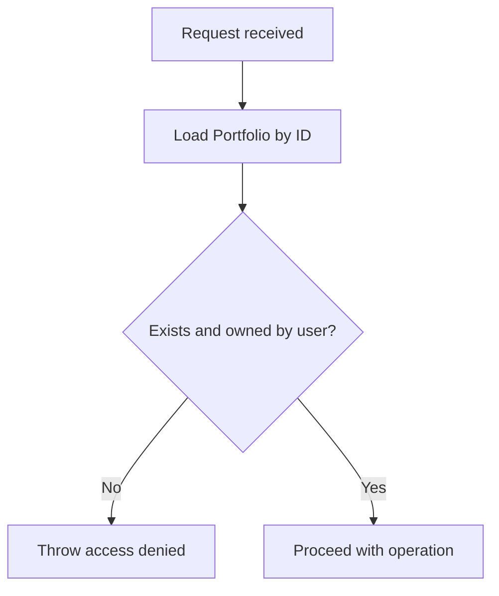

**Diagram sources**
- [server/routers/builder.ts](file://server/routers/builder.ts#L38-L44)
- [server/routers/builder.ts](file://server/routers/builder.ts#L91-L97)
- [server/routers/builder.ts](file://server/routers/builder.ts#L128-L134)

**Section sources**
- [server/routers/builder.ts](file://server/routers/builder.ts#L38-L44)
- [server/routers/builder.ts](file://server/routers/builder.ts#L91-L97)
- [server/routers/builder.ts](file://server/routers/builder.ts#L128-L134)

### Section-Specific Settings and Defaults
- Default content per type is provided to initialize new sections with sensible placeholders.
- Styles include color, typography, spacing, alignment, and font properties.

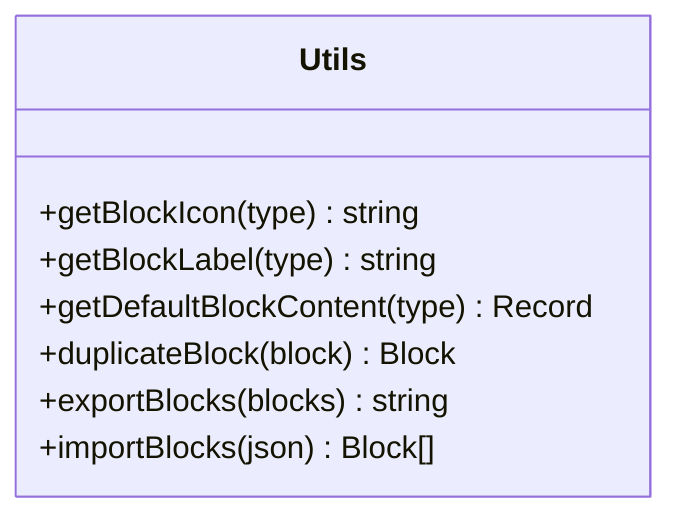

**Diagram sources**
- [modules/builder/utils.ts](file://modules/builder/utils.ts#L7-L119)

**Section sources**
- [modules/builder/utils.ts](file://modules/builder/utils.ts#L45-L98)
- [modules/builder/types.ts](file://modules/builder/types.ts#L29-L37)

### Examples: Add, Edit, Remove Sections
- Add a section: Call the add function with a type and optional insertion index; the hook creates a new block with default content and assigns an auto-incremented order.
- Edit a section: Update the block’s content or styles using the update function; the hook merges changes into the local state.
- Remove a section: Delete the block by ID; the hook also clears selection if it matched the deleted block.

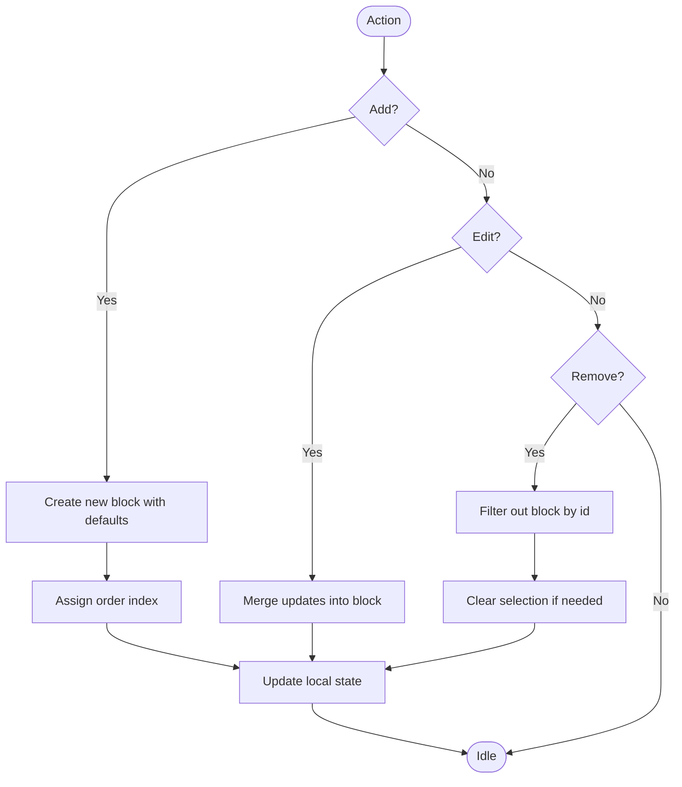

**Diagram sources**
- [modules/builder/hooks.ts](file://modules/builder/hooks.ts#L22-L53)
- [modules/builder/hooks.ts](file://modules/builder/hooks.ts#L38-L45)
- [modules/builder/hooks.ts](file://modules/builder/hooks.ts#L47-L53)

**Section sources**
- [modules/builder/hooks.ts](file://modules/builder/hooks.ts#L22-L53)
- [modules/builder/hooks.ts](file://modules/builder/hooks.ts#L38-L53)

### Section Duplication and Import/Export
- Duplicate a section: Clone the block, assign a new ID, increment order, and insert after the original.
- Import/Export: Serialize blocks to JSON for sharing or backup; invalid JSON safely falls back to empty arrays.

**Section sources**
- [modules/builder/utils.ts](file://modules/builder/utils.ts#L100-L119)

### Responsive Behavior and Display Options
- Display options are controlled via styles applied to each section (colors, spacing, alignment, typography).
- The builder exposes a preview mode toggle to simulate rendering in different contexts.

**Section sources**
- [modules/builder/types.ts](file://modules/builder/types.ts#L29-L37)
- [modules/builder/hooks.ts](file://modules/builder/hooks.ts#L72-L74)

## Dependency Analysis
- Frontend module exports: The builder module aggregates its internal APIs for consumption by the rest of the app.
- Backend router depends on the service container for database access.
- Prisma models define the schema for portfolios, sections, and templates.

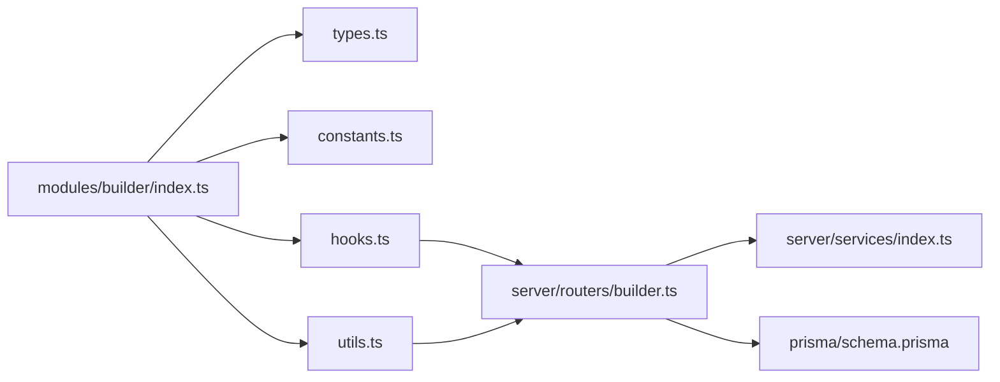

**Diagram sources**
- [modules/builder/index.ts](file://modules/builder/index.ts#L10-L14)
- [modules/builder/types.ts](file://modules/builder/types.ts#L1-L76)
- [modules/builder/constants.ts](file://modules/builder/constants.ts#L1-L41)
- [modules/builder/hooks.ts](file://modules/builder/hooks.ts#L1-L117)
- [modules/builder/utils.ts](file://modules/builder/utils.ts#L1-L119)
- [server/routers/builder.ts](file://server/routers/builder.ts#L1-L156)
- [server/services/index.ts](file://server/services/index.ts#L1-L118)
- [prisma/schema.prisma](file://prisma/schema.prisma#L115-L166)

**Section sources**
- [modules/builder/index.ts](file://modules/builder/index.ts#L10-L14)
- [server/routers/builder.ts](file://server/routers/builder.ts#L1-L156)
- [server/services/index.ts](file://server/services/index.ts#L1-L118)
- [prisma/schema.prisma](file://prisma/schema.prisma#L115-L166)

## Performance Considerations
- Auto-save interval: The builder includes a constant for periodic autosave cadence to reduce manual saves.
- Maximum blocks per portfolio: A guard prevents excessive section counts.
- Efficient updates: Local state updates are batched via React state updates; tRPC mutations replace entire section sets to maintain consistency.

**Section sources**
- [modules/builder/constants.ts](file://modules/builder/constants.ts#L40-L41)
- [modules/builder/constants.ts](file://modules/builder/constants.ts#L38-L38)
- [modules/builder/hooks.ts](file://modules/builder/hooks.ts#L32-L35)

## Troubleshooting Guide
- Access denied errors: Occur when attempting to save or apply templates to a portfolio that does not belong to the current user.
- Template not found: Applying a template fails if the requested template ID does not exist.
- Invalid JSON import: Importing blocks from malformed JSON returns an empty array.

**Section sources**
- [server/routers/builder.ts](file://server/routers/builder.ts#L33-L35)
- [server/routers/builder.ts](file://server/routers/builder.ts#L42-L44)
- [modules/builder/utils.ts](file://modules/builder/utils.ts#L112-L118)

## Conclusion
The section-based content management system provides a flexible, type-safe builder with templates, duplication, and robust persistence. Sections are validated against ownership, ordered efficiently, and styled through a unified styles model. The architecture cleanly separates frontend state management from backend persistence, enabling scalable enhancements such as inline editing and publishing workflows.

## Appendices

### Data Model Overview
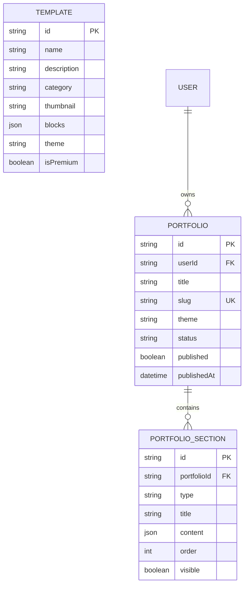

**Diagram sources**
- [prisma/schema.prisma](file://prisma/schema.prisma#L89-L130)
- [prisma/schema.prisma](file://prisma/schema.prisma#L152-L166)

### Route Model Context
- The builder is part of the evolving workspace model, with future plans for inline editing and live preview.

**Section sources**
- [docs/IMPLEMENTATION-COMPLETE.md](file://docs/IMPLEMENTATION-COMPLETE.md#L120-L131)