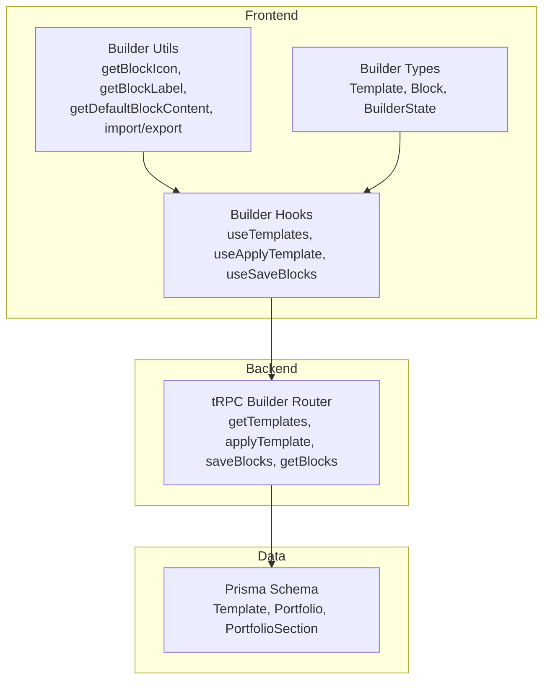
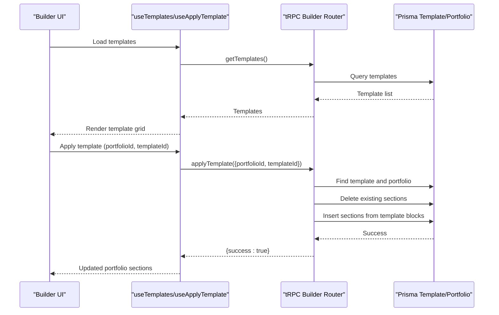
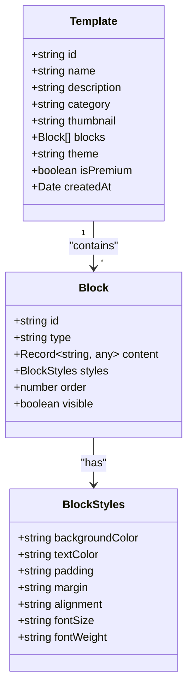
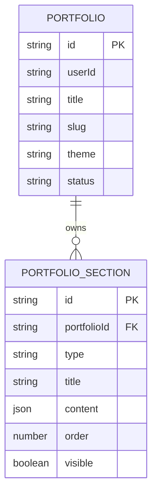
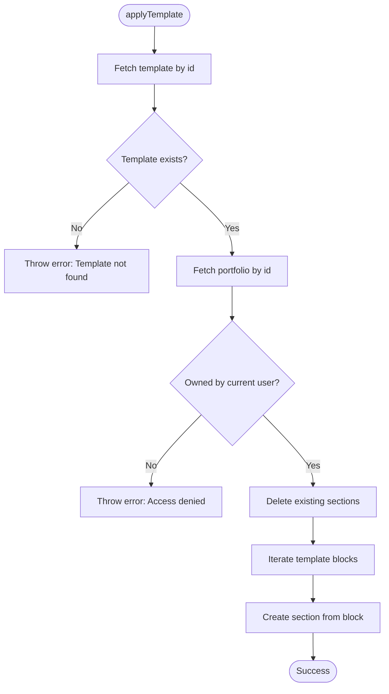
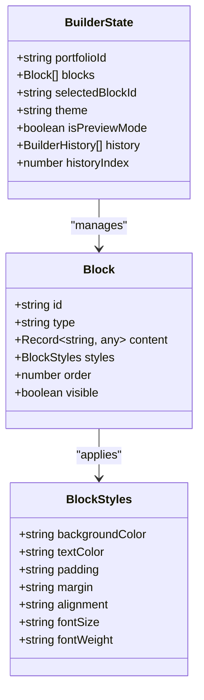
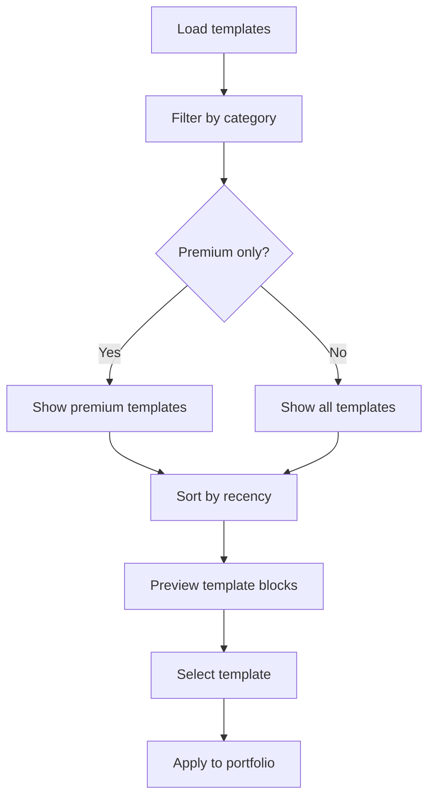
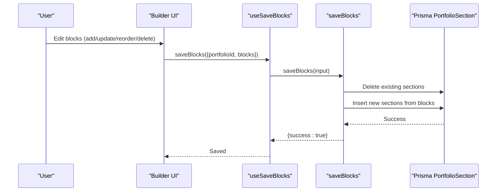
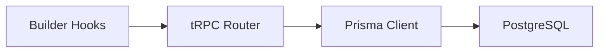

# Template System and Customization

<cite>
**Referenced Files in This Document**
- [modules/portfolio/types.ts](file://modules/portfolio/types.ts)
- [modules/portfolio/constants.ts](file://modules/portfolio/constants.ts)
- [modules/portfolio/utils.ts](file://modules/portfolio/utils.ts)
- [modules/builder/types.ts](file://modules/builder/types.ts)
- [modules/builder/hooks.ts](file://modules/builder/hooks.ts)
- [modules/builder/utils.ts](file://modules/builder/utils.ts)
- [modules/builder/constants.ts](file://modules/builder/constants.ts)
- [server/routers/builder.ts](file://server/routers/builder.ts)
- [prisma/schema.prisma](file://prisma/schema.prisma)
</cite>

## Table of Contents
1. [Introduction](#introduction)
2. [Project Structure](#project-structure)
3. [Core Components](#core-components)
4. [Architecture Overview](#architecture-overview)
5. [Detailed Component Analysis](#detailed-component-analysis)
6. [Dependency Analysis](#dependency-analysis)
7. [Performance Considerations](#performance-considerations)
8. [Troubleshooting Guide](#troubleshooting-guide)
9. [Conclusion](#conclusion)
10. [Appendices](#appendices)

## Introduction
This document explains the template system architecture and customization capabilities in the portfolio builder. It covers how templates are modeled, how users create and modify portfolios using templates, and how customization options are applied. It also documents template categories, selection criteria, validation, preview functionality, and operational considerations such as versioning, backup, and restoration.

## Project Structure
The template system spans three primary layers:
- Data model layer: Prisma schema defines templates, portfolios, and sections.
- Backend layer: tRPC router exposes template queries and mutations for applying templates and saving blocks.
- Frontend layer: React hooks and utilities manage template discovery, application, and local editing.

**Diagram sources**
- [modules/builder/hooks.ts](file://modules/builder/hooks.ts#L87-L117)
- [modules/builder/utils.ts](file://modules/builder/utils.ts#L1-L119)
- [modules/builder/types.ts](file://modules/builder/types.ts#L1-L76)
- [server/routers/builder.ts](file://server/routers/builder.ts#L1-L156)
- [prisma/schema.prisma](file://prisma/schema.prisma#L152-L166)

**Section sources**
- [modules/builder/hooks.ts](file://modules/builder/hooks.ts#L1-L117)
- [modules/builder/utils.ts](file://modules/builder/utils.ts#L1-L119)
- [modules/builder/types.ts](file://modules/builder/types.ts#L1-L76)
- [server/routers/builder.ts](file://server/routers/builder.ts#L1-L156)
- [prisma/schema.prisma](file://prisma/schema.prisma#L152-L166)

## Core Components
- Template model: Stores template metadata, category, theme, premium flag, and serialized blocks.
- Portfolio and sections: Portfolios own sections; templates are applied by converting template blocks into portfolio sections.
- Builder state: Manages blocks, selection, preview mode, and undo/redo history.
- Template categories and block categories: Define classification for discoverability and filtering.
- Theme enums: Provide theme options for portfolios and templates.

Key data structures and relationships:
- Template: id, name, description, category, thumbnail, blocks, theme, isPremium, createdAt.
- PortfolioSection: portfolioId, type, title, content (JSON), order, visible.
- Portfolio: id, userId, title, slug, theme, status, and other metadata.

**Section sources**
- [modules/builder/types.ts](file://modules/builder/types.ts#L39-L49)
- [modules/builder/constants.ts](file://modules/builder/constants.ts#L29-L36)
- [modules/builder/constants.ts](file://modules/builder/constants.ts#L5-L12)
- [prisma/schema.prisma](file://prisma/schema.prisma#L152-L166)
- [prisma/schema.prisma](file://prisma/schema.prisma#L115-L130)
- [prisma/schema.prisma](file://prisma/schema.prisma#L89-L113)
- [modules/portfolio/types.ts](file://modules/portfolio/types.ts#L11-L17)

## Architecture Overview
The template system follows a client-driven workflow:
- Users fetch available templates via tRPC.
- Users apply a template to a portfolio, replacing existing sections.
- Users edit blocks locally, then save to persist changes.
- Sections are stored as JSON content, enabling flexible customization.

**Diagram sources**
- [modules/builder/hooks.ts](file://modules/builder/hooks.ts#L87-L105)
- [server/routers/builder.ts](file://server/routers/builder.ts#L7-L68)
- [prisma/schema.prisma](file://prisma/schema.prisma#L152-L166)
- [prisma/schema.prisma](file://prisma/schema.prisma#L115-L130)

## Detailed Component Analysis

### Template Model and Categories
- Template definition includes metadata and blocks array. Blocks are stored without generated IDs to simplify serialization and reuse.
- Template categories support filtering by profession or use case.
- Template premium flag enables tier-based access control.

**Diagram sources**
- [modules/builder/types.ts](file://modules/builder/types.ts#L39-L49)
- [modules/builder/types.ts](file://modules/builder/types.ts#L20-L37)

**Section sources**
- [modules/builder/types.ts](file://modules/builder/types.ts#L39-L49)
- [modules/builder/constants.ts](file://modules/builder/constants.ts#L29-L36)

### Portfolio and Section Mapping
- Portfolios own sections; each section corresponds to a builder block.
- Content is stored as JSON, allowing arbitrary fields per block type.
- Ordering and visibility are persisted per section.

**Diagram sources**
- [prisma/schema.prisma](file://prisma/schema.prisma#L89-L113)
- [prisma/schema.prisma](file://prisma/schema.prisma#L115-L130)

**Section sources**
- [prisma/schema.prisma](file://prisma/schema.prisma#L89-L113)
- [prisma/schema.prisma](file://prisma/schema.prisma#L115-L130)

### Template Application Workflow
- Validation ensures the template exists and the portfolio belongs to the current user.
- Existing sections are deleted before applying new sections derived from the template’s blocks.
- Each block becomes a section with type, title, content, order, and visibility.

**Diagram sources**
- [server/routers/builder.ts](file://server/routers/builder.ts#L17-L68)

**Section sources**
- [server/routers/builder.ts](file://server/routers/builder.ts#L17-L68)

### Customization Options
Customization is achieved through:
- Block content: Type-specific default content and editable fields.
- Block styles: Background color, text color, spacing, alignment, typography.
- Theme: Portfolio theme influences rendering and branding.
- Layout variations: Achieved by reordering blocks and toggling visibility.

**Diagram sources**
- [modules/builder/types.ts](file://modules/builder/types.ts#L51-L59)
- [modules/builder/types.ts](file://modules/builder/types.ts#L20-L37)

**Section sources**
- [modules/builder/types.ts](file://modules/builder/types.ts#L29-L37)
- [modules/builder/utils.ts](file://modules/builder/utils.ts#L45-L98)
- [modules/portfolio/types.ts](file://modules/portfolio/types.ts#L11-L17)

### Template Categories and Selection Criteria
- Template categories enable filtering by target audience or industry.
- Selection criteria include theme compatibility, premium flag, and block count limits.

**Diagram sources**
- [modules/builder/constants.ts](file://modules/builder/constants.ts#L29-L36)
- [modules/builder/hooks.ts](file://modules/builder/hooks.ts#L87-L94)

**Section sources**
- [modules/builder/constants.ts](file://modules/builder/constants.ts#L29-L36)
- [modules/builder/hooks.ts](file://modules/builder/hooks.ts#L87-L94)

### Template Creation and Modification Workflows
- Creating a template: Serialize current blocks as a template payload and store with metadata.
- Modifying an existing template: Update template blocks and re-apply to portfolios.
- Applying templates: Replace portfolio sections with template-derived sections.

**Diagram sources**
- [modules/builder/hooks.ts](file://modules/builder/hooks.ts#L107-L117)
- [server/routers/builder.ts](file://server/routers/builder.ts#L70-L119)

**Section sources**
- [modules/builder/hooks.ts](file://modules/builder/hooks.ts#L107-L117)
- [server/routers/builder.ts](file://server/routers/builder.ts#L70-L119)

### Template Sharing Between Users
- Templates are stored in the database and retrieved via tRPC. Sharing is implicit through template availability.
- Premium templates are gated by the isPremium flag; access depends on user tier.

**Section sources**
- [server/routers/builder.ts](file://server/routers/builder.ts#L7-L15)
- [modules/builder/types.ts](file://modules/builder/types.ts#L47-L48)

### Examples

- Creating a custom template:
  - Export current blocks to JSON.
  - Store as a new template record with metadata and blocks.
  - Apply to a portfolio to validate structure.

- Modifying an existing template:
  - Update template blocks in the database.
  - Re-apply to affected portfolios to propagate changes.

- Applying a template to a portfolio:
  - Call the apply template mutation with portfolioId and templateId.
  - Confirm sections were replaced and rendered.

Note: The above steps describe the intended workflows based on the schema and router. Implementation details are referenced below.

**Section sources**
- [modules/builder/utils.ts](file://modules/builder/utils.ts#L108-L118)
- [server/routers/builder.ts](file://server/routers/builder.ts#L17-L68)

### Preview Functionality
- Preview mode toggles between design and live rendering.
- Local state tracks preview mode to reflect real-time changes.

**Section sources**
- [modules/builder/hooks.ts](file://modules/builder/hooks.ts#L72-L74)
- [modules/builder/types.ts](file://modules/builder/types.ts#L56-L56)

### Validation
- Template existence and portfolio ownership are validated before applying.
- Slug generation and validation utilities ensure portfolio slugs meet length and character constraints.

**Section sources**
- [server/routers/builder.ts](file://server/routers/builder.ts#L25-L44)
- [modules/portfolio/utils.ts](file://modules/portfolio/utils.ts#L42-L44)
- [modules/portfolio/constants.ts](file://modules/portfolio/constants.ts#L32-L35)

### Versioning, Backup, and Restoration
- Versioning: Templates are versioned by creation timestamp; latest templates appear first.
- Backup: Sections are exported/imported as JSON for manual backup.
- Restoration: Import JSON to restore previous configurations.

**Section sources**
- [server/routers/builder.ts](file://server/routers/builder.ts#L10-L12)
- [modules/builder/utils.ts](file://modules/builder/utils.ts#L108-L118)

## Dependency Analysis
The template system exhibits clear separation of concerns:
- Frontend hooks depend on tRPC procedures.
- tRPC router depends on Prisma for persistence.
- Data model enforces referential integrity between portfolios and sections.

**Diagram sources**
- [modules/builder/hooks.ts](file://modules/builder/hooks.ts#L87-L117)
- [server/routers/builder.ts](file://server/routers/builder.ts#L1-L156)
- [prisma/schema.prisma](file://prisma/schema.prisma#L1-L11)

**Section sources**
- [modules/builder/hooks.ts](file://modules/builder/hooks.ts#L87-L117)
- [server/routers/builder.ts](file://server/routers/builder.ts#L1-L156)
- [prisma/schema.prisma](file://prisma/schema.prisma#L1-L11)

## Performance Considerations
- Auto-save interval: Local auto-save occurs every 30 seconds to reduce data loss risk.
- Block limits: Maximum blocks per portfolio is enforced to prevent excessive rendering overhead.
- JSON content: Storing content as JSON enables flexible customization but requires careful parsing and validation.

Recommendations:
- Batch mutations for bulk updates to minimize network calls.
- Debounce auto-save to avoid frequent writes during rapid edits.
- Paginate template lists for large catalogs.

**Section sources**
- [modules/builder/constants.ts](file://modules/builder/constants.ts#L40-L40)
- [modules/builder/constants.ts](file://modules/builder/constants.ts#L38-L38)

## Troubleshooting Guide
Common issues and resolutions:
- Access denied when applying template: Ensure the portfolio belongs to the current user.
- Template not found: Verify templateId exists and is accessible.
- Slug validation errors: Confirm slug meets length and character constraints.
- Excessive blocks: Reduce block count to stay under the maximum limit.

**Section sources**
- [server/routers/builder.ts](file://server/routers/builder.ts#L42-L44)
- [server/routers/builder.ts](file://server/routers/builder.ts#L33-L35)
- [modules/portfolio/utils.ts](file://modules/portfolio/utils.ts#L42-L44)
- [modules/builder/constants.ts](file://modules/builder/constants.ts#L38-L38)

## Conclusion
The template system provides a robust foundation for portfolio customization:
- Templates are modeled as reusable block sets with metadata and categorization.
- Portfolios are composed of sections backed by JSON content for flexibility.
- The tRPC backend enforces ownership and applies templates atomically.
- Frontend hooks and utilities enable preview, editing, and export/import workflows.
Future enhancements could include explicit template versioning, user-generated template ratings, and collaborative editing features.

## Appendices

### Appendix A: Template and Block Reference
- Template fields: id, name, description, category, thumbnail, blocks, theme, isPremium, createdAt.
- Block fields: id, type, content, styles, order, visible.
- Block styles: backgroundColor, textColor, padding, margin, alignment, fontSize, fontWeight.
- Available block types: HERO, TEXT, IMAGE, GALLERY, VIDEO, SKILLS, TIMELINE, PROJECTS, TESTIMONIALS, CONTACT, CTA, SPACER.

**Section sources**
- [modules/builder/types.ts](file://modules/builder/types.ts#L39-L49)
- [modules/builder/types.ts](file://modules/builder/types.ts#L20-L37)
- [modules/builder/constants.ts](file://modules/builder/constants.ts#L14-L27)