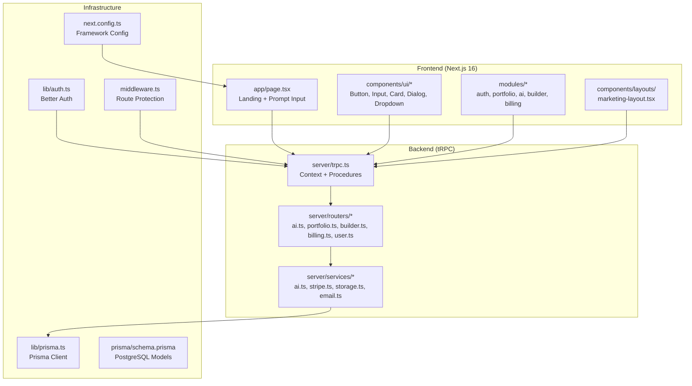
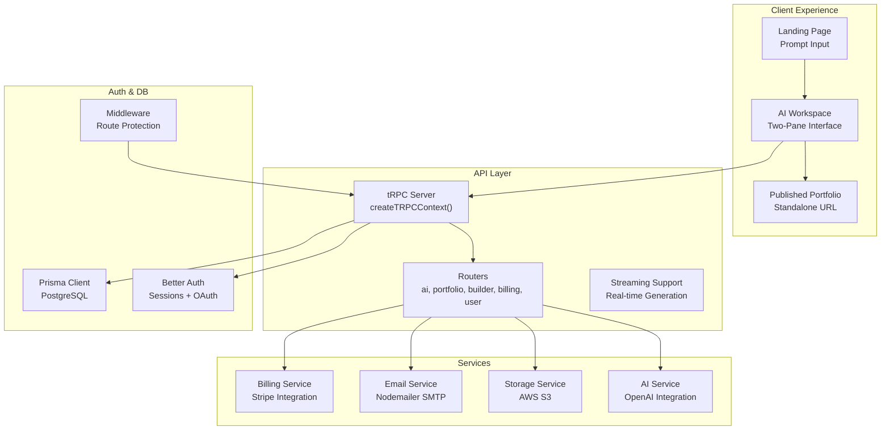
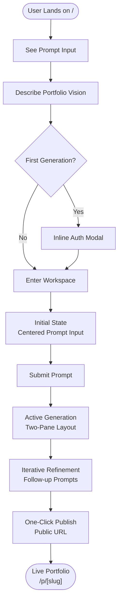
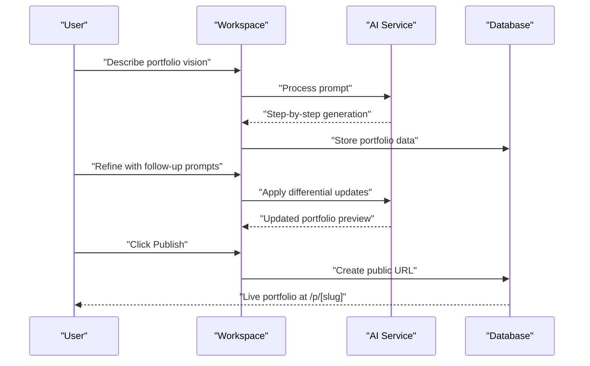
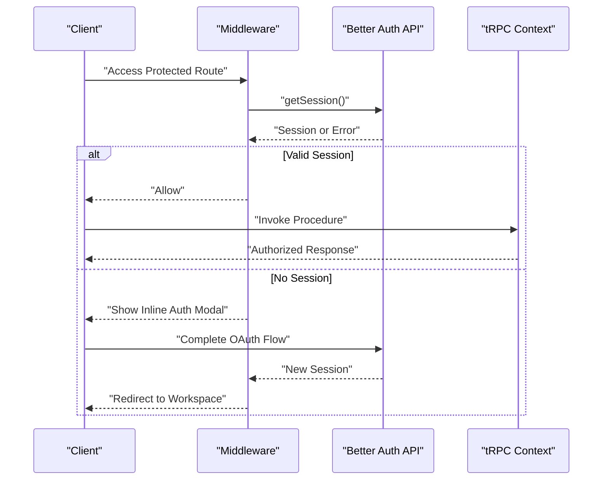
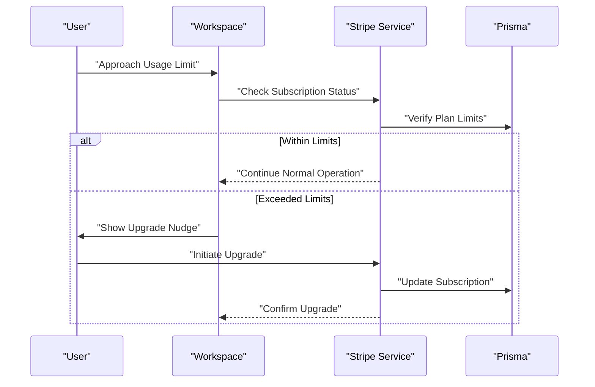
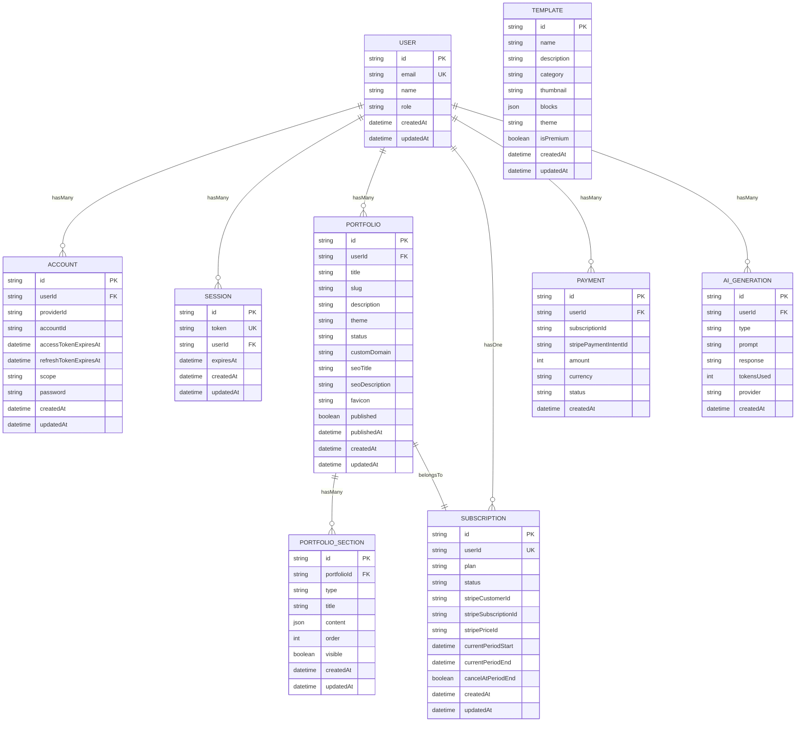
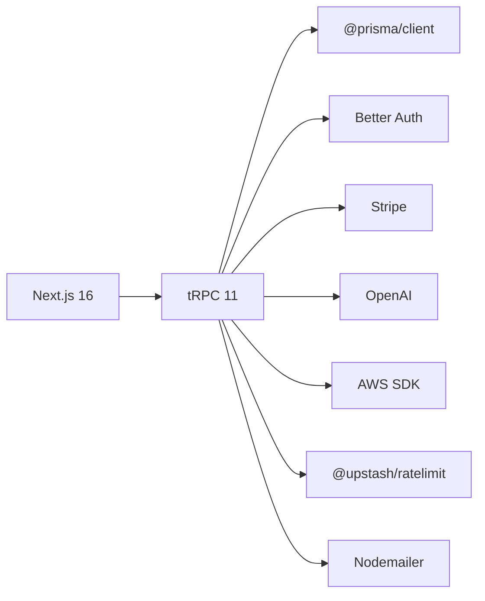

# Project Overview

<cite>
**Referenced Files in This Document**
- [README.md](file://README.md)
- [PROJECT-SUMMARY.md](file://PROJECT-SUMMARY.md)
- [IMPLEMENTATION_SUMMARY.md](file://IMPLEMENTATION_SUMMARY.md)
- [package.json](file://package.json)
- [prisma/schema.prisma](file://prisma/schema.prisma)
- [next.config.ts](file://next.config.ts)
- [lib/auth.ts](file://lib/auth.ts)
- [lib/prisma.ts](file://lib/prisma.ts)
- [server/trpc.ts](file://server/trpc.ts)
- [middleware.ts](file://middleware.ts)
- [server/services/stripe.ts](file://server/services/stripe.ts)
- [modules/ai/index.ts](file://modules/ai/index.ts)
- [modules/builder/index.ts](file://modules/builder/index.ts)
- [modules/portfolio/index.ts](file://modules/portfolio/index.ts)
- [modules/billing/index.ts](file://modules/billing/index.ts)
- [app/page.tsx](file://app/page.tsx)
- [components/layouts/marketing-layout.tsx](file://components/layouts/marketing-layout.tsx)
- [docs/ARCHITECTURE.md](file://docs/ARCHITECTURE.md)
- [docs/DIAGRAMS.md](file://docs/DIAGRAMS.md)
</cite>

## Update Summary
**Changes Made**
- Updated introduction to emphasize the new AI-native workspace-first architecture
- Revised core value proposition to highlight the four-phase product loop (Prompt → Generate → Refine → Publish)
- Updated architecture overview to reflect the absence of traditional SaaS dashboards
- Enhanced product philosophy sections to align with workspace-first design principles
- Updated technology stack documentation to reflect current implementation status
- Revised feature descriptions to match the new workspace-centric approach

## Table of Contents
1. [Introduction](#introduction)
2. [Project Structure](#project-structure)
3. [Core Components](#core-components)
4. [Architecture Overview](#architecture-overview)
5. [Detailed Component Analysis](#detailed-component-analysis)
6. [Dependency Analysis](#dependency-analysis)
7. [Performance Considerations](#performance-considerations)
8. [Troubleshooting Guide](#troubleshooting-guide)
9. [Conclusion](#conclusion)

## Introduction
Smartfolio is an AI-native developer portfolio generator built on a workspace-first architecture. The platform revolutionizes portfolio creation through a streamlined four-phase product loop: Prompt → Generate → Refine → Publish. Unlike traditional SaaS applications, Smartfolio eliminates conventional dashboards, settings pages, and navigation menus—transforming the AI workspace itself into the primary product interface.

**Core Value Proposition**: Users describe their ideal portfolio in natural language, and Smartfolio generates a complete, live portfolio in real-time. The system prioritizes simplicity and speed, with authentication, billing, and configuration appearing only when needed through contextual modals and inline components.

**Key Differentiators**:
- **AI-First Workflow**: Natural language prompts drive the entire creation process
- **Workspace-First Design**: The AI workspace IS the product interface
- **Four-Phase Loop**: Prompt → Generate → Refine → Publish for iterative improvement
- **Type-Safe Architecture**: End-to-end type safety with tRPC for reliable development
- **Modern Stack**: Next.js 16, tRPC 11, Prisma 6, Better Auth, and Stripe integration
- **Real-Time Preview**: Live portfolio rendering during generation and refinement
- **Subscription-Based**: Usage-limited tiers with contextual upgrade triggers

**Target Audience**:
- Developers, designers, and freelancers needing rapid professional online presence
- Teams requiring production-ready portfolio SaaS infrastructure
- Organizations implementing portfolio capabilities into developer platforms

**Primary Use Cases**:
- Job seeker portfolio creation and rapid deployment
- Personal branding and marketing campaign launch
- Agency showcases with customizable templates
- Enterprise developer platform integrations

## Project Structure
Smartfolio follows a modular, workspace-centric architecture with clear separation between frontend, backend, and shared modules. The frontend leverages Next.js App Router with a focus on the AI workspace, while the backend is organized around tRPC routers and services optimized for real-time AI interactions.

**Diagram sources**
- [next.config.ts](file://next.config.ts#L1-L8)
- [lib/auth.ts](file://lib/auth.ts#L1-L25)
- [lib/prisma.ts](file://lib/prisma.ts#L1-L14)
- [server/trpc.ts](file://server/trpc.ts#L1-L61)
- [middleware.ts](file://middleware.ts#L1-L95)
- [prisma/schema.prisma](file://prisma/schema.prisma#L1-L230)
- [app/page.tsx](file://app/page.tsx#L1-L683)
- [components/layouts/marketing-layout.tsx](file://components/layouts/marketing-layout.tsx#L1-L83)

**Section sources**
- [README.md](file://README.md#L1-L100)
- [PROJECT-SUMMARY.md](file://PROJECT-SUMMARY.md#L1-L168)
- [IMPLEMENTATION_SUMMARY.md](file://IMPLEMENTATION_SUMMARY.md#L1-L287)

## Core Components
Smartfolio's workspace-first architecture centers around five core modules that work together to deliver the AI-native portfolio creation experience:

- **AI Generation Engine**: Powers content creation with OpenAI integration, currently focused on snippet generation with plans for full structured portfolio JSON output
- **Portfolio Builder**: Provides template system and block management for future visual editing capabilities
- **Authentication (Better Auth)**: Secure session management with email/password and OAuth providers (Google, GitHub)
- **Billing (Stripe)**: Multi-tier subscription management with contextual upgrade triggers
- **Workspace Interface**: The central AI workspace replacing traditional dashboards with a two-pane layout
- **Type-Safe API (tRPC)**: End-to-end type safety across frontend and backend with protected procedures
- **Database (Prisma + PostgreSQL)**: Comprehensive models supporting users, portfolios, subscriptions, and AI generation logs

**Section sources**
- [PROJECT-SUMMARY.md](file://PROJECT-SUMMARY.md#L49-L168)
- [IMPLEMENTATION_SUMMARY.md](file://IMPLEMENTATION_SUMMARY.md#L19-L287)
- [prisma/schema.prisma](file://prisma/schema.prisma#L17-L229)

## Architecture Overview
Smartfolio's architecture fundamentally differs from traditional SaaS applications by eliminating dashboards and embracing a workspace-first design. The system centers on a clean separation of concerns with the AI workspace as the primary user interface.

**Diagram sources**
- [server/trpc.ts](file://server/trpc.ts#L12-L20)
- [middleware.ts](file://middleware.ts#L44-L81)
- [server/services/stripe.ts](file://server/services/stripe.ts#L13-L22)
- [lib/auth.ts](file://lib/auth.ts#L5-L24)
- [lib/prisma.ts](file://lib/prisma.ts#L7-L11)
- [prisma/schema.prisma](file://prisma/schema.prisma#L17-L229)
- [docs/ARCHITECTURE.md](file://docs/ARCHITECTURE.md#L1-L49)

## Detailed Component Analysis

### AI-Native Workspace Architecture
Smartfolio's workspace-first approach transforms the traditional SaaS dashboard into a unified AI workspace. The system eliminates sidebar navigation, settings pages, and separate analytics interfaces, consolidating all functionality into a single, intuitive interface.

**Diagram sources**
- [docs/DIAGRAMS.md](file://docs/DIAGRAMS.md#L71-L114)
- [PROJECT-SUMMARY.md](file://PROJECT-SUMMARY.md#L51-L83)

**Section sources**
- [PROJECT-SUMMARY.md](file://PROJECT-SUMMARY.md#L3-L168)
- [IMPLEMENTATION_SUMMARY.md](file://IMPLEMENTATION_SUMMARY.md#L127-L180)
- [docs/ARCHITECTURE.md](file://docs/ARCHITECTURE.md#L15-L49)

### Four-Phase Product Loop
The core Smartfolio workflow follows a deliberate four-phase process designed for maximum efficiency and user satisfaction:

**Prompt Phase**: Users describe their ideal portfolio using natural language, with voice input and file attachment support for enhanced creativity.

**Generate Phase**: The AI processes the prompt and begins generating structured portfolio content in real-time, with step-by-step reasoning displayed in the left pane.

**Refine Phase**: Users iteratively improve their portfolio through follow-up prompts, with differential updates applied without full regeneration.

**Publish Phase**: One-click publishing creates a standalone, publicly accessible portfolio URL.

**Diagram sources**
- [docs/DIAGRAMS.md](file://docs/DIAGRAMS.md#L142-L186)
- [PROJECT-SUMMARY.md](file://PROJECT-SUMMARY.md#L65-L83)

**Section sources**
- [PROJECT-SUMMARY.md](file://PROJECT-SUMMARY.md#L7-L168)
- [IMPLEMENTATION_SUMMARY.md](file://IMPLEMENTATION_SUMMARY.md#L49-L78)

### Authentication and Authorization
Better Auth provides secure session management with comprehensive OAuth support and seamless integration with the workspace-first design. Authentication appears only when needed through inline modals, maintaining the clean workspace interface.

**Diagram sources**
- [middleware.ts](file://middleware.ts#L28-L81)
- [lib/auth.ts](file://lib/auth.ts#L5-L24)
- [server/trpc.ts](file://server/trpc.ts#L12-L20)

**Section sources**
- [IMPLEMENTATION_SUMMARY.md](file://IMPLEMENTATION_SUMMARY.md#L19-L28)
- [middleware.ts](file://middleware.ts#L4-L96)

### Billing and Usage Management
Stripe integration handles subscription lifecycle management with contextual upgrade triggers that appear naturally within the workspace when usage limits are approached, maintaining the seamless user experience.

**Diagram sources**
- [server/services/stripe.ts](file://server/services/stripe.ts#L24-L65)
- [server/services/stripe.ts](file://server/services/stripe.ts#L115-L130)
- [server/services/stripe.ts](file://server/services/stripe.ts#L132-L170)

**Section sources**
- [IMPLEMENTATION_SUMMARY.md](file://IMPLEMENTATION_SUMMARY.md#L60-L70)
- [server/services/stripe.ts](file://server/services/stripe.ts#L1-L294)

### Data Models Overview
The database schema supports the workspace-first architecture with models optimized for portfolio creation, AI generation tracking, and subscription management. Relations and indexes enable efficient querying for the real-time workspace experience.

**Diagram sources**
- [prisma/schema.prisma](file://prisma/schema.prisma#L17-L229)

**Section sources**
- [prisma/schema.prisma](file://prisma/schema.prisma#L1-L230)

## Dependency Analysis
Smartfolio's technology stack is intentionally cohesive and optimized for the workspace-first architecture:

- **Next.js 16**: App Router with enhanced performance and streaming capabilities
- **tRPC 11**: Type-safe APIs enabling real-time communication and streaming responses
- **Prisma 6**: ORM with PostgreSQL for robust data modeling and migrations
- **Better Auth**: Secure, extensible authentication with OAuth integration
- **Stripe**: Subscription billing with contextual upgrade flows
- **OpenAI**: AI content generation with streaming support
- **AWS S3**: File storage for portfolio assets
- **Upstash Redis**: Rate limiting and caching for performance optimization
- **Nodemailer**: Email notifications and welcome messages

**Diagram sources**
- [package.json](file://package.json#L16-L38)

**Section sources**
- [package.json](file://package.json#L1-L52)

## Performance Considerations
- **Real-time Streaming**: Leverage tRPC subscriptions for live AI generation updates
- **Workspace Optimization**: Minimize DOM updates by focusing on the two-pane layout
- **AI Generation Efficiency**: Implement token usage tracking and rate limiting
- **Database Indexing**: Optimize queries for portfolio retrieval and AI generation logs
- **Storage Management**: Use AWS S3 for efficient asset delivery and CDN integration
- **Authentication Performance**: Cache session data and minimize OAuth round trips
- **Billing Integration**: Implement lazy loading for Stripe components within the workspace

## Troubleshooting Guide
Common issues and resolutions for the workspace-first architecture:

**Authentication Failures**: Verify Better Auth configuration and OAuth provider credentials; ensure cookies are properly handled in the workspace context.

**tRPC Connection Issues**: Check streaming capabilities and transformer configuration; confirm protected procedures are properly applied to workspace routes.

**AI Generation Problems**: Validate OpenAI API keys and model availability; implement proper error handling for streaming responses.

**Workspace Rendering**: Debug React component hierarchy and ensure proper state management for the two-pane layout.

**Billing Integration**: Confirm Stripe webhook endpoints and subscription status synchronization.

**Database Connectivity**: Verify Prisma client initialization and connection pooling for concurrent workspace sessions.

**Section sources**
- [lib/auth.ts](file://lib/auth.ts#L5-L24)
- [server/trpc.ts](file://server/trpc.ts#L27-L39)
- [server/services/stripe.ts](file://server/services/stripe.ts#L115-L130)
- [lib/prisma.ts](file://lib/prisma.ts#L7-L11)
- [middleware.ts](file://middleware.ts#L44-L81)

## Conclusion
Smartfolio represents a paradigm shift in portfolio creation through its AI-native workspace-first architecture. By eliminating traditional SaaS dashboards and focusing on the four-phase product loop (Prompt → Generate → Refine → Publish), the platform delivers unprecedented simplicity and efficiency for developers and designers.

The modern technology stack—Next.js 16, tRPC 11, Prisma 6, Better Auth, and Stripe—provides a scalable, type-safe foundation optimized for real-time AI interactions. As the platform evolves toward full structured portfolio generation, live rendering, and integrated visual editing, Smartfolio positions itself as the definitive solution for AI-powered portfolio creation.

This workspace-centric approach ensures that every element serves the primary goal: helping users transform ideas into stunning, professional portfolios with minimal friction and maximum creative control.