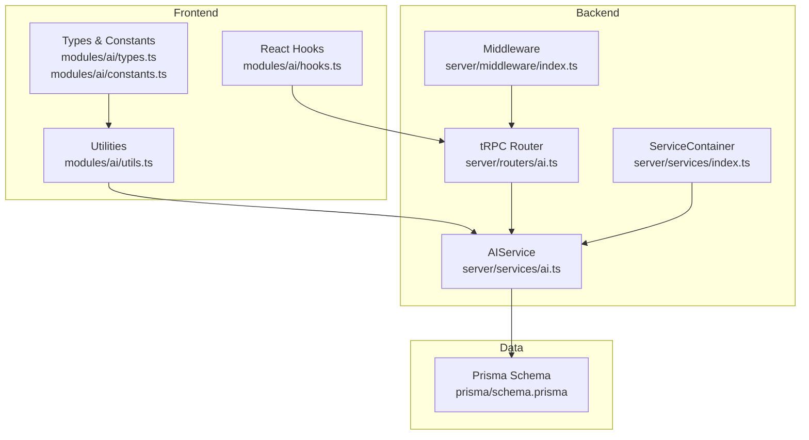
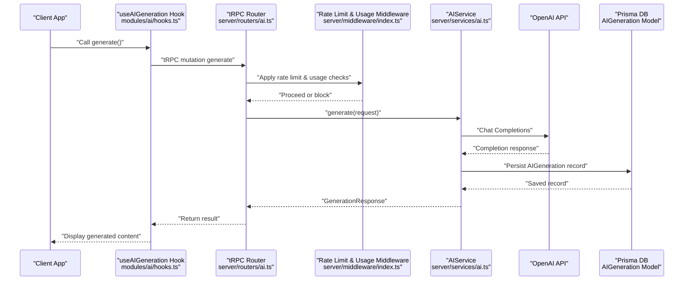
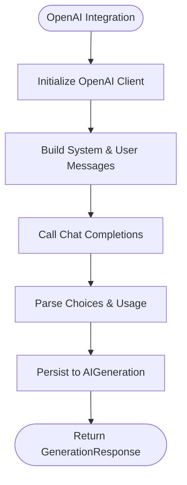
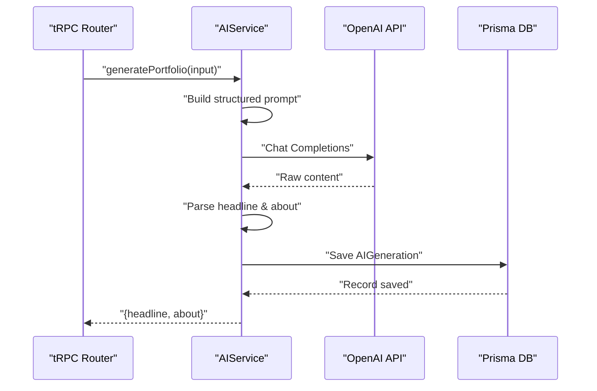
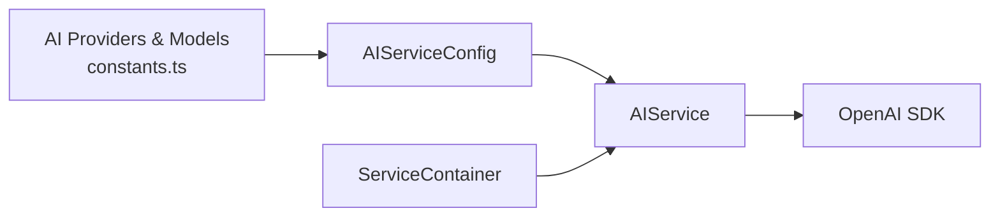
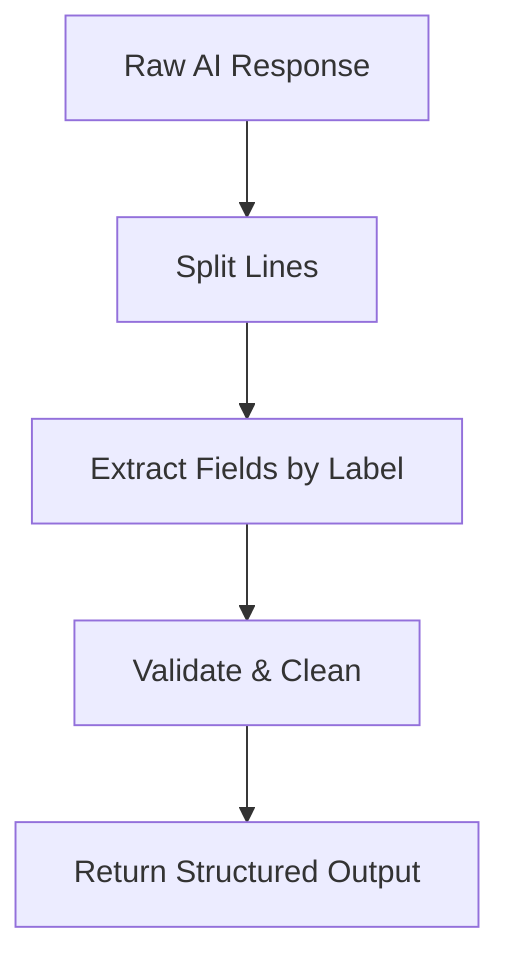
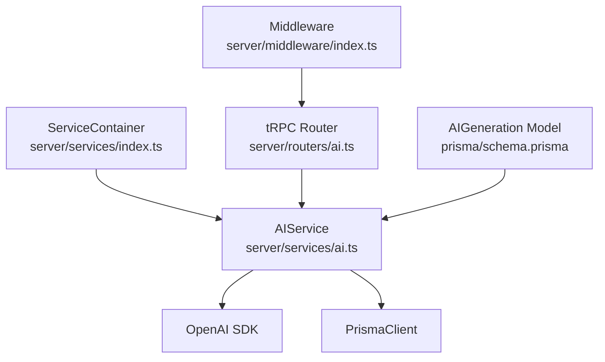

# AI Service Implementation

<cite>
**Referenced Files in This Document**
- [modules/ai/index.ts](file://modules/ai/index.ts)
- [modules/ai/types.ts](file://modules/ai/types.ts)
- [modules/ai/constants.ts](file://modules/ai/constants.ts)
- [modules/ai/utils.ts](file://modules/ai/utils.ts)
- [modules/ai/hooks.ts](file://modules/ai/hooks.ts)
- [server/services/ai.ts](file://server/services/ai.ts)
- [server/services/index.ts](file://server/services/index.ts)
- [server/routers/ai.ts](file://server/routers/ai.ts)
- [server/middleware/index.ts](file://server/middleware/index.ts)
- [server/trpc.ts](file://server/trpc.ts)
- [prisma/schema.prisma](file://prisma/schema.prisma)
- [lib/utils.ts](file://lib/utils.ts)
</cite>

## Table of Contents
1. [Introduction](#introduction)
2. [Project Structure](#project-structure)
3. [Core Components](#core-components)
4. [Architecture Overview](#architecture-overview)
5. [Detailed Component Analysis](#detailed-component-analysis)
6. [Dependency Analysis](#dependency-analysis)
7. [Performance Considerations](#performance-considerations)
8. [Troubleshooting Guide](#troubleshooting-guide)
9. [Conclusion](#conclusion)

## Introduction
This document provides comprehensive documentation for Smartfolio's AI Service implementation. It explains the AIService class architecture, OpenAI integration patterns, and content generation workflows. It also covers AI provider abstraction, model configuration, response processing, practical examples of AI content generation, streaming responses, error handling, rate limiting integration, cost management, performance optimization, AI provider switching, custom model configurations, and monitoring capabilities.

## Project Structure
Smartfolio organizes AI functionality across three primary layers:
- Frontend module: Provides types, constants, utilities, and React hooks for AI features.
- Backend service: Implements the AIService class that integrates with OpenAI and manages generation workflows.
- API layer: Exposes tRPC procedures for AI generation, history retrieval, and usage statistics.



**Diagram sources**
- [modules/ai/hooks.ts](file://modules/ai/hooks.ts#L1-L76)
- [modules/ai/types.ts](file://modules/ai/types.ts#L1-L69)
- [modules/ai/constants.ts](file://modules/ai/constants.ts#L1-L41)
- [modules/ai/utils.ts](file://modules/ai/utils.ts#L1-L104)
- [server/services/ai.ts](file://server/services/ai.ts#L1-L242)
- [server/services/index.ts](file://server/services/index.ts#L1-L118)
- [server/routers/ai.ts](file://server/routers/ai.ts#L1-L105)
- [server/middleware/index.ts](file://server/middleware/index.ts#L1-L153)
- [prisma/schema.prisma](file://prisma/schema.prisma#L214-L229)

**Section sources**
- [modules/ai/index.ts](file://modules/ai/index.ts#L1-L14)
- [modules/ai/types.ts](file://modules/ai/types.ts#L1-L69)
- [modules/ai/constants.ts](file://modules/ai/constants.ts#L1-L41)
- [modules/ai/utils.ts](file://modules/ai/utils.ts#L1-L104)
- [modules/ai/hooks.ts](file://modules/ai/hooks.ts#L1-L76)
- [server/services/ai.ts](file://server/services/ai.ts#L1-L242)
- [server/services/index.ts](file://server/services/index.ts#L1-L118)
- [server/routers/ai.ts](file://server/routers/ai.ts#L1-L105)
- [server/middleware/index.ts](file://server/middleware/index.ts#L1-L153)
- [prisma/schema.prisma](file://prisma/schema.prisma#L214-L229)

## Core Components
- AI Types and Contracts: Defines enums for providers and generation types, request/response interfaces, and input structures for portfolio, project, and SEO generation.
- AI Constants: Centralizes provider identifiers, supported models, token and generation limits, defaults, and prompt template keys.
- AI Utilities: Provides token formatting, cost estimation, label mapping, prompt truncation, and prompt builders for portfolio, project, and SEO content.
- AI React Hooks: Exposes tRPC-based hooks for triggering AI generation, retrieving history, and fetching usage statistics.
- AIService: Implements OpenAI integration, generation workflows, response parsing, persistence, and usage statistics aggregation.
- ServiceContainer: Manages singleton instances for AIService, StripeService, EmailService, StorageService, and Upstash Ratelimit.
- tRPC Router: Exposes protected procedures for generic generation, portfolio content, project descriptions, SEO metadata, history, and usage stats.
- Middleware: Implements rate limiting, subscription checks, admin checks, and usage limit enforcement for AI generations.
- Prisma Schema: Defines the AIGeneration model and relationships to the User model.

**Section sources**
- [modules/ai/types.ts](file://modules/ai/types.ts#L1-L69)
- [modules/ai/constants.ts](file://modules/ai/constants.ts#L1-L41)
- [modules/ai/utils.ts](file://modules/ai/utils.ts#L1-L104)
- [modules/ai/hooks.ts](file://modules/ai/hooks.ts#L1-L76)
- [server/services/ai.ts](file://server/services/ai.ts#L28-L242)
- [server/services/index.ts](file://server/services/index.ts#L9-L118)
- [server/routers/ai.ts](file://server/routers/ai.ts#L1-L105)
- [server/middleware/index.ts](file://server/middleware/index.ts#L13-L152)
- [prisma/schema.prisma](file://prisma/schema.prisma#L214-L229)

## Architecture Overview
The AI Service follows a layered architecture:
- Frontend triggers generation via tRPC mutations.
- tRPC procedures validate inputs and enforce authentication and usage limits.
- ServiceContainer provides AIService configured with OpenAI credentials and default model.
- AIService interacts with OpenAI chat completions, persists generation records, and aggregates usage metrics.
- Middleware enforces rate limits and plan-based usage caps.



**Diagram sources**
- [modules/ai/hooks.ts](file://modules/ai/hooks.ts#L10-L20)
- [server/routers/ai.ts](file://server/routers/ai.ts#L7-L31)
- [server/middleware/index.ts](file://server/middleware/index.ts#L13-L36)
- [server/services/ai.ts](file://server/services/ai.ts#L41-L87)
- [prisma/schema.prisma](file://prisma/schema.prisma#L214-L229)

## Detailed Component Analysis

### AIService Class Architecture
The AIService encapsulates AI generation logic:
- Constructor initializes OpenAI SDK with API key and Prisma client.
- generate handles generic content generation with configurable maxTokens and temperature.
- Specialized generators parse structured responses into domain-specific outputs.
- Persistence stores generation records with provider and token usage.
- Usage statistics compute monthly totals and compare against plan limits.

```mermaid
classDiagram
class AIService {
-openai : OpenAI
-prisma : PrismaClient
-config : AIServiceConfig
+constructor(config, prisma)
+generate(request) : Promise~GenerationResponse~
+generatePortfolio(input) : Promise~{about, headline}~
+generateProjectDescription(input) : Promise~{description}~
+generateSEO(input) : Promise~{title, description, keywords}~
+getHistory(userId) : Promise~any[]~
+getUsageStats(userId) : Promise~UsageStats~
-getSystemPrompt(type) : string
}
class AIServiceConfig {
+openaiApiKey : string
+anthropicApiKey? : string
+defaultModel? : string
}
class GenerationRequest {
+type : string
+prompt : string
+maxTokens? : number
+temperature? : number
+userId : string
}
class GenerationResponse {
+id : string
+type : string
+content : string
+tokensUsed : number
+provider : string
+model : string
+createdAt : Date
}
AIService --> AIServiceConfig : "uses"
AIService --> GenerationRequest : "accepts"
AIService --> GenerationResponse : "returns"
```

**Diagram sources**
- [server/services/ai.ts](file://server/services/ai.ts#L4-L26)
- [server/services/ai.ts](file://server/services/ai.ts#L28-L242)

**Section sources**
- [server/services/ai.ts](file://server/services/ai.ts#L28-L242)

### OpenAI Integration Patterns
- SDK Initialization: The service constructs the OpenAI client using the configured API key.
- Chat Completions: The generate method sends system and user messages with model selection, token limits, and temperature.
- Response Parsing: Specialized generators split and extract structured content from raw responses.
- Provider Tagging: All persisted generations are tagged with the provider to support future provider switching.



**Diagram sources**
- [server/services/ai.ts](file://server/services/ai.ts#L33-L39)
- [server/services/ai.ts](file://server/services/ai.ts#L41-L87)

**Section sources**
- [server/services/ai.ts](file://server/services/ai.ts#L33-L87)

### Content Generation Workflows
- Generic Generation: Accepts type and prompt, applies system prompt, and returns parsed content.
- Portfolio Content: Builds a structured prompt and parses headline and about section.
- Project Description: Generates a concise project description based on technologies and features.
- SEO Metadata: Produces title, description, and keywords aligned with SEO guidelines.



**Diagram sources**
- [server/services/ai.ts](file://server/services/ai.ts#L89-L123)
- [server/routers/ai.ts](file://server/routers/ai.ts#L34-L52)

**Section sources**
- [server/services/ai.ts](file://server/services/ai.ts#L89-L123)
- [server/routers/ai.ts](file://server/routers/ai.ts#L34-L52)

### AI Provider Abstraction and Model Configuration
- Provider Enum and Constants: Define supported providers and models for extensibility.
- AIServiceConfig: Accepts provider API keys and default model selection.
- ServiceContainer: Centralizes configuration and provides AIService instances.
- Future Provider Switching: The current implementation targets OpenAI; future enhancements can extend AIService to route to other providers while preserving the same interfaces.



**Diagram sources**
- [modules/ai/constants.ts](file://modules/ai/constants.ts#L5-L18)
- [server/services/ai.ts](file://server/services/ai.ts#L4-L8)
- [server/services/index.ts](file://server/services/index.ts#L25-L36)

**Section sources**
- [modules/ai/constants.ts](file://modules/ai/constants.ts#L5-L18)
- [server/services/ai.ts](file://server/services/ai.ts#L4-L8)
- [server/services/index.ts](file://server/services/index.ts#L25-L36)

### Response Processing and Parsing
- Structured Output Parsing: Portfolio and SEO generators split multi-line responses and extract specific fields.
- Token Usage Tracking: The service captures total tokens from OpenAI usage and persists them with each generation.
- Cost Estimation: Utilities provide approximate cost calculations per provider for budgeting.



**Diagram sources**
- [server/services/ai.ts](file://server/services/ai.ts#L118-L122)
- [server/services/ai.ts](file://server/services/ai.ts#L174-L179)
- [modules/ai/utils.ts](file://modules/ai/utils.ts#L17-L26)

**Section sources**
- [server/services/ai.ts](file://server/services/ai.ts#L118-L122)
- [server/services/ai.ts](file://server/services/ai.ts#L174-L179)
- [modules/ai/utils.ts](file://modules/ai/utils.ts#L17-L26)

### Practical Examples

#### Example 1: Generic AI Generation
- Trigger: Use the generic generate mutation with type and prompt.
- Behavior: The service applies a system prompt based on type, calls OpenAI, persists the record, and returns tokens used and provider info.

**Section sources**
- [server/routers/ai.ts](file://server/routers/ai.ts#L7-L31)
- [server/services/ai.ts](file://server/services/ai.ts#L41-L87)

#### Example 2: Portfolio Content Generation
- Trigger: Use generatePortfolio with name, profession, skills, optional experience/goals, and tone.
- Behavior: Builds a structured prompt, calls OpenAI, parses headline and about section, and returns both.

**Section sources**
- [server/routers/ai.ts](file://server/routers/ai.ts#L34-L52)
- [server/services/ai.ts](file://server/services/ai.ts#L89-L123)

#### Example 3: Project Description Generation
- Trigger: Use generateProjectDescription with project name, technologies, features, and optional impact.
- Behavior: Generates a concise project description and returns it.

**Section sources**
- [server/routers/ai.ts](file://server/routers/ai.ts#L55-L71)
- [server/services/ai.ts](file://server/services/ai.ts#L125-L148)

#### Example 4: SEO Metadata Generation
- Trigger: Use generateSEO with portfolio title, profession, and specialties.
- Behavior: Returns SEO title, meta description, and keywords.

**Section sources**
- [server/routers/ai.ts](file://server/routers/ai.ts#L74-L89)
- [server/services/ai.ts](file://server/services/ai.ts#L150-L180)

### Streaming Responses
- Current Implementation: The AIService uses synchronous chat completions and does not implement streaming.
- Recommended Pattern: To add streaming, integrate OpenAI's stream API, emit chunks via tRPC subscriptions, and accumulate content on the client. This maintains the existing request/response contracts while enabling real-time updates.

[No sources needed since this section provides general guidance]

### Error Handling
- OpenAI Errors: The service wraps OpenAI errors and throws a standardized failure message.
- tRPC Error Formatting: The tRPC error formatter includes Zod error details when applicable.
- Middleware Fail-Fast: Rate limiting failures throw TRPCError with TOO_MANY_REQUESTS; usage limit middleware throws FORBIDDEN when limits are exceeded.

**Section sources**
- [server/services/ai.ts](file://server/services/ai.ts#L83-L86)
- [server/trpc.ts](file://server/trpc.ts#L29-L38)
- [server/middleware/index.ts](file://server/middleware/index.ts#L24-L29)
- [server/middleware/index.ts](file://server/middleware/index.ts#L143-L148)

### Rate Limiting Integration
- Upstash Ratelimit: ServiceContainer initializes Ratelimit with sliding window configuration.
- Middleware Application: The rateLimitMiddleware enforces per-user rate limits and allows requests to proceed if rate limiting fails.

**Section sources**
- [server/services/index.ts](file://server/services/index.ts#L91-L103)
- [server/middleware/index.ts](file://server/middleware/index.ts#L13-L36)

### Cost Management
- Token Cost Estimation: Utilities calculate approximate costs per 1K tokens for providers.
- Usage Statistics: getUsageStats aggregates monthly token usage and counts, compares against plan limits, and returns limits per plan tier.

**Section sources**
- [modules/ai/utils.ts](file://modules/ai/utils.ts#L17-L26)
- [server/services/ai.ts](file://server/services/ai.ts#L190-L228)

### Performance Optimization
- Prompt Engineering: Use concise, structured prompts to reduce token usage and improve determinism.
- Token Limits: Configure maxTokens per generation type to balance quality and cost.
- Response Parsing: Minimize post-processing overhead by returning clean, structured outputs.
- Caching: Cache frequently used prompts or templates to reduce repeated computation.

**Section sources**
- [modules/ai/utils.ts](file://modules/ai/utils.ts#L46-L103)
- [server/services/ai.ts](file://server/services/ai.ts#L55-L56)

### Monitoring Capabilities
- Generation History: Retrieve recent generations with type, prompt, response, tokens used, and provider.
- Usage Stats: Monthly aggregation of tokens used and generation counts with plan-based limits.
- Token Formatting: Utilities provide human-readable token counts for dashboards and logs.

**Section sources**
- [server/routers/ai.ts](file://server/routers/ai.ts#L91-L103)
- [server/services/ai.ts](file://server/services/ai.ts#L182-L188)
- [server/services/ai.ts](file://server/services/ai.ts#L190-L228)
- [modules/ai/utils.ts](file://modules/ai/utils.ts#L7-L15)

### AI Provider Switching and Custom Model Configurations
- Extensibility: The AIServiceConfig supports adding provider-specific API keys and default model selection.
- Future Enhancements: Extend AIService to route to Anthropic or Google models while maintaining the same interfaces and persistence schema.

**Section sources**
- [server/services/ai.ts](file://server/services/ai.ts#L4-L8)
- [modules/ai/constants.ts](file://modules/ai/constants.ts#L5-L18)

## Dependency Analysis
The AI Service depends on:
- OpenAI SDK for chat completions.
- Prisma for persistence of AIGeneration records.
- Upstash Ratelimit for rate limiting.
- tRPC for API exposure and middleware integration.



**Diagram sources**
- [server/services/ai.ts](file://server/services/ai.ts#L1-L2)
- [server/services/index.ts](file://server/services/index.ts#L1-L7)
- [server/routers/ai.ts](file://server/routers/ai.ts#L1-L5)
- [server/middleware/index.ts](file://server/middleware/index.ts#L1-L7)
- [prisma/schema.prisma](file://prisma/schema.prisma#L214-L229)

**Section sources**
- [server/services/ai.ts](file://server/services/ai.ts#L1-L2)
- [server/services/index.ts](file://server/services/index.ts#L1-L7)
- [server/routers/ai.ts](file://server/routers/ai.ts#L1-L5)
- [server/middleware/index.ts](file://server/middleware/index.ts#L1-L7)
- [prisma/schema.prisma](file://prisma/schema.prisma#L214-L229)

## Performance Considerations
- Optimize prompts to reduce token usage and latency.
- Use appropriate maxTokens and temperature per generation type.
- Implement caching for repeated prompts and templates.
- Monitor usage stats to identify bottlenecks and adjust limits.

[No sources needed since this section provides general guidance]

## Troubleshooting Guide
- OpenAI API Errors: Inspect AIService error handling and ensure API keys are configured.
- Rate Limit Exceeded: Verify Upstash Redis configuration and middleware application.
- Usage Limits Reached: Confirm plan tiers and monthly aggregation logic.
- tRPC Validation Errors: Review input schemas and error formatting.

**Section sources**
- [server/services/ai.ts](file://server/services/ai.ts#L83-L86)
- [server/services/index.ts](file://server/services/index.ts#L91-L103)
- [server/middleware/index.ts](file://server/middleware/index.ts#L24-L29)
- [server/middleware/index.ts](file://server/middleware/index.ts#L143-L148)
- [server/trpc.ts](file://server/trpc.ts#L29-L38)

## Conclusion
Smartfolio’s AI Service provides a robust foundation for AI-powered content generation with strong typing, modular utilities, and tRPC integration. The AIService encapsulates OpenAI interactions, persists generation records, and exposes usage insights. With clear extension points, the system supports provider abstraction, custom model configurations, rate limiting, cost management, and monitoring—enabling scalable and maintainable AI features.