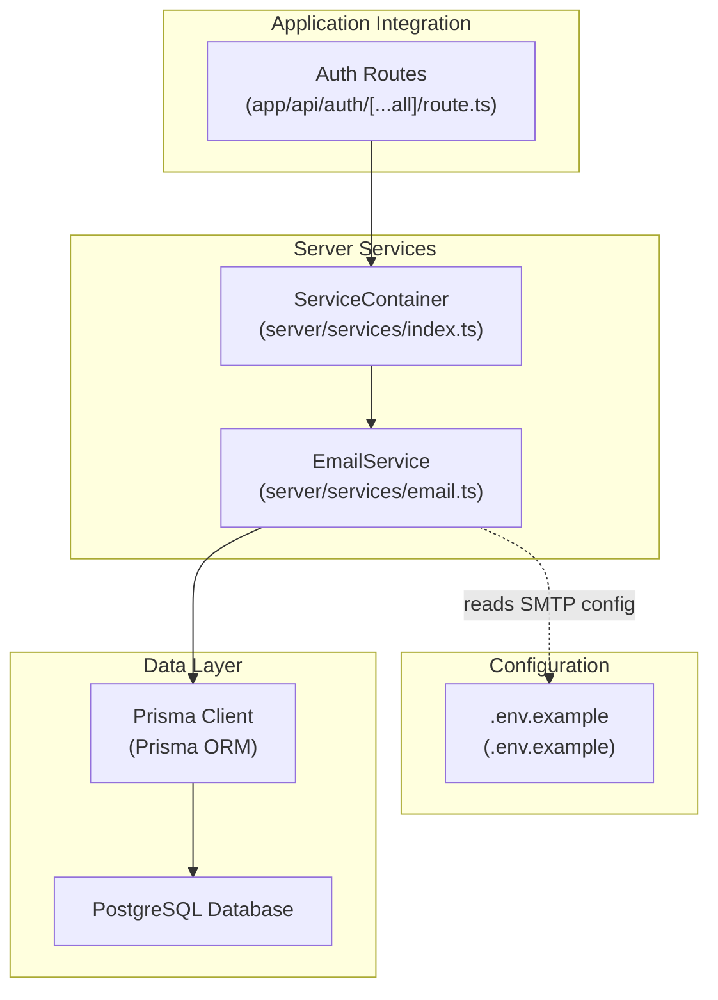
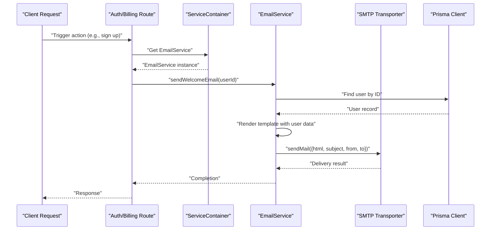
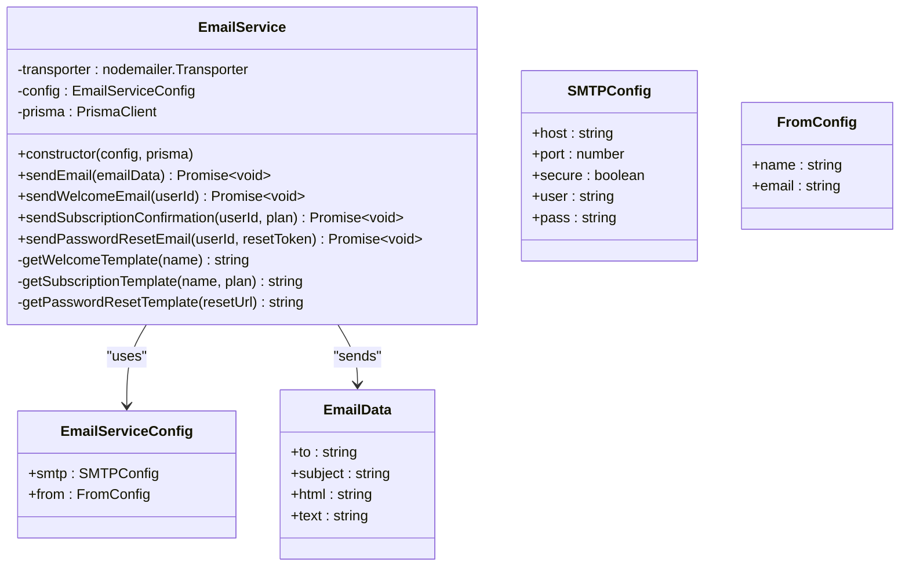
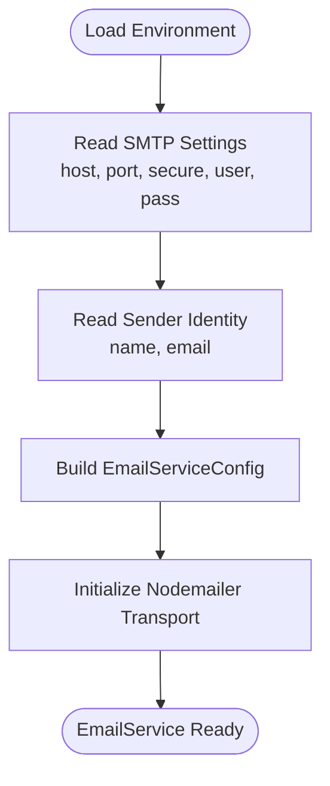
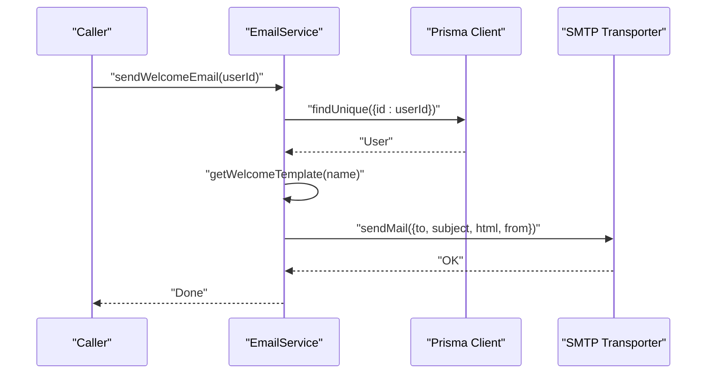
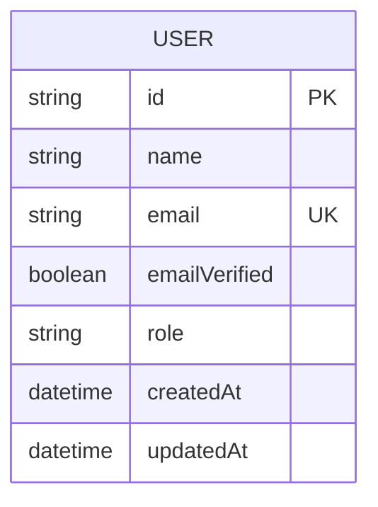
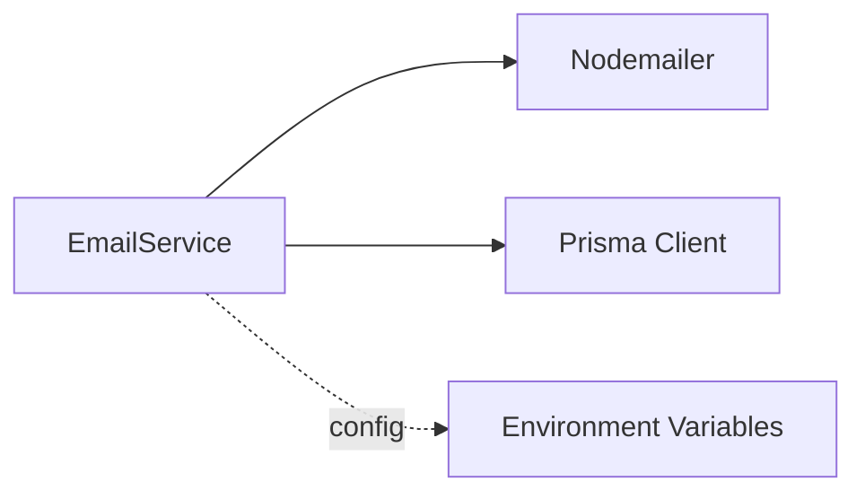

# Email Service Implementation

<cite>
**Referenced Files in This Document**
- [email.ts](file://server/services/email.ts)
- [index.ts](file://server/services/index.ts)
- [.env.example](file://.env.example)
- [schema.prisma](file://prisma/schema.prisma)
- [route.ts](file://app/api/auth/[...all]/route.ts)
</cite>

## Table of Contents
1. [Introduction](#introduction)
2. [Project Structure](#project-structure)
3. [Core Components](#core-components)
4. [Architecture Overview](#architecture-overview)
5. [Detailed Component Analysis](#detailed-component-analysis)
6. [Dependency Analysis](#dependency-analysis)
7. [Performance Considerations](#performance-considerations)
8. [Troubleshooting Guide](#troubleshooting-guide)
9. [Conclusion](#conclusion)

## Introduction
This document provides comprehensive documentation for Smartfolio's Email Service implementation. It covers the EmailService class structure, SMTP configuration, email delivery workflows, template rendering, and integration patterns. Practical examples demonstrate sending transactional emails, password reset flows, and subscription confirmation notifications. Security considerations, formatting guidelines, and scalability aspects are included to guide safe and efficient email delivery in production environments.

## Project Structure
The email service is implemented as a dedicated service module with a factory-style container for dependency injection. Configuration is externalized via environment variables, and the service integrates with the Prisma ORM for user data retrieval.

**Diagram sources**
- [email.ts](file://server/services/email.ts#L25-L177)
- [index.ts](file://server/services/index.ts#L54-L74)
- [.env.example](file://.env.example#L75-L84)
- [schema.prisma](file://prisma/schema.prisma#L17-L36)
- [route.ts](file://app/api/auth/[...all]/route.ts#L1-L7)

**Section sources**
- [email.ts](file://server/services/email.ts#L1-L177)
- [index.ts](file://server/services/index.ts#L1-L118)
- [.env.example](file://.env.example#L1-L84)
- [schema.prisma](file://prisma/schema.prisma#L1-L230)
- [route.ts](file://app/api/auth/[...all]/route.ts#L1-L7)

## Core Components
- EmailService: Provides SMTP transport, email sending, and built-in transactional templates for welcome, subscription confirmation, and password reset.
- ServiceContainer: Centralized factory for constructing services with environment-driven configuration, including EmailService.
- Prisma ORM: Used to fetch user data for personalized email content.
- Environment Configuration: SMTP and sender identity settings are loaded from environment variables.

Key responsibilities:
- SMTP transport initialization with host, port, security, and credentials.
- Sending HTML and optional plain-text emails.
- Rendering transactional templates with dynamic content.
- Integrating with user data for personalization.

**Section sources**
- [email.ts](file://server/services/email.ts#L25-L177)
- [index.ts](file://server/services/index.ts#L54-L74)
- [schema.prisma](file://prisma/schema.prisma#L17-L36)

## Architecture Overview
The email service follows a layered architecture:
- Presentation/Integration Layer: Application routes and modules trigger email actions.
- Service Layer: EmailService encapsulates SMTP transport and email composition.
- Data Access Layer: Prisma ORM retrieves user data for personalization.
- Configuration Layer: Environment variables supply SMTP and sender settings.

**Diagram sources**
- [email.ts](file://server/services/email.ts#L59-L73)
- [index.ts](file://server/services/index.ts#L54-L74)
- [schema.prisma](file://prisma/schema.prisma#L17-L36)

## Detailed Component Analysis

### EmailService Class
The EmailService class encapsulates SMTP transport configuration and provides methods for sending transactional emails. It supports HTML emails with optional plain-text alternatives and includes private template methods for common use cases.

**Diagram sources**
- [email.ts](file://server/services/email.ts#L4-L23)
- [email.ts](file://server/services/email.ts#L25-L177)

Key methods and behaviors:
- Constructor initializes SMTP transport using provided configuration and credentials.
- sendEmail validates and sends an email with HTML and optional text content.
- Transactional methods retrieve user data, render templates, and dispatch emails.
- Template methods return HTML bodies with embedded links and branding.

Security and error handling:
- Errors during sendMail are caught and surfaced as failures.
- Email sending is skipped if user email is missing.

**Section sources**
- [email.ts](file://server/services/email.ts#L25-L177)

### SMTP Configuration and Environment Variables
SMTP settings and sender identity are configured via environment variables. The ServiceContainer constructs EmailService with values loaded from the environment, ensuring separation of concerns and easy deployment customization.

**Diagram sources**
- [index.ts](file://server/services/index.ts#L54-L74)
- [.env.example](file://.env.example#L75-L84)

Configuration keys:
- SMTP_HOST, SMTP_PORT, SMTP_SECURE, SMTP_USER, SMTP_PASS
- EMAIL_FROM_NAME, EMAIL_FROM_EMAIL

**Section sources**
- [index.ts](file://server/services/index.ts#L54-L74)
- [.env.example](file://.env.example#L75-L84)

### Email Delivery Workflows
The service supports three primary workflows: welcome emails, subscription confirmations, and password resets. Each workflow:
- Retrieves user data from the database.
- Renders a tailored HTML template.
- Sends the email via SMTP transport.

**Diagram sources**
- [email.ts](file://server/services/email.ts#L59-L73)

**Section sources**
- [email.ts](file://server/services/email.ts#L59-L106)

### Template Rendering and Personalization
Templates are rendered as HTML strings with dynamic content injected from user data. The service includes:
- Welcome template with onboarding guidance and call-to-action.
- Subscription confirmation template with plan-specific benefits.
- Password reset template with a secure reset URL.

Formatting and accessibility:
- Templates use inline styles for broad client compatibility.
- Links are constructed using the application URL from environment variables.

**Section sources**
- [email.ts](file://server/services/email.ts#L108-L176)

### Integration with User Model
The email service relies on the User model for personalization. The schema defines essential fields for email delivery and verification status.

**Diagram sources**
- [schema.prisma](file://prisma/schema.prisma#L17-L36)

**Section sources**
- [schema.prisma](file://prisma/schema.prisma#L17-L36)

### Practical Examples

#### Sending a Transactional Email (Welcome)
- Trigger: New user registration.
- Steps:
  - Retrieve user by ID.
  - Render welcome template with user name.
  - Send email with subject and HTML body.

**Section sources**
- [email.ts](file://server/services/email.ts#L59-L73)

#### Password Reset Workflow
- Trigger: User requests password reset.
- Steps:
  - Generate reset token.
  - Construct reset URL with token.
  - Render password reset template.
  - Send email with secure link.

**Section sources**
- [email.ts](file://server/services/email.ts#L91-L106)

#### Subscription Confirmation Notification
- Trigger: Successful subscription upgrade.
- Steps:
  - Retrieve user and plan details.
  - Render plan-specific template.
  - Send confirmation email.

**Section sources**
- [email.ts](file://server/services/email.ts#L75-L89)

### Security Considerations
- SMTP credentials are loaded from environment variables and never hardcoded.
- Secure flag controls TLS usage based on environment configuration.
- Reset URLs include short-lived tokens and domain restrictions.
- Email content is sanitized as HTML strings; avoid injecting untrusted user input directly into templates.

**Section sources**
- [index.ts](file://server/services/index.ts#L54-L74)
- [email.ts](file://server/services/email.ts#L98-L105)

### Email Formatting and Attachments
- HTML emails are supported with optional plain-text alternatives.
- Inline styles ensure consistent rendering across clients.
- Attachments are not currently implemented; future enhancements can leverage Nodemailer attachment options.

**Section sources**
- [email.ts](file://server/services/email.ts#L44-L57)

### Bulk Email Processing
- The current implementation sends individual emails per user.
- For bulk scenarios, consider batching user queries, implementing retry logic, and integrating with a queue system (e.g., job queues) to handle rate limits and failures.

[No sources needed since this section provides general guidance]

## Dependency Analysis
The EmailService depends on:
- Nodemailer for SMTP transport.
- Prisma Client for user data retrieval.
- Environment variables for configuration.

**Diagram sources**
- [email.ts](file://server/services/email.ts#L1-L42)
- [index.ts](file://server/services/index.ts#L54-L74)

**Section sources**
- [email.ts](file://server/services/email.ts#L1-L42)
- [index.ts](file://server/services/index.ts#L54-L74)

## Performance Considerations
- Asynchronous sending: EmailService methods are asynchronous; integrate with background jobs for non-blocking operations.
- Rate limiting: Consider upstream SMTP provider limits and implement retry/backoff strategies.
- Connection pooling: Reuse a single transporter instance per process for efficiency.
- Template caching: Pre-render frequently used templates to reduce computation overhead.

[No sources needed since this section provides general guidance]

## Troubleshooting Guide
Common issues and resolutions:
- SMTP authentication failure: Verify SMTP_HOST, SMTP_PORT, SMTP_USER, and SMTP_PASS in environment variables.
- TLS/SSL errors: Confirm SMTP_SECURE setting matches provider requirements.
- Missing user email: Ensure user records contain valid email addresses before sending.
- Template rendering errors: Validate HTML templates and dynamic content injection.

Operational checks:
- Log transport errors and rethrow meaningful exceptions.
- Add circuit breaker logic for transient failures.
- Monitor delivery failures and implement retry mechanisms.

**Section sources**
- [email.ts](file://server/services/email.ts#L44-L57)

## Conclusion
Smartfolio’s Email Service provides a clean, configurable foundation for transactional email delivery. By centralizing SMTP configuration, leveraging Prisma for personalization, and offering reusable templates, the service supports scalable and maintainable email workflows. Extending the implementation with queuing, attachments, and advanced tracking will further enhance reliability and performance in production environments.