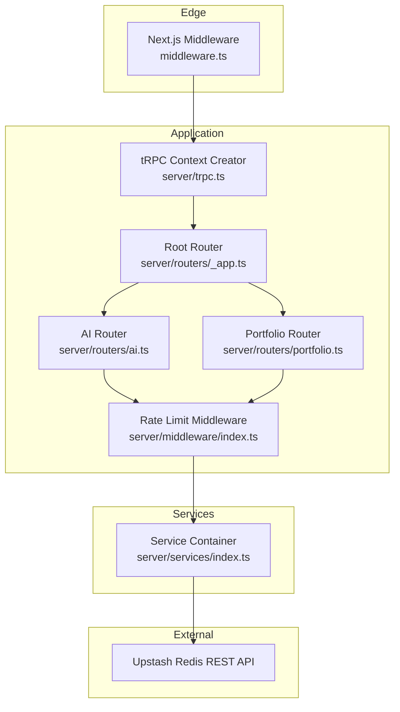
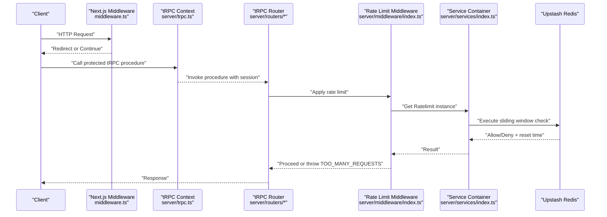
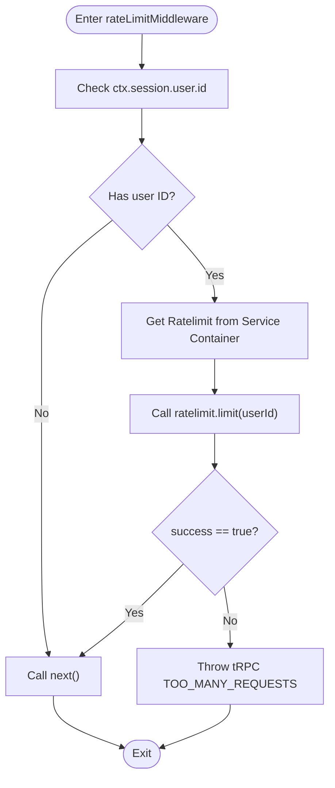
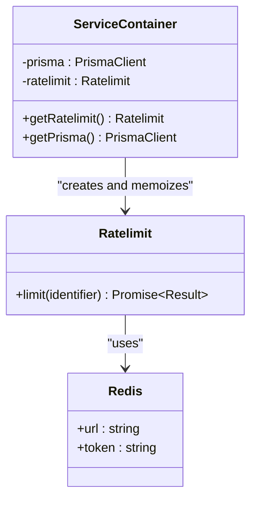
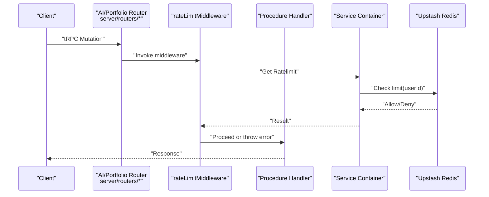
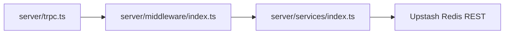

# Rate Limiting and Redis Integration

<cite>
**Referenced Files in This Document**
- [middleware.ts](file://middleware.ts)
- [server/middleware/index.ts](file://server/middleware/index.ts)
- [server/services/index.ts](file://server/services/index.ts)
- [server/trpc.ts](file://server/trpc.ts)
- [server/routers/_app.ts](file://server/routers/_app.ts)
- [server/routers/ai.ts](file://server/routers/ai.ts)
- [server/routers/portfolio.ts](file://server/routers/portfolio.ts)
- [SETUP.md](file://SETUP.md)
- [docs/ARCHITECTURE.md](file://docs/ARCHITECTURE.md)
</cite>

## Table of Contents
1. [Introduction](#introduction)
2. [Project Structure](#project-structure)
3. [Core Components](#core-components)
4. [Architecture Overview](#architecture-overview)
5. [Detailed Component Analysis](#detailed-component-analysis)
6. [Dependency Analysis](#dependency-analysis)
7. [Performance Considerations](#performance-considerations)
8. [Monitoring and Alerting](#monitoring-and-alerting)
9. [Customization and Extension Guide](#customization-and-extension-guide)
10. [Troubleshooting Guide](#troubleshooting-guide)
11. [Conclusion](#conclusion)

## Introduction
This document explains Smartfolio’s rate limiting implementation powered by Upstash Redis. It covers the Ratelimit configuration, the sliding window algorithm, and Redis integration patterns. You will learn how to apply rate limits to API endpoints, user actions, and system resources, along with configuration, monitoring, alerting, performance considerations, connection management, and failover strategies. Guidance is also provided for customizing policies and extending the system.

## Project Structure
Smartfolio integrates rate limiting at the tRPC middleware layer and uses Upstash Redis for distributed rate limiting. The relevant pieces are:
- tRPC middleware that enforces per-user rate limits
- A service container that initializes Upstash Redis and exposes a shared Ratelimit instance
- tRPC routers for protected endpoints that benefit from rate limiting
- Environment configuration for Upstash credentials

**Diagram sources**
- [middleware.ts](file://middleware.ts#L44-L81)
- [server/trpc.ts](file://server/trpc.ts#L12-L20)
- [server/routers/_app.ts](file://server/routers/_app.ts#L12-L18)
- [server/routers/ai.ts](file://server/routers/ai.ts#L1-L105)
- [server/routers/portfolio.ts](file://server/routers/portfolio.ts#L1-L115)
- [server/middleware/index.ts](file://server/middleware/index.ts#L13-L36)
- [server/services/index.ts](file://server/services/index.ts#L91-L103)

**Section sources**
- [middleware.ts](file://middleware.ts#L44-L81)
- [server/trpc.ts](file://server/trpc.ts#L12-L20)
- [server/routers/_app.ts](file://server/routers/_app.ts#L12-L18)
- [server/routers/ai.ts](file://server/routers/ai.ts#L1-L105)
- [server/routers/portfolio.ts](file://server/routers/portfolio.ts#L1-L115)
- [server/middleware/index.ts](file://server/middleware/index.ts#L13-L36)
- [server/services/index.ts](file://server/services/index.ts#L91-L103)

## Core Components
- Rate limit middleware: Enforces per-user rate limits on protected tRPC procedures. It retrieves the Ratelimit instance from the service container and calls limit with the user identifier. On failure, it logs and allows the request to proceed to avoid blocking legitimate traffic.
- Service container: Lazily initializes Upstash Redis and a Ratelimit instance configured with a sliding window algorithm. The default policy is 10 requests per 10 seconds.
- tRPC context: Provides authenticated session data to procedures, enabling the middleware to derive the user identifier.
- Routers: Protected endpoints under the AI and Portfolio routers are prime candidates for rate limiting.

Key implementation references:
- Middleware invocation and error handling: [server/middleware/index.ts](file://server/middleware/index.ts#L13-L36)
- Ratelimit initialization with Upstash Redis: [server/services/index.ts](file://server/services/index.ts#L91-L103)
- tRPC context creation with session: [server/trpc.ts](file://server/trpc.ts#L12-L20)
- Protected AI router mutations: [server/routers/ai.ts](file://server/routers/ai.ts#L22-L52)
- Protected Portfolio router mutations: [server/routers/portfolio.ts](file://server/routers/portfolio.ts#L39-L94)

**Section sources**
- [server/middleware/index.ts](file://server/middleware/index.ts#L13-L36)
- [server/services/index.ts](file://server/services/index.ts#L91-L103)
- [server/trpc.ts](file://server/trpc.ts#L12-L20)
- [server/routers/ai.ts](file://server/routers/ai.ts#L22-L52)
- [server/routers/portfolio.ts](file://server/routers/portfolio.ts#L39-L94)

## Architecture Overview
The rate limiting architecture follows a layered approach:
- Edge routing: Next.js middleware protects public routes and performs session validation.
- tRPC layer: Protected procedures receive a validated session and are wrapped by rate limiting middleware.
- Service layer: The Ratelimit instance uses Upstash Redis to maintain counters and enforce limits.
- Failure behavior: Redis errors are caught and logged; requests proceed to preserve availability.

**Diagram sources**
- [middleware.ts](file://middleware.ts#L44-L81)
- [server/trpc.ts](file://server/trpc.ts#L12-L20)
- [server/routers/_app.ts](file://server/routers/_app.ts#L12-L18)
- [server/middleware/index.ts](file://server/middleware/index.ts#L13-L36)
- [server/services/index.ts](file://server/services/index.ts#L91-L103)

## Detailed Component Analysis

### Rate Limit Middleware
The middleware enforces per-user rate limits:
- It checks for a valid authenticated session and derives the user identifier.
- It obtains the Ratelimit instance from the service container and invokes limit with the user ID.
- If the limit is exceeded, it throws a tRPC TOO_MANY_REQUESTS error; otherwise, it proceeds.
- On any error during rate limiting, it logs and continues to avoid impacting user experience.

**Diagram sources**
- [server/middleware/index.ts](file://server/middleware/index.ts#L13-L36)

**Section sources**
- [server/middleware/index.ts](file://server/middleware/index.ts#L13-L36)

### Service Container and Upstash Redis
The service container initializes Upstash Redis and a Ratelimit instance:
- Redis client is created using environment variables for URL and token.
- Ratelimit is configured with a sliding window algorithm and a default policy of 10 requests per 10 seconds.
- The Ratelimit instance is memoized as a singleton to reuse connections efficiently.

**Diagram sources**
- [server/services/index.ts](file://server/services/index.ts#L91-L103)

**Section sources**
- [server/services/index.ts](file://server/services/index.ts#L91-L103)

### Sliding Window Algorithm
The sliding window algorithm ensures smooth rate limiting:
- It maintains a time window and counts requests within that window.
- Resets occur automatically at the end of each window, preventing burstiness.
- The default configuration is 10 requests per 10 seconds, suitable for moderate workspaces and AI generation.

References:
- Ratelimit configuration with sliding window: [server/services/index.ts](file://server/services/index.ts#L98)

**Section sources**
- [server/services/index.ts](file://server/services/index.ts#L98)

### Applying Rate Limits to API Endpoints
Protected tRPC procedures benefit from rate limiting:
- AI generation endpoints: [server/routers/ai.ts](file://server/routers/ai.ts#L22-L52)
- Portfolio management endpoints: [server/routers/portfolio.ts](file://server/routers/portfolio.ts#L39-L94)
- Apply the middleware at the router level or per procedure as needed.

**Diagram sources**
- [server/routers/ai.ts](file://server/routers/ai.ts#L22-L52)
- [server/routers/portfolio.ts](file://server/routers/portfolio.ts#L39-L94)
- [server/middleware/index.ts](file://server/middleware/index.ts#L13-L36)
- [server/services/index.ts](file://server/services/index.ts#L91-L103)

**Section sources**
- [server/routers/ai.ts](file://server/routers/ai.ts#L22-L52)
- [server/routers/portfolio.ts](file://server/routers/portfolio.ts#L39-L94)
- [server/middleware/index.ts](file://server/middleware/index.ts#L13-L36)
- [server/services/index.ts](file://server/services/index.ts#L91-L103)

### Practical Examples

- API endpoints: Wrap tRPC mutations in the rate limit middleware to protect AI generation and portfolio operations.
- User actions: Apply rate limiting to frequent actions like publishing or bulk updates to prevent abuse.
- System resources: Protect expensive operations such as large AI generations or batch processing.

Guidance:
- Use per-user identifiers for fairness and to prevent gaming.
- Consider different policies for free vs. paid tiers if you extend usage limits later.

**Section sources**
- [server/middleware/index.ts](file://server/middleware/index.ts#L13-L36)
- [server/routers/ai.ts](file://server/routers/ai.ts#L22-L52)
- [server/routers/portfolio.ts](file://server/routers/portfolio.ts#L39-L94)

## Dependency Analysis
The rate limiting system depends on:
- tRPC context for session data
- Service container for the Ratelimit instance
- Upstash Redis for distributed counters

**Diagram sources**
- [server/trpc.ts](file://server/trpc.ts#L12-L20)
- [server/middleware/index.ts](file://server/middleware/index.ts#L13-L36)
- [server/services/index.ts](file://server/services/index.ts#L91-L103)

**Section sources**
- [server/trpc.ts](file://server/trpc.ts#L12-L20)
- [server/middleware/index.ts](file://server/middleware/index.ts#L13-L36)
- [server/services/index.ts](file://server/services/index.ts#L91-L103)

## Performance Considerations
- Connection reuse: The service container memoizes the Ratelimit instance to reuse Redis connections.
- Non-blocking behavior: On Redis errors, the middleware logs and continues, ensuring resilience.
- Window sizing: The default 10 requests per 10 seconds balances user experience and abuse prevention; adjust based on observed usage.
- Caching: Consider caching frequently accessed counters at the application level if needed, while keeping the authoritative source in Redis.

**Section sources**
- [server/services/index.ts](file://server/services/index.ts#L91-L103)
- [server/middleware/index.ts](file://server/middleware/index.ts#L30-L33)

## Monitoring and Alerting
Recommended strategies:
- Metrics: Track request rates, success/failure ratios, and latency to Redis.
- Alerts: Notify on sustained high failure rates or Redis connectivity issues.
- Logs: Capture rate limit violations and middleware errors for forensic analysis.
- Health checks: Periodically probe Redis endpoints to detect outages early.

[No sources needed since this section provides general guidance]

## Customization and Extension Guide
To customize rate limiting policies:
- Adjust the sliding window parameters in the service container to match desired throughput and window duration.
- Introduce tiered policies by user role or subscription plan.
- Add endpoint-specific policies by passing different keys or window sizes in the middleware.
- Extend the middleware to support IP-based or endpoint-based limits alongside user-based limits.

Implementation pointers:
- Modify Ratelimit configuration: [server/services/index.ts](file://server/services/index.ts#L93-L100)
- Apply middleware to routers: [server/middleware/index.ts](file://server/middleware/index.ts#L13-L36)
- Define per-endpoint policies in router procedures as needed.

**Section sources**
- [server/services/index.ts](file://server/services/index.ts#L93-L100)
- [server/middleware/index.ts](file://server/middleware/index.ts#L13-L36)

## Troubleshooting Guide
Common issues and resolutions:
- Redis connectivity failures: The middleware catches errors and logs them, allowing requests to proceed. Verify environment variables and network access.
- Misconfigured environment variables: Ensure Upstash Redis URL and token are set correctly.
- Unexpected rate limit hits: Review the sliding window configuration and consider increasing capacity for peak usage.

References:
- Error handling in middleware: [server/middleware/index.ts](file://server/middleware/index.ts#L30-L33)
- Environment variables reference: [SETUP.md](file://SETUP.md#L132-L134)
- Architecture note on rate limiting: [docs/ARCHITECTURE.md](file://docs/ARCHITECTURE.md#L278)

**Section sources**
- [server/middleware/index.ts](file://server/middleware/index.ts#L30-L33)
- [SETUP.md](file://SETUP.md#L132-L134)
- [docs/ARCHITECTURE.md](file://docs/ARCHITECTURE.md#L278)

## Conclusion
Smartfolio’s rate limiting leverages Upstash Redis with a sliding window algorithm and a per-user policy. The middleware integrates seamlessly with tRPC protected procedures, providing robust protection against abuse while maintaining resilience through graceful error handling. By adjusting window sizes, adding tiered policies, and monitoring performance, you can tailor the system to your workload and scale safely.