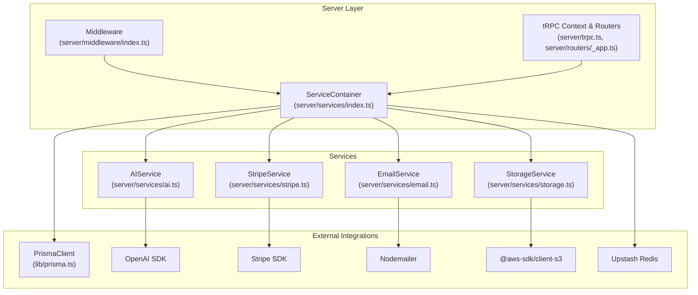
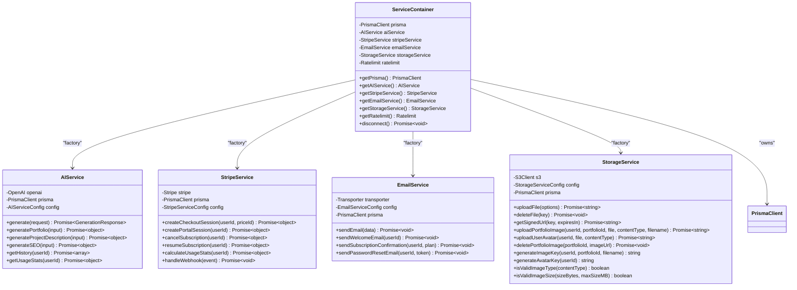
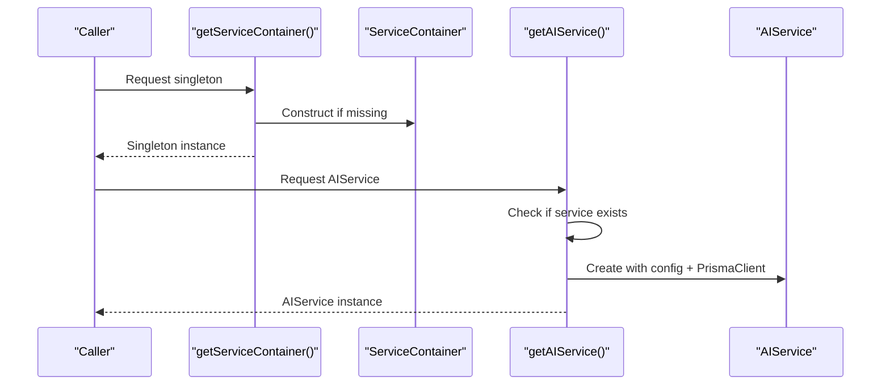
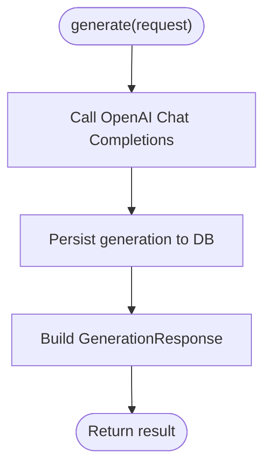
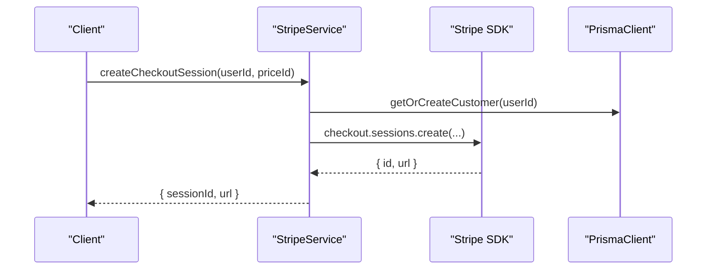
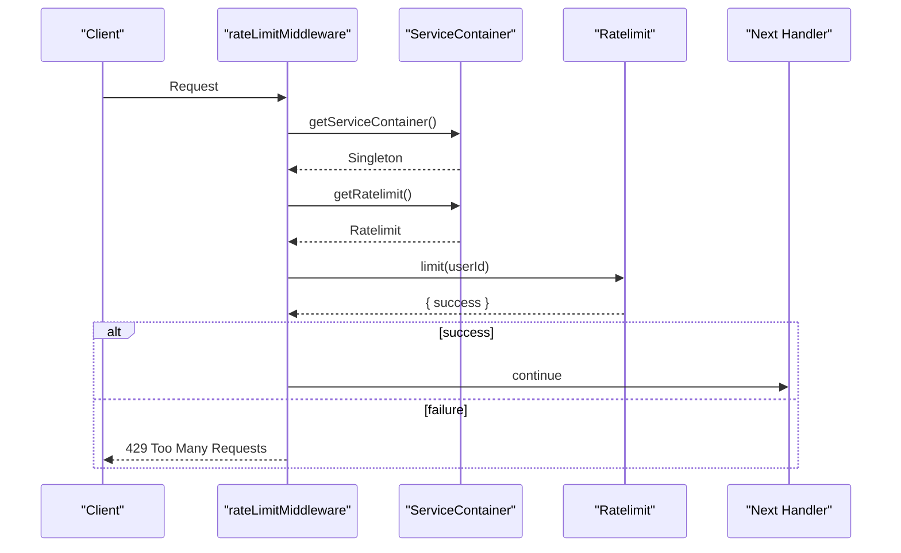
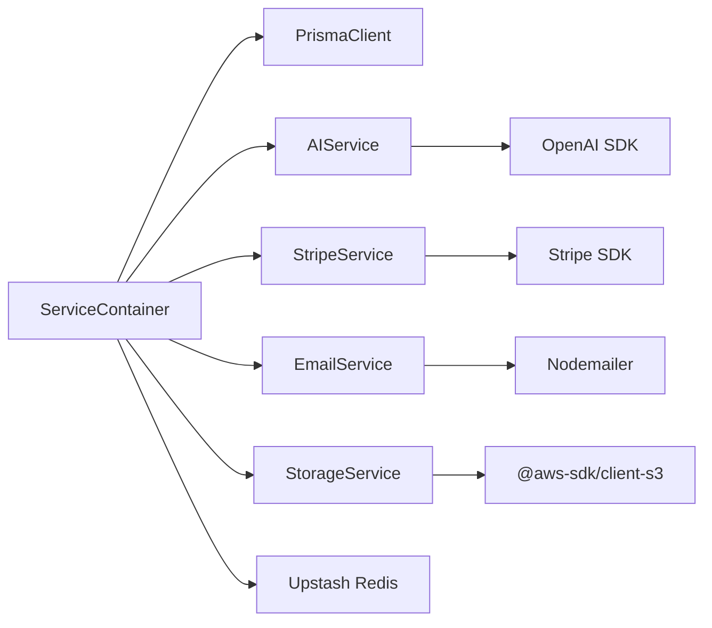

# Service Container Architecture

<cite>
**Referenced Files in This Document**
- [server/services/index.ts](file://server/services/index.ts)
- [server/services/ai.ts](file://server/services/ai.ts)
- [server/services/stripe.ts](file://server/services/stripe.ts)
- [server/services/email.ts](file://server/services/email.ts)
- [server/services/storage.ts](file://server/services/storage.ts)
- [server/middleware/index.ts](file://server/middleware/index.ts)
- [server/trpc.ts](file://server/trpc.ts)
- [lib/prisma.ts](file://lib/prisma.ts)
- [.env.example](file://.env.example)
- [package.json](file://package.json)
</cite>

## Table of Contents
1. [Introduction](#introduction)
2. [Project Structure](#project-structure)
3. [Core Components](#core-components)
4. [Architecture Overview](#architecture-overview)
5. [Detailed Component Analysis](#detailed-component-analysis)
6. [Dependency Analysis](#dependency-analysis)
7. [Performance Considerations](#performance-considerations)
8. [Troubleshooting Guide](#troubleshooting-guide)
9. [Conclusion](#conclusion)

## Introduction
This document explains Smartfolio's Service Container architecture, focusing on the singleton pattern, dependency injection strategy, and service lifecycle management. It documents the ServiceContainer class structure, initialization process, and service factory methods, along with practical examples of accessing services, configuration options, and environment variable integration. It also covers service instantiation patterns, memory management, cleanup procedures, and guidance for extending the service container with new service dependencies.

## Project Structure
Smartfolio organizes backend services under a dedicated services module with a central container that lazily instantiates domain-specific services. The middleware integrates the container to enforce rate limiting and usage checks. Environment variables configure external integrations such as AI providers, billing systems, email transports, and storage backends.

**Diagram sources**
- [server/services/index.ts](file://server/services/index.ts#L9-L108)
- [server/services/ai.ts](file://server/services/ai.ts#L28-L39)
- [server/services/stripe.ts](file://server/services/stripe.ts#L13-L22)
- [server/services/email.ts](file://server/services/email.ts#L25-L42)
- [server/services/storage.ts](file://server/services/storage.ts#L19-L34)
- [server/middleware/index.ts](file://server/middleware/index.ts#L7-L36)
- [server/trpc.ts](file://server/trpc.ts#L1-L61)
- [lib/prisma.ts](file://lib/prisma.ts#L1-L14)

**Section sources**
- [server/services/index.ts](file://server/services/index.ts#L1-L118)
- [server/middleware/index.ts](file://server/middleware/index.ts#L1-L153)
- [server/trpc.ts](file://server/trpc.ts#L1-L61)
- [lib/prisma.ts](file://lib/prisma.ts#L1-L14)

## Core Components
- ServiceContainer: Central orchestrator implementing a singleton pattern with lazy-initialized services. It holds a shared PrismaClient and exposes factory methods for AI, Stripe, Email, Storage, and RateLimit services. It provides a disconnect method to gracefully close database connections.
- Domain Services: Each service encapsulates a specific integration (AI, Billing, Email, Storage) and depends on PrismaClient for persistence.
- Middleware Integration: Uses the singleton container to enforce rate limiting and usage quotas via Prisma-backed checks.
- Environment Configuration: Extensive environment variables drive service configuration for external providers.

Key implementation references:
- ServiceContainer class and singleton accessor: [server/services/index.ts](file://server/services/index.ts#L9-L118)
- PrismaClient initialization: [lib/prisma.ts](file://lib/prisma.ts#L1-L14)
- Middleware leveraging container: [server/middleware/index.ts](file://server/middleware/index.ts#L7-L36)

**Section sources**
- [server/services/index.ts](file://server/services/index.ts#L9-L118)
- [lib/prisma.ts](file://lib/prisma.ts#L1-L14)
- [server/middleware/index.ts](file://server/middleware/index.ts#L13-L36)

## Architecture Overview
The Service Container follows a layered architecture:
- Container Layer: Provides singletons and factories for services.
- Service Layer: Encapsulates third-party SDKs and domain logic.
- Middleware Layer: Enforces cross-cutting concerns using the container.
- External Integrations: Managed via environment variables and SDK clients.

**Diagram sources**
- [server/services/index.ts](file://server/services/index.ts#L9-L108)
- [server/services/ai.ts](file://server/services/ai.ts#L28-L39)
- [server/services/stripe.ts](file://server/services/stripe.ts#L13-L22)
- [server/services/email.ts](file://server/services/email.ts#L25-L42)
- [server/services/storage.ts](file://server/services/storage.ts#L19-L34)

## Detailed Component Analysis

### ServiceContainer: Singleton Pattern and Factory Methods
- Singleton Pattern: A module-level variable holds the single ServiceContainer instance. The accessor ensures one-time construction and reuse across the application.
- Lazy Initialization: Each service getter checks for an existing instance and constructs it only on first use, passing shared PrismaClient and environment-driven configuration.
- Shared Dependencies: PrismaClient is constructed once and reused by all services to minimize overhead and maintain transactional consistency where needed.
- Lifecycle Management: Provides a disconnect method to close Prisma connections during shutdown.

**Diagram sources**
- [server/services/index.ts](file://server/services/index.ts#L111-L118)
- [server/services/index.ts](file://server/services/index.ts#L25-L36)

**Section sources**
- [server/services/index.ts](file://server/services/index.ts#L9-L118)

### AIService: AI Provider Integration
- Purpose: Generates content using OpenAI Chat Completions, persists generation records, and provides convenience methods for portfolio, project description, and SEO metadata generation.
- Configuration: Reads API key and default model from environment variables via the container.
- Persistence: Uses PrismaClient to store generation logs and compute usage statistics per user.
- Usage Limits: Computes monthly usage and compares against plan limits.

**Diagram sources**
- [server/services/ai.ts](file://server/services/ai.ts#L41-L87)

**Section sources**
- [server/services/ai.ts](file://server/services/ai.ts#L1-L242)

### StripeService: Billing and Webhook Handling
- Purpose: Manages Stripe checkout sessions, billing portal sessions, subscription lifecycle, and webhook events.
- Configuration: Reads API key and price IDs from environment variables via the container.
- Customer Management: Creates or retrieves Stripe customers linked to user records.
- Usage Calculation: Computes usage counts for portfolios and AI generations to enforce plan limits.

**Diagram sources**
- [server/services/stripe.ts](file://server/services/stripe.ts#L24-L52)

**Section sources**
- [server/services/stripe.ts](file://server/services/stripe.ts#L1-L294)

### EmailService: SMTP Transport and Templates
- Purpose: Sends templated emails using SMTP transport and integrates with Prisma for user data.
- Configuration: SMTP host/port/secure/auth and sender identity are loaded from environment variables.
- Templates: Includes welcome, subscription confirmation, and password reset templates.

**Section sources**
- [server/services/email.ts](file://server/services/email.ts#L1-L177)

### StorageService: AWS S3 Integration
- Purpose: Uploads/deletes objects, generates signed URLs, and manages image/avatar keys for portfolios and users.
- Configuration: Region, access keys, and bucket are loaded from environment variables.
- Validation: Provides helpers to validate content types and sizes.

**Section sources**
- [server/services/storage.ts](file://server/services/storage.ts#L1-L170)

### Middleware Integration: Rate Limiting and Usage Checks
- Rate Limiting: Uses the singleton container to obtain a Ratelimit instance backed by Upstash Redis and applies per-user sliding window limits.
- Subscription and Admin Checks: Validates active subscriptions and admin roles using PrismaClient from the container.
- Usage Limits: Enforces plan-based limits for portfolios and AI generations.

**Diagram sources**
- [server/middleware/index.ts](file://server/middleware/index.ts#L13-L36)
- [server/services/index.ts](file://server/services/index.ts#L91-L103)

**Section sources**
- [server/middleware/index.ts](file://server/middleware/index.ts#L1-L153)
- [server/services/index.ts](file://server/services/index.ts#L91-L103)

## Dependency Analysis
- Internal Coupling: Services depend on PrismaClient for persistence; the container owns PrismaClient and injects it into each service. This reduces duplication and ensures consistent database access.
- External Dependencies: Each service integrates with a third-party SDK (OpenAI, Stripe, Nodemailer, AWS S3, Upstash Redis). These are configured via environment variables.
- Middleware Coupling: Middleware relies on the container for PrismaClient and Ratelimit instances, enabling centralized enforcement of policies.

**Diagram sources**
- [server/services/index.ts](file://server/services/index.ts#L1-L118)
- [server/services/ai.ts](file://server/services/ai.ts#L1-L2)
- [server/services/stripe.ts](file://server/services/stripe.ts#L1-L2)
- [server/services/email.ts](file://server/services/email.ts#L1-L2)
- [server/services/storage.ts](file://server/services/storage.ts#L1-L3)

**Section sources**
- [server/services/index.ts](file://server/services/index.ts#L1-L118)
- [package.json](file://package.json#L16-L37)

## Performance Considerations
- Lazy Initialization: Services are created only when requested, reducing startup overhead.
- Singleton Container: Ensures a single PrismaClient instance and shared SDK clients, minimizing connection overhead.
- Environment-Based Configuration: Avoids repeated parsing of environment variables by constructing configurations once per service.
- Cleanup: The container exposes a disconnect method to release Prisma resources during shutdown.

[No sources needed since this section provides general guidance]

## Troubleshooting Guide
- Missing Environment Variables: If any environment variables are absent, services may initialize with empty or default values. Verify required variables in the environment file.
- Rate Limiting Failures: The middleware catches rate limit errors and continues processing; investigate Upstash Redis connectivity and configuration.
- Database Connectivity: Ensure PrismaClient is properly initialized and connected. Use the container's disconnect method during graceful shutdown.
- Service Instantiation Errors: Confirm that external SDKs (OpenAI, Stripe, AWS, Redis) are configured correctly and reachable from the runtime environment.

**Section sources**
- [.env.example](file://.env.example#L1-L84)
- [server/services/index.ts](file://server/services/index.ts#L17-L19)
- [server/middleware/index.ts](file://server/middleware/index.ts#L30-L33)

## Conclusion
Smartfolio’s Service Container provides a clean, extensible foundation for managing domain services with lazy initialization, shared dependencies, and centralized lifecycle control. By leveraging a singleton container and environment-driven configuration, the system achieves predictable behavior, simplified testing, and straightforward extension for new services. The middleware layer demonstrates how the container enforces cross-cutting concerns consistently across the application.