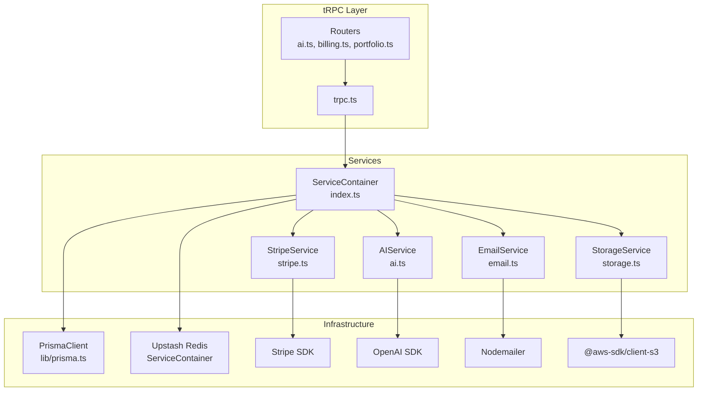
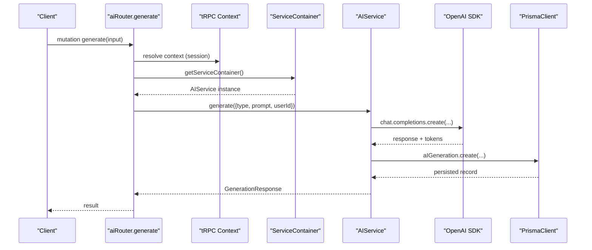
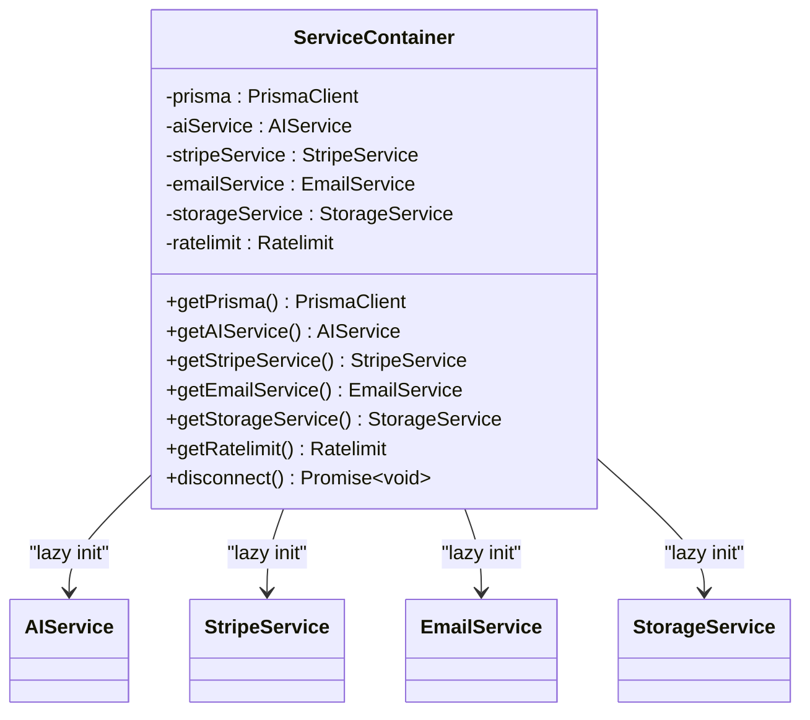
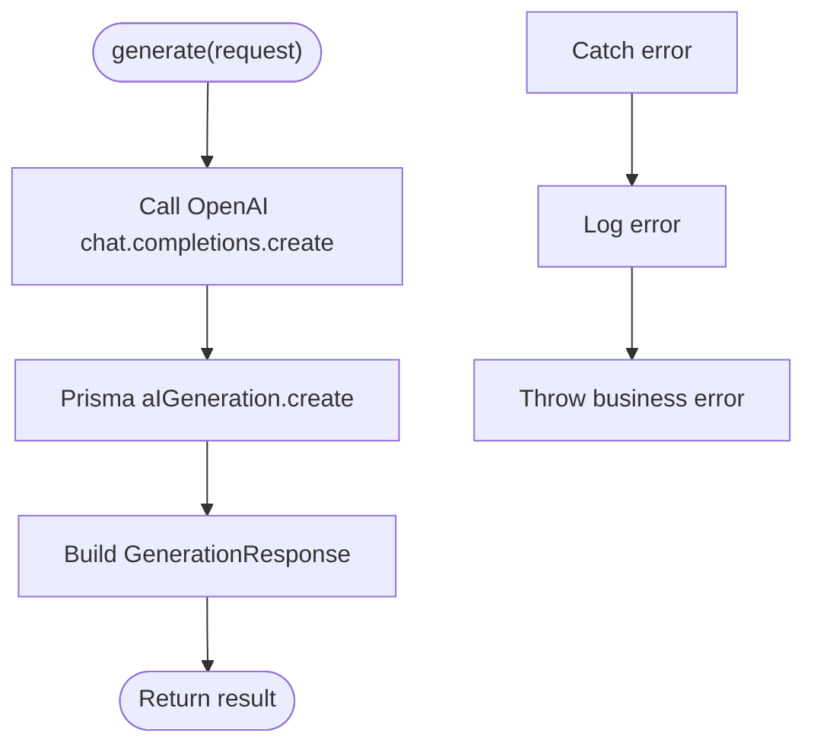
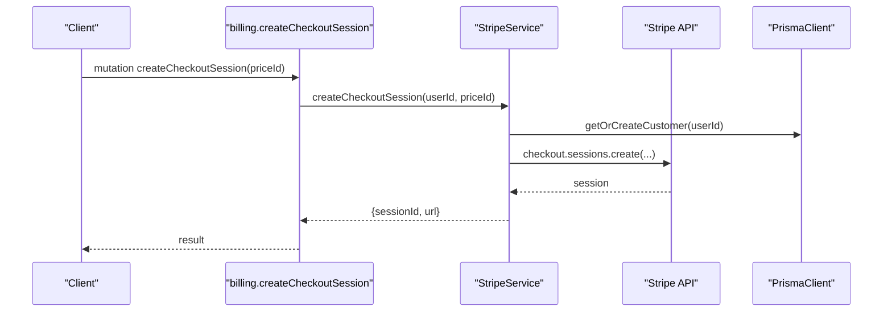
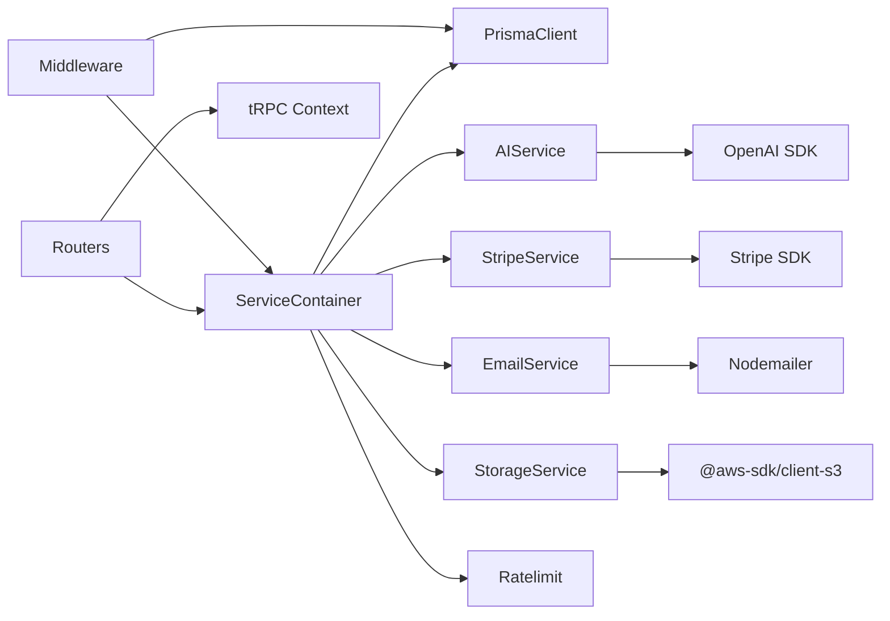

# Services Layer

<cite>
**Referenced Files in This Document**
- [index.ts](file://server/services/index.ts)
- [ai.ts](file://server/services/ai.ts)
- [email.ts](file://server/services/email.ts)
- [storage.ts](file://server/services/storage.ts)
- [stripe.ts](file://server/services/stripe.ts)
- [_app.ts](file://server/routers/_app.ts)
- [ai.ts](file://server/routers/ai.ts)
- [billing.ts](file://server/routers/billing.ts)
- [portfolio.ts](file://server/routers/portfolio.ts)
- [trpc.ts](file://server/trpc.ts)
- [index.ts](file://server/middleware/index.ts)
- [caller.ts](file://server/caller.ts)
- [auth.ts](file://lib/auth.ts)
- [prisma.ts](file://lib/prisma.ts)
- [schema.prisma](file://prisma/schema.prisma)
- [common.ts](file://types/common.ts)
</cite>

## Table of Contents
1. [Introduction](#introduction)
2. [Project Structure](#project-structure)
3. [Core Components](#core-components)
4. [Architecture Overview](#architecture-overview)
5. [Detailed Component Analysis](#detailed-component-analysis)
6. [Dependency Analysis](#dependency-analysis)
7. [Performance Considerations](#performance-considerations)
8. [Troubleshooting Guide](#troubleshooting-guide)
9. [Conclusion](#conclusion)
10. [Appendices](#appendices)

## Introduction
This document describes the services layer that implements Smartfolio’s business logic. It covers the service container architecture, AI services, email services, file storage services, and Stripe integration services. It explains how services are initialized, configured, and consumed via tRPC routers, along with dependency injection patterns, error handling, rate limiting, usage limits, and extension guidelines.

## Project Structure
The services layer is organized under server/services and is consumed by tRPC routers. The ServiceContainer lazily initializes each service with environment-driven configuration and shares a single PrismaClient instance across services. Middleware enforces rate limiting and usage quotas.

**Diagram sources**
- [index.ts](file://server/services/index.ts#L9-L108)
- [ai.ts](file://server/services/ai.ts#L28-L39)
- [stripe.ts](file://server/services/stripe.ts#L13-L22)
- [email.ts](file://server/services/email.ts#L25-L42)
- [storage.ts](file://server/services/storage.ts#L19-L34)
- [trpc.ts](file://server/trpc.ts#L12-L20)
- [prisma.ts](file://lib/prisma.ts#L7-L13)

**Section sources**
- [index.ts](file://server/services/index.ts#L1-L118)
- [trpc.ts](file://server/trpc.ts#L1-L61)
- [prisma.ts](file://lib/prisma.ts#L1-L14)

## Core Components
- ServiceContainer: Centralized factory and singleton for services, with lazy initialization and shared PrismaClient. Provides accessors for AIService, StripeService, EmailService, StorageService, and Upstash Ratelimit.
- AIService: Integrates OpenAI chat completions, persists generations, and exposes convenience methods for portfolio content, project descriptions, and SEO metadata. Tracks usage per user and enforces plan-based limits.
- StripeService: Manages Stripe checkout sessions, billing portal sessions, subscription lifecycle, and webhook handling. Synchronizes subscription state with the database.
- EmailService: Sends templated emails via SMTP using Nodemailer, with welcome, subscription confirmation, and password reset templates.
- StorageService: Wraps AWS S3 client to upload/delete/get signed URLs, with helpers for portfolio images and avatars, including validation and metadata tagging.

**Section sources**
- [index.ts](file://server/services/index.ts#L9-L118)
- [ai.ts](file://server/services/ai.ts#L28-L242)
- [stripe.ts](file://server/services/stripe.ts#L13-L294)
- [email.ts](file://server/services/email.ts#L25-L177)
- [storage.ts](file://server/services/storage.ts#L19-L170)

## Architecture Overview
The services layer follows a layered architecture:
- Presentation: tRPC routers expose protected procedures to clients.
- Application: Middleware validates authentication, applies rate limits, and enforces usage quotas.
- Domain: Services encapsulate business logic and integrate with external APIs.
- Infrastructure: Prisma ORM, Upstash Redis, Stripe, OpenAI, and AWS S3.

**Diagram sources**
- [ai.ts](file://server/routers/ai.ts#L22-L31)
- [trpc.ts](file://server/trpc.ts#L50-L60)
- [index.ts](file://server/services/index.ts#L25-L36)
- [ai.ts](file://server/services/ai.ts#L41-L87)
- [prisma.ts](file://lib/prisma.ts#L7-L13)

## Detailed Component Analysis

### ServiceContainer
Responsibilities:
- Provide singleton instances of services with environment-configured parameters.
- Share a single PrismaClient across services.
- Initialize Upstash Redis for sliding-window rate limiting.

Patterns:
- Lazy initialization with memoization for services and rate limiter.
- Singleton accessor for the container.

Lifecycle:
- Construct PrismaClient on instantiation.
- Expose disconnect() to release database connections.

**Diagram sources**
- [index.ts](file://server/services/index.ts#L9-L108)

**Section sources**
- [index.ts](file://server/services/index.ts#L9-L118)

### AIService
Responsibilities:
- Generate AI content via OpenAI chat completions.
- Persist generation records with tokens used and provider metadata.
- Provide domain-specific generators: portfolio content, project descriptions, SEO metadata.
- Compute usage statistics per user and enforce plan-based limits.

Integration:
- Uses OpenAI SDK configured via OPENAI_API_KEY.
- Persists to AIGeneration model via Prisma.

Usage examples (paths):
- Router mutation: [ai.ts](file://server/routers/ai.ts#L22-L31)
- Portfolio generator: [ai.ts](file://server/routers/ai.ts#L45-L52)
- Project description generator: [ai.ts](file://server/routers/ai.ts#L64-L71)
- SEO generator: [ai.ts](file://server/routers/ai.ts#L82-L89)

**Diagram sources**
- [ai.ts](file://server/services/ai.ts#L41-L87)

**Section sources**
- [ai.ts](file://server/services/ai.ts#L28-L242)
- [schema.prisma](file://prisma/schema.prisma#L214-L229)

### StripeService
Responsibilities:
- Create Stripe Checkout sessions and Billing Portal sessions.
- Manage subscription lifecycle: cancel/resume with persistence updates.
- Handle Stripe webhooks to synchronize subscription state.
- Calculate usage stats against plan limits.

Integration:
- Uses Stripe SDK configured via STRIPE_SECRET_KEY and price IDs.
- Persists and updates Subscription and Payment models.

Usage examples (paths):
- Create checkout session: [billing.ts](file://server/routers/billing.ts#L23-L30)
- Create portal session: [billing.ts](file://server/routers/billing.ts#L33-L37)
- Cancel subscription: [billing.ts](file://server/routers/billing.ts#L39-L44)
- Resume subscription: [billing.ts](file://server/routers/billing.ts#L46-L51)
- Webhook handler: [stripe.ts](file://server/services/stripe.ts#L115-L130)

**Diagram sources**
- [billing.ts](file://server/routers/billing.ts#L16-L30)
- [stripe.ts](file://server/services/stripe.ts#L24-L52)
- [stripe.ts](file://server/services/stripe.ts#L172-L209)

**Section sources**
- [stripe.ts](file://server/services/stripe.ts#L13-L294)
- [schema.prisma](file://prisma/schema.prisma#L172-L208)

### EmailService
Responsibilities:
- Send generic HTML/text emails via SMTP.
- Provide domain-specific templates: welcome, subscription confirmation, password reset.
- Uses Nodemailer with configurable SMTP settings and sender identity.

Usage examples (paths):
- Welcome email: [email.ts](file://server/services/email.ts#L59-L73)
- Subscription confirmation: [email.ts](file://server/services/email.ts#L75-L89)
- Password reset: [email.ts](file://server/services/email.ts#L91-L106)

**Section sources**
- [email.ts](file://server/services/email.ts#L25-L177)

### StorageService
Responsibilities:
- Upload/delete S3 objects and generate signed URLs.
- Provide helpers for portfolio images and user avatars with metadata tagging.
- Validate content types and sizes.

Usage examples (paths):
- Upload portfolio image: [storage.ts](file://server/services/storage.ts#L84-L107)
- Upload user avatar: [storage.ts](file://server/services/storage.ts#L109-L131)
- Delete portfolio image: [storage.ts](file://server/services/storage.ts#L133-L144)

**Section sources**
- [storage.ts](file://server/services/storage.ts#L19-L170)

### Middleware and Usage Controls
- Rate limiting: Sliding window via Upstash Redis; enforced per user ID.
- Subscription check: Ensures ACTIVE subscription for premium features.
- Usage limit checks: Enforce plan-based limits for portfolios and AI generations.

**Section sources**
- [index.ts](file://server/middleware/index.ts#L13-L36)
- [index.ts](file://server/middleware/index.ts#L42-L62)
- [index.ts](file://server/middleware/index.ts#L91-L152)

## Dependency Analysis
- ServiceContainer depends on environment variables for external service configuration and owns PrismaClient.
- Services depend on their respective SDKs and Prisma for persistence.
- Routers depend on ServiceContainer to obtain service instances and on tRPC context for authentication.
- Middleware depends on ServiceContainer for rate limiting and on Prisma for usage checks.

**Diagram sources**
- [index.ts](file://server/services/index.ts#L1-L118)
- [ai.ts](file://server/services/ai.ts#L1-L3)
- [stripe.ts](file://server/services/stripe.ts#L1-L2)
- [email.ts](file://server/services/email.ts#L1)
- [storage.ts](file://server/services/storage.ts#L1-L3)
- [ai.ts](file://server/routers/ai.ts#L1-L4)
- [billing.ts](file://server/routers/billing.ts#L1-L4)
- [index.ts](file://server/middleware/index.ts#L1-L8)

**Section sources**
- [index.ts](file://server/services/index.ts#L1-L118)
- [ai.ts](file://server/routers/ai.ts#L1-L105)
- [billing.ts](file://server/routers/billing.ts#L1-L71)
- [index.ts](file://server/middleware/index.ts#L1-L153)

## Performance Considerations
- Rate limiting: Sliding window reduces bursty traffic; failures are handled gracefully to avoid blocking requests.
- Caching: Consider caching frequently accessed user subscription and plan data at the service level to reduce database queries.
- Batch operations: Group database writes where possible to minimize round-trips.
- External API timeouts: Configure SDK timeouts for OpenAI, Stripe, and S3 to prevent long blocking calls.
- Monitoring: Integrate metrics collection for AI token usage, Stripe webhook processing latency, and S3 upload durations.

[No sources needed since this section provides general guidance]

## Troubleshooting Guide
Common issues and resolutions:
- AI generation errors: Inspect logs for OpenAI SDK exceptions; ensure OPENAI_API_KEY is set and valid.
- Email delivery failures: Verify SMTP configuration and credentials; confirm sender identity matches provider requirements.
- S3 upload failures: Check AWS credentials, bucket permissions, and region configuration; validate content type and size constraints.
- Stripe webhook mismatches: Confirm webhook secret and endpoint URL; ensure event payload parsing handles missing fields.
- Rate limit exceeded: Adjust sliding window parameters or increase Redis capacity; implement client-side backoff.

**Section sources**
- [ai.ts](file://server/services/ai.ts#L83-L86)
- [email.ts](file://server/services/email.ts#L53-L57)
- [storage.ts](file://server/services/storage.ts#L50-L54)
- [stripe.ts](file://server/services/stripe.ts#L115-L130)
- [index.ts](file://server/middleware/index.ts#L20-L33)

## Conclusion
The services layer cleanly separates business logic from presentation and infrastructure concerns. It leverages a service container for dependency injection, integrates external APIs securely via environment configuration, and enforces usage controls through middleware. The modular design supports easy extension and maintenance.

[No sources needed since this section summarizes without analyzing specific files]

## Appendices

### Service Usage Examples (Paths)
- AI generation: [ai.ts](file://server/routers/ai.ts#L22-L31)
- Portfolio content generation: [ai.ts](file://server/routers/ai.ts#L45-L52)
- Project description generation: [ai.ts](file://server/routers/ai.ts#L64-L71)
- SEO metadata generation: [ai.ts](file://server/routers/ai.ts#L82-L89)
- Get AI history: [ai.ts](file://server/routers/ai.ts#L91-L96)
- Get AI usage stats: [ai.ts](file://server/routers/ai.ts#L98-L103)
- Create checkout session: [billing.ts](file://server/routers/billing.ts#L23-L30)
- Create billing portal session: [billing.ts](file://server/routers/billing.ts#L33-L37)
- Cancel subscription: [billing.ts](file://server/routers/billing.ts#L39-L44)
- Resume subscription: [billing.ts](file://server/routers/billing.ts#L46-L51)
- Get usage stats: [billing.ts](file://server/routers/billing.ts#L65-L69)
- List portfolios: [portfolio.ts](file://server/routers/portfolio.ts#L6-L13)
- Create portfolio: [portfolio.ts](file://server/routers/portfolio.ts#L39-L54)
- Update portfolio: [portfolio.ts](file://server/routers/portfolio.ts#L68-L80)
- Delete portfolio: [portfolio.ts](file://server/routers/portfolio.ts#L84-L94)
- Publish portfolio: [portfolio.ts](file://server/routers/portfolio.ts#L99-L113)

### Environment Variables
- OpenAI: OPENAI_API_KEY
- Stripe: STRIPE_SECRET_KEY, STRIPE_PRICE_ID_PRO, STRIPE_PRICE_ID_ENTERPRISE
- SMTP: SMTP_HOST, SMTP_PORT, SMTP_SECURE, SMTP_USER, SMTP_PASS, EMAIL_FROM_NAME, EMAIL_FROM_EMAIL
- AWS S3: AWS_REGION, AWS_ACCESS_KEY_ID, AWS_SECRET_ACCESS_KEY, AWS_S3_BUCKET
- Redis: UPSTASH_REDIS_REST_URL, UPSTASH_REDIS_REST_TOKEN
- Next Public URL: NEXT_PUBLIC_APP_URL

**Section sources**
- [index.ts](file://server/services/index.ts#L28-L47)
- [email.ts](file://server/services/email.ts#L57-L69)
- [storage.ts](file://server/services/storage.ts#L78-L84)
- [stripe.ts](file://server/services/stripe.ts#L18-L22)

### Extending Services
Steps to add a new service:
1. Create a new service class under server/services with a constructor accepting a config object and PrismaClient.
2. Add a getter method in ServiceContainer to lazily initialize and cache the service.
3. Register the service in the router(s) that need it, obtaining it via getServiceContainer().
4. Add appropriate tRPC procedures and middleware where needed.
5. Define environment variables and update documentation.

Guidelines:
- Keep services stateless except for SDK clients and Prisma.
- Centralize configuration in ServiceContainer getters.
- Wrap external API calls with try/catch and throw domain-specific errors.
- Use Prisma transactions for operations affecting multiple models.
- Apply rate limiting and usage checks via middleware.

**Section sources**
- [index.ts](file://server/services/index.ts#L25-L103)
- [trpc.ts](file://server/trpc.ts#L50-L60)